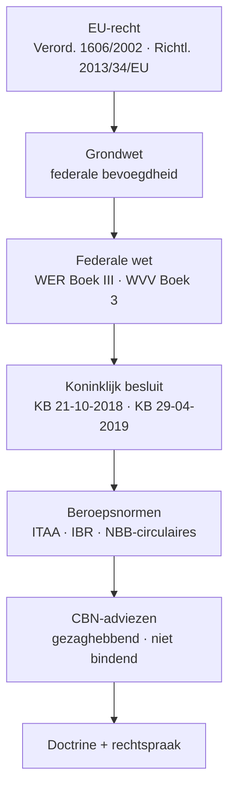

> **Leerstuk — één vraag, helemaal doorgewerkt.** Dit is de entry-fiche voor PO 1.2: eerst snappen *welke regels* het boekhouden in België sturen en *wie* ze afdwingt. Wie boekhoudplichtig is staat in [[wie-moet-boekhouden-en-hoe]], de grootte- en schemakeuze in [[vennootschap-grootte-en-schema-keuze]], en publicatie + sancties in [[jaarrekening-publiceren-en-sancties]]. Voor verhaal en routekaart: [[studiemateriaal/1-2|overzicht PO 1.2]].

## Antwoord in één blik

Belgisch boekhoudrecht is **het geheel van regels dat bepaalt wie moet boekhouden, hoe, en hoe daarover wordt gerapporteerd**. Drie kernwetten dragen het: het Wetboek van Economisch Recht (Boek III) regelt het voeren van de boekhouding, het Wetboek van Vennootschappen en Verenigingen (Boek 3) regelt de jaarrekening, en twee uitvoerings-KB's vullen beide concreet in. Daarboven staan EU-regels en de Grondwet; daaronder vind je beroepsnormen, CBN-adviezen en doctrine. Zes autoriteiten — CBN, NBB, FSMA, ITAA, IBR, CRB — verdelen de uitvoering: bewust polycentrisch, geen alleenheerser.

We bouwen het bronnen-veld op aan de hand van een dunne bindcase: **Bourdon BV**, een engineering-bureau in Mechelen, dochter van Vermeer NV. Zijn boekhouder moet weten waar elke regel vandaan komt — die landkaart leggen we hier neer. Eens je deze zes lagen plus de zes autoriteiten paraat hebt, is elke volgende vraag in PO 1.2 een toepassing.

---

## Waarom een eigen rechtstak boekhoudrecht?

Boekhouden is in essentie een vaktechniek. Waarom is er dan apart *recht* nodig? Omdat de jaarrekening drie functies tegelijk vervult die elk een derde-belang dienen. Ze informeert aandeelhouders, schuldeisers en werknemers over de toestand van de onderneming. Ze fungeert als bewijsmiddel — tegen de fiscus, in commerciële geschillen, bij vereffening. En ze is grondslag voor de vennootschapsbelasting: het fiscale resultaat vertrekt van het boekhoudkundige resultaat (de zogenoemde primauteit van de boekhouding).

Drie functies, drie soorten derden. Geen van die derden zou met de cijfers iets kunnen aanvangen als elke onderneming haar eigen schema verzint. Wanneer Karel Bourdon krediet aanvraagt bij zijn bank, moeten zijn cijfers op dezelfde manier opgesteld zijn als die van zijn concurrent — anders is het cijfer van de bank geen vergelijkingsmateriaal. Wanneer de fiscus een aangifte controleert, moet ze kunnen vertrekken vanuit een herkenbare balans. Wanneer een werknemer wil weten of zijn werkgever solvabel is, moet hij niet eerst boekhouder worden.

**Boekhoudrecht is daarom geen vaktechniek-handleiding maar een stel spelregels** die garanderen dat het woord "jaarrekening" overal hetzelfde betekent. Een Belgische BV-balans is leesbaar voor wie de WVV-rubricering kent, ongeacht of het bedrijf machines verkoopt of consultancy levert. Dat verklaart waarom de regels in wetten zitten en niet enkel in handboeken: spelregels die alleen handboekschrijvers kennen, binden niemand.

---

## De zes bronnenlagen — hiërarchisch en cumulatief

De Belgische boekhoudregels stapelen zich in zes lagen, van hoog naar laag. De hoofdregel is eenvoudig: **een lagere bron mag nooit ingaan tegen een hogere**. Een KB kan geen wet wijzigen; een CBN-advies kan geen KB-regel afschaffen. Tegelijk werken de lagen *cumulatief* — wie een regel toepast, leest typisch in twee of drie lagen tegelijk: de wet stelt de plicht, het KB werkt het schema uit, het CBN-advies geeft de werkwijze voor de typische verrichting.

| Laag | Wat regelt ze? | Bindend karakter |
|---|---|---|
| 1. EU-recht | Grenzen + harmonisatie groep | Verordening rechtstreeks · richtlijn via Belgische omzetting |
| 2. Grondwet | Federale bevoegdheidsverdeling | Bindend kader |
| 3. Federale wet | WER Boek III (voeren) + WVV Boek 3 (jaarrekening) | Bindend |
| 4. Koninklijk besluit | KB 21-10-2018 (dagboeken, MAR) + KB 29-04-2019 (schema's, waardering) | Bindend |
| 5. Beroepsnormen | ITAA-deontologie · IBR-controlenormen · NBB-circulaires | Bindend voor de beroepsbeoefenaar |
| 6. Advies + doctrine | CBN-adviezen + rechtspraak | Gezaghebbend, niet bindend |

We lopen ze één voor één af.

### Laag 1 — Europees recht (verordening + richtlijn)

EU-recht komt in twee vormen. Een **verordening** is rechtstreeks toepasselijk in elke lidstaat — geen Belgische omzetting nodig, de tekst werkt op zich. Een **richtlijn** vraagt omzetting in nationaal recht; pas dan binden de Belgische uitvoeringsregels de ondernemingen hier.

Voor het boekhoudrecht zijn drie EU-bronnen sturend. De IAS/IFRS-verordening uit 2002 verplicht beursgenoteerde Belgische groepen om hun geconsolideerde jaarrekening op te maken volgens de internationaal goedgekeurde IFRS-standaarden. Voor hun enkelvoudige jaarrekening blijft het Belgische stelsel (B-GAAP) de regel — België heeft de optionele uitbreiding naar de enkelvoudige jaarrekening niet doorgevoerd. Twee parallelle stelsels dus, beide wettig naast elkaar: een Belgische BV genoteerd op Euronext stelt haar geconsolideerde jaarrekening op volgens IFRS en haar enkelvoudige volgens B-GAAP.

De jaarrekeningenrichtlijn uit 2013 harmoniseert de grootte-categorieën (micro, klein, middelgroot, groot) en de schema-vereisten. Ze is omgezet in de WVV-artikelen over grootte en in het uitvoerings-KB. De EU bepaalt de drempel-filosofie; België vult de cijfers in en mag ze indexeren — in 2024 zijn die drempels nog opgetrokken via een gedelegeerde EU-richtlijn (de actuele cijfers vind je in het Cijferzakboekje). Tot slot raakt de antiwitwasrichtlijn uit 2018 het beroep van accountant indirect, via meldplicht voor ongebruikelijke verrichtingen — verdere uitwerking in PO 2.5.

### Laag 2 — Grondwet (bevoegdheidsverdeling)

De Grondwet doet hier weinig inhoudelijk werk, maar één punt is fundamenteel: **boekhouden en jaarrekening zijn federaal**. Er bestaan geen Vlaamse, Waalse of Brusselse boekhoudregels — één regime voor heel België, ongeacht waar de zetel ligt. Dat verschilt scherp van fiscaliteit, waar de gewesten wél eigen bevoegdheden hebben (zie cross-link naar PO 2.7 [[wat-zijn-regionale-en-lokale-belastingen]]).

Praktisch gevolg voor Bourdon: één boekhoudregime, één jaarrekeningschema, één neerleggingsplaats — los van het feit dat de zetel in Mechelen en de moeder in Antwerpen ligt.

### Laag 3 — Federale wet (WER Boek III + WVV)

Twee wetboeken delen het terrein, en hun werkverdeling is netjes afgebakend. Het **Wetboek van Economisch Recht, Boek III**, regelt het *voeren* van de boekhouding: wie boekhoudplichtig is, welke dagboeken bestaan, hoe ze chronologisch en uniek genummerd worden, hoelang ze bewaard moeten blijven, hoe de jaarlijkse inventaris werkt. Het **Wetboek van Vennootschappen en Verenigingen, Boek 3**, regelt de jaarrekening zelf: opmaak, schema, controle, neerlegging.

> **Eén-zin-grens.** Tot de saldibalans → WER. Vanaf de saldibalans naar jaarrekening → WVV. De twee boeken zijn geen concurrenten maar opeenvolgende fasen van hetzelfde proces — het WER-deel verwijst voor de vorm van de jaarrekening uitdrukkelijk naar het WVV.

Voor Bourdon betekent dat: zijn dagboeken, MAR-grootboek en bewaartermijnen volgen het WER + KB 21-10-2018; zijn jaarrekeningschema, waarderingsregels en neerlegging bij de Nationale Bank volgen het WVV + KB 29-04-2019. Allebei tegelijk, ononderbroken.

### Laag 4 — Koninklijk besluit (uitvoering)

Een wet zet de plicht; een KB vult de techniek in. Zonder uitvoeringsbesluit kan veel wetgeving niet werken. Het WER zegt "voer een dubbele boekhouding"; het uitvoerings-KB zegt *welke* dagboeken, *hoe* ze genummerd worden en *wanneer* ze gecentraliseerd worden. Het WVV zegt "stel een jaarrekening op"; het uitvoerings-KB bevat de bijlagen met de volledige, verkorte en micro-schema's en de waarderingsregels in detail.

Twee KB's sturen PO 1.2:

- **KB 21-10-2018** — uitvoering van de boekhoudverplichtingen onder WER Boek III. Bevat onder meer de regeling van het centralisatieboek en de minimumindeling van een algemeen rekeningenstelsel (de **MAR**) als bijlage 1 voor ondernemingen en bijlage 3 voor verenigingen. Wat je in MAR-klasse 28 boekt, is rechtstreeks gelinkt aan KB-tekst — niet aan een gewoonte van je boekhouder.
- **KB 29-04-2019** — uitvoering van het WVV. Bevat de jaarrekening-schema's per grootte-categorie, de waarderingsregels, de inhoud van de toelichting en de regels voor afwijking van het schema.

Beide KB's zijn bindend — geen advies-status. Een afwijking van de KB-rubricering is een inbreuk op het boekhoudrecht, geen "stijlkeuze".

### Laag 5 — Beroepsnormen (ITAA, IBR, NBB)

Beroepsnormen binden in de eerste plaats de **beroepsbeoefenaar**, niet rechtstreeks de onderneming zelf. Drie kanalen werken naast elkaar. De ITAA-deontologische code (KB 9-12-2019) bindt de gecertificeerd accountant: onafhankelijkheid, vertrouwelijkheid, opdrachtenbrief, retentierecht. De IBR-controlenormen — internationaal afgestemd op ISA — binden de bedrijfsrevisor bij een wettelijke controle-opdracht. En NBB-circulaires geven technische uitvoeringsregels voor de neerlegging (XBRL-formaat, geldige rubrieken, validatie-controles); een niet-NBB-conforme jaarrekening wordt geweigerd.

Pedagogisch onderscheid: de onderneming zelf moet WER + WVV naleven; de accountant en commissaris moeten *bovendien* hun beroepsnormen volgen. Dat zijn twee aansprakelijkheidssporen die kunnen oplopen — civielrechtelijk jegens de cliënt, en tuchtrechtelijk jegens het Instituut.

### Laag 6 — Advies + doctrine (gezaghebbend, niet bindend)

Hier zit het scharnier van het hele Belgische boekhoudrecht. **Gezaghebbend is niet hetzelfde als bindend.** Een advies van de Commissie voor Boekhoudkundige Normen geeft een aanbeveling over hoe een specifieke verrichting boekhoudkundig te verwerken — een schatting-wijziging, een geconsolideerde grootte-toetsing, een leasing-constructie. In strikt-juridische zin is dat advies *niet* bindend: een onderneming mag ervan afwijken, maar moet die afwijking dan in de toelichting motiveren.

In de praktijk fungeren CBN-adviezen wel als de de facto standaard. Commissarissen, rechters en de fiscus volgen ze, tenzij de afwijking sluitend is verantwoord. Een accountant die in 2026 een vraag krijgt over een waarderingsregel-wijziging, zoekt eerst in de wet, dan in het KB, dan in het CBN-advies. Pas als die drie stil zijn, opent hij doctrine en rechtspraak.

> **Examen-typische vraag.** "Kan een onderneming een CBN-advies negeren?" — antwoord: ja, wettelijk mag dat, mits gemotiveerde afwijking in de toelichting onder de getrouw-beeld-uitzondering. Commercieel kost het veel: zonder sluitende motivering kantelt de commissaris-handtekening.

---

## De zes autoriteiten — wie doet wat?

Geen enkele instelling beheert het hele boekhoudrecht — de verantwoordelijkheid is bewust verdeeld over zes spelers met elk een eigen functie. Dat polycentrische karakter verklaart waarom een accountant in zijn dagelijkse werk met meerdere kanalen tegelijk te maken heeft. Een dochter neerleggen is iets anders dan een advies inwinnen, en een tuchtprocedure loopt langs nog een andere weg.

| Autoriteit | Rol | Bindend? | Concreet voor Bourdon |
|---|---|---|---|
| **CBN** (Commissie voor Boekhoudkundige Normen) | Adviezen over boekhoudvragen + interpretatie KB-WVV | Gezaghebbend, niet bindend | Adviseert hoe de afschrijving-wijziging te verwerken |
| **NBB** (Nationale Bank van België) | Ontvangt + publiceert neergelegde jaarrekeningen via NBB-portaal | Bindend qua formaat (XBRL) | Aanvaardt Bourdon's neerlegging; weigert geweigerde stukken binnen 8 werkdagen |
| **FSMA** (Financial Services and Markets Authority) | Toezicht op financiële markten + verslaggeving genoteerde vennootschappen | Bindend (boetes, schorsing) | Niet van toepassing op Bourdon (niet beursgenoteerd) — wel op de moeder bij eventuele Euronext-notering |
| **ITAA** (Instituut van de Belastingadviseurs en Accountants) | Normering + tucht voor gecertificeerd accountants + belastingadviseurs | Bindend voor de beroepsbeoefenaar | Toezicht op de externe accountant van Bourdon; tuchtmaatregel bij ernstig deontologisch verzuim |
| **IBR** (Instituut van de Bedrijfsrevisoren) | Normering + tucht voor de wettelijke controle (commissarissen + auditors) | Bindend voor de beroepsbeoefenaar | Relevant zodra Bourdon kantelt naar groot — het commissarismandaat moet aan de IBR-normen voldoen |
| **CRB** (Centrale Raad voor het Bedrijfsleven) | Adviesorgaan voor sociaal overleg; rol in sociale-balans-vereisten | Gezaghebbend in advies | De sociale balans van Bourdon volgt een structuur waarover de CRB heeft geadviseerd |

De rode draad: drie partijen *adviseren* (CBN, CRB, en in beperkte mate ITAA naar haar leden), één *publiceert* (NBB), één *sanctioneert beurssfeer* (FSMA), en twee *normeren én bestraffen het beroep* (ITAA voor accountants, IBR voor revisoren). Wie zegt wat hangt af van de vraag — niet van een gevoel van hiërarchie.

> **Het CBN-advies in detail.** "Mag een onderneming een CBN-advies naast zich neerleggen?" is een examenklassieker. Het juridische antwoord is genuanceerd: de wet eist dat de jaarrekening een getrouw beeld geeft. Wanneer een strikt toegepaste regel uitzonderlijk geen getrouw beeld zou geven, moet daarvan worden afgeweken, met motivering in de toelichting. Concreet betekent dat: een CBN-advies geeft de norm-toepassing voor de typische situatie; wijkt jouw situatie af, dan mag je afwijken, mits je die afwijking documenteert. In de praktijk volgen commissarissen, rechters en fiscus het advies tenzij sluitend is uitgelegd waarom hier anders. CBN-advies = niet-bindende norm met de facto bindende werking via de getrouw-beeld-eis. Negeren mag wettelijk, kost commercieel veel.

---

## Hiërarchie-conflict — wat als bronnen tegenstrijdig zijn?

Een praktische vraag die in elke ITAA-stage opduikt: wat als twee bronnen elkaar tegenspreken? De hoofdregel hebben we al genoemd: een hogere bron wint van een lagere. WER en WVV staan op dezelfde wettelijke laag — daar geldt klassiek lex specialis (de specifieke regel wint van de algemene) en lex posterior (de latere wint van de oudere).

Echt zware conflicten zijn zeldzaam. Vaak gaat het om een schijntegenstrijdigheid die bij goed lezen verdwijnt. Een mooi voorbeeld: WER verwijst voor de vorm van de jaarrekening uitdrukkelijk *naar* het WVV. Dat is geen conflict maar een traploze overdracht — het WER eindigt waar het WVV begint. De wetgever heeft de grenzen netjes gelegd.

Een denkbeeldig conflict tussen een KB en een CBN-advies wint het KB altijd. Stel dat de CBN aanbeveelt om een eindejaarsverrichting prospectief te verwerken, terwijl het uitvoerings-KB van het WVV uitdrukkelijk retroactieve verwerking voorschrijft. Het KB primeert. Het CBN-advies werkt enkel in de marge die wet en KB openlaten.

Bij echte twijfel geldt één discipline: open de primaire bron. Vertrouw nooit blind op een secundaire samenvatting — niet op een handboek, niet op een blog, niet op een training-set. De wettekst staat in de officiële publicatie van de wet of het KB; wij houden in dit leerstuk de pointers daarnaar bijeen in [Wettelijk fundament](#wettelijk-fundament).

---

## Drie valkuilen

**Valkuil 1 — CBN-advies verwarren met wet.** Een commissaris die schriftelijk verklaart dat een CBN-advies "wet" is, maakt een rechtskwalificatie-fout. Hoe gezaghebbend ook, het advies blijft niet-bindend in de strikte zin — en wanneer een rechter die kwalificatie naast zich neerlegt, opent dat aansprakelijkheid. Spreek consequent over "gezaghebbend, niet bindend" zodra je het advies-niveau betreedt.

**Valkuil 2 — IFRS toepassen op de Belgische enkelvoudige jaarrekening.** IFRS is in België verplicht voor de geconsolideerde jaarrekening van beursgenoteerde groepen, en alleen daarvoor. Voor de enkelvoudige (statutaire) jaarrekening blijft B-GAAP de regel, zélfs voor de Belgische moedervennootschap van een beursgenoteerde groep. Twee parallelle stelsels. Wie ze door elkaar gooit, levert een onneerlegbare jaarrekening — de NBB weigert XBRL-stukken die niet aan het KB-WVV-schema beantwoorden.

**Valkuil 3 — de bronnenhiërarchie negeren bij advies aan een cliënt.** "In mijn ervaring doen we het zo" is geen rechtsbron. Geldig advies volgt altijd de keten wet → KB → CBN-advies → doctrine, in die volgorde. Wanneer een handboek of training-set een regel claimt, bevestig je die in de primaire bron vóór je hem doorgeeft. Niets is gevaarlijker dan een verouderde regel die in een handboek is blijven staan en in jouw advies tot leven komt.

---

## Wanneer je dit snapt, ga dan naar

- [[wie-moet-boekhouden-en-hoe]] — Wie is boekhoudplichtig, vereenvoudigde versus dubbele boekhouding, de boekhoudbeginselen en de bewaarplicht. De WER-kant uitgewerkt.
- [[vennootschap-grootte-en-schema-keuze]] — Hoe bepaal je de grootte (micro, klein, groot) en wat verandert er per categorie. Moeder, dochter, beursgenoteerd, vereniging. De WVV-kant uitgewerkt.
- [[jaarrekening-publiceren-en-sancties]] — Wat moet in de jaarrekening en bijlagen, hoe wordt ze neergelegd, en welke sancties dreigen bij niet-naleving.
- [[individuele-jaarrekening-opmaken]] — Cross-PO: de techniek van jaarrekening-opmaken (eindejaarsverrichtingen, resultaatbestemming). PO 1.4.
- [[wat-is-jaarrekeninganalyse]] — Cross-PO: wat er met de jaarrekening gebeurt nadat ze is opgesteld. PO 1.3.
- [[studiemateriaal/1-2/samenvatting|Samenvatting PO 1.2]] — Voor herhaling vlak vóór het examen: bronnenhiërarchie + autoriteiten-tabel + bindend/niet-bindend onderscheid bij elkaar.

## Doorklik naar concepten

Voor wie definitorisch detail wil opzoeken:

- [[belgisch-boekhoudrecht]] · [[autoriteiten-boekhoudrecht]]
- [[boekhouding]] · [[boekhoudplicht]]
- [[jaarrekening]] · [[boekhoudbeginselen]]

---

## Wettelijk fundament

- EU IAS/IFRS-verordening (rechtstreeks toepasselijk): Verordening (EG) nr. 1606/2002 van 19 juli 2002, art. 4 (verplicht IFRS voor geconsolideerde jaarrekening beursgenoteerde EU-groepen). België heeft de optionele uitbreiding naar de enkelvoudige jaarrekening niet doorgevoerd — daar blijft B-GAAP.
- EU jaarrekeningenrichtlijn (vereist Belgische omzetting): Richtlijn 2013/34/EU van 26 juni 2013. Bron van de grootte-categorieën; omgezet in WVV art. 1:24-25 en het KB-WVV. Drempels recent verhoogd via Gedelegeerde Richtlijn 2023/2775 — actuele bedragen in het Cijferzakboekje.
- EU antiwitwasrichtlijn: Richtlijn (EU) 2018/1673 van 23 oktober 2018. Raakt accountancy via meldingsplicht — uitwerking in PO 2.5 en de ITAA-deontologie.
- Federale bevoegdheidsverdeling boekhoudrecht: Grondwet, federale wetgevende bevoegdheid voor economisch recht. Boekhouden en jaarrekening = federaal; geen gewest- of gemeenschapsregels.
- Boekhoudplicht + dubbele/vereenvoudigde boekhouding: WER Boek III art. III.82 – III.95 (omvang boekhouding, dubbele vs vereenvoudigd, dagboeken en nummering, bewaartermijn, inventaris, verwijzing naar WVV voor de jaarrekening).
- Boekhoudregels Belgische vennootschappen + verenigingen: WVV Boek 3 (Wet van 23 maart 2019). Onder meer art. 3:1 (opmaak + goedkeuring AV), art. 3:10 (neerlegging bij de NBB), art. 3:72 (controle door commissaris), art. 3:22 e.v. (consolidatie — cross-link PO 1.4).
- Uitvoering WER — boekhoudverplichtingen: KB van 21 oktober 2018 houdende de boekhoudkundige verplichtingen van ondernemers. Bijlage 1 = MAR ondernemingen; bijlage 3 = MAR verenigingen.
- Uitvoering WVV — schema's + waardering: KB van 29 april 2019 tot uitvoering van het WVV. Bevat de jaarrekening-schema's per grootte-categorie, de waarderingsregels en de toelichtingsinhoud.
- ITAA-deontologische code: KB van 9 december 2019. Bindt de gecertificeerd accountant; tucht via ITAA-instanties.
- CBN-adviezen — gezaghebbend, niet bindend: Commissie voor Boekhoudkundige Normen (FOD Economie). Klassiekers voor PO 1.2: 2017/10 (consolidatie-grootte) · 2019/04 (schatting-wijziging) · 2024/07 + 2024/08 (gevolgen verhoging groottecriteria).

---

*Leerstuk PO 1.2 — entry. Status: voorgesteld volgens ADR-037.*
