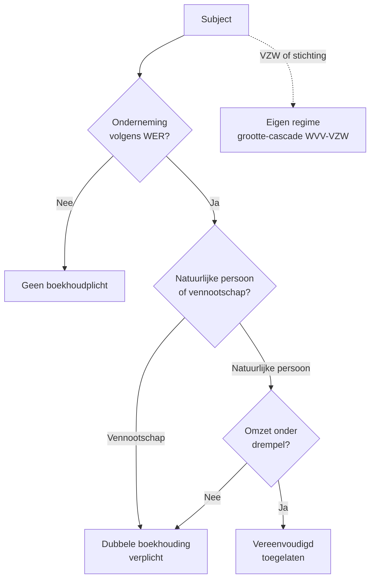

> **Leerstuk — één vraag, helemaal doorgewerkt.** Wie is boekhoudplichtig, in welk regime, volgens welke beginselen, en hoe lang moet alles bewaard blijven? We werken het wettelijk kader van Boek III WER samen door op Bourdon BV en architect Jan De Smet — eerst de plicht, dan de techniek, dan de waardenkant, dan het na-traject. Voor verhaal en routekaart: [[studiemateriaal/1-2|overzicht PO 1.2]].

## Antwoord in één blik

Élke "onderneming" in de zin van het Wetboek van Economisch Recht moet een boekhouding voeren. Dat is een ruim begrip: alle vennootschappen, alle vzw's en stichtingen, én sinds 1 november 2018 ook élke zelfstandige natuurlijke persoon — inclusief vrije beroepen. **Dubbele boekhouding is de hoofdregel**; vereenvoudigde boekhouding is een uitzondering voorbehouden aan natuurlijke personen, maatschappen, vennootschappen onder firma en gewone commanditaire vennootschappen die onder de omzet-drempel blijven (Cijferzakboekje raadplegen — orde van grootte een half miljoen euro).

Boven die regelkant staat een waardenkant: **acht boekhoudbeginselen** — met getrouw beeld als overkoepelende meta-norm, en zeven operationele (voorzichtigheid, continuïteit, bestendigheid, matching, realisatie, materialiteit, niet-compensatie) die elke concrete waarderings- en boekingskeuze beslechten. Na afsluiting volgt een **bewaarplicht van zeven jaar** voor zowel de boeken als de verantwoordingsstukken — te rekenen vanaf 1 januari van het jaar dat op de afsluiting volgt. Fiscale en btw-regelgeving leggen daarnaast soms langere termijnen op.

We werken eerst de plicht en de regimes uit, dan de beginselen, en sluiten af met de bewaarplicht — telkens geconcretiseerd op Bourdon BV en Jan De Smet.

## Wie is boekhoudplichtig?

De wettelijke aanknopingsregel is breed. Het Wetboek van Economisch Recht definieert in zijn eerste boek het begrip "onderneming" en knoopt daar de boekhoudplicht aan vast. Sinds de hervorming van 15 april 2018 (in werking op 1 november 2018) is dat begrip drastisch verruimd: élke zelfstandige natuurlijke persoon die in België een beroepsactiviteit uitoefent, álle Belgische rechtspersonen, en alle organisaties zonder rechtspersoonlijkheid die een economische activiteit ontplooien vallen onder de plicht.

Concreet onderscheid je drie groepen. Eerst de **natuurlijke personen met zelfstandige beroepsactiviteit**: handelaars, vrije beroepen (advocaten, artsen, architecten zoals Jan De Smet), zelfstandigen in bijberoep — sinds 2018 zonder uitzondering. Daarnaast alle **rechtspersonen**: vennootschappen (BV, NV, CV, CommV, VOF), vzw's, internationale vzw's en stichtingen. En tenslotte **organisaties zonder rechtspersoonlijkheid** die economisch optreden — denk aan een maatschap of een tijdelijke handelsvereniging.

> **Een korte zijweg over de uitzonderingen.** De wet sluit een handvol gevallen expliciet uit: een bestuurder-natuurlijke-persoon hoeft voor zijn mandaat zelf geen boekhouding te voeren (wel als hij daarnaast zelfstandig actief is), zuivere land- en tuinbouw heeft een eigen regime, politieke partijen vallen onder bijzondere regelgeving, en hobby- of sportinkomsten zonder beroepskarakter blijven buiten beeld. Voor het examen is vooral relevant dat vrije beroepen er sinds 2018 wél onder vallen — dat was vóór die datum anders.

Pas dit toe op de voorbeeldgroep en het beeld wordt scherp. **Bourdon BV** is een vennootschap en is dus boekhoudplichtig, in het dubbele regime. **Vermeer NV** is haar moedervennootschap en valt onder dezelfde plicht. **Jan De Smet**, zelfstandig architect zonder vennootschap, is boekhoudplichtig vanaf zijn eerste euro omzet — voor hem opent zich wél een keuze tussen vereenvoudigd en dubbel, afhankelijk van zijn omzet-niveau. En **Buurthuis Linde VZW** is als rechtspersoon ook boekhoudplichtig, maar volgt een aparte cascade die je leert kennen in [[vennootschap-grootte-en-schema-keuze]].

De boekhoudplicht is meer dan een formele administratieverplichting: ze is de eerste **bewaking** van de onderneming. Wie niet boekhoudt, kan niet bewijzen wat hij gedaan heeft. De sanctie is niet alleen wettelijk (fiscale belastingverhoging, mogelijk gerechtelijke ontbinding bij ernstige inbreuken), maar ook praktisch — geen bankkrediet zonder cijfers, geen bewijspositie bij een handelsgeschil, geen sluitende fiscale aangifte mogelijk.

## Dubbel of vereenvoudigd — twee regimes, één keuze-as

Het WER kent slechts twee toegelaten boekhoud-regimes. De **dubbele boekhouding** is de standaard; de **vereenvoudigde boekhouding** is een uitzondering die de wet uitsluitend openstelt voor een welomschreven kring van kleine subjecten. Het juridisch label is geen comfort-keuze — overschrijd je de drempel, dan verlies je het recht op vereenvoudigd.

**Wie moet altijd dubbel?** Alle vennootschappen, zonder uitzondering. Of het nu een BV, een NV, een CV, een SE of een VOF betreft — kapitaalvennootschappen én personenvennootschappen voeren een dubbele boekhouding. Bourdon, Vermeer en hun dochters dus altijd. Ook grote natuurlijke personen en grote vzw's vallen verplicht onder het dubbele regime.

**Wie mag vereenvoudigd?** De wet stelt het regime open voor natuurlijke personen, maatschappen, VOF's en gewone commanditaire vennootschappen die onder een omzet-drempel blijven (orde van grootte een half miljoen euro, met een hogere variant voor bepaalde brandstof-detailhandel — exacte bedragen in het Cijferzakboekje). Voor vzw's geldt een aparte cascade die mee schuift met de groottecategorieën van het WVV-VZW — die werken we uit in [[vennootschap-grootte-en-schema-keuze]].

**De kantelmechaniek is strakker dan bij grootte-toets.** Anders dan de tweejaars-buffer die het WVV hanteert voor groottecategorieën, kent het WER hier geen "twee opeenvolgende boekjaren"-vereiste: overschrijd je de drempel in één boekjaar, dan ben je vanaf het volgend boekjaar verplicht om dubbel te beginnen. Verwar de twee mechanieken niet — een veelvoorkomende valkuil bij wie net begint te studeren.

| Aspect | Vereenvoudigd | Dubbel |
|---|---|---|
| Wettelijke basis | Boek III WER (vereenvoudigde regeling) + KB 21-10-2018 | Boek III WER (algemene regeling) + KB 21-10-2018 |
| Wie | Natuurlijke persoon · maatschap · VOF · CommV onder drempel | Alle vennootschappen + grote zelfstandigen |
| Boeken | Financieel + inkoop + verkoop + inventarisboek | Algemeen dagboek + hulpdagboeken + centraal boek + grootboek + inventarisboek |
| MAR (rekeningplan) | Nee | Ja |
| Jaarrekening NBB | Nee | Ja, volgens grootte-schema |
| Centralisatie | Niet van toepassing | Minstens maandelijks (driemaandelijks toegelaten bij toepassing van vereenvoudigd-regime-stelsel) |

Pas dit toe op Jan De Smet. In boekjaar N-1 haalde hij een omzet onder de drempel — vereenvoudigd is OK. In boekjaar N stijgt zijn omzet boven de drempel. Boekjaar N mag hij nog afmaken in zijn vereenvoudigde regime (drempel-overschrijding werkt naar vóór). Maar **vanaf 1 januari N+1** moet hij dubbel beginnen: een rekeningplan opstellen op basis van de minimumindeling van het algemeen rekeningenstelsel, een openingsbalans afleiden uit zijn inventaris van eind N, en hulpdagboeken inrichten. Geen retroactieve omzetting van vorige boekjaren — alleen vooruit kijken.

### Dubbele boekhouding — vereiste boeken

In het dubbele regime loopt elke verrichting door een vaste keten: brondocument (factuur, bankafschrift, contract) → dagboek-inschrijving → grootboek-rekening → proefbalans → jaarrekening. Elk station is wettelijk benoemd, en de wet vraagt expliciet dat de keten volledig, getrouw en in tijdsorde wordt bijgehouden.

De vereiste boeken zijn: het **algemeen dagboek** (of een ongesplitst dagboek dat alles bevat); **hulpdagboeken** waarin gespecialiseerde categorieën worden ingeschreven (klassiek: inkoop, verkoop, financieel, diversen); een **grootboek** met de rekeningen volgens een gestandaardiseerd rekeningplan; en een **inventarisboek** waarin je minstens eens per jaar alle bezittingen, vorderingen, schulden en verplichtingen opneemt.

> **De rol van het centraal boek.** Wanneer je hulpdagboeken gebruikt, vraagt de wet dat je hun gezamenlijke mutaties **minstens éénmaal per maand** samenvattend overboekt naar een centraal boek dat de hoofdrekeningen aanstuurt. Die maandelijkse centralisatie is een klassieke examen-vraag (vraag 2003-bibf): wat is de minimumfrequentie? Antwoord: maandelijks. Onder bepaalde voorwaarden volstaat driemaandelijks voor wie het regime van het vereenvoudigd-uitvoerend-stelsel toepast op zijn boekhouding.

Het is geen formaliteit zonder reden. De keten boeking → centralisatie → grootboek borgt dat een MAR-rekening altijd terug afgelopen kan worden tot het oorspronkelijke verantwoordingsstuk. Dat is wat **getrouwheid van de boekhouding** materieel betekent: bewijs-tracebaarheid van eindcijfer tot factuur. Een onderneming die enkel eindejaars-aanpassingen doorvoert zonder maandelijkse centralisatie schendt de boekhoudplicht — en riskeert dat haar boekhouding wordt verworpen als bewijs, zowel fiscaal als in een handelsgeschil.

Voor de **techniek van eindejaarsverrichtingen** — afschrijvingen, voorzieningen, waardeverminderingen, overlopende rekeningen, resultaatbestemming — zie het cross-PO leerstuk [[individuele-jaarrekening-opmaken]]. Hier blijft de focus op het kader: welke boeken, in welke vorm, met welke regelmaat.

### Vereenvoudigde boekhouding — wat valt weg, wat blijft?

Wie vereenvoudigd mag boekhouden, houdt **drie verplichte dagboeken** bij: een financieel dagboek (kas + bank, chronologisch met een uniek nummer per inschrijving), een inkoopdagboek (alle aankoop-stukken), en een verkoopdagboek (alle verkoop-stukken). Daarnaast moet ook hier een **inventarisboek** worden gevoerd met een jaarlijkse inventaris van bezittingen, vorderingen, schulden en verplichtingen — die vermogensstaat treedt in de plaats van een formele balans.

Wat valt weg: het rekeningenstelsel (MAR), het grootboek, de proefbalans, het hele dubbele-partij-mechanisme, én een balans-en-resultatenrekening in de WVV-vorm. Wat blijft: chronologische registratie, getrouwheid, onveranderlijkheid, en de bewaarplicht. Het regime is **technisch lichter, niet juridisch lichter**. Dezelfde getrouwheids- en onveranderlijkheidseisen blijven gelden.

Voor Jan De Smet betekent dit praktisch dat een spreadsheet of zelfs een papieren kassa-boek volstaat — mits chronologisch ingeschreven en mits alle verantwoordingsstukken bewaard. Zolang hij onder de drempel zit, is dat een proportionele regeling die hem niet dwingt tot een boekhoud-pakket. Zodra hij kantelt naar dubbel (zoals in zijn boekjaar N+1) heeft hij wél een rekeningplan en een hulpdagboeken-stelsel nodig — typisch het moment waarop hij een boekhouder inschakelt of een software-pakket aanschaft.

Een nuance over openbaarmaking: een natuurlijke persoon of een entiteit zonder rechtspersoonlijkheid die vereenvoudigd boekhoudt, legt **geen jaarrekening neer bij de NBB**. De jaarlijkse vermogensstaat dient intern en voor de fiscus (bij de aangifte personenbelasting), maar wordt niet publiek. Pas zodra hij naar het dubbele regime kantelt of zodra hij een vennootschap opricht, ontstaat een neerleggingsplicht — zie [[jaarrekening-publiceren-en-sancties]].

## De acht boekhoudbeginselen — de waardenkant

Het WER en het KB van 21 oktober 2018 zeggen **wat** je moet boeken; de boekhoudbeginselen zeggen **hoe je waardeert** en **wanneer je erkent**. Zonder beginselen blijft de techniek leeg — twee boekhouders zouden voor dezelfde verrichting tegenstrijdige cijfers kunnen rapporteren. De beginselen geven het normatieve fundament dat die willekeur uitsluit.

De bron ligt in het KB tot uitvoering van het Wetboek van Vennootschappen en Verenigingen (KB van 29 april 2019). Daar vind je het **getrouw beeld** als overkoepelende norm en de operationele waarderings­principes die in CBN-advies 174/1 ("Beginselen van een regelmatige boekhouding") in detail worden uitgewerkt. Pedagogisch ordenen we ze in **één meta-beginsel plus zeven operationele beginselen**. Het meta-beginsel mag de operationele beginselen overrulen wanneer een strikte toepassing zou afwijken van het werkelijke beeld van vermogen en resultaat.

### Het meta-beginsel — getrouw beeld

De wet legt op dat de jaarrekening een **getrouw beeld** moet geven van het vermogen, de financiële positie en het resultaat van de onderneming. Dat is geen vage doelstelling, maar een operationele norm: indien een strikte regel-toepassing in een uitzonderlijke situatie geen getrouw beeld zou geven, **moet** er van de regel worden afgeweken — en de afwijking moet in de toelichting gemotiveerd worden.

Concreet voorbeeld: stel dat het standaard balansschema geen aparte lijn voorziet voor een materiële post die in jouw situatie wél belangrijk is. Strikte toepassing zou die post wegmoffelen in een verzamelrubriek, en de cijfers zouden hun verklarende waarde verliezen. Het getrouw-beeld-beginsel laat je dan toe een aparte lijn toe te voegen — mits motivering in de toelichting.

> **Een override-clausule, geen ontsnapping.** Getrouw beeld is geen vrijgeleide om regels te negeren. Het is een uitzonderingsclausule voor uitzonderlijke situaties — zelden in te roepen, wél juridisch verankerd. In de praktijk is het meta-beginsel vooral de toetssteen: bij twijfel over een keuze tussen twee regels, kies degene die het getrouwste beeld oplevert. De zeven operationele beginselen voeren het meta-beginsel grotendeels uit; getrouw beeld mag enkel binnen springen wanneer ze elkaar in de weg zitten.

### De zeven operationele beginselen

Elk beginsel beslecht een concrete waarderings- of boekingskeuze. We lopen ze af met telkens een korte kern-regel en een mini-toepassing in de Bourdon-context — niet als academische definitie, wel als beslissings-instrument.

| Beginsel | Kern-regel | Voorbeeld bij Bourdon |
|---|---|---|
| **Voorzichtigheid** | Asymmetrische waardering: latente verliezen en risico's onmiddellijk boeken; latente winsten niet vóór realisatie | Bourdon's vordering op een laat-betalende klant: zodra inning twijfelachtig wordt, boek je een waardevermindering. Rentewinst op overschot-liquiditeit boek je daarentegen pas wanneer ze effectief verworven is — niet vooraf. |
| **Continuïteit** | Waardering veronderstelt voortzetting van het bedrijf. Bij discontinuïteit: switchen naar realisatiewaarde | Bourdon's machines worden afgeschreven over hun economische gebruiksduur — dat veronderstelt dat het bedrijf voortbestaat. Bij een stopzettingsbeslissing kantelt de waardering naar liquidatiewaarde. |
| **Bestendigheid** | Waarderingsregels van jaar tot jaar identiek toepassen. Wijziging mag, maar enkel met gegronde reden en verantwoording in toelichting | Bourdon mag haar afschrijvingsmethode niet willekeurig wijzigen om winst te sturen. Zie de afschrijving-mini-case hieronder — onderscheid wijziging-regel van schatting-wijziging. |
| **Matching** | Kosten toerekenen aan het boekjaar waarin de overeenkomstige opbrengsten worden erkend | Bourdon levert een meerjarenproject: opbrengsten én kosten worden over de relevante boekjaren gespreid via overlopende rekeningen of een percentage-of-completion-aanpak. |
| **Realisatie** | Opbrengsten erkennen wanneer ze gerealiseerd zijn (gefactureerd plus levering of risico-overdracht), niet op contract-datum | Bourdon's verkoopcontract van december N met levering februari N+1: omzet in N+1, niet N. Het contract op zich genereert nog geen opbrengst. |
| **Materialiteit** | Niet elke post verdient dezelfde precisie. Onbelangrijke bedragen mogen gegroepeerd; belangrijke moeten apart | Bourdon's kleine kantoor-uitgaven mogen cumulatief op één lijn 'andere bedrijfskosten' verschijnen. De aankoop van een sleutel-machine van enkele honderdduizenden euro krijgt aparte aandacht in de staat van vaste activa. |
| **Niet-compensatie** | Activa en passiva niet tegen elkaar wegstrepen. Schulden en vorderingen op dezelfde tegenpartij blijven bruto zichtbaar | Bourdon mag haar schuld aan leverancier X niet wegstrepen tegen haar vordering op X — beide blijven afzonderlijk in de balans, tenzij een formele netting-overeenkomst bestaat en aan de cumulatieve voorwaarden voldoet. |

Deze zeven beginselen, samen met het meta-beginsel getrouw beeld, sturen elke twijfel-situatie. Wanneer je tijdens je werk een vraag stelt als "mag ik deze waardevermindering nu boeken?" of "mag ik deze opbrengst al erkennen?" of "moet deze post apart of mag hij gegroepeerd?" — dan beslecht een van deze acht regels de zaak.

## Mini-case — bestendigheid bij afschrijving-wijziging

Een examen-klassieker (vraag 2013-2) test de bestendigheid op een uiterst concreet punt. **De vraag**: Bourdon BV wijzigt haar afschrijvingspercentage van 10 % naar 12,5 % wegens snellere technologische veroudering van haar machines. Is dat een wijziging van waarderingsregel of een wijziging van schatting?

**Juridische kwalificatie.** Het is een **schatting-wijziging**, geen wijziging van de waarderingsregel zelf. De waarderingsregel blijft "lineaire afschrijving over de economische gebruiksduur". Wat verandert is de inschatting van die gebruiksduur (van tien naar acht jaar) op basis van nieuwe informatie over technologische veroudering. De methode-keuze (lineair, niet degressief) blijft ongewijzigd.

**Verwerking — prospectief.** De restwaarde van de bestaande machines wordt vanaf het wijzigingsjaar over de nieuwe resterende gebruiksduur afgeschreven. Vorige boekjaren worden **niet** retroactief gecorrigeerd. De toelichting bij de jaarrekening vermeldt expliciet de aard van de wijziging en het effect op het resultaat van het lopende boekjaar.

**Waarom dit ertoe doet.** Bestendigheid betreft de **regel**, niet de **schatting**. Wie de twee verwart, herrekent ten onrechte retroactief vorige boekjaren — en verstoort de continuïteit van de vergelijkbare cijfers. Drie types wijziging vragen drie verschillende verwerkingen:

| Type wijziging | Aard | Verwerking |
|---|---|---|
| **Waarderingsregel** | Verandering van methode (bv. lineair → degressief) | Retroactief — zeldzaam, vereist gegronde reden + uitvoerige motivering in toelichting |
| **Schatting** | Herinschatting binnen dezelfde methode (bv. nieuwe gebruiksduur) | Prospectief — gangbaar, motivering en omvang in toelichting |
| **Foutcorrectie** | Materiële fout in vroeger neergelegde jaarrekening | Retroactief verplicht — via de procedure voor correctie van neergelegde jaarrekening |

Het juridisch label bepaalt de verwerking. Vraagstel je bij elke wijziging: wat wijzigt — de regel of de schatting — en op welke basis?

## Bewaarplicht — wat, hoe lang, hoe?

Na afsluiting begint een tweede plichtenlaag. Het WER eist dat zowel de **boeken** als de **verantwoordingsstukken** worden bewaard gedurende **zeven jaar**, te rekenen vanaf 1 januari van het jaar dat op de afsluiting volgt. Voor een boekjaar dat afsluit op 31 december 2025 betekent dat: bewaring tot 31 december 2032 (zeven jaar vanaf 1 januari 2026). De aanvangsdatum is dus niet de afsluitdatum zelf — een veelvoorkomende rekenfout.

Wat valt onder de bewaarplicht? Drie groepen. Eerst de **boeken zelf**: het algemeen dagboek, de hulpdagboeken, het centraal boek, het grootboek en het inventarisboek — voor wie dubbel boekhoudt — of het financieel, inkoop- en verkoopdagboek plus inventarisboek voor wie vereenvoudigd boekhoudt. Daarnaast alle **verantwoordingsstukken** die de boekingen onderbouwen: facturen, bankafschriften, contracten, leveringsbonnen, kasstaten. En tenslotte alle **elektronische registraties en metadata** die de boeking traceerbaar maken — bij een geïnformatiseerde boekhouding moet de drager de onveranderlijkheid én de toegankelijkheid van de gegevens borgen gedurende de hele termijn.

De wet maakt één belangrijke nuance: voor het ongesplitst dagboek, het centraal boek, de drie dagboeken van de vereenvoudigde regeling en het inventarisboek **moet het origineel** worden bewaard. Voor de andere boeken volstaat een origineel of een afschrift. Voor verantwoordingsstukken die niet strekken tot bewijs jegens derden geldt een verkorte termijn van drie jaar — in de praktijk hoor je die zelden inroepen, omdat de meeste stukken wel een externe bewijsfunctie hebben.

### Bewaartermijnen — overzicht

Naast het boekhoudkundige kader leggen andere wettelijke regimes hun eigen termijnen op. Een accountant houdt rekening met al deze parallellen — bij twijfel geldt steeds de **langste** termijn. Vernietigen kost niets na termijn; eerder vernietigen kost bewijsverlies.

| Wat | Termijn | Bron |
|---|---|---|
| Boeken (algemeen + hulp + centraal + grootboek + inventaris) | 7 jaar vanaf 1-1 van het jaar volgend op afsluiting | WER Boek III + KB 21-10-2018 |
| Verantwoordingsstukken bij boekingen (facturen, bankafschriften, contracten) | 7 jaar — boekhoudkundig én fiscaal | WER Boek III + WIB 92 |
| Verantwoordingsstukken die niet strekken tot bewijs jegens derden | 3 jaar | WER Boek III |
| Btw-stukken (algemeen) | 10 jaar (verlengd sinds 1 januari 2023) | WBTW |
| Btw-herzieningstermijn onroerend goed | Langere bijzondere termijn voor herziening van aftrek | WBTW |
| Sociale documenten (loonbrieven, RSZ-aangiften) | Doorgaans 5 jaar (per type sociale wetgeving — soms 7 jaar) | Sociale wetgeving |
| Statuten, AV-notulen, bestuursbesluiten | Levensduur vennootschap + termijn na vereffening | WVV |

Voor btw-stukken in het bijzonder geldt sinds 1 januari 2023 een **langere bewaartermijn van tien jaar** in plaats van zeven. Dat betekent dat een Bourdon die haar boekhoudkundige verantwoordingsstukken na zeven jaar zou vernietigen, mogelijk btw-stukken te vroeg weggooit. Praktische regel: **in twijfel houden tot de langste relevante termijn verstrijkt**.

## Drie valkuilen

> **Valkuil 1 — bestendigheid en schatting-wijziging door elkaar gooien.** Een schatting-wijziging is geen inbreuk op bestendigheid: bestendigheid bewaakt de waarderingsregel zelf, niet de gebruiksduur-inschatting daarbinnen. Wie de twee verwart, herrekent ten onrechte retroactief én verstoort vorige boekjaren. Bourdon's wijziging van 10 % naar 12,5 % afschrijving is een schatting-wijziging — prospectief verwerken, niet retroactief corrigeren.

> **Valkuil 2 — centralisatie-frequentie te laks.** De wet eist een centralisatie van hulpdagboeken naar het centraal boek **minstens éénmaal per maand**. Een onderneming die enkel eindejaars-aanpassingen doorvoert zonder maandelijkse centralisatie schendt de boekhoudplicht en riskeert dat haar boekhouding wordt verworpen als bewijs — zowel fiscaal als civielrechtelijk. Driemaandelijks is alleen toegelaten onder bijzondere voorwaarden.

> **Valkuil 3 — bewaartermijn dubbel-interpreteren.** De zevenjaar-termijn begint op **1 januari van het jaar volgend op de afsluiting**, niet op de afsluitdatum zelf. Voor boekjaar 2025 (afgesloten 31 december 2025): bewaring tot 31 december 2032 (zeven jaar vanaf 1 januari 2026). Wie vroeger vernietigt, gooit nog binnen-termijn-stukken weg. Bij twijfel: aanvangsdatum is altijd 1 januari van het volgende jaar — en pas vergelijken met de btw-termijn van tien jaar of bijzondere fiscale termijnen.

---

## Wanneer je dit snapt, ga dan naar

- [[wat-is-belgisch-boekhoudrecht]] — Het bronnenveld waaruit alle regels hierboven afkomstig zijn (WER · KB-WVV · CBN-adviezen).
- [[vennootschap-grootte-en-schema-keuze]] — Volgend leerstuk: wat verandert er als jouw boekhoudpijler in een groot-regime kantelt? Jaarverslag, commissaris, volledig schema.
- [[jaarrekening-publiceren-en-sancties]] — Hoe de beginselen doorwerken in de toelichting en welke sancties spelen bij niet-naleving van bewaarplicht of foutieve neerlegging.
- [[individuele-jaarrekening-opmaken]] — Cross-PO: de techniek van eindejaarsverrichtingen (afschrijvingen, voorzieningen, overlopende rekeningen). PO 1.4 leerstuk.
- [[studiemateriaal/1-2/samenvatting|Samenvatting PO 1.2]] — Voor herhaling vlak vóór het examen: boekhoudplicht-beslisboom + regimes + acht beginselen + bewaartermijn-tabel.

## Doorklik naar concepten

Voor wie definitorisch detail wil opzoeken:

- [[boekhoudplicht]] · [[boekhouding]] · [[dubbele-boekhouding]]
- [[boekhoudbeginselen]] · [[continuiteit]] · [[eindejaarsverrichtingen]]
- [[voorzieningen]] · [[voorraden]]

---

## Wettelijk fundament

- Boekhoudplichtige onderneming — definitie: WER Boek III, art. III.82 + ondernemingsbegrip art. I.1 WER. Sinds Wet 15-04-2018 (in werking 1-11-2018) vallen vrije beroepen er ook onder. Uitzonderingen: bestuurders-natuurlijke-personen voor hun mandaat, zuivere land- en tuinbouw, politieke partijen, hobby- en sport-inkomsten zonder beroepskarakter.
- Inhoud van de boekhouding: WER art. III.83. Alle verrichtingen, bezittingen, rechten, vorderingen, schulden en verplichtingen. Voor de natuurlijke persoon: enkel het beroeps-deel; het privé-vermogen blijft buiten beeld.
- Dubbele boekhouding — hoofdregel: WER art. III.84. Stelsel van boeken en rekeningen volgens de gebruikelijke regels van het dubbel boekhouden. Verrichtingen zonder uitstel, getrouw, volledig en naar tijdsorde ingeschreven.
- Centralisatie hulpdagboeken — minstens maandelijks: WER art. III.84, vierde lid. Gezamenlijke mutaties uit hulpdagboeken worden minstens éénmaal per maand samenvattend overgeboekt in een centraal boek; voor wie het stelsel van art. III.85 toepast: minstens driemaandelijks.
- Vereenvoudigde boekhouding — uitzondering: WER art. III.85, § 1. Drempel-bedrag en omschrijving in art. 1 KB 21-10-2018 (orde van grootte een half miljoen euro, met een hogere variant voor brandstof-detailhandel — actuele cijfers in het Cijferzakboekje). Toepasbaar op natuurlijke persoon, organisatie zonder rechtspersoonlijkheid, VOF en gewone commanditaire vennootschap onder de drempel.
- Vereiste dagboeken bij vereenvoudigd: WER art. III.85, § 1. Drie dagboeken (financieel, inkoop, verkoop) plus inventarisboek.
- Hulpdagboeken — voorwaarden: art. 4 KB 21-10-2018. Continuïteit, regelmatigheid en onveranderlijkheid van de boekhouding.
- Verantwoordingsstuk + opbergplicht: WER art. III.86. Elke boeking aan de hand van een gedagtekend verantwoordingsstuk. Verantwoordingsstukken worden methodisch opgeborgen en zeven jaar bewaard; stukken die niet strekken tot bewijs jegens derden: drie jaar.
- Tijdsorde + onveranderlijkheid: WER art. III.88, eerste lid. Boeken naar tijdsorde, zonder wit vak of weglating. Correcties zichtbaar, oorspronkelijke tekst leesbaar.
- Bewaarplicht boeken — 7 jaar: WER art. III.88, tweede lid + art. 8 KB 21-10-2018. Te rekenen vanaf 1 januari van het jaar dat op de afsluiting volgt. Origineel voor ongesplitst dagboek, centraal boek, drie dagboeken art. III.85 en inventarisboek; afschrift toegelaten voor andere boeken.
- Jaarlijkse inventaris: WER art. III.89. Eens per jaar inventaris van bezittingen, vorderingen, schulden en verplichtingen.
- Bijzondere btw-bewaartermijn: Wetboek btw (W 20-11-2022, toepasselijk vanaf 1-1-2023): bewaartermijn 10 jaar i.p.v. 7. Langere bijzondere termijn voor herziening van aftrek bij onroerend goed.
- Getrouw beeld + acht beginselen: KB van 29-04-2019 tot uitvoering van het WVV (KB-WVV), Boek 3 — waarderingsregels. CBN-advies 174/1 ("Beginselen van een regelmatige boekhouding") werkt deze beginselen in detail uit.
- Bestendigheid + schatting-wijziging: CBN-advies 154/1 (wijziging van waarderingsregels). De examen-vraag 2013-2 vraagt naar het onderscheid wijziging-regel (retroactief, zeldzaam) versus schatting-wijziging (prospectief, gangbaar) versus foutcorrectie (retroactief, verplicht).
- Correctie van fout in neergelegde jaarrekening: WVV, Boek 3 — bepaling rond correctie van materiële fouten in een vroeger neergelegde jaarrekening.

---

*Leerstuk PO 1.2 — werkpaard. Status: voorgesteld volgens ADR-037.*
