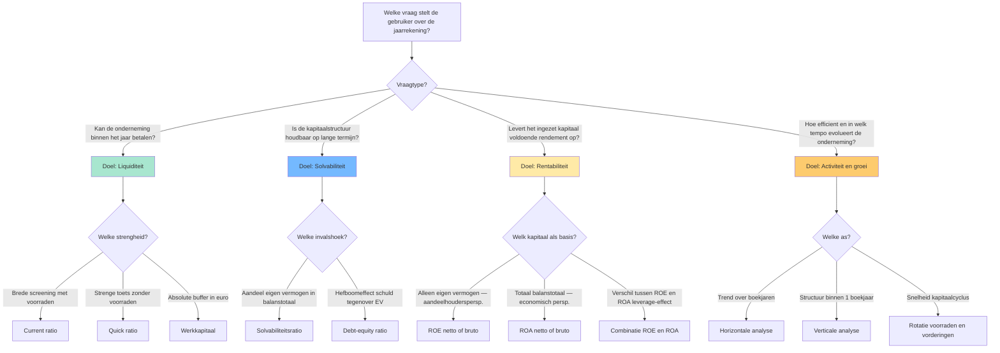
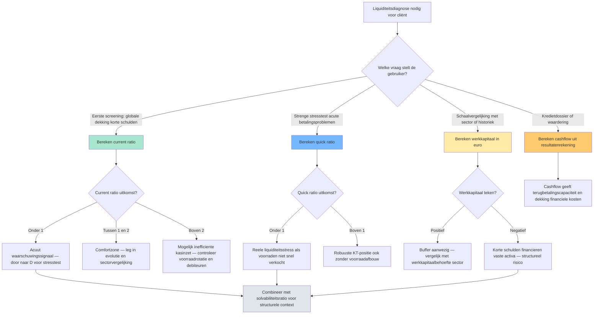

> [!warning]- Open beslissingen
> De volgende gaps zijn nog open voor dit programmaonderdeel — inhoud kan onvolledig zijn:
> - `edges.target-ontbreekt` op `getrouw-beeld-jaarrekening`: edges[0].target = 'materieel-belang-financiele-analyse' maar dat record bestaat niet in records/. He…
> - `records.overlappend-fenomeen` op `getrouw-beeld-jaarrekening`: Twee records voor hetzelfde fenomeen 'getrouw beeld van de jaarrekening' (cross-PO duplicate): 'getr…
> - `vergelijkingsparen.vrije-tekst-niet-gespiegeld` op `werkkapitaal`: in_praktijk[0] introduceert het onderscheid werkkapitaal vs werkkapitaalbehoefte als examenrelevant …
> - `records.ontbreekt` op `werkkapitaal`: Geen record 'werkkapitaalbehoefte' (Besoin en Fonds de Roulement / BFR) terwijl het in `werkkapitaal…
> - `vergelijkingsparen.vrije-tekst-niet-gespiegeld` op `liquiditeitsratio`: bouwstenen[0] introduceert drie hoofdvarianten — current, quick en cash ratio — en geeft een numerie…
> - `records.ontbreekt` op `liquiditeitsratio`: Geen record 'cash-ratio' terwijl `liquiditeitsratio.bouwstenen[0]` haar expliciet als derde hoofdvar…
> - `records.overlappend-fenomeen` op `bestuursverslag`: Spiegel-entry van jaarverslag-overlap. Bestuursverslag heeft de procedure-stappen + corporate-govern…
> - `edges.target-ontbreekt` op `niet-in-balans-opgenomen-rechten-verplichtingen`: edges[].target naar 'voorzieningen-voor-risicos-en-kosten' — bestaat niet. Canoniek: 'voorzieningen'…
> - `edges.target-ontbreekt` op `getrouw-beeld-jaarrekening`: edges[].target naar 'materieel-belang-financiele-analyse' — bestaat niet. Mogelijk records.ontbreekt…

## Leesgids

De minicursus volgt de redeneerlijn van een financiële analyse: eerst de vraag van de gebruiker, dan de jaarrekening als bron, dan de ratio's en herwerkingen die de cijfers laten spreken. Oriëntatiehoofdstukken kaderen het waarom, thematische blokken bundelen verwante begrippen, en de competentiehoofdstukken vertalen alles naar concrete handelingen. Twee synthese-fiches — een ratio-overzicht en een liquiditeits-beslisboom — leg je op je bureau als kapstok. Lees lineair voor opbouw, gebruik de cheatsheet en vergelijkingsparen-matrix om verwarrende begrippenparen scherp te zetten.

## Waarom dit programmaonderdeel telt

Een jaarrekening lezen is voor een gecertificeerd accountant geen invuloefening — het is de dagelijkse brug tussen boekhoudkundige werkelijkheid en het oordeel waar cliënten, banken en toezichthouders op steunen. Wie de cijfers niet kan ondervragen, blijft hangen bij de output van de software. De competentie zit niet in formules onthouden, maar in weten welke vraag welke ratio oproept en welke herwerking de cijfers vergelijkbaar maakt. Dat denkpatroon staat centraal in alle examenvragen rond financiële analyse: een case beschrijft een gebruiker met een vraag, en jij moet aantonen dat je de juiste invalshoek kiest. Tegelijk leer je hier de discipline om grenzen aan je analyse expliciet te benoemen — een diagnose blijft een oordeel, geen bewijs.

## Waarom analyseer je een jaarrekening? Doelstellingen, gebruikers en getrouw beeld

De jaarrekening is geen doel op zich maar een communicatiemiddel — en wie de boodschap leest, bepaalt de relevantie van elk cijfer. Een kredietverlener stelt een andere vraag dan een aandeelhouder of een fiscale controleur, en dat verschil bepaalt waar je analyse zwaartepunten legt. De analyse is pas betrouwbaar wanneer de onderliggende cijfers een getrouw beeld geven en het materieel belang als filter wordt gehanteerd voor wat er echt toe doet.

## De jaarrekening als studieobject: structuur en aangrijpingspunten

Voor je ratio's berekent, moet duidelijk zijn welk document je voor je hebt en welke beginselen het kleuren. Dit blok zet de bouwstenen op een rij: het studieobject zelf, de twee ankerbeginselen die de betrouwbaarheid bepalen, en de doelstellingen en gebruikers die de richting van elke analyse sturen.

- [[jaarrekening-als-studieobject|Jaarrekening als studieobject van financiële analyse]] · `begrip`
- [[getrouw-beeld-jaarrekening|Getrouw beeld van de jaarrekening]] · `beginsel`
- [[materieel-belang-jaarrekening|Materieel belang (materiality)]] · `beginsel`
- [[doelstellingen-financiele-analyse|Doelstellingen van financiële analyse]] · `begrip`
- [[gebruikers-jaarrekening|Gebruikers van de jaarrekening]] · `begrip`

## De vier analyse-doelen en hun ratio's — overzicht

Vóór je in de individuele ratio's duikt, krijg je de kapstok: welke vraag van de gebruiker leidt naar welk analyse-doel, en welk doel mobiliseert welke ratio. Houd dit schema bij de hand wanneer je de competentiehoofdstukken doorwerkt — het voorkomt dat losse formules zich in je hoofd opstapelen zonder context.

**Kerninzichten**:
- De keuze van een ratio begint NOOIT bij de balans — ze begint bij de vraag van de gebruiker. Een kredietverlener op korte termijn kijkt eerst naar de quick ratio; een obligatiehouder eerst naar de solvabiliteit; een aandeelhouder eerst naar ROE. Wie eerst formules verzamelt en dan een verhaal zoekt, mist de analyse-discipline.
- ROE en ROA SAMEN lezen ontmaskert het leverage-effect. Bij Rotex Roeselare NV is netto-ROE 20,8 % terwijl netto-ROA 13,0 % is — het gat van 7,8 procentpunten zegt dat schulden de aandeelhouderswinst versterken. Als ROE lager wordt dan ROA, werkt de hefboom omgekeerd: de kost van schulden is dan groter dan het rendement op activa.
- Liquiditeit en solvabiliteit zijn complementair, geen synoniemen. Een vennootschap kan liquide zijn (vlottende activa > korte schulden) maar tegelijkertijd structureel zwak gefinancierd (laag eigen vermogen). Omgekeerd kan een solvabele onderneming tijdelijk illiquide zijn (cashtekort terwijl ze rijk is aan vaste activa). Examenvraag-camouflage: alleen op één van de twee letten = halve diagnose.
- Een hoge ratio is niet automatisch goed. Een current ratio > 3 kan signaleren dat middelen vastliggen in onproductieve voorraden of trage vorderingen; een solvabiliteit > 70 % kan betekenen dat de onderneming te weinig hefboom benut. Interpretatie vereist altijd sectorvergelijking en historiek — de drie analyse-assen samen.
- Brutovarianten met cashflow (bruto-ROE, bruto-ROA) filteren niet-kaskosten weg en zijn moeilijker boekhoudkundig te manipuleren dan nettovarianten. Voor kredietdossiers en waarderingsvragen geven brutoratio's vaak een eerlijker beeld dan nettoratio's. Voor aandeelhoudersrendementsanalyse blijft netto-ROE de standaard.

[[ratio-vier-doelen-vergelijking|→ Volledige synthese-fiche]]

## Voorbereiden van een financiële analyse van de jaarrekening

Elke analyse begint vóór de eerste berekening: scoping bepaalt wat je gaat onderzoeken, voor wie en met welke documenten. Wie deze stap overslaat, berekent ratio's die niemand besteld heeft.

[[competenties/voorbereiden-financiele-analyse|→ Volledige procedure]]

## Opstellen van een analytische balans voor een vennootschap

De wettelijke balans is ingericht voor publicatie, niet voor analyse. Pas wanneer je posten hergroepeert volgens economische logica — financieringsbronnen tegenover kapitaalgebruik, lang versus kort — worden vergelijking en ratio-berekening zinvol.

[[competenties/opstellen-analytische-balans|→ Volledige procedure]]

## Berekenen en interpreteren van de liquiditeitsratio's

Liquiditeit beantwoordt de vraag of een onderneming haar kortetermijnverplichtingen kan dekken — een diagnose die meerdere strengheidsgraden kent. Hier leer je niet één getal te berekenen, maar de varianten in samenhang te lezen.

[[competenties/berekenen-interpreteren-liquiditeitsratios|→ Volledige procedure]]

## Berekenen en interpreteren van de solvabiliteitsratio's

Solvabiliteit verschuift het perspectief van betalingscapaciteit naar structurele veerkracht: hoeveel eigen vermogen draagt het bedrijf, en hoe verhouden de schulden zich daartoe? Twee invalshoeken bestaan naast elkaar, en het examen verwacht dat je weet welke wanneer past.

[[competenties/berekenen-interpreteren-solvabiliteitsratios|→ Volledige procedure]]

## Berekenen en interpreteren van de rentabiliteitsratio's

Rentabiliteit meet of het ingezet kapitaal voldoende opbrengt — maar de basis waarop je deelt, bepaalt alles. Vandaar dat aandeelhoudersrendement en economische winstgevendheid naast elkaar staan en samen het hefboomverhaal vertellen.

[[competenties/berekenen-interpreteren-rentabiliteitsratios|→ Volledige procedure]]

## Welke liquiditeitstoets gebruik ik? — Beslisboom

Na drie ratio-competenties staat de praktische vraag voor de deur: welke toets pas je toe in welk scenario? Deze beslisboom maakt het kiesmoment expliciet en laat zien hoe verschillende toetsen op één diagnose convergeren.

**Kerninzichten**:
- Current ratio en quick ratio zijn geen alternatieven — ze zijn complementair. Bij Rotex Roeselare NV: current 2,0 en quick 1,375. Het verschil tussen beide (0,625) is volledig toe te schrijven aan de voorraden (€ 2.500.000 op € 4.000.000 korte schulden). Het verschil zelf is dus een ratio-component: de mate waarin de liquiditeit op voorraden steunt.
- Werkkapitaal als absoluut bedrag corrigeert een verborgen valkuil van ratio's: schaal. Meubelzaak Mertens BV en Rotex Roeselare NV kunnen beide current ratio rond 1,3 hebben, maar werkkapitaal € 200.000 versus € 4.000.000. Voor financierings-capaciteit en investeringsruimte is de absolute buffer relevanter dan de verhouding.
- Een acute liquiditeitsstress (current ratio onder 1) zegt nog niets over levensvatbaarheid. Combineer altijd met de solvabiliteitsratio (structurele basis) en de cashflow (kasgeneratie). Een tijdelijk illiquide maar solvabel bedrijf kan financiering brugkalmen via een banklijn; een liquide maar onsolvabel bedrijf staat op een tijdbom.
- Cash ratio (geldbeleggingen + liquide middelen / korte schulden) is de strengste van de liquiditeitsfamilie maar krijgt in de standaard 1.3-records geen apart record. Voor voorraadintensieve sectoren of acute stress-scenario's is dat de meest waardevolle van de drie — zie open gap voor uitwerking.

[[liquiditeitstoets-beslisboom|→ Volledige synthese-fiche]]

## Uitvoeren van een horizontale en verticale analyse van de jaarrekening

Een ratio op één boekjaar is een momentopname; pas door tijd (horizontaal) en samenstelling (verticaal) toe te voegen, zie je richting en proportie. Beide assen zijn complementair: trendcijfers zonder structuur misleiden, structuurcijfers zonder trend stagneren.

[[competenties/uitvoeren-horizontale-verticale-analyse|→ Volledige procedure]]

## Beoordelen van het werkkapitaal en de kasstroom van een onderneming

Werkkapitaal is de absolute buffer tussen vlottende activa en korte schulden; cashflow is de motor die de buffer voedt. Wie alleen ratio's leest en deze twee absolute grootheden negeert, ziet de financieringsdynamiek niet — en mist de scharniervraag of het bedrijf zichzelf kan financieren.

[[competenties/beoordelen-werkkapitaal-en-kasstroom|→ Volledige procedure]]

## Confronteren van de financiële analyse met de toelichting en off-balance posten

Wat niet in de balans staat, kan het cijferbeeld kantelen. Engagementen, waarborgen en niet-becijferbare verplichtingen verschijnen pas in de toelichting — en zonder die confrontatie blijft elke ratio incompleet.

[[competenties/confronteren-toelichting-en-off-balance|→ Volledige procedure]]

## Beoordelen van het bestuursverslag en de niet-financiële informatie

Cijfers vertellen de helft van het verhaal; het bestuursverslag voegt de context, risico-inschatting en governance-toelichting toe die het cijferbeeld duiden. Een diagnose zonder die kwalitatieve laag mist het ankerpunt waarin bestuurders zelf hun ondernemingscontinuïteit kaderen.

[[competenties/beoordelen-bestuursverslag-en-niet-financiele-info|→ Volledige procedure]]

## Vergelijken in tijd en sector: trend, benchmark en controle-norm

Een ratio krijgt pas betekenis door vergelijking — met zichzelf over de jaren, met soortgenoten in de sector, of met een controlenorm die de plausibiliteit aftast. Dit blok bundelt de drie referentiekaders die elke geïsoleerde uitkomst in perspectief plaatsen.

- [[historische-evolutie-financiele-analyse|Historische evolutie in financiële analyse]] · `methode`
- [[sectorvergelijking-financiele-analyse|Sectorvergelijking (benchmarking)]] · `methode`
- [[cijferanalyses-controle-norm|Cijferanalyses (controlenorm KMO)]] · `regel`

## Formuleren van een financiële diagnose en concrete verbeteradviezen

Een analyse die stopt bij ratio's is geen analyse — pas met een diagnose en concreet advies levert ze waarde voor de cliënt. Hier leer je hoe je losse vaststellingen synthetiseert tot een hiërarchisch oordeel met handelbare aanbevelingen.

[[competenties/formuleren-financiele-diagnose-en-adviezen|→ Volledige procedure]]

## Positioneren van de toezichtsorganen rond de jaarrekening

Rond elke jaarrekening cirkelt een netwerk van actoren met elk een eigen mandaat — interne governance-organen, externe controle en gespecialiseerde toezichthouders. Wie hun rolverdeling kent, weet welk orgaan welke vraag mag stellen en wanneer zijn signaal zwaar weegt.

[[competenties/positioneren-toezichtsorganen-rond-jaarrekening|→ Volledige procedure]]

## Kritische blik: wat zegt een financiële analyse NIET?

Een eerlijke analyse benoemt haar eigen grenzen. Ratio's signaleren patronen, maar bewijzen niets; trends uit het verleden voorspellen geen toekomst; en zelfs een getrouw beeld kan blinde vlekken bevatten die enkel via de toelichting en het bestuursverslag aan de oppervlakte komen. Een diagnose blijft een oordeel — en de stagiair leert vooral waar voorzichtigheid geboden is.

## Synthese-stappenplan

Een volledige analyse doorloop je in een vaste volgorde, ook als je in de praktijk schakelt tussen stappen. Start met scoping: wie is de gebruiker, welke vraag, welke documenten zijn beschikbaar? Stel daarna de analytische balans op zodat de cijfers economisch leesbaar worden. Bereken vervolgens de ratio's per analyse-doel — liquiditeit, solvabiliteit, rentabiliteit — en zet ze naast elkaar in een horizontale en verticale doorsnede. Confronteer de uitkomsten met de toelichting en off-balance posten, en lees het bestuursverslag voor de kwalitatieve duiding. Plaats elke uitkomst tegen historiek, sectorbenchmark en controle-norm voor je tot een diagnose komt. Synthetiseer dan tot een hiërarchisch oordeel met concrete verbeteradviezen, en formuleer expliciet de grenzen van je analyse. Eindig met een check op de rolverdeling van de toezichtsorganen — voor wie je rapporteert en welke escalatiekanalen relevant zijn.

## Cheatsheet

### Vergelijkingsparen-matrix

| Concept | Verwarrend met | Trigger |
|---|---|---|
| [[cashflow-analyse]] | [[rentabiliteit-eigen-vermogen-roe]] | Examenvraag 'cijfer of ratio?': cashflow is een €-bedrag; ROE/ROA op cashflow zijn percentages. |
| [[current-ratio]] | [[quick-ratio]] | Examenvraag 'liquiditeit in ruime / enge zin?': ruim = current; eng = quick. |
| [[debt-equity-ratio]] | [[solvabiliteitsratio]] | Beide drukken financieringsstructuur uit; context bepaalt welke courant is — bankcovenants gebruiken D/E, ratingagentschappen vaker solvabiliteit. |
| [[getrouw-beeld-jaarrekening]] | [[voorzichtigheidsbeginsel]] | Bij een examenvraag 'welk beginsel?' — getrouw beeld als algemeen doel; voorzichtigheid als specifieke voorschrift om risico's volledig op te nemen. |
| [[horizontale-analyse-jaarrekening]] | [[verticale-analyse-jaarrekening]] | Examenvraag 'evolutie of structuur?': over de tijd = horizontaal; samenstelling op één moment = verticaal. |
| [[liquiditeitsratio]] | [[solvabiliteitsratio]] | Examenvraag 'kortetermijnsbetaalkracht versus structurele veerkracht': KT = liquiditeit; lang = solvabiliteit. |
| [[niet-in-balans-opgenomen-rechten-verplichtingen]] | [[voorzieningen-voor-risicos-en-kosten]] | Examenvraag 'voorziening of niet in balans?': becijferbaar + waarschijnlijk = voorziening (balans); onzeker of onbecijferbaar = niet in balans (toelichting). |
| [[quick-ratio]] | [[current-ratio]] | Voorraad-intensiteit: in productie/handel altijd allebei berekenen om de spreiding te zien. |
| [[rentabiliteit-eigen-vermogen-roe]] | [[rentabiliteit-totaal-activa-roa]] | Examenvraag 'welke ratio voor welke vraag?': aandeelhoudersrendement = ROE; economische winstgevendheid van de bedrijfsmiddelen = ROA. |
| [[rentabiliteit-totaal-activa-roa]] | [[rentabiliteit-eigen-vermogen-roe]] | Examenvraag 'economisch vs financieel rendement': economisch = ROA; financieel/aandeelhouder = ROE. |
| [[solvabiliteitsratio]] | [[liquiditeitsratio]] | Examenvraag 'structureel vs operationeel risico': structureel = solvabiliteit; KT betalingsrisico = liquiditeit. |
| [[solvabiliteitsratio]] | [[debt-equity-ratio]] | Solvabiliteitsratio bij algemene structuuranalyse; debt-equity-ratio bij specifieke hefboom- of risicobeoordeling (bankcovenants). |
| [[verticale-analyse-jaarrekening]] | [[horizontale-analyse-jaarrekening]] | Examen 'samenstelling of trend?': samenstelling = verticaal; trend = horizontaal. |
| [[werkkapitaal]] | [[current-ratio]] | Examenvraag 'absolute buffer of relatieve dekking?': absoluut = werkkapitaal; relatief = current ratio. |

## Examenfocus

Het examen test op dit programmaonderdeel zelden of je een formule uit het hoofd kent — dat staat in het cijferzakboekje. Wat wel terugkeert is het denkpatroon: gegeven de vraag van een gebruiker, welke ratio of welk schema kies je, en waarom? Een tweede recurrent patroon is het herkennen van complementariteit: liquiditeit én solvabiliteit, ROE én ROA, horizontaal én verticaal — wie maar één been gebruikt, mist de diagnose. Verwacht ook camouflage-vragen waar één goed cijfer een onderliggend probleem maskeert, en let op de grens tussen wat de jaarrekening zelf zegt en wat enkel uit toelichting of bestuursverslag blijkt. Trainen doe je door cases te lezen vanuit het gebruikersperspectief vóór je naar de cijfers kijkt.

<!-- TODO: examenvragen via classify_vragen_naar_programmaonderdelen.py -->

## Competentie-index

- [[competenties/beoordelen-bestuursverslag-en-niet-financiele-info|Beoordelen van het bestuursverslag en de niet-financiële informatie]]
- [[competenties/beoordelen-werkkapitaal-en-kasstroom|Beoordelen van het werkkapitaal en de kasstroom van een onderneming]]
- [[competenties/berekenen-interpreteren-liquiditeitsratios|Berekenen en interpreteren van de liquiditeitsratio's]]
- [[competenties/berekenen-interpreteren-rentabiliteitsratios|Berekenen en interpreteren van de rentabiliteitsratio's]]
- [[competenties/berekenen-interpreteren-solvabiliteitsratios|Berekenen en interpreteren van de solvabiliteitsratio's]]
- [[competenties/confronteren-toelichting-en-off-balance|Confronteren van de financiële analyse met de toelichting en off-balance posten]]
- [[competenties/formuleren-financiele-diagnose-en-adviezen|Formuleren van een financiële diagnose en concrete verbeteradviezen]]
- [[competenties/opstellen-analytische-balans|Opstellen van een analytische balans voor een vennootschap]]
- [[competenties/positioneren-toezichtsorganen-rond-jaarrekening|Positioneren van de toezichtsorganen rond de jaarrekening]]
- [[competenties/uitvoeren-horizontale-verticale-analyse|Uitvoeren van een horizontale en verticale analyse van de jaarrekening]]
- [[competenties/voorbereiden-financiele-analyse|Voorbereiden van een financiële analyse van de jaarrekening]]

## Concept-index

- [[algemene-vergadering-toezichtsfunctie|Algemene vergadering — toezichtsfunctie op jaarrekening]] · `actor`
- [[analytische-balans|Analytische balans (herstructureringsschema)]] · `methode`
- [[bestuursverslag|Bestuursverslag (jaarverslag)]] · `procedure`
- [[cashflow-analyse|Cashflow (bedrijfscashflow)]] · `begrip`
- [[cijferanalyses-controle-norm|Cijferanalyses (controlenorm KMO)]] · `regel`
- [[commissaris-toezicht-jaarrekening|Commissaris (extern toezicht op jaarrekening)]] · `actor`
- [[corporate-governance-verklaring|Corporate-governance-verklaring]] · `procedure`
- [[current-ratio|Current ratio (liquiditeit in ruime zin)]] · `methode`
- [[ratio-vier-doelen-vergelijking|De vier analyse-doelen en hun ratio's — overzicht]] · `synthese`
- [[debt-equity-ratio|Debt-equity ratio (schuldgraad)]] · `methode`
- [[doelstellingen-financiele-analyse|Doelstellingen van financiële analyse]] · `begrip`
- [[gebruikers-jaarrekening|Gebruikers van de jaarrekening]] · `begrip`
- [[getrouw-beeld-jaarrekening|Getrouw beeld van de jaarrekening]] · `beginsel`
- [[historische-evolutie-financiele-analyse|Historische evolutie in financiële analyse]] · `methode`
- [[horizontale-analyse-jaarrekening|Horizontale analyse (evolutie-analyse)]] · `methode`
- [[intake-financiele-analyse|Intake (scoping) van financiële analyse]] · `procedure`
- [[jaarrekening-als-studieobject|Jaarrekening als studieobject van financiële analyse]] · `begrip`
- [[kamer-ondernemingen-in-moeilijkheden|Kamer voor ondernemingen in moeilijkheden]] · `actor`
- [[klasse-0-niet-in-balans|Klasse 0 — niet in de balans opgenomen rekeningen]] · `begrip`
- [[liquiditeitsratio|Liquiditeitsratio (begrip)]] · `begrip`
- [[materieel-belang-jaarrekening|Materieel belang (materiality)]] · `beginsel`
- [[niet-in-balans-opgenomen-rechten-verplichtingen|Niet in de balans opgenomen rechten en verplichtingen]] · `regel`
- [[ondernemingsraad-sociaal-economische-info|Ondernemingsraad — sociaal-economische informatie]] · `actor`
- [[quick-ratio|Quick ratio (liquiditeit in enge zin, zuurtegraad)]] · `methode`
- [[ratio-covenants|Ratiocovenants (financial covenants)]] · `begrip`
- [[rentabiliteit-eigen-vermogen-roe|Rentabiliteit van het eigen vermogen (ROE)]] · `methode`
- [[rentabiliteit-totaal-activa-roa|Rentabiliteit van het totaal der activa (ROA)]] · `methode`
- [[risicoparagraaf-bestuursverslag|Risicoparagraaf in het bestuursverslag]] · `regel`
- [[sectorvergelijking-financiele-analyse|Sectorvergelijking (benchmarking)]] · `methode`
- [[solvabiliteitsratio|Solvabiliteitsratio]] · `methode`
- [[verticale-analyse-jaarrekening|Verticale analyse (percentageanalyse, common-size)]] · `methode`
- [[liquiditeitstoets-beslisboom|Welke liquiditeitstoets gebruik ik? — Beslisboom]] · `synthese`
- [[werkkapitaal|Werkkapitaal (working capital)]] · `begrip`

