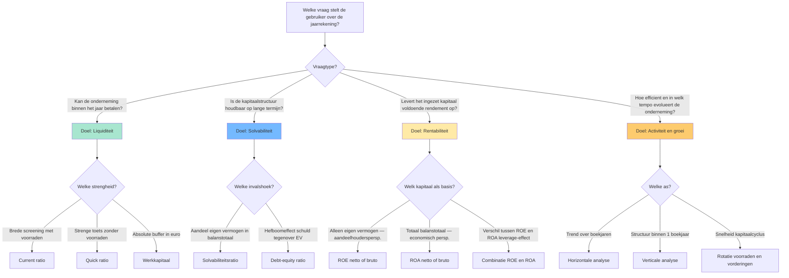
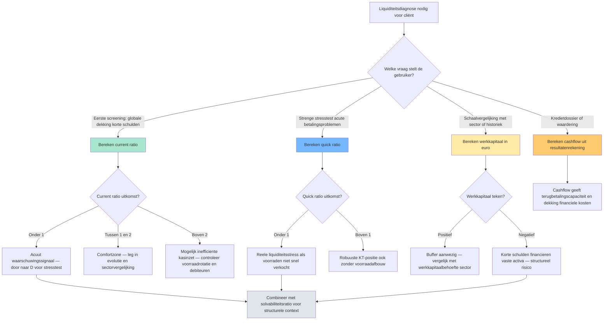

## Wat verwacht het examen van jou?

> [!abstract] Dit programmaonderdeel wordt getoetst op niveau *integratie*.
> Je moet meerdere concepten samen kunnen inzetten in complexe casussen — onderdelen herkennen, prioriteren, en tot een coherent oordeel komen.

**Taken** (uit het ITAA-examenprogramma):

> [!abstract]- **Taak 1** — Analyse en beoordeling van de financiële situatie van een vennootschap of vereniging aan de hand van de jaarrekeningen, ratio's en kengetallen
>
> **Doelstellingen**:
> - In staat zijn om, na informatie te hebben verzameld, geselecteerd, geanalyseerd en samengevat, de jaarrekeningen van een vennootschap of een vereniging kritisch te bekijken.
> - Na de analyse ook voorstellen kunnen doen om de situatie van de onderneming/vereniging te verbeteren, waakzamer te zijn of te controleren.

## Leesgids

<!-- TODO: Opus-glue leesgids -->

## Waarom dit programmaonderdeel telt

<!-- TODO: Opus-glue waarom_po -->

## Waarom analyseer je een jaarrekening? Doelstellingen, gebruikers en getrouw beeld

<!-- TODO: Opus-glue oriëntatie -->

## De jaarrekening als studieobject: structuur en aangrijpingspunten

> [!info] Hoort bij taak: Analyse en beoordeling van de financiële situatie van een vennootschap of vereniging aan de hand van de jaarrekeningen,…

<!-- TODO: Opus-glue thematisch-intro -->

- [[jaarrekening-als-studieobject|Jaarrekening als studieobject van financiële analyse]] · `begrip`
- [[getrouw-beeld-jaarrekening|Getrouw beeld van de jaarrekening]] · `regel`
- [[materieel-belang-jaarrekening|Materieel belang (materiality)]] · `regel`
- [[doelstellingen-financiele-analyse|Doelstellingen van financiële analyse]] · `begrip`
- [[gebruikers-jaarrekening|Gebruikers van de jaarrekening]] · `begrip`

## De vier analyse-doelen en hun ratio's — overzicht

Synthese-overzicht dat de vier klassieke doelen van financiële analyse (liquiditeit, solvabiliteit, rentabiliteit, werkkapitaal/cashflow) koppelt aan hun ratio's, zodat de stagiair in één oogopslag ziet welke ratio bij welk doel hoort en hoe ze elkaar aanvullen.

<!-- TODO: Opus-glue synthese-intro -->

| Analyse-doel | Kernvraag | Belangrijkste ratio's | Bron-component balans/RR | Typische gebruiker |
|---|---|---|---|---|
| **Liquiditeit** (KT betaalkracht) | Kan de onderneming haar schulden ≤ 1 jaar betalen met haar vlottende activa? | [[current-ratio\|Current ratio]] · [[quick-ratio\|Quick ratio]] · [[werkkapitaal\|Werkkapitaal]] | Vlottende activa (voorraden + vorderingen ≤ 1 jaar + geldbeleggingen + liquide middelen); Schulden ≤ 1 jaar | Kredietverlener KT · leverancier · cashmanager |
| **Solvabiliteit** (LT schokbestendigheid) | Hoe groot is het eigen vermogen tegenover totaal vermogen en schulden? | [[solvabiliteitsratio\|Solvabiliteitsratio (EV / balanstotaal)]] · [[debt-equity-ratio\|Debt-equity (VV / EV)]] | Eigen vermogen totaal; Balanstotaal; Schulden totaal | Bank LT · obligatiehouder · aandeelhouder structureel risico |
| **Rentabiliteit** (winstgevendheid kapitaal) | Levert de zaak voldoende rendement op tegenover wat erin geïnvesteerd is? | [[rentabiliteit-eigen-vermogen-roe\|ROE (winst / EV)]] · [[rentabiliteit-totaal-activa-roa\|ROA (winst + kosten schulden / totaal activa)]] · Brutovarianten op [[cashflow-analyse\|cashflow]] | Winst van het boekjaar; Eigen vermogen; Balanstotaal; Kosten van schulden; Niet-kaskosten | Aandeelhouder · investeerder · interne controller |
| **Activiteit/groei** (operationele efficiëntie + dynamiek) | Hoe snel rouleren voorraden en handelsvorderingen? Groeit de omzet? | Rotatie voorraden · rotatie handelsvorderingen · [[horizontale-analyse-jaarrekening\|Horizontale analyse]] op omzet en EBITDA | Omzet meerdere boekjaren; Voorraden gemiddeld; Vorderingen gemiddeld | Operationele manager · auditor · sector-analyst |

**Kerninzichten**:

- De keuze van een ratio begint NOOIT bij de balans — ze begint bij de vraag van de gebruiker. Een kredietverlener op korte termijn kijkt eerst naar de quick ratio; een obligatiehouder eerst naar de solvabiliteit; een aandeelhouder eerst naar ROE. Wie eerst formules verzamelt en dan een verhaal zoekt, mist de analyse-discipline.
- ROE en ROA SAMEN lezen ontmaskert het leverage-effect. Bij Rotex Roeselare NV is netto-ROE 20,8 % terwijl netto-ROA 13,0 % is — het gat van 7,8 procentpunten zegt dat schulden de aandeelhouderswinst versterken. Als ROE lager wordt dan ROA, werkt de hefboom omgekeerd: de kost van schulden is dan groter dan het rendement op activa.
- Liquiditeit en solvabiliteit zijn complementair, geen synoniemen. Een vennootschap kan liquide zijn (vlottende activa > korte schulden) maar tegelijkertijd structureel zwak gefinancierd (laag eigen vermogen). Omgekeerd kan een solvabele onderneming tijdelijk illiquide zijn (cashtekort terwijl ze rijk is aan vaste activa). Examenvraag-camouflage: alleen op één van de twee letten = halve diagnose.
- Een hoge ratio is niet automatisch goed. Een current ratio > 3 kan signaleren dat middelen vastliggen in onproductieve voorraden of trage vorderingen; een solvabiliteit > 70 % kan betekenen dat de onderneming te weinig hefboom benut. Interpretatie vereist altijd sectorvergelijking en historiek — de drie analyse-assen samen.
- Brutovarianten met cashflow (bruto-ROE, bruto-ROA) filteren niet-kaskosten weg en zijn moeilijker boekhoudkundig te manipuleren dan nettovarianten. Voor kredietdossiers en waarderingsvragen geven brutoratio's vaak een eerlijker beeld dan nettoratio's. Voor aandeelhoudersrendementsanalyse blijft netto-ROE de standaard.

_Bouwt op_: [[doelstellingen-financiele-analyse]] · [[liquiditeitsratio]] · [[current-ratio]] · [[quick-ratio]] · [[werkkapitaal]] · [[solvabiliteitsratio]] · [[debt-equity-ratio]] · [[rentabiliteit-eigen-vermogen-roe]] · [[rentabiliteit-totaal-activa-roa]] · [[cashflow-analyse]] · [[horizontale-analyse-jaarrekening]] · [[verticale-analyse-jaarrekening]]
## Voorbereiden van een financiële analyse van de jaarrekening

> [!info] Hoort bij taak: Analyse en beoordeling van de financiële situatie van een vennootschap of vereniging aan de hand van de jaarrekeningen,…

<!-- TODO: Opus-glue competentie-intro -->

[[competenties/voorbereiden-financiele-analyse|→ Volledige procedure]]

## Opstellen van een analytische balans voor een vennootschap

> [!info] Hoort bij taak: Analyse en beoordeling van de financiële situatie van een vennootschap of vereniging aan de hand van de jaarrekeningen,…

<!-- TODO: Opus-glue competentie-intro -->

[[competenties/opstellen-analytische-balans|→ Volledige procedure]]

## Berekenen en interpreteren van de liquiditeitsratio's

> [!info] Hoort bij taak: Analyse en beoordeling van de financiële situatie van een vennootschap of vereniging aan de hand van de jaarrekeningen,…

<!-- TODO: Opus-glue competentie-intro -->

[[competenties/berekenen-interpreteren-liquiditeitsratios|→ Volledige procedure]]

## Verfijningen van de liquiditeitsanalyse: cash ratio en werkkapitaalbehoefte

> [!info] Hoort bij taak: Analyse en beoordeling van de financiële situatie van een vennootschap of vereniging aan de hand van de jaarrekeningen,…

<!-- TODO: Opus-glue thematisch-intro -->

- [[cash-ratio|Cash ratio (liquiditeit in strenge zin)]] · `cluster`
- [[werkkapitaalbehoefte|Werkkapitaalbehoefte (besoin en fonds de roulement, BFR)]] · `begrip`
- [[werkkapitaal|Werkkapitaal (working capital)]] · `begrip`

## Berekenen en interpreteren van de solvabiliteitsratio's

> [!info] Hoort bij taak: Analyse en beoordeling van de financiële situatie van een vennootschap of vereniging aan de hand van de jaarrekeningen,…

<!-- TODO: Opus-glue competentie-intro -->

[[competenties/berekenen-interpreteren-solvabiliteitsratios|→ Volledige procedure]]

## Berekenen en interpreteren van de rentabiliteitsratio's

> [!info] Hoort bij taak: Analyse en beoordeling van de financiële situatie van een vennootschap of vereniging aan de hand van de jaarrekeningen,…

<!-- TODO: Opus-glue competentie-intro -->

[[competenties/berekenen-interpreteren-rentabiliteitsratios|→ Volledige procedure]]

## Welke liquiditeitstoets gebruik ik? — Beslisboom

Hulpstructuur voor de stagiair: welke liquiditeitsmaat is in welke context de juiste — current ratio voor algemene liquiditeit, quick ratio voor verfijnde toets bij voorraadintensieve sectoren, werkkapitaal als absolute aanvulling, cash ratio in stress-scenario's. De beslisboom maakt zichtbaar waarom één ratio nooit volstaat.

<!-- TODO: Opus-glue synthese-intro -->

| Toets | Wat meet ze? | Formule | Sterkte | Zwakte / valkuil |
|---|---|---|---|---|
| [[current-ratio\|Current ratio]] | Brede liquiditeit in ruime zin (verhouding) | vlottende activa / schulden ≤ 1 jaar | Snelle screening; vergelijkbaar tussen bedrijven van verschillende grootte | Hoge ratio kan opgeblazen voorraden of trage debiteuren verbergen |
| [[quick-ratio\|Quick ratio]] (zuurtegraad) | Liquiditeit in enge zin — zonder voorraden | (vlottende activa − voorraden) / schulden ≤ 1 jaar | Strenger; relevant bij voorraad-intensieve sectoren | Vorderingen worden als snel-cashbaar verondersteld; bij dubieuze debiteuren overschat ze |
| [[werkkapitaal\|Werkkapitaal]] | Absolute liquiditeitsbuffer in euro | vlottende activa − schulden ≤ 1 jaar | Toont schaal die ratio's verbergen | Twee bedrijven met zelfde werkkapitaal kunnen totaal verschillende risicoprofielen hebben (sectorgevoelig) |
| [[cashflow-analyse\|Cashflow]] (winst + niet-kaskosten) | Kasgeneratie uit eigen werking | resultaat + afschrijvingen + waardeverminderingen + voorzieningen | Filtert boekhoudkundige niet-kaselementen weg | Eenmalige voorzieningen kunnen cashflow van één boekjaar fors verhogen |

**Kerninzichten**:

- Current ratio en quick ratio zijn geen alternatieven — ze zijn complementair. Bij Rotex Roeselare NV: current 2,0 en quick 1,375. Het verschil tussen beide (0,625) is volledig toe te schrijven aan de voorraden (€ 2.500.000 op € 4.000.000 korte schulden). Het verschil zelf is dus een ratio-component: de mate waarin de liquiditeit op voorraden steunt.
- Werkkapitaal als absoluut bedrag corrigeert een verborgen valkuil van ratio's: schaal. Meubelzaak Mertens BV en Rotex Roeselare NV kunnen beide current ratio rond 1,3 hebben, maar werkkapitaal € 200.000 versus € 4.000.000. Voor financierings-capaciteit en investeringsruimte is de absolute buffer relevanter dan de verhouding.
- Een acute liquiditeitsstress (current ratio onder 1) zegt nog niets over levensvatbaarheid. Combineer altijd met de solvabiliteitsratio (structurele basis) en de cashflow (kasgeneratie). Een tijdelijk illiquide maar solvabel bedrijf kan financiering brugkalmen via een banklijn; een liquide maar onsolvabel bedrijf staat op een tijdbom.
- Cash ratio (geldbeleggingen + liquide middelen / korte schulden) is de strengste van de liquiditeitsfamilie maar krijgt in de standaard 1.3-records geen apart record. Voor voorraadintensieve sectoren of acute stress-scenario's is dat de meest waardevolle van de drie — zie open gap voor uitwerking.

_Bouwt op_: [[liquiditeitsratio]] · [[current-ratio]] · [[quick-ratio]] · [[werkkapitaal]] · [[cashflow-analyse]] · [[solvabiliteitsratio]]
## Uitvoeren van een horizontale en verticale analyse van de jaarrekening

> [!info] Hoort bij taak: Analyse en beoordeling van de financiële situatie van een vennootschap of vereniging aan de hand van de jaarrekeningen,…

<!-- TODO: Opus-glue competentie-intro -->

[[competenties/uitvoeren-horizontale-verticale-analyse|→ Volledige procedure]]

## Beoordelen van het werkkapitaal en de kasstroom van een onderneming

> [!info] Hoort bij taak: Analyse en beoordeling van de financiële situatie van een vennootschap of vereniging aan de hand van de jaarrekeningen,…

<!-- TODO: Opus-glue competentie-intro -->

[[competenties/beoordelen-werkkapitaal-en-kasstroom|→ Volledige procedure]]

## Confronteren van de financiële analyse met de toelichting en off-balance posten

> [!info] Hoort bij taak: Analyse en beoordeling van de financiële situatie van een vennootschap of vereniging aan de hand van de jaarrekeningen,…

<!-- TODO: Opus-glue competentie-intro -->

[[competenties/confronteren-toelichting-en-off-balance|→ Volledige procedure]]

## Beoordelen van het bestuursverslag en de niet-financiële informatie

> [!info] Hoort bij taak: Analyse en beoordeling van de financiële situatie van een vennootschap of vereniging aan de hand van de jaarrekeningen,…

<!-- TODO: Opus-glue competentie-intro -->

[[competenties/beoordelen-bestuursverslag-en-niet-financiele-info|→ Volledige procedure]]

## Vergelijken in tijd en sector: trend, benchmark en controle-norm

> [!info] Hoort bij taak: Analyse en beoordeling van de financiële situatie van een vennootschap of vereniging aan de hand van de jaarrekeningen,…

<!-- TODO: Opus-glue thematisch-intro -->

- [[historische-evolutie-financiele-analyse|Historische evolutie in financiële analyse]] · `cluster`
- [[sectorvergelijking-financiele-analyse|Sectorvergelijking (benchmarking)]] · `cluster`
- [[cijferanalyses-controle-norm|Cijferanalyses (controlenorm KMO)]] · `regel`

## Formuleren van een financiële diagnose en concrete verbeteradviezen

> [!info] Hoort bij taak: Analyse en beoordeling van de financiële situatie van een vennootschap of vereniging aan de hand van de jaarrekeningen,…

<!-- TODO: Opus-glue competentie-intro -->

[[competenties/formuleren-financiele-diagnose-en-adviezen|→ Volledige procedure]]

## Positioneren van de toezichtsorganen rond de jaarrekening

> [!info] Hoort bij taak: Analyse en beoordeling van de financiële situatie van een vennootschap of vereniging aan de hand van de jaarrekeningen,…

<!-- TODO: Opus-glue competentie-intro -->

[[competenties/positioneren-toezichtsorganen-rond-jaarrekening|→ Volledige procedure]]

## Kritische blik: wat zegt een financiële analyse NIET?

<!-- TODO: Opus-glue oriëntatie -->

## Synthese-stappenplan

<!-- TODO: Opus-glue synthese -->

## Cheatsheet

### Vergelijkingsparen-matrix

| Concept | Verwarrend met | Trigger |
|---|---|---|
| [[bestuursverslag]] | [[jaarverslag]] | Twee namen, één document. Term-keuze hangt af van regelgevings-context (BE/EU). |
| [[cash-ratio]] | [[quick-ratio]] | Examenvraag 'liquiditeit in enge of strengste zin?': enge = quick (zonder voorraden); strengste = cash (zonder voorraden én vorderingen). |
| [[cash-ratio]] | [[current-ratio]] | Examenvraag 'liquiditeit in ruime versus strengste zin?': ruim = current; strengst = cash. |
| [[cashflow-analyse]] | [[rentabiliteit-eigen-vermogen-roe]] | Examenvraag 'cijfer of ratio?': cashflow is een €-bedrag; ROE/ROA op cashflow zijn percentages. |
| [[current-ratio]] | [[quick-ratio]] | Examenvraag 'liquiditeit in ruime / enge zin?': ruim = current; eng = quick. |
| [[debt-equity-ratio]] | [[solvabiliteitsratio]] | Beide drukken financieringsstructuur uit; context bepaalt welke courant is — bankcovenants gebruiken D/E, ratingagentschappen vaker solvabiliteit. |
| [[getrouw-beeld-jaarrekening]] | [[voorzichtigheidsbeginsel]] | Bij een examenvraag 'welk beginsel?' — getrouw beeld als algemeen doel; voorzichtigheid als specifieke voorschrift om risico's volledig op te nemen. |
| [[horizontale-analyse-jaarrekening]] | [[verticale-analyse-jaarrekening]] | Examenvraag 'evolutie of structuur?': over de tijd = horizontaal; samenstelling op één moment = verticaal. |
| [[liquiditeitsratio]] | [[solvabiliteitsratio]] | Examenvraag 'kortetermijnsbetaalkracht versus structurele veerkracht': KT = liquiditeit; lang = solvabiliteit. |
| [[liquiditeitsratio]] | [[cash-ratio]] | Examenvraag 'strengste liquiditeitstoets?' of 'welke ratio sluit voorraden én vorderingen uit?': altijd cash ratio. |
| [[niet-in-balans-opgenomen-rechten-verplichtingen]] | [[voorzieningen]] | Examenvraag 'voorziening of niet in balans?': becijferbaar + waarschijnlijk = voorziening (balans); onzeker of onbecijferbaar = niet in balans (toelichting). |
| [[quick-ratio]] | [[current-ratio]] | Voorraad-intensiteit: in productie/handel altijd allebei berekenen om de spreiding te zien. |
| [[rentabiliteit-eigen-vermogen-roe]] | [[rentabiliteit-totaal-activa-roa]] | Examenvraag 'welke ratio voor welke vraag?': aandeelhoudersrendement = ROE; economische winstgevendheid van de bedrijfsmiddelen = ROA. |
| [[rentabiliteit-totaal-activa-roa]] | [[rentabiliteit-eigen-vermogen-roe]] | Examenvraag 'economisch vs financieel rendement': economisch = ROA; financieel/aandeelhouder = ROE. |
| [[solvabiliteitsratio]] | [[liquiditeitsratio]] | Examenvraag 'structureel vs operationeel risico': structureel = solvabiliteit; KT betalingsrisico = liquiditeit. |
| [[solvabiliteitsratio]] | [[debt-equity-ratio]] | Solvabiliteitsratio bij algemene structuuranalyse; debt-equity-ratio bij specifieke hefboom- of risicobeoordeling (bankcovenants). |
| [[verticale-analyse-jaarrekening]] | [[horizontale-analyse-jaarrekening]] | Examen 'samenstelling of trend?': samenstelling = verticaal; trend = horizontaal. |
| [[werkkapitaal]] | [[current-ratio]] | Examenvraag 'absolute buffer of relatieve dekking?': absoluut = werkkapitaal; relatief = current ratio. |
| [[werkkapitaal]] | [[werkkapitaalbehoefte]] | Examenvraag 'beschikbaar versus benodigd werkkapitaal' of 'wanneer is er liquiditeitstekort?': vergelijk werkkapitaal (beschikbaar uit balans) met werkkapitaalbehoefte (benodigd voor cyclus). |
| [[werkkapitaalbehoefte]] | [[werkkapitaal]] | Examenvraag 'beschikbaar versus benodigd werkkapitaal': beschikbaar = werkkapitaal; benodigd = werkkapitaalbehoefte. |

## Heb je deze taken in de vingers?

Loop deze taken na vóór je verder gaat met examenfocus. Twijfel je bij een taak? Lees de aangegeven secties nog eens.

- ✓ **1.3.taak.1** — Analyse en beoordeling van de financiële situatie van een vennootschap of vereniging aan de hand van de jaarrekeningen,… _Behandeld in §5, §6, §7, §8, §9, §10, §11, §12, §13, §14, §15, §16, §17, §18, §19, §20._

## Examenfocus

<!-- TODO: Opus-glue examenfocus -->

> [!question]- Berekening van financiële ratio's op basis van de jaarrekening
> *Examen 2013-1 · PO 1.3*
>
> > In bijlage vindt u de balans na winstverdeling en de resultatenrekening van een cliënt. Bereken de gevraagde ratio's telkens voor het BOEKJAAR. U dient de formules NIET uit te schrijven, maar WEL de gebruikte cijfers uit de jaarrekening als motivatie van uw antwoord. U dient uw antwoord uit te drukken tot TWEE cijfers na de komma.
>
> **Bijkomende informatie uit toelichting**
>
> | Label | Bedrag |
> | --- | --- |
> | Investeringen in materiële vaste activa tijdens het boekjaar | 451.692,38 |
> | Kapitaalsubsidies aangerekend op de resultatenrekening | 56.498,19 |
> | Andere exploitatiesubsidies ontvangen | 0 |
>
> Bereken het nettobedrijfskapitaal voor het boekjaar.
>
> > [!success]- Antwoord (klik om te openen)
> > _Antwoord wacht op concept-laag._
>
> Bereken de brutoverkoopmarge (in %) voor het boekjaar.
>
> > [!success]- Antwoord (klik om te openen)
> > _Antwoord wacht op concept-laag._
>
> Bereken de personeelskosten ten opzichte van de toegevoegde waarde (in %) voor het boekjaar.
>
> > [!success]- Antwoord (klik om te openen)
> > _Antwoord wacht op concept-laag._

> [!question]- Ratio-analyse: brutoverkoopmarge, nettorentabiliteit en liquiditeit
> *Examen 2013-2 · PO 1.3*
>
> > In bijlage vindt u de balans na winstverdeling en de resultatenrekening van een cliënt.
> > 
> > Bereken de gevraagde ratio's telkens voor het BOEKJAAR.
> > U dient de formules NIET uit te schrijven, maar WEL de gebruikte cijfers uit de jaarrekening als motivatie van uw antwoord.
> > U dient uw antwoord uit te drukken tot TWEE cijfers na de komma.
> > 
> > Uit de toelichting tot de jaarrekening blijkt o.a. dat:
> > 1) Er tijdens het boekjaar investeringen in materiële vaste activa werden gedaan voor 361.869,98 euro;
> > 2) Er exploitatiesubsidies werden aangerekend op de resultatenrekening voor 415 euro;
> > 3) Er geen intrestsubsidies zijn;
> > 4) Er werd geen disconto ten laste van de onderneming bij de verhandeling van vorderingen geboekt;
> > 5) Er werden geen belastingen geboekt op het resultaat van vorige boekjaren;
> > 6) De te bestemmen winst van het boekjaar integraal gereserveerd werd.
>
> Bereken de brutoverkoopmarge (%).
>
> > [!success]- Antwoord (klik om te openen)
> > _Antwoord wacht op concept-laag._
>
> Bereken de nettorentabiliteit van het totaal der activa, voor belastingen en financiële kosten (%).
>
> > [!success]- Antwoord (klik om te openen)
> > _Antwoord wacht op concept-laag._
>
> Bereken de liquiditeit in ruime zin.
>
> > [!success]- Antwoord (klik om te openen)
> > _Antwoord wacht op concept-laag._

> [!question]- Liquiditeitsratio's: betekenis en onderscheid ruime vs. enge zin
> *Examen 2013-2 · PO 1.3*
>
> Wat komt een bedrijfsleider te weten door de liquiditeitsratio's te berekenen?
>
> > [!success]- Antwoord (klik om te openen)
> > _Antwoord wacht op concept-laag._
>
> Met welke elementen houdt men geen rekening bij de berekening van de liquiditeit in enge zin en wel bij de berekening van de liquiditeit in ruime zin?
>
> > [!success]- Antwoord (klik om te openen)
> > _Antwoord wacht op concept-laag._
>
> Verklaar uw antwoord aangaande punt b.
>
> > [!success]- Antwoord (klik om te openen)
> > _Antwoord wacht op concept-laag._

> [!question]- Financiële ratio's berekenen op basis van jaarrekening — toegevoegde waarde, nettobedrijfskapitaal, rentabiliteit, liquiditeit
> *Examen 2014-1 · PO 1.3*
>
> > In bijlage vindt u de balans na winstverdeling en de resultatenrekening van een cliënt. Kruis het juiste antwoord aan voor de ratio's van het boekjaar. Uit de toelichting tot de jaarrekening blijkt o.a. dat: (1) er tijdens het boekjaar investeringen in materiële vaste activa werden gedaan voor 361.869,98 EUR; (2) er exploitatiesubsidies werden aangerekend op de resultatenrekening voor 415,00 EUR; (3) er intrestsubsidies werden aangerekend op de resultatenrekening voor een bedrag van 6.000,00 EUR; (4) er geen disconto ten laste van de onderneming bij de verhandeling van vorderingen geboekt werd; (5) er gemiddeld 38,20 werknemers (voltijds equivalent) tewerkgesteld waren; (6) de te bestemmen winst van het boekjaar integraal gereserveerd werd.
>
> Bruto toegevoegde waarde per werknemer
>
> - **a)** (7.441.663 – 3.185.295 – 1.192.317) : 38,20 = 80.210,76
> - **b)** (7.441.663 – 415 – 3.185.295 – 1.192.317) : 38,20 = 80.199,90
> - **c)** (7.441.663 – 3.185.295 – 1.192.317 – 1.548.647) : 38,20 = 39.670,26
> - **d)** (7.441.663 – 3.185.295 – 1.192.317 – 436.469 – 879) : 38,20 = 68.761,86
>
> > [!success]- Antwoord (klik om te openen)
> > _Antwoord wacht op concept-laag._
>
> Nettobedrijfskapitaal
>
> - **a)** 1.371.010 + 1.739.806 + 2.200.000 + 2.548.415 – 1.210.536 = 6.648.695
> - **b)** 120.000 + 1.371.010 + 1.739.806 + 2.200.000 + 2.548.415 – 1.210.536 = 6.768.695
> - **c)** 1.371.010 + 1.739.806 + 2.200.000 + 2.548.415 + 2.704 – 1.210.536 – 39.932 = 6.611.467
> - **d)** 120.000 + 1.371.010 + 1.739.806 + 2.200.000 + 2.548.415 + 2.704 – 1.210.536 – 39.932 = 6.731.467
>
> > [!success]- Antwoord (klik om te openen)
> > _Antwoord wacht op concept-laag._
>
> Nettorentabiliteit van het totaal der activa voor belastingen en financiële kosten
>
> - **a)** ((877.279 + 46.934 + 211.950 – 6.000) : 9.081.054) % = 12,45
> - **b)** ((577.279 + 109.642 + 185.720 – 6.000) : 9.081.054) % = 9,54
> - **c)** ((877.279 + 46.934 + 211.950) : 9.081.054) % = 12,51
> - **d)** ((577.279 + 109.642 + 211.950 – 6.000) : 9.081.054) % = 9,83
>
> > [!success]- Antwoord (klik om te openen)
> > _Antwoord wacht op concept-laag._
>
> Liquiditeit in enge zin
>
> - **a)** (1.371.010 + 1.739.806 + 2.200.000 + 2.548.415 + 2.704) : (1.210.536 + 39.932) = 6,29
> - **b)** (1.739.806 + 2.200.000 + 2.548.415) : 1.210.536 = 5,36
> - **c)** (1.371.010 + 1.739.806 + 2.200.000 + 2.548.415) : 1.210.536 = 6,49
> - **d)** (1.739.806 + 2.200.000 + 2.548.415 + 2.704) : (1.210.536 + 39.932) = 5,19
>
> > [!success]- Antwoord (klik om te openen)
> > _Antwoord wacht op concept-laag._

> [!question]- Nettothesaurie — begrip omschrijven en positief saldo interpreteren
> *Examen 2014-1 · PO 1.3*
>
> Omschrijf het begrip 'nettothesaurie'.
>
> > [!success]- Antwoord (klik om te openen)
> > _Antwoord wacht op concept-laag._
>
> Als u de nettothesaurie berekent en de uitkomst is positief, wat betekent dit dan?
>
> > [!success]- Antwoord (klik om te openen)
> > _Antwoord wacht op concept-laag._

> [!question]- Behoefte aan werkkapitaal: selectie van balansposten
> *Examen 2015-1 · PO 1.3*
>
> > Vraag 3 van de sectie 'Analyse en kritische beoordeling van de jaarrekening'. Bij elk foutief of ontbrekend antwoord wordt 1 punt afgetrokken.
>
> **Balansposten te beoordelen voor behoefte aan werkkapitaal**
>
> | Label | Bedrag |
> | --- | --- |
> | Materiële vaste activa (22/27) |   |
> | Financiële vaste activa (28) |   |
> | Vorderingen op meer dan één jaar (29) |   |
> | Voorraden (30/36) |   |
> | Bestellingen in uitvoering (37) |   |
> | Handelsvorderingen (40) |   |
> | Overige vorderingen (41) |   |
> | Geldbeleggingen (50/53) |   |
> | Liquide middelen (54/58) |   |
> | Overlopende rekeningen van het actief (490/1) |   |
> | Eigen vermogen (10/15) |   |
> | Voorzieningen en uitgestelde belastingen (16) |   |
> | Schulden op meer dan één jaar (17) |   |
> | Schulden op meer dan één jaar die binnen het jaar vervallen (42) |   |
> | Financiële schulden (43) |   |
> | Handelsschulden (44) |   |
> | Ontvangen vooruitbetalingen (46) |   |
> | Schulden m.b.t. belastingen, bezoldigingen en sociale lasten (45) |   |
> | Overige schulden (47/48) |   |
> | Overlopende rekeningen van het passief (492/3) |   |
>
> Welke van de onderstaande balansposten (met code) neemt u op in de berekening 'behoefte aan werkkapitaal (of bedrijfskapitaal)'? Duid bij elke code 'ja of nee' aan.
>
> > [!success]- Antwoord (klik om te openen)
> > _Antwoord wacht op concept-laag._

> [!question]- Berekening financiële ratio's op basis van jaarrekening
> *Examen 2015-1 · PO 1.3*
>
> > Op basis van de balans na winstverdeling en de resultatenrekening van een cliënt (zie bijlage). Uit de toelichting: (1) investeringen materiële vaste activa 452.835 EUR; (2) exploitatiesubsidies 1.288 EUR; (3) intrestsubsidies 14.214 EUR; (4) geen disconto ten laste; (5) gemiddeld 38,20 werknemers (VTE); (6) voorziening pensioenen teruggenomen voor 1.665 EUR; (7) te bestemmen winst integraal gereserveerd.
>
> Brutoverkoopmarge: welke berekening is correct?
>
> - **a)** (1.479.283 + 425.554 + 804) x 100 / (8.034.747 + 344.153) = 22,74
> - **b)** (1.417.747 + 425.554 + 804) x 100 / (8.365.788 - 1.600.244) = 27,26
> - **c)** (1.479.283 + 425.554 + 804 – 1.665) x 100 / (8.034.747 + 344.153 – 1.288) = 22,73
> - **d)** (968.829 + 425.554 + 804 – 1.665) x 100 / (8.365.788 – 1.288) = 16,66
>
> > [!success]- Antwoord (klik om te openen)
> > _Antwoord wacht op concept-laag._
>
> Personeelskosten ten opzichte van toegevoegde waarde: welke berekening is correct?
>
> - **a)** (1.600.244 – 1.665) X 100 / (8.365.788 - 1.288 – 3.457.309 – 1.398.278) = 45,56
> - **b)** 1.600.244 x 100 / (8.365.788 – 3.457.309 – 1.398.278) = 45,59
> - **c)** 1.600.244 x 100 / 1.479.283 = 108,18
> - **d)** (1.600.244 – 1.665) x 100 / (8.034.747 – 13.112 - 3.457.309 – 1.398.278 – 1.288) = 50,51
>
> > [!success]- Antwoord (klik om te openen)
> > _Antwoord wacht op concept-laag._
>
> Nettorentabiliteit van het eigen vermogen na belastingen: welke berekening is correct?
>
> - **a)** 968.829 x 100 / 10.274.463 = 9,43
> - **b)** 968.829 x 100 / 8.177.941 = 11,85
> - **c)** 1.417.747 x 100 / 10.274.463 = 13,80
> - **d)** 1.479.283 x 100 / 8.177.941 = 18,09
>
> > [!success]- Antwoord (klik om te openen)
> > _Antwoord wacht op concept-laag._
>
> Rotatie van de voorraad handelsgoederen, grond- en hulpstoffen: welke berekening is correct?
>
> - **a)** 3.444.161 / 530.373 = 6,49
> - **b)** 3.457.309 / 530.373 = 6,52
> - **c)** 3.457.309 / 1.344.750 = 2,57
> - **d)** 3.444.161 / 1.344.750 = 2,56
>
> > [!success]- Antwoord (klik om te openen)
> > _Antwoord wacht op concept-laag._

> [!question]- Begripsomschrijving financiële analyse: intrinsieke waarde, fractiewaarde, rendabiliteit, schuldgraad, operationele cash flow
> *Examen 2015-1 · PO 1.3*
>
> Omschrijf het begrip 'intrinsieke waarde'.
>
> > [!success]- Antwoord (klik om te openen)
> > _Antwoord wacht op concept-laag._
>
> Omschrijf het begrip 'fractiewaarde'.
>
> > [!success]- Antwoord (klik om te openen)
> > _Antwoord wacht op concept-laag._
>
> Omschrijf het begrip 'netto rendabiliteit van de bedrijfsactiva'.
>
> > [!success]- Antwoord (klik om te openen)
> > _Antwoord wacht op concept-laag._
>
> Omschrijf het begrip 'algemene schuldgraad'.
>
> > [!success]- Antwoord (klik om te openen)
> > _Antwoord wacht op concept-laag._
>
> Omschrijf het begrip 'operationele cash flow voor belastingen'.
>
> > [!success]- Antwoord (klik om te openen)
> > _Antwoord wacht op concept-laag._

> [!question]- Analyse en kritische beoordeling van de jaarrekening
> *Examen 2024-1 (uit herinnering gereconstrueerd) · PO 1.3*
>
> > Onderdeel '10 Analyse en kritische beoordeling van de jaarrekening' uit het schriftelijk bekwaamheidsexamen ITAA 2024 — herinnerings-fragment met vijf deelvragen.
>
> > [!warning] Topic enkel — geen vraagstelling beschikbaar
> > Stellingen ivm financiële onafhankelijkheid
>
> > [!success]- Antwoord (klik om te openen)
> > _Vraag-inhoud niet gereconstrueerd (topic-only). Wacht op vraag-generatie._
>
> Welke ratio kan je niet berekenen op basis van een verkort schema? (n-dagen klantenkrediet)
>
> > [!success]- Antwoord (klik om te openen)
> > **_Het aantal dagen klantenkrediet (DSO - Days Sales Outstanding) kan niet worden berekend op basis van een verkort schema, omdat het netto-omzetcijfer (rekening 70) niet afzonderlijk wordt gepubliceerd in het verkort schema. Op het verkort schema staan enkel geaggregeerde bedrijfsopbrengsten - zonder een aparte omzetregel kan de noemer (omzet incl. BTW) van de DSO-formule niet bepaald worden._** 🤖
> > 
> > Formule klantenkrediet: (Handelsvorderingen + ontvangen wissels) / (Omzet incl. BTW) x 365. De handelsvorderingen (rekening 40) staan wel op het verkort balansschema, maar de omzet (rekening 70) ontbreekt op de verkorte resultatenrekening (de rubriek 'bedrijfsopbrengsten' is geaggregeerd). Andere ratio's die hierdoor evenmin berekenbaar zijn op een verkort schema: leverancierskrediet (vereist aankopen), bruto verkoopmarge (vereist omzet en aankopen), rotatiesnelheid voorraden (vereist omzet of kostprijs verkopen). ⚠️ te verifiëren - exacte rubriek-aggregatie van het verkort schema NBB-publicatieschema te valideren tegen actuele KB-bijlage WVV. 🤖
>
> In welke volgorde zijn rubrieken op het Passief van de Balans gerangschikt?
>
> > [!success]- Antwoord (klik om te openen)
> > **_De rubrieken op het passief van de balans zijn gerangschikt in volgorde van toenemende eisbaarheid - d.w.z. van de minst eisbare verplichtingen (eigen vermogen) bovenaan, naar de meest eisbare (schulden op korte termijn) onderaan. De antwoord-hint 'Toenemende eisbaarheid' is dus correct._** 🤖
> > 
> > - I. Kapitaal / Inbreng (minst eisbaar - eigen vermogen)
> > - II. Uitgiftepremies
> > - III. Herwaarderingsmeerwaarden
> > - IV. Reserves
> > - V. Overgedragen winst (verlies)
> > - VI. Kapitaalsubsidies
> > - VII. Voorzieningen en uitgestelde belastingen
> > - VIII. Schulden op meer dan een jaar
> > - IX. Schulden op ten hoogste een jaar (meest eisbaar)
> > - X. Overlopende rekeningen 🤖
> > 
> > Het Belgisch jaarrekeningschema rangschikt de passiefzijde volgens dit ordenend beginsel, analoog aan de actiefzijde die wordt gerangschikt volgens toenemende liquiditeit. Eigen vermogen (rubrieken I tot VI) heeft geen of een onbepaalde vervaldag en staat bovenaan; schulden op korte termijn (rubriek IX) zijn binnen het jaar opeisbaar en staan onderaan. Validatie van de antwoord-hint van de stagiair: 'Toenemende eisbaarheid' is een correcte beknopte formulering van dit ordeningsbeginsel. ⚠️ te verifiëren - exacte rubricering en nummering tegen KB WVV bijlage / volledig schema MAR. 🤖
>
> JR kort model NBB voor kapitaalvennootschap: hoe wordt EV berekend?
>
> > [!success]- Antwoord (klik om te openen)
> > **Eigen vermogen in het verkort jaarrekeningmodel NBB voor een kapitaalvennootschap**: Som van de eigenvermogensrubrieken op de passiefzijde van het verkort balansschema, namelijk: I. Kapitaal / Inbreng (volstort + niet-opgevraagd, voor de BV onbeschikbare en beschikbare inbreng) + II. Uitgiftepremies + III. Herwaarderingsmeerwaarden + IV. Reserves (wettelijke, onbeschikbare, beschikbare) + V. Overgedragen winst of verlies + VI. Kapitaalsubsidies. 🤖
> > 
> > Formule kort-model NBB voor kapitaalvennootschap (BV/NV): EV = I (Inbreng) + II (Uitgiftepremies) + III (Herwaarderingsmeerwaarden) + IV (Reserves) + V (Overgedragen winst/verlies) + VI (Kapitaalsubsidies). In het verkort schema worden deze posten geaggregeerd gepresenteerd, maar de samenstelling blijft identiek aan het volledig schema. Voor de BV (sinds WVV) is het concept 'kapitaal' vervangen door 'inbreng' (rubriek I = bijdragen door aandeelhouders), opgesplitst in onbeschikbaar (oud kapitaal) en beschikbaar. ⚠️ te verifiëren - exacte rubrieken verkort schema NBB-publicatieformulier C/VKT versie 2024 tegen KB WVV bijlage 1. 🤖
>
> Alfa is verlieslatend. Verhoging van de afschrijving op gebouwen door verkorting van de verwachte levensduur heeft het volgende effect op de bruto verkoopmarge:
>
> - **a)** Stijging
> - **b)** Daling
> - **c)** Geen
> - **d)** Stijging op voorwaarde dat de verhoogde afschrijving als bedrijfskost is geboekt
>
> > [!success]- Antwoord (klik om te openen)
> > **Antwoord: c**

## Competentie-index

- [[competenties/begeleiden-waardering-onderneming-bij-overdracht|Begeleiden van de waardering van een onderneming bij overdracht]]
- [[competenties/beoordelen-bestuursverslag-en-niet-financiele-info|Beoordelen van het bestuursverslag en de niet-financiële informatie]]
- [[competenties/beoordelen-werkkapitaal-en-kasstroom|Beoordelen van het werkkapitaal en de kasstroom van een onderneming]]
- [[competenties/berekenen-interpreteren-liquiditeitsratios|Berekenen en interpreteren van de liquiditeitsratio's]]
- [[competenties/berekenen-interpreteren-rentabiliteitsratios|Berekenen en interpreteren van de rentabiliteitsratio's]]
- [[competenties/berekenen-interpreteren-solvabiliteitsratios|Berekenen en interpreteren van de solvabiliteitsratio's]]
- [[competenties/confronteren-toelichting-en-off-balance|Confronteren van de financiële analyse met de toelichting en off-balance posten]]
- [[competenties/formuleren-financiele-diagnose-en-adviezen|Formuleren van een financiële diagnose en concrete verbeteradviezen]]
- [[competenties/opstellen-analytische-balans|Opstellen van een analytische balans voor een vennootschap]]
- [[competenties/positioneren-toezichtsorganen-rond-jaarrekening|Positioneren van de toezichtsorganen rond de jaarrekening]]
- [[competenties/uitvoeren-horizontale-verticale-analyse|Uitvoeren van een horizontale en verticale analyse van de jaarrekening]]
- [[competenties/voorbereiden-financiele-analyse|Voorbereiden van een financiële analyse van de jaarrekening]]

## Concept-index

- [[algemene-vergadering-toezichtsfunctie|Algemene vergadering — toezichtsfunctie op jaarrekening]] · `autoriteit`
- [[analytische-balans|Analytische balans (herstructureringsschema)]] · `cluster`
- [[beoordelen-bestuursverslag-en-niet-financiele-info|Beoordelen van het bestuursverslag en de niet-financiële informatie]] · `competentie`
- [[beoordelen-werkkapitaal-en-kasstroom|Beoordelen van het werkkapitaal en de kasstroom van een onderneming]] · `competentie`
- [[berekenen-interpreteren-liquiditeitsratios|Berekenen en interpreteren van de liquiditeitsratio's]] · `competentie`
- [[berekenen-interpreteren-rentabiliteitsratios|Berekenen en interpreteren van de rentabiliteitsratio's]] · `competentie`
- [[berekenen-interpreteren-solvabiliteitsratios|Berekenen en interpreteren van de solvabiliteitsratio's]] · `competentie`
- [[bestuursverslag|Bestuursverslag (jaarverslag)]] · `procedure`
- [[cash-ratio|Cash ratio (liquiditeit in strenge zin)]] · `cluster`
- [[cashflow-analyse|Cashflow (bedrijfscashflow)]] · `begrip`
- [[cijferanalyses-controle-norm|Cijferanalyses (controlenorm KMO)]] · `regel`
- [[commissaris-toezicht-jaarrekening|Commissaris (extern toezicht op jaarrekening)]] · `autoriteit`
- [[confronteren-toelichting-en-off-balance|Confronteren van de financiële analyse met de toelichting en off-balance posten]] · `competentie`
- [[corporate-governance-verklaring|Corporate-governance-verklaring]] · `procedure`
- [[current-ratio|Current ratio (liquiditeit in ruime zin)]] · `cluster`
- [[ratio-vier-doelen-vergelijking|De vier analyse-doelen en hun ratio's — overzicht]] · `synthese`
- [[debt-equity-ratio|Debt-equity ratio (schuldgraad)]] · `cluster`
- [[doelstellingen-financiele-analyse|Doelstellingen van financiële analyse]] · `begrip`
- [[formuleren-financiele-diagnose-en-adviezen|Formuleren van een financiële diagnose en concrete verbeteradviezen]] · `competentie`
- [[gebruikers-jaarrekening|Gebruikers van de jaarrekening]] · `begrip`
- [[getrouw-beeld-jaarrekening|Getrouw beeld van de jaarrekening]] · `regel`
- [[historische-evolutie-financiele-analyse|Historische evolutie in financiële analyse]] · `cluster`
- [[horizontale-analyse-jaarrekening|Horizontale analyse (evolutie-analyse)]] · `cluster`
- [[intake-financiele-analyse|Intake (scoping) van financiële analyse]] · `procedure`
- [[jaarrekening-als-studieobject|Jaarrekening als studieobject van financiële analyse]] · `begrip`
- [[kamer-ondernemingen-in-moeilijkheden|Kamer voor ondernemingen in moeilijkheden]] · `autoriteit`
- [[klasse-0-niet-in-balans|Klasse 0 — niet in de balans opgenomen rekeningen]] · `begrip`
- [[liquiditeitsratio|Liquiditeitsratio (begrip)]] · `begrip`
- [[materieel-belang-jaarrekening|Materieel belang (materiality)]] · `regel`
- [[meldingsplicht-accountant-continuiteit|Meldingsplicht accountant bij bedreigde continuïteit]] · `regel`
- [[niet-in-balans-opgenomen-rechten-verplichtingen|Niet in de balans opgenomen rechten en verplichtingen]] · `regel`
- [[ondernemingsraad-sociaal-economische-info|Ondernemingsraad — sociaal-economische informatie]] · `autoriteit`
- [[opstellen-analytische-balans|Opstellen van een analytische balans voor een vennootschap]] · `competentie`
- [[positioneren-toezichtsorganen-rond-jaarrekening|Positioneren van de toezichtsorganen rond de jaarrekening]] · `competentie`
- [[quick-ratio|Quick ratio (liquiditeit in enge zin, zuurtegraad)]] · `cluster`
- [[ratio-covenants|Ratiocovenants (financial covenants)]] · `begrip`
- [[rentabiliteit-eigen-vermogen-roe|Rentabiliteit van het eigen vermogen (ROE)]] · `cluster`
- [[rentabiliteit-totaal-activa-roa|Rentabiliteit van het totaal der activa (ROA)]] · `cluster`
- [[risicoparagraaf-bestuursverslag|Risicoparagraaf in het bestuursverslag]] · `regel`
- [[sectorvergelijking-financiele-analyse|Sectorvergelijking (benchmarking)]] · `cluster`
- [[solvabiliteitsratio|Solvabiliteitsratio]] · `cluster`
- [[uitvoeren-horizontale-verticale-analyse|Uitvoeren van een horizontale en verticale analyse van de jaarrekening]] · `competentie`
- [[verticale-analyse-jaarrekening|Verticale analyse (percentageanalyse, common-size)]] · `cluster`
- [[voorbereiden-financiele-analyse|Voorbereiden van een financiële analyse van de jaarrekening]] · `competentie`
- [[liquiditeitstoets-beslisboom|Welke liquiditeitstoets gebruik ik? — Beslisboom]] · `synthese`
- [[werkkapitaal|Werkkapitaal (working capital)]] · `begrip`
- [[werkkapitaalbehoefte|Werkkapitaalbehoefte (besoin en fonds de roulement, BFR)]] · `begrip`

