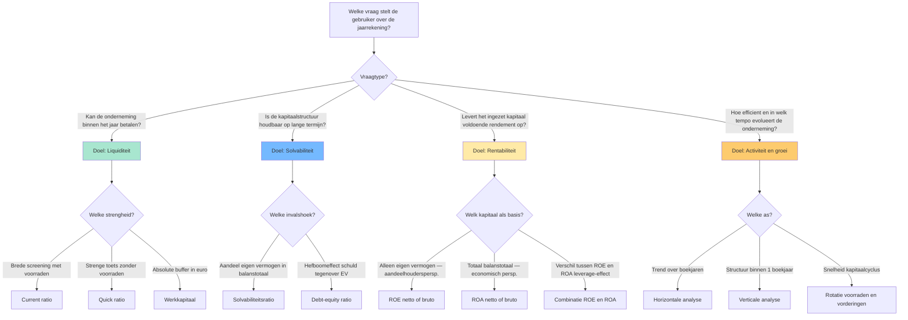
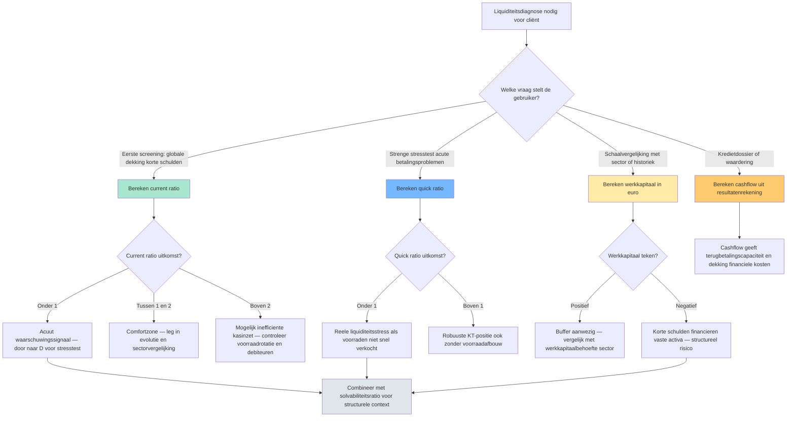

## Wat verwacht het examen van jou?

> [!abstract] Dit programmaonderdeel wordt getoetst op niveau *integratie*.
> Je moet meerdere concepten samen kunnen inzetten in complexe casussen — onderdelen herkennen, prioriteren, en tot een coherent oordeel komen.

**Taken** (uit het ITAA-examenprogramma):

> [!abstract]- **Taak 1** — Analyse en beoordeling van de financiële situatie van een vennootschap of vereniging aan de hand van de jaarrekeningen, ratio's en kengetallen
>
> **Doelstellingen**:
> - In staat zijn om, na informatie te hebben verzameld, geselecteerd, geanalyseerd en samengevat, de jaarrekeningen van een vennootschap of een vereniging kritisch te bekijken.
> - Na de analyse ook voorstellen kunnen doen om de situatie van de onderneming/vereniging te verbeteren, waakzamer te zijn of te controleren.

## Leesgids

De minicursus loopt van fundament naar oordeel: eerst [[doelstellingen-financiele-analyse|waarom]] en voor wie je een [[jaarrekening-als-studieobject|jaarrekening]] leest, dan hoe je ze klaarzet via een [[analytische-balans|analytische balans]], en pas dan de vier ratio-families. Twee synthese-secties verbinden losse ratio's met een keuze-logica die je in een casus echt gebruikt. Tijds-, sector- en toezichts-as ([[historische-evolutie-financiele-analyse|trend]], [[sectorvergelijking-financiele-analyse|benchmark]], [[commissaris-toezicht-jaarrekening|commissaris]]) komen op het einde samen tot een geïntegreerde diagnose.

## Waarom dit programmaonderdeel telt

Het [[getrouw-beeld-jaarrekening|getrouw beeld]] is geen boekhoudkundig eindpunt maar het vertrekpunt van elk economisch oordeel. Klant, bank, vennoten en overheid lezen dezelfde cijfers met een eigen bril ([[gebruikers-jaarrekening]]); jij vertaalt hun vragen naar de juiste ratio's en plaatst de uitkomsten tegen sector en historiek. Liquiditeit zegt iets anders dan solvabiliteit, en rentabiliteit alléén misleidt zodra het hefboomeffect onbesproken blijft — formules kennen is een minimum, het combineren de kern. Via [[cijferanalyses-controle-norm|cijferanalyses]] krijg je tegelijk een controle-instrument: onverwachte afwijkingen zijn risico- of fout-signalen.

## Waarom analyseer je een jaarrekening? Doelstellingen, gebruikers en getrouw beeld

Begin niet bij de balans maar bij de vraag: wie wil wat weten? De vier [[doelstellingen-financiele-analyse|analyse-doelen]] krijgen pas relevantie vanuit het perspectief van een concrete [[gebruikers-jaarrekening|gebruiker]]. De cijfers zelf zijn gebonden aan het [[getrouw-beeld-jaarrekening|getrouw beeld]] en aan [[materieel-belang-jaarrekening|materieel belang]] — een afwijking is pas analyse-waardig als ze het oordeel zou kunnen kantelen.

## De jaarrekening als studieobject: structuur en aangrijpingspunten

> [!info] Hoort bij taak: Analyse en beoordeling van de financiële situatie van een vennootschap of vereniging aan de hand van de jaarrekeningen,…

Deze concepten zetten samen het werkterrein neer waarop alle latere ratio- en evolutie-analyses staan. De [[jaarrekening-als-studieobject|jaarrekening]] is het onderzochte object; [[getrouw-beeld-jaarrekening|getrouw beeld]] en [[materieel-belang-jaarrekening|materialiteit]] bepalen wanneer een afwijking telt, en de [[doelstellingen-financiele-analyse|doelstellingen]] van de analyse moeten gekoppeld worden aan de juiste [[gebruikers-jaarrekening|gebruiker]] voor je een formule opent.

- [[jaarrekening-als-studieobject|Jaarrekening als studieobject van financiële analyse]] · `begrip`
- [[getrouw-beeld-jaarrekening|Getrouw beeld van de jaarrekening]] · `regel`
- [[materieel-belang-jaarrekening|Materieel belang (materiality)]] · `regel`
- [[doelstellingen-financiele-analyse|Doelstellingen van financiële analyse]] · `begrip`
- [[gebruikers-jaarrekening|Gebruikers van de jaarrekening]] · `begrip`

## De vier analyse-doelen en hun ratio's — overzicht

Synthese-overzicht dat de vier klassieke doelen van financiële analyse (liquiditeit, solvabiliteit, rentabiliteit, werkkapitaal/cashflow) koppelt aan hun ratio's, zodat de stagiair in één oogopslag ziet welke ratio bij welk doel hoort en hoe ze elkaar aanvullen.

De scharnier hier is dat een gebruikersvraag het analyse-doel kiest, en pas dán het ratio. Wie [[liquiditeitsratio|liquiditeit]] en [[solvabiliteitsratio|solvabiliteit]] tegen elkaar uitspeelt, of [[rentabiliteit-eigen-vermogen-roe|ROE]] zonder [[rentabiliteit-totaal-activa-roa|ROA]] interpreteert, mist de helft van het beeld — beide assen lees je in een complexe casus altijd samen.

| Analyse-doel | Kernvraag | Belangrijkste ratio's | Bron-component balans/RR | Typische gebruiker |
|---|---|---|---|---|
| **Liquiditeit** (KT betaalkracht) | Kan de onderneming haar schulden ≤ 1 jaar betalen met haar vlottende activa? | [[current-ratio\|Current ratio]] · [[quick-ratio\|Quick ratio]] · [[werkkapitaal\|Werkkapitaal]] | Vlottende activa (voorraden + vorderingen ≤ 1 jaar + geldbeleggingen + liquide middelen); Schulden ≤ 1 jaar | Kredietverlener KT · leverancier · cashmanager |
| **Solvabiliteit** (LT schokbestendigheid) | Hoe groot is het eigen vermogen tegenover totaal vermogen en schulden? | [[solvabiliteitsratio\|Solvabiliteitsratio (EV / balanstotaal)]] · [[debt-equity-ratio\|Debt-equity (VV / EV)]] | Eigen vermogen totaal; Balanstotaal; Schulden totaal | Bank LT · obligatiehouder · aandeelhouder structureel risico |
| **Rentabiliteit** (winstgevendheid kapitaal) | Levert de zaak voldoende rendement op tegenover wat erin geïnvesteerd is? | [[rentabiliteit-eigen-vermogen-roe\|ROE (winst / EV)]] · [[rentabiliteit-totaal-activa-roa\|ROA (winst + kosten schulden / totaal activa)]] · Brutovarianten op [[cashflow-analyse\|cashflow]] | Winst van het boekjaar; Eigen vermogen; Balanstotaal; Kosten van schulden; Niet-kaskosten | Aandeelhouder · investeerder · interne controller |
| **Activiteit/groei** (operationele efficiëntie + dynamiek) | Hoe snel rouleren voorraden en handelsvorderingen? Groeit de omzet? | Rotatie voorraden · rotatie handelsvorderingen · [[horizontale-analyse-jaarrekening\|Horizontale analyse]] op omzet en EBITDA | Omzet meerdere boekjaren; Voorraden gemiddeld; Vorderingen gemiddeld | Operationele manager · auditor · sector-analyst |

**Kerninzichten**:

- De keuze van een ratio begint NOOIT bij de balans — ze begint bij de vraag van de gebruiker. Een kredietverlener op korte termijn kijkt eerst naar de quick ratio; een obligatiehouder eerst naar de solvabiliteit; een aandeelhouder eerst naar ROE. Wie eerst formules verzamelt en dan een verhaal zoekt, mist de analyse-discipline.
- ROE en ROA SAMEN lezen ontmaskert het leverage-effect. Bij Rotex Roeselare NV is netto-ROE 20,8 % terwijl netto-ROA 13,0 % is — het gat van 7,8 procentpunten zegt dat schulden de aandeelhouderswinst versterken. Als ROE lager wordt dan ROA, werkt de hefboom omgekeerd: de kost van schulden is dan groter dan het rendement op activa.
- Liquiditeit en solvabiliteit zijn complementair, geen synoniemen. Een vennootschap kan liquide zijn (vlottende activa > korte schulden) maar tegelijkertijd structureel zwak gefinancierd (laag eigen vermogen). Omgekeerd kan een solvabele onderneming tijdelijk illiquide zijn (cashtekort terwijl ze rijk is aan vaste activa). Examenvraag-camouflage: alleen op één van de twee letten = halve diagnose.
- Een hoge ratio is niet automatisch goed. Een current ratio > 3 kan signaleren dat middelen vastliggen in onproductieve voorraden of trage vorderingen; een solvabiliteit > 70 % kan betekenen dat de onderneming te weinig hefboom benut. Interpretatie vereist altijd sectorvergelijking en historiek — de drie analyse-assen samen.
- Brutovarianten met cashflow (bruto-ROE, bruto-ROA) filteren niet-kaskosten weg en zijn moeilijker boekhoudkundig te manipuleren dan nettovarianten. Voor kredietdossiers en waarderingsvragen geven brutoratio's vaak een eerlijker beeld dan nettoratio's. Voor aandeelhoudersrendementsanalyse blijft netto-ROE de standaard.

_Bouwt op_: [[doelstellingen-financiele-analyse]] · [[liquiditeitsratio]] · [[current-ratio]] · [[quick-ratio]] · [[werkkapitaal]] · [[solvabiliteitsratio]] · [[debt-equity-ratio]] · [[rentabiliteit-eigen-vermogen-roe]] · [[rentabiliteit-totaal-activa-roa]] · [[cashflow-analyse]] · [[horizontale-analyse-jaarrekening]] · [[verticale-analyse-jaarrekening]]
## Voorbereiden van een financiële analyse van de jaarrekening

> [!info] Hoort bij taak: Analyse en beoordeling van de financiële situatie van een vennootschap of vereniging aan de hand van de jaarrekeningen,…

Je leert de opdracht scopen vóór één cijfer wordt aangeraakt: doel en [[gebruikers-jaarrekening|gebruiker]] definiëren, boekjaren ophalen, bijzondere posten flaggen via een [[intake-financiele-analyse|intake]]. Die voorbereiding bepaalt of je tot een coherent oordeel komt of in losse ratio's blijft hangen.

[[competenties/voorbereiden-financiele-analyse|→ Volledige procedure]]

## Opstellen van een analytische balans voor een vennootschap

> [!info] Hoort bij taak: Analyse en beoordeling van de financiële situatie van een vennootschap of vereniging aan de hand van de jaarrekeningen,…

Je herwerkt het wettelijke balansschema tot een [[analytische-balans|analytische balans]] die de bouwstenen voor elke ratio levert: herklassificeren naar liquiditeit en opeisbaarheid, [[niet-in-balans-opgenomen-rechten-verplichtingen|off-balance]] integreren waar materieel, normaliseren waar éénmalige posten het beeld vertekenen. Zonder deze herstructurering staan je ratio's op verkeerde nominale.

[[competenties/opstellen-analytische-balans|→ Volledige procedure]]

## Berekenen en interpreteren van de liquiditeitsratio's

> [!info] Hoort bij taak: Analyse en beoordeling van de financiële situatie van een vennootschap of vereniging aan de hand van de jaarrekeningen,…

Je werkt een casus uit waarbij je [[current-ratio]] en [[quick-ratio]] samen leest, met [[werkkapitaal]] als absolute tegenhanger. De interpretatie staat of valt met benchmarking tegen sector en historiek ([[sectorvergelijking-financiele-analyse]]) — voor voorraad-intensieve activiteiten is de spreiding tussen current en quick het diagnostisch interessantste gegeven.

[[competenties/berekenen-interpreteren-liquiditeitsratios|→ Volledige procedure]]

## Verfijningen van de liquiditeitsanalyse: cash ratio en werkkapitaalbehoefte

> [!info] Hoort bij taak: Analyse en beoordeling van de financiële situatie van een vennootschap of vereniging aan de hand van de jaarrekeningen,…

Wanneer current en quick onvoldoende uitsluitsel geven, schakel je naar twee verfijningen die dieper in de cyclus kijken. De [[cash-ratio]] is de strengste toets en is relevant bij acute stress; de [[werkkapitaalbehoefte]] confronteert het beschikbare [[werkkapitaal]] met wat de operationele cyclus daadwerkelijk vraagt — een onderneming kan formeel werkkapitaal hebben en toch structureel cash tekort komen.

- [[cash-ratio|Cash ratio (liquiditeit in strenge zin)]] · `cluster`
- [[werkkapitaalbehoefte|Werkkapitaalbehoefte (besoin en fonds de roulement, BFR)]] · `begrip`
- [[werkkapitaal|Werkkapitaal (working capital)]] · `begrip`

## Berekenen en interpreteren van de solvabiliteitsratio's

> [!info] Hoort bij taak: Analyse en beoordeling van de financiële situatie van een vennootschap of vereniging aan de hand van de jaarrekeningen,…

Je zet [[solvabiliteitsratio]] en [[debt-equity-ratio]] naast elkaar in om de structurele veerkracht te beoordelen, met de uitkomst altijd tegen de sectormediaan. Onderzoek bij kredietdossiers ook of er [[ratio-covenants|ratio-covenants]] meelopen — een contractuele drempel kan een "event of default" triggeren lang vóór de wettelijke alarmbel.

[[competenties/berekenen-interpreteren-solvabiliteitsratios|→ Volledige procedure]]

## Berekenen en interpreteren van de rentabiliteitsratio's

> [!info] Hoort bij taak: Analyse en beoordeling van de financiële situatie van een vennootschap of vereniging aan de hand van de jaarrekeningen,…

Bouw je oordeel op door [[rentabiliteit-eigen-vermogen-roe|ROE]] en [[rentabiliteit-totaal-activa-roa|ROA]] systematisch samen te lezen — het gat tussen beide leest het hefboomeffect af. Met de bruto-varianten op [[cashflow-analyse|cashflow]] filter je niet-kaskosten weg, wat in waarderings- en kredietdossiers vaak een eerlijker beeld geeft.

[[competenties/berekenen-interpreteren-rentabiliteitsratios|→ Volledige procedure]]

## Welke liquiditeitstoets gebruik ik? — Beslisboom

Hulpstructuur voor de stagiair: welke liquiditeitsmaat is in welke context de juiste — current ratio voor algemene liquiditeit, quick ratio voor verfijnde toets bij voorraadintensieve sectoren, werkkapitaal als absolute aanvulling, cash ratio in stress-scenario's. De beslisboom maakt zichtbaar waarom één ratio nooit volstaat.

Bij liquiditeitsdiagnose vraagt het examen typisch om de juiste toets bij de juiste context te kiezen — niet om elke ratio te berekenen. De scharnier hier is dus de keuze-logica: brede screening, strenge stresstest, absolute buffer of kasgeneratie. Een coherent oordeel combineert minstens twee perspectieven.

| Toets | Wat meet ze? | Formule | Sterkte | Zwakte / valkuil |
|---|---|---|---|---|
| [[current-ratio\|Current ratio]] | Brede liquiditeit in ruime zin (verhouding) | vlottende activa / schulden ≤ 1 jaar | Snelle screening; vergelijkbaar tussen bedrijven van verschillende grootte | Hoge ratio kan opgeblazen voorraden of trage debiteuren verbergen |
| [[quick-ratio\|Quick ratio]] (zuurtegraad) | Liquiditeit in enge zin — zonder voorraden | (vlottende activa − voorraden) / schulden ≤ 1 jaar | Strenger; relevant bij voorraad-intensieve sectoren | Vorderingen worden als snel-cashbaar verondersteld; bij dubieuze debiteuren overschat ze |
| [[werkkapitaal\|Werkkapitaal]] | Absolute liquiditeitsbuffer in euro | vlottende activa − schulden ≤ 1 jaar | Toont schaal die ratio's verbergen | Twee bedrijven met zelfde werkkapitaal kunnen totaal verschillende risicoprofielen hebben (sectorgevoelig) |
| [[cashflow-analyse\|Cashflow]] (winst + niet-kaskosten) | Kasgeneratie uit eigen werking | resultaat + afschrijvingen + waardeverminderingen + voorzieningen | Filtert boekhoudkundige niet-kaselementen weg | Eenmalige voorzieningen kunnen cashflow van één boekjaar fors verhogen |

**Kerninzichten**:

- Current ratio en quick ratio zijn geen alternatieven — ze zijn complementair. Bij Rotex Roeselare NV: current 2,0 en quick 1,375. Het verschil tussen beide (0,625) is volledig toe te schrijven aan de voorraden (€ 2.500.000 op € 4.000.000 korte schulden). Het verschil zelf is dus een ratio-component: de mate waarin de liquiditeit op voorraden steunt.
- Werkkapitaal als absoluut bedrag corrigeert een verborgen valkuil van ratio's: schaal. Meubelzaak Mertens BV en Rotex Roeselare NV kunnen beide current ratio rond 1,3 hebben, maar werkkapitaal € 200.000 versus € 4.000.000. Voor financierings-capaciteit en investeringsruimte is de absolute buffer relevanter dan de verhouding.
- Een acute liquiditeitsstress (current ratio onder 1) zegt nog niets over levensvatbaarheid. Combineer altijd met de solvabiliteitsratio (structurele basis) en de cashflow (kasgeneratie). Een tijdelijk illiquide maar solvabel bedrijf kan financiering brugkalmen via een banklijn; een liquide maar onsolvabel bedrijf staat op een tijdbom.
- Cash ratio (geldbeleggingen + liquide middelen / korte schulden) is de strengste van de liquiditeitsfamilie maar krijgt in de standaard 1.3-records geen apart record. Voor voorraadintensieve sectoren of acute stress-scenario's is dat de meest waardevolle van de drie — zie open gap voor uitwerking.

_Bouwt op_: [[liquiditeitsratio]] · [[current-ratio]] · [[quick-ratio]] · [[werkkapitaal]] · [[cashflow-analyse]] · [[solvabiliteitsratio]]
## Uitvoeren van een horizontale en verticale analyse van de jaarrekening

> [!info] Hoort bij taak: Analyse en beoordeling van de financiële situatie van een vennootschap of vereniging aan de hand van de jaarrekeningen,…

Je zet beide assen samen in: [[horizontale-analyse-jaarrekening|horizontaal]] toont de trend over boekjaren, [[verticale-analyse-jaarrekening|verticaal]] de samenstelling binnen één boekjaar. De afwijkingen tussen die twee perspectieven — bijvoorbeeld dalende omzet bij stijgend voorraadaandeel — wijzen vaak naar dieperliggende problemen.

[[competenties/uitvoeren-horizontale-verticale-analyse|→ Volledige procedure]]

## Beoordelen van het werkkapitaal en de kasstroom van een onderneming

> [!info] Hoort bij taak: Analyse en beoordeling van de financiële situatie van een vennootschap of vereniging aan de hand van de jaarrekeningen,…

Je bouwt een oordeel op uit [[werkkapitaal]] (balans-kant) en [[cashflow-analyse|cashflow]] (resultaten-kant) samen — de eerste toont de structurele buffer, de tweede de jaarlijkse kasgeneratie. Pas wanneer beide consistent zijn, kun je iets zinnigs zeggen over terugbetalingscapaciteit en investeringsruimte.

[[competenties/beoordelen-werkkapitaal-en-kasstroom|→ Volledige procedure]]

## Confronteren van de financiële analyse met de toelichting en off-balance posten

> [!info] Hoort bij taak: Analyse en beoordeling van de financiële situatie van een vennootschap of vereniging aan de hand van de jaarrekeningen,…

Een analyse die stopt bij de balanscijfers mist de [[niet-in-balans-opgenomen-rechten-verplichtingen|verplichtingen buiten balans]] — borgstellingen, leasing-engagementen, geschillen — die nochtans materieel kunnen wegen. Je leert die elementen uit de toelichting en [[klasse-0-niet-in-balans|klasse 0]] systematisch confronteren met de ratio's: een gezonde solvabiliteit kan illusoir blijken zodra je significante off-balance-engagementen meetelt.

[[competenties/confronteren-toelichting-en-off-balance|→ Volledige procedure]]

## Beoordelen van het bestuursverslag en de niet-financiële informatie

> [!info] Hoort bij taak: Analyse en beoordeling van de financiële situatie van een vennootschap of vereniging aan de hand van de jaarrekeningen,…

Het [[bestuursverslag]] is een verbaal overzicht van ontwikkeling, resultaten en positie dat evenwichtig moet zijn ten opzichte van de cijfers. Lees de [[risicoparagraaf-bestuursverslag|risicoparagraaf]] en, waar van toepassing, de [[corporate-governance-verklaring]] kritisch: signaleren ze dezelfde risico's als wat uit jouw cijferanalyse blijkt? Discordantie tussen verbale en cijfermatige boodschap is op zichzelf een diagnostisch signaal.

[[competenties/beoordelen-bestuursverslag-en-niet-financiele-info|→ Volledige procedure]]

## Vergelijken in tijd en sector: trend, benchmark en controle-norm

> [!info] Hoort bij taak: Analyse en beoordeling van de financiële situatie van een vennootschap of vereniging aan de hand van de jaarrekeningen,…

Een ratio krijgt pas betekenis tegenover een referentiekader: de [[historische-evolutie-financiele-analyse|tijdsas]] toont de richting binnen één onderneming, de [[sectorvergelijking-financiele-analyse|sector-as]] de positie tussen ondernemingen. De norm [[cijferanalyses-controle-norm|cijferanalyses (KMO)]] voegt in controle-opdrachten een derde dimensie toe: afwijkingen als risico-signaal en als afsluitende redelijkheidstest.

- [[historische-evolutie-financiele-analyse|Historische evolutie in financiële analyse]] · `cluster`
- [[sectorvergelijking-financiele-analyse|Sectorvergelijking (benchmarking)]] · `cluster`
- [[cijferanalyses-controle-norm|Cijferanalyses (controlenorm KMO)]] · `regel`

## Formuleren van een financiële diagnose en concrete verbeteradviezen

> [!info] Hoort bij taak: Analyse en beoordeling van de financiële situatie van een vennootschap of vereniging aan de hand van de jaarrekeningen,…

Hier komen alle voorgaande deelanalyses samen in één coherent oordeel met concrete verbeteradviezen. Bij opgestapelde signalen weeg je continuïteit en de mogelijke signalering naar de [[kamer-ondernemingen-in-moeilijkheden|kamer voor ondernemingen in moeilijkheden]] of het uitlokken van [[ratio-covenants|ratio-covenants]].

[[competenties/formuleren-financiele-diagnose-en-adviezen|→ Volledige procedure]]

## Positioneren van de toezichtsorganen rond de jaarrekening

> [!info] Hoort bij taak: Analyse en beoordeling van de financiële situatie van een vennootschap of vereniging aan de hand van de jaarrekeningen,…

Je moet weten welk orgaan welke vraag stelt: de [[algemene-vergadering-toezichtsfunctie|algemene vergadering]] beslist over goedkeuring en kwijting, de [[commissaris-toezicht-jaarrekening|commissaris]] geeft de externe verklaring, de [[ondernemingsraad-sociaal-economische-info|ondernemingsraad]] krijgt sociaal-economische informatie, en de [[kamer-ondernemingen-in-moeilijkheden|kamer voor ondernemingen in moeilijkheden]] schakelt in bij knipperlichten. Samen vormen ze het governance-landschap rond de jaarrekening.

[[competenties/positioneren-toezichtsorganen-rond-jaarrekening|→ Volledige procedure]]

## Kritische blik: wat zegt een financiële analyse NIET?

Een financiële analyse is een retrospectieve lezing op cijfers binnen het [[materieel-belang-jaarrekening|materialiteitskader]] — ze meet niet wat buiten dat raster valt. Niet-gekwantificeerde [[niet-in-balans-opgenomen-rechten-verplichtingen|verplichtingen]], strategische positie, kwaliteit van het management of toekomstige marktshocks lees je niet rechtstreeks van een ratio af. Confronteer daarom altijd met [[bestuursverslag]] en sector- en evolutie-context vóór je een coherent oordeel velt.

## Synthese-stappenplan

In een examencasus pak je een financiële analyse zo aan. Scope eerst de opdracht via een [[intake-financiele-analyse|intake]]: gebruiker, [[doelstellingen-financiele-analyse|doelstelling]], boekjaren, bijzondere posten. Herwerk de jaarrekening tot een [[analytische-balans|analytische balans]] met [[niet-in-balans-opgenomen-rechten-verplichtingen|off-balance]] geïntegreerd. Reken dan per doel de ratio's — [[liquiditeitsratio|liquiditeit]], [[solvabiliteitsratio|solvabiliteit]], rentabiliteit ([[rentabiliteit-eigen-vermogen-roe|ROE]] én [[rentabiliteit-totaal-activa-roa|ROA]] samen), [[werkkapitaal]] versus [[cashflow-analyse|cashflow]]. Plaats elke uitkomst tegen [[historische-evolutie-financiele-analyse|tijdsas]] en [[sectorvergelijking-financiele-analyse|sector-benchmark]] — een ratio zonder context is geen oordeel. Confronteer met toelichting en [[bestuursverslag]]; discordantie is op zich een signaal. Synthetiseer tot één coherente diagnose en concrete adviezen ([[formuleren-financiele-diagnose-en-adviezen]]). Toets ten slotte continuïteit en eventuele [[ratio-covenants|ratio-covenants]], en positioneer je bevindingen tegenover de juiste toezichtsorganen.

## Cheatsheet

### Vergelijkingsparen-matrix

| Concept | Verwarrend met | Trigger |
|---|---|---|
| [[bestuursverslag]] | [[jaarverslag]] | Twee namen, één document. Term-keuze hangt af van regelgevings-context (BE/EU). |
| [[cash-ratio]] | [[quick-ratio]] | Examenvraag 'liquiditeit in enge of strengste zin?': enge = quick (zonder voorraden); strengste = cash (zonder voorraden én vorderingen). |
| [[cash-ratio]] | [[current-ratio]] | Examenvraag 'liquiditeit in ruime versus strengste zin?': ruim = current; strengst = cash. |
| [[cashflow-analyse]] | [[rentabiliteit-eigen-vermogen-roe]] | Examenvraag 'cijfer of ratio?': cashflow is een €-bedrag; ROE/ROA op cashflow zijn percentages. |
| [[current-ratio]] | [[quick-ratio]] | Examenvraag 'liquiditeit in ruime / enge zin?': ruim = current; eng = quick. |
| [[debt-equity-ratio]] | [[solvabiliteitsratio]] | Beide drukken financieringsstructuur uit; context bepaalt welke courant is — bankcovenants gebruiken D/E, ratingagentschappen vaker solvabiliteit. |
| [[getrouw-beeld-jaarrekening]] | [[voorzichtigheidsbeginsel]] | Bij een examenvraag 'welk beginsel?' — getrouw beeld als algemeen doel; voorzichtigheid als specifieke voorschrift om risico's volledig op te nemen. |
| [[horizontale-analyse-jaarrekening]] | [[verticale-analyse-jaarrekening]] | Examenvraag 'evolutie of structuur?': over de tijd = horizontaal; samenstelling op één moment = verticaal. |
| [[liquiditeitsratio]] | [[solvabiliteitsratio]] | Examenvraag 'kortetermijnsbetaalkracht versus structurele veerkracht': KT = liquiditeit; lang = solvabiliteit. |
| [[liquiditeitsratio]] | [[cash-ratio]] | Examenvraag 'strengste liquiditeitstoets?' of 'welke ratio sluit voorraden én vorderingen uit?': altijd cash ratio. |
| [[niet-in-balans-opgenomen-rechten-verplichtingen]] | [[voorzieningen]] | Examenvraag 'voorziening of niet in balans?': becijferbaar + waarschijnlijk = voorziening (balans); onzeker of onbecijferbaar = niet in balans (toelichting). |
| [[quick-ratio]] | [[current-ratio]] | Voorraad-intensiteit: in productie/handel altijd allebei berekenen om de spreiding te zien. |
| [[rentabiliteit-eigen-vermogen-roe]] | [[rentabiliteit-totaal-activa-roa]] | Examenvraag 'welke ratio voor welke vraag?': aandeelhoudersrendement = ROE; economische winstgevendheid van de bedrijfsmiddelen = ROA. |
| [[rentabiliteit-totaal-activa-roa]] | [[rentabiliteit-eigen-vermogen-roe]] | Examenvraag 'economisch vs financieel rendement': economisch = ROA; financieel/aandeelhouder = ROE. |
| [[solvabiliteitsratio]] | [[liquiditeitsratio]] | Examenvraag 'structureel vs operationeel risico': structureel = solvabiliteit; KT betalingsrisico = liquiditeit. |
| [[solvabiliteitsratio]] | [[debt-equity-ratio]] | Solvabiliteitsratio bij algemene structuuranalyse; debt-equity-ratio bij specifieke hefboom- of risicobeoordeling (bankcovenants). |
| [[verticale-analyse-jaarrekening]] | [[horizontale-analyse-jaarrekening]] | Examen 'samenstelling of trend?': samenstelling = verticaal; trend = horizontaal. |
| [[werkkapitaal]] | [[current-ratio]] | Examenvraag 'absolute buffer of relatieve dekking?': absoluut = werkkapitaal; relatief = current ratio. |
| [[werkkapitaal]] | [[werkkapitaalbehoefte]] | Examenvraag 'beschikbaar versus benodigd werkkapitaal' of 'wanneer is er liquiditeitstekort?': vergelijk werkkapitaal (beschikbaar uit balans) met werkkapitaalbehoefte (benodigd voor cyclus). |
| [[werkkapitaalbehoefte]] | [[werkkapitaal]] | Examenvraag 'beschikbaar versus benodigd werkkapitaal': beschikbaar = werkkapitaal; benodigd = werkkapitaalbehoefte. |

## Heb je deze taken in de vingers?

Loop deze taken na vóór je verder gaat met examenfocus. Twijfel je bij een taak? Lees de aangegeven secties nog eens.

- ✓ **1.3.taak.1** — Analyse en beoordeling van de financiële situatie van een vennootschap of vereniging aan de hand van de jaarrekeningen,… _Behandeld in §5, §6, §7, §8, §9, §10, §11, §12, §13, §14, §15, §16, §17, §18, §19, §20._

## Examenfocus

Het examen toetst het combineren van ratio's en interpretatie tot een coherent oordeel — niet het opdreunen van formules. Verwacht meerkeuzevragen die je dwingen het juiste cijfer uit balans en resultatenrekening te halen, en open vragen waar je begrippen ([[werkkapitaal]], [[liquiditeitsratio]]) zelf moet definiëren en toepassen. Let op camouflage: ruim versus eng, structureel versus operationeel, absoluut versus relatief.

### Analyse en kritische beoordeling jaarrekening 📃

> [!question]- ITAA 2024-1 vraag 10.A · open (tier A)
> Stellingen ivm financiële onafhankelijkheid

> [!question]- ITAA 2024-1 vraag 10.B · open (tier A)
> Welke ratio kan je niet berekenen op basis van een verkort schema n- dagen klanten krediet

> [!question]- ITAA 2024-1 vraag 10.C · open (tier A)
> In welke volgorde zijn rubrieken op Passief van de Balans gerangschikt? Toenemende eisbaarheid

> [!question]- ITAA 2024-1 vraag 10.D · open (tier A)
> JR kort model NBB voor kapitaal vennootschap wordt EV als volgt berekend:

> [!question]- ITAA 2024-1 vraag 10.E · meerkeuze (tier A)
> Alfa is verlieslatend. Verhoging van de afschrijving op gebouwen door verkorting van de verwachte levensduur heeft het volgende effect op de bruto verkoopmarge:
>
> - Stijging
> - Daling
> - Geen
> - Stijging op voorwaarde dat de verhoogde afschrijving als bedrijfskost is geboekt

### Analyse en kritische beoordeling van de jaarrekening 📃

> [!question]- ITAA 2013-1 vraag 1 (tier B)
> Vraag 1 … / 9 punten In bijlage vindt u de balans na winstverdeling en de resultatenrekening van een cliënt. Bereken de gevraagde ratio’s telkens voor het BOEKJAAR. U dient de formules NIET uit te schrijven, maar WEL de gebruikte cijfers uit de jaarrekening als motivatie van uw antwoord. U dient uw antwoord uit te drukken tot TWEE cijfers na de komma. Uit de toelichting tot de jaarrekening blijkt o.a. dat :
> 
> 1. Er tijdens het boekjaar investeringen in materiële vaste activa werden gedaan voor 451 692,38 euro;
> 
> 2. Er kapitaalsubsidies werden aangerekend op de resultatenrekening voor 56 498,19 euro;
> 
> 3. Er geen andere exploitatiesubsidies werden ontvangen;
> 
> 4. De te bestemmen winst van het boekjaar integraal gereserveerd werd.
> 
> a) Nettobedrijfskapitaal Antwoord
> 
> b) Brutoverkoopmarge (in %) Antwoord
> 
> c) Personeelskosten ten opzichte van de toegevoegde waarde (in %) Antwoord

### Analyse en kritische beoordeling van de jaarrekening 📃

> [!question]- ITAA 2013-1 vraag 2 (tier B)
> Vraag 2 … / 10 punten Omschrijf de volgende begrippen :
> 
> a) Intrinsieke waarde Antwoord
> 
> b) Fractiewaarde Antwoord
> 
> c) Netto rendabiliteit van de bedrijfsactiva Antwoord
> 
> d) Algemene schuldgraad Antwoord
> 
> e) Operationele cash flow voor belastingen Antwoord

### Analyse en kritische beoordeling van de jaarrekening 📃

> [!question]- ITAA 2013-2 vraag 1 (tier B)
> Vraag 1 … / 6 punten In bijlage vindt u de balans na winstverdeling en de resultatenrekening van een cliënt. Bereken de gevraagde ratio’s telkens voor het BOEKJAAR. U dient de formules NIET uit te schrijven, maar WEL de gebruikte cijfers uit de jaarrekening als motivatie van uw antwoord. U dient uw antwoord uit te drukken tot TWEE cijfers na de komma. Uit de toelichting tot de jaarrekening blijkt o.a. dat :
> 
> 1) Er tijdens het boekjaar investeringen in materiële vaste activa werden gedaan voor 361 869,98 euro;
> 
> 2) Er exploitatiesubsidies werden aangerekend op de resultatenrekening voor 415 euro;
> 
> 3) Er geen intrestsubsidies zijn;
> 
> 4) Er werd geen disconto ten laste van de onderneming bij de verhandeling van vorderingen geboekt;
> 
> 5) Er werden geen belastingen geboekt op het resultaat van vorige boekjaren;
> 
> 6) De te bestemmen winst van het boekjaar integraal gereserveerd werd.
> 
> a) Brutoverkoopmarge (%) Antwoord … / 2 punten
> 
> b) Nettorentabiliteit van het totaal der activa, voor belastingen en financiële kosten (%) Antwoord … / 2 punten
> 
> c) Liquiditeit in ruime zin Antwoord … / 2 punten

### Analyse en kritische beoordeling van de jaarrekening 📃

> [!question]- ITAA 2013-2 vraag 2 (tier B)
> Vraag 2 … / 3 punten Bij de bespreking van de jaarrekening deelt U aan uw cliënt mede dat het netto bedrijfskapitaal van zijn vennootschap zeer laag is. Hij vraagt U hoe hij het netto bedrijfskapitaal kan verhogen. Geef drie voorbeelden. Antwoord
>
> > [!success]- Antwoord-motivering
> > Netto bedrijfskapitaal = vlottende activa − kortlopende schulden (zie [[werkkapitaal]]). Verhogen kan via twee assen: vlottende activa verhogen ÉN kortlopende schulden verlagen. Concreet drie maatregelen:
> > 
> > 1. **Lange-termijn financiering aantrekken om kortlopende schulden te herfinancieren** — een nieuwe lange-termijn-lening of kapitaalverhoging stort kasmiddelen (vlottend actief) en kan worden gebruikt om kortlopende schulden af te lossen. Effect: vlottende activa stabiel of stijgend, kortlopende schulden dalend → werkkapitaal stijgt. 🤖
> > 2. **Operationele winst gebruiken om winstreservering toe te wijzen** in plaats van uit te keren als dividend — winstaccumulatie verhoogt het eigen vermogen en typisch ook de vlottende activa (kas, vorderingen) zonder de kortlopende schulden te raken. Werkkapitaal stijgt. 🤖
> > 3. **Niet-essentiële vaste activa verkopen** (bv. overtollig vastgoed, oude machines) → kasmiddelen stijgen (vlottend actief) zonder de kortlopende schulden te raken. Werkkapitaal stijgt. 🤖
> > 
> > Andere mogelijke maatregelen (niet in opsomming): voorraadbeheer optimaliseren (just-in-time → lager voorraadbeslag, maar dat verlaagt werkkapitaal-component voorraden zonder de eindwaarde te raken — neutraal effect), klantenkrediet verkorten (DSO verlagen → kas in plaats van vorderingen, neutraal effect op werkkapitaal-som).
> > 
> > _Grondslag: [[werkkapitaal]] §Bouwstenen — Absolute tegenhanger van current ratio; bedrijfseconomische standaard-doctrine (klassiek Brealey/Myers, ook in Belgische ratio-analyse-handboeken)._
> > 
> > ⚠️ Onderscheid: 'werkkapitaal verhogen' (de balanspost) is iets anders dan 'werkkapitaalbehoefte verlagen' (de operationele cyclus optimaliseren). De vraag spreekt over de eerste. Maatregelen die alleen voorraad of klantenkrediet roteren raken de werkkapitaal-som niet (alleen de samenstelling).

### Analyse en kritische beoordeling van de jaarrekening 📃

> [!question]- ITAA 2013-2 vraag 3 (tier B)
> Vraag 3 … / 6 punten
> 
> a) Wat komt een bedrijfsleider te weten door de liquiditeitsratio’s te berekenen ? Antwoord … / 2 punten
> 
> b) Met welke elementen houdt men geen rekening bij de berekening van de liquiditeit in enge zin en wel bij de berekening van de liquiditeit in ruime zin? Antwoord … / 2 punten
> 
> c) Verklaar uw antwoord aangaande punt b. Antwoord … / 2 punten

### Analyse en kritische beoordeling van de jaarrekening 📃

> [!question]- ITAA 2014-1 vraag 1 (tier B)
> Vraag 1 … / 8 punten In bijlage vindt U de balans na winstverdeling en de resultatenrekening van een cliënt. Kruis het juiste antwoord aan voor de ratio’s van het BOEKJAAR. Uit de toelichting tot de jaarrekening blijkt o.a. dat :
> 
> 1. Er tijdens het boekjaar investeringen in materiële vaste activa werden gedaan voor 361 869,98 EUR;
> 
> 2. Er exploitatiesubsidies werden aangerekend op de resultatenrekening voor 415,00 EUR;
> 
> 3. Er intrestsubsidies werden aangerekend op de resultatenrekening voor een bedrag van 6 000,00 EUR;
> 
> 4. Er geen disconto ten laste van de onderneming bij de verhandeling van vorderingen geboekt werd;
> 
> 5. Er gemiddeld 38,20 werknemers (voltijds equivalent) tewerkgesteld waren;
> 
> 6. De te bestemmen winst van het boekjaar integraal gereserveerd werd.
> 
> a) Bruto toegevoegde waarde per werknemer Antwoord  (7 441 663 – 3 185 295 – 1 192 317) : 38,20 = 80 210,76  (7 441 663 – 415 – 3 185 295 – 1 192 317) : 38,20 = 80 199,90  (7 441 663 – 3 185 295 – 1 192 317 – 1 548 647) : 38,20 = 39 670,26  (7 441 663 – 3 185 295 – 1 192 317 – 436 469 – 879) : 38,20 = 68 761,86
> 
> b) Nettobedrijfskapitaal Antwoord  1 371 010 + 1 739 806 + 2 200 000 + 2 548 415 – 1 210 536 = 6 648 695  120 000 + 1 371 010 + 1 739 806 + 2 200 000 + 2 548 415 – 1 210 536 = 6 768 695  1 371 010 + 1 739 806 +2 200 000 + 2 548 415 + 2 704 – 1 210 536 – 39 932 = 6 611 467  120 000 + 1 371 010 + 1 739 806 + 2 200 000 + 2 548 415 + 2 704 – 1 210 536 – 39 932 = 6 731 467
> 
> c) Nettorentabiliteit van het totaal der activa voor belastingen en financiële kosten Antwoord  ((877 279 + 46 934 + 211 950 – 6 000) : 9 081 054) % = 12,45  ((577 279 + 109 642 + 185 720 – 6 000) : 9 081 054) % = 9,54  ((877 279 + 46 934 + 211 950) : 9 081 054) % = 12,51  ((577 279 + 109 642 + 211 950 – 6 000) : 9 081 054) % = 9,83
> 
> d) Liquiditeit in enge zin Antwoord  (1 371 010 + 1 739 806 + 2 200 000 + 2 548 415 + 2 704) : (1 210 536 + 39 932) = 6,29  (1 739 806 + 2 200 000 + 2 548 415) : 1 210 536 = 5,36  (1 371 010 + 1 739 806 + 2 200 000 + 2 548 415) : 1 210 536 = 6, 49  (1 739 806 + 2 200 000 + 2 548 415 + 2 704) : (1 210 536 + 39 932) = 5,19

### Analyse en kritische beoordeling van de jaarrekening 📃

> [!question]- ITAA 2014-1 vraag 2 (tier B)
> Vraag 2 … / 5 punten
> 
> a) Omschrijf het begrip “nettothesaurie”. Antwoord
> 
> b) Als u de nettothesaurie berekent en de uitkomst is positief, wat betekent dit dan ? Antwoord

### Analyse en kritische beoordeling van de jaarrekening 📃

> [!question]- ITAA 2015-1 vraag 3 (tier B)
> Vraag 3 … / 6 punten
> Welke van de onderstaande elementen neemt U op in de berekening “behoefte aan
> werkkapitaal (of bedrijfskapitaal)”?
> Duid bij elke code “ja of nee” aan. Bij elk foutief antwoord of ontbrekend antwoord, wordt er
> één punt afgetrokken.
> 
> Antwoord … / punten
> 
> |  | Code | Ja | Neen |
> |---|---|---|---|
> | Materiële vaste activa | 22/27 |  |  |
> | Financiële vaste activa | 28 |  |  |
> | Vorderingen op meer dan één jaar | 29 |  |  |
> | Voorraden | 30/36 |  |  |
> | Bestellingen in uitvoering | 37 |  |  |
> | Handelsvorderingen | 40 |  |  |
> | Overige vorderingen | 41 |  |  |
> | Geldbeleggingen | 50/53 |  |  |
> | Liquide middelen | 54/58 |  |  |
> | Overlopende rekeningen van het actief | 490/1 |  |  |
> | Eigen vermogen | 10/15 |  |  |
> | Voorzieningen en uitgestelde belastingen | 16 |  |  |
> | Schulden op meer dan één jaar | 17 |  |  |
> | Schulden op meer dan één jaar die binnen het jaar
> vervallen | 42 |  |  |
> | Financiële schulden | 43 |  |  |
> | Handelsschulden | 44 |  |  |
> | Ontvangen vooruitbetalingen | 46 |  |  |
> | Schulden m.b.t. belastingen, bezoldigingen en sociale
> lasten | 45 |  |  |
> | Overige schulden | 47/48 |  |  |
> | Overlopende rekeningen van het passief | 492/3 |  |  |

### Analyse en kritische beoordeling van de jaarrekening 📃

> [!question]- ITAA 2015-1 vraag 1.A · open (tier B)
> (1 479 283 + 425 554 + 804) x 100 / (8 034 747 + 344 153) = 22,74

> [!question]- ITAA 2015-1 vraag 1.B · open (tier B)
> (1 417 747 + 425 554 + 804) x 100 / (8 365 788 - 1 600 244) = 27,26

> [!question]- ITAA 2015-1 vraag 1.C · open (tier B)
> (1 479 283 + 425 554 + 804 – 1 665) x 100 / (8 034 747 + 344 153 – 1 288) = 22,73

> [!question]- ITAA 2015-1 vraag 1.D · meerkeuze (tier B)
> (968 829 + 425 554 + 804 – 1 665) x 100 / (8 365 788 – 1 288) = 16,66
>
> - Personeelskosten ten opzichte van toegevoegde waarde
> - (1 600 244 – 1 665) X 100 / (8 365 788 - 1 288 – 3 457 309 – 1 398 278) = 45,56
> - 1 600 244 x 100 / (8 365 788 – 3 457 309 – 1 398 278) = 45,59
> - 1 600 244 x 100 / 1 479 283 = 108,18

> [!question]- ITAA 2015-1 vraag 1.D · meerkeuze (tier B)
> (1 600 244 – 1 665) x 100 / (8 034 747 – 13 112 - 3 457 309 – 1 398 278 – 1 288) = 50,51
>
> - Nettorentabiliteit van het eigen vermogen na belastingen
> - 968 829 x 100 / 10 274 463 = 9,43
> - 968 829 x 100 / 8 177 941 = 11,85
> - 1 417 747 x 100 / 10 274 463 = 13,80

> [!question]- ITAA 2015-1 vraag 1.D · meerkeuze (tier B)
> 1 479 283 x 100 / 8 177 941 = 18,09
>
> - Rotatie van de voorraad handelsgoederen, grond- en hulpstoffen
> - 3 444 161 / 530 373 = 6,49
> - 3 457 309 / 530 373 = 6,52
> - 3 457 309 / 1 344 750 = 2,57
> - 3 444 161 / 1 344 750 = 2,56

### Analyse en kritische beoordeling van de jaarrekening 📃

> [!question]- ITAA 2015-1 vraag 2 (tier B)
> Vraag 2 … / 5 punten Omschrijf de volgende begrippen :
> 
> a) Intrinsieke waarde Antwoord … / 1 punt
> 
> b) Fractiewaarde Antwoord … / 1 punt
> 
> c) Netto rendabiliteit van de bedrijfsactiva Antwoord … / 1 punt
> 
> d) Algemene schuldgraad Antwoord … / 1 punt
> 
> e) Operationele cash flow voor belastingen Antwoord … / 1 punt

### Wetgeving inzake de jaarrekening 📃

> [!question]- ITAA 2013-1 vraag 1 (tier B)
> Vraag 1 … / 4 punten
> De besloten vennootschap met beperkte aansprakelijkheid XYZ heeft de volgende balans- en
> resultatenrekening.
> 
> | ACTIEF | JAAR
> 2012 | JAAR
> 2011 | PASSIEF | JAAR
> 2012 | JAAR
> 2011 |
> |---|---|---|---|---|---|
> | Materiële vaste activa | 105.000 | 100.000 | Kapitaal | 65.000 | 65.000 |
> | Vorderingen < jaar | 45.000 | 40.000 | Reserves | 15.000 | 15.000 |
> | Liquide middelen | 25.000 | 30.000 | Overgedragen
> resultaat | 5.000 | 10.000 |
> |  |  |  | Schulden >
> jaar | 50.000 | 50.000 |
> |  |  |  | Schulden <
> jaar | 40.000 | 30.000 |
> | TOTAAL | 175.000 | 170.000 | TOTAAL | 175.000 | 170.000 |
> |  |  |  |  |  |  |
> | RESULTATENREKENING |  |  |  |  |  |
> | Te bestemmen
> winst/verlies |  |  |  | -5.000 | 15.000 |
> |  |  |  |  |  |  |
> 
> Resultaatverwerking Jaar 2011:
> Te bestemmen winst van het boekjaar 15.000
> Overgedragen verlies vorig boekjaar -5.000
> Over te dragen winst 10.000
> Resultaatverwerking Jaar 2012:
> Te bestemmen verlies van het boekjaar -5.000
> Overgedragen winst vorig boekjaar 10.000
> Over te dragen winst 5.000
> a) Dient deze vennootschap haar waarderingsregels te verantwoorden in haar
> jaarverslag, en indien zij geen jaarverslag dient op te stellen in haar jaarrekening in
> het jaar 2012?
> Antwoord
> b) Motiveer uw antwoord.
> Antwoord

## Competentie-index

- [[competenties/beoordelen-bestuursverslag-en-niet-financiele-info|Beoordelen van het bestuursverslag en de niet-financiële informatie]]
- [[competenties/beoordelen-werkkapitaal-en-kasstroom|Beoordelen van het werkkapitaal en de kasstroom van een onderneming]]
- [[competenties/berekenen-interpreteren-liquiditeitsratios|Berekenen en interpreteren van de liquiditeitsratio's]]
- [[competenties/berekenen-interpreteren-rentabiliteitsratios|Berekenen en interpreteren van de rentabiliteitsratio's]]
- [[competenties/berekenen-interpreteren-solvabiliteitsratios|Berekenen en interpreteren van de solvabiliteitsratio's]]
- [[competenties/confronteren-toelichting-en-off-balance|Confronteren van de financiële analyse met de toelichting en off-balance posten]]
- [[competenties/formuleren-financiele-diagnose-en-adviezen|Formuleren van een financiële diagnose en concrete verbeteradviezen]]
- [[competenties/opstellen-analytische-balans|Opstellen van een analytische balans voor een vennootschap]]
- [[competenties/positioneren-toezichtsorganen-rond-jaarrekening|Positioneren van de toezichtsorganen rond de jaarrekening]]
- [[competenties/uitvoeren-horizontale-verticale-analyse|Uitvoeren van een horizontale en verticale analyse van de jaarrekening]]
- [[competenties/voorbereiden-financiele-analyse|Voorbereiden van een financiële analyse van de jaarrekening]]

## Concept-index

- [[algemene-vergadering-toezichtsfunctie|Algemene vergadering — toezichtsfunctie op jaarrekening]] · `autoriteit`
- [[analytische-balans|Analytische balans (herstructureringsschema)]] · `cluster`
- [[beoordelen-bestuursverslag-en-niet-financiele-info|Beoordelen van het bestuursverslag en de niet-financiële informatie]] · `competentie`
- [[beoordelen-werkkapitaal-en-kasstroom|Beoordelen van het werkkapitaal en de kasstroom van een onderneming]] · `competentie`
- [[berekenen-interpreteren-liquiditeitsratios|Berekenen en interpreteren van de liquiditeitsratio's]] · `competentie`
- [[berekenen-interpreteren-rentabiliteitsratios|Berekenen en interpreteren van de rentabiliteitsratio's]] · `competentie`
- [[berekenen-interpreteren-solvabiliteitsratios|Berekenen en interpreteren van de solvabiliteitsratio's]] · `competentie`
- [[bestuursverslag|Bestuursverslag (jaarverslag)]] · `procedure`
- [[cash-ratio|Cash ratio (liquiditeit in strenge zin)]] · `cluster`
- [[cashflow-analyse|Cashflow (bedrijfscashflow)]] · `begrip`
- [[cijferanalyses-controle-norm|Cijferanalyses (controlenorm KMO)]] · `regel`
- [[commissaris-toezicht-jaarrekening|Commissaris (extern toezicht op jaarrekening)]] · `autoriteit`
- [[confronteren-toelichting-en-off-balance|Confronteren van de financiële analyse met de toelichting en off-balance posten]] · `competentie`
- [[corporate-governance-verklaring|Corporate-governance-verklaring]] · `procedure`
- [[current-ratio|Current ratio (liquiditeit in ruime zin)]] · `cluster`
- [[ratio-vier-doelen-vergelijking|De vier analyse-doelen en hun ratio's — overzicht]] · `synthese`
- [[debt-equity-ratio|Debt-equity ratio (schuldgraad)]] · `cluster`
- [[doelstellingen-financiele-analyse|Doelstellingen van financiële analyse]] · `begrip`
- [[formuleren-financiele-diagnose-en-adviezen|Formuleren van een financiële diagnose en concrete verbeteradviezen]] · `competentie`
- [[gebruikers-jaarrekening|Gebruikers van de jaarrekening]] · `begrip`
- [[getrouw-beeld-jaarrekening|Getrouw beeld van de jaarrekening]] · `regel`
- [[historische-evolutie-financiele-analyse|Historische evolutie in financiële analyse]] · `cluster`
- [[horizontale-analyse-jaarrekening|Horizontale analyse (evolutie-analyse)]] · `cluster`
- [[intake-financiele-analyse|Intake (scoping) van financiële analyse]] · `procedure`
- [[jaarrekening-als-studieobject|Jaarrekening als studieobject van financiële analyse]] · `begrip`
- [[kamer-ondernemingen-in-moeilijkheden|Kamer voor ondernemingen in moeilijkheden]] · `autoriteit`
- [[klasse-0-niet-in-balans|Klasse 0 — niet in de balans opgenomen rekeningen]] · `begrip`
- [[liquiditeitsratio|Liquiditeitsratio (begrip)]] · `begrip`
- [[materieel-belang-jaarrekening|Materieel belang (materiality)]] · `regel`
- [[niet-in-balans-opgenomen-rechten-verplichtingen|Niet in de balans opgenomen rechten en verplichtingen]] · `regel`
- [[ondernemingsraad-sociaal-economische-info|Ondernemingsraad — sociaal-economische informatie]] · `autoriteit`
- [[opstellen-analytische-balans|Opstellen van een analytische balans voor een vennootschap]] · `competentie`
- [[positioneren-toezichtsorganen-rond-jaarrekening|Positioneren van de toezichtsorganen rond de jaarrekening]] · `competentie`
- [[quick-ratio|Quick ratio (liquiditeit in enge zin, zuurtegraad)]] · `cluster`
- [[ratio-covenants|Ratiocovenants (financial covenants)]] · `begrip`
- [[rentabiliteit-eigen-vermogen-roe|Rentabiliteit van het eigen vermogen (ROE)]] · `cluster`
- [[rentabiliteit-totaal-activa-roa|Rentabiliteit van het totaal der activa (ROA)]] · `cluster`
- [[risicoparagraaf-bestuursverslag|Risicoparagraaf in het bestuursverslag]] · `regel`
- [[sectorvergelijking-financiele-analyse|Sectorvergelijking (benchmarking)]] · `cluster`
- [[solvabiliteitsratio|Solvabiliteitsratio]] · `cluster`
- [[uitvoeren-horizontale-verticale-analyse|Uitvoeren van een horizontale en verticale analyse van de jaarrekening]] · `competentie`
- [[verticale-analyse-jaarrekening|Verticale analyse (percentageanalyse, common-size)]] · `cluster`
- [[voorbereiden-financiele-analyse|Voorbereiden van een financiële analyse van de jaarrekening]] · `competentie`
- [[liquiditeitstoets-beslisboom|Welke liquiditeitstoets gebruik ik? — Beslisboom]] · `synthese`
- [[werkkapitaal|Werkkapitaal (working capital)]] · `begrip`
- [[werkkapitaalbehoefte|Werkkapitaalbehoefte (besoin en fonds de roulement, BFR)]] · `begrip`

