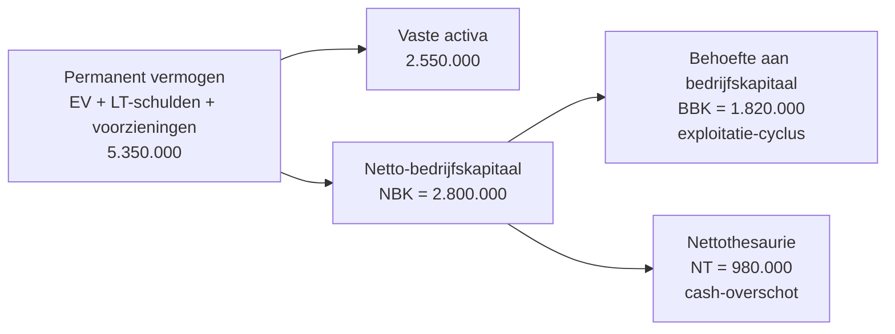

> **Leerstuk — één vraag, helemaal doorgewerkt.** Lees eerst [[wat-is-jaarrekeninganalyse]] — dat zet het kader: wat je wil weten en waarom. Dit is de eerste pure techniek-stap: de ruwe jaarrekening omzetten naar een vorm waar je werkelijk *mee* kunt analyseren. Voor verhaal en routekaart: [[studiemateriaal/1-3|overzicht PO 1.3]].

## Antwoord in één blik

Vóór je één enkele ratio berekent, herwerk je de jaarrekening. Drie bewegingen samen vormen die voorbereiding. **Eerst** ken je de rubrieken en hun volgorde-logica: activa zijn gerangschikt volgens toenemende realiseerbaarheid (van traag naar liquide), passiva volgens toenemende eisbaarheid (van permanent naar onmiddellijk opeisbaar). **Daarna** herrangschik je tot een analytische balans met grotere blokken — sneller leesbaar voor verticale analyse. **Tot slot** bereken je het functionele balans-drieluik: netto-bedrijfskapitaal (NBK), behoefte aan bedrijfskapitaal (BBK) en nettothesaurie (NT).

Het drieluik beantwoordt drie verschillende vragen. NBK = is er een structurele buffer voor de cyclus? BBK = hoeveel cash legt de exploitatiecyclus vast? NT = blijft er na exploitatie nog cash over? Voor onze voorbeeldgroep Belova bedragen die in jaar N: NBK 2.800, BBK 1.820, NT 980 (in duizend EUR). Een comfortabel cash-overschot — maar de driejarige trend laat zien dat NT zakt (1.155 → 1.140 → 980) doordat BBK sneller stijgt dan NBK. Dat verhaal kan een snapshot van 31/12 niet vertellen.

We werken alles uit op één doorlopende voorbeeldgroep — **Belova NV**, een Belgische groothandel in meubilair (NACE 46.470). Grote vennootschap, dus verplicht volledig schema; comfortabele cash-positie maar dalende rentabiliteit en stijgende werkkapitaal-druk in jaar N.

---

## Stap 1 — Rubrieken kennen: twee volgorde-logica's

Het Belgische jaarrekeningschema ordent zijn rubrieken niet alfabetisch en niet willekeurig. Het hanteert twéé duidelijke logica's — één voor de activa, één voor de passiva — die meteen ook de toegangspoort vormen voor liquiditeitsanalyse.

Aan de **actiefzijde** staan de rubrieken in volgorde van **toenemende realiseerbaarheid**. Helemaal bovenaan de vaste activa: gebouwen, machines, deelnemingen — vermogen dat langdurig gebonden is en niet "even" verkocht wordt. Daaronder de voorraden (traag liquide), dan de handels- en overige vorderingen (cyclisch, doorgaans binnen het jaar inbaar), en helemaal onderaan de geldbeleggingen en liquide middelen — direct beschikbaar.

Aan de **passiefzijde** staan de rubrieken in volgorde van **toenemende eisbaarheid**. Bovenaan het eigen vermogen — permanent, juridisch niet opeisbaar door derden. Daaronder de voorzieningen (semi-permanent), de schulden op meer dan één jaar, en helemaal onderaan de schulden op ten hoogste één jaar, met de financiële schulden binnen die laatste rubriek als meest acuut opeisbaar.

Dat lijkt formeel. Het is echter geen toeval: het schema is precies zo gebouwd om liquiditeitstoetsing meteen visueel mogelijk te maken. Met activa boven, passief onder kun je gewoon kijken: hoeveel cash en cyclische posten zitten in het bovenste deel, en hoeveel kortlopende schulden in het onderste deel? Die directe vergelijking — eigenlijk een visuele voorganger van de current ratio — was de oorspronkelijke didactische winst van het schema.

### Balans Belova NV — boekjaren N, N-1, N-2 (in duizend EUR, na winstverdeling)

> **Wat zie je hier?** Belova's volledige balans over drie boekjaren, in het officiële formaat. Activa-rubrieken (links) lopen van vast naar liquide, passiva-rubrieken (rechts) van permanent naar onmiddellijk opeisbaar. De codering tussen haakjes (20-29, 40, 44, ...) verwijst naar de rekening-rubrieken uit het Minimum Algemeen Rekeningenstelsel — handig om bij elke balans-lijn meteen te zien wát erin zit. Studeer dit grondig: alle berekeningen verderop putten uit deze cijfers.

**Activa (duizend EUR)**

|  | N | N-1 | N-2 |
|:---|---:|---:|---:|
| **Vaste activa (20-29)** | **2.550** | **2.480** | **2.390** |
| *Materiële vaste activa (22-27)* | *2.400* | *2.330* | *2.240* |
| *Financiële vaste activa (28)* | *150* | *150* | *150* |
| Voorraden + bestellingen in uitvoering (3) | 2.100 | 1.800 | 1.620 |
| **Vorderingen op ten hoogste 1 jaar (40-41)** | **1.945** | **1.620** | **1.380** |
| *Handelsvorderingen (40)* | *1.850* | *1.540* | *1.310* |
| *Overige vorderingen (41)* | *95* | *80* | *70* |
| Geldbeleggingen (50-53) | 250 | 450 | 600 |
| Liquide middelen (54-58) | 1.480 | 1.580 | 1.380 |
| Overlopende rekeningen (490/1) | 75 | 70 | 80 |
| **Totaal activa** | **8.400** | **8.000** | **7.450** |

**Passiva (duizend EUR)**

|  | N | N-1 | N-2 |
|:---|---:|---:|---:|
| **Eigen vermogen (10-15)** | **2.790** | **2.710** | **2.510** |
| *Inbreng/Kapitaal (10/11)* | *800* | *800* | *800* |
| *Reserves (13)* | *1.350* | *1.290* | *1.170* |
| *Overgedragen winst (14)* | *540* | *510* | *430* |
| *Kapitaalsubsidies (15)* | *100* | *110* | *110* |
| Voorzieningen + uitgestelde belastingen (16) | 110 | 105 | 95 |
| Schulden op meer dan 1 jaar (17) | 2.450 | 2.200 | 2.000 |
| **Schulden op ten hoogste 1 jaar (42-48)** | **2.820** | **2.780** | **2.660** |
| *42 Schulden >1j vervallend binnen 1j* | *400* | *400* | *400* |
| *43 Financiële schulden (kaskredieten)* | *350* | *280* | *200* |
| *44 Handelsschulden (leveranciers)* | *1.520* | *1.540* | *1.490* |
| *45 Schulden fiscaal/sociaal/bezoldigingen* | *380* | *370* | *360* |
| *46 Ontvangen vooruitbetalingen* | *25* | *30* | *35* |
| *47/48 Overige schulden* | *145* | *160* | *175* |
| Overlopende rekeningen passief (492/3) | 230 | 205 | 185 |
| **Totaal passiva** | **8.400** | **8.000** | **7.450** |

> **Klassieke valkuil — een lange-termijnschuld kan binnen het jaar opeisbaar worden.** Een banklening met 7-jaar-looptijd is in principe een schuld op meer dan één jaar (rubriek 17 — passief, hoog in het schema). Maar zodra een tranche binnen 12 maanden vervalt, hoort die tranche bij rubriek 42 — "schulden op meer dan één jaar die binnen het jaar vervallen", deel van de schulden op ten hoogste één jaar. Wie de hele lening op 17 laat staan terwijl er 400 binnen het jaar vervalt, krijgt een te rooskleurig liquiditeitsbeeld: een current ratio die in werkelijkheid zwakker is. Bij Belova is die 400 correct geherclassificeerd onder 42. CBN-advies 2012/16 formuleert deze herclassificatieplicht expliciet.

---

## Schema-bewustzijn — volledig vs verkort

Niet elke jaarrekening die je op je bureau krijgt, is dezelfde. De wet laat kleine vennootschappen toe een **verkort schema** te gebruiken, en microvennootschappen een **microschema**. Welke rubrieken samengevoegd zijn bepaalt mee welke ratio's berekenbaar zijn — geen detail, want het kan een hele ratio-familie onbruikbaar maken.

Zelfs in het verkorte schema blijven de balansposten herkenbaar genoeg om liquiditeit en solvabiliteit te berekenen: vlottende activa, schulden op ten hoogste één jaar, eigen vermogen en vreemd vermogen vind je terug. De grote breuk zit bij de **resultatenrekening** in het verkort schema: rubriek 70 (omzet), rubriek 71 (voorraadwijziging), rubriek 72 (geproduceerde vaste activa) en rubriek 74 (andere bedrijfsopbrengsten) zijn samengevoegd tot één rubriek 9900 — "Brutomarge". Geen aparte omzet meer. En zonder omzet kun je de rotatie van het klantenkrediet niet meer berekenen — DSO (dagen klantenkrediet) heeft "× 365 / omzet" als noemer. Op exact dezelfde manier sneuvelen DPO (geen aparte aankopen) en de commerciële brutomarge (geen aparte rubriek 60).

| Schema | Wie? | Wat ontbreekt vs volledig? | Welke ratio's onmogelijk? |
|---|---|---|---|
| Volledig | Grote vennootschappen (alle drie: balanstotaal · omzet · vte boven drempel) | — | Geen |
| Verkort | Kleine vennootschappen (twee van drie criteria binnen drempel) | Omzet (70) opgegaan in 9900 Brutomarge; rubriek 60 niet apart; reserves niet uitgesplitst | DSO · DPO · commerciële brutomarge |
| Micro | Microvennootschappen (zeer beperkt — drempels strenger) | Nog meer samenvoegingen; geen sociale balans; vereenvoudigde toelichting | Idem verkort + nog meer activiteits-ratio's |

De groottecriteria zelf (balanstotaal, omzet, werknemers) staan in het Wetboek van vennootschappen en verenigingen; de actuele drempelbedragen vind je in het Cijferzakboekje. Voor Belova is de classificatie eenvoudig: 62 vte voltijdsequivalenten + 14,2 mln EUR omzet liggen ruim boven elke drempel — Belova is een grote vennootschap, verplicht volledig schema. Alle ratio's blijven dus binnen bereik.

> **Klassieke valkuil — welke ratio's verdwijnen in het verkort schema?** Rotaties die de aparte omzet of aparte aankopen-rubriek vereisen, sneuvelen. Concreet: DSO (handelsvorderingen × 365 / omzet) heeft geen geïsoleerde omzet meer; DPO (handelsschulden × 365 / aankopen) heeft geen geïsoleerde aankoop-rubriek; commerciële brutomarge ((omzet − rubriek 60) / omzet) verliest beide ingrediënten. Liquiditeit (current, quick, cash) en solvabiliteit (EV-aandeel, schuldgraad) blijven wél berekenbaar — die hebben alleen balansposten nodig die in beide schema's herkenbaar blijven.

---

## Stap 2 — Analytische herrangschikking

Een ruwe jaarrekening is goed voor publicatie, niet altijd ideaal voor analyse. Voor een snelle verticale analyse — "hoe is het balanstotaal verdeeld?" — zijn negen activa-rubrieken er zeven te veel. Een financieel analist groepeert ze daarom in **vier blokken** aan elke kant. Het schema blijft hetzelfde, alleen de lees-laag wordt verdicht.

Aan de actiefzijde onderscheid je: vaste activa (lang gebonden), voorraden (cyclisch, traag liquide), handels- en overige vorderingen + overlopende rekeningen (cyclisch), en thesaurie (geldbeleggingen + liquide middelen). Aan de passiefzijde groepeer je het permanent vermogen — eigen vermogen plus voorzieningen plus schulden op meer dan één jaar — apart van de kortlopende schulden, waarbij je binnen die laatste het exploitatieve deel scheidt van het financiële deel (rubrieken 42 + 43). Die scheiding van financieel versus exploitatief is straks essentieel voor de berekening van BBK.

| Actiefzijde | Bedrag (duizend EUR) | Aandeel |
|---|---:|---:|
| Vaste activa (lang gebonden) | 2.550 | 30,4 % |
| Voorraden (cyclisch, traag liquide) | 2.100 | 25,0 % |
| Handelsvorderingen + overige + overlopende | 2.020 | 24,0 % |
| Geldbeleggingen + liquide middelen (thesaurie) | 1.730 | 20,6 % |
| **TOTAAL ACTIVA** | **8.400** | **100 %** |

| Passiefzijde | Bedrag (duizend EUR) | Aandeel |
|---|---:|---:|
| Eigen vermogen | 2.790 | 33,2 % |
| Voorzieningen (semi-permanent) | 110 | 1,3 % |
| Schulden > 1 jaar | 2.450 | 29,2 % |
| = **Permanent vermogen subtotaal** | **5.350** | **63,7 %** |
| Schulden ≤ 1 jaar exploitatie | 2.300 | 27,4 % |
| Financiële schulden ≤ 1 jaar (42+43) | 750 | 8,9 % |
| **TOTAAL PASSIVA** | **8.400** | **100 %** |

Sleutelinzicht uit Belova: 49,0 % van het balanstotaal zit in cyclische posten (voorraden 25,0 % + cyclische vorderingen 24,0 %), terwijl 63,7 % van het passief permanent gefinancierd is. Het verschil — meer permanente financiering dan vaste activa vereisen — is precies wat de exploitatiecyclus kan draaien zonder kortlopende noodfinanciering. Dat overschot heeft een naam: netto-bedrijfskapitaal. Stap 3 zet er een formule op.

> **Niet één traditie — wel één gedachte.** De Belgische doctrine (Ooghe & Van Wymeersch) hanteert deze functionele indeling met permanent vermogen bovenaan en thesaurie afgezonderd. De internationale Vernimmen-traditie hergroepeert iets anders — "capitaux investis" tegenover "ressources stables" — maar het centrale idee is identiek: abstraheer naar grotere blokken om snel een verhouding te zien. De terminologie verschilt, het denkwerk niet.

---

## Stap 3 — Functionele balans: NBK · BBK · NT uitgewerkt

Het functionele balans-drieluik beantwoordt drie verschillende vragen, elk met een eigen formule en een eigen interpretatie. Pak ze één voor één.

### Netto-bedrijfskapitaal (NBK)

NBK meet of er **structurele buffer** is om de cyclus te financieren. Twee formules geven hetzelfde resultaat — kies wat in jouw geval makkelijker rekent.

$$ \text{NBK} = \text{Permanent vermogen} - \text{Vaste activa} $$

Of equivalent: $\text{NBK} = \text{Vlottende activa} - \text{Schulden} \leq 1\text{ jaar}$.

**Belova-berekening (jaar N, duizend EUR):**

$$ \text{NBK} = (2.790 + 110 + 2.450) - (2.400 + 150) = 5.350 - 2.550 = 2.800 $$

**Controle via vlottende activa:** $(2.100 + 1.945 + 250 + 1.480 + 75) - (2.820 + 230) = 5.850 - 3.050 = 2.800$ ✓

Belova heeft dus 2.800 duizend EUR aan permanente middelen die overblijven nadat alle vaste activa gefinancierd zijn — een buffer van ongeveer 33 % van het balanstotaal. Genoeg om schommelingen in de cyclus op te vangen.

> **NBK is een structureel begrip, geen toevallige meting.** Een snapshot op 31 december is per definitie een momentopname — die kan vertekend zijn door een eenmalige cash-injectie of een net opgenomen banklening. De échte structuur zie je pas in een driejaars-perspectief: stijgt NBK gestaag met de groei van het eigen vermogen mee, of bouwt de buffer net af? De evolutie-tabel onderaan deze sectie maakt dat zichtbaar.

### Behoefte aan bedrijfskapitaal (BBK)

BBK meet hoeveel cash de **exploitatiecyclus** vastlegt. Iedere euro voorraad en iedere euro openstaande klantenvordering moet door iemand voorgefinancierd worden — door leveranciers (handelskrediet) of door de groep zelf. Wat de leveranciers niet financieren, blijft als behoefte staan.

$$ \text{BBK} = \text{Exploitatie-vlottende activa} - \text{Exploitatie-schulden} \leq 1\text{ jaar} $$

Het werkelijke werk zit in de selectie: wat is "exploitatie", wat niet? Drie filters geven uitsluitsel — loop ze in deze volgorde door bij elke rubriek.

1. **Vast versus vlottend.** Vaste activa en lange financiering vallen weg — die horen bij NBK, niet bij BBK.
2. **Exploitatie versus financieel/thesaurie.** Geldbeleggingen, liquide middelen en financiële schulden vallen weg — die meet je later in NT.
3. **Wat overblijft is exploitatief kortlopend** — wel in BBK.

**Belova-berekening (jaar N, duizend EUR):**

$$ \text{BBK} = \underbrace{(2.100 + 1.850 + 95 + 75)}_{\text{vlott. act. excl. thesaurie}} - \underbrace{(1.520 + 380 + 25 + 145 + 230)}_{\text{korte sch. excl. financieel}} $$

$$ \text{BBK} = 4.120 - 2.300 = 1.820 \text{ duizend EUR} $$

De exploitatiecyclus van Belova legt dus 1.820 duizend EUR aan cash vast — voorraden en klantenvorderingen die nog niet betaald zijn, verminderd met wat leveranciers en sociale/fiscale schuldeisers nog tegoed hebben. Die 1.820 *moet* ergens vandaan komen. Bij Belova: uit de buffer die NBK biedt.

> **Klassieke valkuil: ja of nee in BBK per rubriek?** Rubriek 42 ("schulden op meer dan één jaar die binnen het jaar vervallen") lijkt kortlopend en lokt mee — maar het is een **financiële** schuld die kortlopend wordt, niet exploitatief. Antwoord: niet in BBK. Rubriek 43 (kaskredieten + financiële schulden ≤ 1 jaar) idem: financieel, niet exploitatief. Onderstaande tabel geeft de volledige ja/nee-lijst — een rubriek-per-rubriek-keuze die in de praktijk vaak fout loopt.

| Rubriek (code) | In BBK? | Reden |
|---|---|---|
| Voorraden (30/36) | ✅ Ja | Cyclisch exploitatief |
| Bestellingen in uitvoering (37) | ✅ Ja | Cyclisch exploitatief |
| Handelsvorderingen (40) | ✅ Ja | Cyclisch exploitatief |
| Overige vorderingen (41) | ✅ Ja | Meestal cyclisch (BTW-vord., te ontvangen subsidies) |
| Overlopende rekeningen actief (490/1) | ✅ Ja | Pro rata kosten/opbrengsten |
| Geldbeleggingen (50/53) | ❌ Nee | Thesaurie, niet exploitatief |
| Liquide middelen (54/58) | ❌ Nee | Thesaurie |
| Vaste activa (20-29) | ❌ Nee | Permanent |
| Handelsschulden (44) | ✅ Ja | Cyclisch exploitatief |
| Ontvangen vooruitbetalingen (46) | ✅ Ja | Cyclisch exploitatief |
| Fiscale/sociale/loonschulden (45) | ✅ Ja | Cyclisch exploitatief |
| Overige schulden (47/48) | ✅ Ja | Meestal cyclisch (BTW-sch., te betalen subsidies) |
| Overlopende rekeningen passief (492/3) | ✅ Ja | Pro rata kosten/opbrengsten |
| 42 Schulden > 1j vervallend binnen 1j | ❌ Nee | Financieel, niet exploitatief |
| 43 Kaskredieten + financiële schulden | ❌ Nee | Financieel |
| Voorzieningen (16) · EV · LT-schulden | ❌ Nee | Permanent/lang |

### Nettothesaurie (NT)

NT meet het **cash-overschot of -tekort** dat na exploitatie overblijft. Twee formules — opnieuw gelijkwaardig.

$$ \text{NT} = \text{NBK} - \text{BBK} = (\text{Geldbeleggingen} + \text{Liquide middelen}) - \text{Financiële schulden} \leq 1\text{ jaar} $$

**Belova-berekening (jaar N, duizend EUR):**

$$ \text{NT} = 2.800 - 1.820 = 980 $$

**Controle via thesaurie-formule:** $(250 + 1.480) - (400 + 350) = 1.730 - 750 = 980$ ✓

Een positieve NT betekent drie zaken tegelijk: de structurele financiering volstaat voor de exploitatiecyclus, het langetermijn-evenwicht is in orde, en er blijft comfortabele kortlopende liquiditeit over. Belova haalt 980 duizend EUR cash-overschot in jaar N — geen behoefte aan kortetermijn-noodfinanciering.

> **Een positieve NT moet je in drie luiken kunnen omschrijven.** (1) geen behoefte aan kortetermijn-bankfinanciering, (2) langetermijn-evenwicht in orde, (3) comfortabele kortlopende liquiditeit. Dat is het rijtje dat je paraat moet hebben — niet één van de drie, maar de drie samen. Wie alleen "cash-overschot" antwoordt, mist de helft van de boodschap.

> **Hoge NT is niet automatisch goed.** Een structureel hoge NT kan ook duiden op suboptimaal cash-beheer: kapitaal dat ongebruikt op de rekening blijft staan, terwijl het elders rendement had kunnen opleveren. Bij Belova roept de 980 duizend EUR cash-overschot mét tegelijk dalende rentabiliteit (ROE van 18,4 % naar 5,9 % in twee jaar) de vraag op: had dit kapitaal niet beter elders gerendeerd? Een ratio is altijd context, nooit eindoordeel.

---

## Stap 4 — De trend telt: drieluik over 3 jaar

Eén snapshot op 31 december zegt weinig. De échte verhalen zitten in de evolutie — daarom bouw je altijd minstens een driejaars-tabel.

| Component | N (2026) | N-1 (2025) | N-2 (2024) | Trend |
|---|---:|---:|---:|---|
| NBK | 2.800 | 2.535 | 2.335 | ↑ gestaag stijgend |
| BBK | 1.820 | 1.395 | 1.180 | ↑↑ sterk stijgend (signaal) |
| NT (= NBK − BBK) | 980 | 1.140 | 1.155 | ↓ dalend (signaal) |

Drie evoluties tegelijk vertellen één verhaal. NBK stijgt gezond mee met het groeiende eigen vermogen — geen alarm daar. BBK stijgt echter veel sneller: de exploitatiecyclus eet steeds meer cash op, gedreven door langere voorraadrotatie (Belova schakelde over op Aziatische leveranciers met langere lead-times) en stijgende klantenkrediet-termijnen. Het netto-effect: NT zakt, ondanks dat NBK groeit. De cash-positie verschuift letterlijk vanuit de bankrekening naar voorraad en openstaande vorderingen.

De diagnostiek schrijft zichzelf: voor Belova wordt werkkapitaal-management — voorraadbeheer en debiteurenopvolging — een prioritair thema. De positieve NT van vandaag mag niet verbergen dat de richting verkeerd is.

---

## Wat staat in de toelichting? Lezen mag niet vergeten worden

Een ratio is een puntmeting. Wat hem context geeft, staat vaak níet op de balans — wel in de **toelichting**. Waarderingsregels, niet-balans-rechten en -verplichtingen, vervallen schulden, verstrekte waarborgen: stuk voor stuk informatie die het cijferbeeld nuanceert of zelfs omkeert.

Drie voorbeelden uit Belova's toelichting maken het concreet:

- **Waarderingsregels — FIFO + waardevermindering 15.** Voorraden zijn gewaardeerd volgens FIFO; in jaar N is een waardevermindering van 15 duizend EUR geboekt. Relevant voor het lezen van de brutomarge: zonder die afwaardering had de marge er beter uitgezien dan ze structureel is.
- **Hypotheek 2,5 mln op gebouw.** De bank heeft een hypothecaire inschrijving genomen tot 2,5 mln EUR op het bedrijfsgebouw, waarvan 1,64 mln effectief opgenomen. Bij een solvabiliteitsanalyse vertelt dat: hoofd-actief van de groep is bezwaard — een verkoop "voor cash" is in de praktijk geen optie zonder bankaccoord.
- **Persoonlijke borg bestuurders voor 350 duizend EUR kaskrediet.** Twee bestuurders staan persoonlijk borg voor het kaskrediet. Voor de groep is dat een governance-signaal: de bank vraagt extra zekerheid bovenop de zakelijke zekerheden — een teken dat de financier het balanstotaal alléén niet voldoende vond.

Bijzondere aandacht verdient de rubriek "niet in de balans opgenomen rechten en verplichtingen". Operationele leasings, langetermijn-engagementen en garantieverplichtingen verschijnen niet bij de schulden op de balans, maar binden de onderneming wél. Belova heeft 285 duizend EUR resterende leasing-verbintenis (4 bedrijfsvoertuigen + magazijntechniek) — voor solvabiliteitsanalyse functioneel te lezen als een langetermijn-schuld die op de balans ontbreekt.

> **De échte risico's zitten vaak in wat NIET in de balans staat.** Een analist die uitsluitend op balansposten focust, mist de helft van het beeld. Off-balance leases, hangende rechtszaken, vervallen-maar-niet-opgevraagde schulden, verleende borgstellingen — allemaal informatie die het cash-beeld substantieel kan veranderen, en die uitsluitend in de toelichting opduikt. Het programma erkent deze laag expliciet onder de noemer "bijzondere informatie inzake niet in de balans opgenomen rechten en verplichtingen".

---

## Wanneer je dit snapt, ga dan naar

- [[ratios-en-kengetallen]] — De vier ratio-families uitgewerkt: liquiditeit, solvabiliteit, rentabiliteit, activiteit. Met DuPont-decompositie en cross-categorie verbanden.
- [[kasstroom-en-financieringstabel]] — Waarom Belova winstgevend is maar negatieve operationele cashflow heeft. De indirecte methode stap voor stap.
- [[kritische-beoordeling-en-diagnose]] — Hoe vertaal je het geheel naar een oordeel + aanbevelingen aan het bestuur?
- [[studiemateriaal/1-3/samenvatting|Samenvatting PO 1.3]] — Tabel met BBK ja/nee-rubrieken én de NBK/BBK/NT-formules voor herhaling.

## Doorklik naar concepten

Voor wie definitorisch detail wil opzoeken:

- [[jaarrekeninganalyse]] · [[jaarrekening]] · [[activiteits-ratios]]

---

## Wettelijk fundament

- **Balansschema volledig model**: KB-WVV art. 3:80 (verwijst naar bijlage 3) — bevat de officiële volgorde van activa-rubrieken (toenemende realiseerbaarheid) en passiva-rubrieken (toenemende eisbaarheid).
- **Verkort schema voor kleine vennootschappen**: KB-WVV art. 3:83 (verwijst naar bijlage 4). Groottecriteria zelf in WVV art. 1:24; actuele drempelbedragen in het Cijferzakboekje.
- **Microschema voor microvennootschappen**: KB-WVV art. 3:86 (balans volgens schema bijlage 4, verkorte vorm). Groottecriteria voor micro in WVV art. 1:25.
- **Volgorde-logica passief — toenemende eisbaarheid + herclassificatie binnen het jaar vervallend deel van LT-schuld**: CBN-advies 2012/16 (passief in toenemende eisbaarheid; rubriek 42 voor het binnen het jaar vervallend deel van schulden op meer dan één jaar).
- **Onderscheid volledig vs verkort schema**: CBN-advies 2017/08 — concretiseert welke rubrieken in het verkort schema samengevoegd worden (waaronder rubriek 9900 "Brutomarge" voor de exploitatie-opbrengsten).
- **Inhoud toelichting (off-balance, waarborgen, vervallen schulden)**: KB-WVV staten van de toelichting (art. 3:91 e.v.).
- **Functionele balansanalyse — geen wetsbepaling**. NBK · BBK · NT zijn analytische begrippen uit de doctrine (Ooghe & Van Wymeersch, *Handboek financiële analyse*), niet wettelijk gedefinieerd. Wat telt zijn de formules en de interpretatie, niet een artikel-referentie.

---

*Leerstuk PO 1.3 — techniek 1. Status: voorgesteld. Volgende stap voor de student: [[ratios-en-kengetallen]].*
