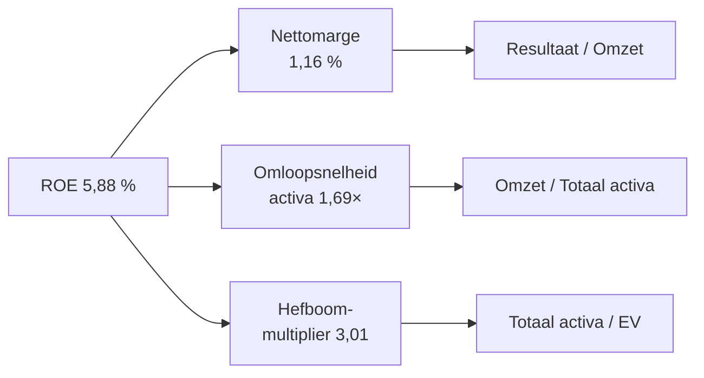

> **Leerstuk — één vraag, helemaal doorgewerkt.** Lees eerst [[jaarrekening-herwerken-en-functionele-balans]] — die geeft de rubrieken-basis en de functionele balans. Dit is het zwaartepunt-leerstuk van het programmaonderdeel: lang, doorgewerkt, met Belova NV als rode draad door alle vier families. Voor verhaal en routekaart: [[studiemateriaal/1-3|overzicht PO 1.3]].

## Antwoord in één blik

Ratio's zijn één samenhangende toolset, geen losse formules. Vier families dekken samen het hele bedrijf af: **liquiditeit** (kan ik morgen betalen?), **solvabiliteit** (kan ik mijn schulden uiteindelijk dragen?), **rentabiliteit** (verdient het kapitaal genoeg?) en **activiteit** (draait de motor efficiënt?). Elke familie levert drie tot vier kernratio's. Bovenop die vier families staan twee verbanden die de cijfers samenbinden — de **DuPont-decompositie** ontleedt het rendement op eigen vermogen in marge × omloop × hefboom, en de **hefboomanalyse** meet hoe gevoelig dat rendement is voor schommelingen in omzet en rente.

Voor Belova zijn drie families comfortabel of stabiel — liquiditeit zit boven sector, solvabiliteit is gezond, activiteit verslechtert maar blijft beheersbaar. **Rentabiliteit** is over de hele lijn rood: bedrijfsresultaat zakt 54 % in twee jaar, alle margekentallen liggen onder sector, het rendement op eigen vermogen halveert. Diezelfde lezing zal je hieronder zien terugkomen — alle vier families samen geven het beeld dat losse cijfers nooit kunnen tonen.

---

## Vooraf — drie regels voor elke ratio

Een ratio op zich is geen oordeel. Hij is een getal dat pas spreekt zodra je hem in context plaatst. Voor je in de vier families duikt: drie regels die altijd gelden, ongeacht welke ratio je berekent.

**Regel 1: noem altijd de formule plus de rubrieken die je gebruikte.** Een ratio zonder vermelding van teller, noemer en de bijbehorende rubrieken uit de jaarrekening is een conclusie zonder bewijs. Schrijf dus niet "current ratio is 1,92" — schrijf "current ratio = vlottende activa (5.850) / kortlopende schulden (3.050) = 1,92". Geen professionele rapportering zonder die motivering.

**Regel 2: lees in drie dimensies.** Een ratio krijgt betekenis in vergelijking. **Trend** (drie tot vijf jaar): bewegen we vooruit, achteruit, of stilstand? **Sector** (NACE-peers, NBB-balanscentrale): hoe staan we tegenover de mediaan in onze branche? **Cross-categorie**: DuPont, cash-conversion-cycle — wat zegt deze ratio in combinatie met de anderen?

**Regel 3: combineer altijd met kwalitatieve context.** Het bestuursverslag, het persbericht, de sector-evolutie, een eenmalige verrichting — die verklaren wat puur cijferwerk niet kan. Een ROE-daling van 18 % naar 6 % is alarmerend; dezelfde daling met de toelichting "eenmalige herstructureringskost voor strategische marktuittreding" leest heel anders.

> **Reflex: formule + getallen + bron.** Een ratio zonder de drie elementen is onvolledig — voor een cliënt-rapport, een bank-dossier of een commissarisverslag. Maak er een vaste gewoonte van: formule, gebruikte rubrieken met bedragen, bron-document. Alleen zo blijft je analyse reproduceerbaar en verdedigbaar.

---

## Familie 1 — Liquiditeit: kan ik morgen betalen?

De fundamentele vraag van liquiditeit is direct: heb je voldoende kortetermijn-middelen om je kortetermijn-verplichtingen te dekken? Vier ratio's beantwoorden die vraag gelaagd, van breed naar streng. Eerst de **current ratio** die alle vlottende activa meeneemt, dan de **quick ratio** die voorraden uitsluit, dan de **cash ratio** die enkel pure liquide middelen telt, tot slot de **cash conversion cycle** die de dynamiek over de tijd meet.

### Current ratio — liquiditeit in ruime zin

De brede liquiditeitstoets: vlottende activa gedeeld door kortlopende schulden. Voor Belova: vlottende activa zijn voorraden (2.100) + vorderingen ≤ 1 jaar (1.945) + geldbeleggingen (250) + liquide middelen (1.480) + overlopende activa (75) = **5.850**. Kortlopende schulden = schulden ≤ 1 jaar (2.820) + overlopende passief (230) = **3.050**. Current ratio = 5.850 / 3.050 = **1,92**.

Vuistregel: een waarde tussen 1,5 en 2,0 wijst op een gezonde positie. Boven 2,5 kan onderbenutting suggereren — kapitaal dat braak ligt in plaats van productief te zijn. Onder 1,0 is alarmerend: kortlopende verplichtingen overstijgen kortlopende middelen, wat een acute liquiditeitskrap betekent.

Belova's 1,92 ligt iets boven het sector-mediaan van 1,75 — comfortabel maar niet excessief. Wel een dalende trend: van 2,17 in N-2 naar 2,00 in N-1 naar 1,92 in N. Die daling is geen alarm op zich, maar in combinatie met andere signalen wel een aandachtspunt.

> **Werkdiscipline: motivering met rubrieken.** Schrijf een ratio altijd op met de bouwstenen: **vlottende activa = som X + Y + Z = bedrag · kortlopende schulden = som A + B + C = bedrag · ratio = …**. Een ratio zonder motivering is voor een cliënt of toezichthouder niet reproduceerbaar.

### Quick ratio — liquiditeit in enge zin (acid test)

Strengere variant: dezelfde teller minus de voorraden, gedeeld door dezelfde noemer. Voor Belova: (5.850 − 2.100) / 3.050 = 3.750 / 3.050 = **1,23**.

De logica is bedrijfseconomisch. Voorraden zijn de minst liquide categorie binnen de vlottende activa — hun omzetting in cash kost weken tot maanden (de DIO van 74 dagen verderop bevestigt dat voor Belova), en bij gedwongen verkoop bedraagt de werkelijke opbrengst vaak slechts 30 tot 50 procent van de boekwaarde. Wie wil weten of je *zonder* je voorraad te verkopen je schulden kunt dekken, kijkt naar de quick ratio.

Belova's 1,23 ligt boven het sector-mediaan van 1,10. Maar de daling is sterker dan bij de current ratio: van 1,53 in N-2 naar 1,38 naar 1,23 — een verschil van 30 procentpunt over twee jaar. Dat de quick ratio sneller daalt dan de current ratio is een signaal: de voorraadstijging draagt onevenredig bij aan de ruime liquiditeit. Zonder voorraden ziet het beeld er minder rooskleurig uit.

> **Ruime versus enge zin — kernverschil paraat.** Enge zin haalt voorraden uit de teller. Strenger getal voor sectoren waarin voorraad traag draait — typisch industrie en groothandel met fysieke goederen. Voor een dienstverlener met minimale voorraad is het verschil tussen beide ratio's verwaarloosbaar.

### Cash ratio — acute liquiditeit

De strengste momentopname: alleen de meest liquide elementen in de teller. Cash ratio = (liquide middelen + geldbeleggingen) / kortlopende schulden. Voor Belova: (1.480 + 250) / 3.050 = 1.730 / 3.050 = **0,57**.

Vorderingen worden hier weggelaten omdat hun werkelijke inning binnen dagen onzeker is. Wat overblijft is wat je *vandaag* uit de kassa kunt halen plus tijdelijke beleggingen die onmiddellijk verkocht kunnen worden. Voor een crisis-scenario — een leverancier eist directe betaling, een bank trekt de kredietlijn in — is dit de relevante test.

Belova's 0,57 ligt ruim boven het sector-mediaan van 0,30. Meer dan de helft van haar kortlopende schulden kan direct contant voldaan worden. Dat is een uitgesproken sterkte van de onderneming — in een sector waar het mediaan-bedrijf slechts 30 procent acute dekking heeft, biedt Belova's cashpositie significante manoeuvreerruimte.

### Cash conversion cycle — dynamische liquiditeit

Tot hier waren de ratio's momentopnames: balansposten op één datum. De cash conversion cycle (CCC) meet iets fundamenteler — hoeveel dagen ligt er tussen je betaling aan de leverancier en de inning bij de klant? CCC = DSO + DIO − DPO. Voor Belova (de drie componenten werken we onder familie 4 uit): 39,3 + 74,4 − 37,4 = **76,3 dagen**.

Interpreteer dit als de duur waarvoor je werkkapitaal vastligt. Hoe lager de CCC, hoe sneller je geld terugkomt en hoe minder financiering je nodig hebt om de exploitatie draaiende te houden. Een CCC van nul betekent dat je je klanten innt vóór je je leveranciers moet betalen — het ideaal van veel retailers met cash-betalende klanten en lange betalingstermijnen aan groothandel.

Belova zit op 76 dagen tegen sector-mediaan 49. Significant boven sector. Dat betekent concreet: voor elke euro omzet ligt er 27 dagen langer werkkapitaal vast dan bij de concurrentie. Bij 14,2 mln omzet komt dat neer op ongeveer 1 miljoen extra werkkapitaal-binding — geld dat ergens gefinancierd moet worden, ofwel met eigen middelen ofwel met krediet.

> **Brug-functie van de CCC.** De CCC zit technisch in de activiteitsfamilie (samengesteld uit drie omloopsnelheden) maar leest functioneel als een liquiditeitssignaal. Het is dé brug tussen familie 1 en familie 4. Bij een stijgende CCC weet je dat liquiditeit en activiteit allebei in dezelfde richting bewegen — vandaar dat banken er nauwgezet naar kijken bij kredietbeoordeling.

---

## Familie 2 — Solvabiliteit: kan ik mijn schulden uiteindelijk dragen?

Waar liquiditeit de korte termijn meet ("morgen"), kijkt solvabiliteit naar de langere horizon. Niet "kan ik komende maand mijn leveranciers betalen" maar "kan ik over vijf jaar nog steeds al mijn schulden terugbetalen, ook de hypothecaire lening die in 2031 vervalt?". Vier ratio's beantwoorden deze vraag vanuit verschillende hoeken: de algemene schuldgraad en haar spiegelbeeld de solvabiliteitsratio, de debt-to-equity-verhouding, en de dynamische interest coverage ratio.

### Schuldgraad en solvabiliteitsratio — twee zijden van dezelfde munt

De schuldgraad meet welk aandeel van het totale vermogen geleend is. Formule: vreemd vermogen / totaal passief. Voor Belova: vreemd vermogen = voorzieningen (110) + schulden > 1 jaar (2.450) + schulden ≤ 1 jaar (2.820) + overlopende passief (230) = **5.610**. Totaal passief = 8.400. Schuldgraad = 5.610 / 8.400 = **66,8 %**.

De solvabiliteitsratio is letterlijk het spiegelbeeld: eigen vermogen / totaal passief = 2.790 / 8.400 = **33,2 %**. Samen geven ze altijd 100 procent — een eenvoudige controle. Welke je rapporteert, is een kwestie van conventie: de NBB-balanscentrale werkt met solvabiliteitsratio, banken vragen vaak om de schuldgraad.

Belova's schuldgraad ligt op 66,8 % tegen sector-mediaan 65,0 %. Net boven sector, dus, maar ruim binnen de NBB-richtwaarde van 70 % die als drempel geldt voor "gezonde KMO-financiering". Bovendien stabiel over drie jaar (66,3 → 66,1 → 66,8). Geen alarmsignaal — wel een gegeven om in het oog te houden.

> **Valkuil: zelffinancieringsgraad ≠ solvabiliteitsratio.** De zelffinancieringsgraad meet enkel wat de onderneming *zélf* opbouwde uit haar resultaten — niet het ingebrachte kapitaal. Formule: (reserves + overgedragen winst) / totaal passief. Voor Belova: (1.350 + 540) / 8.400 = **22,5 %**. Dat is significant lager dan de solvabiliteitsratio van 33,2 % — het verschil van 10,7 procentpunt is precies het ingebrachte kapitaal van 800 plus de kapitaalsubsidies van 100, gedeeld door 8.400. Beide begrippen worden vaak naast elkaar gevraagd; het onderscheid moet scherp zijn.

### Debt-to-equity (D/E)

Functioneel equivalent aan de schuldgraad, maar in een andere vorm uitgedrukt. Formule: vreemd vermogen / eigen vermogen. Voor Belova: 5.610 / 2.790 = **2,01**.

Interpretatie: voor elke euro eigen kapitaal staat er 2,01 euro schuld tegenover. De ratio is de standaard in IFRS en de internationale literatuur — in Belgische context wordt schuldgraad gangbaarder gebruikt, maar D/E komt altijd terug bij vergelijkingen met buitenlandse peers of in due-diligence-dossiers van internationale investeerders.

Het sector-mediaan ligt op 1,86. Belova zit met 2,01 lichtjes boven sector — consistent met het schuldgraad-beeld van eerder.

### Interest coverage ratio (ICR) — de dynamische schuld-bedienings-test

De vorige drie ratio's keken naar de balans: hoe is het kapitaal samengesteld? De interest coverage ratio kijkt naar de resultatenrekening: kan het bedrijfsresultaat de rentelasten dekken? Formule: bedrijfsresultaat (EBIT) / kosten van schulden. Voor Belova: 307 / 92 = **3,34**.

Vuistregel voor de interpretatie:

| ICR | Beoordeling |
|---|---|
| > 5 | Sterk — ruime dekking |
| 3 - 5 | Voldoende — comfortabel maar geen marge |
| < 3 | Zwak — krappe dekking |
| < 1,5 | Alarmerend — rentelasten consumeren bijna heel het bedrijfsresultaat |

Belova zit op 3,34 — net onder het voldoende-segment, maar in *sterke daling*: 9,36 in N-2 naar 6,60 in N-1 naar 3,34 in N. Op twee jaar tijd is de dekking ruwweg gederdedeeld. Dat is geen statistische ruis, dat is een trend.

> **Covenant-impact — de bank kijkt mee.** Banken bouwen ratio-drempels in kredietcontracten als "covenanten" — automatische triggers bij overschrijding. BNP Paribas Fortis heeft in Belova's banklening een covenant ingebouwd dat de ICR minimaal 4× moet bedragen. Belova's 3,34 in N betekent **contractuele schending**. De bank kan dan ofwel vervroegde opeisbaarheid invoeren (worst case), ofwel een waiver geven aan verzwaarde voorwaarden (hogere marge, extra waarborgen, kortere herfinancieringscyclus). Dit is geen theoretisch risico in jaar N — de bank vroeg al om een waiver, op balansdatum nog niet verstrekt. Wie dergelijke covenanten kent vóór je de jaarrekening leest, kan de impact onmiddellijk inschatten.

---

## Familie 3 — Rentabiliteit: verdient het kapitaal genoeg?

Rentabiliteit is de eindscore van het ondernemen. De drie vorige families meten of de structuur in orde is — voldoende cash, dragelijke schulden, efficiënt werkkapitaal — maar rentabiliteit meet of de hele machine genoeg waarde creëert per geïnvesteerde euro. Zes ratio's zijn standaard. Vier marges in de resultatenrekening, gelaagd van breed (bedrijfsresultaat / omzet) naar smal (nettoresultaat / omzet), plus twee kapitaalrendementen op de balans (ROE en ROA).

Vóór je de formules induikt, één centrale terminologische valkuil: het woord **bruto** wordt in twee betekenissen gebruikt. **Bruto van niet-kaskosten** — zoals in EBITDA, waar je bedrijfsresultaat vermeerdert met afschrijvingen om de operationele kasstroom te benaderen. En **bruto in commerciële zin** — omzet minus de kostprijs van verkochte goederen, dus de marge die overblijft na directe inkoop. De Belgische NBB-conventie gebruikt "brutoverkoopmarge" in een derde betekenis nog: **bedrijfsresultaat / omzet**. Welke betekenis bedoeld wordt, hangt af van de context — let altijd op de formule die expliciet wordt gevraagd.

### Marges — vier gelaagde lezingen van dezelfde resultatenrekening

| Marge | Formule | Belova N | Trend N-2 → N-1 → N | Sector |
|---|---|---:|---|---:|
| Brutoverkoopmarge (NBB-conventie) | 9901 / 70 | **2,16 %** | 5,27 → 3,81 → 2,16 | 4,20 % |
| Commerciële brutomarge | (70 − 60) / 70 | **27,46 %** | 30,08 → 28,81 → 27,46 | 30,00 % |
| EBITDA-marge | (9901 + 630 + 631 + 635) / 70 | **4,20 %** | 7,17 → 5,72 → 4,20 | 6,50 % |
| Nettomarge | 9904 / 70 | **1,16 %** | 3,60 → 2,47 → 1,16 | 2,80 % |

Lees deze tabel van boven naar beneden. Elke marge zoomt verder in op het bedrijf. De **brutoverkoopmarge** vertelt wat het bedrijfsresultaat is per euro omzet — 2,16 cent per euro voor Belova. Lager dan het sector-mediaan en in vrije val. De **commerciële brutomarge** zoomt in op het ruwe verschil tussen verkoopprijs en aankoopprijs — 27,46 % betekent dat van elke verkochte euro, 72,54 cent direct teruggaat naar de leverancier. De daling van 30 % naar 27,5 % over drie jaar is **prijsdruk in volle zichtbaarheid** — bevestigd door het bestuursverslag.

De **EBITDA-marge** corrigeert het bedrijfsresultaat voor niet-kaskosten (afschrijvingen, waardeverminderingen, voorzieningen) om dichter bij operationele kasstroom te komen. Voor Belova: EBITDA = 307 + 270 + 15 + 5 = **597**, dus EBITDA-marge = 597 / 14.200 = 4,20 %. Onder sector 6,50 %. De **nettomarge** ten slotte is wat na alle belastingen en financiële lasten overblijft — 1,16 % betekent dat van elke 100 euro omzet er 1,16 euro nettowinst overblijft. Sector haalt 2,80 %.

> **Schema-positie maakt verschil.** Afschrijvingen op gebouwen vallen onder rubriek 630 — niet onder rubriek 60 (handelsgoederen). Voor de **commerciële brutomarge** (omzet − rubriek 60) heeft een afschrijvings-verhoging geen direct effect. Voor de **NBB-brutoverkoopmarge** (bedrijfsresultaat / omzet) wél, omdat 630 binnen het bedrijfsresultaat valt. Een onderneming die verlies maakt verandert hieraan niets — de boekhoudkundige logica is onafhankelijk van het resultaat. Een typische valkuil: contextuele afleiders ("verlieslatend", "snelle groei") veranderen de schema-positie niet.

### ROE en ROA — rendement op kapitaal

Marges meten winst per euro omzet. ROE en ROA meten winst per euro *kapitaal*. Welk kapitaal dan? Bij ROE: het eigen vermogen — wat de aandeelhouders erin staken. Bij ROA: het totale vermogen — wat zowel aandeelhouders als financiers samen ter beschikking stelden.

ROE (return on equity) = nettoresultaat / eigen vermogen. Voor Belova: 164 / 2.790 = **5,88 %**. ROA (return on assets) = bedrijfsresultaat / totaal activa. Voor Belova: 307 / 8.400 = **3,65 %**.

De ROE-interpretatie is bedrijfseconomisch precies. Voor een KMO is een ROE van 8 tot 12 % redelijk: dat dekt de risicovrije rente (vandaag rond 3 %) plus een risicopremie voor het ondernemen. Belova's 5,88 % zit *onder* die ondergrens — economisch betekent dit dat de aandeelhouders met hun kapitaal méér zouden verdienen door het ergens anders te beleggen. ROE-trend: 18,4 → 12,3 → 5,9 over drie jaar. Het rendement is in twee jaar tijd gehalveerd, en dan nog eens gehalveerd.

ROA dezelfde beweging: 9,05 → 6,44 → 3,65. Het hele kapitaal — onafhankelijk van wie het verstrekte — verdient steeds minder.

> **Gemiddeld eigen vermogen versus eind-EV.** Theoretisch is de meest correcte ROE-berekening gebaseerd op het *gemiddeld* eigen vermogen ((begin + einde) / 2) — dat vlakt mutaties tijdens het boekjaar uit (kapitaalverhogingen, dividenduitkeringen). In de praktijk wordt vaak het eind-EV gebruikt voor de eenvoud. Beide zijn acceptabel zolang je je keuze motiveert. Wees consistent: gebruik dezelfde conventie voor alle jaren in een trendanalyse.

> **Nettorendabiliteit bedrijfsactiva — CBN 2011/14-formule.** Andere variant, andere formule. CBN-advies 2011/14 definieert deze als **(nettoresultaat vóór belasting + kosten van schulden) / totaal activa**. Voor Belova in N: (219 + 92) / 8.400 = 3,70 %. Het advies positioneert deze ratio expliciet als economische rentabiliteit "*zonder beïnvloeding door de financieringswijze of het belastingtarief*" — daarom corrigeer je voor financieringslasten (en gebruik je het resultaat vóór belasting). Verwar dit niet met ROA: bij ROA werken we al met EBIT (vóór financieringslasten) als teller, maar zonder belastingcorrectie. Wanneer de naam van een ratio gevraagd wordt, controleer altijd de bijbehorende formule — de naam alleen volstaat niet.

---

## Familie 4 — Activiteit: draait de motor efficiënt?

Activiteitsratios meten snelheid: hoe snel rouleert het werkkapitaal door de exploitatie? Twee bedrijven met identieke omzet en identieke nettomarge kunnen totaal verschillende cash-cycli hebben. Eén werkt met 30 dagen DSO en 60 dagen DPO — netto cash-vóórdeel. De andere werkt met 60 dagen DSO en 30 dagen DPO — netto cash-nadeel. Dezelfde winst, totaal andere financieringsbehoefte. Drie omloopsnelheden vormen de kern: DSO (klanten), DPO (leveranciers), DIO (voorraad). Samen geven ze de cash conversion cycle die je al in familie 1 zag.

### DSO, DPO en DIO — de drie omloopsnelheden

Alle drie omloopsnelheden delen dezelfde logica: een balanspost (een momentopname) wordt herrekend tot een dagenmaat door te delen door een dagomzet uit de resultatenrekening. Verschil zit in welke balanspost en welke resultaatrubriek je vergelijkt.

| Ratio | Wat meet het? | Formule | Belova N |
|---|---|---|---:|
| DSO | Klantenbetalingstermijn | (Handelsvorderingen × 365) / (Omzet × 1,21) | **39,3 d** |
| DPO | Leverancierskrediettermijn | (Handelsschulden × 365) / ((60 + 61) × 1,21) | **37,4 d** |
| DIO | Voorraadrotatie | (Voorraden × 365) / 60 | **74,4 d** |

DSO (days sales outstanding, dagen klantenkrediet) meet hoeveel dagen je gemiddeld moet wachten tussen factuur en inning. Voor Belova: (1.850 × 365) / (14.200 × 1,21) = **39,3 dagen**.

DPO (days payables outstanding, dagen leverancierskrediet) meet hetzelfde aan de andere kant — hoeveel dagen ligt er tussen het ontvangen van de leveranciersfactuur en jouw betaling? Voor Belova: (1.520 × 365) / ((10.300 + 1.950) × 1,21) = **37,4 dagen**.

DIO (days inventory outstanding, dagen voorraadrotatie) meet hoe lang goederen gemiddeld in het magazijn liggen voor ze verkocht raken. Voor Belova: (2.100 × 365) / 10.300 = **74,4 dagen**.

> **Btw-aandachtspunt in de formules.** Handelsvorderingen en handelsschulden bevatten btw (ze zijn de bedragen die de klant moet betalen, respectievelijk die jij aan de leverancier moet betalen, beide btw-inclusief). Omzet en aankopen daarentegen staan in de resultatenrekening *zonder* btw. Om appels met appels te vergelijken vermenigvuldig je de noemer met (1 + btw-tarief) — voor de standaardtarief 21 % betekent dat × 1,21. Sommige analisten laten deze correctie weg voor de eenvoud, maar dan zijn DSO en DPO systematisch overschat met ongeveer 21 %.

De Belova-evolutie over drie jaar is sprekend: DSO stijgt van 31 naar 35 naar 39 (klanten betalen later), DIO stijgt van 66 naar 68 naar 74 (langere voorraadrotatie door de nieuwe Aziatische leverancier met langere lead-times), DPO daalt van 41 naar 39 naar 37 (Belova betaalt sneller dan voorheen). **Drie negatieve evoluties op één keer.** Elk afzonderlijk een aandachtspunt — samen een werkkapitaal-druk die je in de cash conversion cycle van familie 1 al zag terugkomen.

### Werkkapitaalbehoefte — de brug naar de functionele balans

De werkkapitaalbehoefte (BBK in de functionele balans) staat formeel niet op de balans maar is afgeleid. Je berekende hem al in [[jaarrekening-herwerken-en-functionele-balans]]: voor Belova bedraagt de BBK in jaar N **1.820 duizend EUR**.

De link met de activiteitsratios is direct. Stijgende DSO + stijgende DIO + dalende DPO = stijgende BBK. Voor Belova vertaalt dat zich naar: BBK groeit van 1.180 in N-2 naar 1.395 in N-1 naar 1.820 in N — een stijging van 54 % over twee jaar. Diezelfde 54 % stijging zie je niet in de omzet (die groeit slechts 11 %), dus de werkkapitaal-intensiteit per euro omzet stijgt. Dit is precies waar de bank naar kijkt bij covenant-monitoring: stijgende werkkapitaal-behoefte zonder evenredige omzetgroei is een vroeg signaal van structurele kasstroom-problemen.

---

## DuPont-decompositie — wat verklaart de ROE-mutatie?

Tot hier heb je zes rentabiliteitsratios en vier activiteitsratios afzonderlijk berekend. De DuPont-decompositie verbindt ze in één formule. De centrale vraag is operationeel: als de ROE daalt, komt dat door **dalende marges**, **dalende efficiëntie van de activa**, of **dalende hefboom**? Pas wie het antwoord weet, kan de juiste aanbeveling formuleren.

De decompositie:

$$ \text{ROE} = \text{Nettomarge} \times \text{Activa-omloopsnelheid} \times \text{Hefboom-multiplier} $$

Of in formule-vorm: ROE = (Resultaat / Omzet) × (Omzet / Totaal activa) × (Totaal activa / Eigen vermogen). Als je de breuken doorrekent, verkort dat tot Resultaat / Eigen vermogen — de oorspronkelijke ROE. De winst van de decompositie zit in de afzonderlijke factoren.

Voor Belova:

| Component | Formule | N (2026) | N-2 (2024) | Δ |
|---|---|---:|---:|---:|
| Nettomarge | Resultaat / Omzet | 1,16 % | 3,60 % | ↓ 2,44 pp |
| Activa-omloopsnelheid | Omzet / Totaal activa | 1,69× | 1,72× | ≈ stabiel |
| Hefboom-multiplier | Totaal activa / EV | 3,01 | 2,97 | ≈ stabiel |
| **ROE** | = product | **5,88 %** | **18,37 %** | **↓ 12,49 pp** |

Het verdict is direct af te lezen. **De ROE-daling van 18,4 % naar 5,9 % is volledig margegedreven.** Asset turnover en hefboom blijven stabiel — ze verklaren niets van de daling. Wat we hier zien is wat de Engelstalige literatuur "margin compression" noemt: de winst per euro omzet wordt structureel kleiner.

De diagnose-implicatie is even direct. Een aanbeveling aan het bestuur moet zich richten op **marge** — prijsbeleid, kostenmix, mix-shift naar hogere segmenten. Niet op activa-reductie (asset turnover is al gezond) en niet op herfinanciering (hefboom is stabiel). Voor Belova klopt deze diagnose ook met de kwalitatieve context: het bestuursverslag erkent prijsdruk in de meubelsector als hoofdoorzaak.

> **DuPont als cross-categorie verband.** De decompositie verbindt rentabiliteit (marge) met activiteit (omloopsnelheid van activa) en met de structuur van het vermogen (hefboom uit solvabiliteit). Drie van de vier ratio-families in één formule. Dat maakt DuPont dé brug van losse berekening naar geïntegreerde diagnose — wat je verder uitwerkt in [[kritische-beoordeling-en-diagnose]].

---

## Hefboomanalyse — operationeel en financieel

Hefboom is gevoeligheid. De vraag: als omzet of EBIT met 1 % beweegt, hoeveel beweegt de winst dan? Een sterke hefboom betekent dat kleine bewegingen aan de top van de resultatenrekening grote bewegingen aan de bodem geven. De operationele hefboom meet die elasticiteit voor de omzet-naar-EBIT-relatie (waar vaste kosten de hefboom maken); de financiële hefboom meet ze voor de EBIT-naar-nettoresultaat-relatie (waar rentelasten de hefboom maken). Tot slot is er de hefboomeffect-toets die kijkt of de hefboom *in het voordeel* van de aandeelhouder werkt — of niet.

### Operationele hefboom (DOL)

DOL staat voor degree of operating leverage. Formule: Δ % EBIT / Δ % omzet. Voor Belova benaderen we met de N-1 → N beweging: EBIT zakt van 515 naar 307 = **-40,4 %**, omzet stijgt van 13.500 naar 14.200 = **+5,2 %**. DOL ≈ -40,4 % / +5,2 % = **-7,8**.

Een negatieve waarde van deze omvang vertelt een asymmetrisch verhaal. De omzet stijgt licht (de bovenlijn beweegt amper) maar de EBIT halveert. Dit is het klassieke signaal van een **zware vaste-kostenstructuur**: gebouwen, vast personeel, leasings, magazijntechniek. Zelfs een lichte daling in marge per eenheid wordt versterkt door dezelfde vaste basis die niet meeschaalt.

Belova's context bevestigt dit: groothandel in meubel heeft typisch hoge vaste kosten (magazijn, logistiek, personeel). De operationele hefboom werkt sterk twee kanten op — in goede jaren stuwt elk extra procent omzet de winst meer dan evenredig omhoog, in slechte jaren is het omgekeerde even waar.

### Financiële hefboom (DFL)

DFL staat voor degree of financial leverage. Formule: EBIT / (EBIT − kosten van schulden). Voor Belova: 307 / (307 − 92) = 307 / 215 = **1,43**.

Interpretatie: elke 1 % EBIT-mutatie geeft ongeveer 1,43 % nettoresultaat-mutatie. De rentelasten functioneren als een vaste sokkel onder het resultaat — hoe groter die sokkel ten opzichte van EBIT, hoe hoger de DFL. In N-2 was de DFL 1,18 (kleinere schuld, lagere rente). De gestegen kaskrediet plus de groei van de banklening duwen de DFL omhoog: dezelfde EBIT-beweging vertaalt zich nu in een sterkere nettoresultaat-beweging dan twee jaar geleden.

### Hefboomeffect-toets — werkt schuld in jouw voordeel?

De centrale toets in deze sectie. Vraag: werkt de schuld voor je, of tegen je? Het antwoord hangt af van één eenvoudige vergelijking — ROA na belasting versus de gemiddelde kostprijs van vreemd vermogen.

**Als ROA na belasting > kostprijs VV** → de geleende euro brengt meer op dan hij kost. Schuld duwt ROE omhoog. **Positief hefboomeffect.** Schuld inzetten is rationeel.

**Als ROA na belasting < kostprijs VV** → de geleende euro brengt minder op dan hij kost. Schuld trekt ROE naar beneden. **Negatief hefboomeffect.** Schuldreductie zou ROE direct verbeteren.

Voor Belova: ROA na belasting = 3,65 % × (1 − 0,25) = **2,74 %**. Gemiddelde kostprijs vreemd vermogen ≈ 92 / 2.850 (gemiddelde financiële schulden) = **3,23 %**. ROA na belasting (2,74 %) is *kleiner* dan kostprijs VV (3,23 %). **Hefboomeffect is negatief.**

Dit is een belangrijk diagnostisch signaal. Het betekent dat elke euro extra schuld op dit moment voor Belova waarde *vernietigt* in plaats van te creëren. Een aanbeveling om de hefboom om te draaien — geen nieuwe schuld + pauze op dividenduitkering om eigen vermogen te versterken — wordt direct verdedigbaar. Tot ROA na belasting weer boven de kostprijs VV komt, blijft elke schuld-uitbreiding economisch verliesgevend.

---

## Ratio-interpretatie — vier assen om uit cijfers oordeel te halen

Tot hier zijn ratio's berekend, getoond, vergeleken. Nu komt de stap die het verschil maakt tussen een rekenaar en een analist: **interpretatie**. Vier assen geven samen het oordeel — zonder die vier assen zit je vast in losse cijfers zonder verhaal. Deze methode komt rechtstreeks uit [[concepten/ratio-interpretatie]] en herhaalt zich in elk professioneel jaarrekening-analyserapport.

**As 1: trend over drie tot vijf jaar.** Stabiel, op-of-neer-trend, volatiel? Voor Belova: rentabiliteit zakt consequent over drie jaar zonder uitzondering. Dat is **structureel**, geen eenmalig. Eén jaar slecht is een schok; drie jaar dezelfde richting is een verhaal.

**As 2: sector-benchmark.** Hoe sta je tegenover NACE-peers? Belova zit consequent **onder** sector voor rentabiliteit (EBITDA -2,3 pp, ROE -4,6 pp) en consequent **boven** sector voor liquiditeit (cash ratio 0,57 vs 0,30). Niet één bedrijfsprofiel maar twee perspectieven die je samen moet houden.

**As 3: cross-categorie verband.** DuPont toont dat marge het probleem is — niet kapitaal-inzet of hefboom. CCC + werkkapitaal-behoefte tonen dat werkkapitaalbeheer verslechtert. Twee onafhankelijke ratio's bevestigen dezelfde structurele lezing.

**As 4: kwalitatieve duiding.** Wat zegt het bestuursverslag? Welke sectorbewegingen verklaren? Belova's bestuursverslag bevestigt prijsdruk en wijst expliciet op de nieuwe Aziatische leverancier als bron van langere lead-times (verklaart DIO-stijging). **Zonder dit kwalitatieve verband** zou een analist al snel een "mager management"-conclusie trekken — verkeerd. Met het kwalitatieve verband wordt zichtbaar dat het management de juiste signalen leest en concrete maatregelen plant (prijsverhoging Q2, voorraadafbouw, hardere debiteurenopvolging).

> **De zwakte van losse ratio-lezing.** Eén cijfer kan veel verbergen. Een ROE van 5,88 % zonder de drie andere assen is een snapshot zonder context — kan even goed wijzen op een tijdelijke herstructurering als op een structurele crisis. De analyse-discipline ligt in het verbinden, niet in het rekenen. Vier assen, niet één.

---

## Wanneer je dit snapt, ga dan naar

- [[kasstroom-en-financieringstabel]] — Cash-bewegingen ontleed: waarom Belova winstgevend is en toch een negatieve operationele cashflow draait.
- [[kritische-beoordeling-en-diagnose]] — Van getallen naar oordeel: diagnose-rapport en aanbevelingen aan het bestuur.
- [[studiemateriaal/1-3/samenvatting|Samenvatting PO 1.3]] — Vier-families-tabel + formules + rubriek-codes — onmisbare herhalings-kapstok.

## Doorklik naar concepten

Voor wie definitorisch detail wil opzoeken:

**Vier ratio-families** — [[liquiditeits-ratios]] · [[solvabiliteits-ratios]] · [[rentabiliteits-ratios]] · [[activiteits-ratios]]

**Methodologie + verwante** — [[ratio-interpretatie]] · [[financiele-verrichtingen]]

---

## Wettelijk fundament

- **Resultatenrekening-rubrieken** (70 omzet · 60-64 bedrijfskosten · 9901 bedrijfsresultaat · 650 kosten van schulden · 9904 nettoresultaat): KB-WVV art. 3:89 e.v. · MAR Bijlage 1 bij KB van 21 oktober 2018.
- **Balans-rubrieken** (10-15 eigen vermogen · 17 schulden > 1 jaar · 42-48 schulden ≤ 1 jaar): KB-WVV art. 3:89 · MAR Bijlage 1.
- **Schema-verschillen volledig versus verkort** (impact op ratio-berekening): KB-WVV art. 3:11 - 3:12 · CBN-advies 2017/08.
- **Rentabiliteit van het totaal der activa — formule-voorbeelden**: CBN-advies 2011/14. Bevat zowel de bruto-variant (resultaat vóór belasting + niet-kaskosten + kosten van schulden) als de netto-variant ((resultaat vóór belasting + kosten van schulden) / totaal activa).
- **Ratio-doctrine** (geen wetsbepaling — standaard-formules in literatuur en NBB-toelichting bij JR-model): Ooghe & Van Wymeersch (*Financiële analyse van de onderneming*) · NBB-balanscentrale ratio-bundel · Jorissen & Knockaert (*Financiële verslaggeving*).

---

*Leerstuk PO 1.3 — zwaartepunt-techniek. Status: voorgesteld. Volgende stap: [[kasstroom-en-financieringstabel]].*
