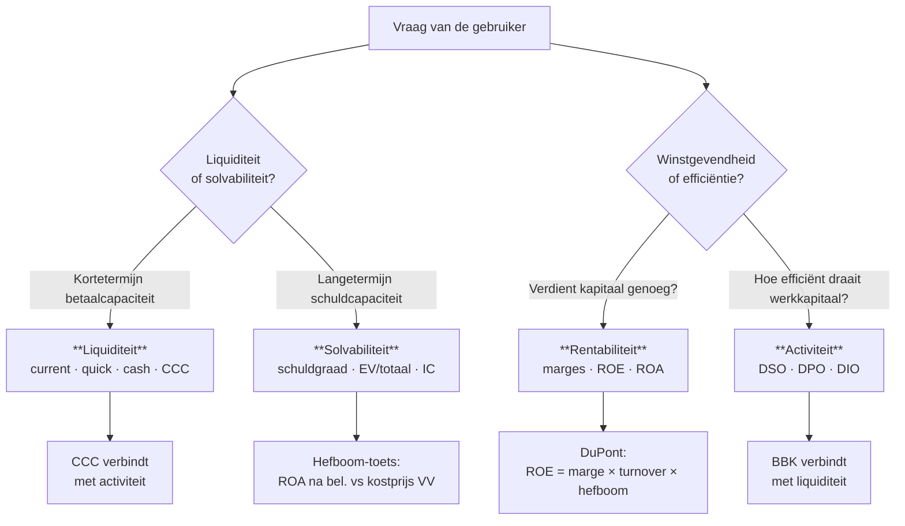

> **Samenvatting — kapstok voor herhaling.** Enkele A4 die het hele PO samenvatten in vaste blokken: take-away, vier-families-tabel, functionele balans, schema-bewustzijn, beslisboom, DuPont + hefboom, scherpe begrippen, continuïteit + Altman, valkuilen. Bedoeld om snel door te lopen, niet om voor het eerst te leren. Voor uitleg en doorwerking: de leerstukken van dit leerpad. Voor verhaal en routekaart: [[studiemateriaal/1-3|overzicht PO 1.3]].

---

## 1. Take-away (wat je écht moet weten)

- **Vier ratio-families samen, niet apart.** Liquiditeit · solvabiliteit · rentabiliteit · activiteit. Eén ratio alleen geeft geen oordeel — pas drie dimensies (trend · sector · cross-categorie) geven betekenis.
- **Eerst herwerken, dan rekenen.** Analytische balans (4 blokken) + functionele balans-drieluik (NBK · BBK · NT). De BBK-rubriekenkeuze (ja/nee per balanspost) is een terugkerende valkuil.
- **Schema-bewustzijn.** In het verkort schema verdwijnen omzet (rubriek 70) en aankopen (60) — DSO en commerciële brutomarge zijn dan niet berekenbaar. Klassieke valkuil.
- **Bruto in twee betekenissen.** Bruto van niet-kaskosten (EBITDA = bruto van afschrijvingen) **vs** bruto in commerciële zin (omzet − rubriek 60). Belgische conventie voor "brutoverkoopmarge" = bedrijfsresultaat / omzet (NBB).
- **Cash ≠ winst.** Operationele cashflow kan negatief zijn terwijl er winst is — werkkapitaal vreet cash op. IAS 7 indirecte methode: nettoresultaat + niet-kas-items + Δ werkkapitaal.
- **Doelstelling 1.3.1.2: voorstellen formuleren.** Integratie-niveau. Analyse stopt niet bij vaststellen; concrete aanbevelingen aan bestuur horen erbij.

---

## 2. Vier ratio-families — formule, rubrieken, interpretatie

| Familie | Kernratio | Formule | Rubrieken | Vuistregel |
|---|---|---|---|---|
| **Liquiditeit** | Current ratio | VA / KT-sch | (3+40-41+50-58+490) / (42-48+492) | 1,5-2,0 gezond |
|  | Quick ratio (acid test) | (VA − voorraden) / KT-sch | Idem zonder klasse 3 | > 1,0 ✓ |
|  | Cash ratio | (50-58) / KT-sch | (Liq. middelen + geldbel.) / KT-sch | 0,2-0,4 typisch |
|  | CCC (dynamisch) | DSO + DIO − DPO | in dagen | lager = beter |
| **Solvabiliteit** | Schuldgraad | VV / Totaal | (16+17+42-48+492) / 10/49 | < 70 % gezond |
|  | Solvabiliteitsratio | EV / Totaal = 100 % − schuldgraad | (10-15) / (10/49) | > 30 % comfortabel |
|  | Debt-to-equity | VV / EV | — | < 2 gezond |
|  | Interest coverage | EBIT / kosten van schulden | 9901 / 650 | > 5 sterk · < 3 zwak |
| **Rentabiliteit** | Brutoverkoopmarge (NBB) | Bedrijfsresultaat / omzet | 9901 / 70 | sector-afhankelijk |
|  | Commerciële brutomarge | (omzet − aankopen) / omzet | (70 − 60) / 70 | 10-50 % afh. sector |
|  | EBITDA-marge | EBITDA / omzet | (9901+630+631+635) / 70 | > 10 % sterk |
|  | Nettomarge | Nettoresultaat / omzet | 9904 / 70 | > 5 % sterk |
|  | ROE | Nettoresultaat / EV | 9904 / 10-15 | > 10 % gezond |
|  | ROA | Bedrijfsresultaat / Totaal | 9901 / 10/49 | sector-afhankelijk |
| **Activiteit** | DSO (klanten) | (40 × 365) / (70 × 1,21) | dagen | lager = beter |
|  | DPO (leveranciers) | (44 × 365) / ((60+61) × 1,21) | dagen | hoger = relief |
|  | DIO (voorraad) | (3 × 365) / 60 | dagen | lager = beter |
|  | BBK (werkkapitaalbehoefte) | Excl. expl. VA − Excl. expl. KT-sch | zie §3 hieronder | — |

---

## 3. Functionele balans NBK · BBK · NT

| Component | Formule | Wat meet het? |
|---|---|---|
| **NBK** (netto-bedrijfskapitaal) | Permanent vermogen − Vaste activa = VA − Schulden ≤ 1j | Structurele buffer voor cyclus |
| **BBK** (behoefte aan bedrijfskapitaal) | Exploitatie-VA − Exploitatie-KT-sch | Cash vastgepind in operationele cyclus |
| **NT** (nettothesaurie) | NBK − BBK = (50-58) − (42+43) | Cash-overschot of -tekort. > 0 = geen KT-noodfinanciering |

> 💡 De BBK-rubriekenkeuze (ja/nee per balanspost) en de interpretatie van een positieve nettothesaurie zijn beide klassieke vraagstellingen — zie tabel hieronder.

### BBK — ja/nee per balansrubriek

| Rubriek | Code | In BBK? | Reden |
|---|---|:---:|---|
| Voorraden | 30/36 | ✅ Ja | Exploitatief |
| Bestellingen in uitvoering | 37 | ✅ Ja | Exploitatief |
| Handelsvorderingen | 40 | ✅ Ja | Exploitatief |
| Overige vorderingen ≤ 1j | 41 | ✅ Ja | Meestal exploitatief (btw) |
| Overlopende rek. actief | 490/1 | ✅ Ja | Pro rata |
| Geldbeleggingen | 50/53 | ❌ Nee | Thesaurie |
| Liquide middelen | 54/58 | ❌ Nee | Thesaurie |
| Vaste activa | 20-29 | ❌ Nee | Permanent |
| Handelsschulden | 44 | ✅ Ja | Exploitatief |
| Ontvangen vooruitbet. | 46 | ✅ Ja | Exploitatief |
| Fisc/soc/loonschulden | 45 | ✅ Ja | Exploitatief |
| Overige schulden | 47/48 | ✅ Ja | Meestal exploitatief |
| Overlopende rek. passief | 492/3 | ✅ Ja | Pro rata |
| **42 LT-schulden binnen 1j vervallend** | 42 | **❌ Nee** | **Financieel** |
| **43 Financiële schulden (kaskredieten)** | 43 | **❌ Nee** | **Financieel** |
| EV · voorzieningen · LT-schulden | 10-17 | ❌ Nee | Permanent |

---

## 4. Volledig vs verkort schema — welke ratio's vallen weg?

| Schema | Wie? | Wat ontbreekt? | Onmogelijke ratio's |
|---|---|---|---|
| **Volledig** | Groot (criteria boven drempel) | — | Geen |
| **Verkort** | Klein (binnen drempels) | Omzet (70) in 9900 Brutomarge · rubriek 60 niet apart · reserves niet uitgesplitst | **DSO** · **DPO** · **commerciële brutomarge** |
| **Micro** | Microvennootschap (zeer beperkt) | Idem + nog meer vereenvoudigd · geen sociale balans | Idem + nog meer activiteits-ratios |

> 💡 Drempels (Cijferzakboekje) — niet hier hardcoded. Klassieke vraag: "welke ratio kan je niet berekenen in verkort schema?" Antwoord: DSO (omloopsnelheid klanten) + DPO + commerciële brutomarge.

---

## 5. Beslisboom — welke ratio bij welke vraag?

---

## 6. DuPont + hefboomanalyse — cross-categorie instrumenten

| Instrument | Formule | Interpretatie |
|---|---|---|
| **DuPont-decompositie** | ROE = Nettomarge × Asset turnover × Equity multiplier | Waar komt ROE-mutatie vandaan? Marge / efficiëntie / hefboom |
| **Operationele hefboom (DOL)** | Δ % EBIT / Δ % omzet | Hoge DOL = hoge vaste kosten = asymmetrisch effect |
| **Financiële hefboom (DFL)** | EBIT / (EBIT − kosten van schulden) | DFL > 1 = rente-last verhoogt ROE-gevoeligheid |
| **Hefboomeffect-toets** | ROA na bel. > kostprijs VV? | Ja → schuld werkt POSITIEF · Nee → NEGATIEF |

---

## 7. Begrippen scherp houden

| Begrip | Definitie | Niet verwarren met |
|---|---|---|
| **Intrinsieke waarde** (per aandeel) | EV / aantal aandelen | Beurswaarde (markt) · fractiewaarde (kapitaal-deel) |
| **Fractiewaarde** | Kapitaal (of inbreng voor BV/CV) / aantal aandelen | Intrinsieke waarde (inclusief reserves) |
| **Beurswaarde** | Markt-prijs per aandeel × aantal aandelen | Intrinsieke · fractiewaarde |
| **Solvabiliteitsratio** | EV / totaal passief | Zelffinancieringsgraad ((reserves+overgedragen)/totaal) |
| **Zelffinancieringsgraad** | (Reserves + overgedragen winst) / totaal | Solvabiliteitsratio (telt ook inbreng) |
| **"Bruto" verkoopmarge (NBB)** | Bedrijfsresultaat / omzet — bruto = vóór niet-kaskosten in marge-zin (NBB) | Commerciële brutomarge ((70−60) / 70) |
| **Netto-rentabiliteit bedrijfsactiva** | NOPAT / gem. bedrijfsactiva — netto = ná afschrijvingen, vóór financiering | ROA (bedrijfsresultaat / totaal — geen NOPAT) |
| **Operationele cashflow vóór belastingen** | Bedrijfsresultaat + niet-kasbestanddelen bedrijfskosten | Klassieke cashflow (start van eindresultaat 9904) |
| **EBIT** (bedrijfsresultaat ≈ 9901) | Earnings before interest and taxes | EBITDA (bruto van niet-kaskosten) |
| **EBITDA** | EBIT + afschrijvingen + waardeverm. + voorzieningen | EBIT (na niet-kaskosten) |

---

## 8. Continuïteit + Altman Z-score

### Going-concern-indicatoren

| Signaal | Bron |
|---|---|
| Negatief eigen vermogen | Balans |
| Structurele verliezen (3 jaar) | RR-trend |
| Interest coverage < 1,5 of covenant-schending | Solvabiliteits-ratio |
| Aanhoudende negatieve operationele cashflow | Kasstroomtabel |
| KT-financiering voor LT-verliezen | Balans-evolutie |
| Toelichting met onzekerheidsclausule | Toelichting bestuur |

### Altman Z-score (private firm)

$$
Z' = 0{,}717\,X_1 + 0{,}847\,X_2 + 3{,}107\,X_3 + 0{,}420\,X_4 + 0{,}998\,X_5
$$

- X1 = NBK / Totaal activa
- X2 = (Reserves + overgedragen winst) / Totaal activa
- X3 = EBIT / Totaal activa
- X4 = EV (boekwaarde) / VV-totaal
- X5 = Omzet / Totaal activa

| Z'-zone | Interpretatie |
|---|---|
| **Z' < 1,23** | Distress — verhoogd risico op faillissement |
| **1,23 ≤ Z' < 2,90** | Grijze zone — verhoogde aandacht |
| **Z' ≥ 2,90** | Veilig — geen verhoogd risico |

### WVV-alarmbel (raakvlak PO 1.9)

| Rechtsvorm | Artikel | Trigger |
|---|---|---|
| **NV / Comm.VA / SE** (kapitaalhoudend) | WVV art. 7:228 | Nettoactief < helft kapitaal door geleden verlies (vierde = strengere trigger) |
| **BV / CV** (kapitaal-loos) | WVV art. 5:153 | Solvabiliteitstest (nettoactief negatief dreigt/is) OF liquiditeitstest (schulden komende 12 maanden niet betalen) |

> **Reactie**: bijzonder bestuursverslag binnen 2 maanden + AV-bijeenroeping + voorstel maatregelen of vereffening. CBN-advies 2021/14 geeft de jaarrekeningrechtelijke invulling.

---

## 9. Klassieke valkuilen

| Valkuil | Wat klopt niet | Wat klopt wel |
|---|---|---|
| "Netto rentabiliteit = na belasting" | "Netto" kan ook "na niet-kaskosten" betekenen (vs bruto-rentabiliteit) | Twee betekenissen — let op formule-keuze. CBN 2011/14 = na afschrijvingen, vóór belasting |
| "Rubriek 42 LT-schuld binnen jaar vervallend in BBK" | Rubriek 42 lijkt kortlopend maar is een FINANCIËLE schuld | Niet in BBK — exploitatie-filter sluit financieel uit |
| "Verkort schema = alle ratio's berekenbaar" | Omzet (70) en aankopen (60) ontbreken — DSO + DPO + commerciële brutomarge onmogelijk | Liquiditeit + solvabiliteit blijven berekenbaar |
| "Hogere afschrijving verlaagt de brutoverkoopmarge" | Afschrijvingen (rubr. 630) staan ONDER de brutomarge in het schema | Geen effect op de NBB-brutoverkoopmarge — de afschrijving zit reeds in 9901 verwerkt |
| "Positieve NT = altijd goed" | Structureel hoge NT kan onderbenutting cash signaleren | Positief = goede liquiditeit, maar interpreteer in context (sector + alternatieven) |
| "Eén ratio = oordeel" | Een ratio zonder trend + sector + cross-categorie is een snapshot zonder context | Vier-assen-methode: trend + sector + cross-categorie + kwalitatief |
| "Window-dressing = fraude" | Grijze schaal — sommige technieken zijn binnen de wet (vervroegde inning) | Spectrum van legitieme jaarafsluit-optimalisatie tot fraude. Detectie via balansdatum-vergelijking met Q1 of mid-jaar |
| "EBITDA = cash" | EBITDA negeert werkkapitaal-mutaties — winst en cash kunnen sterk verschillen | Operationele cashflow = EBITDA ± Δ werkkapitaal − betaalde rente − betaalde belastingen |

---

## 10. Verdieping

Werkt iets niet meer scherp? Klik door naar het leerstuk of de concept-fiche die het uitwerkt.

### Leerstukken (binnen PO 1.3)

- [[wat-is-jaarrekeninganalyse]] — Kader: waarom, voor wie, met welke instrumenten, wie controleert
- [[jaarrekening-herwerken-en-functionele-balans]] — Analytische balans + NBK · BBK · NT + schema-bewustzijn
- [[ratios-en-kengetallen]] — Vier ratio-families + DuPont + hefboomanalyse
- [[kasstroom-en-financieringstabel]] — Drie IAS 7-categorieën + indirecte methode
- [[kritische-beoordeling-en-diagnose]] — Synthese + Altman + window-dressing + aanbevelingen

### Concepten (voor definitorische detail)

**Kader + methodologie**: [[jaarrekeninganalyse]] · [[financiele-diagnose]] · [[ratio-interpretatie]] · [[financiele-analyse-software]]

**Vier families**: [[liquiditeits-ratios]] · [[solvabiliteits-ratios]] · [[rentabiliteits-ratios]] · [[activiteits-ratios]]

**Cash + valkuilen**: [[kasstroom-analyse]] · [[window-dressing]] · [[financiele-verrichtingen]]

**Documenten**: [[jaarrekening]]

---

*Samenvatting PO 1.3. Status: voorgesteld (2026-05-31).*
