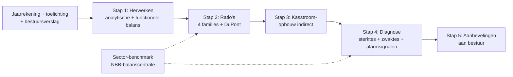
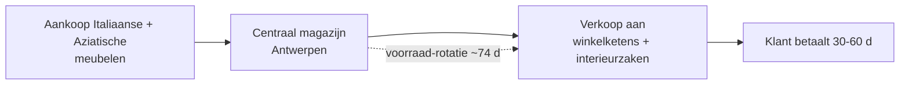

> **Leerstuk — één vraag, helemaal doorgewerkt.** Dit is de entry-fiche voor PO 1.3: het kader vóór je in de techniek duikt. De stappen — cijfers herwerken, ratio's berekenen, kasstroom opbouwen, eindoordeel formuleren — krijgen elk een eigen leerstuk. Hier zet je het verhaal neer en maak je kennis met Belova NV, het mock-bedrijf dat door de hele PO meedraait. Voor verhaal en routekaart: [[studiemateriaal/1-3|overzicht PO 1.3]].

## Antwoord in één blik

Jaarrekeninganalyse vertaalt de ruwe cijfers van balans en resultatenrekening naar een onderbouwd oordeel over vier dimensies van financiële gezondheid — **liquiditeit, solvabiliteit, rentabiliteit en activiteit** — aangevuld met een kasstroombeeld. Geen enkele ratio op zich is voldoende: pas in samenhang (trend door de tijd, vergelijking met de sector, oversteek tussen categorieën) krijgen de cijfers betekenis.

Het eindproduct is een diagnose-rapport voor cliënt-bestuur, bank, commissaris of investeerder, vaak met concrete aanbevelingen tot verbetering. Die tweede stap — niet alleen vaststellen maar ook adviseren — is wat een goede analyse onderscheidt van een ratio-lijst.

---

## Waarom analyseren — niet meer dan optellen?

Een Belgische jaarrekening telt al gauw vijftig tot honderd pagina's. Doorlezen alleen levert geen oordeel op: je weet wát er staat, niet wat het betekent. Neem Belova NV — onze voorbeeldgroep, een groothandel in meubilair. Omzet +5,2 % naar 14,2 mln EUR, nettowinst 164 K EUR in het zwart. Klinkt prima. Maar wie alleen die twee lijnen leest, mist dat het bedrijfsresultaat in twee jaar méér dan gehalveerd is (van 674 K naar 307 K EUR), dat de operationele kasstroom negatief staat (-236 K EUR), en dat het werkkapitaal maand na maand cash absorbeert.

Analyse zet absolute bedragen om in **verhoudingen, trends en benchmarks**. Pas dan kun je de échte vragen beantwoorden: kan dit bedrijf morgen zijn leverancier betalen? Verdient de aandeelhouder nog op zijn inleg? Loopt de bank risico met zijn krediet?

> **Twee doelstellingen, niet één.** Het programma vraagt eerst kritisch lezen, dan voorstellen formuleren om de financiële situatie te verbeteren. Een analyse die stopt bij vaststellen is half werk. Daarom zit dit programmaonderdeel op integratie-niveau: ratio's berekenen is niet genoeg, je moet ze vertalen naar advies dat het bestuur kan gebruiken.

---

## Voor wie — vijf stakeholder-perspectieven

Dezelfde jaarrekening wordt door verschillende partijen gelezen — elk met een eigen vraag. Wie weet welke bril er meekijkt, weet welke ratio's prioriteit krijgen.

| Stakeholder | Wat wil hij/zij weten? | Belova-relevant |
|---|---|---|
| Aandeelhouder / vennoot | Rendement op zijn inleg + dividend-capaciteit | ROE 5,9 % (gehalveerd) + dividenduitkering 84 K EUR |
| Bank / kredietverstrekker | Solvabiliteit + interest coverage + covenanten | Interest coverage 3,3× onder grens 4× |
| Leverancier / klant | Liquiditeit + betalingsbetrouwbaarheid | Current ratio 1,92 ✓ + DPO 37 d (vlot) |
| Commissaris | Going-concern + materialiteit | EBIT-daling -54 % + covenant-spanning |
| Fiscus / RSZ | Belastbare basis + sociale schulden | Belastingen 55 K EUR + geen achterstallige RSZ |

Sleutel-inzicht: **dezelfde ratio kan voor twee partijen een tegengesteld oordeel opleveren**. Een lage solvabiliteit is voor de bank een waarschuwing — hoge schuld betekent hoog risico bij tegenslag. Voor een aandeelhouder die hoge dividenden wil, is diezelfde lage solvabiliteit net een goed teken: hoge hefboom = hoge ROE zolang de zaken goed draaien. Bij Belova werken drie brillen tegelijk: de bank ziet interest coverage 3,3× onder de covenant (rood signaal); de aandeelhouder ziet ROE 5,9 % gehalveerd (dalende waardecreatie); de fiscus ziet een positieve belastbare basis. Drie interpretaties van precies dezelfde cijfers.

---

## Met welke instrumenten — vier ratio-families + kasstroom + diagnose

De standaardtoolset bestaat uit **vier ratio-families**, elk gericht op één hoofdvraag. Samen vormen ze de kapstok waar elke specifieke ratio aan hangt.

| Familie | Hoofdvraag | Kernratio's | Voor wie centraal? |
|---|---|---|---|
| **Liquiditeit** | Kan het bedrijf morgen betalen? | current · quick · cash · cash-conversion-cycle | leverancier · bank |
| **Solvabiliteit** | Kan het bedrijf alle schulden uiteindelijk dragen? | schuldgraad · EV/totaal · debt-to-equity · interest coverage | bank · investeerder |
| **Rentabiliteit** | Verdient het bedrijf voldoende op zijn kapitaal? | brutomarge · EBITDA-marge · ROE · ROA | aandeelhouder · investeerder |
| **Activiteit** | Hoe efficiënt draait het werkkapitaal? | DSO · DPO · DIO · CCC | bestuur · adviseur |

Ratio's zijn krachtig, maar slechts één instrument. Voor echte diagnose komen er twee bij. **Kasstroomanalyse** legt het verschil bloot tussen winst en cash — Belova is het tekstboekvoorbeeld: positief resultaat, negatieve operationele kasstroom, want het werkkapitaal absorbeert alles. En **kritische beoordeling** zet de ratio's tegen sector-benchmark en trend — een current ratio van 1,9 zegt niets zonder vergelijkingspunt. Elk instrument krijgt een eigen leerstuk: families in [[ratios-en-kengetallen]], kasstroom in [[kasstroom-en-financieringstabel]], syntheseproces in [[kritische-beoordeling-en-diagnose]].

---

## Welke documenten leest de analist?

De cijfers komen uit twee soorten bronnen: **wettelijke documenten** (verplicht, gestandaardiseerd, neergelegd bij de Nationale Bank) en **aanvullende documenten** (intern of betaald). De eerste bepalen de minimum-cijferbasis; de tweede geven kleur en context.

| Type | Documenten | Wat levert het op? |
|---|---|---|
| **Wettelijk** | Jaarrekening — balans, resultatenrekening, toelichting, sociale balans | Gestandaardiseerde cijferbasis |
| **Wettelijk** | Jaarverslag (= bestuursverslag) — verplicht behalve voor niet-genoteerde kleine vennootschappen | Strategische context · risico's · vooruitzichten |
| **Wettelijk** | Commissarisverslag — voor vennootschappen waar een commissaris benoemd moet worden | Onafhankelijke goedkeuring + going-concern-evaluatie |
| **Wettelijk** | Geconsolideerde jaarrekening (groepsperspectief) | Groep als één economische eenheid — zie [[studiemateriaal/1-4|PO 1.4]] |
| **Aanvullend** | Ratio-tabel + financieringstabel + boordtabel | Analytische verdichting (intern) |
| **Aanvullend** | Sector-benchmark + peer-vergelijking | Externe referentiekader |

Het jaarverslag wordt vaak onderschat. Het bevat de management-discussie, het risicoprofiel en de vooruitzichten — informatie die geen ratio kan leveren. Bij Belova staat erin dat de bank een waiver gevraagd heeft op de interest-coverage-covenant en dat het bestuur margedruk erkent. Wie alleen ratio's leest, mist die kwalitatieve laag.

> **Voor groothandel zijn ook commerciële platformen nuttig.** Belfius Companyweb, Trends Top en Graydon bieden snelle peer-benchmark, kredietrating en alarmsignalen zoals achterstallige RSZ- of btw-schulden. Overzicht in [[financiele-analyse-software]].

---

## Wie controleert de cijfers? Vijf toezichthouders

Wat de analist op zijn bureau krijgt, is door verschillende filters gegaan. Vijf organen houden vanuit een eigen hoek toezicht op de cijfers — elk met een rol die elders grondig behandeld wordt.

| Orgaan | Rol bij jaarrekening | Verdieping |
|---|---|---|
| Algemene vergadering (vennoten/aandeelhouders) | Goedkeuring + kwijting; vraagrecht; bijzonder onderzoek | PO 3.0 vennootschapsrecht |
| Commissaris (lid IBR) | Wettelijke controle + going-concern-evaluatie + alarmbel-vermeldingen | [[studiemateriaal/1-6|PO 1.6 externe controle]] |
| Ondernemingsraad | Krijgt basis-, jaar- en occasionele financiële informatie; kan commissaris om toelichting vragen | PO 3.0 sociale wetgeving |
| Ondernemingsrechtbank — Kamer voor ondernemingen in moeilijkheden | Detecteert financiële moeilijkheden + uitnodiging tot gesprek bij signalen | [[studiemateriaal/1-9|PO 1.9 insolventie]] |
| Financiële instanties (banken) | Volgen covenanten + rating; reageren bij schending | Belova: BNP Fortis covenant 4× interest coverage |

Het toezicht is **gelaagd**: eerst de eigenaars, dan een onafhankelijke beroepsbeoefenaar, dan de werknemersvertegenwoordiging, dan een preventieve rechter, en ten slotte de kredietverlener die de cijfers continu monitort. Maar dat ontslaat jou niet van een eigen kritische blik. Een waiver-aanvraag op een covenant verschijnt in geen enkele ratio — alleen door de jaarrekening, het bestuursverslag en de toelichting samen te lezen, herken je de spanning.

---

## Belova NV — voorbeeld door heel het PO

Belova NV draait door alle leerstukken van dit programmaonderdeel mee. Eén coherent verhaal van herwerken tot diagnose, zodat je het bedrijf herkent zodra het terugkeert. Het is een naamloze vennootschap, groothandel in meubilair, gevestigd in Antwerpen, met 62 voltijdse equivalenten en een balanstotaal van 8,4 mln EUR op een omzet van 14,2 mln EUR. Als grote vennootschap is ze verplicht het volledig schema te gebruiken, een bestuursverslag op te maken en een commissaris te benoemen. Eén bankrelatie (BNP Paribas Fortis) met twee covenanten: schuldgraad maximaal 70 % en interest coverage minimaal 4×.

De **centrale diagnostische spanning**: comfortabele liquiditeit (cash-buffer ruim boven sector) gaat samen met dalende rentabiliteit (marges onder druk), stijgend werkkapitaal en covenant-spanning (interest coverage gezakt onder 4×). Niet acuut bedreigd, wel een onderneming die om ondervraging vraagt — precies het type case dat een analist in de praktijk tegenkomt.

---

## Wanneer je dit snapt, ga dan naar

- [[jaarrekening-herwerken-en-functionele-balans]] — Hoe maak je de cijfers analyse-klaar? Analytische balans + NBK/BBK/NT — de eerste pure techniek-stap.
- [[ratios-en-kengetallen]] — De vier ratio-families uitgewerkt + DuPont-decompositie + hefboomanalyse — het zwaartepunt van het programmaonderdeel.
- [[kasstroom-en-financieringstabel]] — Drie IAS 7-categorieën + indirecte methode — waarom winst ≠ cash.
- [[kritische-beoordeling-en-diagnose]] — Van getallen naar oordeel + voorstellen aan het bestuur — het integratie-niveau van het programmaonderdeel.
- [[studiemateriaal/1-3/samenvatting|Samenvatting PO 1.3]] — voor herhaling: tabellen, beslisboom en formules op 2-4 A4.

## Doorklik naar concepten

Voor wie definitorisch detail wil opzoeken:

- [[jaarrekeninganalyse]] · [[financiele-diagnose]] · [[financiele-analyse-software]] · [[jaarrekening]]

---

## Wettelijk fundament

- Verplichting tot opmaak jaarrekening + onderdelen (balans · resultatenrekening · toelichting): WVV art. 3:1 + KB-WVV art. 3:6 e.v.
- Verplichting jaarverslag (bestuursverslag) — niet van toepassing op niet-genoteerde kleine vennootschappen: WVV art. 3:4 (toepassingsgebied) + 3:5 + 3:6 (inhoud).
- Verplichting commissaris-controle — niet van toepassing op niet-genoteerde kleine vennootschappen: WVV art. 3:69 (toepassingsgebied wettelijke controle); benoeming door algemene vergadering: art. 3:55; commissarisverslag enkelvoudige jaarrekening: art. 3:74. Diepe behandeling in [[studiemateriaal/1-6|PO 1.6]].
- Financiële informatie aan ondernemingsraad: KB 27 november 1973 (Economische en Financiële Informatie). Behandeld in PO 3.0 sociale wetgeving.
- Kamers voor ondernemingen in moeilijkheden: WER Boek XX (insolventie). Diepe behandeling in [[studiemateriaal/1-9|PO 1.9]].

---

*Leerstuk PO 1.3 — entry-fiche. Status: voorgesteld. Volgende stap voor de student: [[jaarrekening-herwerken-en-functionele-balans]].*
