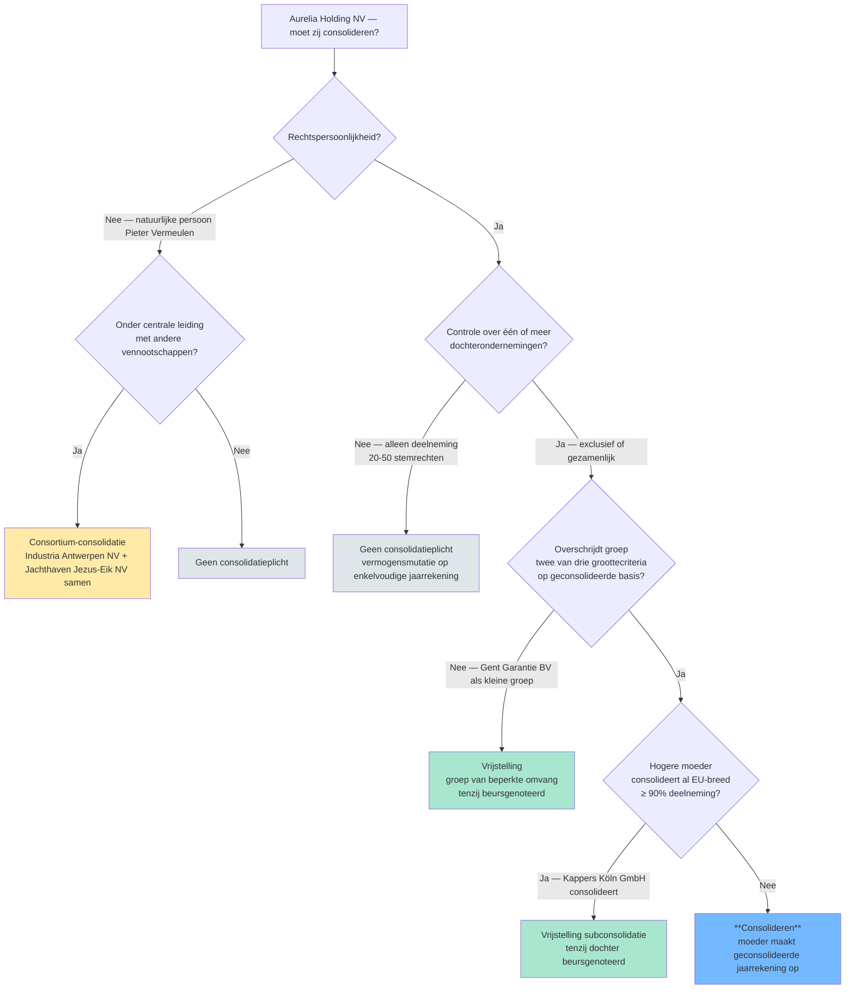
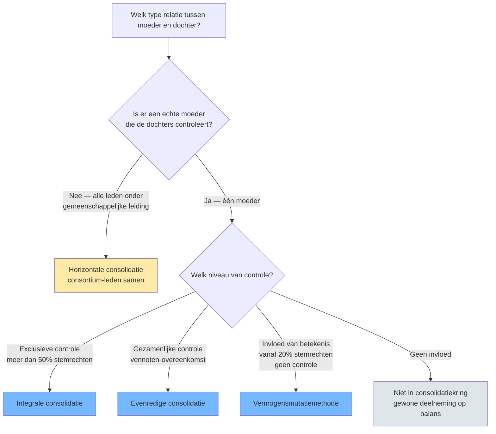

## Wat verwacht het examen van jou?

> [!abstract] Dit programmaonderdeel wordt getoetst op niveau *toepassen*.
> Je moet deze regels en begrippen kunnen toepassen op een nieuwe casus — herkennen welk concept geldt en de stappen correct uitvoeren.

**Taken** (uit het ITAA-examenprogramma):

> [!abstract]- **Taak 1** — Opstellen van de individuele en geconsolideerde jaarrekening
>
> **Doelstellingen**:
> - Uitvoeren van eindejaarsverrichtingen
> - Bepalen van het boekhoudkundig resultaat en verwerking van de bestemming van het resultaat
> - Opstellen van de proefbalans en de saldibalans
> - Opstellen van de jaarrekening (balans, resultatenrekening, toelichting)
> - Verwerken van de sociale balans
> - Toepassen van de waarderingsregels (voorraden, afschrijving van vaste activa)
> - Executeren van vorderingen en schulden, op korte en lange termijn

## Leesgids

Deze minicursus volgt de natuurlijke werkvolgorde van een [[geconsolideerde-jaarrekening|consolidatiedossier]]: eerst de gatekeeper-vraag (moet er geconsolideerd worden?), dan het begrippenkader rond [[controle]], vervolgens de keuze van techniek per entiteit en ten slotte de feitelijke opbouw — eerste consolidatie, eliminaties en kringwijzigingen. De [[consolidatieplicht-beslisboom|beslisboom]] en de [[consolidatiemethodes-vergelijking|methodes-matrix]] zijn je twee scharnierpunten — keer ernaar terug zodra een examencasus je een nieuwe groepsstructuur voorlegt. De cheatsheet en de [[exclusieve-controle|drempelwaarden]] vat je vlak voor het examen samen.

## Waarom dit programmaonderdeel telt

Een groep van vennootschappen kan op papier een gezond plaatje tonen terwijl de cijfers in werkelijkheid bestaan uit onderlinge verkopen en leningen tussen moeder en dochter. De [[geconsolideerde-jaarrekening|geconsolideerde jaarrekening]] herstelt het beeld door moeder + dochters voor te stellen alsof het één onderneming was. Voor een accountant betekent dat: kwalificeren (welke relatie is het?), kiezen (welke techniek hoort daarbij) én rekenen ([[intragroep-eliminaties|onderlinge stromen schrappen]], [[minderheidsbelangen|derden afzonderen]]). Het examen toetst dit als toepassings-stof — een diagram met percentages, een vraag naar de juiste methode — dus je moet de regel direct op een casus kunnen leggen.

## Wat is consolideren? Waarom een geconsolideerde jaarrekening?

Consolideren is de juridische pluraliteit van een groep economisch herleiden tot één geheel: de [[moedervennootschap|moeder]] en alle entiteiten waarover zij [[controle]] uitoefent worden samengevoegd, onderlinge transacties worden geschrapt en het aandeel dat aan andere aandeelhouders toekomt wordt apart getoond als [[minderheidsbelangen|belangen van derden]]. Je leert in dit programmaonderdeel die operatie stap voor stap toepassen — van het aftoetsen of er überhaupt een [[consolidatieverplichting]] is, tot de keuze van techniek per relatie en de boekhoudkundige uitwerking ervan.

## Moet ik consolideren? — Beslisboom

Een beslisboom-synthese binnen het Belgische vennootschapsrecht (WVV) die de gatekeeper-vraag — bestaat er een consolidatieverplichting? — in afzonderlijke beslismomenten ontvouwt. Doel: de stagiair leren systematisch door grootte-, vrijstellings- en uitzonderings-gronden te gaan vooraleer hij aan de techniek begint.

Voor je één regel boekt, doorloop je vijf parallelle toetsen die elk de [[consolidatieverplichting]] kunnen wegnemen. Werk je ze niet in volgorde af, dan riskeer je tijd te steken in een methode-keuze terwijl de moeder dankzij een vrijstelling helemaal niet hoeft te consolideren.

| Stap | Toets | Welk concept? | Bij 'ja' | Bij 'nee' |
|---|---|---|---|---|
| 1 | Is de moeder een vennootschap met rechtspersoonlijkheid? | [[moedervennootschap]] | Door naar stap 2 | Geen consolidatieplicht (natuurlijke persoon → eventueel consortium-piste) |
| 2 | Bestaat er controle (in rechte of in feite) over één of meer dochters? | [[controle]] | Door naar stap 3 | Geen consolidatieplicht |
| 3 | Of: zijn er meerdere vennootschappen onder centrale leiding zonder onderlinge moeder-dochter? | [[consortium]] | Consortium-consolidatie (horizontaal), door naar stap 4 | Verticale groep, door naar stap 4 |
| 4 | Overschrijdt de groep meer dan één van de groottecriteria op geconsolideerde basis? | [[groottecriteria-consolidatie]] · [[groep-van-beperkte-omvang]] | Door naar stap 5 | Vrijstelling 'groep van beperkte omvang' — geen consolidatieplicht (tenzij beursgenoteerd) |
| 5 | Wordt de moeder zelf al opgenomen in een gelijkwaardige geconsolideerde jaarrekening hogerop in de EU (≥ 90 % deelneming)? | [[vrijstelling-subconsolidatie]] | Vrijstelling subconsolidatie — moeder consolideert niet zelf, tenzij dochter beursgenoteerd | **Consolideren** — moeder maakt geconsolideerde jaarrekening op |

**Kerninzichten**:

- Geen enkele moeder is automatisch consolidatieplichtig — er zijn altijd vijf parallelle toetsen die elk een 'nee' kunnen geven. Een examenvraag die zegt 'moeder X heeft controle over dochter Y, dus moet zij consolideren' kapt de redenering te vroeg af.
- Een natuurlijke persoon kan nooit moeder zijn (geen rechtspersoonlijkheid), maar haar gecontroleerde vennootschappen kunnen samen wel een consortium vormen. De plicht verschuift dan van één entiteit naar 'de leden samen'.
- De groottecriteria zijn 'op geconsolideerde basis' — je moet dus een fictieve geconsolideerde balans opbouwen om te beslissen of je een echte moet maken. Dat is geen circulariteit maar een toetscriterium.
- Beursnotering breekt zowel de 'groep van beperkte omvang'-vrijstelling als de subconsolidatie-vrijstelling. Voor genoteerde vennootschappen geldt: altijd consolideren, drempels of hogere moeder doen er niet toe.

_Bouwt op_: [[consolidatieverplichting]] · [[moedervennootschap]] · [[controle]] · [[consortium]] · [[groep-van-beperkte-omvang]] · [[groottecriteria-consolidatie]] · [[vrijstelling-subconsolidatie]]
## Het fundamentele begrippenkader: controle en de actoren in een groep

> [!info] Hoort bij taak: Opstellen van de individuele en geconsolideerde jaarrekening

Voor je een methode kiest of een cijfer aanpakt, moet je een relatie kwalificeren. Je leert toepassen welk niveau van invloed je voor je hebt — [[exclusieve-controle]], [[gezamenlijke-controle]] of [[invloed-van-betekenis]] — en welke actor (dochter, gemeenschappelijke dochter, geassocieerde) daaruit volgt. Let bij elke casus op het scharnier tussen [[controle]] en [[invloed-van-betekenis]]: de eerste maakt iemand moeder en triggert consolidatie, de tweede leidt tot vermogensmutatie zonder consolidatieplicht.

- [[controle|Controle]] · `begrip`
- [[moedervennootschap|Moedervennootschap]] · `begrip`
- [[dochteronderneming|Dochteronderneming]] · `begrip`
- [[exclusieve-controle|Exclusieve controle]] · `begrip`
- [[gezamenlijke-controle|Gezamenlijke controle]] · `begrip`
- [[invloed-van-betekenis|Invloed van betekenis]] · `begrip`
- [[geassocieerde-onderneming|Geassocieerde onderneming]] · `begrip`
- [[gemeenschappelijke-dochteronderneming|Gemeenschappelijke dochteronderneming]] · `begrip`
- [[consortium|Consortium (horizontale groep)]] · `begrip`

## Bepalen of een vennootschap een geconsolideerde jaarrekening moet opstellen

> [!info] Hoort bij taak: Opstellen van de individuele en geconsolideerde jaarrekening

Je leert stap voor stap aftoetsen of de [[consolidatieverplichting]] bij een concrete vennootschap rust: heeft ze rechtspersoonlijkheid, oefent ze controle uit, en valt ze niet onder een vrijstelling als [[vrijstelling-subconsolidatie|subconsolidatie]] of [[groep-van-beperkte-omvang|groep van beperkte omvang]]? De procedure leidt je door de gatekeeper-toetsen vóór je aan techniek toekomt.

[[competenties/bepalen-consolidatieverplichting|→ Volledige procedure]]

## Afbakenen van de consolidatiekring en beoordelen van uitsluitings- of weglatingsgronden

> [!info] Hoort bij taak: Opstellen van de individuele en geconsolideerde jaarrekening

Eens de plicht vaststaat, baken je de [[consolidatiekring]] af: welke entiteiten neem je integraal, evenredig of via vermogensmutatie op, en welke laat je gemotiveerd buiten de kring? Je leert toepassen welke gronden tot uitsluiting of weglating leiden en hoe je dat verantwoordt in de toelichting.

[[competenties/afbakenen-consolidatiekring|→ Volledige procedure]]

## Kwalificeren van de relatie met een deelneming (controle, gezamenlijke controle of invloed van betekenis)

> [!info] Hoort bij taak: Opstellen van de individuele en geconsolideerde jaarrekening

Stap voor stap leg je elke deelneming langs drie filters: bestaat er [[exclusieve-controle]], [[gezamenlijke-controle]] of slechts [[invloed-van-betekenis]]? Werk je met de wettelijke drempelvermoedens, dan kan een casus snel kantelen — een 50/50-aandeelhouderschap mét vennoten-overeenkomst leidt tot een andere kwalificatie dan zonder overeenkomst.

[[competenties/kwalificeren-relatie-deelneming|→ Volledige procedure]]

## Berekenen van controle- en belangenpercentage in een ketenstructuur

> [!info] Hoort bij taak: Opstellen van de individuele en geconsolideerde jaarrekening

Bij een keten met meerdere schakels moet je twee verschillende sommen kunnen uitvoeren: [[controlepercentage]] (stemrechten — niet vermenigvuldigen door een gecontroleerde schakel) en [[belangenpercentage]] (kapitaalaandeel — wel doorlopend vermenigvuldigen). Je leert toepassen welke reken-conventie geldt en wanneer een keten "breekt" omdat er onderweg geen controle is.

[[competenties/berekenen-controle-en-belangenpercentage|→ Volledige procedure]]

## De drie consolidatiemethoden: integrale, evenredige en vermogensmutatie

> [!info] Hoort bij taak: Opstellen van de individuele en geconsolideerde jaarrekening

Drie technieken vullen de geconsolideerde jaarrekening: [[integrale-consolidatie]] voor dochters, [[evenredige-consolidatie]] voor gemeenschappelijke dochters en de [[vermogensmutatiemethode]] voor geassocieerden — met [[horizontale-consolidatie]] als vierde variant binnen een consortium. De keuze ligt vast in KB WVV, dus je hoeft niet te kiezen op basis van smaak — je past de juiste techniek toe op basis van de kwalificatie die je hierboven al maakte.

- [[integrale-consolidatie|Integrale consolidatie]] · `cluster`
- [[evenredige-consolidatie|Evenredige consolidatie (proportionele consolidatie)]] · `cluster`
- [[vermogensmutatiemethode|Vermogensmutatiemethode (equity method)]] · `cluster`
- [[horizontale-consolidatie|Horizontale consolidatie]] · `cluster`

## De vier consolidatiemethodes vergeleken

Een vergelijkende synthese binnen het Belgische boekhoudrecht-consolidatieregime (KB WVV Boek 3, Titel 2) die de vier consolidatietechnieken — integraal, evenredig, equity en buitenkring — naast elkaar plaatst. Doel: de stagiair laten zien wélke techniek bij welke relatie hoort en wat het verschil oplevert in de gepresenteerde groepscijfers.

Nu je weet hoe je een relatie kwalificeert, koppel je elke kwalificatie aan één techniek. Deze matrix toont in één oogopslag hoe activa, passiva en derden-belangen verschillend op de balans landen naargelang de gekozen methode — handig om te snel te kantelen tussen [[integrale-consolidatie]] en [[evenredige-consolidatie]] in een examencasus.

| Methode | Voorwaarde | Op balans | Belangen van derden | Consolidatieverschil |
|---|---|---|---|---|
| [[integrale-consolidatie\|Integrale consolidatie]] | Exclusieve controle (> 50% stemrechten of controle in feite) | Activa/passiva voor 100% opgenomen | Apart op passiefzijde | Wel mogelijk |
| [[evenredige-consolidatie\|Evenredige consolidatie]] | Gezamenlijke controle (overeenkomst tussen vennoten) | Activa/passiva pro-rata opgenomen | Niet apart (zit niet in de cijfers) | Wel mogelijk |
| [[vermogensmutatiemethode\|Vermogensmutatiemethode]] | Invloed van betekenis (≥ 20% stemrechten) of uitgesloten dochter | Eén balanspost: 'Vennootschappen waarop vermogensmutatie is toegepast' | Niet van toepassing | Wel mogelijk |
| [[horizontale-consolidatie\|Horizontale consolidatie (consortium)]] | Horizontale groep zonder moeder; centrale leiding (kan natuurlijke persoon zijn) | Activa/passiva voor 100% per consortium-lid, eigen-vermogensposten behouden hun karakter | Per consortium-lid | Wel mogelijk |

**Kerninzichten**:

- Controle (in rechte of feite) bepaalt eerst of er een groep is. Pas daarna kies je de methode op basis van controle-niveau.
- Het ENIGE verschil tussen integrale en evenredige consolidatie is of je activa/passiva volledig opneemt (en het derden-deel apart presenteert) of pro-rata (zonder afzonderlijke derden-post).
- Horizontale consolidatie is de buitenbeentje: er is geen moeder, er zijn alleen consortium-leden die door een gemeenschappelijke leiding samen opereren. Een natuurlijke persoon (bv. Pieter Vermeulen) kan die leiding zijn.

_Bouwt op_: [[integrale-consolidatie]] · [[evenredige-consolidatie]] · [[vermogensmutatiemethode]] · [[horizontale-consolidatie]]
## Kiezen van de toe te passen consolidatietechniek per entiteit

> [!info] Hoort bij taak: Opstellen van de individuele en geconsolideerde jaarrekening

Per entiteit in de [[consolidatiekring]] beslis je welke techniek je toepast — niet vanuit voorkeur, maar vanuit de kwalificatie die je daarvoor maakte. Een aandachtspunt is een [[gemeenschappelijke-dochteronderneming|gemeenschappelijke dochter]] die los van de groep opereert: dan kantelt de evenredige consolidatie naar [[vermogensmutatiemethode|vermogensmutatie]].

[[competenties/kiezen-consolidatiemethode|→ Volledige procedure]]

## Toepassen van uniforme waarderingsregels en hercorrigeren van enkelvoudige cijfers

> [!info] Hoort bij taak: Opstellen van de individuele en geconsolideerde jaarrekening

Voor je de cijfers van de dochters optelt, harmoniseer je hun waarderingsregels: dezelfde [[uniforme-waarderingsregels-consolidatie|regels die de moeder enkelvoudig hanteert]] gelden ook geconsolideerd, behoudens uitzonderingen die je moet motiveren. Je leert toepassen welke correcties op de enkelvoudige cijfers nodig zijn en hoe je afwijkingen in de toelichting verantwoordt.

[[competenties/toepassen-uniforme-waarderingsregels|→ Volledige procedure]]

## Uitvoeren van de eerste consolidatie van een nieuw verworven dochter of geassocieerde onderneming

> [!info] Hoort bij taak: Opstellen van de individuele en geconsolideerde jaarrekening

Bij elke nieuwe dochter werk je een [[eerste-consolidatie]] uit: je vergelijkt wat de moeder voor de aandelen betaalde met haar pro-rata aandeel in het eigen vermogen op aankoopdatum en je verklaart het verschil — eerst via stille meer- of minderwaarden op identificeerbare activa, dan residueel als [[consolidatieverschil]]. Werk de stappen netjes na, want elke afschrijving en elke toerekening dragen door naar de volgende boekjaren.

[[competenties/uitvoeren-eerste-consolidatie|→ Volledige procedure]]

## Uitvoeren van intragroep-eliminaties en berekenen van het aandeel van derden

> [!info] Hoort bij taak: Opstellen van de individuele en geconsolideerde jaarrekening

Je leert [[intragroep-eliminaties|onderlinge stromen]] systematisch wegwerken — vorderingen tegen schulden, opbrengsten tegen kosten, niet-gerealiseerde winsten op voorraden of vaste activa — en het deel van het eigen vermogen en resultaat dat aan andere aandeelhouders toebehoort afzonderen als [[minderheidsbelangen|belangen van derden]]. Werk consequent met het [[belangenpercentage]] om dat derden-deel correct te berekenen.

[[competenties/uitvoeren-intragroep-eliminaties|→ Volledige procedure]]

## Verwerken van een wijziging in de consolidatiekring (inclusief step acquisition)

> [!info] Hoort bij taak: Opstellen van de individuele en geconsolideerde jaarrekening

Bij elke [[wijziging-consolidatiekring|kring-wijziging]] — een nieuwe verwerving, een verkoop, een [[step-acquisition|trapsgewijze opbouw]] of een kantel-moment van geassocieerde naar dochter — moet je de juiste verwerking toepassen: pas je een nieuwe eerste consolidatie toe, herwaardeer je het al gehouden belang, of werk je de overgang tussen technieken uit? Stap voor stap leg je vast wat er op aankoop- en op afsluitdatum gebeurt.

[[competenties/verwerken-wijziging-consolidatiekring|→ Volledige procedure]]

## Publicatie en rapportering: jaarrekening en jaarverslag

> [!info] Hoort bij taak: Opstellen van de individuele en geconsolideerde jaarrekening

Een groep publiceert niet enkel cijfers: de [[geconsolideerde-jaarrekening]] gaat samen met het [[geconsolideerd-jaarverslag]], het narratieve stuk waarin het bestuursorgaan de evolutie, risico's en vooruitzichten van de groep duidt. Je leert herkennen welke informatie waar thuishoort — getallen in de geconsolideerde jaarrekening, toelichting en context in het jaarverslag — en welke afsluitings- en publicatieregels gelden.

- [[geconsolideerde-jaarrekening|Geconsolideerde jaarrekening]] · `begrip`
- [[geconsolideerd-jaarverslag|Geconsolideerd jaarverslag]] · `begrip`

## IFRS-context: het internationale consolidatieraamwerk

> [!info] Hoort bij taak: Opstellen van de individuele en geconsolideerde jaarrekening

Naast het Belgische KB WVV-regime bestaat het [[ifrs-consolidatieraamwerk|IFRS-raamwerk]] dat dezelfde vragen — wanneer consolideren, welke techniek, hoe omgaan met een gezamenlijke regeling — beantwoordt met een eigen logica via IFRS 3, 10, 11 en 12. Je leert herkennen wanneer dit raamwerk relevant wordt (typisch bij beursgenoteerde groepen of dochters die rapporteren onder IFRS) en op welke punten het afwijkt van de Belgische regeling.

- [[ifrs-consolidatieraamwerk|IFRS-consolidatieraamwerk (IFRS 3 / IFRS 10 / IFRS 11 / IFRS 12)]] · `begrip`

## Synthese-stappenplan

Voor een groepsstructuur werk je end-to-end in deze volgorde. Toets eerst of er een [[consolidatieverplichting]] is — rechtspersoonlijkheid, controle, geen vrijstelling onder [[groep-van-beperkte-omvang|beperkte omvang]] of [[vrijstelling-subconsolidatie|subconsolidatie]]. Baken vervolgens de [[consolidatiekring]] af en kwalificeer elke deelneming via [[exclusieve-controle]], [[gezamenlijke-controle]] of [[invloed-van-betekenis]] — en koppel de kwalificatie aan een techniek. Voor ketens bereken je het [[controlepercentage]] (niet doorvermenigvuldigen door een gecontroleerde schakel) en het [[belangenpercentage]] (wel doorlopend vermenigvuldigen). Harmoniseer dan de waarderingsregels op de enkelvoudige cijfers. Werk de [[eerste-consolidatie]] uit voor nieuw verworven entiteiten en boek het residu als [[consolidatieverschil]]. Elimineer alle [[intragroep-eliminaties|onderlinge stromen]] en zonder het [[minderheidsbelangen|aandeel van derden]] af. Tot slot stel je de geconsolideerde jaarrekening en het jaarverslag op en motiveer je elke afwijking in de toelichting.

## Cheatsheet

### Kritische drempelwaarden

| Concept | Naam | Waarde | Eenheid | Gevolg |
|---|---|---|---|---|
| [[exclusieve-controle]] | Onweerlegbaar vermoeden van controle in rechte | > 50 % | stemrechten | Onweerlegbaar vermoeden van exclusieve controle → moeder → integrale consolidatie van de dochter |
| [[geassocieerde-onderneming]] | Weerlegbaar vermoeden invloed van betekenis (= geassocieerde onderneming) | ≥ 20 % | stemrechten | Vermoeden dat de moeder invloed van betekenis heeft op het beleid → kwalificatie als geassocieerde onderneming → opname… |
| [[geassocieerde-onderneming]] | Bovengrens (overgang naar dochter) | > 50 % stemrechten of andere titel van controle | stemrechten | Vanaf controle (in rechte of in feite) is de onderneming geen geassocieerde meer maar een dochter → integrale consolidat… |
| [[geconsolideerde-jaarrekening]] | Maximale afwijking afsluitingsdatum dochter ↔ geconsolideerde jaarrekening | 3 | maanden | KB WVV art. 3:110, tweede lid: als het uiterst moeilijk is om bezittingen, schulden, rechten, verplichtingen, opbrengste… |
| [[groep-van-beperkte-omvang]] | Drempels groep van beperkte omvang (KB WVV art. 1:26 — geaggregeerde basis +20 %) | Maximaal 1 van 3 drempels overschreden | criteria | Wordt aan deze test voldaan, dan is de moeder vrijgesteld van het opstellen van een geconsolideerde jaarrekening en een… |
| [[groottecriteria-consolidatie]] | Kleine vennootschap (WVV art. 1:24) — referentie | jaaromzet ≤ 11.250.000 EUR; balanstotaal ≤ 6.000.000 EUR; jaargemiddelde werknemers ≤ 50 | criteria-set | Hoogstens één drempel overschreden → kleine vennootschap (verkorte schema's mogelijk) |
| [[groottecriteria-consolidatie]] | Vereenvoudigde berekening op geaggregeerde basis (WVV art. 1:24, § 6) | drempels balanstotaal en omzet vermeerderd met 20 % | %-toeslag | Een moeder die niet wettelijk verplicht is om te consolideren, mag voor de groottetoets alle bedragen van haar verbonden… |
| [[invloed-van-betekenis]] | Weerlegbaar vermoeden van invloed van betekenis | ≥ 20 % | deelnemingspercentage in stemrechten | Weerlegbaar vermoeden van invloed van betekenis → kwalificatie als geassocieerde onderneming → vermogensmutatiemethode i… |
| [[invloed-van-betekenis]] | Bovengrens (overgang naar controle) | > 50 % stemrechten of controle in feite | stemrechten | Boven 50 % stemrechten of bij vastgestelde controle in feite kantelt 'invloed van betekenis' naar 'exclusieve controle' |

### Vergelijkingsparen-matrix

| Concept | Verwarrend met | Trigger |
|---|---|---|
| [[belangenpercentage]] | [[controlepercentage]] | Examen: vraag eerst 'wat moet ik berekenen?' — winstaandeel of aandeel van derden → belangenpercentage; consolidatieverplichting of -methode → controlepercentage. |
| [[controle]] | [[invloed-van-betekenis]] | Bij percentages 20–50 %: standaard vermogensmutatie (invloed van betekenis). Bij overeenkomst voor gezamenlijke uitoefening van beleid: gezamenlijke controle. |
| [[controle]] | [[controlepercentage]] | Wanneer een opgave een percentage geeft: vraag eerst of het over stemrechten (controle) of over kapitaal (belang) gaat. |
| [[dochteronderneming]] | [[geassocieerde-onderneming]] | Stel de controlevraag: heeft de moeder beslissende invloed (eventueel samen met enkele anderen)? Zo ja: dochter. Zo nee maar wel betekenisvolle invloed (typisch 20-50 %): geassocieerde. |
| [[evenredige-consolidatie]] | [[integrale-consolidatie]] | Soort controle bepaalt de methode: exclusieve controle → integraal; gezamenlijke controle → evenredig (of vermogensmutatie als niet-geïntegreerd). |
| [[evenredige-consolidatie]] | [[vermogensmutatiemethode]] | Mate van integratie van de gemeenschappelijke dochter in de groep — nauw geïntegreerd → evenredig; los → vermogensmutatie. |
| [[exclusieve-controle]] | [[gezamenlijke-controle]] | Cruciale vraag in elke opgave: is er een overeenkomst dat beleidsbeslissingen alleen samen mogen worden genomen? Zo ja: gezamenlijke controle; anders: exclusieve controle of geen controle. |
| [[horizontale-consolidatie]] | [[integrale-consolidatie]] | Het type relatie (verticaal vs. horizontaal) bepaalt of je het integrale-consolidatie-recept op een moeder + haar dochters toepast (verticaal) of op een set zelfstandige consortium-leden onder gemeenschappelijke leiding (horizontaal). |
| [[integrale-consolidatie]] | [[evenredige-consolidatie]] | Soort controle / type relatie tussen moeder en dochter bepaalt welke methode. |
| [[integrale-consolidatie]] | [[vermogensmutatiemethode]] | Soort controle / type relatie tussen moeder en dochter bepaalt welke methode. |
| [[kleine-vennootschap]] | [[microvennootschap]] | Examen: omzet € 500K → check micro-drempels eerst; als ook personeel ≤ 10 én balans ≤ € 450K én niet moeder/dochter → micro. Zo niet → klein. |
| [[kleine-vennootschap]] | [[grote-vennootschap-wvv]] | Examen: omzet € 15M, personeel 80, balans € 8M → overschrijdt 3 drempels → groot. Verkort niet meer toegestaan, commissaris verplicht. |
| [[vermogensmutatiemethode]] | [[integrale-consolidatie]] | Soort relatie: controle → integraal; invloed van betekenis (of uitgesloten dochters / niet-geïntegreerde gemeenschappelijke dochters) → vermogensmutatie. |
| [[vermogensmutatiemethode]] | [[evenredige-consolidatie]] | Mate van integratie van de gemeenschappelijke dochter: nauw geïntegreerd → evenredig; los → vermogensmutatie. |
| [[vrijstelling-subconsolidatie]] | [[groottecriteria-consolidatie]] | Examen-keuze-vraag: 'Welke vrijstelling beroept Aurelia zich op?' → toets eerst structuur (is er een top-moeder die al consolideert? → subconsolidatie), daarna omvang (zit de groep onder de drempels? → beperkte omvang). |

## Heb je deze taken in de vingers?

Loop deze taken na vóór je verder gaat met examenfocus. Twijfel je bij een taak? Lees de aangegeven secties nog eens.

- ✓ **1.4.taak.1** — Opstellen van de individuele en geconsolideerde jaarrekening _Behandeld in §5, §6, §7, §8, §9, §10, §11, §12, §13, §14, §15, §16, §17, §18, §19._

## Examenfocus

Het examen toetst dit programmaonderdeel vooral via korte definitievragen (post-naam, drempelwaarde, maximale afwijking) en via diagram-casussen waarbij je controle- en belangenpercentages moet uitrekenen en de juiste techniek per entiteit kiezen. Verwacht dus dat één casus je dwingt om [[controlepercentage]] en [[belangenpercentage]] gescheiden te denken — en dat een vraag over [[consolidatieverschil]] zowel om de definitie als om de oorzaken kan vragen.

### Analyse en kritische beoordeling van de jaarrekening 📃

> [!question]- ITAA 2013-1 vraag 3 (tier B)
> Vraag 3 … / 3 punten Een onderneming, die een geconsolideerde jaarrekening moet opstellen, vraagt U onder welke post in de geconsolideerde resultatenrekening het gedeelte van het resultaat van de volledig geconsolideerde dochterondernemingen dat kan worden toegerekend aan aandelen die worden gehouden door andere personen dan de consoliderende vennootschap of de in de consolidatie opgenomen dochterondernemingen moet worden vermeld. Antwoord
>
> > [!success]- Antwoord-motivering
> > Onder de post **"Aandeel van derden in het resultaat"** in de geconsolideerde resultatenrekening. ⚖️
> > 
> > - **Berekening van het bedrag**: (1 − belangenpercentage van de moeder) × resultaat van het boekjaar van de dochter. ⚖️
> > - **Aard van de post**: het is een **resultaattoewijzende post**, geen kost en geen opbrengst — ze wordt afzonderlijk getoond ná het 'Resultaat van het boekjaar' om het deel dat aan de groep toekomt te scheiden van het deel dat aan minderheidsaandeelhouders toekomt. ⚖️
> > - **Methode-conditionaliteit**: deze post bestaat **uitsluitend bij integrale consolidatie**. Bij evenredige consolidatie wordt het derden-deel niet opgenomen (geen aparte post); bij vermogensmutatie zit alleen het pro-rata moeder-aandeel in de balans (idem geen aparte post). De vraagtekst specificeert 'volledig geconsolideerde dochterondernemingen' → impliciet integrale consolidatie. ⚖️
> > - **Schemacode**: de wet definieert geen vaste Romeinse-cijfer-code voor RR-posten in het geconsolideerd schema — enkel de post-naam. (Vergelijk met de balans, waar 'Belangen van derden' wel in een vaste post X. zit aan passiefzijde.) Dus 'post-naam' = 'post-aanduiding'. 🤖
> > 
> > _Grondslag: KB WVV art. 3:137 (afzondering derden-resultaat) jo. KB WVV art. 3:107 (vormvereisten geconsolideerde jaarrekening — afzonderlijke vermelding van belangen van derden zowel in balans als in resultatenrekening)._

### Analyse en kritische beoordeling van de jaarrekening 📃

> [!question]- ITAA 2013-1 vraag 4 (tier B)
> Vraag 4 … / 3 punten De geconsolideerde jaarrekening wordt in principe op dezelfde datum afgesloten als de jaarrekening van de consoliderende vennootschap. In bepaalde gevallen kan men hiervan afwijken. Hoeveel bedraagt de maximale afwijking qua afsluitingsdatum ? Antwoord INTERNE CONTROLE EN ACCOUNTANTSONDERZOEK 50 PUNTEN
>
> > [!success]- Antwoord-motivering
> > **Maximaal 3 maanden** — vóór of na de afsluitingsdatum van de geconsolideerde jaarrekening. ⚖️
> > 
> > **Voorwaarde voor toepassing**: deze afwijking is alleen toegestaan wanneer het uiterst moeilijk is om bezittingen, schulden, rechten, verplichtingen, opbrengsten of kosten van een groepsvennootschap op de afsluitingsdatum van de geconsolideerde jaarrekening op te nemen, of wanneer dat de opstelling en publicatie van de geconsolideerde jaarrekening uitermate zou vertragen. ⚖️
> > 
> > **Verplichte motivering**: de afwijking moet gemotiveerd worden in de toelichting bij de geconsolideerde jaarrekening. ⚖️
> > 
> > _Grondslag: KB WVV art. 3:110, tweede lid: 'Tussen beide data of de beschouwde periodes mag evenwel onder geen enkel beding meer dan drie maanden liggen.'_

### Analyse en kritische beoordeling van de jaarrekening 📃

> [!question]- ITAA 2013-2 vraag 4 (tier B)
> Vraag 4 … / 10 punten
> 
> a) Wat is een positief consolidatieverschil ? Antwoord … / 2 punten
> 
> b) Geef de vier voornaamste oorzaken van positieve consolidatieverschillen ? Antwoord … / 8 punten
> 
> INTERNE CONTROLE EN ACCOUNTANTSONDERZOEK 50 PUNTEN
>
> > [!success]- Antwoord-motivering
> > Combinatievraag — definitie + opsomming. Zie subvragen[].antwoord_motivering per deelvraag.

### Analyse en kritische beoordeling van de jaarrekening 📃

> [!question]- ITAA 2014-1 vraag 3 (tier B)
> Vraag 3 … / 3 punten De geconsolideerde jaarrekening wordt in principe op dezelfde datum afgesloten als de jaarrekening van de consoliderende vennootschap. In bepaalde gevallen kan men hiervan afwijken. Hoeveel bedraagt de maximale afwijking qua afsluitingsdatum ? Antwoord
>
> > [!success]- Antwoord-motivering
> > **Maximaal 3 maanden** — vóór of na de afsluitingsdatum van de geconsolideerde jaarrekening. ⚖️
> > 
> > **Voorwaarde voor toepassing**: deze afwijking is alleen toegestaan wanneer het uiterst moeilijk is om bezittingen, schulden, rechten, verplichtingen, opbrengsten of kosten van een groepsvennootschap op de afsluitingsdatum van de geconsolideerde jaarrekening op te nemen, of wanneer dat de opstelling en publicatie van de geconsolideerde jaarrekening uitermate zou vertragen. ⚖️
> > 
> > **Verplichte motivering**: de afwijking moet gemotiveerd worden in de toelichting bij de geconsolideerde jaarrekening. ⚖️
> > 
> > _Grondslag: KB WVV art. 3:110, tweede lid: 'Tussen beide data of de beschouwde periodes mag evenwel onder geen enkel beding meer dan drie maanden liggen.'_

### Analyse en kritische beoordeling van de jaarrekening 📃

> [!question]- ITAA 2014-1 vraag 4 (tier B)
> Vraag 4 … / 9 punten
> Vul onderstaande tabel aan op basis van volgende gegevens.
> M
> 70 % 30 %
> 60 % 20 %
> A B C
> Antwoord
> 
> |  | CONTROLEPERCENTAGE | BELANGENPERCENTAGE | CONSOLIDATIEMETHODE |
> |---|---|---|---|
> | M IN A |  |  |  |
> | M IN B |  |  |  |
> | M IN C |  |  |  |
> 
> INTERNE CONTROLE 25 PUNTEN
>
> > [!success]- Antwoord-motivering
> > Op basis van de structuur in de vraagtekst (gestructureerde tabel + diagram):
> > 
> > **Aandeelhoudersketen** (interpretatie van het diagram "M / 70% 30% / 60% 20% / A B C"):
> > - M heeft directe deelnemingen: **70 % in A** en **30 % in B**
> > - A heeft een deelneming van **60 % in C**
> > - B heeft een deelneming van **20 % in C**
> > 
> > **Toepassing van de regels** (zie [[berekenen-controle-en-belangenpercentage]] + [[kiezen-consolidatiemethode]] + [[kwalificeren-relatie-deelneming]]):
> > 
> > ### M in A
> > - **Controlepercentage**: 70 % directe stemrechten > 50 % → **exclusieve controle in rechte** ⚖️
> > - **Belangenpercentage**: 70 % (direct) ⚖️
> > - **Consolidatiemethode**: **integrale consolidatie** (dochter onder exclusieve controle). Belangen van derden = 30 %. ⚖️
> > 
> > ### M in B
> > - **Controlepercentage**: 30 % directe stemrechten — geen exclusieve controle (< 50 %), maar ≥ 20 % → **vermoeden van invloed van betekenis** (geassocieerde onderneming) ⚖️
> > - **Belangenpercentage**: 30 % (direct) ⚖️
> > - **Consolidatiemethode**: **vermogensmutatie** (equity method) ⚖️
> > 
> > ### M in C (via twee ketens)
> > - **Keten via A**: M → 70 % → A → 60 % → C. M heeft exclusieve controle over A → de **volledige stemrechtpercentage van A in C telt** (controlepercentage wordt NIET vermenigvuldigd langs een keten van exclusieve controle). ⚖️ Controlebijdrage = **60 %**.
> > - **Keten via B**: M → 30 % → B → 20 % → C. M heeft geen exclusieve controle over B (slechts invloed van betekenis) → **de keten breekt**: B's 20 % in C telt **niet** mee voor M's controlepercentage. ⚖️
> > - **Controlepercentage**: 60 % (via A alleen) → exclusieve controle → **integrale consolidatie** ⚖️
> > - **Belangenpercentage**: 70 % × 60 % + 30 % × 20 % = 42 % + 6 % = **48 %** (belang telt economisch via beide ketens, ook door geassocieerde). ⚖️
> > - **Consolidatiemethode**: **integrale consolidatie** (omdat controle bestaat); belangen van derden = 52 %. ⚖️
> > 
> > ### Resultaat-tabel
> > 
> > | | Controlepercentage | Belangenpercentage | Consolidatiemethode |
> > |---|---:|---:|---|
> > | M in A | 70 % | 70 % | Integrale consolidatie |
> > | M in B | 30 % | 30 % | Vermogensmutatie |
> > | M in C | 60 % | 48 % | Integrale consolidatie |
> > 
> > _Grondslag: WVV art. 1:14 e.v. (exclusieve controle), KB WVV art. 3:96 (vermoeden invloed van betekenis), KB WVV art. 3:124 (integrale consolidatie), KB WVV art. 3:141 (vermogensmutatie). Voor de keten-rekenregels: vakdoctrinaire toepassing op basis van [[controlepercentage]] §rekenregel-keten en [[belangenpercentage]] §berekening-keten._
> > 
> > ⚠️ **Interpretatie van het diagram**: de vraagtekst toont een visueel boom-diagram met percentages dat niet als typed-tabel kon worden geëxtracteerd (zie record_gap_report — figuur-detectie is ADR-021 v2.1-scope). De interpretatie hierboven veronderstelt M moeder, A en B dochters, C kleindochter via A én B. Een alternatieve interpretatie (4 directe deelnemingen A, B, C, D) is niet consistent met de invul-tabel (die enkel M in A, B, C bevat). 🤖

### Analyse en kritische beoordeling van de jaarrekening 📃

> [!question]- ITAA 2015-1 vraag 4 (tier B)
> Vraag 4 … / 6 punten
> 
> a) Wat is een positief consolidatieverschil ? Antwoord … / 2 punten
> 
> b) Geef de vier voornaamste oorzaken van positieve consolidatieverschillen ? Antwoord … / 4 punten
> 
> INTERNE CONTROLE 25 PUNTEN
>
> > [!success]- Antwoord-motivering
> > Combinatievraag — definitie + opsomming. Zie subvragen[].antwoord_motivering per deelvraag.

## Competentie-index

- [[competenties/afbakenen-consolidatiekring|Afbakenen van de consolidatiekring en beoordelen van uitsluitings- of weglatingsgronden]]
- [[competenties/bepalen-consolidatieverplichting|Bepalen of een vennootschap een geconsolideerde jaarrekening moet opstellen]]
- [[competenties/berekenen-controle-en-belangenpercentage|Berekenen van controle- en belangenpercentage in een ketenstructuur]]
- [[competenties/kiezen-consolidatiemethode|Kiezen van de toe te passen consolidatietechniek per entiteit]]
- [[competenties/kwalificeren-relatie-deelneming|Kwalificeren van de relatie met een deelneming (controle, gezamenlijke controle of invloed van betekenis)]]
- [[competenties/toepassen-uniforme-waarderingsregels|Toepassen van uniforme waarderingsregels en hercorrigeren van enkelvoudige cijfers]]
- [[competenties/uitvoeren-eerste-consolidatie|Uitvoeren van de eerste consolidatie van een nieuw verworven dochter of geassocieerde onderneming]]
- [[competenties/uitvoeren-intragroep-eliminaties|Uitvoeren van intragroep-eliminaties en berekenen van het aandeel van derden]]
- [[competenties/verwerken-wijziging-consolidatiekring|Verwerken van een wijziging in de consolidatiekring (inclusief step acquisition)]]

## Concept-index

- [[afbakenen-consolidatiekring|Afbakenen van de consolidatiekring en beoordelen van uitsluitings- of weglatingsgronden]] · `competentie`
- [[minderheidsbelangen|Belangen van derden (minderheidsbelangen)]] · `cluster`
- [[belangenpercentage|Belangenpercentage]] · `begrip`
- [[bepalen-consolidatieverplichting|Bepalen of een vennootschap een geconsolideerde jaarrekening moet opstellen]] · `competentie`
- [[berekenen-controle-en-belangenpercentage|Berekenen van controle- en belangenpercentage in een ketenstructuur]] · `competentie`
- [[consolidatiekring|Consolidatiekring]] · `begrip`
- [[consolidatieverplichting|Consolidatieverplichting]] · `regel`
- [[consolidatieverschil|Consolidatieverschil]] · `cluster`
- [[consortium|Consortium (horizontale groep)]] · `begrip`
- [[controle|Controle]] · `begrip`
- [[controlepercentage|Controlepercentage]] · `begrip`
- [[consolidatiemethodes-vergelijking|De vier consolidatiemethodes vergeleken]] · `synthese`
- [[dochteronderneming|Dochteronderneming]] · `begrip`
- [[eerste-consolidatie|Eerste consolidatie]] · `cluster`
- [[evenredige-consolidatie|Evenredige consolidatie (proportionele consolidatie)]] · `cluster`
- [[exclusieve-controle|Exclusieve controle]] · `begrip`
- [[geassocieerde-onderneming|Geassocieerde onderneming]] · `begrip`
- [[geconsolideerd-jaarverslag|Geconsolideerd jaarverslag]] · `begrip`
- [[geconsolideerde-jaarrekening|Geconsolideerde jaarrekening]] · `begrip`
- [[gemeenschappelijke-dochteronderneming|Gemeenschappelijke dochteronderneming]] · `begrip`
- [[gezamenlijke-controle|Gezamenlijke controle]] · `begrip`
- [[groep-van-beperkte-omvang|Groep van beperkte omvang]] · `begrip`
- [[groottecriteria-consolidatie|Groottecriteria voor de consolidatievrijstelling]] · `regel`
- [[horizontale-consolidatie|Horizontale consolidatie]] · `cluster`
- [[ifrs-consolidatieraamwerk|IFRS-consolidatieraamwerk (IFRS 3 / IFRS 10 / IFRS 11 / IFRS 12)]] · `begrip`
- [[integrale-consolidatie|Integrale consolidatie]] · `cluster`
- [[intragroep-eliminaties|Intragroep-eliminaties]] · `cluster`
- [[invloed-van-betekenis|Invloed van betekenis]] · `begrip`
- [[kiezen-consolidatiemethode|Kiezen van de toe te passen consolidatietechniek per entiteit]] · `competentie`
- [[kleine-vennootschap|Kleine vennootschap (WVV art. 1:24)]] · `begrip`
- [[kwalificeren-relatie-deelneming|Kwalificeren van de relatie met een deelneming (controle, gezamenlijke controle of invloed van betekenis)]] · `competentie`
- [[moedervennootschap|Moedervennootschap]] · `begrip`
- [[consolidatieplicht-beslisboom|Moet ik consolideren? — Beslisboom]] · `synthese`
- [[step-acquisition|Step acquisition (trapsgewijze verwerving)]] · `cluster`
- [[toepassen-uniforme-waarderingsregels|Toepassen van uniforme waarderingsregels en hercorrigeren van enkelvoudige cijfers]] · `competentie`
- [[uitvoeren-eerste-consolidatie|Uitvoeren van de eerste consolidatie van een nieuw verworven dochter of geassocieerde onderneming]] · `competentie`
- [[uitvoeren-intragroep-eliminaties|Uitvoeren van intragroep-eliminaties en berekenen van het aandeel van derden]] · `competentie`
- [[uniforme-waarderingsregels-consolidatie|Uniforme waarderingsregels in de consolidatie]] · `regel`
- [[vermogensmutatiemethode|Vermogensmutatiemethode (equity method)]] · `cluster`
- [[verwerken-wijziging-consolidatiekring|Verwerken van een wijziging in de consolidatiekring (inclusief step acquisition)]] · `competentie`
- [[vrijstelling-subconsolidatie|Vrijstelling van subconsolidatie]] · `regel`
- [[wijziging-consolidatiekring|Wijziging van de consolidatiekring]] · `cluster`

