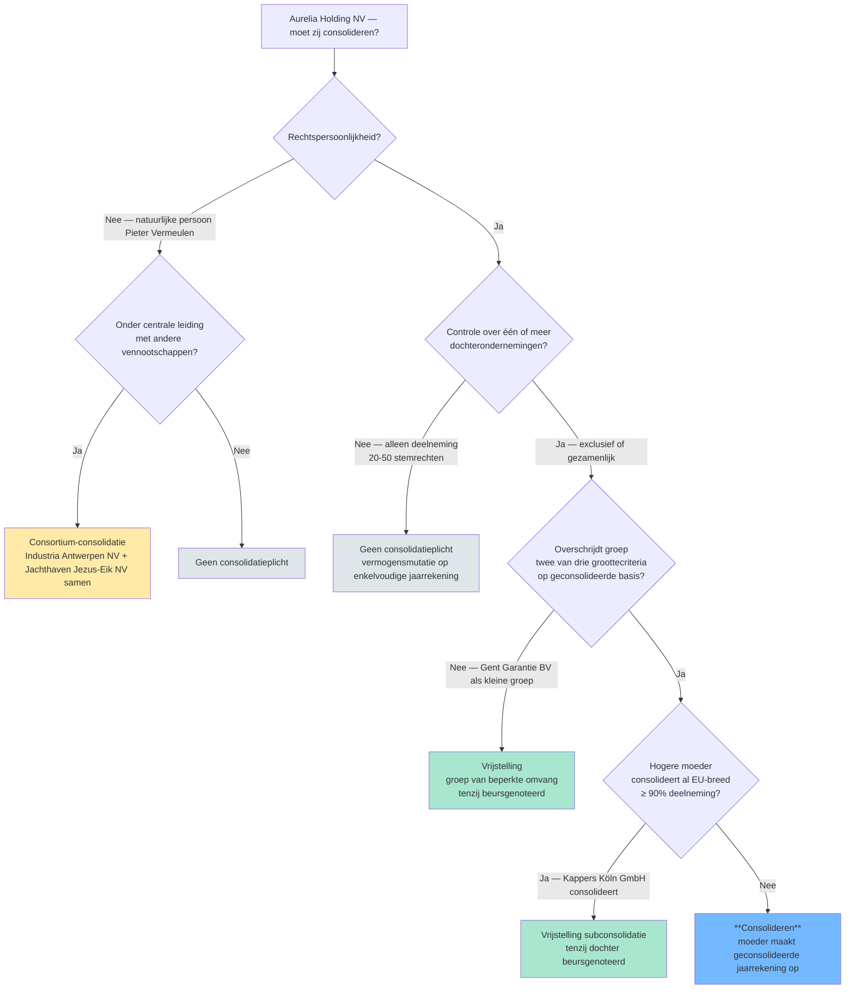
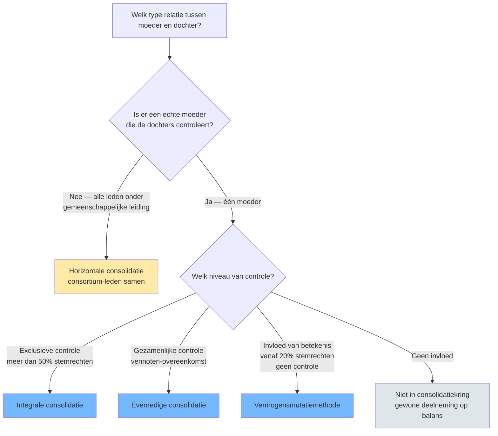

## Leesgids

Eerst de begrippen en de plicht, daarna de methodes en de techniek. Twee synthese-hoofdstukken (beslisboom en methodes-vergelijking) dienen als overzichtskaart vóór de uitvoeringscompetenties.

## Waarom dit programmaonderdeel telt

De enkelvoudige jaarrekening van een moeder verbergt de economische realiteit van een groep — schulden, omzet en winsten zitten verspreid over dochters. Pas consolidatie maakt zichtbaar wat de groep als geheel bezit, presteert en verschuldigd is. Daarom dwingt de wet een moeder die controle uitoefent om die geconsolideerde voorstelling te geven, zodat aandeelhouders, schuldeisers en werknemers op één beeld kunnen steunen.

## Wat is consolideren? Waarom een geconsolideerde jaarrekening?

Consolideren is: de groep voorstellen alsof het één vennootschap was. Dat vraagt drie bouwstenen — een moeder, één of meer dochters die ze controleert, en een afgebakende kring waarbinnen je hun cijfers samenvoegt.

## Moet ik consolideren? — Beslisboom

Voor je in de begrippen duikt: hier is de kaart van het hele eerste deel — de vijf parallelle toetsen die samen bepalen of de plicht ontstaat.

**Kerninzichten**:
- Geen enkele moeder is automatisch consolidatieplichtig — er zijn altijd vijf parallelle toetsen die elk een 'nee' kunnen geven. Een examenvraag die zegt 'moeder X heeft controle over dochter Y, dus moet zij consolideren' kapt de redenering te vroeg af.
- Een natuurlijke persoon kan nooit moeder zijn (geen rechtspersoonlijkheid), maar haar gecontroleerde vennootschappen kunnen samen wel een consortium vormen. De plicht verschuift dan van één entiteit naar 'de leden samen'.
- De groottecriteria zijn 'op geconsolideerde basis' — je moet dus een fictieve geconsolideerde balans opbouwen om te beslissen of je een echte moet maken. Dat is geen circulariteit maar een toetscriterium.
- Beursnotering breekt zowel de 'groep van beperkte omvang'-vrijstelling als de subconsolidatie-vrijstelling. Voor genoteerde vennootschappen geldt: altijd consolideren, drempels of hogere moeder doen er niet toe.

[[consolidatieplicht-beslisboom|→ Volledige synthese-fiche]]

## Het fundamentele begrippenkader: controle en de actoren in een groep

Controle is het scharnierbegrip: het bepaalt wie moeder is, welke entiteiten in de kring komen en welke methode geldt. De actoren hieronder zijn varianten op die ene as.

- [[controle|Controle]] · `begrip`
- [[moedervennootschap|Moedervennootschap]] · `actor`
- [[dochteronderneming|Dochteronderneming]] · `actor`
- [[exclusieve-controle|Exclusieve controle]] · `begrip`
- [[gezamenlijke-controle|Gezamenlijke controle]] · `begrip`
- [[invloed-van-betekenis|Invloed van betekenis]] · `begrip`
- [[geassocieerde-onderneming|Geassocieerde onderneming]] · `actor`
- [[gemeenschappelijke-dochteronderneming|Gemeenschappelijke dochteronderneming]] · `actor`
- [[consortium|Consortium (horizontale groep)]] · `actor`

## Bepalen of een vennootschap een geconsolideerde jaarrekening moet opstellen

De plicht volgt niet uit één enkel feit maar uit een keten van toetsen — kwalificatie als vennootschap, controle, en de vrijstellingen die de wet daarop legt.

[[competenties/bepalen-consolidatieverplichting|→ Volledige procedure]]

## Afbakenen van de consolidatiekring en beoordelen van uitsluitings- of weglatingsgronden

Standaard horen alle gecontroleerde dochters in de kring; uitsluitings- of weglatingsgronden zijn uitzonderingen die je expliciet moet motiveren.

[[competenties/afbakenen-consolidatiekring|→ Volledige procedure]]

## Kwalificeren van de relatie met een deelneming (controle, gezamenlijke controle of invloed van betekenis)

De kwalificatie van de relatie beslist alles wat volgt: ze kiest de methode én bepaalt of je überhaupt in de kring valt.

[[competenties/kwalificeren-relatie-deelneming|→ Volledige procedure]]

## Berekenen van controle- en belangenpercentage in een ketenstructuur

Twee percentages, twee logica's: controle wordt niet vermenigvuldigd in een keten, belang wel. Verwar je beide, dan kantelt de hele kwalificatie.

[[competenties/berekenen-controle-en-belangenpercentage|→ Volledige procedure]]

## De drie consolidatiemethoden: integrale, evenredige en vermogensmutatie

Elke methode hoort bij één type relatie. De vierde — horizontale consolidatie — is geen aparte techniek maar de toepassing van integrale consolidatie op een consortium zonder moeder.

- [[integrale-consolidatie|Integrale consolidatie]] · `methode`
- [[evenredige-consolidatie|Evenredige consolidatie (proportionele consolidatie)]] · `methode`
- [[vermogensmutatiemethode|Vermogensmutatiemethode (equity method)]] · `methode`
- [[horizontale-consolidatie|Horizontale consolidatie]] · `procedure`

## De vier consolidatiemethodes vergeleken

Nu de methodes elk apart zijn behandeld, vouwen we ze samen in één keuze-algoritme — als opstap naar de competentie die hierna komt.

**Kerninzichten**:
- Controle (in rechte of feite) bepaalt eerst of er een groep is. Pas daarna kies je de methode op basis van controle-niveau.
- Het ENIGE verschil tussen integrale en evenredige consolidatie is of je activa/passiva volledig opneemt (en het derden-deel apart presenteert) of pro-rata (zonder afzonderlijke derden-post).
- Horizontale consolidatie is de buitenbeentje: er is geen moeder, er zijn alleen consortium-leden die door een gemeenschappelijke leiding samen opereren. Een natuurlijke persoon (bv. Pieter Vermeulen) kan die leiding zijn.

[[consolidatiemethodes-vergelijking|→ Volledige synthese-fiche]]

## Kiezen van de toe te passen consolidatietechniek per entiteit

De kwalificatie is gegeven; deze competentie zet ze om in de juiste techniek per entiteit, met aandacht voor de enige beoordelingsruimte: nauwe integratie van een gemeenschappelijke dochter.

[[competenties/kiezen-consolidatiemethode|→ Volledige procedure]]

## Toepassen van uniforme waarderingsregels en hercorrigeren van enkelvoudige cijfers

Voor je optelt, moet je optelbaar maken: dochters met afwijkende waarderingsregels worden hercorrigeerd zodat de geconsolideerde cijfers één consistent geheel vormen.

[[competenties/toepassen-uniforme-waarderingsregels|→ Volledige procedure]]

## Uitvoeren van de eerste consolidatie van een nieuw verworven dochter of geassocieerde onderneming

De eerste consolidatie is het moment waarop de aankoopprijs wordt afgezet tegen het pro-rata eigen vermogen — wat overblijft is het consolidatieverschil, dat je nog moet toerekenen of activeren.

[[competenties/uitvoeren-eerste-consolidatie|→ Volledige procedure]]

## Uitvoeren van intragroep-eliminaties en berekenen van het aandeel van derden

Onderlinge transacties tussen groepsleden zouden de groep laten verdienen aan zichzelf — die schrap je weg. Het aandeel van derden zondert af wat juridisch niet aan de moeder toebehoort, ook al staat het integraal op de balans.

[[competenties/uitvoeren-intragroep-eliminaties|→ Volledige procedure]]

## Verwerken van een wijziging in de consolidatiekring (inclusief step acquisition)

Een kring is geen statisch gegeven: aankopen, verkopen en kantelpunten tussen methodes vragen elk een eigen verwerking, waarbij vooral de overgang tussen technieken een doctrinair kantelmoment is.

[[competenties/verwerken-wijziging-consolidatiekring|→ Volledige procedure]]

## Publicatie en rapportering: jaarrekening en jaarverslag

De geconsolideerde jaarrekening en het geconsolideerd jaarverslag horen onlosmakelijk samen: cijfers en narratief vullen elkaar aan en worden samen gecontroleerd en gepubliceerd.

- [[geconsolideerde-jaarrekening|Geconsolideerde jaarrekening]] · `begrip`
- [[geconsolideerd-jaarverslag|Geconsolideerd jaarverslag]] · `begrip`

## IFRS-context: het internationale consolidatieraamwerk

Voor groepen die onder IFRS rapporteren ligt het raamwerk verspreid over vier standaarden die samen het Belgische KB WVV-systeem spiegelen, met een eigen accent op het controle-begrip.

- [[ifrs-consolidatieraamwerk|IFRS-consolidatieraamwerk (IFRS 3 / IFRS 10 / IFRS 11 / IFRS 12)]] · `begrip`

## Synthese-stappenplan

Begin met de plichtsvraag: is er een moeder met controle, en als ja, geldt er een vrijstelling? Bij plicht: baken de kring af en kwalificeer elke deelneming (controle, gezamenlijke controle of invloed van betekenis). Koppel aan elke kwalificatie de juiste methode. Hercorrigeer enkelvoudige cijfers naar uniforme waarderingsregels. Voer dan de technische stappen uit: eerste consolidatie met toerekening van het consolidatieverschil, intragroep-eliminaties en berekening van het aandeel van derden. Verwerk tot slot kringwijzigingen en publiceer jaarrekening én jaarverslag samen.

## Cheatsheet

### Kritische drempelwaarden

| Concept | Naam | Waarde | Eenheid | Gevolg |
|---|---|---|---|---|
| [[exclusieve-controle]] | Onweerlegbaar vermoeden van controle in rechte | > 50 % | stemrechten | Onweerlegbaar vermoeden van exclusieve controle → moeder → integrale consolidatie van de dochter |
| [[geassocieerde-onderneming]] | Weerlegbaar vermoeden invloed van betekenis (= geassocieerde onderneming) | ≥ 20 % | stemrechten | Vermoeden dat de moeder invloed van betekenis heeft op het beleid → kwalificatie als geassocieerde onderneming → opname… |
| [[geassocieerde-onderneming]] | Bovengrens (overgang naar dochter) | > 50 % stemrechten of andere titel van controle | stemrechten | Vanaf controle (in rechte of in feite) is de onderneming geen geassocieerde meer maar een dochter → integrale consolidat… |
| [[geconsolideerde-jaarrekening]] | Maximale afwijking afsluitingsdatum dochter ↔ geconsolideerde jaarrekening | 3 | maanden | KB WVV art. 3:110, tweede lid: als het uiterst moeilijk is om bezittingen, schulden, rechten, verplichtingen, opbrengste… |
| [[groep-van-beperkte-omvang]] | Drempels groep van beperkte omvang (KB WVV art. 1:26 — geaggregeerde basis +20 %) | Maximaal 1 van 3 drempels overschreden | criteria | Wordt aan deze test voldaan, dan is de moeder vrijgesteld van het opstellen van een geconsolideerde jaarrekening en een… |
| [[groottecriteria-consolidatie]] | Kleine vennootschap (WVV art. 1:24) — referentie | jaaromzet ≤ 11.250.000 EUR; balanstotaal ≤ 6.000.000 EUR; jaargemiddelde werknemers ≤ 50 | criteria-set | Hoogstens één drempel overschreden → kleine vennootschap (verkorte schema's mogelijk) |
| [[groottecriteria-consolidatie]] | Vereenvoudigde berekening op geaggregeerde basis (WVV art. 1:24, § 6) | drempels balanstotaal en omzet vermeerderd met 20 % | %-toeslag | Een moeder die niet wettelijk verplicht is om te consolideren, mag voor de groottetoets alle bedragen van haar verbonden… |
| [[invloed-van-betekenis]] | Weerlegbaar vermoeden van invloed van betekenis | ≥ 20 % | deelnemingspercentage in stemrechten | Weerlegbaar vermoeden van invloed van betekenis → kwalificatie als geassocieerde onderneming → vermogensmutatiemethode i… |
| [[invloed-van-betekenis]] | Bovengrens (overgang naar controle) | > 50 % stemrechten of controle in feite | stemrechten | Boven 50 % stemrechten of bij vastgestelde controle in feite kantelt 'invloed van betekenis' naar 'exclusieve controle' |

### Vergelijkingsparen-matrix

| Concept | Verwarrend met | Trigger |
|---|---|---|
| [[belangenpercentage]] | [[controlepercentage]] | Examen: vraag eerst 'wat moet ik berekenen?' — winstaandeel of aandeel van derden → belangenpercentage; consolidatieverplichting of -methode → controlepercentage. |
| [[controle]] | [[invloed-van-betekenis]] | Bij percentages 20–50 %: standaard vermogensmutatie (invloed van betekenis). Bij overeenkomst voor gezamenlijke uitoefening van beleid: gezamenlijke controle. |
| [[controle]] | [[controlepercentage]] | Wanneer een opgave een percentage geeft: vraag eerst of het over stemrechten (controle) of over kapitaal (belang) gaat. |
| [[dochteronderneming]] | [[geassocieerde-onderneming]] | Stel de controlevraag: heeft de moeder beslissende invloed (eventueel samen met enkele anderen)? Zo ja: dochter. Zo nee maar wel betekenisvolle invloed (typisch 20-50 %): geassocieerde. |
| [[evenredige-consolidatie]] | [[integrale-consolidatie]] | Soort controle bepaalt de methode: exclusieve controle → integraal; gezamenlijke controle → evenredig (of vermogensmutatie als niet-geïntegreerd). |
| [[evenredige-consolidatie]] | [[vermogensmutatiemethode]] | Mate van integratie van de gemeenschappelijke dochter in de groep — nauw geïntegreerd → evenredig; los → vermogensmutatie. |
| [[exclusieve-controle]] | [[gezamenlijke-controle]] | Cruciale vraag in elke opgave: is er een overeenkomst dat beleidsbeslissingen alleen samen mogen worden genomen? Zo ja: gezamenlijke controle; anders: exclusieve controle of geen controle. |
| [[horizontale-consolidatie]] | [[integrale-consolidatie]] | Het type relatie (verticaal vs. horizontaal) bepaalt of je het integrale-consolidatie-recept op een moeder + haar dochters toepast (verticaal) of op een set zelfstandige consortium-leden onder gemeenschappelijke leiding (horizontaal). |
| [[integrale-consolidatie]] | [[evenredige-consolidatie]] | Soort controle / type relatie tussen moeder en dochter bepaalt welke methode. |
| [[integrale-consolidatie]] | [[vermogensmutatiemethode]] | Soort controle / type relatie tussen moeder en dochter bepaalt welke methode. |
| [[vermogensmutatiemethode]] | [[integrale-consolidatie]] | Soort relatie: controle → integraal; invloed van betekenis (of uitgesloten dochters / niet-geïntegreerde gemeenschappelijke dochters) → vermogensmutatie. |
| [[vermogensmutatiemethode]] | [[evenredige-consolidatie]] | Mate van integratie van de gemeenschappelijke dochter: nauw geïntegreerd → evenredig; los → vermogensmutatie. |
| [[vrijstelling-subconsolidatie]] | [[groottecriteria-consolidatie]] | Examen-keuze-vraag: 'Welke vrijstelling beroept Aurelia zich op?' → toets eerst structuur (is er een top-moeder die al consolideert? → subconsolidatie), daarna omvang (zit de groep onder de drempels? → beperkte omvang). |

## Examenfocus

Twee denkpatronen keren terug. Eén: nooit op één feit beslissen — de plicht en de methode volgen uit een keten van toetsen, en wie te vroeg stopt verliest punten. Twee: het verschil tussen controle en belang scherp houden, want het ene stuurt de methode en het andere de verdeling tussen groep en derden.

> [!question]- 2013-1-vr3 (3.0 pt)
> Vraag 3 … / 3 punten
> Een onderneming, die een geconsolideerde jaarrekening moet opstellen, vraagt U onder
> welke post in de geconsolideerde resultatenrekening het gedeelte van het resultaat van de
> volledig geconsolideerde dochterondernemingen dat kan worden toegerekend aan aandelen
> die worden gehouden door andere personen dan de consoliderende vennootschap of de in
> de consolidatie opgenomen dochterondernemingen moet worden vermeld.
> Antwoord
>
> _Thema's: consolidatie_

> [!question]- 2013-1-vr4 (3.0 pt)
> Vraag 4 … / 3 punten
> De geconsolideerde jaarrekening wordt in principe op dezelfde datum afgesloten als de
> jaarrekening van de consoliderende vennootschap. In bepaalde gevallen kan men hiervan
> afwijken. Hoeveel bedraagt de maximale afwijking qua afsluitingsdatum ?
> Antwoord
>
> _Thema's: consolidatie_

> [!question]- 2014-1-vr3 (3.0 pt)
> Vraag 3 … / 3 punten
> De geconsolideerde jaarrekening wordt in principe op dezelfde datum afgesloten als de
> jaarrekening van de consoliderende vennootschap. In bepaalde gevallen kan men hiervan
> afwijken.
> Hoeveel bedraagt de maximale afwijking qua afsluitingsdatum ?
> Antwoord
>
> _Thema's: consolidatie_

> [!question]- 2014-1-vr4 (9.0 pt)
> Vraag 4 … / 9 punten
> Vul onderstaande tabel aan op basis van volgende gegevens.
> M
> 70 % 30 %
> 60 % 20 %
> A B C
> Antwoord
> CONTROLEPERCENTAGE BELANGENPERCENTAGE CONSOLIDATIEMETHODE
> M IN A
> M IN B
> M IN C
>
> _Thema's: consolidatie_

> [!question]- 2015-1-vr4 (6.0 pt)
> Vraag 4 … / 6 punten
> a) Wat is een positief consolidatieverschil ?
> Antwoord … / 2 punten
> b) Geef de vier voornaamste oorzaken van positieve consolidatieverschillen ?
> Antwoord … / 4 punten
>
> _Thema's: consolidatie_

## Competentie-index

- [[competenties/afbakenen-consolidatiekring|Afbakenen van de consolidatiekring en beoordelen van uitsluitings- of weglatingsgronden]]
- [[competenties/bepalen-consolidatieverplichting|Bepalen of een vennootschap een geconsolideerde jaarrekening moet opstellen]]
- [[competenties/berekenen-controle-en-belangenpercentage|Berekenen van controle- en belangenpercentage in een ketenstructuur]]
- [[competenties/kiezen-consolidatiemethode|Kiezen van de toe te passen consolidatietechniek per entiteit]]
- [[competenties/kwalificeren-relatie-deelneming|Kwalificeren van de relatie met een deelneming (controle, gezamenlijke controle of invloed van betekenis)]]
- [[competenties/toepassen-uniforme-waarderingsregels|Toepassen van uniforme waarderingsregels en hercorrigeren van enkelvoudige cijfers]]
- [[competenties/uitvoeren-eerste-consolidatie|Uitvoeren van de eerste consolidatie van een nieuw verworven dochter of geassocieerde onderneming]]
- [[competenties/uitvoeren-intragroep-eliminaties|Uitvoeren van intragroep-eliminaties en berekenen van het aandeel van derden]]
- [[competenties/verwerken-wijziging-consolidatiekring|Verwerken van een wijziging in de consolidatiekring (inclusief step acquisition)]]

## Concept-index

- [[minderheidsbelangen|Belangen van derden / Aandeel van derden in het resultaat (minderheidsbelangen)]] · `fenomeen`
- [[belangenpercentage|Belangenpercentage]] · `begrip`
- [[consolidatiekring|Consolidatiekring]] · `begrip`
- [[consolidatieverplichting|Consolidatieverplichting]] · `regel`
- [[consolidatieverschil|Consolidatieverschil]] · `fenomeen`
- [[consortium|Consortium (horizontale groep)]] · `actor`
- [[controle|Controle]] · `begrip`
- [[controlepercentage|Controlepercentage]] · `begrip`
- [[consolidatiemethodes-vergelijking|De vier consolidatiemethodes vergeleken]] · `synthese`
- [[dochteronderneming|Dochteronderneming]] · `actor`
- [[eerste-consolidatie|Eerste consolidatie]] · `fenomeen`
- [[evenredige-consolidatie|Evenredige consolidatie (proportionele consolidatie)]] · `methode`
- [[exclusieve-controle|Exclusieve controle]] · `begrip`
- [[geassocieerde-onderneming|Geassocieerde onderneming]] · `actor`
- [[geconsolideerd-jaarverslag|Geconsolideerd jaarverslag]] · `begrip`
- [[geconsolideerde-jaarrekening|Geconsolideerde jaarrekening]] · `begrip`
- [[gemeenschappelijke-dochteronderneming|Gemeenschappelijke dochteronderneming]] · `actor`
- [[gezamenlijke-controle|Gezamenlijke controle]] · `begrip`
- [[groep-van-beperkte-omvang|Groep van beperkte omvang]] · `begrip`
- [[groottecriteria-consolidatie|Groottecriteria voor de consolidatievrijstelling]] · `drempel`
- [[horizontale-consolidatie|Horizontale consolidatie]] · `procedure`
- [[ifrs-consolidatieraamwerk|IFRS-consolidatieraamwerk (IFRS 3 / IFRS 10 / IFRS 11 / IFRS 12)]] · `begrip`
- [[integrale-consolidatie|Integrale consolidatie]] · `methode`
- [[intragroep-eliminaties|Intragroep-eliminaties]] · `procedure`
- [[invloed-van-betekenis|Invloed van betekenis]] · `begrip`
- [[moedervennootschap|Moedervennootschap]] · `actor`
- [[consolidatieplicht-beslisboom|Moet ik consolideren? — Beslisboom]] · `synthese`
- [[step-acquisition|Step acquisition (trapsgewijze verwerving)]] · `fenomeen`
- [[uniforme-waarderingsregels-consolidatie|Uniforme waarderingsregels in de consolidatie]] · `regel`
- [[vermogensmutatiemethode|Vermogensmutatiemethode (equity method)]] · `methode`
- [[vrijstelling-subconsolidatie|Vrijstelling van subconsolidatie]] · `regel`
- [[wijziging-consolidatiekring|Wijziging van de consolidatiekring]] · `fenomeen`

