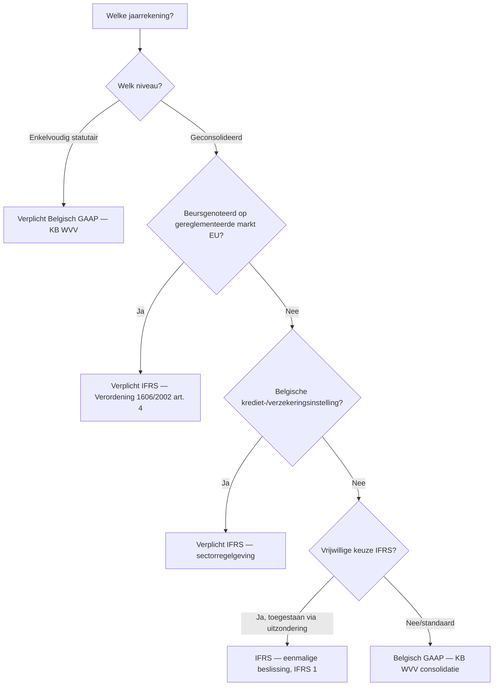

## Wat verwacht het examen van jou?

> [!abstract] Dit programmaonderdeel wordt getoetst op niveau *integratie*.
> Je moet meerdere concepten samen kunnen inzetten in complexe casussen — onderdelen herkennen, prioriteren, en tot een coherent oordeel komen.

**Taken** (uit het ITAA-examenprogramma):

> [!abstract]- **Taak 1** — Opstellen van de individuele en geconsolideerde jaarrekening
>
> **Subtaken**:
> - Herstructureren van de balans en de resultatenrekening
> - Identificeren en interpreteren van de balansaggregaten
> - Berekenen van de elementen die nodig zijn voor een interpretatie van de kasstromen en die interpreteren
> - Berekenen van de ratio's en ze interpreteren
> - Contextualiseren van de interpretaties naargelang van het bedrijfsdomein en de nationale en internationale context
>
> **Doelstellingen**:
> - Een beginsel van boekhoudrecht of een wettelijke bepaling uit Belgische of Europese bron opzoeken, grondig analyseren en toepassen, met inachtneming van internationale normen.
> - Verifiëren en waarborgen van de conformiteit van de boekhouding en de documenten met de wettelijke en reglementaire vereisten.

## Leesgids

Deze cursus loopt van het EU-kader naar de individuele IFRS-standaarden naar de overgangsmechanismen. Begin bij de twee referentiestelsels (BE-GAAP versus IFRS) en de vraag *wie* IFRS moet of mag toepassen — pas daarna heeft het zin om in de standaarden zelf te duiken. Per onderwerp (IAS 1, IAS 16, IAS 36, IFRS 15, IAS 2, IFRS 16) krijg je eerst een thematisch overzicht en daarna de bijhorende competentie om de regels op een dossier toe te passen.

De laatste sectie ("Synthese-stappenplan") bundelt het hele proces tot één werkschema voor een groep die overstapt. De cheatsheet onderaan dient als snelreferentie tijdens laatste herhaling — drempelwaarden, verwarrende paren met BE-GAAP, en de matrix van conceptuele tegenstellingen.

## Waarom dit programmaonderdeel telt

Het Belgisch boekhoudrecht en IFRS staan naast elkaar — niet door elkaar. Voor de stagiair betekent dit dat hij voor elke jaarrekening twee vragen tegelijk moet beantwoorden: *welk* stelsel geldt hier (wettelijk verplicht of vrijwillig?), en *hoe* werkt dat stelsel op het concrete dossier? Een groep met een beursgenoteerde dochter heeft géén keuze voor zijn geconsolideerde jaarrekening; een KMO heeft géén keuze om enkelvoudig IFRS te gebruiken. Bij twijfel beslist niet het oordeel van de accountant maar de Verordening [[verplichte-ifrs-eu-beursgenoteerden|1606/2002]] of de Belgische uitzonderings-mogelijkheden ([[ifrs-toepassingsgebied-belgie]]). Daaronder ligt een tweede laag: *waar* is een verschil tussen BE-GAAP en IFRS materieel — en *waarom* (zie de synthese hieronder).

## Waarom IFRS naast Belgisch GAAP? Twee referentiestelsels, één economische realiteit

Eén onderneming kan onder twee stelsels een wezenlijk andere jaarrekening krijgen — niet door rekenfouten, maar door fundamenteel andere uitgangspunten. BE-GAAP is rule-based en juridisch-fiscaal georiënteerd: vaste schema's, voorzichtigheidsbeginsel, weinig ruimte voor reële waarde. IFRS is principle-based en gericht op investeerders die vergelijkbare cijfers willen zien over EU-grenzen heen: meer professional judgment, ruimere herwaardering, strengere voorwaarden voor activering.

Voor jou betekent dit een dubbele leesvaardigheid. Je moet bij elke jaarrekening eerst weten *onder welk stelsel* je naar de cijfers kijkt — anders interpreteer je een herwaarderingsmeerwaarde, een impairment of een leaseverplichting verkeerd. Wie de twee stelsels naast elkaar leert lezen, ziet ook sneller waar de échte beslissingsmomenten zitten en kan een groep helpen die tussen beide moet schakelen.

## Het Europese kader: richtlijn 2013/34/EU en verordening 1606/2002

> [!info] Hoort bij taak: Opstellen van de individuele en geconsolideerde jaarrekening

Het EU-kader bestaat uit twee instrumenten met andere reikwijdte, en ze worden vaak verward op het examen. De richtlijn harmoniseert de *minimuminhoud* van nationale jaarrekeningen — Belgisch geïmplementeerd via het KB WVV (zie [[eu-harmonisatie-jaarrekeningenrecht]]). De verordening verplicht *IFRS* voor geconsolideerde rekeningen van EU-beursgenoteerden ([[verplichte-ifrs-eu-beursgenoteerden]]) en regelt de [[endorsement-procedure-eu|endorsement-procedure]] waarmee IASB-standaarden door EFRAG en de Europese Commissie in EU-recht omgezet worden. Onthoud het verschil: richtlijn = nationale jaarrekening, verordening = direct toepasbare IFRS voor beursgenoteerden.

- [[richtlijn-2013-34-eu]] — record niet gevonden
- [[ifrs-verordening-1606-2002]] — record niet gevonden
- [[ifrs-toepassingsgebied-belgie|IFRS-toepassingsgebied in België — wie moet en wie mag?]] · `regel`

## Belgisch GAAP versus IFRS — overzicht van hoofdverschillen

Tijd om de twee stelsels naast elkaar te leggen. De tabel hieronder vergelijkt op twaalf assen waar BE-GAAP en IFRS materieel verschillen — van het algemene kader tot specifieke posten zoals leasing, opbrengsten en voorzieningen. De beslisboom daaronder beantwoordt de openingsvraag van elk dossier: *"welke jaarrekening moet ik hier maken?"*

Lees de tabel verticaal per onderwerp en horizontaal per stelsel. Probeer telkens vóór je naar de "belangrijkste gevolg"-kolom kijkt zelf het effect op de balans of de resultatenrekening te voorspellen — dat is de oefening die je op het examen ook moet maken. Onder de tabel staan de kerninzichten die de stagiair-bril aanreiken: drie thematische clusters waaronder elk verschil valt te ordenen.

| Aspect                          | Belgisch GAAP (KB WVV)                                              | IFRS                                                                                       | Belangrijkste gevolg                                                                                       |
|--------------------------------|---------------------------------------------------------------------|--------------------------------------------------------------------------------------------|------------------------------------------------------------------------------------------------------------|
| **Algemeen kader**             | Rule-based, vast schema, juridisch-fiscaal georiënteerd             | Principle-based, flexibele presentatie, investeerders-georiënteerd                          | IFRS vereist meer professional judgment, BE-GAAP meer schemavolgen                                          |
| **Componenten jaarrekening**   | Balans + W&V + toelichting (3); voor groot schema: kasstroom + bestuursverslag | 5 verplichte componenten: balans + totaalresultaat + mutaties EV + kasstroom + toelichting | IFRS verplicht mutatieoverzicht EV en kasstroom voor iedereen                                              |
| **Materiële vaste activa**     | Kostprijsmodel; herwaardering uitzonderlijk + voor financiële + materiële vaste activa | Kostprijs- of herwaarderingsmodel (keuze per categorie) — IAS 16                            | IFRS staat structurele herwaardering tegen reële waarde toe; BE-GAAP veel terughoudender                    |
| **Onderzoekskosten**           | Activering mogelijk (KB WVV art. 3:31)                              | Verbod op activering — moet als kost (IAS 38 alinea 54)                                     | Eerste IFRS-toepassing: schrappen geactiveerde onderzoekskosten, ingehouden winsten −                       |
| **Ontwikkelingskosten**        | Activering mogelijk onder strikte voorwaarden                       | Activering verplicht bij 6 cumulatieve criteria (IAS 38 alinea 57)                          | IFRS strikter inhoudelijk maar dwingender in toepassing                                                     |
| **Goodwill**                   | Afschrijving over vermoedelijke gebruiksduur (KB WVV art. 3:131)    | GEEN afschrijving — jaarlijkse impairment-test (IAS 36 / IFRS 3)                            | IFRS-resultaat schommelt meer (impairment-shock vs. gladde afschrijving)                                    |
| **Leasing — lessee**           | Operationele lease off-balance; financiële lease op balans          | ALLE leases on-balance: gebruiksrecht-actief + leaseverplichting (IFRS 16)                  | IFRS toont meer activa én meer schulden; ratio's debt/equity stijgen                                       |
| **Opbrengsten**                | 'Aangenomen wanneer winsten gerealiseerd zijn op balansdatum' — KB WVV art. 3:18 | 5-stappen-model (IFRS 15) — vergoeding ↔ prestatieverplichtingen                            | IFRS analyseert contract diepgaander; soms andere tijdsbepaling van opbrengst                              |
| **Voorraden**                  | LIFO, FIFO of gewogen gemiddelde toegelaten                          | LIFO **verboden**; alleen FIFO of gewogen gemiddelde (IAS 2 alinea 25)                      | IFRS-overgang dwingt LIFO-gebruikers tot herrekening                                                       |
| **Voorzieningen**              | Voor 'voorzienbare risico's' — soms ruim ingeschat                  | Strikte 3 criteria: huidige verplichting + waarschijnlijke uitstroom + betrouwbaar schatbaar (IAS 37) | IFRS staat minder 'reserve-vorming' toe — voorzieningen die niet aan criteria voldoen, worden teruggenomen |
| **Reële waarde**               | Beperkt — sommige financiële instrumenten                            | Centraal kader (IFRS 13) — uitgebreid gebruik bij financiële activa, vastgoedbeleggingen, biologische activa | IFRS-resultaat volatieler; meer hierarchie 1/2/3 toelichtingen                                              |
| **Uitgestelde belastingen**    | Toelichting vermeld; opname terughoudend                            | Volledige opname verplicht (IAS 12) — verschillen tussen boekwaarde en fiscale waarde      | IFRS-balans heeft meer uitgestelde belastingactiva/passiva zichtbaar                                       |

**Kerninzichten**:

- **Twee filosofieën**: BE-GAAP is rule-based en juridisch-fiscaal georiënteerd (vaste schema's, voorzichtigheidsbeginsel); IFRS is principle-based en investeerders-georiënteerd (reële waarde, professional judgment). — _waarom_: De stagiair kan twee jaarrekeningen van dezelfde onderneming verschillend zien uitvallen onder beide stelsels — niet door fout maar door fundamenteel ander uitgangspunt.
- **Belgisch verplicht IFRS-toepassingsgebied is smal**: enkel geconsolideerde jaarrekeningen van EU-beursgenoteerden + financiële sector. Enkelvoudige jaarrekeningen blijven altijd BE-GAAP. Vrijwillige IFRS-toepassing is in België uitzonderlijk (CBN 2016/19 voor consortia, ...). — _waarom_: Examen-valstrik: 'mag een grote NV IFRS toepassen?' — Voor enkelvoudige rekening: nee. Voor geconsolideerde rekening: alleen bij wettelijke verplichting of beperkte optie.
- **Drie thematische clusters van verschil** vanuit examenperspectief: (a) **balansomvang**: IFRS toont meer activa én meer schulden (leasing, uitgestelde belastingen, herwaardering); (b) **resultaatdynamiek**: IFRS-resultaat is volatieler (impairment-shocks, reële waarde) terwijl BE-GAAP gladder verloopt (afschrijving goodwill, voorzichtige voorzieningen); (c) **opnamecriteria**: IFRS strikter voor activering (geen onderzoekskosten, strikte voorzieningen) maar dwingender voor andere posten (ontwikkelingskosten activering verplicht bij 6 criteria, alle leases on-balance). — _waarom_: Stagiair leert hoofdverschillen groeperen i.p.v. memoriseren van losse artikels. Bij een examen-casus 'noem 3 verschillen tussen BE-GAAP en IFRS' kiest hij telkens uit één cluster om coverage te tonen.
- **Overgang BE-GAAP ↔ IFRS** is geen mechanische cijferconversie maar een procedureel project: IFRS 1 voor BE-GAAP → IFRS (5 stappen, retroactief openingsbalans), CBN 2022/08 voor IFRS → BE-GAAP. Het aanpassingsverschil komt rechtstreeks in ingehouden winsten — niet in resultaat van de overgangsperiode. — _waarom_: Stagiair die in praktijk een groep helpt over te stappen, weet dat het project maanden duurt: openingsbalans, vrijstellingen-keuze, aansluitingstabellen, communicatie naar gebruikers.

_Bouwt op_: [[eu-harmonisatie-jaarrekeningenrecht]] · [[verplichte-ifrs-eu-beursgenoteerden]] · [[endorsement-procedure-eu]] · [[ifrs-toepassingsgebied-belgie]] · [[jaarrekening-componenten-ifrs]] · [[presentatiebeginselen-jaarrekening-ifrs]] · [[materiele-vaste-activa-ifrs]] · [[immateriele-vaste-activa-ifrs]] · [[leasing-ifrs]] · [[opbrengsten-ifrs]] · [[voorraden-ifrs]]
## Bepalen of een onderneming IFRS moet of mag toepassen in België

> [!info] Hoort bij taak: Opstellen van de individuele en geconsolideerde jaarrekening

Bij elke nieuwe opdracht doorloop je eerst deze beslissingsketen: enkelvoudig of geconsolideerd → beursnotering → sector → vrijwillige optie? Het antwoord bepaalt niet alleen welk stelsel je hanteert, maar ook of bepaalde regels überhaupt van toepassing zijn. Een enkelvoudige Belgische NV-jaarrekening kan nooit IFRS zijn — dat is BE-GAAP, ongeacht beursnotering van de groep.

De volledige stappenprocedure inclusief uitzonderingen voor consortia, vrijwillige IFRS-toepassing (zeldzaam), en de overgangsregels bij verlies van beursnotering vind je in de competentie. Werk dit door als eerste oefening — alle andere standaarden bouwen op deze beslissing voort.

[[competenties/bepalen-toepasselijkheid-ifrs-belgie|→ Volledige procedure]]

## IAS 1 — Presentatie van de jaarrekening: vijf componenten en presentatiebeginselen

Onder IFRS ziet de jaarrekening er fundamenteel anders uit dan onder BE-GAAP. Waar het Belgisch schema drie componenten kent (balans + W&V + toelichting, plus kasstroom en bestuursverslag voor groot schema), eist IAS 1 vijf verplichte componenten — voor *iedereen* die IFRS toepast, ongeacht omvang ([[jaarrekening-componenten-ifrs]]). Het mutatieoverzicht eigen vermogen en het kasstroomoverzicht zijn dus geen optie maar regel.

De [[presentatiebeginselen-jaarrekening-ifrs|presentatiebeginselen]] (continuïteit, accrual basis, materialiteit, consistentie, going concern) bepalen *hoe* je de cijfers presenteert. Vooral materialiteit en consistentie zijn examen-relevant: ze sturen welke toelichtingen je opneemt en wanneer je een grondslag mag wijzigen.

- [[ias-1-jaarrekening-componenten]] — record niet gevonden
- [[ias-1-presentatie-beginselen]] — record niet gevonden
- [[ias-1-balans-presentatie]] — record niet gevonden
- [[ias-1-winst-en-totaalresultaat]] — record niet gevonden
- [[ias-1-mutatieoverzicht-eigen-vermogen]] — record niet gevonden
- [[ias-1-toelichtingsvereisten]] — record niet gevonden

## Presenteren van een IFRS-jaarrekening

Bij het opstellen van een IFRS-rekening werk je de vijf componenten af in een vaste volgorde, met materialiteit als rode draad voor wat in toelichtingen komt en wat je weglaat. De volgorde is geen detail: vlottende/niet-vlottende presentatie in balans, scheiding W&V en overig totaalresultaat (OCI) in resultaat, mutaties per categorie in eigen vermogen. Een afwijkende volgorde kan rechtmatig zijn maar vereist toelichting.

De competentie zet de stappen op een rij — van rubrieken-keuze tot toelichtingsstructuur — en wijst op de plekken waar BE-GAAP-gewoontes je in de weg zitten.

[[competenties/presenteren-ifrs-jaarrekening-volgens-ias-1|→ Volledige procedure]]

## Vaste activa onder IFRS: IAS 16 en IAS 38 — kostprijs, herwaardering en componenten

> [!info] Hoort bij taak: Opstellen van de individuele en geconsolideerde jaarrekening

Materiële en immateriële vaste activa volgen onder IFRS hetzelfde basisprincipe (kostprijs- of herwaarderingsmodel, keuze per categorie van activa) maar verschillen sterk in toepassing. Bij [[materiele-vaste-activa-ifrs|materiële activa (IAS 16)]] is de componentenbenadering verplicht zodra onderdelen substantieel zijn — een vliegtuig met motor, romp en interieur krijgt drie afschrijvingsplannen, geen één. Bij [[immateriele-vaste-activa-ifrs|immateriële activa (IAS 38)]] geldt een striktere opname-test: onderzoek mag *nooit* worden geactiveerd, ontwikkeling alleen bij zes cumulatieve criteria.

Het herwaarderingsmodel is een grondslagkeuze, geen jaarlijkse beslissing — eenmaal gekozen voor een categorie, blijft het van toepassing tot de groep er expliciet vanaf wil (IAS 8). De [[afschrijvingen-ifrs|afschrijvingsregels]] tonen waar BE-GAAP en IFRS uiteenlopen, vooral rond restwaarde en gebruiksduur-herziening.

- [[materiele-vaste-activa-ifrs|Materiële vaste activa onder IFRS (IAS 16)]] · `regel`
- [[immateriele-vaste-activa-ifrs|Immateriële activa onder IFRS (IAS 38)]] · `regel`
- [[herwaarderingsmodel-ias-16]] — record niet gevonden
- [[componentenbenadering-ias-16]] — record niet gevonden
- [[afschrijvingen-ifrs|Afschrijvingen onder IFRS (IAS 16 + IAS 38)]] · `cluster`

## Waarderen van materiële vaste activa onder IAS 16 (kostprijs- of herwaarderingsmodel)

> [!info] Hoort bij taak: Opstellen van de individuele en geconsolideerde jaarrekening

De keuze tussen kostprijs- en herwaarderingsmodel maak je per *categorie* (niet per actief) en is een grondslagkeuze. Een wissel achteraf vereist retroactieve aanpassing onder IAS 8, dus de eerste keuze weegt zwaar — vooral voor vastgoedportefeuilles waar herwaardering aanzienlijke impact heeft op het eigen vermogen.

De competentie zet de afschrijvings- en herwaarderingsboekingen op een rij — inclusief de herwaarderingsreserve (in OCI, niet via resultaat), de jaarlijkse realisatie van de meerwaarde naar ingehouden winsten, en de impact op uitgestelde belastingen. Voor casussen op het examen: leer hoe een herwaardering een latere impairment beïnvloedt (eerst de reserve afbouwen, pas daarna naar W&V).

[[competenties/waarderen-materiele-vaste-activa-ifrs|→ Volledige procedure]]

## Bijzondere waardevermindering onder IAS 36: indicaties, CGU en realiseerbare waarde

Niet elk verlies aan waarde is een impairment, en niet elke impairment-test gebeurt op individueel niveau. IAS 36 vraagt een specifieke procedure: zoek indicaties (extern: marktwaarde gedaald; intern: schade, leegstand), bepaal het toetsingsniveau (individueel actief óf CGU als het actief geen eigen kasstromen genereert), en vergelijk de [[bijzondere-waardevermindering-ifrs|realiseerbare waarde]] met de boekwaarde.

Het verschil tussen impairment (verlaging) en herwaardering (verhoging) loopt via twee verschillende balansrubrieken, en dezelfde post kan in eenzelfde periode beide ondergaan. Goodwill verdient extra aandacht: de jaarlijkse impairment-test is verplicht, ongeacht indicaties — een unieke uitzondering op de "alleen bij indicatie"-regel die voor andere activa geldt.

- [[bijzondere-waardevermindering-ias-36]] — record niet gevonden

## Toetsen van een actief op bijzondere waardevermindering

Bij een impairment-toets doorloop je vier vragen in volgorde: bestaat er een indicatie (of geldt jaarlijkse toets voor goodwill/onbepaalde gebruiksduur), op welk niveau toets je (individueel actief of CGU), wat is de realiseerbare waarde (hoogste van marktwaarde minus verkoopkosten OF gebruikswaarde via DCF), en hoeveel boek je. Bij een CGU met goodwill geldt een specifieke allocatie-volgorde: eerst de goodwill afboeken, daarna de andere activa pro rata.

De competentie toont de berekening met DCF-onderbouwing, de allocatie binnen een CGU, en de boeking in BE-GAAP-vergelijkingstabel. Werk hem door op een case waar zowel goodwill als materiële activa een impairment ondergaan — dat is een klassieker op het examen.

[[competenties/toetsen-bijzondere-waardevermindering-ias-36|→ Volledige procedure]]

## Opbrengsten onder IFRS 15: het vijf-stappen-model en prestatieverplichtingen

> [!info] Hoort bij taak: Opstellen van de individuele en geconsolideerde jaarrekening

IFRS 15 heeft een fundamentele draai gemaakt in de opbrengsterkenning. Onder de oude IAS 18 (transactie-georiënteerd) keek je naar het overgaan van risico's en voordelen; onder IFRS 15 ([[opbrengsten-ifrs|contract-georiënteerd]]) analyseer je het contract als geheel.

Het vijf-stappen-model loopt zo: (1) identificeer het contract, (2) identificeer de afzonderlijke [[prestatieverplichting|prestatieverplichtingen]] daarin, (3) bepaal de vergoeding (transactieprijs), (4) alloceer die over de verplichtingen, (5) herken opbrengst telkens wanneer een verplichting vervuld is. Voor [[onderhanden-projecten-ifrs|onderhanden projecten]] (bouw, software op maat) bepaalt dit model of je opbrengst *over de tijd* (percentage of completion) of *op een tijdstip* boekt — een keuze met grote winst-impact per kwartaal.

- [[opbrengsten-ifrs|Opbrengsten onder IFRS (IFRS 15) — 5-stappen-model]] · `cluster`
- [[prestatieverplichting-ifrs-15]] — record niet gevonden
- [[onderhanden-projecten-ifrs|Onderhanden projecten in opdracht van derden — onder IFRS 15]] · `regel`

## Toepassen van het 5-stappen-model van IFRS 15 voor opbrengstenherkenning

> [!info] Hoort bij taak: Opstellen van de individuele en geconsolideerde jaarrekening

Het model lijkt mechanisch maar vergt overal oordeel — daarom is het examen-favoriet. Vooral stap 2 (welke prestaties zijn écht *distinct* of vormen samen één geheel) en stap 4 (omgaan met variabele vergoeding, kortingen, financieringscomponent) bepalen of meerdere contracten samenklappen tot één opbrengst of juist uiteenvallen.

Werk de competentie door op een casus zoals een softwarecontract met implementatie + licentie + onderhoud — dan zie je hoe de stappen elkaar in een keten beïnvloeden en hoe je de juiste keuze maakt voor *over de tijd* versus *op een tijdstip*-herkenning.

[[competenties/toepassen-vijf-stappen-model-opbrengsten-ifrs|→ Volledige procedure]]

## Voorraden onder IFRS: IAS 2 en het verbod op LIFO

> [!info] Hoort bij taak: Opstellen van de individuele en geconsolideerde jaarrekening

[[voorraden-ifrs|IAS 2]] laat alleen FIFO en gewogen gemiddelde toe — LIFO is verboden, anders dan onder BE-GAAP. Klein voorbeeld van een groot principe: IFRS prefereert methoden die de feitelijke voorraadbeweging volgen en die niet kunstmatig de winst kunnen aanpassen via boekhoudkundige keuzes.

Voor een onderneming die overstapt is dit een directe overgangsimpact: alle voorraad herrekenen op de openingsbalans onder FIFO of gewogen gemiddelde, het verschil rechtstreeks naar ingehouden winsten. Voor jaarrekening-vergelijking tussen Belgische en internationale spelers verklaart dit deels waarom voorraadwaarderingen kunnen verschillen.

- [[voorraden-ifrs|Voorraden onder IFRS (IAS 2)]] · `regel`

## ifrs-16-lessee-vs-lessor-overzicht

Onder IFRS 16 zijn lessee en lessor *asymmetrisch* behandeld — een belangrijke wijziging ten opzichte van IAS 17 waarin beide partijen dezelfde classificatie volgden. De lessee herkent vrijwel altijd een [[right-of-use-actief|gebruiksrecht-actief]] en [[leaseverplichting-ifrs|leaseverplichting]] op de balans (alleen heel korte leases of leases voor activa van lage waarde mogen off-balance blijven). De lessor maakt nog steeds onderscheid tussen operationele en financiële leasing zoals onder IAS 17 — die balans-impact is bij lessor onveranderd.

Bij het lezen van een groep-jaarrekening let je dus op beide kanten van een lease-contract: als je een leaseverplichting ziet bij lessee, moet je niet automatisch een vordering bij lessor verwachten. De economische realiteit is dezelfde, de boekhoudkundige weerspiegeling niet.

## Leasing onder IFRS 16: right-of-use-actief en leaseverplichting bij lessee

> [!info] Hoort bij taak: Opstellen van de individuele en geconsolideerde jaarrekening

Hier zit de grote breuk met BE-GAAP. Onder [[leasing-ifrs|IFRS 16]] komen *alle* leases on-balance bij de lessee, met enkele beperkte uitzonderingen. Het gebruiksrecht-actief wordt afgeschreven over de leaseperiode, de leaseverplichting wordt financieel opgebouwd via een effectieve-rente-methode — de jaarlijkse last is dus niet meer één huurkost maar een combinatie van afschrijving (vast over de looptijd) en rente (degressief, hoog in het begin).

Direct na een eerste IFRS-toepassing zien lessee-balansen er dramatisch anders uit: meer activa, meer schulden, hogere debt/equity-ratio, hogere EBITDA (huurkost verdween uit operationele kosten, rente staat onder de EBITDA-lijn). Het is een van de meest zichtbare overgangs-effecten voor analisten en banken.

- [[leasing-ifrs|Leasing onder IFRS (IFRS 16) — lessee-perspectief]] · `cluster`
- [[right-of-use-actief|Right-of-use-actief (gebruiksrecht-actief) onder IFRS 16]] · `begrip`
- [[leaseverplichting-ifrs|Leaseverplichting onder IFRS 16]] · `begrip`

## Verwerken van een leaseovereenkomst onder IFRS 16 als lessee (right-of-use + lease-verplichting)

> [!info] Hoort bij taak: Opstellen van de individuele en geconsolideerde jaarrekening

De competentie doorloopt de boekingsstappen die je in praktijk maakt: lease-betalingen contant maken aan de incrementele rentevoet van de lessee (niet de marktrente), gebruiksrecht-actief en leaseverplichting initieel meten, en jaarlijks de afschrijving (vast) + rente (degressief) splitsen. Voor lease-modificaties (verlenging, scope-uitbreiding) geldt een herwaardering van zowel actief als verplichting.

Voor [[sale-and-leaseback-ifrs|sale-and-leaseback]] geldt een extra IFRS 15-toets vooraf: als de verkoop kwalificeert als echte verkoop, splits je de transactie in twee delen; zo niet, blijft het actief op de balans van de verkoper-lessee en is de "opbrengst" een financiering.

[[competenties/verwerken-leasing-ifrs-lessee|→ Volledige procedure]]

## Correctie en wijziging van het boekhoudkundig referentiestelsel

> [!info] Hoort bij taak: Opstellen van de individuele en geconsolideerde jaarrekening

Het examen mixt graag drie soorten "wijzigingen" en de stagiair moet ze uit elkaar houden. Een [[correctie-jaarrekening-ifrs|correctie]] onder IAS 8 / CBN 2020/12 betreft fouten (typo's, foute toepassing) of grondslagwijzigingen *binnen* één stelsel — retroactief verwerken via aanpassing van openingsbalansen en vergelijkende cijfers. Een schattingswijziging (bv. herziening van afschrijvingsmethode) is iets totaal anders: prospectief, geen retroactieve aanpassing.

Een [[wijziging-boekhoudkundig-referentiestelsel|wissel van referentiestelsel]] (BE-GAAP ↔ IFRS) loopt via een aparte procedure: IFRS 1 voor de richting BE-GAAP → IFRS, CBN 2022/08 voor IFRS → BE-GAAP, beide met volledige openingsbalans-herrekening. Een examenvraag begint vaak met "Onderneming wijzigt..." — bepaal eerst *welk* type wijziging dit is voordat je een artikel kiest. De verwarringsmatrix in de cheatsheet toont de drie scenario's met hun bron-regels.

- [[correctie-jaarrekening-ifrs|Correctie van de jaarrekening — IAS 8 versus CBN 2020/12]] · `cluster`
- [[wijziging-boekhoudkundig-referentiestelsel|Wijziging van boekhoudkundig referentiestelsel naar BE GAAP (CBN 2022/08)]] · `cluster`

## Uitvoeren van de eerste toepassing van IFRS overeenkomstig IFRS 1

> [!info] Hoort bij taak: Opstellen van de individuele en geconsolideerde jaarrekening

[[ifrs-eerste-toepassing|IFRS 1]] is een eigen procedure die een groep ééns doorloopt en die volgens een vast stramien verloopt. Stel de openingsbalans op de datum van transitie samen — meestal het begin van het eerste vergelijkende boekjaar. Kies de vrijstellingen die IFRS 1 toelaat (typisch deemed cost voor materiële vaste activa, of een uitzondering op IAS 21 voor cumulatieve omrekeningsverschillen). Converteer alle BE-GAAP-poses retroactief, presenteer aansluitingstabellen voor balans (drie momenten: opening, eind vorig jaar, eind huidig jaar) én voor resultaat.

Het aanpassingsverschil komt rechtstreeks in ingehouden winsten — niet in het resultaat van de overgangsperiode. Dat is een fundamentele eigenschap: IFRS-overgang is geen winst-event, het is een herwaardering van het eigen vermogen. Communiceer deze logica vooraf aan banken en analisten, anders ontstaat verwarring.

[[competenties/uitvoeren-eerste-toepassing-ifrs|→ Volledige procedure]]

## Reflectie: IFRS als levend normenstelsel — IAS 17 → IFRS 16 en IAS 18 → IFRS 15

IFRS staat niet stil. Twee grote vervangingen in de laatste jaren tonen waarom: IAS 17 (leasing) werd in 2019 vervangen door IFRS 16, IAS 18 (opbrengsten) in 2018 door IFRS 15. Beide met een fundamenteel ander uitgangspunt, niet alleen een verfijning.

Voor jou als stagiair betekent dit twee dingen. Bij oude case-materiaal moet je altijd checken welke versie destijds geldig was — een impairment in 2017 onder IAS 17 verschilt sterk van een impairment in 2025 onder IFRS 16. Bij nieuwe casussen werk je met de huidige standaard. En verwacht dat er weer een grote wijziging komt: bijvoorbeeld de revisie van IAS 1 (presentatie) waarvan delen al van kracht zijn vanaf 2027.

## Synthese-stappenplan

Een groep helpen overstappen op IFRS verloopt in een vast stramien. (1) Test de toepasselijkheid: is IFRS *verplicht* (beursgenoteerd, financiële sector) of een *vrijwillige* keuze? (2) Stel de transitie-datum vast — meestal het begin van het vergelijkende boekjaar. (3) Identificeer alle balansposten die anders behandeld worden: leasing, voorraden (LIFO weg), goodwill, onderzoekskosten, voorzieningen. (4) Kies vrijstellingen onder IFRS 1 waar IASB dat toelaat (typisch voor materiële vaste activa-deemed cost). (5) Herrekent de openingsbalans op transitie-datum; verschillen via ingehouden winsten. (6) Stel aansluitingstabellen op die de overgang documenteren voor balans en resultaat. (7) Communiceer de impact aan gebruikers (banken, analisten) vóór de eerste IFRS-rapportering. Het project duurt typisch maanden, soms langer dan een jaar.

## Cheatsheet

### Kritische drempelwaarden

| Concept | Naam | Waarde | Eenheid | Gevolg |
|---|---|---|---|---|
| [[groottecriteria-jaarrekening]] | Drempels kleine vennootschap (na update 2024) | Personeelsbezetting ≤ 50; jaaromzet excl. BTW ≤ € 11.250.000; balanstotaal ≤ € 6.000.000 | drie criteria — max 1 mag overschreden worden | Mag verkort schema gebruiken; geen jaarverslag verplicht; geen commissaris verplicht (tenzij ze deel uitmaakt van een gr… |
| [[groottecriteria-jaarrekening]] | Drempels microvennootschap | Personeelsbezetting ≤ 10; jaaromzet excl. BTW ≤ € 900.000; balanstotaal ≤ € 450.000 | drie criteria — max 1 mag overschreden worden | Mag microschema gebruiken (kleinste schema) |
| [[jaarrekening]] | Kleine vennootschap (verkort schema toegelaten) | Maximaal 1 criterium overschreden: balanstotaal € 6.000.000, omzet € 11.250.000, gemiddeld personeel 50 VTE | WVV art. 1:24 — 1:25 | Mag jaarrekening in **verkort schema** opstellen; vrijgesteld van jaarverslag (tenzij beursgenoteerd), commissaris-vrijs… |
| [[jaarrekening]] | Micro-vennootschap (microschema toegelaten) | Maximaal 1 criterium overschreden: balanstotaal € 350.000, omzet € 700.000, gemiddeld personeel 10 VTE | WVV art. 1:25 | Mag jaarrekening in **microschema** opstellen — kortere balans, minder verplichte vermeldingen in toelichting |
| [[verplichte-ifrs-eu-beursgenoteerden]] | Trigger verplichte IFRS-toepassing | Beursnotering op gereglementeerde markt EU-lidstaat op balansdatum + EU-rechtsvorm | kwalitatief criterium | Verplichte IFRS-toepassing op geconsolideerde jaarrekening voor boekjaren beginnend op of na 1 januari 2005 |

### Vergelijkingsparen-matrix

| Concept | Verwarrend met | Trigger |
|---|---|---|
| [[balans-presentatie-ifrs]] | [[jaarrekening-schema]] | Examenvraag over balansrubrieken: KB WVV gebruikt vaste-activa-rubrieken I (oprichtingskosten) tot IV (financiële vaste activa). IAS 1 gebruikt geen 'oprichtingskosten' — die mogen onder IFRS niet geactiveerd worden. |
| [[bijzondere-waardevermindering-ifrs]] | [[herwaarderingsmeerwaarden]] | Examen: 'boekwaarde > marktwaarde' → impairment (verlaging, W&V); 'marktwaarde > boekwaarde + herwaarderingsmodel' → herwaardering (verhoging, OCI). |
| [[bijzondere-waardevermindering-ifrs]] | [[aanvullende-afschrijving-be-gaap]] | Examen: 'Onder welk regime werd deze waardevermindering geboekt?' → toets op aanwezigheid van DCF-onderbouwing en CGU-allocatie (= IFRS) versus eenvoudige verwijzing naar duurzame minderwaarde (= BE-GAAP). |
| [[correctie-jaarrekening-ifrs]] | [[wijziging-boekhoudkundig-referentiestelsel]] | Examen: 'Onderneming wijzigt afschrijvingsmethode' (lineair → degressief) — IAS 8 schattingswijziging (prospectief). 'Onderneming wijzigt waarderingsbasis vastgoed' (kostprijs → herwaardering) — IAS 8 grondslagwijziging (retroactief). 'Onderneming gaat over naar IFRS' — IFRS 1 + CBN 2022/08. |
| [[eu-harmonisatie-jaarrekeningenrecht]] | [[verplichte-ifrs-eu-beursgenoteerden]] | Examenvraag 'welke EU-norm bepaalt of IFRS verplicht is?' → Verordening 1606/2002 / `verplichte-ifrs-eu-beursgenoteerden`. 'Welke EU-norm bepaalt de minimuminhoud van de Belgische jaarrekening?' → Richtlijn 2013/34/EU (via KB WVV). |
| [[groottecriteria-jaarrekening]] | [[groottecriteria-consolidatie]] | Examen 'welk schema moet X gebruiken?' → 1:24/1:25. 'Mag groep X afzien van consolideren?' → 1:26. |
| [[immateriele-vaste-activa-ifrs]] | [[immateriele-vaste-activa]] | Examen: onderneming heeft € 2.500.000 onderzoekskosten op balans. Welk stelsel? → Als IFRS: schrappen, ingehouden winsten −€ 2.500.000. Als BE-GAAP: behouden mits voorwaarden vervuld. |
| [[jaarrekening-componenten-ifrs]] | [[samenstelling-statutaire-jaarrekening]] | Bij vraag 'Welke vorm heeft de jaarrekening van een beursgenoteerde NV?': onderscheid maken tussen enkelvoudige (BE-GAAP-schema) en geconsolideerde (IAS 1). |
| [[jaarrekening]] | [[geconsolideerde-jaarrekening]] | Examen: 'jaarrekening Aurelia Holding NV' alleen = statutair. 'jaarrekening Aurelia Holding NV + dochters' = geconsolideerd. |
| [[leasing-ifrs]] | [[leasing]] | Examen: 'Bedrijf X heeft een huurcontract voor 5 jaar' — onder BE-GAAP: huurlast jaarlijks; onder IFRS 16: ROU + leaseverplichting op balans. Materiële impact bij vergelijking. |
| [[materiele-vaste-activa-ifrs]] | [[materiele-vaste-activa]] | Bij examenvraag over machine met componenten: KB WVV → één afschrijvingsplan mogelijk; IAS 16 → afzonderlijke afschrijving per component met substantiële kostprijs. |
| [[mutatieoverzicht-eigen-vermogen-ifrs]] | [[samenstelling-statutaire-jaarrekening]] | Examen: 'Welke component bestaat WEL onder IFRS maar NIET onder BE-GAAP-jaarrekening?' → Mutatieoverzicht eigen vermogen. |
| [[onderhanden-projecten-ifrs]] | [[voorraden-ifrs]] | Examen: 'Klant-specifiek project' → IFRS 15 over periode (mits criterium b of c vervuld); 'algemene voorraad voor verkoop' → IAS 2. |
| [[public-interest-entity]] | [[groottecriteria-jaarrekening]] | Vraag 'verkort schema toegestaan?' → eerst PIE-test (zo ja: nooit verkort) → dan groottetest. |
| [[sale-and-leaseback-ifrs]] | [[leasing]] | Examen: 'Onderneming X verkoopt gebouw aan financier en least het 10 jaar terug.' Onder BE-GAAP: meerwaarde naar overlopende rekening, jaarlijks vrijgegeven. Onder IFRS 16: eerst IFRS 15-toets; bij geldige verkoop direct gedeeltelijke winst + ROU + leaseverplichting. |
| [[sale-and-leaseback-ifrs]] | [[leasing-ifrs]] | Examen: leasenemer vs verkoper-lessee onderscheid. Leasenemer-only → ROU = kostprijs (alinea 23-24). Verkoper-lessee → ROU = oude boekwaarde × verhouding behouden gebruiksrecht (alinea 100). |
| [[voorraden-ifrs]] | [[voorraden]] | Examen: 'Onderneming gebruikt LIFO voor voorraadwaardering' — onder IFRS NIET toegelaten; onder BE-GAAP wel. |
| [[wijziging-boekhoudkundig-referentiestelsel]] | [[ifrs-eerste-toepassing]] | Bij examenvraag over 'stelselwissel': eerst bepalen welke richting. Buitenlands stelsel → BE GAAP voor statutaire jaarrekening = CBN 2022/08. BE GAAP → IFRS (typisch voor geconsolideerde jaarrekening van nieuw beursgenoteerde groep) = IFRS 1. |
| [[wijziging-boekhoudkundig-referentiestelsel]] | [[continuiteitsbeginsel]] | Bij vraag over 'continuïteit': uitvragen of de bron-context over cijferreeks-continuïteit (CBN 2022/08, art. 3:3) of over going-concern-veronderstelling (art. 3:6) gaat — twee verschillende beginselen. |

## Heb je deze taken in de vingers?

Loop deze taken na vóór je verder gaat met examenfocus. Twijfel je bij een taak? Lees de aangegeven secties nog eens.

- ✓ **1.5.taak.1** — Opstellen van de individuele en geconsolideerde jaarrekening _Behandeld in §5, §6, §7, §10, §11, §14, §15, §16, §18, §19, §20, §21._

## Examenfocus

Het examen toetst hier vooral het *vermogen* om twee referentiestelsels naast elkaar te lezen — niet de details van een individuele standaard. Verwacht juist/fout-stellingen die BE-GAAP-regels naast IFRS-regels zetten: LIFO toegestaan of niet, voorzichtigheidsprincipe versus reële waarde, leasing on-balance of off-balance. Daarnaast open vragen over de wettelijke toepasselijkheid van IFRS in België — wanneer mag of moet een onderneming overstappen?

Voor elke vraag check je twee dingen vóór je antwoordt. Eerst: gaat het over enkelvoudig of geconsolideerd? Dat bepaalt het hele scenario. Tweede: onder welk regime is het cijfer berekend? Als de vraag zwijgt over BE-GAAP of IFRS, lees je kontext-aanwijzingen (beursnotering, sector, omvang) om te beslissen welk antwoord juist is. Een veelgemaakte fout is het automatisch toepassen van het stelsel dat je het beste kent — beide stelsels eisen actieve overweging.

### Wetgeving jaarrekening + IFRS 📃

> [!question]- ITAA 2024-1 vraag 7.A · juist/fout (tier A)
> Onder IAS/ IFRS zijn volgende methoden mogelijk: ( Juist/ fout)
>
> - Fifo, Lifo, gewogen gemiddelde, individueel.
> - Fifi, gewogen gemiddelde, individueel
> - Lifo, gewogen gemiddelde individueel
> - Fifo en gewogen gemiddelde

> [!question]- ITAA 2024-1 vraag 7.B · juist/fout (tier A)
> Richtlijn 2013/34/EU 26/06/2013, opname waardering volgens voorzichtigheidsprincipe. Welke stellingen juist/ fout
>
> - Winsten mogen slechts opgenomen worden voor zover zij op balansdatum gerealiseerd zijn
> - Verplichtingen die hun oorsprong hebben in het betrokken boekjaar of in de loop van een vorig boekjaar worden opgenomen, ook als die verplichting pas worden tussen balansdatum en de datum waarop de balans wordt opgesteld
> - Alle negatieve waarde correcties worden opgenomen ongeacht of het boekjaar met winst of verlies wordt afgesloten.
> - Voor bepaalde categorieën van ondernemingen wordt verplicht om bepaalde VA aan geherwaardeerde waarde op te nemen.

> [!question]- ITAA 2024-1 vraag 7.C · juist/fout (tier A)
> Stellingen mbt IAS / IFRS Juist/ fout
>
> - Degressieve afschrijvingen zijn toegestaan
> - Kosten voor voorbereiding van een terrein……?
> - Uitzonderlijke opbrengsten boeken is toegestaan
> - Afschr. MVA mag stopgezet worden wanneer reële waarde van het actief groter is dan boekwaarde

> [!question]- ITAA 2024-1 vraag 7.D · open (tier A)
> Operationele / financiële laesing, hoe behandelen?

## Competentie-index

- [[competenties/bepalen-toepasselijkheid-ifrs-belgie|Bepalen of een onderneming IFRS moet of mag toepassen in België]]
- [[competenties/presenteren-jaarrekening-ifrs|Presenteren van een IFRS-jaarrekening volgens IAS 1 (5 componenten en presentatiebeginselen)]]
- [[competenties/toepassen-vijf-stappen-model-opbrengsten-ifrs|Toepassen van het 5-stappen-model van IFRS 15 voor opbrengstenherkenning]]
- [[competenties/toetsen-bijzondere-waardevermindering-ifrs|Toetsen van een actief op bijzondere waardevermindering onder IAS 36]]
- [[competenties/uitvoeren-eerste-toepassing-ifrs|Uitvoeren van de eerste toepassing van IFRS overeenkomstig IFRS 1]]
- [[competenties/verwerken-leasing-ifrs-lessee|Verwerken van een leaseovereenkomst onder IFRS 16 als lessee (right-of-use + lease-verplichting)]]
- [[competenties/waarderen-materiele-vaste-activa-ifrs|Waarderen van materiële vaste activa onder IAS 16 (kostprijs- of herwaarderingsmodel)]]

## Concept-index

- [[afschrijvingen-ifrs|Afschrijvingen onder IFRS (IAS 16 + IAS 38)]] · `cluster`
- [[presentatiebeginselen-jaarrekening-ifrs|Algemene presentatiebeginselen IFRS-jaarrekening]] · `regel`
- [[be-gaap-vs-ifrs-overzicht|Belgisch GAAP versus IFRS — overzicht van hoofdverschillen]] · `synthese`
- [[bepalen-toepasselijkheid-ifrs-belgie|Bepalen of een onderneming IFRS moet of mag toepassen in België]] · `competentie`
- [[bijzondere-waardevermindering-ifrs|Bijzondere waardevermindering onder IFRS (IAS 36)]] · `cluster`
- [[boekhoudbeginselen-overzicht|Boekhoudbeginselen &mdash; overzicht]] · `synthese`
- [[jaarrekening-componenten-ifrs|Componenten van een IFRS-jaarrekening]] · `begrip`
- [[componentenbenadering|Componentenbenadering — afschrijving per onderdeel]] · `cluster`
- [[consolidatieverplichting|Consolidatieverplichting]] · `regel`
- [[correctie-jaarrekening-ifrs|Correctie van de jaarrekening — IAS 8 versus CBN 2020/12]] · `cluster`
- [[eu-harmonisatie-jaarrekeningenrecht|EU-harmonisatie van het jaarrekeningenrecht]] · `cluster`
- [[ifrs-eerste-toepassing|Eerste toepassing van IFRS (IFRS 1)]] · `cluster`
- [[endorsement-procedure-eu|Endorsement-procedure — EU-goedkeuring van IFRS-standaarden]] · `cluster`
- [[getrouw-beeld|Getrouw beeld]] · `regel`
- [[groottecriteria-jaarrekening|Groottecriteria (jaarrekening-context)]] · `regel`
- [[herwaarderingsmodel-ifrs|Herwaarderingsmodel onder IFRS (IAS 16)]] · `cluster`
- [[balans-presentatie-ifrs|IFRS-balanspresentatie — vlottend versus niet-vlottend]] · `regel`
- [[ifrs-toepassingsgebied-belgie|IFRS-toepassingsgebied in België — wie moet en wie mag?]] · `regel`
- [[immateriele-vaste-activa-ifrs|Immateriële activa onder IFRS (IAS 38)]] · `regel`
- [[jaarrekening|Jaarrekening (synthesedocumenten)]] · `cluster`
- [[leaseverplichting-ifrs|Leaseverplichting onder IFRS 16]] · `begrip`
- [[leasing-ifrs|Leasing onder IFRS (IFRS 16) — lessee-perspectief]] · `cluster`
- [[lessee-vs-lessor-leasing-ifrs|Lessee versus lessor onder IFRS 16 — overzicht en asymmetrie]] · `synthese`
- [[materiele-vaste-activa-ifrs|Materiële vaste activa onder IFRS (IAS 16)]] · `regel`
- [[mutatieoverzicht-eigen-vermogen-ifrs|Mutatieoverzicht eigen vermogen (IFRS)]] · `begrip`
- [[onderhanden-projecten-ifrs|Onderhanden projecten in opdracht van derden — onder IFRS 15]] · `regel`
- [[opbrengsten-ifrs|Opbrengsten onder IFRS (IFRS 15) — 5-stappen-model]] · `cluster`
- [[presenteren-jaarrekening-ifrs|Presenteren van een IFRS-jaarrekening (vijf componenten en presentatiebeginselen)]] · `competentie`
- [[prestatieverplichting|Prestatieverplichting (performance obligation)]] · `begrip`
- [[public-interest-entity|Public Interest Entity (PIE)]] · `begrip`
- [[right-of-use-actief|Right-of-use-actief (gebruiksrecht-actief) onder IFRS 16]] · `begrip`
- [[sale-and-leaseback-ifrs|Sale-and-leaseback onder IFRS (IFRS 16)]] · `cluster`
- [[toelichtingsvereisten-jaarrekening-ifrs|Toelichtingsvereisten IFRS-jaarrekening — structuur en inhoud]] · `regel`
- [[toepassen-vijf-stappen-model-opbrengsten-ifrs|Toepassen van het 5-stappen-model van IFRS 15 voor opbrengstenherkenning]] · `competentie`
- [[toetsen-bijzondere-waardevermindering-ifrs|Toetsen van een actief op bijzondere waardevermindering onder IFRS (IAS 36)]] · `competentie`
- [[uitvoeren-eerste-toepassing-ifrs|Uitvoeren van de eerste toepassing van IFRS overeenkomstig IFRS 1]] · `competentie`
- [[verplichte-ifrs-eu-beursgenoteerden|Verplichte IFRS voor EU-beursgenoteerden — geconsolideerde jaarrekening]] · `regel`
- [[verwerken-leasing-ifrs-lessee|Verwerken van een leaseovereenkomst onder IFRS 16 als lessee (right-of-use + lease-verplichting)]] · `competentie`
- [[voorraden-ifrs|Voorraden onder IFRS (IAS 2)]] · `regel`
- [[waarderen-materiele-vaste-activa-ifrs|Waarderen van materiële vaste activa onder IAS 16 (kostprijs- of herwaarderingsmodel)]] · `competentie`
- [[wijziging-boekhoudkundig-referentiestelsel|Wijziging van boekhoudkundig referentiestelsel naar BE GAAP (CBN 2022/08)]] · `cluster`
- [[totaalresultaat-ifrs|Winst of verlies en overige onderdelen van het totaalresultaat (IFRS)]] · `begrip`

