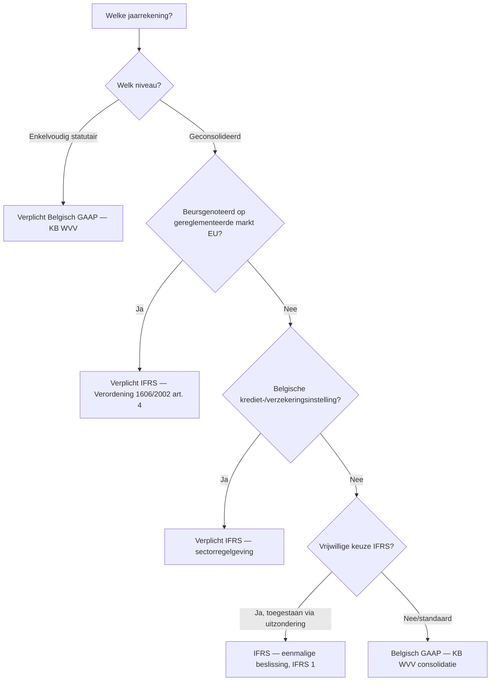

## Wat verwacht het examen van jou?

> [!abstract] Dit programmaonderdeel wordt getoetst op niveau *integratie*.
> Je moet meerdere concepten samen kunnen inzetten in complexe casussen — onderdelen herkennen, prioriteren, en tot een coherent oordeel komen.

**Taken** (uit het ITAA-examenprogramma):

> [!abstract]- **Taak 1** — Opstellen van de individuele en geconsolideerde jaarrekening
>
> **Subtaken**:
> - Herstructureren van de balans en de resultatenrekening
> - Identificeren en interpreteren van de balansaggregaten
> - Berekenen van de elementen die nodig zijn voor een interpretatie van de kasstromen en die interpreteren
> - Berekenen van de ratio's en ze interpreteren
> - Contextualiseren van de interpretaties naargelang van het bedrijfsdomein en de nationale en internationale context
>
> **Doelstellingen**:
> - Een beginsel van boekhoudrecht of een wettelijke bepaling uit Belgische of Europese bron opzoeken, grondig analyseren en toepassen, met inachtneming van internationale normen.
> - Verifiëren en waarborgen van de conformiteit van de boekhouding en de documenten met de wettelijke en reglementaire vereisten.

## Leesgids

De minicursus loopt van algemeen kader naar concrete toepassing: eerst de twee referentiestelsels naast elkaar via [[belgisch-gaap]] en [[ifrs]], dan het Europese harmonisatie-kader dat bepaalt wie IFRS moet gebruiken via [[verplichte-ifrs-eu-beursgenoteerden]] en [[ifrs-toepassingsgebied-belgie]]. Daarna duik je per IFRS-domein in — presentatie ([[jaarrekening-componenten-ifrs]]), waardering vaste activa, impairment, opbrengsten, voorraden en leasing — telkens met BE-GAAP als referentie. De minicursus sluit af met de procedurele kant: hoe voer je een stelselwissel uit via [[ifrs-eerste-toepassing]]. Lees de overzichts-tabel onder *Hoofdverschillen* als kompas — daar staan de scharnieren die in elk hoofdstuk terugkomen.

## Waarom dit programmaonderdeel telt

In België wordt elke statutaire jaarrekening opgesteld onder [[belgisch-gaap]], maar zodra een groep beursgenoteerd is op een gereglementeerde EU-markt geldt voor de geconsolideerde rekening verplicht [[ifrs]] op grond van Verordening 1606/2002 — zie [[verplichte-ifrs-eu-beursgenoteerden]]. Als accountant kom je beide stelsels tegen binnen dezelfde groep, en de twee wijken op cruciale punten af: leasing on-balance versus off-balance, goodwill-impairment versus afschrijving, opbrengsten via 5-stappen-model versus realisatiebeginsel. Je moet kunnen bepalen welk stelsel op welke jaarrekening van toepassing is via [[ifrs-toepassingsgebied-belgie]], welke gevolgen dat heeft voor balansomvang en resultaatdynamiek, en hoe een overgang procedureel verloopt onder [[ifrs-eerste-toepassing]]. Het examen test dat je niet alleen de verschillen kent, maar in een casus kunt redeneren welke richting je moet kiezen en wat de cijfermatige impact is. Wie de twee stelsels niet uit elkaar houdt, leest een geconsolideerde IFRS-balans met de bril van BE-GAAP — en omgekeerd — en mist daardoor systematisch de juiste waardering.

## Waarom IFRS naast Belgisch GAAP? Twee referentiestelsels, één economische realiteit

Dezelfde economische werkelijkheid — een onderneming met activa, schulden en transacties — kan onder twee fundamenteel verschillende kaders worden afgebeeld: het juridisch-fiscaal georiënteerde [[belgisch-gaap]] of het investeerdersgerichte [[ifrs]] dat steunt op het [[ifrs-conceptueel-raamwerk]]. Het verschil is geen detail: hetzelfde leasecontract verschijnt als huurlast onder BE-GAAP en als gebruiksrecht-actief plus leaseverplichting onder IFRS, met directe gevolgen voor balansomvang en ratio's. In dit programmaonderdeel leer je de twee stelsels naast elkaar lezen — niet door alles te memoriseren, maar door de scharnieren tussen rule-based en principle-based te doorgronden.

## De twee referentiestelsels — begrippen en conceptueel raamwerk

> [!info] Hoort bij taak: Opstellen van de individuele en geconsolideerde jaarrekening

Je leert de twee bronstelsels begrijpen als coherente systemen, niet als losse regels. [[belgisch-gaap]] vertrekt vanuit voorzichtigheid en vaste schema's, terwijl [[ifrs]] vertrekt vanuit nuttige informatie voor investeerders en steunt op het overkoepelende [[ifrs-conceptueel-raamwerk]] dat doelstelling, kwalitatieve kenmerken en definities oplegt zonder zelf een afdwingbare standaard te zijn.

- [[belgisch-gaap|Belgisch GAAP]] · `begrip`
- [[ifrs|IFRS — International Financial Reporting Standards]] · `begrip`
- [[ifrs-conceptueel-raamwerk|IFRS Conceptueel Raamwerk (IASB Conceptual Framework)]] · `cluster`

## Het Europese kader: richtlijn 2013/34/EU en verordening 1606/2002

> [!info] Hoort bij taak: Opstellen van de individuele en geconsolideerde jaarrekening

Je leert hier het Europese tweesporenbeleid toepassen op een Belgische casus: de [[eu-harmonisatie-jaarrekeningenrecht]] via de Boekhoudrichtlijn legt de minimumkern op voor élke jaarrekening (omgezet via KB WVV), terwijl Verordening 1606/2002 IFRS oplegt aan een specifieke ring ondernemingen — zie [[verplichte-ifrs-eu-beursgenoteerden]]. Doorslaggevend voor de toepasselijkheid in België is de [[ifrs-toepassingsgebied-belgie]]-regel, gekoppeld aan kwalificaties als [[public-interest-entity]] en [[groottecriteria-jaarrekening]]. Pas wanneer de Europese Commissie een IASB-standaard via de [[endorsement-procedure-eu]] heeft goedgekeurd, wordt die afdwingbaar binnen de EU — en activeert de [[consolidatieverplichting]] de IFRS-plicht op groepsniveau.

- [[eu-harmonisatie-jaarrekeningenrecht|EU-harmonisatie van het jaarrekeningenrecht]] · `cluster`
- [[verplichte-ifrs-eu-beursgenoteerden|Verplichte IFRS voor EU-beursgenoteerden — geconsolideerde jaarrekening]] · `regel`
- [[endorsement-procedure-eu|Endorsement-procedure — EU-goedkeuring van IFRS-standaarden]] · `cluster`
- [[ifrs-toepassingsgebied-belgie|IFRS-toepassingsgebied in België — wie moet en wie mag?]] · `regel`
- [[public-interest-entity|Public Interest Entity (PIE)]] · `begrip`
- [[groottecriteria-jaarrekening|Groottecriteria (jaarrekening-context)]] · `regel`
- [[consolidatieverplichting|Consolidatieverplichting]] · `regel`

## Belgisch GAAP versus IFRS — overzicht van hoofdverschillen

De tabel hieronder vat het scharnier samen dat in elk thematisch hoofdstuk terugkomt: dezelfde post wordt onder [[belgisch-gaap]] en [[ifrs]] anders gewaardeerd of gepresenteerd. Lees de tabel niet als losse weetjes maar als drie clusters — balansomvang, resultaatdynamiek en opnamecriteria — die je in een examencasus systematisch kunt afgaan.

| Aspect                          | Belgisch GAAP (KB WVV)                                              | IFRS                                                                                       | Belangrijkste gevolg                                                                                       |
|--------------------------------|---------------------------------------------------------------------|--------------------------------------------------------------------------------------------|------------------------------------------------------------------------------------------------------------|
| **Algemeen kader**             | Rule-based, vast schema, juridisch-fiscaal georiënteerd             | Principle-based, flexibele presentatie, investeerders-georiënteerd                          | IFRS vereist meer professional judgment, BE-GAAP meer schemavolgen                                          |
| **Componenten jaarrekening**   | Balans + W&V + toelichting (3); voor groot schema: kasstroom + bestuursverslag | 5 verplichte componenten: balans + totaalresultaat + mutaties EV + kasstroom + toelichting | IFRS verplicht mutatieoverzicht EV en kasstroom voor iedereen                                              |
| **Materiële vaste activa**     | Kostprijsmodel; herwaardering uitzonderlijk + voor financiële + materiële vaste activa | Kostprijs- of herwaarderingsmodel (keuze per categorie) — IAS 16                            | IFRS staat structurele herwaardering tegen reële waarde toe; BE-GAAP veel terughoudender                    |
| **Onderzoekskosten**           | Activering mogelijk (KB WVV art. 3:31)                              | Verbod op activering — moet als kost (IAS 38 alinea 54)                                     | Eerste IFRS-toepassing: schrappen geactiveerde onderzoekskosten, ingehouden winsten −                       |
| **Ontwikkelingskosten**        | Activering mogelijk onder strikte voorwaarden                       | Activering verplicht bij 6 cumulatieve criteria (IAS 38 alinea 57)                          | IFRS strikter inhoudelijk maar dwingender in toepassing                                                     |
| **Goodwill**                   | Afschrijving over vermoedelijke gebruiksduur (KB WVV art. 3:131 § 1): **5 jaar default; langer mits gemotiveerd in toelichting**. Aanvullende/niet-recurrente afschrijving bij gewijzigde economische omstandigheden. Negatief consolidatieverschil NIET direct in W&V (art. 3:131 § 2). Zie [[goodwill-be-gaap]] | GEEN afschrijving — verplichte **jaarlijkse impairment-test** (IAS 36 / IFRS 3). Bargain purchase gain (negatief verschil) direct in W&V                  | IFRS-resultaat schommelt meer (impairment-shock vs. gladde afschrijving); BE-GAAP voorspelbaarder maar mogelijk minder reactief op echte waardevermindering                                    |
| **Leasing — lessee**           | Operationele lease off-balance; financiële lease op balans          | ALLE leases on-balance: gebruiksrecht-actief + leaseverplichting (IFRS 16)                  | IFRS toont meer activa én meer schulden; ratio's debt/equity stijgen                                       |
| **Opbrengsten**                | 'Aangenomen wanneer winsten gerealiseerd zijn op balansdatum' — KB WVV art. 3:18 | 5-stappen-model (IFRS 15) — vergoeding ↔ prestatieverplichtingen                            | IFRS analyseert contract diepgaander; soms andere tijdsbepaling van opbrengst                              |
| **Voorraden**                  | LIFO, FIFO of gewogen gemiddelde toegelaten                          | LIFO **verboden**; alleen FIFO of gewogen gemiddelde (IAS 2 alinea 25)                      | IFRS-overgang dwingt LIFO-gebruikers tot herrekening                                                       |
| **Voorzieningen**              | Voor 'voorzienbare risico's' — soms ruim ingeschat                  | Strikte 3 criteria: huidige verplichting + waarschijnlijke uitstroom + betrouwbaar schatbaar (IAS 37) | IFRS staat minder 'reserve-vorming' toe — voorzieningen die niet aan criteria voldoen, worden teruggenomen |
| **Reële waarde**               | Beperkt — sommige financiële instrumenten                            | Centraal kader (IFRS 13) — uitgebreid gebruik bij financiële activa, vastgoedbeleggingen, biologische activa | IFRS-resultaat volatieler; meer hierarchie 1/2/3 toelichtingen                                              |
| **Uitgestelde belastingen**    | Toelichting vermeld; opname terughoudend                            | Volledige opname verplicht (IAS 12) — verschillen tussen boekwaarde en fiscale waarde      | IFRS-balans heeft meer uitgestelde belastingactiva/passiva zichtbaar                                       |

**Kerninzichten**:

- **Twee filosofieën**: BE-GAAP is rule-based en juridisch-fiscaal georiënteerd (vaste schema's, voorzichtigheidsbeginsel); IFRS is principle-based en investeerders-georiënteerd (reële waarde, professional judgment). — _waarom_: De stagiair kan twee jaarrekeningen van dezelfde onderneming verschillend zien uitvallen onder beide stelsels — niet door fout maar door fundamenteel ander uitgangspunt.
- **Belgisch verplicht IFRS-toepassingsgebied is smal**: enkel geconsolideerde jaarrekeningen van EU-beursgenoteerden + financiële sector. Enkelvoudige jaarrekeningen blijven altijd BE-GAAP. Vrijwillige IFRS-toepassing is in België uitzonderlijk (CBN 2016/19 voor consortia, ...). — _waarom_: Examen-valstrik: 'mag een grote NV IFRS toepassen?' — Voor enkelvoudige rekening: nee. Voor geconsolideerde rekening: alleen bij wettelijke verplichting of beperkte optie.
- **Drie thematische clusters van verschil** vanuit examenperspectief: (a) **balansomvang**: IFRS toont meer activa én meer schulden (leasing, uitgestelde belastingen, herwaardering); (b) **resultaatdynamiek**: IFRS-resultaat is volatieler (impairment-shocks, reële waarde) terwijl BE-GAAP gladder verloopt (afschrijving goodwill, voorzichtige voorzieningen); (c) **opnamecriteria**: IFRS strikter voor activering (geen onderzoekskosten, strikte voorzieningen) maar dwingender voor andere posten (ontwikkelingskosten activering verplicht bij 6 criteria, alle leases on-balance). — _waarom_: Stagiair leert hoofdverschillen groeperen i.p.v. memoriseren van losse artikels. Bij een examen-casus 'noem 3 verschillen tussen BE-GAAP en IFRS' kiest hij telkens uit één cluster om coverage te tonen.
- **Overgang BE-GAAP ↔ IFRS** is geen mechanische cijferconversie maar een procedureel project: IFRS 1 voor BE-GAAP → IFRS (5 stappen, retroactief openingsbalans), CBN 2022/08 voor IFRS → BE-GAAP. Het aanpassingsverschil komt rechtstreeks in ingehouden winsten — niet in resultaat van de overgangsperiode. — _waarom_: Stagiair die in praktijk een groep helpt over te stappen, weet dat het project maanden duurt: openingsbalans, vrijstellingen-keuze, aansluitingstabellen, communicatie naar gebruikers.

_Bouwt op_: [[eu-harmonisatie-jaarrekeningenrecht]] · [[verplichte-ifrs-eu-beursgenoteerden]] · [[endorsement-procedure-eu]] · [[ifrs-toepassingsgebied-belgie]] · [[jaarrekening-componenten-ifrs]] · [[presentatiebeginselen-jaarrekening-ifrs]] · [[materiele-vaste-activa-ifrs]] · [[immateriele-vaste-activa-ifrs]] · [[leasing-ifrs]] · [[opbrengsten-ifrs]] · [[voorraden-ifrs]] · [[goodwill-be-gaap]] · [[bijzondere-waardevermindering-be-gaap]] · [[bijzondere-waardevermindering-ifrs]] · [[ifrs-conceptueel-raamwerk]]
## Bepalen of een onderneming IFRS moet of mag toepassen in België

> [!info] Hoort bij taak: Opstellen van de individuele en geconsolideerde jaarrekening

Stap voor stap loop je de beslissing door: eerst rapporteringsniveau (enkelvoudig versus geconsolideerd), dan beursnotering of sectorale kwalificatie, dan eventuele vrijwillige toepassing — een redenering die rechtstreeks volgt uit [[ifrs-toepassingsgebied-belgie]] en de Europese basis van [[verplichte-ifrs-eu-beursgenoteerden]]. Bij een positieve uitkomst activeer je vervolgens [[ifrs-eerste-toepassing]] als project.

[[competenties/bepalen-toepasselijkheid-ifrs-belgie|→ Volledige procedure]]

## Brug: jaarrekeningpresentatie als regime-overstijgend concept

> [!info] Hoort bij taak: Opstellen van de individuele en geconsolideerde jaarrekening

Vóór je in de IFRS-specifieke regels duikt, leer je de gedeelde basis kennen: [[jaarrekening-presentatie]] beschrijft welke vormvereisten en presentatiebeginselen onder elk regime gelden, zodat je de IFRS-keuzes verderop kunt zien als variaties op een gemeenschappelijke logica in plaats van geïsoleerde regels.

- [[jaarrekening-presentatie|Jaarrekeningpresentatie (regime-overstijgend)]] · `cluster`

## IAS 1 — Presentatie van de jaarrekening: vijf componenten en presentatiebeginselen

> [!info] Hoort bij taak: Opstellen van de individuele en geconsolideerde jaarrekening

Je leert IAS 1 toepassen door de vijf [[jaarrekening-componenten-ifrs]] te koppelen aan de overkoepelende [[presentatiebeginselen-jaarrekening-ifrs]] — going concern, accruals, materialiteit, consistentie en het verbod op compensatie. Voor de balans hanteer je de splitsing in [[balans-presentatie-ifrs]] tussen vlottend en niet-vlottend, voor het resultaat het brede begrip [[totaalresultaat-ifrs]] (P&L plus OCI), aangevuld met het [[mutatieoverzicht-eigen-vermogen-ifrs]] en de [[toelichtingsvereisten-jaarrekening-ifrs]] die de cijfers leesbaar maken.

- [[jaarrekening-componenten-ifrs|Componenten van een IFRS-jaarrekening]] · `begrip`
- [[presentatiebeginselen-jaarrekening-ifrs|Algemene presentatiebeginselen IFRS-jaarrekening]] · `regel`
- [[balans-presentatie-ifrs|IFRS-balanspresentatie — vlottend versus niet-vlottend]] · `regel`
- [[totaalresultaat-ifrs|Winst of verlies en overige onderdelen van het totaalresultaat (IFRS)]] · `begrip`
- [[mutatieoverzicht-eigen-vermogen-ifrs|Mutatieoverzicht eigen vermogen (IFRS)]] · `begrip`
- [[toelichtingsvereisten-jaarrekening-ifrs|Toelichtingsvereisten IFRS-jaarrekening — structuur en inhoud]] · `regel`

## Presenteren van een IFRS-jaarrekening volgens IAS 1 (5 componenten en presentatiebeginselen)

> [!info] Hoort bij taak: Opstellen van de individuele en geconsolideerde jaarrekening

Je leert de vijf verplichte componenten opbouwen tot een coherente jaarrekening die voldoet aan IAS 1: eerst de [[jaarrekening-componenten-ifrs]] inventariseren, dan voor elk de minimumposten plaatsen volgens [[balans-presentatie-ifrs]] en [[totaalresultaat-ifrs]], en de [[toelichtingsvereisten-jaarrekening-ifrs]] uitwerken tot een set grondslagen die de cijfers verklaren.

[[competenties/presenteren-jaarrekening-ifrs|→ Volledige procedure]]

## Vaste activa onder IFRS: IAS 16 en IAS 38 — kostprijs, herwaardering en componenten

> [!info] Hoort bij taak: Opstellen van de individuele en geconsolideerde jaarrekening

Je leert vaste activa waarderen volgens de IFRS-logica die [[materiele-vaste-activa-ifrs]] en [[immateriele-vaste-activa-ifrs]] onderscheidt op tastbaarheid en activerings-criteria. Per categorie kies je tussen kostprijs- en [[herwaarderingsmodel-ifrs]], pas je de [[componentenbenadering]] toe wanneer onderdelen substantieel verschillende gebruiksduren hebben, en bepaal je de [[afschrijvingen-ifrs]] daarop. Voor activa met lange constructieperiode reken je [[intercalaire-interesten]] mee in de aanschaffingswaarde voor zover de regels dat toelaten.

- [[materiele-vaste-activa-ifrs|Materiële vaste activa onder IFRS (IAS 16)]] · `regel`
- [[immateriele-vaste-activa-ifrs|Immateriële activa onder IFRS (IAS 38)]] · `regel`
- [[herwaarderingsmodel-ifrs|Herwaarderingsmodel onder IFRS (IAS 16)]] · `cluster`
- [[componentenbenadering|Componentenbenadering — afschrijving per onderdeel]] · `cluster`
- [[afschrijvingen-ifrs|Afschrijvingen onder IFRS (IAS 16 + IAS 38)]] · `cluster`
- [[intercalaire-interesten|Intercalaire interesten (financieringskosten tijdens bouw)]] · `regel`

## Waarderen van materiële vaste activa onder IAS 16 (kostprijs- of herwaarderingsmodel)

> [!info] Hoort bij taak: Opstellen van de individuele en geconsolideerde jaarrekening

Stap voor stap doorloop je de waardering: eerste opname tegen kostprijs van [[materiele-vaste-activa-ifrs]], dan beleidskeuze tussen kostprijs- of [[herwaarderingsmodel-ifrs]] per categorie, en vervolgens de [[afschrijvingen-ifrs]] op basis van de [[componentenbenadering]]. Tussentijds toets je via [[bijzondere-waardevermindering-ifrs]] wanneer indicatoren wijzen op een waardeverlies.

[[competenties/waarderen-materiele-vaste-activa-ifrs|→ Volledige procedure]]

## Brug: bijzondere waardevermindering als regime-overstijgend mechanisme

> [!info] Hoort bij taak: Opstellen van de individuele en geconsolideerde jaarrekening

Voor je IAS 36 detailleert, leer je de gedeelde logica via [[bijzondere-waardevermindering]]: detecteer indicatoren, vergelijk boekwaarde met realiseerbare of gebruikswaarde, boek het verschil als verlies. Onder Belgisch recht worden diezelfde gevolgen bereikt via de mechanismen van [[bijzondere-waardevermindering-be-gaap]] — aanvullende afschrijving voor activa met beperkte gebruiksduur, waardevermindering voor activa met onbeperkte gebruiksduur — zonder de strikt-geformaliseerde impairment-test van IAS 36.

- [[bijzondere-waardevermindering|Bijzondere waardevermindering (regime-overstijgend)]] · `cluster`
- [[bijzondere-waardevermindering-be-gaap|Aanvullende afschrijving en waardevermindering onder BE-GAAP (art. 3:42 KB WVV)]] · `cluster`

## Bijzondere waardevermindering onder IAS 36: indicaties, CGU en realiseerbare waarde

> [!info] Hoort bij taak: Opstellen van de individuele en geconsolideerde jaarrekening

Je leert de IAS 36-procedure toepassen op concrete activa: indicatoren scannen (extern en intern), realiseerbare waarde berekenen als hoogste van reële waarde min verkoopkosten of bedrijfswaarde, en bij gebrek aan onafhankelijke kasstromen terugvallen op een kasstroomgenererende eenheid — alles geregeld door [[bijzondere-waardevermindering-ifrs]] dat de scharnier vormt met de waardering van vaste activa uit het vorige hoofdstuk.

- [[bijzondere-waardevermindering-ifrs|Bijzondere waardevermindering onder IFRS (IAS 36)]] · `cluster`

## Toetsen van een actief op bijzondere waardevermindering onder IAS 36

> [!info] Hoort bij taak: Opstellen van de individuele en geconsolideerde jaarrekening

Stap voor stap voer je de impairment-test uit zoals voorgeschreven door [[bijzondere-waardevermindering-ifrs]]: eerst scan op aanwijzingen, dan realiseerbare waarde bepalen op het niveau van actief of CGU, vergelijken met boekwaarde, en het verlies splitsen tussen W&V en — bij eerder geherwaardeerde activa — OCI volgens [[herwaarderingsmodel-ifrs]].

[[competenties/toetsen-bijzondere-waardevermindering-ifrs|→ Volledige procedure]]

## Brug: opbrengsten onder BE-GAAP — het realisatiebeginsel

Onder [[belgisch-gaap]] worden opbrengsten erkend op het ogenblik dat de winst op balansdatum gerealiseerd is — een toepassing van het voorzichtigheidsbeginsel uit de [[boekhoudbeginselen-overzicht]]. Dit korte bruggetje zet de toon voor IFRS 15 in het volgende hoofdstuk: dezelfde transactie kan onder IFRS op een ander moment leiden tot opname dan onder BE-GAAP.

- [[opbrengsten-be-gaap]] — record niet gevonden

## Opbrengsten onder IFRS 15: het vijf-stappen-model en prestatieverplichtingen

> [!info] Hoort bij taak: Opstellen van de individuele en geconsolideerde jaarrekening

Je leert het [[opbrengsten-ifrs]] 5-stappen-model toepassen op uiteenlopende contracten: contract identificeren, [[prestatieverplichting]] onderscheiden, transactieprijs vastleggen, prijs toewijzen aan elke onderscheiden belofte, en opbrengst opnemen op het tijdstip of over de periode waarin controle overgaat. Voor klant-specifieke projecten geldt sinds 2018 de algemene regel — IAS 11 is afgeschaft — en bepaalt [[onderhanden-projecten-ifrs]] of opname over de periode kan, met een passende voortgangsmeting.

- [[opbrengsten-ifrs|Opbrengsten onder IFRS (IFRS 15) — 5-stappen-model]] · `cluster`
- [[prestatieverplichting|Prestatieverplichting (performance obligation)]] · `begrip`
- [[onderhanden-projecten-ifrs|Onderhanden projecten in opdracht van derden — onder IFRS 15]] · `regel`

## Toepassen van het 5-stappen-model van IFRS 15 voor opbrengstenherkenning

> [!info] Hoort bij taak: Opstellen van de individuele en geconsolideerde jaarrekening

Stap voor stap doorloop je het 5-stappen-model van [[opbrengsten-ifrs]] op een concreet contract: contract identificeren, elke [[prestatieverplichting]] als onderscheiden of bundel afbakenen, transactieprijs bepalen inclusief variabele componenten, prijs toewijzen op basis van standalone selling prices, en uiteindelijk opname op tijdstip of over periode kiezen — bij over-periode-opname met een input- of outputmethode voor voortgangsmeting.

[[competenties/toepassen-vijf-stappen-model-opbrengsten-ifrs|→ Volledige procedure]]

## Voorraden onder IFRS: IAS 2 en het verbod op LIFO

> [!info] Hoort bij taak: Opstellen van de individuele en geconsolideerde jaarrekening

Je leert de IFRS-waardering van voorraden toepassen via [[voorraden-ifrs]]: kostprijs of opbrengstwaarde — de laagste van beide — met alleen FIFO of gewogen gemiddelde als kostprijsformule. Wie van BE-GAAP komt waar LIFO nog toelaatbaar is, moet bij overgang naar IFRS herrekeningen plannen — een typisch onderdeel van het project rond [[ifrs-eerste-toepassing]].

- [[voorraden-ifrs|Voorraden onder IFRS (IAS 2)]] · `regel`

## IFRS 16 — lessee versus lessor (overzicht)

IFRS 16 hanteert een asymmetrisch model: lessee én lessor volgen niet meer dezelfde classificatie (zoals onder IAS 17), maar geven een lease vanuit hun eigen perspectief weer. Voor de stagiair betekent dit dat dezelfde lease-overeenkomst aan beide kanten van de balans verschillend zichtbaar is.

De tabel hieronder maakt de scharnier expliciet: aan lessee-zijde verdween het onderscheid operationeel/financieel volledig — zie [[leasing-ifrs]] — terwijl aan lessor-zijde dezelfde tweedeling blijft bestaan zoals beschreven in [[lessee-vs-lessor-leasing-ifrs]]. Bij intra-groep-leases creëert die asymmetrie consolidatie-uitdagingen omdat de boekingen aan beide kanten niet één-op-één matchen.

| Aspect | Lessee onder IFRS 16 | Lessor onder IFRS 16 |
|---|---|---|
| Basismodel | Single model: alle leases on-balance | Twee modellen: operationele vs. financiële lease (zoals IAS 17) |
| Activa | Right-of-use-actief op de balans, jaarlijks afgeschreven | Operationele lease: activa blijft op balans lessor; Financiële lease: vordering ipv activa |
| Verplichting / vordering | Leaseverplichting (effectieve-rente-methode) | Operationele lease: geen vordering; Financiële lease: vordering met rente-component |
| Resultaat | Afschrijving (vast) + rente (degressief) | Operationele lease: huurinkomst (vast); Financiële lease: rente-inkomst (degressief) + winst op verkoop |
| Uitzonderingen | Kortdurende leases (< 12 maand) en lease van lage waarde mogen off-balance | Geen vergelijkbare vrijstelling |

**Kerninzichten**:

- De asymmetrie maakt vergelijking lastig: dezelfde economische transactie verschijnt aan lessee-kant (gebruiksrecht-actief + verplichting) groter dan aan lessor-kant (alleen vordering bij financiële lease). — _waarom_: Voor de stagiair die een groep met intra-groep-leases analyseert: de eliminaties bij consolidatie vragen extra aandacht omdat de boekingen aan beide kanten niet symmetrisch zijn.
- IFRS 16 schaft het BE-GAAP-onderscheid tussen operationele en financiële lease alleen aan lessee-zijde af. Aan lessor-zijde blijft het onderscheid bestaan, met andere boekingen voor elk type. — _waarom_: Een examenvraag over 'classificatie van een lease onder IFRS' vereist altijd duidelijkheid: vanuit wie? Lessee → niet meer relevant; lessor → nog steeds belangrijk.

_Bouwt op_: [[leasing-ifrs]] · [[right-of-use-actief]] · [[leaseverplichting-ifrs]]
## Leasing onder IFRS 16: right-of-use-actief en leaseverplichting bij lessee

> [!info] Hoort bij taak: Opstellen van de individuele en geconsolideerde jaarrekening

Je leert leases verwerken volgens het single model van [[leasing-ifrs]] dat aan lessee-zijde alles on-balance brengt: tegenover de contante waarde van toekomstige leasebetalingen — de [[leaseverplichting-ifrs]] — staat het [[right-of-use-actief]] dat het gebruiksrecht over de leaseperiode vertegenwoordigt. Voor samengestelde transacties zoals [[sale-and-leaseback-ifrs]] doe je eerst de IFRS 15-toets op de verkoop voor je het lease-deel boekt.

- [[leasing-ifrs|Leasing onder IFRS (IFRS 16) — lessee-perspectief]] · `cluster`
- [[right-of-use-actief|Right-of-use-actief (gebruiksrecht-actief) onder IFRS 16]] · `begrip`
- [[leaseverplichting-ifrs|Leaseverplichting onder IFRS 16]] · `begrip`
- [[lessee-vs-lessor-leasing-ifrs|Lessee versus lessor onder IFRS 16 — overzicht en asymmetrie]] · `synthese`
- [[sale-and-leaseback-ifrs|Sale-and-leaseback onder IFRS (IFRS 16)]] · `cluster`

## Verwerken van een leaseovereenkomst onder IFRS 16 als lessee (right-of-use + lease-verplichting)

> [!info] Hoort bij taak: Opstellen van de individuele en geconsolideerde jaarrekening

Stap voor stap voer je de verwerking uit: identificeer of het contract een lease bevat onder [[leasing-ifrs]], bepaal de leasetermijn en disconteringsvoet, waardeer de [[leaseverplichting-ifrs]] op contante waarde van leasebetalingen, en stel het [[right-of-use-actief]] in tegen kostprijs. Vervolgens splits je elke periode in een afschrijvings- en een rente-component, en beoordeel je of de vrijstellingen voor kortlopende leases of activa van lage waarde toepasbaar zijn.

[[competenties/verwerken-leasing-ifrs-lessee|→ Volledige procedure]]

## Brug: stelselwissel jaarrekening — van BE-GAAP naar IFRS en omgekeerd

> [!info] Hoort bij taak: Opstellen van de individuele en geconsolideerde jaarrekening

Je leert een overgang tussen referentiestelsels uitvoeren als project, niet als boeking. [[stelselwissel-jaarrekening]] beschrijft de gedeelde principes — openingsbalans, retroactieve toepassing, aansluitingstabellen — die in beide richtingen gelden. Van BE-GAAP naar IFRS volg je [[ifrs-eerste-toepassing]] (IFRS 1) met verplichte uitzonderingen en optionele vrijstellingen; van IFRS naar BE-GAAP geldt [[wijziging-boekhoudkundig-referentiestelsel]] (CBN 2022/08). Binnen een lopende IFRS-rekening houdt [[correctie-jaarrekening-ifrs]] grondslag-, schattings- en foutwijzigingen scherp uit elkaar, met direct gevolg voor de vergelijkbaarheid van de cijfers — denk aan de afwijkende behandeling van [[goodwill-be-gaap]] versus IFRS bij overstap.

- [[stelselwissel-jaarrekening|Stelselwissel jaarrekening (BE GAAP ↔ IFRS)]] · `cluster`
- [[wijziging-boekhoudkundig-referentiestelsel|Wijziging van boekhoudkundig referentiestelsel naar BE GAAP (CBN 2022/08)]] · `cluster`
- [[ifrs-eerste-toepassing|Eerste toepassing van IFRS (IFRS 1)]] · `cluster`
- [[correctie-jaarrekening-ifrs|Correctie van de jaarrekening — IAS 8 versus CBN 2020/12]] · `cluster`
- [[goodwill-be-gaap|Goodwill onder BE-GAAP (consolidatieverschil en verworven goodwill)]] · `cluster`

## Uitvoeren van de eerste toepassing van IFRS overeenkomstig IFRS 1

> [!info] Hoort bij taak: Opstellen van de individuele en geconsolideerde jaarrekening

Stap voor stap voer je de overgang uit zoals geregeld door [[ifrs-eerste-toepassing]]: stel de datum van overgang vast, bouw de openingsbalans op door alle IFRS-vereiste activa en verplichtingen op te nemen, schrap wat onder IFRS niet kwalificeert, herclassificeer en herwaardeer waar nodig — met het aanpassingsverschil rechtstreeks in ingehouden winsten. Beoordeel tot slot welke verplichte uitzonderingen en optionele vrijstellingen je toepast, en stel de aansluitingstabellen op die [[stelselwissel-jaarrekening]] vereist.

[[competenties/uitvoeren-eerste-toepassing-ifrs|→ Volledige procedure]]

## Reflectie: IFRS als levend normenstelsel — IAS 17 → IFRS 16 en IAS 18 → IFRS 15

[[ifrs]] is geen vast stelsel maar evolueert: [[leasing-ifrs]] verving in 2019 IAS 17 met een single model dat alle leases aan lessee-zijde on-balance brengt, en [[opbrengsten-ifrs]] verving in 2018 IAS 18 én IAS 11 met één geïntegreerd 5-stappen-model. Voor jou als accountant betekent dit dat je niet alleen huidige standaarden moet kennen, maar ook moet aansluiten bij oudere cijferreeksen waarin de vervangen standaarden nog doorwerken — en bij elke standaard-wissel de impact via [[correctie-jaarrekening-ifrs]] correct als grondslagwijziging verwerken.

## Synthese-stappenplan

Bij elke jaarrekening-vraag die je in praktijk of op het examen tegenkomt, doorloop je deze stappen in vaste volgorde. **Stap 1 — Identificeer het rapporteringsniveau**: enkelvoudig of geconsolideerd? Enkelvoudig in België is altijd [[belgisch-gaap]]. **Stap 2 — Test de IFRS-toepasselijkheid** via [[ifrs-toepassingsgebied-belgie]]: geconsolideerd plus beursnotering op gereglementeerde EU-markt of sectorale kwalificatie als kredietinstelling/verzekeraar activeert verplichte [[verplichte-ifrs-eu-beursgenoteerden]]. **Stap 3 — Bepaal de presentatievereisten**: onder IFRS pas je IAS 1 toe met vijf [[jaarrekening-componenten-ifrs]] en de [[presentatiebeginselen-jaarrekening-ifrs]]; onder BE-GAAP volg je het schema-conform KB WVV. **Stap 4 — Waardeer per domein** volgens het juiste stelsel: vaste activa via [[materiele-vaste-activa-ifrs]] en [[immateriele-vaste-activa-ifrs]] met keuze voor [[herwaarderingsmodel-ifrs]], voorraden via [[voorraden-ifrs]], opbrengsten via het 5-stappen-model van [[opbrengsten-ifrs]], leases via [[leasing-ifrs]]. **Stap 5 — Toets op waardevermindering** via [[bijzondere-waardevermindering-ifrs]] wanneer indicatoren of jaarlijkse verplichtingen dat vragen. **Stap 6 — Bij stelselwissel**: pas [[ifrs-eerste-toepassing]] toe voor BE-GAAP → IFRS of [[wijziging-boekhoudkundig-referentiestelsel]] voor IFRS → BE-GAAP, met aansluitingstabellen en aanpassingsverschillen in ingehouden winsten. **Stap 7 — Werk de [[toelichtingsvereisten-jaarrekening-ifrs]] uit** zodat de cijfers traceerbaar zijn naar grondslagen.

## Cheatsheet

### Kritische drempelwaarden

| Concept | Naam | Waarde | Eenheid | Gevolg |
|---|---|---|---|---|
| [[groottecriteria-jaarrekening]] | Drempels kleine vennootschap (na update 2024) | Personeelsbezetting ≤ 50; jaaromzet excl. BTW ≤ € 11.250.000; balanstotaal ≤ € 6.000.000 | drie criteria — max 1 mag overschreden worden | Mag verkort schema gebruiken; geen jaarverslag verplicht; geen commissaris verplicht (tenzij ze deel uitmaakt van een gr… |
| [[groottecriteria-jaarrekening]] | Drempels microvennootschap | Personeelsbezetting ≤ 10; jaaromzet excl. BTW ≤ € 900.000; balanstotaal ≤ € 450.000 | drie criteria — max 1 mag overschreden worden | Mag microschema gebruiken (kleinste schema) |
| [[jaarrekening]] | Kleine vennootschap (verkort schema toegelaten) | Maximaal 1 criterium overschreden: balanstotaal € 6.000.000, omzet € 11.250.000, gemiddeld personeel 50 VTE | WVV art. 1:24 — 1:25 | Mag jaarrekening in **verkort schema** opstellen; vrijgesteld van jaarverslag (tenzij beursgenoteerd), commissaris-vrijs… |
| [[jaarrekening]] | Micro-vennootschap (microschema toegelaten) | Maximaal 1 criterium overschreden: balanstotaal € 350.000, omzet € 700.000, gemiddeld personeel 10 VTE | WVV art. 1:25 | Mag jaarrekening in **microschema** opstellen — kortere balans, minder verplichte vermeldingen in toelichting |
| [[verplichte-ifrs-eu-beursgenoteerden]] | Trigger verplichte IFRS-toepassing | Beursnotering op gereglementeerde markt EU-lidstaat op balansdatum + EU-rechtsvorm | kwalitatief criterium | Verplichte IFRS-toepassing op geconsolideerde jaarrekening voor boekjaren beginnend op of na 1 januari 2005 |

### Vergelijkingsparen-matrix

| Concept | Verwarrend met | Trigger |
|---|---|---|
| [[balans-presentatie-ifrs]] | [[jaarrekening-schema]] | Examenvraag over balansrubrieken: KB WVV gebruikt vaste-activa-rubrieken I (oprichtingskosten) tot IV (financiële vaste activa). IAS 1 gebruikt geen 'oprichtingskosten' — die mogen onder IFRS niet geactiveerd worden. |
| [[balans]] | [[resultatenrekening]] | Examen: 'op welke staat staat post X?' Toestand (saldo) → balans. Beweging (gedurende periode) → RR. |
| [[balans]] | [[analytische-balans]] | Examen: 'bereken behoefte aan bedrijfskapitaal' — eerst statutaire balans naar analytische balans omzetten. |
| [[belgisch-gaap]] | [[ifrs]] | Examenvraag over een specifieke balanspost: bepaal eerst onder welk stelsel het cijfer berekend is. Beursnotering + geconsolideerd → IFRS; alle andere gevallen → BE-GAAP. |
| [[bijzondere-waardevermindering-be-gaap]] | [[bijzondere-waardevermindering-ifrs]] | Examen: 'Onder welk regime werd deze waardevermindering geboekt?' → toets op DCF-onderbouwing + CGU-allocatie (= IFRS) versus eenvoudige verwijzing naar 'duurzame minderwaarde' of 'gebruikswaarde voor de vennootschap' (= BE-GAAP). |
| [[bijzondere-waardevermindering-ifrs]] | [[herwaarderingsmeerwaarden]] | Examen: 'boekwaarde > marktwaarde' → impairment (verlaging, W&V); 'marktwaarde > boekwaarde + herwaarderingsmodel' → herwaardering (verhoging, OCI). |
| [[bijzondere-waardevermindering-ifrs]] | [[bijzondere-waardevermindering-be-gaap]] | Examen: 'Onder welk regime werd deze waardevermindering geboekt?' → toets op aanwezigheid van DCF-onderbouwing en CGU-allocatie (= IFRS) versus eenvoudige verwijzing naar duurzame minderwaarde (= BE-GAAP). |
| [[bijzondere-waardevermindering]] | [[bijzondere-waardevermindering-ifrs]] | Algemeen → 'wat is het mechanisme van bijzondere waardevermindering?'; IFRS → 'hoe bereken ik VIU?' / 'wat is CGU-allocatie?' |
| [[bijzondere-waardevermindering]] | [[bijzondere-waardevermindering-be-gaap]] | Algemeen → 'wat is het mechanisme?'; BE GAAP → 'aanvullende afschrijving of waardevermindering — welk artikel?' |
| [[correctie-jaarrekening-ifrs]] | [[wijziging-boekhoudkundig-referentiestelsel]] | Examen: 'Onderneming wijzigt afschrijvingsmethode' (lineair → degressief) — IAS 8 schattingswijziging (prospectief). 'Onderneming wijzigt waarderingsbasis vastgoed' (kostprijs → herwaardering) — IAS 8 grondslagwijziging (retroactief). 'Onderneming gaat over naar IFRS' — IFRS 1 + CBN 2022/08. |
| [[eu-harmonisatie-jaarrekeningenrecht]] | [[verplichte-ifrs-eu-beursgenoteerden]] | Examenvraag 'welke EU-norm bepaalt of IFRS verplicht is?' → Verordening 1606/2002 / `verplichte-ifrs-eu-beursgenoteerden`. 'Welke EU-norm bepaalt de minimuminhoud van de Belgische jaarrekening?' → Richtlijn 2013/34/EU (via KB WVV). |
| [[getrouw-beeld]] | [[getrouw-beeld-jaarrekening]] | Vraag over algemeen beginsel → getrouw-beeld. Vraag over de jaarrekening-toets (vermogen/positie/resultaat) → getrouw-beeld-jaarrekening. |
| [[goodwill-be-gaap]] | [[ifrs-conceptueel-raamwerk]] | Examen: 'op welke rubriek staat goodwill en hoe wordt ze gewaardeerd?' onder BE-GAAP → III. Immateriële vaste activa (enkelvoudig) of Consolidatieverschillen (geconsolideerd) + afschrijving over vermoedelijke gebruiksduur (5 jaar default, langer mits motivatie). |
| [[groottecriteria-jaarrekening]] | [[groottecriteria-consolidatie]] | Examen 'welk schema moet X gebruiken?' → 1:24/1:25. 'Mag groep X afzien van consolideren?' → 1:26. |
| [[herwaarderingsmodel-ifrs]] | [[herwaarderingsmeerwaarden]] | Examen: 'mag ik onder IFRS dit actief herwaarderen?' → check IAS 16 keuze tussen kostprijsmodel en herwaarderingsmodel. 'Onder BE GAAP?' → check de drie voorwaarden art. 3:30. |
| [[ifrs-conceptueel-raamwerk]] | [[boekhoudbeginselen-overzicht]] | Examen: 'noem de kernverschillen tussen de bovenliggende kaders van IFRS en BE-GAAP' → primair publiek (investeerders vs juridisch-fiscale gebruikers) en plaats van voorzichtigheid (Conceptual Framework: neutraal; BE-GAAP: asymmetrisch voorzichtig). |
| [[ifrs-conceptueel-raamwerk]] | [[getrouw-beeld]] | Stagiair denkt dat 'faithful representation' = 'getrouw beeld'. Dat klopt qua geest maar niet qua mechanisme — IFRS heeft geen overrule-clausule, BE-GAAP wel. |
| [[ifrs]] | [[belgisch-gaap]] | Examenvraag over specifieke post: check enkelvoudig versus geconsolideerd, en bij geconsolideerd de beursnotering. Beursgenoteerd + geconsolideerd → IFRS. |
| [[immateriele-vaste-activa-ifrs]] | [[immateriele-vaste-activa]] | Examen: onderneming heeft € 2.500.000 onderzoekskosten op balans. Welk stelsel? → Als IFRS: schrappen, ingehouden winsten −€ 2.500.000. Als BE-GAAP: behouden mits voorwaarden vervuld. |
| [[immateriele-vaste-activa-ifrs]] | [[materiele-vaste-activa-ifrs]] | Examen: 'op welke rekening classificeer ik een software-aankoop?' → check zelfstandigheid versus integratie. |
| [[jaarrekening-componenten-ifrs]] | [[samenstelling-statutaire-jaarrekening]] | Bij vraag 'Welke vorm heeft de jaarrekening van een beursgenoteerde NV?': onderscheid maken tussen enkelvoudige (BE-GAAP-schema) en geconsolideerde (IAS 1). |
| [[jaarrekening-presentatie]] | [[balans-presentatie-ifrs]] | Algemeen → 'welke componenten zijn verplicht?'; IFRS-specialisatie → 'welke posten op de balans onder IAS 1?' |
| [[jaarrekening]] | [[geconsolideerde-jaarrekening]] | Examen: 'jaarrekening Aurelia Holding NV' alleen = statutair. 'jaarrekening Aurelia Holding NV + dochters' = geconsolideerd. |
| [[leasing-ifrs]] | [[leasing]] | Examen: 'Bedrijf X heeft een huurcontract voor 5 jaar' — onder BE-GAAP: huurlast jaarlijks; onder IFRS 16: ROU + leaseverplichting op balans. Materiële impact bij vergelijking. |
| [[materiele-vaste-activa-ifrs]] | [[materiele-vaste-activa]] | Bij examenvraag over machine met componenten: KB WVV → één afschrijvingsplan mogelijk; IAS 16 → afzonderlijke afschrijving per component met substantiële kostprijs. |
| [[mutatieoverzicht-eigen-vermogen-ifrs]] | [[samenstelling-statutaire-jaarrekening]] | Examen: 'Welke component bestaat WEL onder IFRS maar NIET onder BE-GAAP-jaarrekening?' → Mutatieoverzicht eigen vermogen. |
| [[onderhanden-projecten-ifrs]] | [[voorraden-ifrs]] | Examen: 'Klant-specifiek project' → IFRS 15 over periode (mits criterium b of c vervuld); 'algemene voorraad voor verkoop' → IAS 2. |
| [[public-interest-entity]] | [[groottecriteria-jaarrekening]] | Vraag 'verkort schema toegestaan?' → eerst PIE-test (zo ja: nooit verkort) → dan groottetest. |
| [[resultatenrekening]] | [[balans]] | Examen: 'op welke staat staat post X?' — vraag jezelf: is dit een **toestand** (saldo: voorraad, schuld, kapitaal) of een **beweging** (gedurende boekjaar: omzet, kostprijs)? |
| [[sale-and-leaseback-ifrs]] | [[leasing]] | Examen: 'Onderneming X verkoopt gebouw aan financier en least het 10 jaar terug.' Onder BE-GAAP: meerwaarde naar overlopende rekening, jaarlijks vrijgegeven. Onder IFRS 16: eerst IFRS 15-toets; bij geldige verkoop direct gedeeltelijke winst + ROU + leaseverplichting. |
| [[sale-and-leaseback-ifrs]] | [[leasing-ifrs]] | Examen: leasenemer vs verkoper-lessee onderscheid. Leasenemer-only → ROU = kostprijs (alinea 23-24). Verkoper-lessee → ROU = oude boekwaarde × verhouding behouden gebruiksrecht (alinea 100). |
| [[stelselwissel-jaarrekening]] | [[wijziging-boekhoudkundig-referentiestelsel]] | Algemeen → 'wat zijn de gemeenschappelijke principes bij elke stelselwissel?'; CBN-record → 'wat zegt CBN 2022/08 over de uitzonderingen?' |
| [[stelselwissel-jaarrekening]] | [[ifrs-eerste-toepassing]] | Algemeen → 'welke aansluitingen vraagt elke wissel?'; IFRS-1-record → 'welke vrijstellingen kent IFRS 1?' |
| [[voorraden-ifrs]] | [[voorraden]] | Examen: 'Onderneming gebruikt LIFO voor voorraadwaardering' — onder IFRS NIET toegelaten; onder BE-GAAP wel. |
| [[wijziging-boekhoudkundig-referentiestelsel]] | [[ifrs-eerste-toepassing]] | Bij examenvraag over 'stelselwissel': eerst bepalen welke richting. Buitenlands stelsel → BE GAAP voor statutaire jaarrekening = CBN 2022/08. BE GAAP → IFRS (typisch voor geconsolideerde jaarrekening van nieuw beursgenoteerde groep) = IFRS 1. |
| [[wijziging-boekhoudkundig-referentiestelsel]] | [[continuiteitsbeginsel]] | Bij vraag over 'continuïteit': uitvragen of de bron-context over cijferreeks-continuïteit (CBN 2022/08, art. 3:3) of over going-concern-veronderstelling (art. 3:6) gaat — twee verschillende beginselen. |

## Heb je deze taken in de vingers?

Loop deze taken na vóór je verder gaat met examenfocus. Twijfel je bij een taak? Lees de aangegeven secties nog eens.

- ✓ **1.5.taak.1** — Opstellen van de individuele en geconsolideerde jaarrekening _Behandeld in §5, §6, §7, §8, §9, §10, §11, §12, §13, §14, §15, §16, §18, §19, §20, §21, §22, §23, §24, §25._

## Examenfocus

Het examen test vooral of je in een casus het juiste stelsel selecteert en de stelselverschillen cijfermatig kunt vertalen — niet of je de standaarden uit het hoofd kent. Verwacht juist/fout-vragen over kostprijsformules, presentatievereisten en het voorzichtigheidsbeginsel, naast open vragen waarin je de behandeling van een concrete transactie onder beide stelsels moet vergelijken.

### Wetgeving jaarrekening + IFRS 📃

> [!question]- ITAA 2024-1 vraag 7.A · juist/fout (tier A)
> Onder IAS/ IFRS zijn volgende methoden mogelijk: ( Juist/ fout)
>
> - Fifo, Lifo, gewogen gemiddelde, individueel.
> - Fifi, gewogen gemiddelde, individueel
> - Lifo, gewogen gemiddelde individueel
> - Fifo en gewogen gemiddelde

> [!question]- ITAA 2024-1 vraag 7.B · juist/fout (tier A)
> Richtlijn 2013/34/EU 26/06/2013, opname waardering volgens voorzichtigheidsprincipe. Welke stellingen juist/ fout
>
> - Winsten mogen slechts opgenomen worden voor zover zij op balansdatum gerealiseerd zijn
> - Verplichtingen die hun oorsprong hebben in het betrokken boekjaar of in de loop van een vorig boekjaar worden opgenomen, ook als die verplichting pas worden tussen balansdatum en de datum waarop de balans wordt opgesteld
> - Alle negatieve waarde correcties worden opgenomen ongeacht of het boekjaar met winst of verlies wordt afgesloten.
> - Voor bepaalde categorieën van ondernemingen wordt verplicht om bepaalde VA aan geherwaardeerde waarde op te nemen.

> [!question]- ITAA 2024-1 vraag 7.C · juist/fout (tier A)
> Stellingen mbt IAS / IFRS Juist/ fout
>
> - Degressieve afschrijvingen zijn toegestaan
> - Kosten voor voorbereiding van een terrein……?
> - Uitzonderlijke opbrengsten boeken is toegestaan
> - Afschr. MVA mag stopgezet worden wanneer reële waarde van het actief groter is dan boekwaarde

> [!question]- ITAA 2024-1 vraag 7.D · open (tier A)
> Operationele / financiële laesing, hoe behandelen?

## Competentie-index

- [[competenties/bepalen-toepasselijkheid-ifrs-belgie|Bepalen of een onderneming IFRS moet of mag toepassen in België]]
- [[competenties/presenteren-jaarrekening-ifrs|Presenteren van een IFRS-jaarrekening volgens IAS 1 (5 componenten en presentatiebeginselen)]]
- [[competenties/toepassen-vijf-stappen-model-opbrengsten-ifrs|Toepassen van het 5-stappen-model van IFRS 15 voor opbrengstenherkenning]]
- [[competenties/toetsen-bijzondere-waardevermindering-ifrs|Toetsen van een actief op bijzondere waardevermindering onder IAS 36]]
- [[competenties/uitvoeren-eerste-toepassing-ifrs|Uitvoeren van de eerste toepassing van IFRS overeenkomstig IFRS 1]]
- [[competenties/verwerken-leasing-ifrs-lessee|Verwerken van een leaseovereenkomst onder IFRS 16 als lessee (right-of-use + lease-verplichting)]]
- [[competenties/waarderen-materiele-vaste-activa-ifrs|Waarderen van materiële vaste activa onder IAS 16 (kostprijs- of herwaarderingsmodel)]]

## Concept-index

- [[bijzondere-waardevermindering-be-gaap|Aanvullende afschrijving en waardevermindering onder BE-GAAP (art. 3:42 KB WVV)]] · `cluster`
- [[afschrijvingen-ifrs|Afschrijvingen onder IFRS (IAS 16 + IAS 38)]] · `cluster`
- [[presentatiebeginselen-jaarrekening-ifrs|Algemene presentatiebeginselen IFRS-jaarrekening]] · `regel`
- [[balans|Balans (jaarrekening-component)]] · `cluster`
- [[belgisch-gaap|Belgisch GAAP]] · `begrip`
- [[be-gaap-vs-ifrs-overzicht|Belgisch GAAP versus IFRS — overzicht van hoofdverschillen]] · `synthese`
- [[bepalen-toepasselijkheid-ifrs-belgie|Bepalen of een onderneming IFRS moet of mag toepassen in België]] · `competentie`
- [[bijzondere-waardevermindering|Bijzondere waardevermindering (regime-overstijgend)]] · `cluster`
- [[bijzondere-waardevermindering-ifrs|Bijzondere waardevermindering onder IFRS (IAS 36)]] · `cluster`
- [[boekhoudbeginselen-overzicht|Boekhoudbeginselen &mdash; overzicht]] · `synthese`
- [[jaarrekening-componenten-ifrs|Componenten van een IFRS-jaarrekening]] · `begrip`
- [[componentenbenadering|Componentenbenadering — afschrijving per onderdeel]] · `cluster`
- [[consolidatieverplichting|Consolidatieverplichting]] · `regel`
- [[correctie-jaarrekening-ifrs|Correctie van de jaarrekening — IAS 8 versus CBN 2020/12]] · `cluster`
- [[eu-harmonisatie-jaarrekeningenrecht|EU-harmonisatie van het jaarrekeningenrecht]] · `cluster`
- [[ifrs-eerste-toepassing|Eerste toepassing van IFRS (IFRS 1)]] · `cluster`
- [[endorsement-procedure-eu|Endorsement-procedure — EU-goedkeuring van IFRS-standaarden]] · `cluster`
- [[getrouw-beeld|Getrouw beeld]] · `regel`
- [[goodwill-be-gaap|Goodwill onder BE-GAAP (consolidatieverschil en verworven goodwill)]] · `cluster`
- [[groottecriteria-jaarrekening|Groottecriteria (jaarrekening-context)]] · `regel`
- [[herwaarderingsmodel-ifrs|Herwaarderingsmodel onder IFRS (IAS 16)]] · `cluster`
- [[ifrs-16-lessee-vs-lessor-overzicht|IFRS 16 — lessee versus lessor (overzicht)]] · `synthese`
- [[ifrs-conceptueel-raamwerk|IFRS Conceptueel Raamwerk (IASB Conceptual Framework)]] · `cluster`
- [[ifrs|IFRS — International Financial Reporting Standards]] · `begrip`
- [[balans-presentatie-ifrs|IFRS-balanspresentatie — vlottend versus niet-vlottend]] · `regel`
- [[ifrs-toepassingsgebied-belgie|IFRS-toepassingsgebied in België — wie moet en wie mag?]] · `regel`
- [[immateriele-vaste-activa-ifrs|Immateriële activa onder IFRS (IAS 38)]] · `regel`
- [[intercalaire-interesten|Intercalaire interesten (financieringskosten tijdens bouw)]] · `regel`
- [[jaarrekening|Jaarrekening (synthesedocumenten)]] · `cluster`
- [[jaarrekening-presentatie|Jaarrekeningpresentatie (regime-overstijgend)]] · `cluster`
- [[leaseverplichting-ifrs|Leaseverplichting onder IFRS 16]] · `begrip`
- [[leasing-ifrs|Leasing onder IFRS (IFRS 16) — lessee-perspectief]] · `cluster`
- [[lessee-vs-lessor-leasing-ifrs|Lessee versus lessor onder IFRS 16 — overzicht en asymmetrie]] · `synthese`
- [[materiele-vaste-activa-ifrs|Materiële vaste activa onder IFRS (IAS 16)]] · `regel`
- [[mutatieoverzicht-eigen-vermogen-ifrs|Mutatieoverzicht eigen vermogen (IFRS)]] · `begrip`
- [[onderhanden-projecten-ifrs|Onderhanden projecten in opdracht van derden — onder IFRS 15]] · `regel`
- [[opbrengsten-ifrs|Opbrengsten onder IFRS (IFRS 15) — 5-stappen-model]] · `cluster`
- [[presenteren-jaarrekening-ifrs|Presenteren van een IFRS-jaarrekening (vijf componenten en presentatiebeginselen)]] · `competentie`
- [[prestatieverplichting|Prestatieverplichting (performance obligation)]] · `begrip`
- [[public-interest-entity|Public Interest Entity (PIE)]] · `begrip`
- [[resultatenrekening|Resultatenrekening]] · `cluster`
- [[right-of-use-actief|Right-of-use-actief (gebruiksrecht-actief) onder IFRS 16]] · `begrip`
- [[sale-and-leaseback-ifrs|Sale-and-leaseback onder IFRS (IFRS 16)]] · `cluster`
- [[stelselwissel-jaarrekening|Stelselwissel jaarrekening (BE GAAP ↔ IFRS)]] · `cluster`
- [[toelichtingsvereisten-jaarrekening-ifrs|Toelichtingsvereisten IFRS-jaarrekening — structuur en inhoud]] · `regel`
- [[toepassen-vijf-stappen-model-opbrengsten-ifrs|Toepassen van het 5-stappen-model van IFRS 15 voor opbrengstenherkenning]] · `competentie`
- [[toetsen-bijzondere-waardevermindering-ifrs|Toetsen van een actief op bijzondere waardevermindering onder IFRS (IAS 36)]] · `competentie`
- [[uitvoeren-eerste-toepassing-ifrs|Uitvoeren van de eerste toepassing van IFRS overeenkomstig IFRS 1]] · `competentie`
- [[verplichte-ifrs-eu-beursgenoteerden|Verplichte IFRS voor EU-beursgenoteerden — geconsolideerde jaarrekening]] · `regel`
- [[verwerken-leasing-ifrs-lessee|Verwerken van een leaseovereenkomst onder IFRS 16 als lessee (right-of-use + lease-verplichting)]] · `competentie`
- [[voorraden-ifrs|Voorraden onder IFRS (IAS 2)]] · `regel`
- [[waarderen-materiele-vaste-activa-ifrs|Waarderen van materiële vaste activa onder IAS 16 (kostprijs- of herwaarderingsmodel)]] · `competentie`
- [[wijziging-boekhoudkundig-referentiestelsel|Wijziging van boekhoudkundig referentiestelsel naar BE GAAP (CBN 2022/08)]] · `cluster`
- [[totaalresultaat-ifrs|Winst of verlies en overige onderdelen van het totaalresultaat (IFRS)]] · `begrip`

