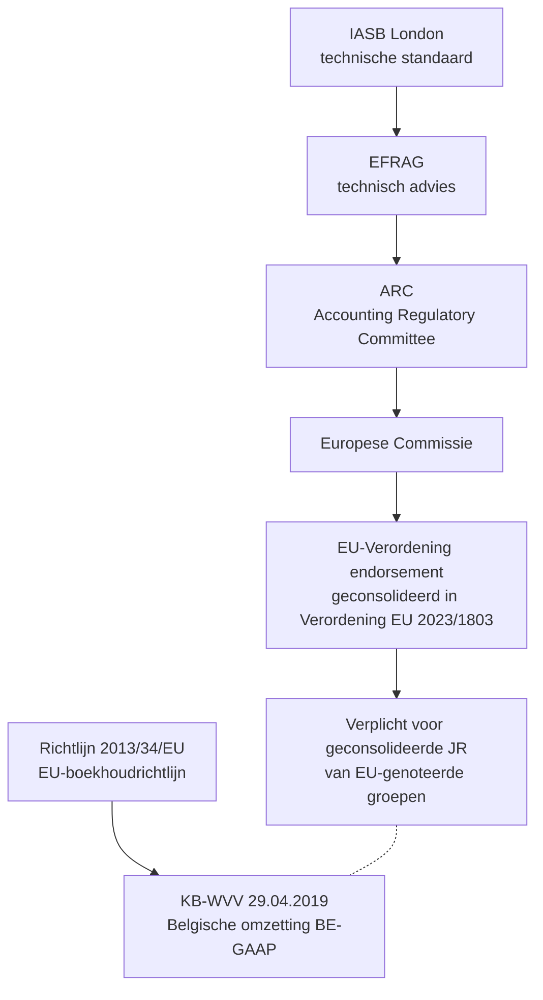
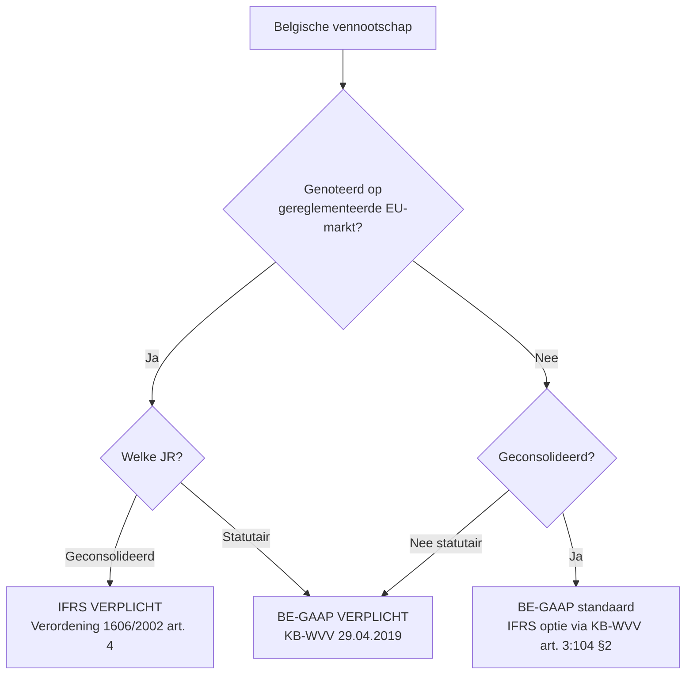
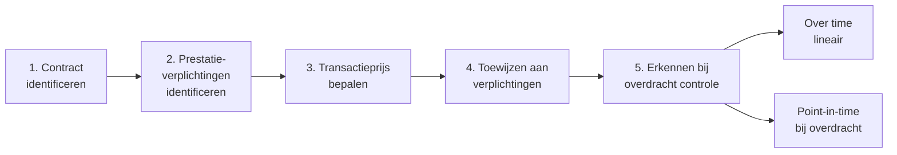

> **Samenvatting — kapstok voor herhaling.** PO 1.5 toetst geen IFRS-mechaniek uit het hoofd, maar de **scherpe BE-GAAP↔IFRS-verschillen** en de **letterlijke Richtlijn-tekst** (art. 6 + 7). Deze samenvatting bundelt het EU-kader, de Richtlijn-citaten, de vergelijkingsmatrix per balanspost en de klassieke valkuilen. Voor verhaal en routekaart: [[studiemateriaal/1-5|overzicht PO 1.5]]. Voor diepte: de vier leerstukken.

## 1. Take-away — wat je écht moet weten

- **Twee parallelle EU-kaders, niet één.** Verordening (EG) 1606/2002 = IFRS verplicht voor geconsolideerde JR van EU-genoteerden. Richtlijn 2013/34/EU = harmonisering nationaal BE-GAAP. Beide leven naast elkaar; geen 'IFRS overschrijft Richtlijn' of 'Richtlijn implementeert IFRS'.
- **Statutair = altijd BE-GAAP.** Ook voor Belgische dochters van genoteerde groepen. IFRS is in België uitsluitend van toepassing op de geconsolideerde JR — basis voor VenB-aangifte, dividend-test en NBB-neerlegging blijft de statutaire BE-GAAP-JR.
- **Voorzichtigheid is asymmetrisch — verliezen altijd, winsten enkel gerealiseerd.** Art. 6 lid 1 c van de Richtlijn splitst dit in drie sub-bepalingen (i + ii + iii) die elk apart bevraagd worden op examen. Niet kunnen reproduceren = punten verlies.
- **Herwaardering = lidstaat-keuze, niet onderneming-keuze.** Art. 7 laat de lidstaat 'toestaan of voorschrijven' — twee verschillende opties. België koos toestaan (KB-WVV art. 3:35 = facultatief), maar de Richtlijn opent uitdrukkelijk de mogelijkheid tot verplichting voor categorieën ondernemingen.
- **IFRS 16 schaft lessee-onderscheid af, lessor-onderscheid blijft.** Lessee: alle leases on-balance (ROU + leaseverplichting), uitzondering short-term ≤ 12 m + low-value. Lessor: financieel vs operationeel verschil blijft bestaan.
- **LIFO is verboden onder IAS 2, toegelaten onder BE-GAAP.** Sinds IAS 2-herziening 2003. Drie IAS 2-methodes: specifieke identificatie, FIFO, gewogen gemiddelde. BE-GAAP (art. 3:21 KB-WVV) staat vier methodes toe — LIFO + de drie andere.
- **Substance over form stuurt de IFRS-uitkomst.** Bij twijfel: wat IS de economische verrichting? Niet wat ZEGT het contract. Lease = financieringsverrichting (IFRS 16) · revenue = overdracht van controle (IFRS 15) · goodwill = test-actief, niet afschrijfbare-actief (IFRS 3 + IAS 36).

---

## 2. EU-architectuur — endorsement-traject + twee parallelle kaders

Een IASB-standaard wordt pas Belgisch toepasbaar na endorsement via EU-Verordening. Geen automatisme — EFRAG-advies en ARC-stemming kunnen blokkeren. Voor diepte: [[wat-is-ifrs-en-het-eu-kader]].

| | Verordening 1606/2002 | Richtlijn 2013/34/EU |
|---|---|---|
| **EU-instrument** | Verordening — direct bindend | Richtlijn — lidstaten omzetten |
| **Scope** | IFRS verplicht voor geconsolideerde JR genoteerden | Harmonisering nationaal BE-GAAP (alle ondernemingen, statutair + geconsolideerd niet-genoteerd) |
| **Belgische actie** | Geen omzetting nodig | KB-WVV 29.04.2019 omzetten |
| **Examen-relevantie** | "Welk EU-instrument verplicht IFRS?" — kennistest | "Welke beginselen?" — letterlijke tekst-stellingen |

---

## 3. Richtlijn 2013/34/EU art. 6 + 7 — letterlijke tekst (examen-zwaartepunt)

Drie van de vier J/F-stellingen op examen 2024-1 vraag 7B citeerden deze artikelen letterlijk. Voor diepte: [[voorzichtigheid-en-herwaardering-onder-richtlijn-2013-34]].

### Art. 6 lid 1 c — drie sub-bepalingen van voorzichtigheid

> **(i) Realisatiebeginsel.** *"Winsten mogen slechts worden opgenomen voor zover zij op de balansdatum gerealiseerd zijn."* Latente winsten blijven buiten resultaat. Belgische omzetting: KB-WVV art. 3:10.

> **(ii) Asymmetrische verplichtingen.** *"Alle verplichtingen die hun oorsprong hebben in het betrokken boekjaar of in de loop van een vorig boekjaar, worden opgenomen, ook als die verplichtingen pas bekend worden tussen de balansdatum en de datum waarop de balans wordt opgesteld."* Adjusting event uit IAS 10. Belgische omzetting: KB-WVV art. 3:11 + art. 3:23.

> **(iii) Negatieve waardecorrecties onvoorwaardelijk.** *"Alle negatieve waardecorrecties worden opgenomen, ongeacht of het boekjaar met winst of verlies wordt afgesloten."* Geen 'op te smukken' winst- of verliesjaar. Belgische omzetting: KB-WVV art. 3:35 e.v.

### Art. 7 lid 1 — herwaarderings-optie

> *"In afwijking van artikel 6, lid 1, punt i), kunnen de lidstaten toestaan of voorschrijven dat alle ondernemingen, of bepaalde categorieën ondernemingen, vaste activa tegen geherwaardeerde bedragen waarderen."*

**Nuance examen-favoriet**: 'toestaan OF voorschrijven' zijn twee verschillende lidstaat-keuzes. België koos toestaan (KB-WVV art. 3:35 = facultatief). Maar een examenstelling 'voor bepaalde categorieën verplicht voorgeschreven' = JUIST (Richtlijn-tekst toetst, niet Belgische omzetting).

---

## 4. Wanneer is IFRS verplicht in België?

**Praktische stelregel**: voor 95 %+ van Belgische ondernemingen blijft BE-GAAP de enige relevante norm. IFRS-praktijk leeft bij dochters van genoteerde groepen (Belgavia ↔ Bavaria-scenario) + bij genoteerde Belgische groepen zelf.

---

## 5. BE-GAAP ↔ IFRS — vergelijkingsmatrix per balanspost

De rode draad: BE-GAAP = voorzichtigheid + juridische vorm. IFRS = economische realiteit + fair value waar relevant. Voor diepte: [[vaste-activa-onder-ifrs]] (IAS 16 + IAS 38) en [[leasing-voorraden-en-opbrengsten-onder-ifrs]] (IFRS 16 + IAS 2 + IFRS 15).

| Balanspost | BE-GAAP | IFRS | Standaard |
|---|---|---|---|
| **Materiële vaste activa** | Cost − afschrijving; herwaardering art. 3:35 (facultatief) | Cost model OF revaluation model (keuze per klasse); componentbenadering verplicht; afschrijving niet stopzetten bij FV > BW | IAS 16 |
| **Immateriële vaste activa** | Activering R&D streng beperkt (CBN 2012/13) | Onderzoek: kost; ontwikkeling: activering bij 6 criteria; finite vs indefinite life | IAS 38 |
| **Goodwill (consolidatie)** | Afschrijving over economische levensduur | **Geen afschrijving** — jaarlijkse impairment-test op CGU-niveau | IFRS 3 + IAS 36 |
| **Voorraden** | FIFO / GMP / individualisering / **LIFO toegelaten** (art. 3:21) | FIFO / GMP / specifieke identificatie — **LIFO VERBODEN**; NRV-test | IAS 2 |
| **Leasing (lessee)** | Financieel (on-balance) vs operationeel (off-balance) — CBN 2015/4 | **ALLE leases on-balance**: ROU-actief + leaseverplichting (single model). Vrijstellingen: short-term + low-value | IFRS 16 |
| **Leasing (lessor)** | Idem als lessee — CBN 2015/4 | Onderscheid financieel/operationeel **blijft** behouden (IFRS 16.61-65) | IFRS 16 |
| **Opbrengsten** | Realisatie bij prestatie + factuurmoment (klasse 70) | 5-stappen-model · prestatieverplichtingen · over time vs point-in-time | IFRS 15 |
| **Voorzieningen** | Voorzichtigheid + waarschijnlijk + meetbaar (klasse 16) | Idem; disconteren bij lange termijn | IAS 37 |
| **Uitgestelde belastingen** | Optioneel boeken (klasse 168) — beperkt | **VERPLICHT** boeken op alle timing-verschillen | IAS 12 |
| **Presentatie + uitzonderlijke posten** | Schema KB-WVV; rubriek 'uitzonderlijke' afgeschaft sinds 2016 | IAS 1 — geen 'extraordinary items' (IAS 1.87) | IAS 1 |

---

## 6. Drie systeem-keuzes die alle verschillen sturen

| Keuze | BE-GAAP | IFRS | Praktische impact |
|---|---|---|---|
| **Doel rapportering** | Schuldeisers-bescherming + fiscaal | Investeerder-informatie | IFRS toont volatiliteit; BE-GAAP demp via voorzichtigheid |
| **Waarderings-basis** | Historische kostprijs (default) | Fair value waar relevant (IFRS 13) | IFRS-balans schommelt meer |
| **Vorm vs substantie** | Juridische vorm primair | Economische substantie primair | Leasing IFRS 16 = klassiek voorbeeld |

---

## 7. IFRS 16-lessee — single model in vier punten

> **Substance over form, on-balance verplicht.** Lessee-boeking bij aanvang: ROU-actief + leaseverplichting tegen contante waarde van toekomstige leasebetalingen.

| Aspect | IFRS 16 — lessee | BE-GAAP — operationele lease |
|---|---|---|
| **Balans bij aanvang** | ROU-actief + leaseverplichting | Geen balanspost (off-balance) |
| **Resultatenrekening jaarlijks** | Afschrijving ROU (bedrijfskost) + rente op leaseverplichting (financiële kost) | Huurkost (rekening 610) — één lijn |
| **EBITDA-impact** | Stijgt t.o.v. IAS 17-tijd (huur wordt afschrijving + rente onder de EBITDA-streep) | Lineair, geen impact op EBITDA-relatie |
| **Schuldgraad-impact** | Stijgt — leaseverplichting telt mee | Geen impact |
| **Vrijstellingen lessee** | Short-term ≤ 12 maanden zonder koopoptie + low-value asset (~5.000 USD nieuwwaarde) | n.v.t. |
| **Lessor-zijde** | Onderscheid financieel/operationeel BLIJFT (IFRS 16.61-65) | Idem |

---

## 8. IFRS 15-5-stappen — opbrengstverantwoording

**Verschil met BE-GAAP**: BE-GAAP boekt opbrengst bij prestatie / factuurmoment. IFRS 15 boekt bij **overdracht van controle** — kan vóór of na factuurmoment. Bij een onderhoudscontract: BE-GAAP boekt bij factuur, IFRS 15 boekt over de service-periode lineair.

---

## 9. IAS 38 — R&D-onderscheid in 6 criteria

Onderzoek (research) → ALTIJD in resultaat (IAS 38.54). Ontwikkeling (development) → VERPLICHT activeren mits alle 6 criteria cumulatief voldaan (IAS 38.57):

| # | Criterium | Wat het vereist |
|---|---|---|
| 1 | Technische haalbaarheid | Bewezen dat afgewerkt product mogelijk is |
| 2 | Intentie tot voltooiing | Vastgelegd in management-beslissing |
| 3 | Vermogen tot voltooiing | Technische + organisatorische capaciteit aanwezig |
| 4 | Toekomstige economische voordelen | Markt of intern gebruik aantoonbaar |
| 5 | Voldoende middelen | Financieel + technisch + materieel |
| 6 | Betrouwbare meting kostprijs | Tijdregistratie + materiaal-allocatie |

**BE-GAAP-pendant**: CBN 2012/13 staat activering toe mits algemene IMA-criteria (identificeerbaar + gecontroleerd + toekomstig voordeel). Uitkomst doorgaans gelijk; documentatie-discipline strenger onder IAS 38.

---

## 10. Klassieke valkuilen — examen-radar

| Valkuil | Wat klopt niet | Wat klopt wel |
|---|---|---|
| "IFRS overschrijft BE-GAAP" | IFRS verplicht alleen op consolidatie-niveau bij genoteerden | Statutair = altijd BE-GAAP — voor VenB + dividend + NBB |
| "IASB legt IFRS op" | IASB stelt op; EU endorseert via Verordening | Pas na publicatie EU-Verordening Belgisch toepasbaar |
| "Verordening 1606/2002 = Richtlijn 2013/34" | Twee verschillende EU-instrumenten met andere scope | 1606/2002 = IFRS verplicht voor genoteerde consolidaties · 2013/34 = harmonisering BE-GAAP |
| "Realisatie = factuur" | 'Gerealiseerd op balansdatum' is ruimer — externe transactie of geconcretiseerde toezegging | Realisatie ≠ facturatie. IFRS 15 5-stappen-model is daar een verfijning op |
| "Art. 7 = elke lidstaat laat herwaardering toe" | Art. 7 is een lidstaat-OPTIE — toestaan of voorschrijven of niets | België koos 'toestaan' (facultatief). Andere lidstaten kunnen anders kiezen |
| "Operationele lease blijft off-balance onder IFRS" | IFRS 16 (sinds 2019) zet ALLE lessee-leases on-balance | Vrijstellingen: short-term ≤ 12 m + low-value |
| "Goodwill afschrijven onder IFRS" | IFRS 3 + IAS 36: GEEN afschrijving | Jaarlijkse impairment-test verplicht |
| "LIFO toegelaten onder IFRS" | IAS 2.25 (sinds 2003): LIFO VERBODEN | Drie methodes onder IAS 2: specifieke identificatie · FIFO · GMP |
| "Degressief vrij toegelaten onder IAS 16" | IAS 16.60 vereist dat methode het verbruikspatroon weergeeft | Degressief alleen toegelaten indien verbruikspatroon degressief |
| "Ontwikkelingskosten activeren = altijd OK" | IAS 38.57 vereist 6 cumulatieve criteria | Bij ontbreken één criterium → in resultaat |
| "Afschrijving stopzetten als FV > BW" | IAS 16.55: afschrijving stopt alleen bij IFRS 5 of derecognition | Marktwaarde-evolutie heeft géén invloed op afschrijving |
| "Uitzonderlijke posten apart presenteren onder IFRS" | IAS 1.87 verbiedt 'extraordinary items' | Materiële posten apart vermelden (IAS 1.97), binnen gewone resultaten |
| "Belasting-latenties optioneel onder IFRS" | IAS 12 verplicht op ALLE timing-verschillen | BE-GAAP: facultatief (klasse 168); IFRS: imperatief |

---

## 11. Verdieping — leerstukken + concepten

### Leerstukken (primair voor herhaling)

- [[wat-is-ifrs-en-het-eu-kader]] — EU-architectuur, endorsement, IFRS 1 eerste toepassing
- [[voorzichtigheid-en-herwaardering-onder-richtlijn-2013-34]] — art. 6 + 7 met letterlijke citaten
- [[vaste-activa-onder-ifrs]] — IAS 16 + IAS 38 met componentbenadering en R&D-criteria
- [[leasing-voorraden-en-opbrengsten-onder-ifrs]] — IFRS 16 + IAS 2 + IFRS 15 + IAS 1.87

### Concepten (voor definitorisch opzoek)

**IFRS-kader**: [[ifrs]]

**IFRS-standaarden (eigen records)**: [[materiele-vaste-activa]] · [[immateriele-vaste-activa]] · [[opbrengstverantwoording]]

**BE-GAAP-pendants**: [[boekhoudbeginselen]] · [[belgisch-boekhoudrecht]] · [[vaste-activa]] · [[herwaardering-vast-actief]] · [[voorraden]] · [[leasing]] · [[financiele-leasing]] · [[operationele-leasing]]

---

*Samenvatting PO 1.5. Status: voorgesteld. Hand-gerendered (geen YAML-bron) — eerste versie na de vier leerstukken.*
