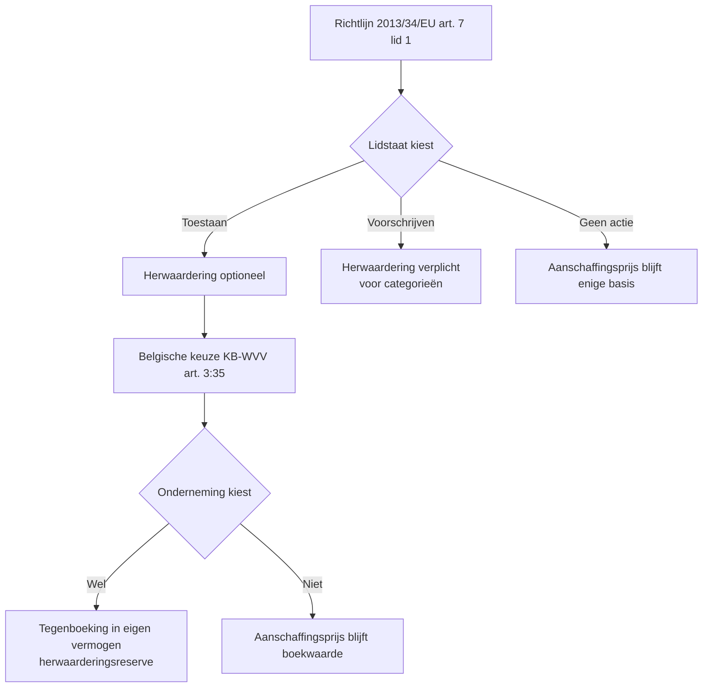

> **Leerstuk — één vraag, helemaal doorgewerkt.** Dit is het examen-zwaartepunt van PO 1.5: drie van de vier juist/fout-stellingen op het examen 2024-1 (vraag 7B) citeerden de Richtlijn-tekst van art. 6 en art. 7 letterlijk. Het EU-architectuur-kader staat in [[wat-is-ifrs-en-het-eu-kader]]; hier gaan we voluit door de Belgische boekhoudbeginselen zoals ze in de Richtlijn staan, en de herwaarderings-uitzondering die de lidstaten kunnen activeren. Voor verhaal en routekaart: [[studiemateriaal/1-5|overzicht PO 1.5]].

## Antwoord in één blik

Richtlijn 2013/34/EU legt in art. 6 negen algemene beginselen voor de jaarrekening op — going concern, bestendigheid, voorzichtigheid, matching, materialiteit, aanschaffingsprijs en drie andere — die elke lidstaat moet vastleggen voor de waardering van posten. Het voorzichtigheidsbeginsel (art. 6, lid 1, c)) wordt verder uitgesplitst in **drie sub-bepalingen** (i, ii, iii) die elk afzonderlijk bevraagd worden op examen. Art. 7 voegt daar één expliciete afwijking aan toe: lidstaten mogen herwaardering van vaste activa "**toestaan of voorschrijven**" — twee verschillende keuzes. België koos voor "toestaan" via de Belgische omzetting in het [[boekhoudbeginselen|KB-WVV]].

In dit leerstuk werk je elk van die drie sub-bepalingen en de herwaarderings-optie uit met de Richtlijn-tekst zelf en een concretisering bij Belgavia Manufacturing — de Belgische industriële dochter van een Duitse beursgenoteerde groep die we in heel PO 1.5 als bindcase volgen.

| Beginsel | Richtlijn 2013/34/EU | BE-GAAP omzetting | IFRS-pendant |
|---|---|---|---|
| Voorzichtigheid + asymmetrie | art. 6 lid 1 c) | KB-WVV art. 3:10 | IAS 1 fair presentation + IAS 37 |
| Realisatiebeginsel (winsten enkel gerealiseerd) | art. 6 lid 1 c) i) | KB-WVV art. 3:10 | IFRS 15 (overdracht controle) |
| Asymmetrie verplichtingen (verlies altijd, ook bij latere kennis) | art. 6 lid 1 c) ii) | KB-WVV art. 3:11 + art. 3:23 | IAS 37 + IAS 10 |
| Negatieve waardecorrecties onvoorwaardelijk | art. 6 lid 1 c) iii) | KB-WVV art. 3:35 e.v. | IAS 36 impairment |
| Herwaardering-optie | art. 7 lid 1 (toestaan/voorschrijven) | KB-WVV art. 3:35 (facultatief) | IAS 16.31 revaluation model |

In dit leerstuk werk je elk van die drie sub-bepalingen en de herwaarderings-optie uit met de Richtlijn-tekst zelf en een concretisering bij Belgavia Manufacturing — de Belgische industriële dochter van een Duitse beursgenoteerde groep die we in heel PO 1.5 als bindcase volgen.

---

## Art. 6 — negen algemene beginselen voor de jaarrekening

Art. 6 lid 1 van de Richtlijn somt negen bepalingen op (a tot en met i) die elke EU-lidstaat moet omzetten voor de waardering van posten in de jaarrekening. In elke specifieke waarderingsregel die je in de Belgische enkelvoudige jaarrekening tegenkomt — van afschrijving tot voorziening tot opbrengstverantwoording — zit één of meerdere van deze beginselen verwerkt. Geen losse lijst, wel een raamwerk.

| Punt | Beginsel | Wat het zegt |
|---|---|---|
| a | Going concern | De onderneming wordt verondersteld haar werkzaamheden voort te zetten |
| b | Bestendigheid | Waarderingsgrondslagen blijven van boekjaar tot boekjaar ongewijzigd |
| c | Voorzichtigheid | Asymmetrische waardering — uitgewerkt in drie sub-bepalingen (i, ii, iii) |
| d | Toerekening (matching) | Baten en lasten opnemen voor het boekjaar waarop zij betrekking hebben |
| e | Componenten apart waarderen | Bestanddelen van een actief- of passiefpost afzonderlijk waarderen |
| f | Vergelijkbaarheid openingsbalans | Openingsbalans neemt cijfers van vorige balans over |
| g | Materialiteit | Lidstaat-optie: bepaalde regels niet toepassen bij niet-materieel belang |
| h | Substance over form | Lidstaat-optie: opname + waardering volgens economische substantie |
| i | Aanschaffingsprijs / vervaardigingskostenbeginsel | Standaard-waarderingsbasis (waarvan art. 7 een lidstaat-afwijking toestaat) |

Twee architecturale nuances zijn examen-relevant. **Lidstaten mogen strenger zijn, niet milder** — de Richtlijn legt een minimum vast, en België kan via CBN-adviezen of het KB-WVV bijkomende voorzichtigheids-eisen opleggen, maar niet versoepelen. En **punt (c) is geen vaag beginsel**: het wordt onmiddellijk uitgesplitst in drie expliciete sub-bepalingen, elk apart en letterlijk geformuleerd. Dat is de reden waarom examenvragen over voorzichtigheid altijd terugvallen op één van die drie tekst-fragmenten — die werken we hierna één voor één uit.

---

## Voorzichtigheid uitgesplitst — de drie sub-bepalingen van art. 6 lid 1 c)

Het voorzichtigheidsbeginsel in Richtlijn 2013/34/EU is **geen weegschaal** waarop je per situatie mag kiezen tussen voorzichtig en optimistisch. Het is een asymmetrische regel die in drie sub-bepalingen voluit uitgeschreven staat. Elke afwijking in de jaarrekening-opmaak is een breuk met de Richtlijn-tekst — en de commissaris die de conformiteit toetst, leest deze drie zinnen letterlijk.

### Sub-bepaling (i) — realisatiebeginsel

> "Winsten mogen slechts worden opgenomen voor zover zij op de balansdatum gerealiseerd zijn."
> — Richtlijn 2013/34/EU, art. 6, lid 1, c), i)

Latente winsten — waardestijgingen zonder realisatie via een externe transactie — blijven buiten resultaat. "Gerealiseerd" wordt eng geïnterpreteerd: een externe transactie of een geconcretiseerde, juridisch afdwingbare toezegging is nodig. Een marktwaarde-stijging zonder verkoop is **geen** realisatie.

**Concretisering bij Belgavia.** Belgavia bezit een industriegrond in Mechelen, aangekocht in 2010 voor € 400.000 en op 31-12-2025 getaxeerd op € 600.000 — duurzame waardestijging, materieel verschil met boekwaarde. De latente meerwaarde van € 200.000 mag onder het realisatiebeginsel **niet** in resultaat. Er bestaat één mogelijke route om die meerwaarde toch zichtbaar te maken: herwaardering via de uitzondering in art. 7 (die we straks behandelen), waarbij de tegenboeking in eigen vermogen gaat. Belgavia kiest niet te herwaarderen; de grond blijft op € 400.000.

### Sub-bepaling (ii) — asymmetrische verplichtingen

> "Alle verplichtingen die hun oorsprong hebben in het betrokken boekjaar of in de loop van een vorig boekjaar, worden opgenomen, ook als die verplichtingen pas bekend worden tussen de balansdatum en de datum waarop de balans wordt opgesteld."
> — Richtlijn 2013/34/EU, art. 6, lid 1, c), ii)

Dit is de keerzijde van de asymmetrie: waar winsten enkel bij realisatie verschijnen, moeten verplichtingen voluit worden opgenomen zodra hun **oorsprong** in het boekjaar ligt — zelfs als ze pas in de opmaakperiode (januari–april) bekend worden.

**Concretisering bij Belgavia.** Stel dat in februari 2026, terwijl de jaarrekening 2025 wordt opgemaakt, een ex-werknemer Belgavia dagvaardt voor schadevergoeding wegens omstandigheden uit boekjaar 2025 — een arbeidsongeval, een betwist niet-concurrentiebeding. De juridische kennis dateert van na 31-12-2025, maar de rechtsfeiten dateren van 2025. Conform de tekst heeft de verplichting "haar oorsprong in het betrokken boekjaar" 2025, dus de voorziening hoort op de balans 2025. De aansluiting met IFRS heet hier "adjusting events after the reporting period" (IAS 10) en is identiek in werking.

### Sub-bepaling (iii) — negatieve waardecorrecties onvoorwaardelijk

> "Alle negatieve waardecorrecties worden opgenomen, ongeacht of het boekjaar met winst of verlies wordt afgesloten."
> — Richtlijn 2013/34/EU, art. 6, lid 1, c), iii)

De volledigheid is letterlijk: een onderneming mag in een **verliesjaar** niet de afschrijvingen weglaten om het resultaat "op te smukken", en in een **winstjaar** mag ze niet extra waardeverminderingen boeken om winst af te romen. Afschrijvingen, waardeverminderingen en voorzieningen zijn onvoorwaardelijk — de winstpositie van het jaar speelt geen rol.

**Concretisering bij Belgavia.** In een zwak EBIT-jaar zou de CFO geneigd kunnen zijn de jaarlijkse afschrijving op de persluchtmachine even uit te stellen — "we vangen volgend jaar wel in". De Richtlijn-tekst sluit dat scenario af. In een winstjaar geldt het spiegelbeeld: extra waardeverminderingen om de winst af te romen zijn evenmin toegelaten. De symmetrie is volledig.

> **Synthese in één lijn.** Verliezen altijd, winsten enkel als gerealiseerd, waardecorrecties los van het resultaat — drie sub-bepalingen, drie kanten van dezelfde asymmetrische munt. Elke examenvraag over voorzichtigheid valt op één van deze drie zinnen terug.

---

## Art. 7 — de herwaarderings-optie als lidstaat-keuze

Art. 6 lid 1 punt i) legt de aanschaffingsprijs of vervaardigingskosten op als waarderings-basis. Maar wat als die basis economisch achterhaald is? Wat met de Belgavia-grond die je in 2010 voor € 400.000 kocht en die in 2025 € 600.000 waard is? Het antwoord van de Richtlijn staat in art. 7.

> "In afwijking van artikel 6, lid 1, punt i), kunnen de lidstaten toestaan of voorschrijven dat alle ondernemingen, of bepaalde categorieën ondernemingen, vaste activa tegen geherwaardeerde bedragen waarderen."
> — Richtlijn 2013/34/EU, art. 7, lid 1

Twee woorden uit deze zin zijn examen-kritiek: **toestaan** en **voorschrijven**. Dat zijn twee verschillende lidstaat-keuzes, en het verschil bepaalt direct hoe je met examen-stellingen over art. 7 omgaat.

| Lidstaat-keuze | Wat het betekent | Voorbeeld |
|---|---|---|
| **Toestaan** | Herwaardering wordt een optie die de individuele onderneming mag uitoefenen | België — KB-WVV art. 3:35 (facultatief) |
| **Voorschrijven** | Herwaardering wordt verplicht voor (alle of) bepaalde categorieën ondernemingen | Hypothetisch — een lidstaat zou genoteerde nutsbedrijven kunnen verplichten |
| **Geen actie** | Aanschaffingsprijs blijft enige toegelaten basis | Lidstaten die art. 7 niet activeren |

**Belgische omzetting.** België koos voor "**toestaan**". De Belgische onderneming mag — onder voorwaarden — herwaarderen, maar moet niet. De voorwaarden zijn streng: de meerwaarde moet **duurzaam** zijn, en — als het actief noodzakelijk is voor de bedrijfsvoortzetting — verantwoord door de **rentabiliteit** van de onderneming. De tegenboeking gaat in klasse 12 (herwaarderingsmeerwaarden) in eigen vermogen, **niet** in resultaat — consistent met het realisatiebeginsel: de meerwaarde is niet gerealiseerd, dus niet in resultaat, maar mag wel zichtbaar worden op de balans via een aparte reserve.

**Drie beslissingslagen bij Belgavia.** Voor de grond Mechelen lopen drie successieve keuzes. Eerst de Richtlijn: lidstaten kiezen tussen toestaan, voorschrijven of geen actie. Dan België: "toestaan" (facultatief). Dan Belgavia zelf: niet herwaarderen. Drie lagen, drie keuzes — élke keuze had anders kunnen lopen. De grond blijft op € 400.000.

> **Examen-valkuil uit examen 2024-1 vraag 7B(d).** De stelling luidde: "voor bepaalde categorieën van ondernemingen wordt verplicht om bepaalde vaste activa aan geherwaardeerde waarde op te nemen". Antwoord: **juist**. Reden: art. 7 lid 1 opent expliciet de mogelijkheid tot lidstaat-verplichting ("voorschrijven") voor "bepaalde categorieën ondernemingen". De stelling toetst de **Richtlijn-tekst**, niet de Belgische omzetting. Dat België facultatief koos doet niet ter zake — de Richtlijn laat de verplichting toe, en dat is wat de vraag toetst.

---

## BE-GAAP, IFRS en de drie waarderingsbenaderingen

Art. 6 en art. 7 leveren samen één coherent waarderingsmodel: historische kostprijs als regel, herwaardering als uitzonderlijke lidstaat-optie. Onder [[ifrs]] is het uitgangspunt anders — reële waarde (fair value) waar de standaard dat relevant acht. Voor de Belgavia-groep, die parallel BE-GAAP en IFRS rapporteert, betekent dat drie waarderingsbenaderingen naast elkaar.

| Stelsel | Default | Alternatief | Tegenboeking herwaardering |
|---|---|---|---|
| BE-GAAP (omzetting Richtlijn 2013/34) | Aanschaffingsprijs / vervaardigingskosten | Facultatieve herwaardering MVA + FVA (KB-WVV art. 3:35) | Klasse 12 — eigen vermogen |
| IFRS — IAS 16 voor MVA | Cost model (alinea 30) | Revaluation model (alinea 31) — keuze per MVA-klasse | OCI — eigen vermogen |
| IFRS — IFRS 13 voor fair value-toepassingen | Fair value met hiërarchie level 1/2/3 | n.v.t. — fair value is het uitgangspunt | Afhankelijk van standaard |

BE-GAAP staat voorzichtig en statisch — de jaarrekening "ademt" weinig met de markt, en voor schuldeisers en fiscus is dat een feature. IFRS staat investeerder-georiënteerd en dynamisch: voor [[vaste-activa-onder-ifrs]] biedt IAS 16 een echte keuze tussen cost en revaluation per klasse, voor [[leasing-voorraden-en-opbrengsten-onder-ifrs|leasing en voorraden]] dwingt IFRS substantie-over-vorm-denken. De jaarrekening probeert de actuele economische positie te tonen, ook als die schommelt.

> **Belangrijke nuance.** IFRS is principle-based — de waarderingsregel staat per standaard. BE-GAAP is rule-based, met concretere waarderingsregels in het KB-WVV. Dat betekent **niet** dat IFRS "vrijer" is: de principes zijn streng, alleen anders geformuleerd. De rode draad onder de BE-GAAP↔IFRS-verschillen die de volgende leerstukken per balanspost uitwerken, is precies dit verschil in uitgangspunt — niet een gradatie van strengheid.

---

## Hoe checkt de accountant Richtlijn-conformiteit?

De tweede doelstelling van PO 1.5 vraagt dat je conformiteit met de wettelijke vereisten kunt toetsen. Voor Richtlijn 2013/34/EU loopt dat **indirect, via het [[boekhoudbeginselen|KB-WVV]]**: doordat het KB-WVV een integrale omzetting is, is KB-WVV-conformiteit normaliter gelijk aan Richtlijn-conformiteit. De commissaris controleert het KB-WVV en gaat ervan uit dat de Richtlijn volgt.

Vier praktische reflexen, één per Richtlijn-bepaling:

| Check | Richtlijn-grondslag | Wat dit bij Belgavia betekent |
|---|---|---|
| Waarderingsregels in toelichting consistent over de jaren? | art. 6 lid 1 b) — bestendigheid | Vergelijk Toelichting 6.1 over twee boekjaren |
| Latente meerwaarden NIET in resultaat? | art. 6 lid 1 c) i) — realisatiebeginsel | Controleer dat de grond op € 400k staat |
| Voorzieningen opgenomen voor verplichtingen met oorsprong in boekjaar? | art. 6 lid 1 c) ii) — asymmetrie | Doorloop post-balansdatum-correspondentie op claims uit 2025 |
| Afschrijvingen en waardeverminderingen onvoorwaardelijk geboekt? | art. 6 lid 1 c) iii) — negatieve waardecorrecties | Check dat zwakke EBIT-jaren geen "vergeten" afschrijvingen tonen |

Je kent de Richtlijn-tekst niet om ze te kennen, maar om ze als **conformiteitstoetsing** te gebruiken — precies wat een examenvraag toetst die je een Belgavia-achtige situatie voorlegt.

---

## Drie valkuilen

⚠️ **"Realisatiebeginsel betekent: geen winst tot factuur."** Te kort door de bocht. "Gerealiseerd op balansdatum" is een ruimer criterium — een externe transactie of geconcretiseerde toezegging volstaat, ook zonder factuur. Een verkocht-en-geleverd product met facturatie in januari hoort op de resultaten 2025 als de overdracht van controle in december gebeurde. De stelregel: realisatie ≠ facturatie. Het 5-stappen-model van IFRS 15 is daarop een verfijning, niet een breuk — zie [[leasing-voorraden-en-opbrengsten-onder-ifrs]].

⚠️ **"Art. 7 betekent: herwaardering is toegelaten in elke lidstaat."** Te kort door de bocht. Art. 7 is een **lidstaat-optie**. Elke lidstaat kiest zelf of hij herwaardering toelaat, verplicht maakt voor categorieën, of helemaal geen afwijking biedt. België koos "toestaan" — andere lidstaten konden anders kiezen. Examen-stellingen over art. 7 toetsen de **Richtlijn-tekst**, niet automatisch de Belgische praktijk. Lees elke stelling letterlijk: gaat ze over wat de Richtlijn toelaat, of over wat België deed?

⚠️ **"Art. 6 lid 1 c) ii) verplicht elke post-balansdatum-gebeurtenis op te nemen."** Fout. Alleen gebeurtenissen die een verplichting **bevestigen** die op balansdatum reeds bestond. Een **nieuw** feit na balansdatum — een brand in januari 2026, een nieuwe leverancier die in maart 2026 een kortingsaanbod terugtrekt — is een non-adjusting event: geen aanpassing van de balans 2025, wel toelichting indien materieel. Aansluiting met IAS 10 en CBN-advies 2019/04.

---

## Wanneer je dit snapt, ga dan naar

- [[wat-is-ifrs-en-het-eu-kader]] — Terug naar het EU-kader: endorsement-traject en IFRS 1 eerste toepassing.
- [[vaste-activa-onder-ifrs]] — IAS 16 en IAS 38: hoe waardeert IFRS materiële en immateriële vaste activa, en waar wijkt dat af van BE-GAAP?
- [[leasing-voorraden-en-opbrengsten-onder-ifrs]] — IFRS 16, IAS 2 en IFRS 15: de drie standaarden waar BE-GAAP en IFRS scherp uiteenlopen.
- [[studiemateriaal/1-5/samenvatting|Samenvatting PO 1.5]] — Voor herhaling vlak vóór het examen: Richtlijn-art-6/7-tekst en de vergelijking BE-GAAP/IFRS in één tabel.

## Doorklik naar concepten

Voor wie definitorisch detail wil opzoeken:

- [[boekhoudbeginselen]] · [[belgisch-boekhoudrecht]]
- [[herwaardering-vast-actief]] · [[vaste-activa]]
- [[ifrs]]

---

## Wettelijk fundament

- Algemene beginselen voor financiële verslaglegging — going concern, bestendigheid, voorzichtigheid, matching, materialiteit, aanschaffingsprijs: Richtlijn 2013/34/EU art. 6. Negen bepalingen in lid 1 (a tot en met i); voorzichtigheid (c) verder uitgesplitst in drie sub-bepalingen (i, ii, iii).
- Realisatiebeginsel — winsten enkel als gerealiseerd opnemen: Richtlijn 2013/34/EU art. 6, lid 1, c), i). Letterlijke tekst getoetst op examen 2024-1 vraag 7B.
- Asymmetrische verplichtingen — alle verplichtingen met oorsprong in boekjaar opnemen, ook bij latere kennis: Richtlijn 2013/34/EU art. 6, lid 1, c), ii). Aansluiting met IAS 10 en CBN-advies 2019/04 (gebeurtenissen na balansdatum).
- Negatieve waardecorrecties onvoorwaardelijk — afschrijvingen en waardeverminderingen ongeacht winst of verlies: Richtlijn 2013/34/EU art. 6, lid 1, c), iii).
- Herwaarderings-optie — lidstaat kan toestaan of voorschrijven: Richtlijn 2013/34/EU art. 7, lid 1. Lidstaat-keuze tussen optioneel ("toestaan") en verplicht voor categorieën ("voorschrijven"). Getoetst op examen 2024-1 vraag 7B (vierde stelling).
- Tegenboeking herwaardering in eigen vermogen (herwaarderingsreserve): Richtlijn 2013/34/EU art. 7, lid 2.
- Belgische omzetting voorzichtigheidsbeginsel — waarderingen voldoen aan voorzichtigheid, oprechtheid en goede trouw: KB-WVV 29.04.2019 art. 3:10, met uitwerking in art. 3:11 en volgende.
- Belgische omzetting herwaarderings-optie — facultatief: KB-WVV 29.04.2019 art. 3:35 (herwaardering MVA en FVA bij duurzame meerwaarde en, indien actief noodzakelijk voor bedrijfsvoortzetting, verantwoord door rentabiliteit). Tegenboeking in klasse 12 eigen vermogen; niet uitkeerbaar als dividend zolang niet gerealiseerd. Bijkomende regel over specificiteit van herwaarderingen: art. 3:34.
- IFRS-pendant herwaardering — revaluation model: IAS 16.31 (Verordening (EU) 2023/1803). Keuze per MVA-klasse: cost model (alinea 30) of revaluation model (alinea 31). Reële waarde minus latere afschrijvingen.
- IFRS-pendant fair value — definitie en hiërarchie: IFRS 13 (Verordening (EU) 2023/1803). Overkoepelende definitie en hiërarchie level 1/2/3 voor alle IFRS-standaarden die fair value gebruiken.

---

*Leerstuk PO 1.5. Status: voorgesteld — POC volgens ADR-037.*
