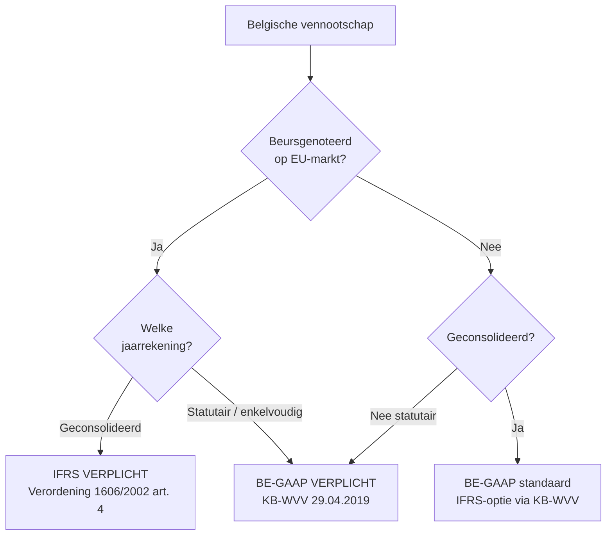
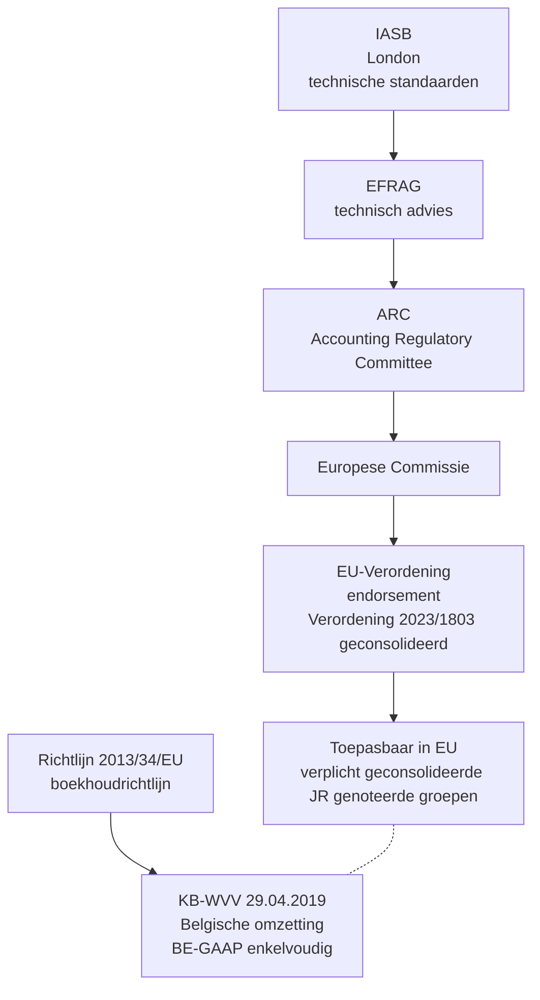
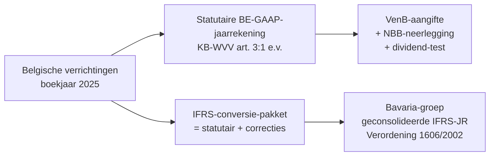

> **Leerstuk — één vraag, helemaal doorgewerkt.** Dit is de entry-fiche voor PO 1.5: eerst snappen wat [[ifrs|IFRS]] is, waar het vandaan komt en wanneer een Belgische onderneming ermee in aanraking komt. De vier voorzichtigheidsregels van Richtlijn 2013/34/EU staan in [[voorzichtigheid-en-herwaardering-onder-richtlijn-2013-34]]; de waarderingsverschillen per balanspost in [[vaste-activa-onder-ifrs]] en [[leasing-voorraden-en-opbrengsten-onder-ifrs]]. Voor verhaal en routekaart: [[studiemateriaal/1-5|overzicht PO 1.5]].

## Antwoord in één blik

IFRS is een coherent stelsel van internationale verslaggevingsstandaarden, in de EU **verplicht voor de geconsolideerde jaarrekening van beursgenoteerde groepen** — en optioneel voor de geconsolideerde jaarrekening van niet-genoteerde Belgische groepen. De statutaire jaarrekening van een Belgische vennootschap blijft altijd onder [[belgisch-boekhoudrecht|BE-GAAP]]: zij is de basis voor de vennootschapsbelasting, voor de dividend-test en voor de neerlegging bij de Nationale Bank. Twee EU-kaders leven naast elkaar: één verordening die IFRS oplegt aan genoteerde consolidaties, en één richtlijn die het nationale jaarrekeningenrecht harmoniseert.

In dit leerstuk leggen we het EU-kader één keer voluit neer — de andere leerstukken bouwen daarop verder, zonder de architectuur te herhalen.

---

## Wat is IFRS — een normensetter, geen wet

IFRS staat voor *International Financial Reporting Standards*. Sinds 2001 worden de standaarden uitgegeven door de **IASB** (International Accounting Standards Board), een private normensetter in Londen. De oudere standaarden — uitgegeven vóór 2001 door de voorganger IASC — heten **IAS** (International Accounting Standards) en blijven geldig. Vandaar dat je in de praktijk doorelkaar "IFRS" en "IAS/IFRS" hoort: de twee reeksen samen vormen het stelsel.

Belangrijk: de IASB legt zelf niets op. Geen overheid, geen rechtsmacht. Een IASB-standaard wordt pas bindend voor een Belgische onderneming **nadat de EU hem heeft goedgekeurd via een verordening** — dat is het endorsement-traject, dat we hieronder uitwerken.

Concreet: Bavaria Industries AG, de Duitse moeder van Belgavia Manufacturing NV, past IFRS toe op haar geconsolideerde jaarrekening niet omdat de IASB dat zegt, maar omdat zij op de Frankfurter beurs is genoteerd en Verordening (EG) 1606/2002 dat aan elke EU-genoteerde groep oplegt. Drie schakels: **IASB stelt op · EU endorseert · onderneming past toe.** De vaak gehoorde frase "IFRS legt op" is technisch fout.

| Term | Wie | Wat |
|---|---|---|
| **IASB** | International Accounting Standards Board | Private standaard-setter sinds 2001, gevestigd in Londen — stelt IFRS-standaarden op |
| **IFRS** | Standaarden van de IASB sinds 2001 | International Financial Reporting Standards — nieuwe reeks (IFRS 1, IFRS 9, IFRS 15, IFRS 16, …) |
| **IAS** | Standaarden van voorganger IASC (1973-2001) | International Accounting Standards — oude reeks, nog steeds van kracht (IAS 1, IAS 2, IAS 16, IAS 38, …) |
| **IFRIC / SIC** | Interpretatie-comités | International Financial Reporting Interpretations Committee en zijn voorganger Standing Interpretations Committee — bindende interpretaties |

---

## De EU-architectuur — endorsement via vier lagen

Een IASB-standaard moet vier instanties passeren vóór hij in België toepasbaar wordt. Dat traject heet **endorsement**: de EU controleert technisch én politiek of de standaard binnenkomt in het EU-recht. De vier lagen zien er zo uit:

**Laag 1 — IASB.** De IASB stelt een technische standaard op (bijvoorbeeld IFRS 18 *Presentation in Financial Statements*, gepubliceerd in 2024).

**Laag 2 — EFRAG.** De *European Financial Reporting Advisory Group* geeft een technisch advies aan de Europese Commissie: is de standaard verenigbaar met EU-recht, en is hij begrijpelijk, relevant, betrouwbaar en vergelijkbaar?

**Laag 3 — ARC.** Het *Accounting Regulatory Committee* (samengesteld uit vertegenwoordigers van de lidstaten) brengt een politiek-administratief advies uit waarover gestemd wordt.

**Laag 4 — Europese Commissie.** De Commissie keurt goed en publiceert via een EU-verordening. Vanaf publicatie is de standaard rechtstreeks toepasbaar in alle lidstaten. De **geconsolideerde versie** van alle geëndorseerde IAS/IFRS-standaarden is vandaag gepubliceerd als Verordening (EU) 2023/1803 — dat verordening-nummer komt op examenantwoorden terug als bron-aanduiding bij elke IFRS-claim.

Endorsement is **geen automatisme**. EFRAG kan negatief adviseren, de ARC kan blokkeren, de Commissie kan een standaard slechts gedeeltelijk goedkeuren. Klassiek voorbeeld: de macro-hedge-bepalingen van IFRS 9 werden jarenlang door de EU niet geëndorseerd, ook al was IFRS 9 zelf intussen verplicht voor andere onderwerpen. Een Belgische bank kon zich dus niet beroepen op die specifieke bepalingen — ze waren wel uitgegeven door de IASB, maar niet erkend in EU-recht.

> **Waarom je dit traject goed moet kennen.** Stagiairs antwoorden op het examen vaak dat "de IASB IFRS oplegt aan EU-vennootschappen". Dat is fout — en het examen toetst dat onderscheid. De juiste redenering loopt altijd via de EU-verordening; de IASB is bron, niet rechtsgrond.

---

## Twee parallelle EU-kaders

De Europese boekhoudkundige rechtsorde werkt met **twee parallelle kaders**, niet één. Beide zijn EU-recht, beide zijn bindend — maar ze regelen verschillende dingen voor verschillende ondernemingen. Wie ze door elkaar haalt komt op het examen vast te zitten.

**Kader A — Verordening (EG) 1606/2002**, de "IAS-Verordening". Een verordening is direct bindend in alle lidstaten, zonder dat een omzetting nodig is. Scope: enkel de **geconsolideerde jaarrekening** van **EU-beursgenoteerden**. Hier zit het IFRS-mandaat. Buiten die scope geldt de verordening niet — een Belgische statutaire jaarrekening bijvoorbeeld valt er volledig buiten.

**Kader B — Richtlijn 2013/34/EU**, de boekhoudrichtlijn. Een richtlijn moet door elke lidstaat in nationaal recht worden omgezet. In België gebeurt dat via het Wetboek van vennootschappen en verenigingen en het [[koninklijk-besluit-tot-uitvoering-wvv|KB-WVV]] van 29 april 2019. De richtlijn bevat de algemene beginselen voor de jaarrekening — voorzichtigheid, bestendigheid, going concern, materialiteit — en biedt lidstaten opties (zoals herwaardering van vaste activa). Die voorzichtigheidsbeginselen werken we uit in [[voorzichtigheid-en-herwaardering-onder-richtlijn-2013-34]].

|  | Verordening 1606/2002 | Richtlijn 2013/34/EU |
|---|---|---|
| **Soort EU-instrument** | Verordening — direct bindend | Richtlijn — lidstaten moeten omzetten |
| **Doel** | IFRS verplicht maken voor geconsolideerde JR van genoteerde groepen | Nationaal jaarrekeningenrecht harmoniseren — algemene beginselen, schema, jaarverslag |
| **Statutaire jaarrekening** | Niet van toepassing | Volledig van toepassing (basis BE-GAAP) |
| **Geconsolideerde jaarrekening** | Verplicht voor genoteerden | Verplicht voor niet-genoteerden (BE-GAAP-consolidatie); IFRS-optie via Belgisch recht |
| **Belgische omzetting** | Geen — rechtstreeks toepasbaar | KB-WVV 29.04.2019 (statutair + geconsolideerd) |
| **Bevoegd EU-orgaan voor wijzigingen** | EU Commissie + EFRAG-advies (endorsement) | Europees Parlement + Raad (richtlijn-wijziging) |

De synthese die je moet kennen: **1606/2002 is voor IFRS in genoteerde consolidaties; 2013/34 is voor de harmonisering van nationaal BE-GAAP.** Beide leven naast elkaar — er bestaat geen hiërarchie waarbij de Richtlijn IFRS "implementeert" of IFRS de Richtlijn "overschrijft".

---

## Wanneer is IFRS verplicht in België?

De praktijkvraag van elke stagiair: *"mijn cliënt is een Belgische vennootschap — moet ze IFRS toepassen?"* Drie scharniervragen sturen het antwoord.

**Scharniervraag 1 — beursgenoteerd?** Een Belgische BV of NV die niet genoteerd is op een gereglementeerde EU-markt valt buiten Verordening 1606/2002. Geen IFRS-verplichting, ongeacht groottecategorie, sector of activiteit. Dat is de grote meerderheid van het Belgische ondernemingslandschap.

**Scharniervraag 2 — statutair of geconsolideerd?** Zelfs voor een genoteerde groep geldt: de **statutaire (enkelvoudige) jaarrekening** blijft BE-GAAP. IFRS is uitsluitend van toepassing op de **geconsolideerde** jaarrekening. De reden is structureel: de statutaire jaarrekening is de basis voor de aangifte vennootschapsbelasting (primauteit van de boekhouding), voor de dividend-test bij uitkering, en voor de neerlegging bij de Nationale Bank van België. Die rechtsfeiten leven onder Belgisch recht, niet onder IFRS — en dus moet de statutaire jaarrekening Belgisch blijven.

**Scharniervraag 3 — niet-genoteerde groep, geconsolideerde jaarrekening?** Hier ligt een Belgische **optie**. Het Belgische boekhoudrecht laat een niet-genoteerde groep toe om haar geconsolideerde jaarrekening op te stellen volgens de door de EU goedgekeurde IFRS — historisch geregeld via het Koninklijk Besluit van 30 januari 2001, vandaag in het KB-WVV opgenomen. Twee kenmerken: de keuze geldt voor het geheel van de IFRS (niet selectief), en eenmaal gekozen is ze **onherroepbaar**. Toegepaste IAS 8-discipline: je kan niet jaar na jaar van stelsel wisselen.

Wat dit betekent voor de bindcase Belgavia: Belgavia Manufacturing NV is zelf niet genoteerd. Haar statutaire jaarrekening is dus BE-GAAP onder het KB-WVV. Maar omdat haar moeder Bavaria Industries AG genoteerd is op Frankfurt en moet IFRS-consolideren, levert Belgavia daarbovenop een **IFRS-pakket** aan de groep aan voor consolidatie. Belgavia werkt dus parallel met twee waarderingsstelsels — de natuurlijke "dual reporting"-context van een dochter van een genoteerde moeder.

De praktische synthese: voor de overgrote meerderheid van Belgische ondernemingen blijft BE-GAAP de enige relevante norm. IFRS-praktijk leeft bij **genoteerde Belgische groepen** (Solvay, KBC, Proximus, AB InBev) en bij **dochters van buitenlandse genoteerde groepen** die een rapporteringspakket aan de moeder moeten leveren — exact het profiel waar een stagiair-accountant in een Big Four of mid-tier-kantoor mee in aanraking komt.

---

## Het conceptueel kader en IAS 8 — wat als geen standaard antwoord geeft?

De IFRS-standaarden dekken niet elke verrichting. Voor nieuwe fenomenen — crypto-activa, sustainability-credits, emissierechten — is er soms geen specifieke standaard. Wat dan?

Het IASB onderhoudt naast de standaarden een **Conceptual Framework** (laatst herzien in 2018). Dat kader is **geen standaard** maar een interpretatieve gids. Het bevat de definities van basisbouwstenen (actief, verplichting, eigen vermogen, baten, lasten), erkenningscriteria, waarderingsbenaderingen en presentatiebeginselen.

Belangrijk: het kader is geen bindende regel. Een onderneming die wenst af te wijken van een specifieke IFRS-standaard kan zich **niet** beroepen op het conceptueel kader om die afwijking te rechtvaardigen. Het kader vult enkel hiaten in — daar waar geen standaard antwoord geeft.

[[ias-8|IAS 8]] geeft de **hiërarchie** die je dan moet volgen:

1. Specifieke IFRS-standaard die de verrichting regelt
2. Bij ontbreken: een andere IFRS-standaard die analoog van toepassing is
3. Bij ontbreken: het conceptueel kader
4. Bij ontbreken: andere standaard-setters die een vergelijkbaar kader hanteren (US GAAP, in laatste instantie)

> **Concreet — bitcoin op de balans.** Toen Europese vennootschappen rond 2017 voor het eerst bitcoin op de balans zetten, bestond er geen IFRS-standaard voor crypto-activa. Het IFRIC-comité heeft via de IAS 8-hiërarchie geredeneerd en is in 2019 tot een interpretatie gekomen: crypto kan kwalificeren als immaterieel vast actief onder IAS 38, of als voorraad onder IAS 2, afhankelijk van het houdersmotief (lange-termijn-houden of doorhandelen). Geen nieuwe standaard, wel een analoog redeneren binnen het bestaande kader.

Voor het examen volstaat dat je kent dat (a) het conceptueel kader bestaat, (b) het geen bindende regel is, en (c) IAS 8 de hiërarchie geeft. De detail-inhoud van het kader is examen-zijdelings.

---

## IFRS 1 — het eerste-toepasser-mechanisme

Een scenario uit de praktijk: een Belgische niet-genoteerde groep gaat naar de beurs, of wordt overgenomen door een genoteerde moeder. Vanaf dat moment moet de geconsolideerde jaarrekening onder IFRS — maar de balans van gisteren stond onder BE-GAAP. Hoe overbrug je dat?

[[ifrs-1|IFRS 1]] *First-time Adoption of International Financial Reporting Standards* regelt deze overgang. Het kernidee is **retrospectief**, niet prospectief: alsof IFRS altijd al gegolden zou hebben. Je past dus niet alleen vanaf nu de nieuwe regels toe — je herwerkt de openingsbalans op de overgangsdatum volgens IFRS.

Vier stappen:

1. **Identificeer de overgangsdatum** — de eerste dag van de vroegste vergelijkende periode die in de eerste IFRS-jaarrekening wordt gepresenteerd. Voor een groep die boekjaar 2026 voor het eerst onder IFRS publiceert met één vergelijkend jaar: 1 januari 2025.
2. **Stel een openingsbalans op** op de overgangsdatum waarin elke balanspost is gewaardeerd volgens de IFRS-standaarden die op de eerste IFRS-rapporteringsdatum van kracht zijn.
3. **Boek de verschillen** tussen de BE-GAAP-balans en de IFRS-openingsbalans rechtstreeks in het **eigen vermogen** — niet via het resultaat. Dat heet vaak de "transition equity"-aanpassing.
4. **Verschaf uitgebreide toelichting** — een aansluitingsstaat van eigen vermogen onder BE-GAAP naar eigen vermogen onder IFRS, plus een aansluiting van het totaalresultaat over de vergelijkende periode.

Twee nuances die in het examen kunnen terugkomen. Ten eerste: IFRS 1 bevat **verplichte uitzonderingen** op retrospectiviteit, op gebieden waar retroactief terugrekenen praktisch onmogelijk of buitensporig duur is (derecognition van financiële instrumenten, hedge accounting, schattingen, niet-controlerende belangen). Ten tweede: er zijn **optionele vrijstellingen** waar een onderneming bewust mag kiezen om niet retrospectief te gaan — bijvoorbeeld door de reële waarde op overgangsdatum te gebruiken als "deemed cost" voor materiële vaste activa, of door bedrijfscombinaties van vóór de overgangsdatum niet te herwerken.

Voor het examen hoef je de specifieke uitzonderingen niet uit het hoofd te kennen. Wel: dát ze bestaan, en dat de **retrospectieve openingsbalans** het hart van IFRS 1 is.

---

## Wat doet de accountant in dit kader?

Drie rollen lopen door PO 1.5 — komen ook in elk volgend leerstuk kort terug.

**Boekhouder of accountant.** Kent het EU-kader voldoende om de Belgische bronnen correct te plaatsen: Richtlijn 2013/34/EU boven het KB-WVV. Kan voor een dochter van een genoteerde moeder een IFRS-rapporteringspakket opbouwen — exact wat Belgavia doet voor Bavaria — met de relevante BE-GAAP↔IFRS-correcties op lease, R&D, voorraadwaardering en presentatie. De technische mechaniek van die correcties zit in [[vaste-activa-onder-ifrs]] en [[leasing-voorraden-en-opbrengsten-onder-ifrs]].

**Commissaris of bedrijfsrevisor.** Toetst bij genoteerde Belgische cliënten of IFRS correct is toegepast in de consolidatie. Signaleert BE-GAAP↔IFRS-correcties bij de conversie en beoordeelt of het rapporteringspakket aan de groepsstandaard voldoet. Bij niet-genoteerde dochters van genoteerde groepen blijft de statutaire jaarrekening onder BE-GAAP — maar het IFRS-pakket dat aan de moeder wordt geleverd valt ook binnen de auditscope.

**Adviseur.** Begeleidt cliënten bij overgangstrajecten: een eerste IFRS-toepassing bij beursgang of overname (toepassing van IFRS 1), advies over IFRS-keuzes (cost vs revaluation model onder IAS 16, lease-aanpak onder IFRS 16), en duiding van de impact op KPI's zoals EBITDA en schuldgraad na een IFRS-conversie.

In elke rol ligt de echte kennis-uitdaging niet in de IFRS-detail-mechaniek op zich, maar in het **verschil** met BE-GAAP. Dat is precies wat het examen toetst: niet of je IAS 16 uit je hoofd kent, wel of je kan duiden waar IAS 16 anders waardeert dan het KB-WVV.

---

## Drie valkuilen

⚠️ **"IFRS overschrijft BE-GAAP."** Fout. IFRS is alleen verplicht voor de geconsolideerde jaarrekening van genoteerden. De statutaire BE-GAAP-jaarrekening blijft in alle gevallen vereist — als basis voor de vennootschapsbelasting, voor de dividend-test en voor de neerlegging bij de Nationale Bank. Twee parallelle systemen, niet één boven het andere.

⚠️ **"De IASB legt IFRS rechtstreeks op."** Fout. De IASB stelt standaarden op; de EU keurt ze goed via een verordening; pas daarna zijn ze in België toepasbaar. Endorsement is geen automatisme — de macro-hedge-bepalingen van IFRS 9 zijn een klassiek voorbeeld van een IASB-standaard die jarenlang niet door de EU werd erkend.

⚠️ **"Verordening 1606/2002 en Richtlijn 2013/34/EU zijn hetzelfde."** Fout. Verordening 1606/2002 verplicht IFRS voor genoteerde consolidaties — beperkte scope, rechtstreeks bindend. Richtlijn 2013/34/EU harmoniseert het nationale BE-GAAP-jaarrekeningenrecht — brede scope, via nationale omzetting. Beide zijn EU-recht, beide actief — maar ze regelen verschillende dingen voor verschillende ondernemingen.

---

## Wanneer je dit snapt, ga dan naar

- [[voorzichtigheid-en-herwaardering-onder-richtlijn-2013-34]] — Diepe duik in Richtlijn 2013/34/EU art. 6 (vier voorzichtigheidsbeginselen) en art. 7 (herwaarderingsoptie) — examen-favoriet.
- [[vaste-activa-onder-ifrs]] — Hoe waardeert IFRS materiële en immateriële vaste activa (IAS 16 en IAS 38), en waar wijkt dat af van BE-GAAP?
- [[leasing-voorraden-en-opbrengsten-onder-ifrs]] — De drie grote BE-GAAP↔IFRS-divergenties: lease on-balance (IFRS 16), LIFO-verbod (IAS 2) en het vijfstappen-model voor opbrengsten (IFRS 15).
- [[studiemateriaal/1-5/samenvatting|Samenvatting PO 1.5]] — Voor herhaling vlak vóór het examen: EU-kader-overzicht en vergelijkingsmatrix per balanspost.

## Doorklik naar concepten

Voor wie definitorisch detail wil opzoeken:

- [[ifrs]]
- [[belgisch-boekhoudrecht]] · [[boekhoudbeginselen]]

---

## Wettelijk fundament

- IFRS-verplichting voor geconsolideerde jaarrekening van EU-beursgenoteerden: Verordening (EG) nr. 1606/2002, art. 4. Vanaf boekjaar 2005: alle EU-vennootschappen waarvan effecten zijn toegelaten tot een gereglementeerde markt stellen hun geconsolideerde jaarrekening op overeenkomstig de geëndorseerde IAS/IFRS.
- Lidstaat-opties bij niet-genoteerden en bij statutaire JR: Verordening (EG) nr. 1606/2002, art. 5. Lidstaten mogen IFRS toelaten of opleggen voor de statutaire jaarrekening van genoteerden, en voor de geconsolideerde of statutaire jaarrekening van niet-genoteerden.
- Geconsolideerde versie van alle geëndorseerde IAS/IFRS-standaarden: Verordening (EU) 2023/1803 van de Commissie van 13 augustus 2023. Bevat de actuele tekst van alle in de EU goedgekeurde IAS/IFRS — bron-citatie bij elke IFRS-claim.
- EU-boekhoudrichtlijn — algemene beginselen en harmonisering van nationaal BE-GAAP: Richtlijn 2013/34/EU van het Europees Parlement en van de Raad van 26 juni 2013. Vervangt de Vierde (78/660/EEG) en Zevende (83/349/EEG) Richtlijn. Diepere behandeling in [[voorzichtigheid-en-herwaardering-onder-richtlijn-2013-34]].
- Belgische omzetting Richtlijn 2013/34/EU: Wetboek van Vennootschappen en Verenigingen + KB van 29 april 2019 (KB-WVV). Basis voor de Belgische statutaire en geconsolideerde jaarrekening onder BE-GAAP.
- IFRS-optie voor niet-genoteerde Belgische groepen op geconsolideerd niveau: KB-WVV 29.04.2019, art. 3:104 §2 (historische basis: KB van 30 januari 2001 tot uitvoering van het Wetboek van vennootschappen). De keuze geldt voor het geheel van de IFRS en is **onherroepbaar**.
- Eerste-toepasser-mechanisme: IFRS 1 *First-time Adoption of International Financial Reporting Standards* (Verordening (EU) 2023/1803). Retrospectieve openingsbalans op overgangsdatum, verschillen via eigen vermogen, verplichte aansluitingsstaten in toelichting, plus een reeks verplichte uitzonderingen en optionele vrijstellingen.
- Hiërarchie bij ontbreken van een specifieke IFRS-standaard: IAS 8 *Grondslagen voor financiële verslaggeving, schattingswijzigingen en fouten* (Verordening (EU) 2023/1803). Stapsgewijs: specifieke standaard → analoge standaard → conceptueel kader → andere standaard-setters.

---

*Leerstuk PO 1.5. Status: voorgesteld — volgens ADR-037.*
