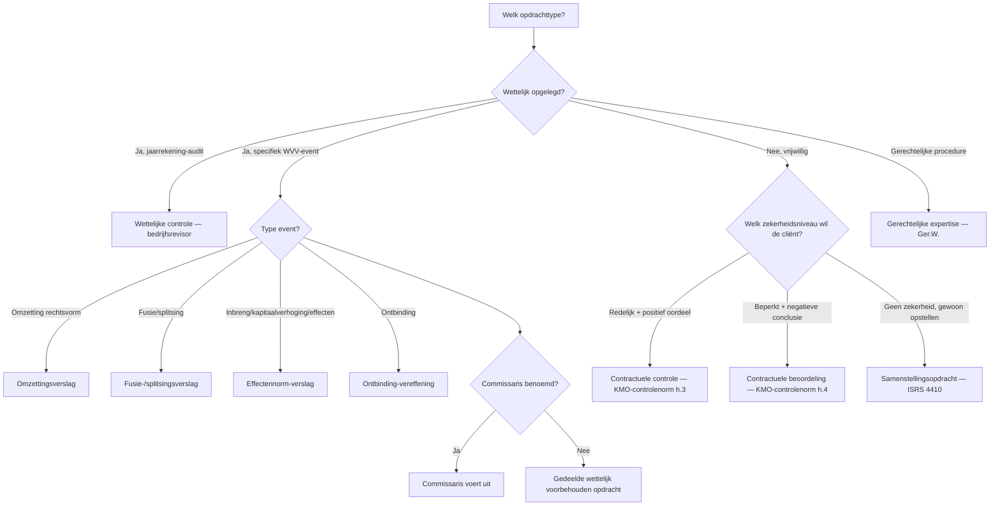
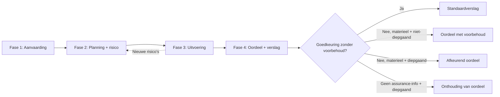

## Wat verwacht het examen van jou?

> [!abstract] Dit programmaonderdeel wordt getoetst op niveau *integratie*.
> Je moet meerdere concepten samen kunnen inzetten in complexe casussen — onderdelen herkennen, prioriteren, en tot een coherent oordeel komen.

**Taken** (uit het ITAA-examenprogramma):

> [!abstract]- **Taak 1** — Opstellen van specifieke verslagen en analyses voor de externe en interne verslaglegging, met inbegrip van juridische en contractuele opdrachten
>
> **Subtaken**:
> - privé-expertise op het gebied van bedrijfsboekhouding
> - gerechtelijke expertise op het gebied van bedrijfsboekhouding
> - opstellen van verslagen die leiden tot een attestering of een expertiseverslag bestemd om aan derden te worden afgegeven
>
> **Doelstellingen**:
> - Opstellen van specifieke verslagen en analyses voor de externe en interne verslaglegging, met inbegrip van het uitvoeren van wettelijke en contractuele opdrachten

## Leesgids

<!-- TODO: Opus-glue leesgids -->

## Waarom dit programmaonderdeel telt

<!-- TODO: Opus-glue waarom_po -->

## Waarom externe controle? Stakeholders, vertrouwen en de assurance-keten

<!-- TODO: Opus-glue oriëntatie -->

## Wettelijk kader en normenhiërarchie: Wet ITAA, KB plichtenleer, ITAA-normen, ISA en IESBA

> [!info] Hoort bij taak: Opstellen van specifieke verslagen en analyses voor de externe en interne verslaglegging, met inbegrip van juridische en…

<!-- TODO: Opus-glue thematisch-intro -->

- [[algemene-controlenorm-accountant|Algemene controlenorm voor de externe accountant]] · `cluster`
- [[kmo-controlenorm-accountant|KMO-controlenorm voor de externe accountant]] · `cluster`
- [[iesba-code-of-ethics|IESBA International Code of Ethics for Professional Accountants]] · `autoriteit`
- [[wettelijke-controleopdracht-commissaris|Wettelijke controleopdracht (commissaris-mandaat)]] · `begrip`
- [[contractuele-controleopdracht|Contractuele controleopdracht]] · `begrip`
- [[contractuele-beoordelingsopdracht|Contractuele beoordelingsopdracht]] · `begrip`

## Actoren in de externe controle: wie mag wat?

> [!info] Hoort bij taak: Opstellen van specifieke verslagen en analyses voor de externe en interne verslaglegging, met inbegrip van juridische en…

<!-- TODO: Opus-glue thematisch-intro -->

- [[bedrijfsrevisor|Bedrijfsrevisor]] · `autoriteit`
- [[gecertificeerd-accountant-ga|Gecertificeerd accountant (GA)]] · `autoriteit`
- [[gedeelde-wettelijk-voorbehouden-opdracht|Gedeelde wettelijk voorbehouden opdracht]] · `begrip`
- [[met-governance-belaste-personen|Met governance belaste personen]] · `autoriteit`
- [[kleine-vennootschap|Kleine vennootschap (WVV art. 1:24)]] · `begrip`
- [[public-interest-entity|Public Interest Entity (PIE)]] · `begrip`

## Opdrachttypes en zekerheidsniveaus vergeleken

Deze synthese vergelijkt de negen mogelijke opdrachttypes voor een GA of bedrijfsrevisor op één matrix: van geen zekerheid (samenstelling) tot redelijke zekerheid (controle), plus de WVV-event-opdrachten (fusie, splitsing, omzetting, effecten, ontbinding) en de gerechtelijke/private expertise. De keuze tussen de types is GEEN cliëntvoorkeur — ze wordt bepaald door (1) wettelijke verplichting + type event, (2) cliëntbehoefte, en (3) toepasselijke norm. Het verschil tussen positief oordeel en negatieve conclusie vloeit voort uit het zekerheidsniveau.

<!-- TODO: Opus-glue synthese-intro -->

| Opdrachttype | Zekerheidsniveau | Oordeel/Conclusie-vorm | Toepasselijke norm | Wie kan uitvoeren? | Typische triggerwoorden |
|---|---|---|---|---|---|
| Wettelijke controle (commissaris) | Redelijke zekerheid | Positief oordeel ('getrouw beeld') | ISA + Wet 7 december 2016 | Bedrijfsrevisor (commissaris) | 'wettelijke controle jaarrekening', 'commissaris' |
| Contractuele controle | Redelijke zekerheid | Positief oordeel | ITAA KMO-controlenorm h.3 | GA of bedrijfsrevisor | 'controle van de jaarrekening', 'getrouw beeld' |
| Contractuele beoordeling (review) | Beperkte zekerheid | Negatieve conclusie ('geen aanwijzingen') | ITAA KMO-controlenorm h.4 / ISRE 2400 | GA of bedrijfsrevisor | 'beperkte controle', 'beperkt nazicht', 'review' |
| Samenstellingsopdracht | GEEN zekerheid | Geen oordeel/conclusie | ITAA-norm Samenstelling (ISRS 4410) | GA of bedrijfsrevisor | 'opmaken jaarrekening', 'samenstelling' |
| Fusie-/splitsingsverslag | Specifiek (redelijkheid ruilverhouding) | Verklaring over redelijkheid van ruilverhouding | ITAA-norm Fusie en splitsing + WVV art. 12:25 e.v. | GA of bedrijfsrevisor (commissaris als die er is) | 'fusie', 'splitsing', 'ruilverhouding aandelen' |
| Omzettingsverslag | Beperkte zekerheid | Negatieve conclusie over of nettoactief overgewaardeerd is | ITAA-norm Omzetting + WVV Boek 14 | GA of bedrijfsrevisor | 'omzetting rechtsvorm', 'BV wordt NV' |
| Effectennorm-verslag | Beperkte zekerheid | Negatieve conclusie over getrouw en voldoende zijn financiële gegevens | ITAA-norm Effectennorm + WVV art. 5:121, 7:179, 7:191 | GA of bedrijfsrevisor | 'kapitaalverhoging', 'opheffing voorkeurrecht', 'converteerbare obligaties' |
| Ontbinding-vereffening | Beperkte zekerheid | Conclusie over staat van actief/passief | ITAA-norm Ontbinding-vereffening + WVV art. 2:71 e.v. | GA of bedrijfsrevisor | 'ontbinding', 'vereffening', 'staat van actief en passief' |
| Gerechtelijke/private expertise | n.v.t. (geen assurance, wel gemotiveerd verslag) | Boekhoudkundige analyse + besluit | Wet ITAA 2019 art. 3, 6° + Ger.W. art. 962 e.v. | GA (gerechtsdeskundige of privé) | 'gerechtsdeskundige', 'expertise', 'rechter benoemt' |

**Kerninzichten**:

- Het zekerheidsniveau (geen / beperkt / redelijk) bepaalt de vorm van het oordeel (geen / negatief / positief), niet andersom.
- GA en bedrijfsrevisor zijn dragers van ALLE niveaus behalve het commissarismandaat — dat is exclusief revisor.
- Bij voorbehouden opdrachten (WVV-events) vervalt het 'gedeelde' karakter zodra er een commissaris is — die voert ze uit.

_Bouwt op_: [[contractuele-controleopdracht]] · [[contractuele-beoordelingsopdracht]] · [[samenstellingsopdracht]] · [[wettelijke-controleopdracht-commissaris]] · [[redelijke-mate-van-zekerheid]] · [[beperkte-mate-van-zekerheid]] · [[fusie-splitsing-controleopdracht]] · [[omzetting-vennootschap-opdracht]] · [[effectennorm-opdracht]] · [[ontbinding-vereffening-opdracht]] · [[gerechtelijke-en-private-expertise]]
## Zekerheidsniveaus en alternatieve opdrachttypes: review en samenstelling

> [!info] Hoort bij taak: Opstellen van specifieke verslagen en analyses voor de externe en interne verslaglegging, met inbegrip van juridische en…

<!-- TODO: Opus-glue thematisch-intro -->

- [[redelijke-mate-van-zekerheid|Redelijke mate van zekerheid]] · `begrip`
- [[beperkte-mate-van-zekerheid|Beperkte mate van zekerheid]] · `begrip`
- [[samenstellingsopdracht|Samenstellingsopdracht]] · `cluster`
- [[beoordelingsverslag-elementen|Elementen van het beoordelingsverslag (review report)]] · `procedure`

## Bijzondere wettelijk voorbehouden opdrachten

> [!info] Hoort bij taak: Opstellen van specifieke verslagen en analyses voor de externe en interne verslaglegging, met inbegrip van juridische en…

<!-- TODO: Opus-glue thematisch-intro -->

- [[ontbinding-vereffening-opdracht|Ontbinding-vereffening opdracht van de gecertificeerd accountant]] · `cluster`
- [[fusie-splitsing-controleopdracht|Verslag bij fusie of splitsing van vennootschappen]] · `cluster`
- [[omzetting-vennootschap-opdracht|Verslag bij omzetting van een vennootschap]] · `cluster`
- [[effectennorm-opdracht|Verslag bij effectenverrichting (effectennorm)]] · `cluster`
- [[gerechtelijke-en-private-expertise|Gerechtelijke en private expertise door de gecertificeerd accountant]] · `begrip`
- [[wettelijke-verklaring-gecertificeerd-accountant|Wettelijke verklaring van de gecertificeerd accountant]] · `begrip`

## Aanvaarden van een audit-opdracht en opmaken van de opdrachtbrief

> [!info] Hoort bij taak: Opstellen van specifieke verslagen en analyses voor de externe en interne verslaglegging, met inbegrip van juridische en…

<!-- TODO: Opus-glue competentie-intro -->

[[competenties/aanvaarden-audit-opdracht|→ Volledige procedure]]

## Auditcyclus — vier fasen vergeleken

De auditcyclus structureert de hele externe-controleopdracht in vier opeenvolgende, deels iteratieve fasen: aanvaarding, planning en risico-inschatting, uitvoering, oordeel en verslag. Deze synthese vergelijkt per fase het doel, de kern-output en de norm-referentie zodat de stagiair een mentaal model heeft waarop alle specifieke records (planning, werkprogramma, gegevensgerichte werkzaamheden, oordeelstypes, verslag-elementen) gehangen worden.

<!-- TODO: Opus-glue synthese-intro -->

| Fase | Doel | Kern-output | Norm-referentie |
|---|---|---|---|
| 1. Aanvaarding + opdrachtbrief | Scope vastleggen, randvoorwaarden checken, ethische voorschriften toetsen | Opdrachtbrief + acceptatie-memo | KMO-norm §2 + Norm Opdrachtbrief |
| 2. Planning + risico-inschatting | Strategie + werkprogramma opbouwen op basis van inzicht in cliënt + IC | Risk assessment memo + werkprogramma | KMO-norm §70-§77 |
| 3. Uitvoering + assurance-informatie | Test of controls + gegevensgerichte werkzaamheden uitvoeren, evidence verzamelen | Werkpapieren + getoetste populaties + bevindingen | KMO-norm §85-§115 |
| 4. Conclusie + verslag | Oordeel vormen, verslag schrijven, communicatie afsluiten | Controleverslag + management letter + management representation letter | KMO-norm §116-§120 + Algemene controlenorm §2 |

_Bouwt op_: [[auditplanning]] · [[auditstrategie]] · [[werkprogramma-audit]] · [[risico-inschatting-audit]] · [[gegevensgerichte-werkzaamheden]] · [[toetsing-interne-beheersing]] · [[controledocumentatie]] · [[controleoordeel-types]] · [[controleverslag-elementen]]
## Verwerven van kennis van de cliënt en zijn omgeving in een audit-opdracht

> [!info] Hoort bij taak: Opstellen van specifieke verslagen en analyses voor de externe en interne verslaglegging, met inbegrip van juridische en…

<!-- TODO: Opus-glue competentie-intro -->

[[competenties/verwerven-kennis-van-clientonderneming-audit|→ Volledige procedure]]

## Uitvoeren van risico-inschatting en bepalen van het materieel belang in een audit

> [!info] Hoort bij taak: Opstellen van specifieke verslagen en analyses voor de externe en interne verslaglegging, met inbegrip van juridische en…

<!-- TODO: Opus-glue competentie-intro -->

[[competenties/uitvoeren-risico-inschatting-en-materialiteit-audit|→ Volledige procedure]]

## Fraude-risico in de audit: typologie, driehoek en risicofactoren

> [!info] Hoort bij taak: Opstellen van specifieke verslagen en analyses voor de externe en interne verslaglegging, met inbegrip van juridische en…

<!-- TODO: Opus-glue thematisch-intro -->

- [[fraude-versus-fout|Fraude versus fout — onderscheid in audit en interne controle]] · `synthese`
- [[fraudedriehoek|Fraude-driehoek (motief – gelegenheid – rationalisatie)]] · `begrip`
- [[frauderisicofactoren|Frauderisicofactoren (ISA 240)]] · `begrip`
- [[fraudetypologie-acfe|Fraudetypologie ACFE (drie hoofdtypen)]] · `begrip`

## Opstellen van de auditstrategie en het werkprogramma

> [!info] Hoort bij taak: Opstellen van specifieke verslagen en analyses voor de externe en interne verslaglegging, met inbegrip van juridische en…

<!-- TODO: Opus-glue competentie-intro -->

[[competenties/opstellen-auditstrategie-en-werkprogramma|→ Volledige procedure]]

## Controle-instrumenten en testing-soorten: het instrumentarium van de auditor

> [!info] Hoort bij taak: Opstellen van specifieke verslagen en analyses voor de externe en interne verslaglegging, met inbegrip van juridische en…

<!-- TODO: Opus-glue thematisch-intro -->

- [[assurance-informatie|Assurance-informatie (controle-informatie)]] · `begrip`
- [[toetsing-interne-beheersing|Toetsing van interne beheersing (test of controls)]] · `cluster`
- [[gegevensgerichte-werkzaamheden|Gegevensgerichte werkzaamheden (substantive procedures)]] · `cluster`
- [[cijferanalyses-audit|Cijferanalyses bij een audit]] · `cluster`
- [[externe-bevestiging-audit|Externe bevestiging (audit)]] · `cluster`
- [[steekproef-audit|Steekproef bij een audit (audit sampling)]] · `cluster`
- [[schriftelijke-bevestiging-management|Schriftelijke bevestiging van het management (management representation letter)]] · `begrip`
- [[beweringen-audit|Beweringen (assertions) in een audit]] · `begrip`

## Selecteren en uitvoeren van controle-instrumenten (test of controls + gegevensgerichte werkzaamheden)

> [!info] Hoort bij taak: Opstellen van specifieke verslagen en analyses voor de externe en interne verslaglegging, met inbegrip van juridische en…

<!-- TODO: Opus-glue competentie-intro -->

[[competenties/selecteren-en-uitvoeren-controle-instrumenten-audit|→ Volledige procedure]]

## Bijzondere uitvoeringsthema's: schattingen, automatisering en het werk van interne auditors

> [!info] Hoort bij taak: Opstellen van specifieke verslagen en analyses voor de externe en interne verslaglegging, met inbegrip van juridische en…

<!-- TODO: Opus-glue thematisch-intro -->

- [[boekhoudkundige-schattingen-audit|Boekhoudkundige schattingen (audit-perspectief)]] · `begrip`
- [[specifieke-kwesties-automatisering-audit|Specifieke kwesties bij automatisering (audit-perspectief)]] · `begrip`
- [[gebruik-werk-interne-auditors-audit|Gebruikmaken van de werkzaamheden van interne auditors bij externe controle]] · `cluster`

## Documenteren van de revisiewerkzaamheden in het auditdossier

> [!info] Hoort bij taak: Opstellen van specifieke verslagen en analyses voor de externe en interne verslaglegging, met inbegrip van juridische en…

<!-- TODO: Opus-glue competentie-intro -->

[[competenties/documenteren-auditdossier|→ Volledige procedure]]

## Kwaliteitsbeheersing rond het auditdossier: kantoor, opdracht en review

> [!info] Hoort bij taak: Opstellen van specifieke verslagen en analyses voor de externe en interne verslaglegging, met inbegrip van juridische en…

<!-- TODO: Opus-glue thematisch-intro -->

- [[controledocumentatie|Controledocumentatie / controledossier]] · `cluster`
- [[kwaliteitsbeheersing-opdrachtniveau|Kwaliteitsbeheersing op opdrachtniveau]] · `cluster`
- [[intern-kwaliteitsmanagement-kantoor|Intern kwaliteitsmanagement op kantoorniveau]] · `cluster`
- [[delegatie-en-supervisie-audit|Delegatie en supervisie binnen het auditteam]] · `cluster`
- [[opdrachtgerichte-kwaliteitsbeoordeling|Opdrachtgerichte kwaliteitsbeoordeling (EQR)]] · `cluster`

## Beoordelen van regelmatigheid, waarachtigheid en getrouw beeld van de jaarrekening

> [!info] Hoort bij taak: Opstellen van specifieke verslagen en analyses voor de externe en interne verslaglegging, met inbegrip van juridische en…

<!-- TODO: Opus-glue competentie-intro -->

[[competenties/beoordelen-getrouw-beeld-en-regelmatigheid|→ Volledige procedure]]

## Het oordeel: afwijkingen, materialiteit en KAM

> [!info] Hoort bij taak: Opstellen van specifieke verslagen en analyses voor de externe en interne verslaglegging, met inbegrip van juridische en…

<!-- TODO: Opus-glue thematisch-intro -->

- [[afwijking-van-materieel-belang|Afwijking van materieel belang]] · `begrip`
- [[controleoordeel-types|Types van controleoordeel]] · `cluster`
- [[aangepast-oordeel|Aangepast oordeel (modified opinion)]] · `begrip`
- [[paragraaf-ter-benadrukking|Paragraaf ter benadrukking van bepaalde aangelegenheden]] · `begrip`
- [[paragraaf-overige-aangelegenheden|Paragraaf inzake overige aangelegenheden]] · `begrip`
- [[kernpunten-van-controle|Kernpunten van de controle (KAM)]] · `begrip`

## Opstellen van het controleverslag en formuleren van het oordeel

> [!info] Hoort bij taak: Opstellen van specifieke verslagen en analyses voor de externe en interne verslaglegging, met inbegrip van juridische en…

<!-- TODO: Opus-glue competentie-intro -->

[[competenties/opstellen-controleverslag-en-formuleren-oordeel|→ Volledige procedure]]

## Communiceren met audit-comité en bestuur over auditbevindingen

> [!info] Hoort bij taak: Opstellen van specifieke verslagen en analyses voor de externe en interne verslaglegging, met inbegrip van juridische en…

<!-- TODO: Opus-glue competentie-intro -->

[[competenties/communiceren-met-bestuur-en-auditcomite|→ Volledige procedure]]

## Communicatie met management, governance en de brug naar interne controle (PO 1.7)

> [!info] Hoort bij taak: Opstellen van specifieke verslagen en analyses voor de externe en interne verslaglegging, met inbegrip van juridische en…

<!-- TODO: Opus-glue thematisch-intro -->

- [[communicatie-met-management-governance|Communicatie met management en met governance belaste personen]] · `cluster`
- [[communicatie-tekortkomingen-interne-beheersing|Communicatie van tekortkomingen in de interne beheersing]] · `cluster`

## Toepassen van professional skepticism en deontologische normen tijdens de audit

> [!info] Hoort bij taak: Opstellen van specifieke verslagen en analyses voor de externe en interne verslaglegging, met inbegrip van juridische en…

<!-- TODO: Opus-glue competentie-intro -->

[[competenties/toepassen-professional-skepticism-en-deontologie-audit|→ Volledige procedure]]

## Antiwitwas- en tuchtrechtelijk kader rond de externe controle

> [!info] Hoort bij taak: Opstellen van specifieke verslagen en analyses voor de externe en interne verslaglegging, met inbegrip van juridische en…

<!-- TODO: Opus-glue thematisch-intro -->

- [[antiwitwasmeldingsplicht-accountant|Antiwitwasmeldingsplicht voor de accountant]] · `cluster`
- [[tuchtrechtelijke-aansprakelijkheid-accountant|Tuchtrechtelijke aansprakelijkheid van de accountant]] · `regel`
- [[beroepsaansprakelijkheid-accountant|Beroepsaansprakelijkheid van de accountant]] · `regel`

## Reflectie: kwaliteitscontrole, beroepsaansprakelijkheid en het levende beroep

<!-- TODO: Opus-glue oriëntatie -->

## Synthese-stappenplan

<!-- TODO: Opus-glue synthese -->

## Cheatsheet

### Kritische drempelwaarden

| Concept | Naam | Waarde | Eenheid | Gevolg |
|---|---|---|---|---|
| [[controledocumentatie]] | Minimumbewaartermijn werkdocumenten — algemene controlenorm | 10 jaar | jaren vanaf datum verslag | Werkdocumenten moeten minstens 10 jaar bewaard worden onder de Algemene Controlenorm §3 |
| [[controledocumentatie]] | Minimumbewaartermijn dossier — KMO-controlenorm | 5 jaar | jaren vanaf ondertekening verslag | Onder de KMO-controlenorm bedraagt de bewaarperiode minimaal 5 jaar (§49) |
| [[controledocumentatie]] | Termijn samenstelling definitief controledossier | 60 dagen | dagen na datum controleverslag | ISA 230 §14 + ISQM 1 vragen tijdige samenstelling van het definitieve dossier; de gangbare termijn die ISQM 1 als richtl… |

### Vergelijkingsparen-matrix

| Concept | Verwarrend met | Trigger |
|---|---|---|
| [[afwijking-van-materieel-belang]] | [[materieel-belang-audit]] | Examenvraag: 'de auditor stelt 5% × winst voor belasting voorop' → materieel belang (drempel). 'De auditor stelt een overwaardering van € 280.000 vast' → afwijking van materieel belang. |
| [[algemene-controlenorm-accountant]] | [[kmo-controlenorm-accountant]] | Examenvraag: 'welke norm regelt een contractuele audit bij een KMO?' → KMO-controlenorm. 'Welke norm regelt de algemene plichten van de accountant bij elke controle?' → Algemene controlenorm. |
| [[antiwitwasmeldingsplicht-accountant]] | [[beroepsgeheim-accountant]] | Examenscenario 'accountant ontdekt vermoeden van witwassen' → meldingsplicht wint van beroepsgeheim. Maar bij 'accountant vermoedt fiscale fraude zonder witwas-element' → beroepsgeheim blijft, geen CFI-melding. |
| [[bedrijfsrevisor]] | [[gecertificeerd-accountant-ga]] | Examenvraag: 'wettelijke controle van de jaarrekening' → enkel bedrijfsrevisor. 'Inbreng in natura, geen commissaris' → beide kunnen. |
| [[beoordelingsverslag-elementen]] | [[controleverslag-elementen]] | Examen-zin: type opdracht = controle → controleverslag. Type = beoordeling/review → beoordelingsverslag. |
| [[beroepsaansprakelijkheid-accountant]] | [[tuchtrechtelijke-aansprakelijkheid-accountant]] | Examen-zin 'schadevergoeding' → civielrechtelijk (art. 44 Wet ITAA). 'Schorsing' / 'schrapping' → tuchtrechtelijk (ITAA-tuchtcommissie). |
| [[communicatie-tekortkomingen-interne-beheersing]] | [[evaluatie-interne-controle]] | Vraag 'hoe beoordeel je IC?' → evaluatie-interne-controle. Vraag 'wat doe je met een gevonden tekortkoming?' → ISA 265. |
| [[contractuele-beoordelingsopdracht]] | [[contractuele-controleopdracht]] | Examenwoord 'controle' / 'audit' / 'getrouw beeld' → controle. Woord 'beoordeling' / 'review' / 'beperkt nazicht' → beoordeling. |
| [[contractuele-beoordelingsopdracht]] | [[samenstellingsopdracht]] | Geeft de beroepsbeoefenaar zekerheid (zelfs beperkt)? Ja → beoordeling. Nee, hij helpt enkel opstellen? → samenstelling. |
| [[contractuele-controleopdracht]] | [[wettelijke-controleopdracht-commissaris]] | Examenvraag: 'is een commissaris benoemd?' Zo nee + audit gevraagd → contractuele controle (KMO-controlenorm). Zo ja → wettelijke controle (ISA + bedrijfsrevisor). |
| [[contractuele-controleopdracht]] | [[contractuele-beoordelingsopdracht]] | Examen-keuze: zoekt de cliënt 'audit'/'controle' → controleopdracht; zoekt hij 'review'/'beperkte controle'/'beperkt nazicht' → beoordelingsopdracht. |
| [[controleoordeel-types]] | [[controleoordeel-types]] | Examenvraag: ‘systematische overwaardering van voorraden die balans en resultaat omslaat’ → afkeurend. ‘één deelneming € 250.000 te hoog gewaardeerd’ → oordeel met voorbehoud. |
| [[controleoordeel-types]] | [[controleoordeel-types]] | Examenvraag: ‘klant weigert openingsbalans + alle aankoopfacturen H1’ → oordeelonthouding. ‘inventarisatie van één magazijn niet bijwoonbaar, alternatieve procedures slagen niet’ → oordeel met voorbehoud. |
| [[fraude-versus-fout]] | [[afwijking-van-materieel-belang]] | Examen-zin met 'opzettelijk' / 'om te misleiden' → fraude. 'Vergissing' / 'verkeerde inschatting' → fout. |
| [[fraude-versus-fout]] | [[verspilling]] | Examen-zin met 'inefficiënt' / 'idle capacity' / 'overstock' zonder boekhoudfout → verspilling. |
| [[fusie-splitsing-controleopdracht]] | [[omzetting-vennootschap-opdracht]] | Examenvraag: 'twee vennootschappen worden één' / 'splitsing in twee NV's' → fusie-/splitsingsverslag. 'BV wordt NV' / 'verandering rechtsvorm' → omzettingsverslag. |
| [[gebruik-werk-interne-auditors-audit]] | [[interne-audit]] | Vraag 'wat doet interne audit?' → record 'interne-audit'. Vraag 'mag externe auditor steunen op interne audit?' → dit record. |
| [[gegevensgerichte-werkzaamheden]] | [[toetsing-interne-beheersing]] | Hoog inherent risico en/of geen vertrouwen in IC → vooral gegevensgericht. Goede IC + intentie tot steunen → mix met toetsing IC. |
| [[gerechtelijke-en-private-expertise]] | [[contractuele-controleopdracht]] | Examenvraag: 'is er een rechter of een geschil?' → expertise. 'is er een audit van de jaarrekening gevraagd?' → controle. |
| [[iesba-code-of-ethics]] | [[onafhankelijkheid-externe-accountant]] | Belgisch examen → KB plichtenleer of ITAA-norm citeren. Internationale context of conceptuele vraag → IESBA. Vaak werken beide samen: 'volgens de IESBA-code en de Belgische omzetting...'. |
| [[iesba-code-of-ethics]] | [[beroepsgeheim-accountant]] | Internationaal/conceptueel → IESBA vertrouwelijkheid. Concreet Belgisch geval met sanctie-vraag → beroepsgeheim accountant. |
| [[inherent-risico]] | [[intern-beheersingsrisico]] | Examen: praat de opgave over de complexiteit van de transacties zelf → inherent risico. Praat ze over zwakheden in de interne controleprocessen → intern beheersingsrisico. |
| [[intern-kwaliteitsmanagement-kantoor]] | [[kwaliteitsbeheersing-opdrachtniveau]] | Vraag focust op één specifieke audit-opdracht en de review erop → ISA 220. Vraag focust op kantoor-procedures, beleid, monitoring over alle opdrachten heen → ISQM 1 / ITAA-norm IKM. |
| [[kernpunten-van-controle]] | [[paragraaf-ter-benadrukking]] | Examenvraag: 'aangelegenheid waar de auditor veel werk in heeft gestoken' → KAM. 'De auditor wijst de lezer op een belangrijke toelichting in de jaarrekening' → emphasis of matter. |
| [[kleine-vennootschap]] | [[microvennootschap]] | Examen: omzet € 500K → check micro-drempels eerst; als ook personeel ≤ 10 én balans ≤ € 450K én niet moeder/dochter → micro. Zo niet → klein. |
| [[kleine-vennootschap]] | [[grote-vennootschap-wvv]] | Examen: omzet € 15M, personeel 80, balans € 8M → overschrijdt 3 drempels → groot. Verkort niet meer toegestaan, commissaris verplicht. |
| [[omzetting-vennootschap-opdracht]] | [[ontbinding-vereffening-opdracht]] | Examen-keuze: 'verandert de rechtsvorm?' → omzettingsverslag. 'wordt de vennootschap stopgezet?' → ontbinding-vereffening. |
| [[opdrachtbrief-accountant]] | [[wettelijke-controleopdracht-commissaris]] | Examenvraag: 'wat regelt de relatie tussen accountant en cliënt?' → contractueel = opdrachtbrief, wettelijke controle = benoemingsbesluit AV. |
| [[opdrachtgerichte-kwaliteitsbeoordeling]] | [[]] | Examenvraag-formulering 'wie reviewt wat'. |
| [[paragraaf-overige-aangelegenheden]] | [[paragraaf-ter-benadrukking]] | Examen: 'vergelijkende cijfers door andere auditor gecontroleerd' → other matter (info niet in jaarrekening). 'Belangrijke toelichting bij continuïteit' → emphasis of matter (info in jaarrekening). |
| [[paragraaf-overige-aangelegenheden]] | [[kernpunten-van-controle]] | Examen: 'vorige auditor controleerde 2024-cijfers' → other matter. 'Complexe schatting van garantieprovision € 1,2M' → KAM. |
| [[paragraaf-ter-benadrukking]] | [[paragraaf-overige-aangelegenheden]] | Examen: 'toelichting in jaarrekening wijst op X' → benadrukking. 'Niet in jaarrekening, wel in verslag wegens audit-context' → overige. |
| [[paragraaf-ter-benadrukking]] | [[aangepast-oordeel]] | Is er een materiële afwijking of scope-beperking? Ja → aangepast oordeel. Nee, maar wel belangrijk gevolg dat correct in jaarrekening staat → paragraaf ter benadrukking. |
| [[paragraaf-ter-benadrukking]] | [[kernpunten-van-controle]] | Examen: 'wijs op de toelichting bij de aanvallende rechtszaak (€ 5M) in de jaarrekening' → emphasis. 'Beschrijf hoe de auditor de complexe schatting van de garantieprovision heeft aangepakt' → KAM. |
| [[professioneel-kritische-instelling]] | [[professionele-oordeelsvorming]] | Examenvraag: 'De auditor twijfelt aan de waardering van een schatting' → skepticism (kritisch onderzoeken). 'De norm geeft geen keuze; de auditor moet zelf beslissen welke werkwijze passend is' → judgment. |
| [[professionele-oordeelsvorming]] | [[professioneel-kritische-instelling]] | Examenvraag: 'De norm laat de keuze tussen interne of externe deskundige open' → judgment. 'De CFO bevestigt mondeling dat alles klopt — wat doet de auditor?' → skepticism. |
| [[public-interest-entity]] | [[groottecriteria-jaarrekening]] | Vraag 'verkort schema toegestaan?' → eerst PIE-test (zo ja: nooit verkort) → dan groottetest. |
| [[redelijke-mate-van-zekerheid]] | [[beperkte-mate-van-zekerheid]] | Examen-zin met positieve uitspraak → redelijke zekerheid. Negatieve uitspraak ('niet gebleken') → beperkte zekerheid. |
| [[regelmatigheid-jaarrekening-audit]] | [[getrouw-beeld-controle]] | Examen-zin: 'overeenstemming met KB WVV-schema' → regelmatigheid. 'Vermogen, financiële toestand en resultaat correct weergegeven' → getrouw beeld. |
| [[samenstellingsopdracht]] | [[contractuele-beoordelingsopdracht]] | Examenvraag: 'wordt zekerheid verschaft over de jaarrekening?' Nee → samenstelling. Ja, beperkt → beoordeling. Ja, redelijk → controle. |
| [[wettelijke-controleopdracht-commissaris]] | [[contractuele-controleopdracht]] | Examenvraag: 'is een commissaris benoemd?' Ja → wettelijke controle. Nee → contractuele controle als de cliënt het vraagt. |
| [[wettelijke-verklaring-gecertificeerd-accountant]] | [[wettelijke-controleopdracht-commissaris]] | Examenvraag: 'jaarrekening grote NV, commissaris benoemd' → commissarisverslag van bedrijfsrevisor. 'Inbreng in natura zonder commissaris' → wettelijke verklaring van GA of bedrijfsrevisor naar keuze. 'Beoordelingsverslag effectenuitgifte' → wettelijke verklaring van GA of bedrijfsrevisor. |

## Heb je deze taken in de vingers?

Loop deze taken na vóór je verder gaat met examenfocus. Twijfel je bij een taak? Lees de aangegeven secties nog eens.

- ✓ **1.6.taak.1** — Opstellen van specifieke verslagen en analyses voor de externe en interne verslaglegging, met inbegrip van juridische en… _Behandeld in §5, §6, §7, §8, §9, §10, §11, §12, §13, §14, §15, §16, §17, §18, §19, §20, §21, §22, §23, §24, §25, §26, §27._

## Examenfocus

<!-- TODO: Opus-glue examenfocus -->

> [!question]- Opdracht externe accountant bij ontbinding: staat van activa en passiva
> *Examen 2013-1 · PO 1.6*
>
> > Het Wetboek van Vennootschappen voorziet in een procedure van ontbinding.
>
> Wat is het voorwerp en het doel van de opdracht van de externe accountant bij de ontbinding van een vennootschap?
>
> > [!success]- Antwoord (klik om te openen)
> > _Antwoord wacht op concept-laag._
>
> Wie stelt de staat van activa en passiva op bij ontbinding?
>
> > [!success]- Antwoord (klik om te openen)
> > _Antwoord wacht op concept-laag._
>
> Wanneer kan de staat van activa en passiva opgesteld worden in continuïteit?
>
> > [!success]- Antwoord (klik om te openen)
> > _Antwoord wacht op concept-laag._

> [!question]- Controleverslag bij ontbinding: correcties op staat activa-passiva, controlesoort, ontbinding in één akte
> *Examen 2013-1 · PO 1.6*
>
> > Op de boekhoudkundige staat van de BVBA HOLDING RICH komen nog diverse machines A voor. De zaakvoerders hebben een gemotiveerde, technisch en financieel onderbouwde waardering gemaakt van deze machines (totale waarde € 600.000) op basis van de berekening van de toekomstige kasstromen en op basis van het nut van de machines voor het bedrijf. Aan de hand van deze waardering werd door het college van zaakvoerders bij het opstellen van de boekhoudkundige staat van activa en passiva een herwaarderingsmeerwaarde geboekt. Anderzijds heeft de leverancier van de machines een bod gedaan om de machines A terug te kopen voor € 450.000, in dat geval moet er wel een revisie op de machines A gebeuren van € 10.000.
>
> **Balans**
>
> **Actief**
>
> | Rubriek | Bedrag |
> | --- | --- |
> | Machines A | 200.000 |
> | Machines A (herwaarderingsmeerwaarde) | 400.000 |
> | Handelsvorderingen < 1 jaar | 100.000 |
> | Bank | 20.000 |
> | Totaal | 720.000 |
>
> **Passief**
>
> | Rubriek | Bedrag |
> | --- | --- |
> | Kapitaal | 20.000 |
> | Herwaarderingsmeerwaarde | 400.000 |
> | Overgedragen verlies | -50.000 |
> | Resultaat v/d periode | 20.000 |
> | Schulden > 1 jaar | 250.000 |
> | Schulden < 1 jaar | 80.000 |
> | Totaal | 720.000 |
>
> Als accountant krijg je de opdracht om uw controleverslag te maken op bovenstaande staat in het kader van de ontbinding van de vennootschap. Bestudeer deze staat en geef drie mogelijke correcties die moeten toegepast worden op deze staat.
>
> > [!success]- Antwoord (klik om te openen)
> > _Antwoord wacht op concept-laag._
>
> Welk soort controle ga je toepassen bij uw verslag inzake ontbinding?
>
> > [!success]- Antwoord (klik om te openen)
> > _Antwoord wacht op concept-laag._
>
> Kan deze ontbinding in één akte ook gesloten worden? Leg uit.
>
> > [!success]- Antwoord (klik om te openen)
> > _Antwoord wacht op concept-laag._

> [!question]- Opmerkingen bij de ontbindingsprocedure van BVBA GOFORT
> *Examen 2013-1 · PO 1.6*
>
> > Voor BVBA GOFORT werd een staat van activa en passiva afgesloten per 31/01/2013 opgesteld en ondertekend door de interne boekhouder, met het oog op de ontbinding van de vennootschap. De algemene vergadering wordt samengeroepen om te beslissen op 15/04/2013 bij notaris. Het controleverslag werd opgesteld door de externe accountant die niet de reguliere adviseur is op 14/04/2013. Alle aandeelhouders bevestigen hun aanwezigheid met uitzondering van een correct geïnformeerde vennoot met 10% van de aandelen en die vraagt aan de zaakvoerders om de vergadering met drie weken te verdagen gezien hij in het buitenland is op 15/04/2013.
>
> Geef drie opmerkingen bij de vorige opgave en geef aan wat er dient te gebeuren.
>
> > [!success]- Antwoord (klik om te openen)
> > _Antwoord wacht op concept-laag._

> [!question]- Opdrachtbrief bij omzetting van een vennootschap
> *Examen 2013-1 · PO 1.6*
>
> > De normen inzake het verslag op te stellen bij de omzetting van een vennootschap stelt dat de beroepsbeoefenaar bij het aanvaarden van zijn opdracht over een behoorlijke opdrachtbrief dient te beschikken.
>
> Wie ondertekent de opdrachtbrief?
>
> > [!success]- Antwoord (klik om te openen)
> > _Antwoord wacht op concept-laag._
>
> Geef 3 elementen die minimaal in de opdrachtbrief dienen voor te komen.
>
> > [!success]- Antwoord (klik om te openen)
> > _Antwoord wacht op concept-laag._

> [!question]- Termijn voor toezending controleverslag aan instituut: vereffening en omvorming
> *Examen 2013-1 · PO 1.6*
>
> > Wanneer een externe accountant een door de vennootschapswet opgelegd en openbaar te maken controleverslag opstelt, dient hij hiervan een kopie over te maken aan het instituut.
>
> Preciseer vanaf welk moment en binnen welke termijn het verslag moet verstuurd worden in het kader van een vereffening van een vennootschap.
>
> > [!success]- Antwoord (klik om te openen)
> > _Antwoord wacht op concept-laag._
>
> Preciseer vanaf welk moment en binnen welke termijn het verslag moet verstuurd worden in het kader van een omvorming van een vennootschap.
>
> > [!success]- Antwoord (klik om te openen)
> > _Antwoord wacht op concept-laag._

> [!question]- Onthoudende verklaring: toepassingsvoorwaarden
> *Examen 2013-2 · PO 1.6*
>
> Wanneer dient een accountant een onthoudende verklaring af te geven?
>
> > [!success]- Antwoord (klik om te openen)
> > _Antwoord wacht op concept-laag._

> [!question]- Controleopdracht: betrouwbaarheid interne cijfers en voorraadcontrole
> *Examen 2013-2 · PO 1.6*
>
> > U wordt gevraagd om als extern accountant een controleopdracht uit te voeren bij de NV Fortunato. De interne boekhouder van de onderneming bezorgt de cijfers per 30 november 2013 (= de afsluitdatum conform de statuten). Op 2 december 2013 heeft u ter plaatse de voorraadtelling gevolgd en de getelde hoeveelheden akkoord verklaard. Het bedrijf is gespecialiseerd in de aan- en verkoop van landbouwmachines. Het risicoprofiel is laag gezien er volgens de testen een goede interne controle is voor wat aankopen, financieel en verkopen betreft.
>
> Kunnen we ons baseren op de cijfers ontvangen van de interne boekhouder? Leg uit.
>
> > [!success]- Antwoord (klik om te openen)
> > _Antwoord wacht op concept-laag._
>
> De telling van de voorraad (30/11/2013) hebben we fysiek kunnen meemaken. Welke controle doen we nu tijdens de controlewerkzaamheden op de voorraad landbouwmachines? Geef één controledoelstelling en één voorbeeld van de techniek die je daarvoor gaat toepassen.
>
> > [!success]- Antwoord (klik om te openen)
> > _Antwoord wacht op concept-laag._

> [!question]- Omzettingsopdracht CVBA naar BVBA: onafhankelijkheid, correcties actief en verslag
> *Examen 2013-2 · PO 1.6 + 3.0*
>
> > Een collega accountant die je kent van uw beroepsvereniging vraagt om uw tussenkomst bij de omzetting van een vennootschap van één van zijn klanten. Het betreft de CVBA Fortunito die wenst om te zetten naar de BVBA Roflexfort. Op vraag van uw collega zendt de interne boekhouder je daarvoor een proef- en saldibalans per 30/09/2013 (statutair boekjaar 01/01/2013-31/12/2013).
>
> **Staat activa en passiva per 30/09/2013**
>
> | Label | Bedrag |
> | --- | --- |
> | Installaties (230000) | 32.000 |
> | Afschrijving installaties (230900) |   |
> | Aandelen O'Cool (280000) | 30.000 |
> | Handelsdebiteuren (400000) | 215.100 |
> | Terug te vorderen BTW (411000) | 6.020,17 |
> | Bankrekening (550000) | 221.931,57 |
> | Totaal activa | 505.051,74 |
>
> Kruis het juiste antwoord aan voor elk van de volgende stellingen:
>
> - **a)** Kan in principe de CVBA Fortunito omgezet worden naar de BVBA Reflexfort? (Ja/Nee)
> - **b)** Kan in de statuten een bepaling staan waardoor de CVBA Fortunito niet kan omgezet worden in de BVBA Reflexfort? (Ja/Nee)
> - **c)** Kan je in het kader van je onafhankelijkheid deze opdracht uitvoeren? (Ja/Nee)
>
> > [!success]- Antwoord (klik om te openen)
> > _Antwoord wacht op concept-laag._
>
> Kan je werken op basis van een proef- en saldibalans zoals in bijlage? Verklaar uw antwoord.
>
> - **a)** Ja
> - **b)** Nee
>
> > [!success]- Antwoord (klik om te openen)
> > _Antwoord wacht op concept-laag._
>
> Wie draagt de verantwoordelijkheid over de verstrekte cijfers? Geef één voorbeeld waaruit deze verantwoordelijkheid kan blijken.
>
> > [!success]- Antwoord (klik om te openen)
> > _Antwoord wacht op concept-laag._
>
> Geef drie voorbeelden van stukken die vereist zijn in elk werkdossier van een wettelijke opdracht die je opvraagt nog vóór je begint te cijferen en te controleren.
>
> > [!success]- Antwoord (klik om te openen)
> > _Antwoord wacht op concept-laag._
>
> > [!warning] Topic enkel — geen vraagstelling beschikbaar
> > Onbekende deelvraag e (tekst ontbreekt in OCR — mogelijk verdere vereisten werkdossier of een bijkomende stap in de omzettingsprocedure)
>
> > [!success]- Antwoord (klik om te openen)
> > _Antwoord wacht op concept-laag._
>
> Omschrijf en bereken de door te voeren correcties op de activaposten zoals deze voorkomen in de ontvangen cijfers per 30/09/2013 (enkel de correcties van het ACTIEF). Gebruik de staat activa en passiva, afschrijvingstabel, detail participatie en overzicht handelsvorderingen.
>
> > [!success]- Antwoord (klik om te openen)
> > _Antwoord wacht op concept-laag._
>
> Als gevolg van uw vaststellingen en vereiste correcties moeten er vermeldingen komen in het besluit van je verslag. Geef twee vermeldingen.
>
> > [!success]- Antwoord (klik om te openen)
> > _Antwoord wacht op concept-laag._
>
> Als gevolg van je vaststelling moet je een specifiek risico in je besluit opnemen. Geef de formulering ervan.
>
> > [!success]- Antwoord (klik om te openen)
> > _Antwoord wacht op concept-laag._

> [!question]- Auditmethodes: soorten
> *Examen 2013-2 · PO 1.6*
>
> > Een auditprocedure is een gedetailleerde instructie voor het verzamelen van een bepaald auditbewijsmiddel.
>
> Geef 4 soorten auditmethodes.
>
> > [!success]- Antwoord (klik om te openen)
> > _Antwoord wacht op concept-laag._

> [!question]- Audit — confirmatiebrieven: voorbehoud in verslag, remediëring en werkwijze
> *Examen 2014-1 · PO 1.6*
>
> > Er worden onvoldoende antwoorden ontvangen op de confirmatie- of bevestigingsbrieven welke verzonden werden aan de klanten.
>
> Moeten we daarvoor een voorbehoud in ons verslag maken?
>
> > [!success]- Antwoord (klik om te openen)
> > _Antwoord wacht op concept-laag._
>
> Welke acties kan men ondernemen om aan dit onvoldoende aantal antwoorden te remediëren (geef twee voorbeelden)?
>
> > [!success]- Antwoord (klik om te openen)
> > _Antwoord wacht op concept-laag._
>
> Welke is de werkwijze nadat we onze selectie hebben gemaakt van de klanten aan dewelke de confirmatiebrieven worden verzonden: door wie zijn de confirmatiebrieven opgesteld en getekend, aan wie moeten de antwoorden opgestuurd worden, wie verzendt de confirmatiebrieven?
>
> > [!success]- Antwoord (klik om te openen)
> > _Antwoord wacht op concept-laag._

> [!question]- Audit — advocatenkosten als indicator voor rechtszaken en gevolg voor controleverslag
> *Examen 2014-1 · PO 1.6*
>
> > Bij nazicht van de resultatenrekening komen we op de kostenrekening 'erelonen advocaat' ten belope van 12.000,00 EUR.
>
> Waarom is dit van belang voor het controleverslag?
>
> > [!success]- Antwoord (klik om te openen)
> > _Antwoord wacht op concept-laag._
>
> Welke actie stel je voor?
>
> > [!success]- Antwoord (klik om te openen)
> > _Antwoord wacht op concept-laag._

> [!question]- Controleopdracht — voorbereiding, materialiteit, deelnemingen en afloopcontrole
> *Examen 2014-1 · PO 1.6*
>
> > In het kader van een controleopdracht waarvoor een volkomen controle vereist is ontvangen we tijdens onze audit ter plaatse op 20/02/2014 van de interne boekhouder de boekhoudkundige staat per 31/12/2013. Alvorens over te gaan tot cijfercontroles hebben we de materialiteitsgrens berekend op 50.000 EUR.
>
> Kunnen we onze controleopdracht op deze cijfers afhandelen en ons besluit ondertekenen?
>
> > [!success]- Antwoord (klik om te openen)
> > _Antwoord wacht op concept-laag._
>
> Wat is het belang, in het kader van deze opdracht, zoals hierboven beschreven, van het vastleggen van de materialiteitsgrens?
>
> > [!success]- Antwoord (klik om te openen)
> > _Antwoord wacht op concept-laag._
>
> De vennootschap voor dewelke wij deze controleopdracht verrichten, heeft een dochterbedrijf via aandelen aangekocht voor 300.000 EUR (code 28). Hoe pak je deze post aan? Geef 2 controledoelstellingen en 2 controletechnieken die hier kunnen toegepast worden.
>
> > [!success]- Antwoord (klik om te openen)
> > _Antwoord wacht op concept-laag._
>
> Gedurende deze controleopdracht, ga je een afloopcontrole uitvoeren op de post 'bezoldigingen en sociale lasten' (passief codes 454/9). Hoe voer je zo een controle uit, leg uit of werk een voorbeeld uit?
>
> > [!success]- Antwoord (klik om te openen)
> > _Antwoord wacht op concept-laag._

> [!question]- Aanvaardingsprocedure auditdossier: weigeringsgronden
> *Examen 2015-1 · PO 1.6*
>
> Geef twee voorbeelden van situaties bij de aanvaardingsprocedure van de opdracht waarbij we het dossier mogelijks niet kunnen aanvaarden.
>
> > [!success]- Antwoord (klik om te openen)
> > _Antwoord wacht op concept-laag._

> [!question]- Controledoelstellingen en -technieken op debet lopende rekening bij omzetting
> *Examen 2015-1 · PO 1.6*
>
> > Tijdens werkzaamheden aan een controleverslag ivm een omzetting stelt de aangestelde accountant vast dat op het actief een debet lopende rekening op naam van de overleden vader van de zaakvoerders-aandeelhouders voorkomt.
>
> Geef twee controledoelstellingen die op dergelijk actief (debet lopende rekening) worden toegepast.
>
> > [!success]- Antwoord (klik om te openen)
> > _Antwoord wacht op concept-laag._
>
> Geef kort weer voor elk van deze twee controledoelstellingen welke techniek of methodiek je toepast.
>
> > [!success]- Antwoord (klik om te openen)
> > _Antwoord wacht op concept-laag._

> [!question]- Controle na voorraadtelling en behandeling handelsvorderingsverschil
> *Examen 2015-1 · PO 1.6*
>
> > Controleopdracht per 30 september 2014. Materialiteit: 100.000 EUR resultatenrekening / 70.000 EUR balansposten. Laag risicoprofiel. Voorraadtelling op 1 oktober 2014 fysiek gevolgd en akkoord verklaard. Stand: 23 januari 2015. (b) Bij nazicht handelsvorderingen wordt een confirmatie bekomen van een klant voor 121.000,00 EUR, terwijl de vordering in de boekhouding op 217.800,00 EUR staat. Bij de confirmatie zit een ontvangstbon van 29/09/2014 waaruit blijkt dat voor 80.000,00 EUR (excl. btw) fout geleverde goederen terug werden meegenomen.
>
> De telling van de voorraad (30/09/2014) hebben we fysiek kunnen meemaken en deze hoeveelheidstelling was in orde. Welke controle gaan we nu (23/01/2015) nog doen op de voorraad? Geef twee controledoelstellingen met telkens een voorbeeld van de techniek die je gaat toepassen.
>
> > [!success]- Antwoord (klik om te openen)
> > _Antwoord wacht op concept-laag._
>
> Bij nazicht van de handelsvorderingen wordt een confirmatie bekomen van een klant voor 121.000,00 EUR, terwijl de vordering in de boekhouding op 217.800,00 EUR staat (80.000,00 EUR excl. btw fout geleverde goederen teruggenomen per 29/09/2014). Welke actie onderneem je als controlerende accountant: stel een correctieboeking voor, maak een voorbehoud (motiveer) of vraag de correctie te boeken in de heropening van volgend boekjaar?
>
> > [!success]- Antwoord (klik om te openen)
> > _Antwoord wacht op concept-laag._

> [!question]- Werkwijze confirmatie leverancierssaldi bij externe controle
> *Examen 2015-1 · PO 1.6*
>
> Wat is representatief bij de selectie van leverancierssaldi voor confirmatie?
>
> > [!success]- Antwoord (klik om te openen)
> > _Antwoord wacht op concept-laag._
>
> Hoe doe je de steekproef?
>
> > [!success]- Antwoord (klik om te openen)
> > _Antwoord wacht op concept-laag._
>
> Hoe gebeurt de verzending van de confirmatiebrieven?
>
> > [!success]- Antwoord (klik om te openen)
> > _Antwoord wacht op concept-laag._
>
> Wie ontvangt de antwoorden?
>
> > [!success]- Antwoord (klik om te openen)
> > _Antwoord wacht op concept-laag._
>
> Wat bij niet ontvangst van antwoorden?
>
> > [!success]- Antwoord (klik om te openen)
> > _Antwoord wacht op concept-laag._

> [!question]- Norm controle fusie- en splitsingsverrichtingen: verplichtingen bij meerdere beroepsbeoefenaars
> *Examen 2015-1 · PO 1.6*
>
> > In de norm inzake de controle van fusie- en splitsingsverrichtingen van vennootschappen, zoals goedgekeurd door de raad van het IAB, zijn er drie verplichtingen voor de beroepsbeoefenaar wanneer de door de wet vereiste verslagen in de bij de fusie of splitsing betrokken vennootschappen door verschillende beroepsbeoefenaars moeten opgesteld worden.
>
> Geef twee van de drie verplichtingen voor de beroepsbeoefenaar wanneer de door de wet vereiste verslagen door verschillende beroepsbeoefenaars moeten opgesteld worden.
>
> > [!success]- Antwoord (klik om te openen)
> > _Antwoord wacht op concept-laag._

> [!question]- Externe controle
> *Examen 2024-1 (uit herinnering gereconstrueerd) · PO 1.6*
>
> > [!warning] Topic enkel — geen vraagstelling beschikbaar
> > Stellingen juist of fout ivm onafhankelijkheid bij controle opdracht
>
> > [!success]- Antwoord (klik om te openen)
> > _Antwoord wacht op concept-laag._
>
> Na acceptatie van de opdracht: voldoende kennis verwerven, op welke wijze?
>
> > [!success]- Antwoord (klik om te openen)
> > _Antwoord wacht op concept-laag._
>
> > [!warning] Topic enkel — geen vraagstelling beschikbaar
> > Volkomen controle volgens revisienormen
>
> > [!success]- Antwoord (klik om te openen)
> > _Antwoord wacht op concept-laag._
>
> > [!warning] Topic enkel — geen vraagstelling beschikbaar
> > 4 algemene stellingen juist of fout
>
> > [!success]- Antwoord (klik om te openen)
> > _Antwoord wacht op concept-laag._
>
> Bij een accountantsonderzoek wordt de materialiteitsdrempel:
>
> - **a)** Vastgesteld bij KB
> - **b)** Door aandeelhouders van de vennootschap vastgesteld
> - **c)** Bepaald op basis van omzet van de 2 laatste jaren
> - **d)** Bepaald naargelang inherente risico's + interne controle van de cliënt
>
> > [!success]- Antwoord (klik om te openen)
> > _Antwoord wacht op concept-laag._

## Competentie-index

- [[competenties/aanvaarden-audit-opdracht|Aanvaarden van een audit-opdracht en opmaken van de opdrachtbrief]]
- [[competenties/beoordelen-getrouw-beeld-en-regelmatigheid|Beoordelen van regelmatigheid, waarachtigheid en getrouw beeld van de jaarrekening]]
- [[competenties/communiceren-met-bestuur-en-auditcomite|Communiceren met audit-comité en bestuur over auditbevindingen]]
- [[competenties/documenteren-auditdossier|Documenteren van de revisiewerkzaamheden in het auditdossier]]
- [[competenties/opstellen-auditstrategie-en-werkprogramma|Opstellen van de auditstrategie en het werkprogramma]]
- [[competenties/opstellen-controleverslag-en-formuleren-oordeel|Opstellen van het controleverslag en formuleren van het oordeel]]
- [[competenties/selecteren-en-uitvoeren-controle-instrumenten-audit|Selecteren en uitvoeren van controle-instrumenten (test of controls + gegevensgerichte werkzaamheden)]]
- [[competenties/toepassen-professional-skepticism-en-deontologie-audit|Toepassen van professional skepticism en deontologische normen tijdens de audit]]
- [[competenties/uitvoeren-risico-inschatting-en-materialiteit-audit|Uitvoeren van risico-inschatting en bepalen van het materieel belang in een audit]]
- [[competenties/verwerven-kennis-van-clientonderneming-audit|Verwerven van kennis van de cliënt en zijn omgeving in een audit-opdracht]]

## Concept-index

- [[aangepast-oordeel|Aangepast oordeel (modified opinion)]] · `begrip`
- [[aanvaarden-audit-opdracht|Aanvaarden van een audit-opdracht en opmaken van de opdrachtbrief]] · `competentie`
- [[afwijking-van-materieel-belang|Afwijking van materieel belang]] · `begrip`
- [[algemene-controlenorm-accountant|Algemene controlenorm voor de externe accountant]] · `cluster`
- [[antiwitwasmeldingsplicht-accountant|Antiwitwasmeldingsplicht voor de accountant]] · `cluster`
- [[assurance-informatie|Assurance-informatie (controle-informatie)]] · `begrip`
- [[auditcyclus-fasen-synthese|Auditcyclus — vier fasen vergeleken]] · `synthese`
- [[auditplanning|Auditplanning]] · `cluster`
- [[auditrisicomodel|Auditrisicomodel (controlerisico)]] · `cluster`
- [[auditstrategie|Auditstrategie]] · `begrip`
- [[bedrijfsrevisor|Bedrijfsrevisor]] · `autoriteit`
- [[belangenconflict-accountant|Belangenconflict van de externe accountant]] · `regel`
- [[beoordelen-getrouw-beeld-en-regelmatigheid|Beoordelen van regelmatigheid, waarachtigheid en getrouw beeld van de jaarrekening]] · `competentie`
- [[beperkte-mate-van-zekerheid|Beperkte mate van zekerheid]] · `begrip`
- [[beroepsaansprakelijkheid-accountant|Beroepsaansprakelijkheid van de accountant]] · `regel`
- [[beroepsgeheim-accountant|Beroepsgeheim van de accountant]] · `regel`
- [[beweringen-audit|Beweringen (assertions) in een audit]] · `begrip`
- [[boekhoudkundige-schattingen-audit|Boekhoudkundige schattingen (audit-perspectief)]] · `begrip`
- [[cijferanalyses-audit|Cijferanalyses bij een audit]] · `cluster`
- [[communicatie-met-management-governance|Communicatie met management en met governance belaste personen]] · `cluster`
- [[communicatie-tekortkomingen-interne-beheersing|Communicatie van tekortkomingen in de interne beheersing]] · `cluster`
- [[communiceren-met-bestuur-en-auditcomite|Communiceren met audit-comité en bestuur over auditbevindingen]] · `competentie`
- [[confirmatiebrieven|Confirmatiebrieven]] · `begrip`
- [[continuiteitsveronderstelling-audit|Continuïteitsveronderstelling (audit-perspectief)]] · `regel`
- [[contractuele-beoordelingsopdracht|Contractuele beoordelingsopdracht]] · `begrip`
- [[contractuele-controleopdracht|Contractuele controleopdracht]] · `begrip`
- [[controledocumentatie|Controledocumentatie / controledossier]] · `cluster`
- [[controleverslag-omzetting|Controleverslag bij omzetting van een vennootschap]] · `regel`
- [[delegatie-en-supervisie-audit|Delegatie en supervisie binnen het auditteam]] · `cluster`
- [[documenteren-auditdossier|Documenteren van de revisiewerkzaamheden in het auditdossier]] · `competentie`
- [[beoordelingsverslag-elementen|Elementen van het beoordelingsverslag (review report)]] · `procedure`
- [[controleverslag-elementen|Elementen van het controleverslag (revisieverslag)]] · `cluster`
- [[externe-bevestiging-audit|Externe bevestiging (audit)]] · `cluster`
- [[fraude-versus-fout|Fraude versus fout — onderscheid in audit en interne controle]] · `synthese`
- [[fraudedriehoek|Fraude-driehoek (motief – gelegenheid – rationalisatie)]] · `begrip`
- [[frauderisicofactoren|Frauderisicofactoren (ISA 240)]] · `begrip`
- [[fraudetypologie-acfe|Fraudetypologie ACFE (drie hoofdtypen)]] · `begrip`
- [[gebruik-werk-interne-auditors-audit|Gebruikmaken van de werkzaamheden van interne auditors bij externe controle]] · `cluster`
- [[gecertificeerd-accountant-ga|Gecertificeerd accountant (GA)]] · `autoriteit`
- [[gedeelde-wettelijk-voorbehouden-opdracht|Gedeelde wettelijk voorbehouden opdracht]] · `begrip`
- [[gegevensgerichte-werkzaamheden|Gegevensgerichte werkzaamheden (substantive procedures)]] · `cluster`
- [[gerechtelijke-en-private-expertise|Gerechtelijke en private expertise door de gecertificeerd accountant]] · `begrip`
- [[getrouw-beeld-controle|Getrouw beeld als controlecriterium]] · `regel`
- [[iesba-code-of-ethics|IESBA International Code of Ethics for Professional Accountants]] · `autoriteit`
- [[inherent-risico|Inherent risico]] · `begrip`
- [[intern-beheersingsrisico|Intern beheersingsrisico]] · `begrip`
- [[intern-kwaliteitsmanagement-kantoor|Intern kwaliteitsmanagement op kantoorniveau]] · `cluster`
- [[kmo-controlenorm-accountant|KMO-controlenorm voor de externe accountant]] · `cluster`
- [[kennis-van-onderneming-omgeving|Kennis van de onderneming en haar omgeving]] · `cluster`
- [[kernpunten-van-controle|Kernpunten van de controle (KAM)]] · `begrip`
- [[kleine-vennootschap|Kleine vennootschap (WVV art. 1:24)]] · `begrip`
- [[kwaliteitsbeheersing-opdrachtniveau|Kwaliteitsbeheersing op opdrachtniveau]] · `cluster`
- [[materieel-belang-audit|Materieel belang (materialiteit) in een audit]] · `begrip`
- [[met-governance-belaste-personen|Met governance belaste personen]] · `autoriteit`
- [[omzetting-vennootschap|Omzetting van een vennootschap]] · `cluster`
- [[onafhankelijkheid-externe-accountant|Onafhankelijkheid van de externe accountant]] · `regel`
- [[ontbinding-vereffening-opdracht|Ontbinding-vereffening opdracht van de gecertificeerd accountant]] · `cluster`
- [[ontdekkingsrisico|Ontdekkingsrisico]] · `begrip`
- [[opdrachtbrief-accountant|Opdrachtbrief van de accountant]] · `cluster`
- [[opdrachtgerichte-kwaliteitsbeoordeling|Opdrachtgerichte kwaliteitsbeoordeling (EQR)]] · `cluster`
- [[opdrachttypes-zekerheidsniveaus-synthese|Opdrachttypes en zekerheidsniveaus vergeleken]] · `synthese`
- [[opstellen-auditstrategie-en-werkprogramma|Opstellen van de auditstrategie en het werkprogramma]] · `competentie`
- [[opstellen-controleverslag-en-formuleren-oordeel|Opstellen van het controleverslag en formuleren van het oordeel]] · `competentie`
- [[opvolging-voorganger-accountant|Opvolging van een collega-accountant]] · `competentie`
- [[paragraaf-overige-aangelegenheden|Paragraaf inzake overige aangelegenheden]] · `begrip`
- [[paragraaf-ter-benadrukking|Paragraaf ter benadrukking van bepaalde aangelegenheden]] · `begrip`
- [[professioneel-kritische-instelling|Professioneel-kritische instelling]] · `regel`
- [[professionele-oordeelsvorming|Professionele oordeelsvorming]] · `regel`
- [[public-interest-entity|Public Interest Entity (PIE)]] · `begrip`
- [[randvoorwaarden-controle|Randvoorwaarden voor een controle (preconditions)]] · `regel`
- [[redelijke-mate-van-zekerheid|Redelijke mate van zekerheid]] · `begrip`
- [[regelmatigheid-jaarrekening-audit|Regelmatigheid van de jaarrekening (audit-perspectief)]] · `regel`
- [[risico-inschatting-audit|Risico-inschatting (audit)]] · `cluster`
- [[samenstellingsopdracht|Samenstellingsopdracht]] · `cluster`
- [[schriftelijke-bevestiging-management|Schriftelijke bevestiging van het management (management representation letter)]] · `begrip`
- [[selecteren-en-uitvoeren-controle-instrumenten-audit|Selecteren en uitvoeren van controle-instrumenten (test of controls + gegevensgerichte werkzaamheden)]] · `competentie`
- [[significant-risico-audit|Significant risico (audit)]] · `begrip`
- [[specifieke-kwesties-automatisering-audit|Specifieke kwesties bij automatisering (audit-perspectief)]] · `begrip`
- [[steekproef-audit|Steekproef bij een audit (audit sampling)]] · `cluster`
- [[toepassen-professional-skepticism-en-deontologie-audit|Toepassen van professional skepticism en deontologische normen tijdens de audit]] · `competentie`
- [[toetsing-interne-beheersing|Toetsing van interne beheersing (test of controls)]] · `cluster`
- [[tuchtrechtelijke-aansprakelijkheid-accountant|Tuchtrechtelijke aansprakelijkheid van de accountant]] · `regel`
- [[controleoordeel-types|Types van controleoordeel]] · `cluster`
- [[uitvoeren-risico-inschatting-en-materialiteit-audit|Uitvoeren van risico-inschatting en bepalen van het materieel belang in een audit]] · `competentie`
- [[verbonden-partijen-audit|Verbonden partijen (audit-perspectief)]] · `regel`
- [[effectennorm-opdracht|Verslag bij effectenverrichting (effectennorm)]] · `cluster`
- [[fusie-splitsing-controleopdracht|Verslag bij fusie of splitsing van vennootschappen]] · `cluster`
- [[omzetting-vennootschap-opdracht|Verslag bij omzetting van een vennootschap]] · `cluster`
- [[verwerven-kennis-van-clientonderneming-audit|Verwerven van kennis van de cliënt en zijn omgeving in een audit-opdracht]] · `competentie`
- [[werkprogramma-audit|Werkprogramma / werkschema audit]] · `begrip`
- [[wettelijke-controleopdracht-commissaris|Wettelijke controleopdracht (commissaris-mandaat)]] · `begrip`
- [[wettelijke-verklaring-gecertificeerd-accountant|Wettelijke verklaring van de gecertificeerd accountant]] · `begrip`

