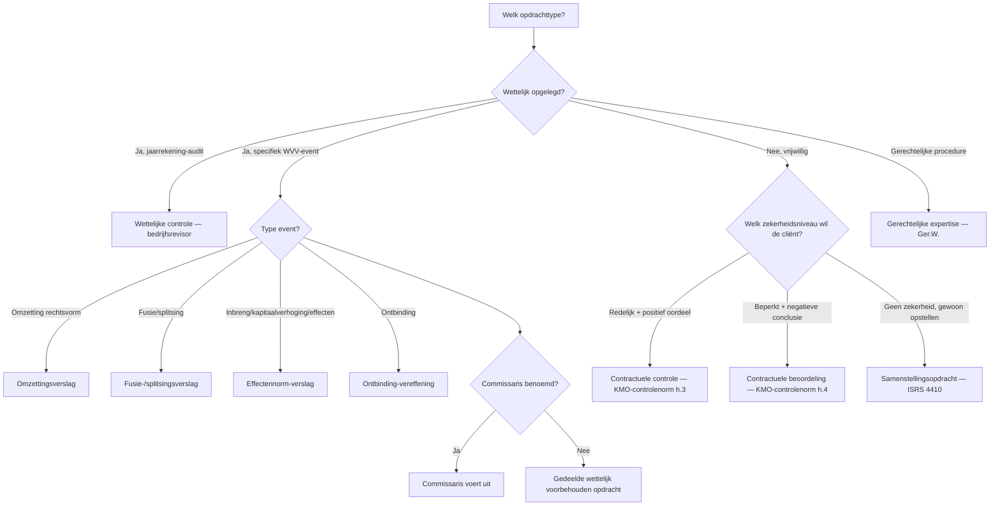
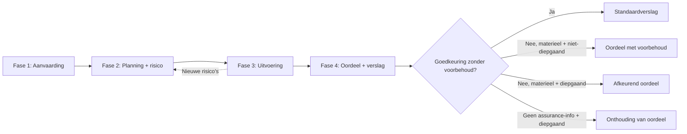

## Wat verwacht het examen van jou?

> [!abstract] Dit programmaonderdeel wordt getoetst op niveau *integratie*.
> Je moet meerdere concepten samen kunnen inzetten in complexe casussen — onderdelen herkennen, prioriteren, en tot een coherent oordeel komen.

**Taken** (uit het ITAA-examenprogramma):

> [!abstract]- **Taak 1** — Opstellen van specifieke verslagen en analyses voor de externe en interne verslaglegging, met inbegrip van juridische en contractuele opdrachten
>
> **Subtaken**:
> - privé-expertise op het gebied van bedrijfsboekhouding
> - gerechtelijke expertise op het gebied van bedrijfsboekhouding
> - opstellen van verslagen die leiden tot een attestering of een expertiseverslag bestemd om aan derden te worden afgegeven
>
> **Doelstellingen**:
> - Opstellen van specifieke verslagen en analyses voor de externe en interne verslaglegging, met inbegrip van het uitvoeren van wettelijke en contractuele opdrachten

## Leesgids

Deze minicursus volgt de logica van een opdracht: eerst opdrachttype + wettelijk kader, dan de vier fasen van de [[auditcyclus-fasen-synthese|auditcyclus]] van aanvaarding tot verslag, tot slot deontologie, antiwitwas en communicatie. De twee vroege synthesetabellen — [[opdrachttypes-zekerheidsniveaus-synthese|opdrachttypes]] en fasen — zijn je mentale kapstok. Competentie-secties leggen procedure vast; thematische secties leveren de begripsbouwstenen.

## Waarom dit programmaonderdeel telt

Externe controle is het paradepaardje van de assurance-keten: een derde verschaft gebruikers van de jaarrekening een onderbouwd oordeel. Op integratieniveau moet je in een complexe casus opdrachtsoort kiezen, risico's calibreren, instrumenten inzetten en uit de [[assurance-informatie|evidence]] een coherent oordeel destilleren. Twee pijlers dragen alles: het [[auditrisicomodel|auditrisicomodel]] bepaalt hoeveel werk nodig is, [[onafhankelijkheid-externe-accountant|onafhankelijkheid]] en [[professioneel-kritische-instelling|professioneel-kritische instelling]] bepalen of dat werk geloofwaardig is. Een GA beweegt zich in dezelfde normenruimte als de [[bedrijfsrevisor|bedrijfsrevisor]] — alleen het commissarismandaat blijft exclusief voor laatstgenoemde.

## Waarom externe controle? Stakeholders, vertrouwen en de assurance-keten

De financiële overzichten worden opgesteld door precies die partij over wiens prestaties ze rapporteren. Een onafhankelijke beroepsbeoefenaar die [[redelijke-mate-van-zekerheid|redelijke]] of [[beperkte-mate-van-zekerheid|beperkte zekerheid]] verschaft, doorbreekt die informatie-asymmetrie. Het zekerheidsniveau dat je levert, bepaalt de vorm van je oordeel — niet andersom.

## Wettelijk kader en normenhiërarchie: Wet ITAA, KB plichtenleer, ITAA-normen, ISA en IESBA

> [!info] Hoort bij taak: Opstellen van specifieke verslagen en analyses voor de externe en interne verslaglegging, met inbegrip van juridische en…

Het normenstelsel werkt in lagen: wet en KB plichtenleer als basis, daarop de ITAA-normen — [[algemene-controlenorm-accountant|algemene controlenorm]] én [[kmo-controlenorm-accountant|KMO-controlenorm]] — en de [[iesba-code-of-ethics|IESBA-code]] als ethische bovenbouw. Voor het commissarismandaat schakelt het veld over naar de ISA-set; voor KMO-werk blijft de KMO-controlenorm het anker. In een casus moet je bepalen welke norm dwingend is en welke aanvullend.

- [[algemene-controlenorm-accountant|Algemene controlenorm voor de externe accountant]] · `cluster`
- [[kmo-controlenorm-accountant|KMO-controlenorm voor de externe accountant]] · `cluster`
- [[iesba-code-of-ethics|IESBA International Code of Ethics for Professional Accountants]] · `autoriteit`
- [[wettelijke-controleopdracht-commissaris|Wettelijke controleopdracht (commissaris-mandaat)]] · `begrip`
- [[contractuele-controleopdracht|Contractuele controleopdracht]] · `begrip`
- [[contractuele-beoordelingsopdracht|Contractuele beoordelingsopdracht]] · `begrip`

## Actoren in de externe controle: wie mag wat?

> [!info] Hoort bij taak: Opstellen van specifieke verslagen en analyses voor de externe en interne verslaglegging, met inbegrip van juridische en…

De [[bedrijfsrevisor|bedrijfsrevisor]] heeft het monopolie op de wettelijke jaarrekeningcontrole; [[gecertificeerd-accountant-ga|GA]] en revisor delen daarnaast een aantal door wet voorbehouden opdrachten ([[gedeelde-wettelijk-voorbehouden-opdracht|gedeeld monopolie]]). De [[met-governance-belaste-personen|met governance belaste personen]] zijn aan cliëntzijde de formele tegenpartij; grootte-classificatie ([[kleine-vennootschap|klein]] tot [[public-interest-entity|PIE]]) bepaalt welke regels strenger of soepeler zijn.

- [[bedrijfsrevisor|Bedrijfsrevisor]] · `autoriteit`
- [[gecertificeerd-accountant-ga|Gecertificeerd accountant (GA)]] · `autoriteit`
- [[gedeelde-wettelijk-voorbehouden-opdracht|Gedeelde wettelijk voorbehouden opdracht]] · `begrip`
- [[met-governance-belaste-personen|Met governance belaste personen]] · `autoriteit`
- [[kleine-vennootschap|Kleine vennootschap (WVV art. 1:24)]] · `begrip`
- [[public-interest-entity|Public Interest Entity (PIE)]] · `begrip`

## Opdrachttypes en zekerheidsniveaus vergeleken

Deze synthese vergelijkt de negen mogelijke opdrachttypes voor een GA of bedrijfsrevisor op één matrix: van geen zekerheid (samenstelling) tot redelijke zekerheid (controle), plus de WVV-event-opdrachten (fusie, splitsing, omzetting, effecten, ontbinding) en de gerechtelijke/private expertise. De keuze tussen de types is GEEN cliëntvoorkeur — ze wordt bepaald door (1) wettelijke verplichting + type event, (2) cliëntbehoefte, en (3) toepasselijke norm. Het verschil tussen positief oordeel en negatieve conclusie vloeit voort uit het zekerheidsniveau.

In een casus is het type bepalen altijd je eerste zet: pas dan ligt vast welke norm geldt en welk soort uitspraak je doet. Lees de matrix verticaal — zekerheidsniveau naar oordeelsvorm — en horizontaal — trigger naar toepasselijke norm.

| Opdrachttype | Zekerheidsniveau | Oordeel/Conclusie-vorm | Toepasselijke norm | Wie kan uitvoeren? | Typische triggerwoorden |
|---|---|---|---|---|---|
| Wettelijke controle (commissaris) | Redelijke zekerheid | Positief oordeel ('getrouw beeld') | ISA + Wet 7 december 2016 | Bedrijfsrevisor (commissaris) | 'wettelijke controle jaarrekening', 'commissaris' |
| Contractuele controle | Redelijke zekerheid | Positief oordeel | ITAA KMO-controlenorm h.3 | GA of bedrijfsrevisor | 'controle van de jaarrekening', 'getrouw beeld' |
| Contractuele beoordeling (review) | Beperkte zekerheid | Negatieve conclusie ('geen aanwijzingen') | ITAA KMO-controlenorm h.4 / ISRE 2400 | GA of bedrijfsrevisor | 'beperkte controle', 'beperkt nazicht', 'review' |
| Samenstellingsopdracht | GEEN zekerheid | Geen oordeel/conclusie | ITAA-norm Samenstelling (ISRS 4410) | GA of bedrijfsrevisor | 'opmaken jaarrekening', 'samenstelling' |
| Fusie-/splitsingsverslag | Specifiek (redelijkheid ruilverhouding) | Verklaring over redelijkheid van ruilverhouding | ITAA-norm Fusie en splitsing + WVV art. 12:25 e.v. | GA of bedrijfsrevisor (commissaris als die er is) | 'fusie', 'splitsing', 'ruilverhouding aandelen' |
| Omzettingsverslag | Beperkte zekerheid | Negatieve conclusie over of nettoactief overgewaardeerd is | ITAA-norm Omzetting + WVV Boek 14 | GA of bedrijfsrevisor | 'omzetting rechtsvorm', 'BV wordt NV' |
| Effectennorm-verslag | Beperkte zekerheid | Negatieve conclusie over getrouw en voldoende zijn financiële gegevens | ITAA-norm Effectennorm + WVV art. 5:121, 7:179, 7:191 | GA of bedrijfsrevisor | 'kapitaalverhoging', 'opheffing voorkeurrecht', 'converteerbare obligaties' |
| Ontbinding-vereffening | Beperkte zekerheid | Conclusie over staat van actief/passief | ITAA-norm Ontbinding-vereffening + WVV art. 2:71 e.v. | GA of bedrijfsrevisor | 'ontbinding', 'vereffening', 'staat van actief en passief' |
| Gerechtelijke/private expertise | n.v.t. (geen assurance, wel gemotiveerd verslag) | Boekhoudkundige analyse + besluit | Wet ITAA 2019 art. 3, 6° + Ger.W. art. 962 e.v. | GA (gerechtsdeskundige of privé) | 'gerechtsdeskundige', 'expertise', 'rechter benoemt' |

**Kerninzichten**:

- Het zekerheidsniveau (geen / beperkt / redelijk) bepaalt de vorm van het oordeel (geen / negatief / positief), niet andersom.
- GA en bedrijfsrevisor zijn dragers van ALLE niveaus behalve het commissarismandaat — dat is exclusief revisor.
- Bij voorbehouden opdrachten (WVV-events) vervalt het 'gedeelde' karakter zodra er een commissaris is — die voert ze uit.

_Bouwt op_: [[contractuele-controleopdracht]] · [[contractuele-beoordelingsopdracht]] · [[samenstellingsopdracht]] · [[wettelijke-controleopdracht-commissaris]] · [[redelijke-mate-van-zekerheid]] · [[beperkte-mate-van-zekerheid]] · [[fusie-splitsing-controleopdracht]] · [[omzetting-vennootschap-opdracht]] · [[effectennorm-opdracht]] · [[ontbinding-vereffening-opdracht]] · [[gerechtelijke-en-private-expertise]]
## Zekerheidsniveaus en alternatieve opdrachttypes: review en samenstelling

> [!info] Hoort bij taak: Opstellen van specifieke verslagen en analyses voor de externe en interne verslaglegging, met inbegrip van juridische en…

Niet elke cliënt vraagt om de volle [[redelijke-mate-van-zekerheid|redelijke zekerheid]]. Een [[contractuele-beoordelingsopdracht|beoordelingsopdracht]] geeft [[beperkte-mate-van-zekerheid|beperkte zekerheid]] met negatieve conclusie; een [[samenstellingsopdracht|samenstellingsopdracht]] verschaft geen zekerheid. Het [[beoordelingsverslag-elementen|beoordelingsverslag]] heeft bovendien een eigen rubrieken-stramien.

- [[redelijke-mate-van-zekerheid|Redelijke mate van zekerheid]] · `begrip`
- [[beperkte-mate-van-zekerheid|Beperkte mate van zekerheid]] · `begrip`
- [[samenstellingsopdracht|Samenstellingsopdracht]] · `cluster`
- [[beoordelingsverslag-elementen|Elementen van het beoordelingsverslag (review report)]] · `procedure`

## Bijzondere wettelijk voorbehouden opdrachten

> [!info] Hoort bij taak: Opstellen van specifieke verslagen en analyses voor de externe en interne verslaglegging, met inbegrip van juridische en…

Bepaalde vennootschapsrechtelijke events triggeren een eigen voorbehouden opdracht: [[fusie-splitsing-controleopdracht|fusie of splitsing]], [[omzetting-vennootschap-opdracht|omzetting]], [[effectennorm-opdracht|effectenverrichting]], [[ontbinding-vereffening-opdracht|ontbinding-vereffening]]. [[gerechtelijke-en-private-expertise|Gerechtelijke en private expertise]] is voorbehouden aan de GA; de [[wettelijke-verklaring-gecertificeerd-accountant|wettelijke verklaring]] is het generieke vehikel voor GA-conclusies bij specifieke wettelijke triggers.

- [[ontbinding-vereffening-opdracht|Ontbinding-vereffening opdracht van de gecertificeerd accountant]] · `cluster`
- [[fusie-splitsing-controleopdracht|Verslag bij fusie of splitsing van vennootschappen]] · `cluster`
- [[omzetting-vennootschap-opdracht|Verslag bij omzetting van een vennootschap]] · `cluster`
- [[effectennorm-opdracht|Verslag bij effectenverrichting (effectennorm)]] · `cluster`
- [[gerechtelijke-en-private-expertise|Gerechtelijke en private expertise door de gecertificeerd accountant]] · `begrip`
- [[wettelijke-verklaring-gecertificeerd-accountant|Wettelijke verklaring van de gecertificeerd accountant]] · `begrip`

## Aanvaarden van een audit-opdracht en opmaken van de opdrachtbrief

> [!info] Hoort bij taak: Opstellen van specifieke verslagen en analyses voor de externe en interne verslaglegging, met inbegrip van juridische en…

De aanvaardingsfase test [[randvoorwaarden-controle|randvoorwaarden]], [[onafhankelijkheid-externe-accountant|onafhankelijkheid]] en — bij overname — de [[opvolging-voorganger-accountant|opvolging van de voorganger]]; pas daarna giet je de afspraken in een [[opdrachtbrief-accountant|opdrachtbrief]]. Stap voor stap doorlopen, want examen-casussen toetsen graag op een ontbrekende voortoets.

[[competenties/aanvaarden-audit-opdracht|→ Volledige procedure]]

## Auditcyclus — vier fasen vergeleken

De auditcyclus structureert de hele externe-controleopdracht in vier opeenvolgende, deels iteratieve fasen: aanvaarding, planning en risico-inschatting, uitvoering, oordeel en verslag. Deze synthese vergelijkt per fase het doel, de kern-output en de norm-referentie zodat de stagiair een mentaal model heeft waarop alle specifieke records (planning, werkprogramma, gegevensgerichte werkzaamheden, oordeelstypes, verslag-elementen) gehangen worden.

Onthoud dat fase 3 terugkoppelt naar fase 2 zodra je tijdens uitvoering nieuwe risico's vindt — de cyclus is opeenvolgend maar niet star. Gebruik deze fasen-synthese als referentie wanneer een casus op één fase inzoomt.

| Fase | Doel | Kern-output | Norm-referentie |
|---|---|---|---|
| 1. Aanvaarding + opdrachtbrief | Scope vastleggen, randvoorwaarden checken, ethische voorschriften toetsen | Opdrachtbrief + acceptatie-memo | KMO-norm §2 + Norm Opdrachtbrief |
| 2. Planning + risico-inschatting | Strategie + werkprogramma opbouwen op basis van inzicht in cliënt + IC | Risk assessment memo + werkprogramma | KMO-norm §70-§77 |
| 3. Uitvoering + assurance-informatie | Test of controls + gegevensgerichte werkzaamheden uitvoeren, evidence verzamelen | Werkpapieren + getoetste populaties + bevindingen | KMO-norm §85-§115 |
| 4. Conclusie + verslag | Oordeel vormen, verslag schrijven, communicatie afsluiten | Controleverslag + management letter + management representation letter | KMO-norm §116-§120 + Algemene controlenorm §2 |

_Bouwt op_: [[auditplanning]] · [[auditstrategie]] · [[werkprogramma-audit]] · [[risico-inschatting-audit]] · [[gegevensgerichte-werkzaamheden]] · [[toetsing-interne-beheersing]] · [[controledocumentatie]] · [[controleoordeel-types]] · [[controleverslag-elementen]]
## Verwerven van kennis van de cliënt en zijn omgeving in een audit-opdracht

> [!info] Hoort bij taak: Opstellen van specifieke verslagen en analyses voor de externe en interne verslaglegging, met inbegrip van juridische en…

[[kennis-van-onderneming-omgeving|Kennis van de onderneming en haar omgeving]] is de fundering van de hele [[risico-inschatting-audit|risico-inschatting]]. Geleidelijk stap je van externe omgeving naar interne processen en markeer je verhoogde alertheid voor [[verbonden-partijen-audit|verbonden partijen]] of [[continuiteitsveronderstelling-audit|continuïteit]].

[[competenties/verwerven-kennis-van-clientonderneming-audit|→ Volledige procedure]]

## Uitvoeren van risico-inschatting en bepalen van het materieel belang in een audit

> [!info] Hoort bij taak: Opstellen van specifieke verslagen en analyses voor de externe en interne verslaglegging, met inbegrip van juridische en…

Het [[auditrisicomodel|auditrisicomodel]] dwingt je [[inherent-risico|inherent risico]] en [[intern-beheersingsrisico|beheersingsrisico]] te wegen om je [[ontdekkingsrisico|ontdekkingsrisico]] doelbewust te calibreren. Parallel bepaal je [[materieel-belang-audit|materieel belang]] op overall- en performance-niveau, met extra aandacht voor [[significant-risico-audit|significante risico's]]. Stap voor stap leg je risicomatrix per [[beweringen-audit|bewering]] vast — die calibratie stuurt al je controle-instrumenten.

[[competenties/uitvoeren-risico-inschatting-en-materialiteit-audit|→ Volledige procedure]]

## Fraude-risico in de audit: typologie, driehoek en risicofactoren

> [!info] Hoort bij taak: Opstellen van specifieke verslagen en analyses voor de externe en interne verslaglegging, met inbegrip van juridische en…

[[fraude-versus-fout|Fraude verschilt fundamenteel van fout]] door het opzettelijke karakter. De [[fraudedriehoek|fraude-driehoek]] (motief, gelegenheid, rationalisatie) geeft je het detectie-raamwerk; de [[fraudetypologie-acfe|ACFE-typologie]] structureert wat je tegenkomt en de [[frauderisicofactoren|ISA 240-risicofactoren]] zijn de signalen die je actief moet zoeken.

- [[fraude-versus-fout|Fraude versus fout — onderscheid in audit en interne controle]] · `synthese`
- [[fraudedriehoek|Fraude-driehoek (motief – gelegenheid – rationalisatie)]] · `begrip`
- [[frauderisicofactoren|Frauderisicofactoren (ISA 240)]] · `begrip`
- [[fraudetypologie-acfe|Fraudetypologie ACFE (drie hoofdtypen)]] · `begrip`

## Opstellen van de auditstrategie en het werkprogramma

> [!info] Hoort bij taak: Opstellen van specifieke verslagen en analyses voor de externe en interne verslaglegging, met inbegrip van juridische en…

Planning werkt op twee lagen: de [[auditstrategie|auditstrategie]] legt scope, timing en richting vast; het [[werkprogramma-audit|werkprogramma]] vertaalt dat per bewering naar concrete werkzaamheden. Vanuit risico-inschatting en materialiteit bouw je het stap voor stap op in het [[controledocumentatie|dossier]].

[[competenties/opstellen-auditstrategie-en-werkprogramma|→ Volledige procedure]]

## Controle-instrumenten en testing-soorten: het instrumentarium van de auditor

> [!info] Hoort bij taak: Opstellen van specifieke verslagen en analyses voor de externe en interne verslaglegging, met inbegrip van juridische en…

De auditor heeft een gesloten instrumentarium: [[toetsing-interne-beheersing|test of controls]], [[gegevensgerichte-werkzaamheden|gegevensgerichte werkzaamheden]], [[cijferanalyses-audit|cijferanalyses]], [[externe-bevestiging-audit|externe bevestigingen]], [[steekproef-audit|steekproeven]] en de [[schriftelijke-bevestiging-management|management representation letter]] aan het einde. Welke je inzet en hoe zwaar, hangt af van het risico per [[beweringen-audit|bewering]]; wat ze samen opleveren is je [[assurance-informatie|assurance-informatie]].

- [[assurance-informatie|Assurance-informatie (controle-informatie)]] · `begrip`
- [[toetsing-interne-beheersing|Toetsing van interne beheersing (test of controls)]] · `cluster`
- [[gegevensgerichte-werkzaamheden|Gegevensgerichte werkzaamheden (substantive procedures)]] · `cluster`
- [[cijferanalyses-audit|Cijferanalyses bij een audit]] · `cluster`
- [[externe-bevestiging-audit|Externe bevestiging (audit)]] · `cluster`
- [[steekproef-audit|Steekproef bij een audit (audit sampling)]] · `cluster`
- [[schriftelijke-bevestiging-management|Schriftelijke bevestiging van het management (management representation letter)]] · `begrip`
- [[beweringen-audit|Beweringen (assertions) in een audit]] · `begrip`

## Selecteren en uitvoeren van controle-instrumenten (test of controls + gegevensgerichte werkzaamheden)

> [!info] Hoort bij taak: Opstellen van specifieke verslagen en analyses voor de externe en interne verslaglegging, met inbegrip van juridische en…

Per [[beweringen-audit|bewering]] kies je een instrument-mix die je [[ontdekkingsrisico|ontdekkingsrisico]] tot een aanvaardbaar laag niveau terugbrengt. Bij hoog inherent risico of zwakke IC schuif je naar substantief; bij betrouwbare IC kan je deels op test of controls steunen.

[[competenties/selecteren-en-uitvoeren-controle-instrumenten-audit|→ Volledige procedure]]

## Bijzondere uitvoeringsthema's: schattingen, automatisering en het werk van interne auditors

> [!info] Hoort bij taak: Opstellen van specifieke verslagen en analyses voor de externe en interne verslaglegging, met inbegrip van juridische en…

Drie gebieden vergen specifieke aandacht: [[boekhoudkundige-schattingen-audit|boekhoudkundige schattingen]] (schattingsonzekerheid + assumpties toetsen), [[specifieke-kwesties-automatisering-audit|automatisering]] (risico verschuift naar IT-controles), en onder strikte voorwaarden [[gebruik-werk-interne-auditors-audit|steunen op het werk van interne auditors]].

- [[boekhoudkundige-schattingen-audit|Boekhoudkundige schattingen (audit-perspectief)]] · `begrip`
- [[specifieke-kwesties-automatisering-audit|Specifieke kwesties bij automatisering (audit-perspectief)]] · `begrip`
- [[gebruik-werk-interne-auditors-audit|Gebruikmaken van de werkzaamheden van interne auditors bij externe controle]] · `cluster`

## Documenteren van de revisiewerkzaamheden in het auditdossier

> [!info] Hoort bij taak: Opstellen van specifieke verslagen en analyses voor de externe en interne verslaglegging, met inbegrip van juridische en…

[[controledocumentatie|Controledocumentatie]] vraagt om een permanent dossier plus een lopend dossier per opdracht, met alle [[werkprogramma-audit|werkprogramma-stappen]], evidence en conclusies traceerbaar vastgelegd. Bewaarregels en samenstellingstermijn maken deel uit van de discipline.

[[competenties/documenteren-auditdossier|→ Volledige procedure]]

## Kwaliteitsbeheersing rond het auditdossier: kantoor, opdracht en review

> [!info] Hoort bij taak: Opstellen van specifieke verslagen en analyses voor de externe en interne verslaglegging, met inbegrip van juridische en…

Kwaliteit werkt op drie lagen: het [[intern-kwaliteitsmanagement-kantoor|kantoorbrede systeem]], de [[kwaliteitsbeheersing-opdrachtniveau|opdrachtbeheersing]] van de opdrachtpartner met [[delegatie-en-supervisie-audit|delegatie en supervisie]], en — voor risicovolle of PIE-opdrachten — een aparte [[opdrachtgerichte-kwaliteitsbeoordeling|EQR-review]]. Examenvragen testen vaak welke laag op welk niveau zit.

- [[controledocumentatie|Controledocumentatie / controledossier]] · `cluster`
- [[kwaliteitsbeheersing-opdrachtniveau|Kwaliteitsbeheersing op opdrachtniveau]] · `cluster`
- [[intern-kwaliteitsmanagement-kantoor|Intern kwaliteitsmanagement op kantoorniveau]] · `cluster`
- [[delegatie-en-supervisie-audit|Delegatie en supervisie binnen het auditteam]] · `cluster`
- [[opdrachtgerichte-kwaliteitsbeoordeling|Opdrachtgerichte kwaliteitsbeoordeling (EQR)]] · `cluster`

## Beoordelen van regelmatigheid, waarachtigheid en getrouw beeld van de jaarrekening

> [!info] Hoort bij taak: Opstellen van specifieke verslagen en analyses voor de externe en interne verslaglegging, met inbegrip van juridische en…

Het oordeel kent twee dimensies: [[regelmatigheid-jaarrekening-audit|regelmatigheid]] (conformiteit met het KB WVV-stelsel) en [[getrouw-beeld-controle|getrouw beeld]] — beide moeten kloppen. Daarbovenop houd je de [[continuiteitsveronderstelling-audit|continuïteitsveronderstelling]] tegen het licht en weeg je elke vaststelling tegen het [[materieel-belang-audit|materieel belang]].

[[competenties/beoordelen-getrouw-beeld-en-regelmatigheid|→ Volledige procedure]]

## Het oordeel: afwijkingen, materialiteit en KAM

> [!info] Hoort bij taak: Opstellen van specifieke verslagen en analyses voor de externe en interne verslaglegging, met inbegrip van juridische en…

De [[controleoordeel-types|oordeelsmatrix]] werkt op twee assen: bron (afwijking of scope-beperking) en intensiteit (geïsoleerd of diepgaand). Daaruit volgen de varianten van [[aangepast-oordeel|aangepast oordeel]]. Daarnaast bestaan [[paragraaf-ter-benadrukking|emphasis of matter]], [[paragraaf-overige-aangelegenheden|other matter]] en — bij beursvennootschappen — [[kernpunten-van-controle|KAM]].

- [[afwijking-van-materieel-belang|Afwijking van materieel belang]] · `begrip`
- [[controleoordeel-types|Types van controleoordeel]] · `cluster`
- [[aangepast-oordeel|Aangepast oordeel (modified opinion)]] · `begrip`
- [[paragraaf-ter-benadrukking|Paragraaf ter benadrukking van bepaalde aangelegenheden]] · `begrip`
- [[paragraaf-overige-aangelegenheden|Paragraaf inzake overige aangelegenheden]] · `begrip`
- [[kernpunten-van-controle|Kernpunten van de controle (KAM)]] · `begrip`

## Opstellen van het controleverslag en formuleren van het oordeel

> [!info] Hoort bij taak: Opstellen van specifieke verslagen en analyses voor de externe en interne verslaglegging, met inbegrip van juridische en…

Het [[controleverslag-elementen|controleverslag]] kent dwingende rubrieken in vaste volgorde; de oordeelskeuze volgt strikt uit materialiteit en pervasiviteit. In een casus bouw je geleidelijk je oordeel op uit alle ongecorrigeerde afwijkingen en scope-beperkingen, en pas dan formuleer je verslag-tekst die er exact bij past.

[[competenties/opstellen-controleverslag-en-formuleren-oordeel|→ Volledige procedure]]

## Communiceren met audit-comité en bestuur over auditbevindingen

> [!info] Hoort bij taak: Opstellen van specifieke verslagen en analyses voor de externe en interne verslaglegging, met inbegrip van juridische en…

De auditor moet weten wie [[met-governance-belaste-personen|met governance belast]] is en daar strategische bevindingen aan rapporteren — onderscheiden van de operationele lijn met management. Eerste vraag in een casus: aan wie wat, in welk medium, op welk moment?

[[competenties/communiceren-met-bestuur-en-auditcomite|→ Volledige procedure]]

## Communicatie met management, governance en de brug naar interne controle (PO 1.7)

> [!info] Hoort bij taak: Opstellen van specifieke verslagen en analyses voor de externe en interne verslaglegging, met inbegrip van juridische en…

Naast het hoofdoordeel lopen er twee permanente kanalen mee: [[communicatie-met-management-governance|communicatie met management en governance]] over operationele én strategische aangelegenheden, en de specifieke plicht om [[communicatie-tekortkomingen-interne-beheersing|tekortkomingen in de interne beheersing]] gestructureerd te rapporteren — meteen de brug naar PO 1.7.

- [[communicatie-met-management-governance|Communicatie met management en met governance belaste personen]] · `cluster`
- [[communicatie-tekortkomingen-interne-beheersing|Communicatie van tekortkomingen in de interne beheersing]] · `cluster`

## Toepassen van professional skepticism en deontologische normen tijdens de audit

> [!info] Hoort bij taak: Opstellen van specifieke verslagen en analyses voor de externe en interne verslaglegging, met inbegrip van juridische en…

[[professioneel-kritische-instelling|Professioneel-kritische instelling]] en [[professionele-oordeelsvorming|oordeelsvorming]] kleuren elke werkwijze tijdens de opdracht; geen aparte stap, maar continue alertheid. Bewaak [[onafhankelijkheid-externe-accountant|onafhankelijkheid]], vermijd [[belangenconflict-accountant|belangenconflicten]] en respecteer het [[beroepsgeheim-accountant|beroepsgeheim]].

[[competenties/toepassen-professional-skepticism-en-deontologie-audit|→ Volledige procedure]]

## Antiwitwas- en tuchtrechtelijk kader rond de externe controle

> [!info] Hoort bij taak: Opstellen van specifieke verslagen en analyses voor de externe en interne verslaglegging, met inbegrip van juridische en…

Rond de audit hangt een handhavingskader: de [[antiwitwasmeldingsplicht-accountant|antiwitwasmeldingsplicht]] doorbreekt bij vermoedens van witwassen het beroepsgeheim. De [[tuchtrechtelijke-aansprakelijkheid-accountant|tuchtrechtelijke aansprakelijkheid]] loopt langs de ITAA-tuchtcommissies; de [[beroepsaansprakelijkheid-accountant|beroepsaansprakelijkheid]] langs het gemeen recht.

- [[antiwitwasmeldingsplicht-accountant|Antiwitwasmeldingsplicht voor de accountant]] · `cluster`
- [[tuchtrechtelijke-aansprakelijkheid-accountant|Tuchtrechtelijke aansprakelijkheid van de accountant]] · `regel`
- [[beroepsaansprakelijkheid-accountant|Beroepsaansprakelijkheid van de accountant]] · `regel`

## Reflectie: kwaliteitscontrole, beroepsaansprakelijkheid en het levende beroep

Externe controle is geen statisch boekje regels maar een levend beroep waar elke opdracht regels, oordeel en houding in elkaar schuift. Kwaliteitslagen, tucht en aansprakelijkheid houden het eerlijk; de geloofwaardigheid hangt af van wat jij doet met je [[professioneel-kritische-instelling|kritische instelling]] en [[onafhankelijkheid-externe-accountant|onafhankelijkheid]].

## Synthese-stappenplan

Een end-to-end audit-opdracht doorloop je zo. Eerst bepaal je het [[opdrachttypes-zekerheidsniveaus-synthese|opdrachttype]] — daaruit volgen norm en zekerheidsniveau. Vervolgens toets je [[randvoorwaarden-controle|randvoorwaarden]], [[onafhankelijkheid-externe-accountant|onafhankelijkheid]] en eventuele [[opvolging-voorganger-accountant|opvolging]], en giet je de afspraken in een [[opdrachtbrief-accountant|opdrachtbrief]]. Je verwerft [[kennis-van-onderneming-omgeving|kennis van de cliënt]] en voert een [[risico-inschatting-audit|risico-inschatting]] uit met vastlegging van [[materieel-belang-audit|materieel belang]] en [[significant-risico-audit|significante risico's]]. Op die basis bouw je [[auditstrategie|auditstrategie]] en [[werkprogramma-audit|werkprogramma]]. In de uitvoering combineer je [[toetsing-interne-beheersing|test of controls]] en [[gegevensgerichte-werkzaamheden|gegevensgerichte werkzaamheden]] per [[beweringen-audit|bewering]], onderbouwd met [[externe-bevestiging-audit|externe bevestigingen]], [[cijferanalyses-audit|cijferanalyses]] en [[steekproef-audit|steekproeven]]; aan het einde vraag je een [[schriftelijke-bevestiging-management|management representation letter]] en evalueer je [[continuiteitsveronderstelling-audit|continuïteit]]. Tot slot weeg je [[regelmatigheid-jaarrekening-audit|regelmatigheid]] en [[getrouw-beeld-controle|getrouw beeld]] tegen het materieel belang om uit de [[controleoordeel-types|oordeelsmatrix]] te kiezen, schrijf je het [[controleverslag-elementen|controleverslag]] en sluit je het [[controledocumentatie|dossier]] tijdig af.

## Cheatsheet

### Kritische drempelwaarden

| Concept | Naam | Waarde | Eenheid | Gevolg |
|---|---|---|---|---|
| [[controledocumentatie]] | Minimumbewaartermijn werkdocumenten — algemene controlenorm | 10 jaar | jaren vanaf datum verslag | Werkdocumenten moeten minstens 10 jaar bewaard worden onder de Algemene Controlenorm §3 |
| [[controledocumentatie]] | Minimumbewaartermijn dossier — KMO-controlenorm | 5 jaar | jaren vanaf ondertekening verslag | Onder de KMO-controlenorm bedraagt de bewaarperiode minimaal 5 jaar (§49) |
| [[controledocumentatie]] | Termijn samenstelling definitief controledossier | 60 dagen | dagen na datum controleverslag | ISA 230 §14 + ISQM 1 vragen tijdige samenstelling van het definitieve dossier; de gangbare termijn die ISQM 1 als richtl… |

### Vergelijkingsparen-matrix

| Concept | Verwarrend met | Trigger |
|---|---|---|
| [[afwijking-van-materieel-belang]] | [[materieel-belang-audit]] | Examenvraag: 'de auditor stelt 5% × winst voor belasting voorop' → materieel belang (drempel). 'De auditor stelt een overwaardering van € 280.000 vast' → afwijking van materieel belang. |
| [[algemene-controlenorm-accountant]] | [[kmo-controlenorm-accountant]] | Examenvraag: 'welke norm regelt een contractuele audit bij een KMO?' → KMO-controlenorm. 'Welke norm regelt de algemene plichten van de accountant bij elke controle?' → Algemene controlenorm. |
| [[antiwitwasmeldingsplicht-accountant]] | [[beroepsgeheim-accountant]] | Examenscenario 'accountant ontdekt vermoeden van witwassen' → meldingsplicht wint van beroepsgeheim. Maar bij 'accountant vermoedt fiscale fraude zonder witwas-element' → beroepsgeheim blijft, geen CFI-melding. |
| [[bedrijfsrevisor]] | [[gecertificeerd-accountant-ga]] | Examenvraag: 'wettelijke controle van de jaarrekening' → enkel bedrijfsrevisor. 'Inbreng in natura, geen commissaris' → beide kunnen. |
| [[beoordelingsverslag-elementen]] | [[controleverslag-elementen]] | Examen-zin: type opdracht = controle → controleverslag. Type = beoordeling/review → beoordelingsverslag. |
| [[beroepsaansprakelijkheid-accountant]] | [[tuchtrechtelijke-aansprakelijkheid-accountant]] | Examen-zin 'schadevergoeding' → civielrechtelijk (art. 44 Wet ITAA). 'Schorsing' / 'schrapping' → tuchtrechtelijk (ITAA-tuchtcommissie). |
| [[communicatie-tekortkomingen-interne-beheersing]] | [[evaluatie-interne-controle]] | Vraag 'hoe beoordeel je IC?' → evaluatie-interne-controle. Vraag 'wat doe je met een gevonden tekortkoming?' → ISA 265. |
| [[contractuele-beoordelingsopdracht]] | [[contractuele-controleopdracht]] | Examenwoord 'controle' / 'audit' / 'getrouw beeld' → controle. Woord 'beoordeling' / 'review' / 'beperkt nazicht' → beoordeling. |
| [[contractuele-beoordelingsopdracht]] | [[samenstellingsopdracht]] | Geeft de beroepsbeoefenaar zekerheid (zelfs beperkt)? Ja → beoordeling. Nee, hij helpt enkel opstellen? → samenstelling. |
| [[contractuele-controleopdracht]] | [[wettelijke-controleopdracht-commissaris]] | Examenvraag: 'is een commissaris benoemd?' Zo nee + audit gevraagd → contractuele controle (KMO-controlenorm). Zo ja → wettelijke controle (ISA + bedrijfsrevisor). |
| [[contractuele-controleopdracht]] | [[contractuele-beoordelingsopdracht]] | Examen-keuze: zoekt de cliënt 'audit'/'controle' → controleopdracht; zoekt hij 'review'/'beperkte controle'/'beperkt nazicht' → beoordelingsopdracht. |
| [[controleoordeel-types]] | [[controleoordeel-types]] | Examenvraag: ‘systematische overwaardering van voorraden die balans en resultaat omslaat’ → afkeurend. ‘één deelneming € 250.000 te hoog gewaardeerd’ → oordeel met voorbehoud. |
| [[controleoordeel-types]] | [[controleoordeel-types]] | Examenvraag: ‘klant weigert openingsbalans + alle aankoopfacturen H1’ → oordeelonthouding. ‘inventarisatie van één magazijn niet bijwoonbaar, alternatieve procedures slagen niet’ → oordeel met voorbehoud. |
| [[fraude-versus-fout]] | [[afwijking-van-materieel-belang]] | Examen-zin met 'opzettelijk' / 'om te misleiden' → fraude. 'Vergissing' / 'verkeerde inschatting' → fout. |
| [[fraude-versus-fout]] | [[verspilling]] | Examen-zin met 'inefficiënt' / 'idle capacity' / 'overstock' zonder boekhoudfout → verspilling. |
| [[fusie-splitsing-controleopdracht]] | [[omzetting-vennootschap-opdracht]] | Examenvraag: 'twee vennootschappen worden één' / 'splitsing in twee NV's' → fusie-/splitsingsverslag. 'BV wordt NV' / 'verandering rechtsvorm' → omzettingsverslag. |
| [[gebruik-werk-interne-auditors-audit]] | [[interne-audit]] | Vraag 'wat doet interne audit?' → record 'interne-audit'. Vraag 'mag externe auditor steunen op interne audit?' → dit record. |
| [[gegevensgerichte-werkzaamheden]] | [[toetsing-interne-beheersing]] | Hoog inherent risico en/of geen vertrouwen in IC → vooral gegevensgericht. Goede IC + intentie tot steunen → mix met toetsing IC. |
| [[gerechtelijke-en-private-expertise]] | [[contractuele-controleopdracht]] | Examenvraag: 'is er een rechter of een geschil?' → expertise. 'is er een audit van de jaarrekening gevraagd?' → controle. |
| [[iesba-code-of-ethics]] | [[onafhankelijkheid-externe-accountant]] | Belgisch examen → KB plichtenleer of ITAA-norm citeren. Internationale context of conceptuele vraag → IESBA. Vaak werken beide samen: 'volgens de IESBA-code en de Belgische omzetting...'. |
| [[iesba-code-of-ethics]] | [[beroepsgeheim-accountant]] | Internationaal/conceptueel → IESBA vertrouwelijkheid. Concreet Belgisch geval met sanctie-vraag → beroepsgeheim accountant. |
| [[inherent-risico]] | [[intern-beheersingsrisico]] | Examen: praat de opgave over de complexiteit van de transacties zelf → inherent risico. Praat ze over zwakheden in de interne controleprocessen → intern beheersingsrisico. |
| [[intern-kwaliteitsmanagement-kantoor]] | [[kwaliteitsbeheersing-opdrachtniveau]] | Vraag focust op één specifieke audit-opdracht en de review erop → ISA 220. Vraag focust op kantoor-procedures, beleid, monitoring over alle opdrachten heen → ISQM 1 / ITAA-norm IKM. |
| [[kernpunten-van-controle]] | [[paragraaf-ter-benadrukking]] | Examenvraag: 'aangelegenheid waar de auditor veel werk in heeft gestoken' → KAM. 'De auditor wijst de lezer op een belangrijke toelichting in de jaarrekening' → emphasis of matter. |
| [[kleine-vennootschap]] | [[microvennootschap]] | Examen: omzet € 500K → check micro-drempels eerst; als ook personeel ≤ 10 én balans ≤ € 450K én niet moeder/dochter → micro. Zo niet → klein. |
| [[kleine-vennootschap]] | [[grote-vennootschap-wvv]] | Examen: omzet € 15M, personeel 80, balans € 8M → overschrijdt 3 drempels → groot. Verkort niet meer toegestaan, commissaris verplicht. |
| [[omzetting-vennootschap-opdracht]] | [[ontbinding-vereffening-opdracht]] | Examen-keuze: 'verandert de rechtsvorm?' → omzettingsverslag. 'wordt de vennootschap stopgezet?' → ontbinding-vereffening. |
| [[opdrachtbrief-accountant]] | [[wettelijke-controleopdracht-commissaris]] | Examenvraag: 'wat regelt de relatie tussen accountant en cliënt?' → contractueel = opdrachtbrief, wettelijke controle = benoemingsbesluit AV. |
| [[opdrachtgerichte-kwaliteitsbeoordeling]] | [[]] | Examenvraag-formulering 'wie reviewt wat'. |
| [[paragraaf-overige-aangelegenheden]] | [[paragraaf-ter-benadrukking]] | Examen: 'vergelijkende cijfers door andere auditor gecontroleerd' → other matter (info niet in jaarrekening). 'Belangrijke toelichting bij continuïteit' → emphasis of matter (info in jaarrekening). |
| [[paragraaf-overige-aangelegenheden]] | [[kernpunten-van-controle]] | Examen: 'vorige auditor controleerde 2024-cijfers' → other matter. 'Complexe schatting van garantieprovision € 1,2M' → KAM. |
| [[paragraaf-ter-benadrukking]] | [[paragraaf-overige-aangelegenheden]] | Examen: 'toelichting in jaarrekening wijst op X' → benadrukking. 'Niet in jaarrekening, wel in verslag wegens audit-context' → overige. |
| [[paragraaf-ter-benadrukking]] | [[aangepast-oordeel]] | Is er een materiële afwijking of scope-beperking? Ja → aangepast oordeel. Nee, maar wel belangrijk gevolg dat correct in jaarrekening staat → paragraaf ter benadrukking. |
| [[paragraaf-ter-benadrukking]] | [[kernpunten-van-controle]] | Examen: 'wijs op de toelichting bij de aanvallende rechtszaak (€ 5M) in de jaarrekening' → emphasis. 'Beschrijf hoe de auditor de complexe schatting van de garantieprovision heeft aangepakt' → KAM. |
| [[professioneel-kritische-instelling]] | [[professionele-oordeelsvorming]] | Examenvraag: 'De auditor twijfelt aan de waardering van een schatting' → skepticism (kritisch onderzoeken). 'De norm geeft geen keuze; de auditor moet zelf beslissen welke werkwijze passend is' → judgment. |
| [[professionele-oordeelsvorming]] | [[professioneel-kritische-instelling]] | Examenvraag: 'De norm laat de keuze tussen interne of externe deskundige open' → judgment. 'De CFO bevestigt mondeling dat alles klopt — wat doet de auditor?' → skepticism. |
| [[public-interest-entity]] | [[groottecriteria-jaarrekening]] | Vraag 'verkort schema toegestaan?' → eerst PIE-test (zo ja: nooit verkort) → dan groottetest. |
| [[redelijke-mate-van-zekerheid]] | [[beperkte-mate-van-zekerheid]] | Examen-zin met positieve uitspraak → redelijke zekerheid. Negatieve uitspraak ('niet gebleken') → beperkte zekerheid. |
| [[regelmatigheid-jaarrekening-audit]] | [[getrouw-beeld-controle]] | Examen-zin: 'overeenstemming met KB WVV-schema' → regelmatigheid. 'Vermogen, financiële toestand en resultaat correct weergegeven' → getrouw beeld. |
| [[samenstellingsopdracht]] | [[contractuele-beoordelingsopdracht]] | Examenvraag: 'wordt zekerheid verschaft over de jaarrekening?' Nee → samenstelling. Ja, beperkt → beoordeling. Ja, redelijk → controle. |
| [[wettelijke-controleopdracht-commissaris]] | [[contractuele-controleopdracht]] | Examenvraag: 'is een commissaris benoemd?' Ja → wettelijke controle. Nee → contractuele controle als de cliënt het vraagt. |
| [[wettelijke-verklaring-gecertificeerd-accountant]] | [[wettelijke-controleopdracht-commissaris]] | Examenvraag: 'jaarrekening grote NV, commissaris benoemd' → commissarisverslag van bedrijfsrevisor. 'Inbreng in natura zonder commissaris' → wettelijke verklaring van GA of bedrijfsrevisor naar keuze. 'Beoordelingsverslag effectenuitgifte' → wettelijke verklaring van GA of bedrijfsrevisor. |

## Heb je deze taken in de vingers?

Loop deze taken na vóór je verder gaat met examenfocus. Twijfel je bij een taak? Lees de aangegeven secties nog eens.

- ✓ **1.6.taak.1** — Opstellen van specifieke verslagen en analyses voor de externe en interne verslaglegging, met inbegrip van juridische en… _Behandeld in §5, §6, §7, §8, §9, §10, §11, §12, §13, §14, §15, §16, §17, §18, §19, §20, §21, §22, §23, §24, §25, §26, §27._

## Examenfocus

Examenvragen toetsen typisch type, risico, instrument en oordeel samen in één casus. Let extra op de schijngelijkenissen [[contractuele-controleopdracht|controle]] versus [[contractuele-beoordelingsopdracht|beoordeling]], [[inherent-risico|inherent]] versus [[intern-beheersingsrisico|beheersingsrisico]], en tussen de oordeelsvarianten.

### Externe controle / accountantsonderzoek 📃

> [!question]- ITAA 2024-1 vraag 2.A · open (tier A)
> Stellingen juist of fout ivm onafhankelijkheid bij controle opdracht

> [!question]- ITAA 2024-1 vraag 2.B · open (tier A)
> Na acceptatie van de opdracht -> voldoende kennis verwerven, op welke wijze?

> [!question]- ITAA 2024-1 vraag 2.C · open (tier A)
> Volkomen controle volgens revisienormen

> [!question]- ITAA 2024-1 vraag 2.D · open (tier A)
> 4 algemene stellingen juist of fout

> [!question]- ITAA 2024-1 vraag 2.E · meerkeuze (tier A)
> Bij een accountantsonderzoek wordt de materialiteitsdrempel:
>
> - Vastgesteld bij KB
> - Door aandeelhouders van de vennootschap vastgesteld
> - Bepaald op basis van omzet van de 2 laatste jaren
> - Bepaald naargelang inherente risico’s + interne controle van de cliënt

### Accountantsonderzoek 📃

> [!question]- ITAA 2014-1 vraag 1 (tier B)
> Vraag 1 … / 8 punten Er worden onvoldoende antwoorden ontvangen op de confirmatie- of bevestigingsbrieven welke verzonden werden aan de klanten.
> 
> a) Moeten we daarvoor een voorbehoud in ons verslag maken ?
> 
> Antwoord
> 
> b) Welke acties kan men ondernemen om aan dit onvoldoende aantal antwoorden te remediëren (geef twee voorbeelden)? Antwoord
> 
> c) Welke is de werkwijze nadat we onze selectie hebben gemaakt van de klanten aan dewelke de confirmatiebrieven worden verzonden : door wie zijn de confirmatiebrieven opgesteld en getekend, aan wie moeten de antwoorden opgestuurd worden, wie verzendt de confirmatiebrieven? Antwoord

### Accountantsonderzoek 📃

> [!question]- ITAA 2014-1 vraag 2 (tier B)
> Vraag 2 … / 3 punten Bij nazicht van de resultatenrekening komen we op de kostenrekening “erelonen advocaat” ten belope van 12.000,00 EUR. Waarom is dit van belang voor het controleverslag? Welke actie stel je voor ? Antwoord
>
> > [!success]- Antwoord-motivering
> > **Waarom is dit van belang voor het controleverslag?**
> > 
> > De aanwezigheid van een kostenpost "erelonen advocaat" van € 12.000 in de resultatenrekening is een **signaal** voor de auditor dat er **lopende of recent afgesloten juridische geschillen** zijn. ⚖️ Geschillen kunnen drie soorten effecten hebben op de jaarrekening:
> > 
> > 1. **Off-balance verplichting** (klasse 0 in toelichting): geschillen zonder zekere uitkomst worden vermeld bij de rechten en verplichtingen buiten balans ([[balans]] §In de praktijk — buiten-balans-vermelding). ⚖️
> > 2. **Voorziening voor risico's en kosten** (rek 16 Voorzieningen): bij waarschijnlijk verlies → voorziening boeken op basis van de schatting van het bedrag (KB WVV art. 3:24-3:27). ⚖️
> > 3. **Materiële afwijking** bij niet-vermelding of onder-geschatte voorziening → impact op het oordeel van de auditor.
> > 
> > **Welke acties moet de auditor ondernemen?**
> > 
> > 1. **Externe bevestiging vragen aan de advocaat** ([[externe-bevestiging-audit]] §Werkwijze): de advocaat is bij uitstek de externe partij die status, aard, en bedrag van de geschillen kan bevestigen. Schriftelijke confirmatie rechtstreeks aan auditor. ⚖️
> > 2. **Toelichting nazien**: zijn alle hangende geschillen vermeld in de toelichting (off-balance + voorzieningen)? Vergelijk de erelonen-volume met de toelichting — onverhouding wijst op niet-vermelding. ⚖️
> > 3. **Voorziening evalueren** ([[boekhoudkundige-schattingen-audit]]): bij materieel geschil + waarschijnlijk verlies → voorziening boeken op basis van de schatting. Auditor toetst de redelijkheid van de schatting (range van uitkomsten van de advocaat). ⚖️
> > 4. **Continuïteit beoordelen**: een groot geschil kan continuïteit bedreigen. Bij materieel risico → assessing going concern (ISA 570). ⚖️
> > 
> > **Impact op het controleverslag**:
> > 
> > - **Niets aan de hand** (geschil gering, correct vermeld, voorziening adequaat) → geen impact, gewoon goedkeurend oordeel
> > - **Materiële niet-vermelding of onder-voorziening** → mogelijke afwijking van materieel belang → oordeel met **voorbehoud** indien geïsoleerd, of **afkeurend** indien diepgaand (zie [[controleoordeel-types]]) ⚖️
> > - **Onmogelijk om informatie te krijgen** (advocaat antwoordt niet, cliënt weigert) → scope-beperking → mogelijk **onthouding van oordeel** indien diepgaand ⚖️
> > - **Materiële continuïteitsonzekerheid** → paragraaf 'Materiële onzekerheid m.b.t. continuïteit' in het verslag (ISA 570) ⚖️
> > 
> > ⚠️ Een ereloon van € 12.000 is **niet automatisch** materieel — afhankelijk van de bedrijfsgrootte en de materialiteitsdrempel. Maar het is een **trigger** om dieper te kijken, niet de afwijking zelf. 🤖
> > 
> > _Grondslag: [[externe-bevestiging-audit]]; [[boekhoudkundige-schattingen-audit]]; [[controleoordeel-types]]; ISA 501 §4-A6 (litigation & claims); ISA 505 (externe confirmaties); ISA 570 (continuïteit); KB WVV art. 3:24-3:27 (voorzieningen)._

### Accountantsonderzoek 📃

> [!question]- ITAA 2014-1 vraag 3 (tier B)
> Vraag 3 … / 14 punten In het kader van een controleopdracht waarvoor een volkomen controle vereist is ontvangen we tijdens onze audit ter plaatse op 20/02/2014 van de interne boekhouder de boekhoudkundige staat per 31/12/2013. Zoals je weet moeten er voor we op de cijfers “afstormen” een aantal voorbereidende werken en checks verricht worden. Alvorens over te gaan tot cijfercontroles hebben we de materialiteitsgrens berekend op 50.000 EUR.
> 
> a) Kunnen we onze controleopdracht op deze cijfers afhandelen en ons besluit ondertekenen? Motiveer uw antwoord. Antwoord
> 
> b) Wat is het belang, in het kader van deze opdracht, zoals hierboven beschreven, van het vastleggen van de materialiteitsgrens? Antwoord
> 
> c) De vennootschap voor dewelke wij deze controleopdracht verrichten, heeft een dochterbedrijf via aandelen aangekocht voor 300.000 EUR (code 28). Hoe pak je deze post aan ? Geef 2 controledoelstellingen en 2 controletechnieken die hier kunnen toegepast worden. Antwoord
> 
> d) Gedurende deze controleopdracht, ga je een afloopcontrole uitvoeren op de post “bezoldigingen en sociale lasten” (passief codes 454/9) . Hoe voer je zo een controle uit, leg uit of werk een voorbeeld uit? Antwoord
> 
> VENNOOTSCHAPSRECHT 20 PUNTEN

### Accountantsonderzoek 📃

> [!question]- ITAA 2015-1 vraag 1 (tier B)
> Vraag 1 … / 2 punten
> Tijdens een controleopdracht bij een middelgrote onderneming, zonder commissaris en in
> het kader van een contractueel beperkt nazicht stelt de externe accountant een aantal
> verbeteringen (adjustments) voor.
> a) Wanneer deze adjustments talrijk en substantieel zijn in bedrag, zou dit een probleem
> kunnen veroorzaken in het bijzonder op het vlak van deontologische regels?
> Antwoord … / 0,5 punt
> 
> |  |  |
> |---|---|
> |  | Ja |
> |  | Neen |
> 
> b) Verklaar bondig.
> Antwoord … / 1,5 punten

### Accountantsonderzoek 📃

> [!question]- ITAA 2015-1 vraag 2 (tier B)
> Vraag 2 … / 4 punten Een eerste stap bij het auditwerk is de aanvaardingsprocedure van de opdracht. Geef twee voorbeelden van situaties bij deze procedure, waarbij we het dossier mogelijks niet kunnen aanvaarden. Antwoord
>
> > [!success]- Antwoord-motivering
> > Bij de aanvaardingsprocedure van een audit-opdracht moet de accountant verschillende randvoorwaarden toetsen ([[aanvaarden-audit-opdracht]] §Stappen 1-5). Situaties waarin het dossier **mogelijk niet kan worden aanvaard**:
> > 
> > ### Voorbeeld 1: Onafhankelijkheidsprobleem of belangenconflict
> > 
> > De accountant — zijn kantoor of zijn nauwe verwanten — hebben een band met de cliënt die de onafhankelijkheid in twijfel trekt:
> > - Familiale band met de bestuurder/eigenaar
> > - Significant financieel belang (aandelen, schulden, leningen)
> > - Eerdere niet-audit-diensten die zelf-controle veroorzaken (bv. boekhouding gevoerd voor dezelfde cliënt)
> > - Gerelateerde commerciële relaties (significant deel van de omzet komt van deze ene cliënt)
> > 
> > ⚖️ Schending van onafhankelijkheid leidt tot **tucht en nietigheid van het verslag** (Wet ITAA 2019 + KB 1998 plichtenleer art. 12 + IESBA Code of Ethics). De accountant **weigert** of trekt zich terug.
> > 
> > ### Voorbeeld 2: Cliënt erkent niet de drie basisverantwoordelijkheden van het management
> > 
> > Voor een audit moet het management ([[aanvaarden-audit-opdracht]] §1) erkennen:
> > - Verantwoordelijkheid voor het opstellen van de jaarrekening conform het toepasselijke financieel rapporteringsstelsel ⚖️
> > - Verantwoordelijkheid voor de interne beheersing die het opstellen mogelijk maakt zonder afwijking van materieel belang ⚖️
> > - Verplichting om de accountant toegang te verschaffen tot alle relevante informatie en aanvullende inlichtingen ⚖️
> > 
> > Zonder die erkenning **mist de audit een referentiekader** en is een controle-oordeel onmogelijk te onderbouwen. → niet aanvaarden.
> > 
> > ### Aanvullende voorbeelden (niet in opsomming):
> > - Toepasselijk rapporteringsstelsel niet aanvaardbaar (bv. exotisch zelfbedacht model in plaats van BE GAAP/IFRS)
> > - Voorgaande accountant meldt fundamentele integriteitsbezwaren over het management (KB 1998 plichtenleer art. 17-18 — collegiaal contact verplicht)
> > - Cliënt is geen toegestane juridische entiteit voor de opdracht (bv. een ad-hoc structuur zonder rechtspersoonlijkheid voor een wettelijke commissaris-controle)
> > 
> > _Grondslag: [[aanvaarden-audit-opdracht]] §Stappen 1-3; Wet ITAA 2019; KB 1998 plichtenleer art. 12 + 17-18; IESBA Code of Ethics._

### Accountantsonderzoek 📃

> [!question]- ITAA 2015-1 vraag 3 (tier B)
> Vraag 3 … / 6 punten Tijdens de werkzaamheden aan een controleverslag ivm een omzetting stelt de aangestelde accountant vast dat op het actief een debet lopende rekening op naam van de overleden vader van de zaakvoerders-aandeelhouders voorkomt.
> 
> a) Geef twee (2) controledoelstellingen die op dergelijk actief worden toegepast?
> 
> b) Geef kort weer voor elk van deze twee (2) controledoelstellingen welke techniek of methodiek je toepast? Vul uw antwoorden in op volgend schema. Antwoord Controledoelstelling Techniek of methodiek
> 
> Debet lopende 1. 1. rekening
> 
> 2. 2.

### Accountantsonderzoek 📃

> [!question]- ITAA 2015-1 vraag 4 (tier B)
> Vraag 4 … / 8 punten
> Het is 23 januari 2015 en de onderneming heeft haar boekhouding afgesloten op
> 30 september 2014 conform haar statuten. Op 1 oktober 2014 heeft u als controlerende
> accountant de voorraadtelling gevolgd en u ermee akkoord verklaard. Het betreft hier een
> Belgisch bedrijf dat in handen is van een Franse groep. Het bedrijf is gespecialiseerd in
> hoogtechnologische gasleidingen. We berekenen een materialiteit van 100.000 EUR op de
> resultatenrekening en 70.000 EUR op de balansposten.
> Het risicoprofiel is laag gezien er een goede interne controle is voor wat de aankopen,
> financiële verrichtingen en verkopen betreft.
> a) De telling van de voorraad (30/09/2014) hebben we fysiek kunnen meemaken en deze
> hoeveelheidstelling was in orde. Welke controle gaan we nu (23/01/2015) nog doen op
> de voorraad ?
> Geef twee controledoelstellingen met telkens een voorbeeld van de techniek die je
> gaat toepassen.
> Antwoord … / 6 punten
> Vul uw antwoorden in op volgend schema.
> 
> | Controledoelstelling | Techniek |
> |---|---|
> | 1.
> 2. | 1.
> 2. |
> 
> b) Bij nazicht van de handelsvorderingen (onder toepassing van 21% BTW) wordt een
> confirmatie bekomen van een klant voor 121.000,00 EUR, daar waar de vordering in de
> boekhouding op 217.800,00 EUR staat. Bij de confirmatie zit een ontvangstbon
> afgetekend op 29/09/2014 door de klant en de chauffeur die de levering heeft gedaan.
> Op deze ontvangstbon staat de vermelding dat er voor 80.000,00 EUR (excl btw) aan
> fout geleverde goederen terug zijn meegenomen.
> Welke actie onderneem je als controlerende accountant:
>  Kies één van de drie mogelijkheden:
> Antwoord … / 1 punt
> 
> |  |  |
> |---|---|
> |  | of je stelt een correctieboeking voor (geef dan de boeking) |
> |  | of je maakt een voorbehoud (motiveer) |
> |  | of vraag je de correctie te boeken in de heropening van
> volgend boekjaar (geef dan de boeking). |
> 
>  Verklaar bondig.
> Antwoord … / 1 punt

### Accountantsonderzoek 📃

> [!question]- ITAA 2015-1 vraag 5 (tier B)
> Vraag 5 … / 5 punten
> Geef de werkwijze tijdens een externe controle om tot de confirmatie van een representatief
> aantal leverancierssaldi te komen.
> a) Wat is representatief?
> Antwoord … / 1 punt
> b) Hoe doe je de steekproef?
> Antwoord … / 1 punt
> c) Hoe gebeurt de verzending van de confirmatiebrieven?
> Antwoord … / 1 punt
> d) Wie ontvangt de antwoorden?
> Antwoord … / 1 punt
> e) Wat bij niet ontvangst van antwoorden?
> Antwoord … / 1 punt
> 
> |  |  |  |  |  |
> |---|---|---|---|---|
> | VENNOOTSCHAPSRECHT |  |  | 20 PUNTEN |  |
> |  |  |  |  | 20 PUNTEN |
> 
> Antwoorden
> Plaats de letter van het juiste antwoord in onderstaande rooster.
> 
> | Vraag | 1 | 2 | 3 | 4 | 5 |
> |---|---|---|---|---|---|
> | Antwoord |  |  |  |  |  |
> | Punten | 4 | 4 | 4 | 4 | 4 |
>
> > [!success]- Antwoord-motivering
> > Vraag betreft de werkwijze van externe bevestiging (confirmation) voor leverancierssaldi — vijf procedurestappen. Zie subvragen per stap.

### Interne controle en accountantsonderzoek 📃

> [!question]- ITAA 2013-2 vraag 3 (tier B)
> Vraag 3 … / 8 punten Wanneer dient een accountant een onthoudende verklaring af te geven? Antwoord
>
> > [!success]- Antwoord-motivering
> > Een **onthouding van oordeel** (synoniem: 'disclaimer of opinion' in ISA-terminologie, 'onthoudende verklaring' in Belgische audit-praktijk) wordt afgegeven wanneer **cumulatief**:
> > 
> > 1. De accountant **onmogelijk** voldoende en geschikte assurance-informatie kan verkrijgen om de jaarrekening te onderbouwen — bv. door scope-beperking opgelegd door de cliënt, of door externe omstandigheden (boekhouding verloren, sleuteldocumenten ontoegankelijk). ⚖️
> > 2. De **mogelijke effecten** van het ontbrekend bewijs op de jaarrekening **diepgaand** kunnen zijn — niet alleen materieel, maar zo verspreid dat ze het globale geloofwaardigheidsoordeel aantasten. ⚖️
> > 
> > **Vergelijk met andere oordeel-types**:
> > - Goedkeurend zonder voorbehoud: jaarrekening geeft getrouw beeld, geen significante issues
> > - Goedkeurend **met voorbehoud**: er is een materiële afwijking of scope-beperking, maar **niet diepgaand** (geïsoleerd) — accountant formuleert oordeel met expliciete uitzondering
> > - **Afkeurend**: materiële afwijking + diepgaand (alles-doordringend) — accountant verklaart dat de jaarrekening geen getrouw beeld geeft
> > - **Onthoudend**: onvoldoende bewijs + diepgaande mogelijke gevolgen — geen oordeel mogelijk
> > 
> > **Voorbeelden** van situaties die tot onthouding leiden:
> > - Cliënt weigert toegang tot belangrijke contracten, bankrekeningen, of vorderingen-overzichten
> > - Materiële voorraad-opname onmogelijk + geen alternatieve werkzaamheden mogelijk (vooral bij eerste-jaars audit)
> > - Continuïteitsonzekerheid waarvoor management onvoldoende toelichting geeft en de auditor de impact niet kan kwantificeren
> > 
> > _Grondslag: ISA 705 (herzien) §10 + §A12-A14; ITAA KMO-controlenorm; [[controleoordeel-types]] §Onthouding van oordeel._

### Interne controle en accountantsonderzoek 📃

> [!question]- ITAA 2013-2 vraag 5 (tier B)
> Vraag 5 … / 8 punten Je wordt gevraagd om als extern accountant een controleopdracht uit te voeren bij de NV Fortunato. De interne boekhouder van de onderneming bezorgt de cijfers per 30 november 2013 ( = de afsluitdatum conform de statuten). Op 2 december 2013 heb je ter plaatse de voorraadtelling gevolgd en je met de getelde hoeveelheden akkoord verklaard. Het bedrijf is gespecialiseerd in de aan- en verkoop van landbouwmachines. Het risicoprofiel is laag gezien er volgens onze testen een goede interne controle is voor wat aankopen, financieel en verkopen betreft.
> 
> a) Kunnen we ons baseren op de cijfers ontvangen van de interne boekhouder? Leg uit. Antwoord … / 4 punten
> 
> b) De telling van de voorraad (30/11/2013) hebben we fysiek kunnen meemaken. Welke controle doen we nu tijdens de controlewerkzaamheden op de voorraad landbouwmachines? Geef één controledoelstelling en één voorbeeld van de techniek die je daarvoor gaat toepassen. Antwoord … / 4 punten  Controledoelstelling:  Voorbeeld:
> 
> VENNOOTSCHAPSRECHT 20 PUNTEN

### Interne controle en accountantsonderzoek 📃

> [!question]- ITAA 2013-2 vraag 1 (tier B)
> Vraag 1 … / 8 punten Een auditprocedure is een gedetailleerde instructie voor het verzamelen van een bepaald auditbewijsmiddel. Geef 4 soorten auditmethodes. Antwoord
>
> > [!success]- Antwoord-motivering
> > ISA 500 §A14-A25 ('audit evidence') somt **zeven** auditprocedure-types op om controle-informatie te verzamelen: inspectie, waarneming, externe bevestiging, herberekening, opnieuw uitvoeren, cijferanalyses, verzoeken om inlichtingen. ⚖️ De vraag vraagt vier **soorten auditmethodes** — de vier voornaamste zijn:
> > 
> > 1. **Inspectie** — het onderzoeken van vastleggingen, documenten (intern of extern, op papier of digitaal) of fysieke activa. Voorbeeld: factuur, bestelbon, contract, voorraad in magazijn. Levert bewijs over bestaan en (in beperkte mate) waardering. ⚖️
> > 2. **Waarneming** — het gadeslaan van een proces of procedure die door anderen wordt uitgevoerd (bv. de auditor woont de jaarlijkse voorraadopname bij). Levert bewijs over de **uitvoering** van een controle op het moment van waarnemen — beperkt in tijd. ⚖️
> > 3. **Externe bevestiging** — schriftelijke reactie rechtstreeks van een derde partij (bank, klant, leverancier, advocaat) aan de auditor (zie [[externe-bevestiging-audit]]). Hoogwaardige assurance wegens extern + onafhankelijk + schriftelijk. Vormen: positieve, negatieve, saldo-bevestiging. ⚖️
> > 4. **Herberekening** — door de auditor zelf de wiskundige correctheid van documenten of registers verifiëren (bv. nakijken of een afschrijvingsplan klopt, BTW-totalen, salarisberekeningen). ⚖️
> > 
> > (De drie andere uit ISA 500 — opnieuw uitvoeren, cijferanalyses, verzoeken om inlichtingen — zijn ook auditmethodes, maar worden vaak als aanvullingen geclassificeerd of in een andere groepering geplaatst.)
> > 
> > _Grondslag: ISA 500 §A14-A25; ITAA KMO-controlenorm §89-92 voor externe bevestiging; record [[selecteren-en-uitvoeren-controle-instrumenten-audit]]._

## Competentie-index

- [[competenties/aanvaarden-audit-opdracht|Aanvaarden van een audit-opdracht en opmaken van de opdrachtbrief]]
- [[competenties/beoordelen-getrouw-beeld-en-regelmatigheid|Beoordelen van regelmatigheid, waarachtigheid en getrouw beeld van de jaarrekening]]
- [[competenties/communiceren-met-bestuur-en-auditcomite|Communiceren met audit-comité en bestuur over auditbevindingen]]
- [[competenties/documenteren-auditdossier|Documenteren van de revisiewerkzaamheden in het auditdossier]]
- [[competenties/opstellen-auditstrategie-en-werkprogramma|Opstellen van de auditstrategie en het werkprogramma]]
- [[competenties/opstellen-controleverslag-en-formuleren-oordeel|Opstellen van het controleverslag en formuleren van het oordeel]]
- [[competenties/selecteren-en-uitvoeren-controle-instrumenten-audit|Selecteren en uitvoeren van controle-instrumenten (test of controls + gegevensgerichte werkzaamheden)]]
- [[competenties/toepassen-professional-skepticism-en-deontologie-audit|Toepassen van professional skepticism en deontologische normen tijdens de audit]]
- [[competenties/uitvoeren-risico-inschatting-en-materialiteit-audit|Uitvoeren van risico-inschatting en bepalen van het materieel belang in een audit]]
- [[competenties/verwerven-kennis-van-clientonderneming-audit|Verwerven van kennis van de cliënt en zijn omgeving in een audit-opdracht]]

## Concept-index

- [[aangepast-oordeel|Aangepast oordeel (modified opinion)]] · `begrip`
- [[aanvaarden-audit-opdracht|Aanvaarden van een audit-opdracht en opmaken van de opdrachtbrief]] · `competentie`
- [[afwijking-van-materieel-belang|Afwijking van materieel belang]] · `begrip`
- [[algemene-controlenorm-accountant|Algemene controlenorm voor de externe accountant]] · `cluster`
- [[antiwitwasmeldingsplicht-accountant|Antiwitwasmeldingsplicht voor de accountant]] · `cluster`
- [[assurance-informatie|Assurance-informatie (controle-informatie)]] · `begrip`
- [[auditcyclus-fasen-synthese|Auditcyclus — vier fasen vergeleken]] · `synthese`
- [[auditplanning|Auditplanning]] · `cluster`
- [[auditrisicomodel|Auditrisicomodel (controlerisico)]] · `cluster`
- [[auditstrategie|Auditstrategie]] · `begrip`
- [[bedrijfsrevisor|Bedrijfsrevisor]] · `autoriteit`
- [[belangenconflict-accountant|Belangenconflict van de externe accountant]] · `regel`
- [[beoordelen-getrouw-beeld-en-regelmatigheid|Beoordelen van regelmatigheid, waarachtigheid en getrouw beeld van de jaarrekening]] · `competentie`
- [[beperkte-mate-van-zekerheid|Beperkte mate van zekerheid]] · `begrip`
- [[beroepsaansprakelijkheid-accountant|Beroepsaansprakelijkheid van de accountant]] · `regel`
- [[beroepsgeheim-accountant|Beroepsgeheim van de accountant]] · `regel`
- [[beweringen-audit|Beweringen (assertions) in een audit]] · `begrip`
- [[boekhoudkundige-schattingen-audit|Boekhoudkundige schattingen (audit-perspectief)]] · `begrip`
- [[cijferanalyses-audit|Cijferanalyses bij een audit]] · `cluster`
- [[communicatie-met-management-governance|Communicatie met management en met governance belaste personen]] · `cluster`
- [[communicatie-tekortkomingen-interne-beheersing|Communicatie van tekortkomingen in de interne beheersing]] · `cluster`
- [[communiceren-met-bestuur-en-auditcomite|Communiceren met audit-comité en bestuur over auditbevindingen]] · `competentie`
- [[continuiteitsveronderstelling-audit|Continuïteitsveronderstelling (audit-perspectief)]] · `regel`
- [[contractuele-beoordelingsopdracht|Contractuele beoordelingsopdracht]] · `begrip`
- [[contractuele-controleopdracht|Contractuele controleopdracht]] · `begrip`
- [[controledocumentatie|Controledocumentatie / controledossier]] · `cluster`
- [[delegatie-en-supervisie-audit|Delegatie en supervisie binnen het auditteam]] · `cluster`
- [[documenteren-auditdossier|Documenteren van de revisiewerkzaamheden in het auditdossier]] · `competentie`
- [[beoordelingsverslag-elementen|Elementen van het beoordelingsverslag (review report)]] · `procedure`
- [[controleverslag-elementen|Elementen van het controleverslag (revisieverslag)]] · `cluster`
- [[externe-bevestiging-audit|Externe bevestiging (audit)]] · `cluster`
- [[fraude-versus-fout|Fraude versus fout — onderscheid in audit en interne controle]] · `synthese`
- [[fraudedriehoek|Fraude-driehoek (motief – gelegenheid – rationalisatie)]] · `begrip`
- [[frauderisicofactoren|Frauderisicofactoren (ISA 240)]] · `begrip`
- [[fraudetypologie-acfe|Fraudetypologie ACFE (drie hoofdtypen)]] · `begrip`
- [[gebruik-werk-interne-auditors-audit|Gebruikmaken van de werkzaamheden van interne auditors bij externe controle]] · `cluster`
- [[gecertificeerd-accountant-ga|Gecertificeerd accountant (GA)]] · `autoriteit`
- [[gedeelde-wettelijk-voorbehouden-opdracht|Gedeelde wettelijk voorbehouden opdracht]] · `begrip`
- [[gegevensgerichte-werkzaamheden|Gegevensgerichte werkzaamheden (substantive procedures)]] · `cluster`
- [[gerechtelijke-en-private-expertise|Gerechtelijke en private expertise door de gecertificeerd accountant]] · `begrip`
- [[getrouw-beeld-controle|Getrouw beeld als controlecriterium]] · `regel`
- [[iesba-code-of-ethics|IESBA International Code of Ethics for Professional Accountants]] · `autoriteit`
- [[inherent-risico|Inherent risico]] · `begrip`
- [[intern-beheersingsrisico|Intern beheersingsrisico]] · `begrip`
- [[intern-kwaliteitsmanagement-kantoor|Intern kwaliteitsmanagement op kantoorniveau]] · `cluster`
- [[kmo-controlenorm-accountant|KMO-controlenorm voor de externe accountant]] · `cluster`
- [[kennis-van-onderneming-omgeving|Kennis van de onderneming en haar omgeving]] · `cluster`
- [[kernpunten-van-controle|Kernpunten van de controle (KAM)]] · `begrip`
- [[kleine-vennootschap|Kleine vennootschap (WVV art. 1:24)]] · `begrip`
- [[kwaliteitsbeheersing-opdrachtniveau|Kwaliteitsbeheersing op opdrachtniveau]] · `cluster`
- [[materieel-belang-audit|Materieel belang (materialiteit) in een audit]] · `begrip`
- [[met-governance-belaste-personen|Met governance belaste personen]] · `autoriteit`
- [[onafhankelijkheid-externe-accountant|Onafhankelijkheid van de externe accountant]] · `regel`
- [[ontbinding-vereffening-opdracht|Ontbinding-vereffening opdracht van de gecertificeerd accountant]] · `cluster`
- [[ontdekkingsrisico|Ontdekkingsrisico]] · `begrip`
- [[opdrachtbrief-accountant|Opdrachtbrief van de accountant]] · `cluster`
- [[opdrachtgerichte-kwaliteitsbeoordeling|Opdrachtgerichte kwaliteitsbeoordeling (EQR)]] · `cluster`
- [[opdrachttypes-zekerheidsniveaus-synthese|Opdrachttypes en zekerheidsniveaus vergeleken]] · `synthese`
- [[opstellen-auditstrategie-en-werkprogramma|Opstellen van de auditstrategie en het werkprogramma]] · `competentie`
- [[opstellen-controleverslag-en-formuleren-oordeel|Opstellen van het controleverslag en formuleren van het oordeel]] · `competentie`
- [[opvolging-voorganger-accountant|Opvolging van een collega-accountant]] · `competentie`
- [[paragraaf-overige-aangelegenheden|Paragraaf inzake overige aangelegenheden]] · `begrip`
- [[paragraaf-ter-benadrukking|Paragraaf ter benadrukking van bepaalde aangelegenheden]] · `begrip`
- [[professioneel-kritische-instelling|Professioneel-kritische instelling]] · `regel`
- [[professionele-oordeelsvorming|Professionele oordeelsvorming]] · `regel`
- [[public-interest-entity|Public Interest Entity (PIE)]] · `begrip`
- [[randvoorwaarden-controle|Randvoorwaarden voor een controle (preconditions)]] · `regel`
- [[redelijke-mate-van-zekerheid|Redelijke mate van zekerheid]] · `begrip`
- [[regelmatigheid-jaarrekening-audit|Regelmatigheid van de jaarrekening (audit-perspectief)]] · `regel`
- [[risico-inschatting-audit|Risico-inschatting (audit)]] · `cluster`
- [[samenstellingsopdracht|Samenstellingsopdracht]] · `cluster`
- [[schriftelijke-bevestiging-management|Schriftelijke bevestiging van het management (management representation letter)]] · `begrip`
- [[selecteren-en-uitvoeren-controle-instrumenten-audit|Selecteren en uitvoeren van controle-instrumenten (test of controls + gegevensgerichte werkzaamheden)]] · `competentie`
- [[significant-risico-audit|Significant risico (audit)]] · `begrip`
- [[specifieke-kwesties-automatisering-audit|Specifieke kwesties bij automatisering (audit-perspectief)]] · `begrip`
- [[steekproef-audit|Steekproef bij een audit (audit sampling)]] · `cluster`
- [[toepassen-professional-skepticism-en-deontologie-audit|Toepassen van professional skepticism en deontologische normen tijdens de audit]] · `competentie`
- [[toetsing-interne-beheersing|Toetsing van interne beheersing (test of controls)]] · `cluster`
- [[tuchtrechtelijke-aansprakelijkheid-accountant|Tuchtrechtelijke aansprakelijkheid van de accountant]] · `regel`
- [[controleoordeel-types|Types van controleoordeel]] · `cluster`
- [[uitvoeren-risico-inschatting-en-materialiteit-audit|Uitvoeren van risico-inschatting en bepalen van het materieel belang in een audit]] · `competentie`
- [[verbonden-partijen-audit|Verbonden partijen (audit-perspectief)]] · `regel`
- [[effectennorm-opdracht|Verslag bij effectenverrichting (effectennorm)]] · `cluster`
- [[fusie-splitsing-controleopdracht|Verslag bij fusie of splitsing van vennootschappen]] · `cluster`
- [[omzetting-vennootschap-opdracht|Verslag bij omzetting van een vennootschap]] · `cluster`
- [[verwerven-kennis-van-clientonderneming-audit|Verwerven van kennis van de cliënt en zijn omgeving in een audit-opdracht]] · `competentie`
- [[werkprogramma-audit|Werkprogramma / werkschema audit]] · `begrip`
- [[wettelijke-controleopdracht-commissaris|Wettelijke controleopdracht (commissaris-mandaat)]] · `begrip`
- [[wettelijke-verklaring-gecertificeerd-accountant|Wettelijke verklaring van de gecertificeerd accountant]] · `begrip`

