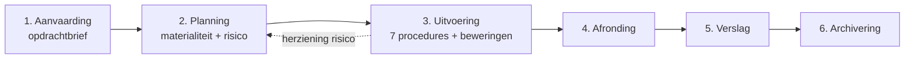

> **Leerstuk — één vraag, helemaal doorgewerkt.** Dit is het zwaarste leerstuk van PO 1.6 — drie iteratieve fases (aanvaarding · planning · uitvoering) waarin je leert hoe risico-inschatting de strategie stuurt en hoe procedures bewijs leveren voor beweringen. Audit is geen lineaire afvinklijst — het is een dialoog tussen risico-hypothese en bevindingen die doorlopend bijgewerkt wordt. Voor het onderbouwende kader rond bedreigingen + safeguards: lees [[onafhankelijkheid-en-deontologie-bij-controleopdrachten]]. Voor de directe vervolgstap (afronding + verslag-keuze): [[afronden-en-rapporteren-van-een-audit]]. Voor verhaal en routekaart: [[studiemateriaal/1-6|overzicht PO 1.6]].

## Antwoord in één blik

Een audit-opdracht doorloopt drie iteratieve fases. In **aanvaarding** toets je achtereenvolgens je eigen onafhankelijkheid, de randvoorwaarden bij de cliënt en de capaciteit van je team — en pas dan onderteken je een opdrachtbrief. In **planning** verwerf je inzicht in de entiteit en haar interne beheersing, leg je de materialiteit vast (door de auditor — niet door cliënt of wet) en identificeer je per bewering waar het risico zit. In **uitvoering** kies je uit zeven controlewerkzaamheden — gerangschikt naar bewijskracht: van externe bevestiging tot verzoek om inlichtingen — en verzamel je voldoende en geschikt bewijs voor elke bewering. Die drie fases voeden elkaar: bevindingen tijdens uitvoering kunnen je risico-inschatting bijsturen, en je risico-inschatting bepaalt hoe diep je uitvoert.

Voor NV REVIA Vlaanderen — onze doorloop-cliënt, een controleplichtige industrievennootschap in Mechelen — komt dat concreet neer op één getal en drie issues. De materialiteit voor boekjaar 2024 is **210.000 EUR** (5 % van 4,2 mln resultaat voor belastingen); de uitvoeringsmaterialiteit **158.000 EUR** (75 % daarvan). Drie audit-issues lopen als rode draad door alle drie fases: een hangende rechtszaak ROCHE-Gent (claim 1,2 mln), een vermoeden van technologische veroudering op cleanroom-voorraad (boekwaarde 600k) en een lage respons op handelsvorderingen-confirmaties (65 %). Op het einde van de uitvoeringsfase sta je klaar met geverifieerde bevindingen — die input voedt [[afronden-en-rapporteren-van-een-audit]].

De gestreepte pijl is geen ornament — bevindingen tijdens uitvoering kunnen je dwingen terug te keren naar planning. Audit is iteratief, niet lineair.

---

## Fase 1 — Aanvaarding van de opdracht

De scharniervraag van elke nieuwe-cliënt-situatie is: *mag ik deze opdracht aanvaarden — en zo ja, op welke voorwaarden?* Het antwoord vereist drie toetsen achter elkaar. Eerst de onafhankelijkheid: kun je onbevooroordeeld werken? Daarna de randvoorwaarden: heeft de cliënt een aanvaardbaar boekhoudkundig kader en wil het management zijn verantwoordelijkheid erkennen? Tot slot de capaciteit: heb je de competentie en de middelen? Pas wanneer alle drie groen kleuren, leg je de opdracht vast in een schriftelijke opdrachtbrief.

### Onafhankelijkheids-toets bij aanvaarding

De wet is hier ongebruikelijk hard. De externe accountant moet een opdracht **weigeren** — of de uitvoering stopzetten — zodra hij het bestaan vaststelt van invloeden, feiten of banden die zijn onafhankelijkheid, zijn wils- of beoordelingsvrijheid of zijn onpartijdigheid kunnen aantasten. Geen "voorzichtig zijn", geen "documenteren en doorgaan" — **weigeren**. Dezelfde regel geldt voor medewerkers en voor de personen op wie hij beroep doet.

Om dit werkbaar te maken in de praktijk hanteert het beroep het bedreigingen-kader van de IESBA-code. Vijf categorieën:

| Bedreiging | Wat het is | Typisch voorbeeld |
|---|---|---|
| **Eigenbelang** | Financieel of persoonlijk belang verstoort het oordeel | Honorarium > 15 % van kantooromzet bij één cliënt; commissie-vergoeding |
| **Zelf-toetsing** | Je moet later je eigen werk controleren | Je hebt de waardering eerst opgesteld en moet ze nu auditen |
| **Belangenbehartiging** | Je verdedigt de cliënt tegenover derden | Je pleit de zaak van de cliënt bij de fiscus of een bank |
| **Vertrouwdheid** | Te lange of te nauwe relatie met cliënt-team | Twintig jaar dezelfde partner; familieband met CFO |
| **Intimidatie** | Cliënt dreigt met vervanging als auditor "lastig" wordt | Patriarch zegt: "wees redelijk of we zoeken een andere revisor" |

Per bedreiging stel je telkens twee vragen. Eerste vraag: is het niveau aanvaardbaar (een minimale, theoretische bedreiging die je gewoon documenteert)? Tweede vraag: zo niet — kunnen veiligheidsmaatregelen (*safeguards* — denk aan partner-roulatie, kwaliteitsreview door een tweede vennoot, functiescheiding binnen het kantoor) de bedreiging terugbrengen tot een aanvaardbaar niveau? Pas als beide antwoorden ja zijn, mag je de opdracht aanvaarden.

Voor REVIA bij de start van het mandaat 2023 viel die toets gunstig uit. BV Audit & Controle (de commissaris) had vóór het mandaat geen bestaande adviesrelatie met REVIA Vlaanderen, noch met REVIA Polska, noch met de minderheidsaandeelhouder INVESTRA. Het jaarlijks honorarium van 48.000 EUR vertegenwoordigt geen problematisch aandeel in de kantooromzet (de richtdrempel ligt op 15 %). M. Dewulf, de tekenende vennoot, heeft geen familieband met de familie Verbeke. → aanvaardbaar, opdracht ondertekend.

> **De toets blijft doorlopend.** Onafhankelijkheid wordt niet alleen bij de start beoordeeld, maar bij elk nieuw boekjaar én bij elke gebeurtenis die het beeld kan kantelen. In 2024 vroeg patriarch Hubert Verbeke of het commissarissen-kantoor de inbreng-in-natura van het gebouw kon opnemen als bijzonder mandaat. Dat zou een **zelf-toetsings**-bedreiging creëren: de commissaris zou zijn eigen waardering nadien moeten beoordelen in zijn jaarrekeningcontrole 2025. Safeguards waren onvoldoende → het bijzonder mandaat werd geweigerd, de jaarrekeningcontrole loopt door. Het bestuursorgaan wees een andere beroepsbeoefenaar aan. Het volle threats-and-safeguards-kader (met decision-tree) staat uitgewerkt in [[onafhankelijkheid-en-deontologie-bij-controleopdrachten]].

### Randvoorwaarden — kan deze cliënt überhaupt audit-baar zijn?

Naast je eigen onafhankelijkheid moet je nagaan of er aan de cliëntzijde voldoende grondslag is om audit-bewijs op te bouwen. Twee elementen samen vormen de "randvoorwaarden" zoals omschreven in de internationale audit-standaard rond opdrachtaanvaarding: een aanvaardbaar stelsel inzake financiële verslaggeving, én de uitdrukkelijke erkenning door het management van zijn drievoudige verantwoordelijkheid — voor het opstellen van de jaarrekening, voor de interne beheersing die daartoe nodig is, en voor het verlenen van toegang aan de auditor (tot stukken, personeel én aanvullende informatie die hij nodig heeft).

Voor REVIA klopt dit. Het stelsel is het Belgisch jaarrekeningrecht (KB tot uitvoering van het WVV), aangevuld door de geconsolideerde jaarrekening van de REVIA-groep met IFRS-equivalente waardering (geen IFRS-plicht, want REVIA is niet beursgenoteerd en geen organisatie van openbaar belang). Het management erkent zijn verantwoordelijkheid expliciet in de opdrachtbrief. → randvoorwaarden voldaan.

Stel dat het management daarentegen zou weigeren om bepaalde stukken ter beschikking te stellen — bijvoorbeeld de notulen van de Raad van Bestuur — dan is de randvoorwaarde geschonden. Je aanvaardt dan de opdracht **niet**, of je legt in de opdrachtbrief expliciet vast wat er buiten scope blijft (met de consequenties voor het oordeel).

> **De aanvaardings-scope-beperking is een andere figuur dan de uitvoerings-scope-beperking.** Bij aanvaarding leidt een verwacht ontbrekend stuk tot weigering (of een uitdrukkelijke uitzondering in de opdrachtbrief). Tijdens uitvoering leidt een onverwacht ontbrekend stuk tot een scope-beperking-vraag op verslag-niveau — die kan resulteren in een voorbehoud of, bij diepgaande impact, een onthoudende verklaring. Die beslismatrix staat uitgewerkt in [[afronden-en-rapporteren-van-een-audit]].

### De opdrachtbrief

Na een geslaagde onafhankelijkheids- en randvoorwaarden-toets wordt de opdracht vastgelegd in een schriftelijke opdrachtbrief (*engagement letter*) die zowel door de auditor als door het management wordt ondertekend. Dat is geen formaliteit — de opdrachtbrief bakent wederzijdse verwachtingen af en voorkomt geschillen achteraf.

Wat de opdrachtbrief minimaal moet bevatten:

| Element | Inhoud voor REVIA 2024 |
|---|---|
| Doelstelling en scope | Wettelijke jaarrekeningcontrole boekjaar 2024 — enkelvoudig + geconsolideerd |
| Verantwoordelijkheden | Management voor jaarrekening + IC + toegang; auditor voor oordeel |
| Toepasselijke standaarden | Volledig ISA-stelsel + ITAA-KMO-controlenorm |
| Verwachte rapportering | Controleverklaring + management letter |
| Niet-detectie-risico-clausule | Audit biedt geen absolute zekerheid wegens steekproef-aard + inherente beperkingen IC |
| Honorarium en facturering | 48.000 EUR voor boekjaar 2024 |
| Toegang | Tot stukken, personeel, aanvullende inlichtingen |

Voor REVIA werd de opdrachtbrief 2024 ondertekend door M. Dewulf (voor BV Audit & Controle) en door Wouter Verbeke (CEO en gedelegeerd bestuurder, voor REVIA Vlaanderen). De tekst sluit aan op het model in de bijlage van de internationale audit-standaard rond opdrachtaanvaarding.

---

## Fase 2 — Planning van de audit

Planning is geen administratief voorwerk — het is het moment waarop je je **strategie** bepaalt. Drie samenhangende vragen sturen de hele fase. *Wie is de cliënt en in welke omgeving werkt hij?* (kennisverwerving). *Hoeveel mag erin glippen vóór het oordeel breekt?* (materialiteit). *Waar zit het risico op materiële afwijking, en per welke bewering?* (risico-inschatting). De drie vragen voeden elkaar — iteratie is de norm.

### Kennisverwerving — entiteit, omgeving, IT, interne beheersing

Zonder kennis van de entiteit en haar omgeving is geen behoorlijke risico-inschatting mogelijk. De internationale audit-standaard rond risico-inschatting (in haar herziene versie, in voege voor controles van periodes vanaf 15 december 2021) vraagt je inzicht te verwerven in drie domeinen tegelijk. Ten eerste de **entiteit en haar omgeving** — sector, regelgeving, economische context, eigenaarschap. Ten tweede het **van toepassing zijnde stelsel inzake financiële verslaggeving** — voor een Belgische niet-beursgenoteerde vennootschap: KB WVV plus CBN-adviezen. Ten derde het **systeem van interne beheersing** — de vijf COSO-componenten plus expliciet de IT-componenten.

Voor REVIA krijg je een vrij scherp beeld. De sector is hoogwaardige precisie-onderdelen voor de farmaceutische verpakkingsindustrie — klanten zijn grote pharma-OEM's met lange contracten en lange betalingstermijnen (wat verklaart waarom de handelsvorderingen zo zwaar wegen op de balans). Concurrentie komt uit Duitsland en Zwitserland. Er is een belangrijke technologische trend: klanten migreren naar een nieuwere generatie vul-machines, wat rechtstreeks raakt aan het voorraad-veroudering-risico op een specifieke productlijn. Regulatoir gelden ISO-normen voor cleanroom-omgevingen plus de EU-richtlijn rond medische hulpmiddelen voor de eindklant-toepassing.

Voor de interne beheersing is het beeld gemengd. De controle-omgeving is sterk: een ervaren CFO sinds 2020, een onafhankelijk bestuurder met financieel profiel die de auditcomité-rol collectief opneemt binnen de RvB (een auditcomité is niet verplicht — REVIA is geen organisatie van openbaar belang), 280 medewerkers wat voldoende functiescheiding mogelijk maakt tussen aankoop, voorraad en boekhouding. SAP draait sinds 2022 als enkele ERP-omgeving — dat versterkt de controles op autorisaties en master-data, maar maakt de IT-algemene-controles ook auditkritisch. Wat ontbreekt: er is geen aparte interne audit-functie, waardoor de monitoring-laag (COSO-component 5) zwakker is dan ideaal.

Op basis hiervan kun je oordelen op welke onderdelen je later kan **steunen** op IC (en dus minder substantieve werkzaamheden kan uitvoeren), en op welke je een volledig substantieve aanpak nodig hebt. Voor REVIA: SAP-gedreven cycli (aankoop, verkoop) lenen zich tot steunen; de twee significante risico's (rechtszaak en voorraad-waardering) krijgen een volledig substantieve aanpak.

> **IT is geen apart hoofdstuk meer.** De herziene risico-inschattings-standaard verweeft IT-overwegingen door alle risico-inschattingswerkzaamheden heen, en vraagt expliciet inzicht in de algemene IT-controles én in de geautomatiseerde toepassingscontroles. Voor REVIA met SAP sinds 2022 betekent dat: autorisaties, master-data-changes, periodieke afsluitings-jobs en de interface met het salaris-systeem zijn audit-relevant. De volledige uitwerking van interne beheersing + COSO + drie verdedigingslijnen leeft als eigen onderwerp in [[wat-is-interne-controle-en-coso]] (PO 1.7).

### Materialiteit — door de auditor vastgelegd

De examen-klassieker luidt: **wie legt de materialiteit vast?** Het antwoord is eenduidig — de **auditor**, in zijn professional judgment. Niet het management, niet de Algemene Vergadering, niet "het Koninklijk Besluit". De materialiteit-standaard bepaalt expliciet dat de auditor bij het vaststellen van de algehele controleaanpak de materialiteit voor de financiële overzichten als geheel dient te bepalen — en daarnaast de uitvoeringsmaterialiteit voor de risico-inschatting en de bepaling van controlewerkzaamheden.

In de praktijk kies je een **benchmark** en pas je een **percentage** toe. Welke benchmark past, hangt af van het entiteits-profiel en van wie de primaire gebruikers van de jaarrekening zijn.

| Benchmark | Gangbaar % | Wanneer geschikt | Voor REVIA |
|---|---|---|---|
| Resultaat voor belastingen (genormaliseerd) | 5-10 % | Winstgevende stabiele entiteit; bank + aandeelhouders sturen op resultaat | **5 % × 4,2 mln = 210.000 EUR — gekozen** |
| Omzet | 0,5-1 % | Verlieslatend of sterk volatiel resultaat | 1 % × 62 mln = 620.000 — te hoog |
| Totale activa | 1-2 % | Vastgoed of holding waar balans-omvang doorslaggevend is | 1 % × 51 mln = 510.000 — niet passend |
| Eigen vermogen | 1-5 % | Opstartfase of sterk veranderende activiteit | 5 % × 22 mln = 1.100.000 — niet passend |

Voor REVIA past resultaat voor belastingen als benchmark om drie redenen samen: de marge is stabiel (~7 % EBIT), de primaire gebruikers (bank BNP Paribas Fortis met 12 mln lening + INVESTRA als minderheidsparticipatie) sturen op resultaatcijfers, en er zijn geen incidentele eenmalige items 2024 die normalisatie vragen. Vijf procent van 4.200.000 EUR levert **210.000 EUR overall materialiteit** op.

Daarbovenop bepaal je de **uitvoeringsmaterialiteit** — een fractie van overall, typisch 50-75 %. Hoe risicovoller de audit-omgeving (meer kans op accumulatie van kleine afwijkingen), hoe lager de fractie. REVIA heeft drie lopende audit-issues — dat pleit voor de bovenkant: 75 % × 210.000 = **158.000 EUR uitvoeringsmaterialiteit**. Tot slot leg je een drempel vast voor *duidelijk kleine afwijkingen* (typisch 5 % van overall — circa 10.000 EUR voor REVIA): afwijkingen onder die grens worden tijdens uitvoering niet geaccumuleerd.

> **Specifieke materialiteit voor gevoelige posten.** Voor bepaalde rekeningen of toelichtingen waar gebruikers bijzonder gevoelig zijn — bestuurders-bezoldigingen, commissaris-vergoeding, transacties met verbonden partijen — mag je een lagere materialiteit toepassen. Voor REVIA betekent dat een aparte, lagere drempel voor de toelichting verbonden partijen (transferprijzen REVIA Polska en transacties met de Verbeke-familie).

**Examen-strikvraag.** Twee maanden na publicatie van de jaarrekening zegt een gebruiker: "die fout van 50.000 EUR maakt toch niet uit, want die valt onder de materialiteit." Dat is **fout**. Materialiteit zegt wat de **auditor** onder welke drempel niet *hoeft* te corrigeren tijdens de controle — niet wat de gebruiker achteraf onbelangrijk vindt. En een fout van 50.000 EUR die op zich onder de uitvoeringsmaterialiteit (158k) valt, kan in combinatie met andere niet-gecorrigeerde fouten alsnog materieel worden bij de slot-evaluatie.

### Risico-inschatting — per bewering

De pedagogische scharniervraag van risico-inschatting is eenvoudig: *waar in deze jaarrekening kan het misgaan?* Het antwoord loopt langs de **beweringen** (*assertions*). Een bewering is een type uitspraak die in een jaarrekening verstopt zit — wie de beweringen niet ziet, ziet het audit-bewijs niet.

De internationale risico-inschattings-standaard onderscheidt drie categorieën beweringen, samen dertien stuks:

| Categorie | Bewering | Wat het betekent | Voorbeeld REVIA |
|---|---|---|---|
| **Klassen van transacties + gebeurtenissen** | Plaatsgevonden | Geboekte transactie heeft echt plaatsgevonden en hoort tot entiteit | Geboekte omzet 62 mln — gefactureerd én geleverd in 2024 |
| | Volledigheid | Alle plaatsgevonden transacties zijn geboekt | Volledigheid aankopen Polska — match factuur ↔ ontvangst |
| | Juistheid | Bedragen correct geboekt | Transfer pricing Polska — cost + 8 % correct toegepast |
| | Afgrenzing (cut-off) | In juiste boekjaar geboekt | Cut-off omzet 31/12/2024 — leveringsdocumenten match |
| | Classificatie | Op juiste rekening geboekt | Onderhoud vs investering — capex/opex-grens |
| **Rekeningsaldi op einde periode** | Bestaan | Activa/passiva bestaan werkelijk | Bestaan handelsvorderingen 11 mln — issue 3 |
| | Rechten en verplichtingen | Eigendomsrechten + verplichtingen kloppen | Eigendomstitels gebouwen + machines |
| | Volledigheid | Alle activa/passiva geboekt | Volledigheid voorzieningen — rechtszaak — issue 1 |
| | Juistheid van waardering | Tegen juiste waarde geboekt | Waardering voorraad cleanroom 600k — issue 2 |
| | Classificatie | Correct gepresenteerd | Obligaties LT vs KT-deel |
| **Presentatie en toelichtingen** | Plaatsgevonden + rechten | Toegelichte transacties bestaan | Toelichting transactie Verbeke-gebouw |
| | Volledigheid | Alle vereiste toelichtingen | Toelichting hangende rechtszaak — KB WVV |
| | Classificatie en begrijpelijkheid | Correct gerubriceerd en duidelijk | Heldere uiteenzetting transfer pricing |
| | Juistheid en waardering | Cijfers in toelichtingen correct | Bedrag herwaarderingsmeerwaarde 2 mln |

Per cluster van transacties en per saldopost bepaal je vervolgens welke beweringen **risico** lopen — en hoe hoog. Voor REVIA zijn vier risico's geïdentificeerd, waarvan twee als **significant** worden geclassificeerd:

1. **Hangende rechtszaak ROCHE-Gent** — bewering *volledigheid passiva*: mogelijk onderwaardering voorzieningen. **Significant**.
2. **Voorraad-waardering cleanroom-onderdelen** — bewering *juistheid van waardering activa*: vermoeden technologische veroudering. **Significant**.
3. **Bestaan + waardering handelsvorderingen** met lage confirmaties-respons — courant audit-thema. Niet significant.
4. **Verbonden partijen** (transferprijs REVIA Polska) — verhoogde aandacht door specifieke verbonden-partijen-standaard, niet significant.

Een **significant** risico (een risico dat in het oordeel van de auditor bijzondere controleaandacht vereist) heeft drie gevolgen. Eerste gevolg: senior team-aandacht (geen junior alleen). Tweede: uitsluitend substantieve werkzaamheden — geen volledige steun op IC. Derde: als je vóóraf toch steun op IC veronderstelt, moet je de operationele effectiviteit van die controles **expliciet testen** (anders volledig substantief). Voor REVIA: rechtszaak en voorraad krijgen senior aandacht; lawyer's letter voor de rechtszaak, en een combinatie van inspectie, interviews en externe benchmarking voor de voorraad.

> **Risico-inschatting is doorlopend.** Wat je bij planning vaststelt is een hypothese — geen vonnis. Bevindingen tijdens uitvoering kunnen je dwingen het risico-beeld te herzien. De gestreepte pijl in het audit-cyclus-diagram (uitvoering → planning) is hoe het werkt.

### Strategie en werkprogramma

Nadat materialiteit en risico-inschatting vastliggen, kies je een audit-strategie. Twee uitersten. Aan de ene kant **steun op interne beheersing**: minder substantieve werkzaamheden zijn mogelijk wanneer IC sterk is én je de operationele effectiviteit ervan toetst. Aan de andere kant een **volledig substantieve** benadering: geen steun op IC, al je bewijs uit eigen procedures. In de praktijk is het bijna altijd een mix per bewering.

Voor REVIA 2024 ziet de mix er als volgt uit. Voor de aankoop- en verkoop-cyclus steun je op de SAP-controles (autorisaties + functiescheiding sterk). Voor de twee significante risico's (rechtszaak + voorraad-waardering) ga je volledig substantief — geen steun op IC. Voor lonen kies je een tussenvorm: analytische procedures op het totaal plus een kwartaalsteekproef.

Twee aanpalende afspraken horen bij planning thuis. De eerste is **delegatie en supervisie**. De opdrachtpartner (M. Dewulf) blijft eindverantwoordelijk voor het hele audit-team — briefing vooraf, tussentijdse reviews, slot-review vóór ondertekening van het verslag. Juniors krijgen controleerbare opdrachten binnen een tijdsbudget; de manager superviseert dagelijks. Wat bij gebrek aan supervisie misgaat zie je in mini-case 3 hieronder bij uitvoering — een junior die een interne maandafsluiting accepteert als cut-off-bewijs.

De tweede afspraak is **communicatie met governance**. Vóór de uitvoering moet de commissaris de Raad van Bestuur (of het auditcomité, waar dat bestaat) informeren over zijn audit-strategie, de materialiteit en de geïdentificeerde significante risico's. Voor REVIA: M. Dewulf presenteert in oktober 2024 aan de RvB de aanpak — overall materialiteit 210.000 EUR, drie significante issues, voorgestelde diepgang per cyclus.

---

## Fase 3 — Uitvoering van controlewerkzaamheden

Uitvoering is bewijs verzamelen om de risico's uit fase 2 af te dekken. De internationale audit-bewijs-standaard vraagt dat je *voldoende* en *geschikt* audit-bewijs verkrijgt. "Voldoende" gaat over hoeveelheid — je steekproefomvang. "Geschikt" gaat over kwaliteit — relevantie en betrouwbaarheid. De zeven controlewerkzaamheden (plus observatie als achtste, apart geclassificeerd) hebben elk hun eigen plek in een betrouwbaarheids-rangorde die je voortdurend in het achterhoofd hebt.

### De zeven controlewerkzaamheden + de rangorde

De rangorde-vraag is steeds: *welk bewijs telt het zwaarst?* De toepasselijke ISA-leidraad rangschikt audit-bewijs naar bron en aard. Drie principes komen telkens terug: extern bewijs is sterker dan intern, schriftelijk sterker dan mondeling, en door de auditor zelf gegenereerd bewijs is sterker dan door de cliënt aangeleverd materiaal.

| Rangorde | Procedure | Omschrijving | Sterkte | Toepassing REVIA |
|---|---|---|---|---|
| 1 | **Externe bevestiging** | Schriftelijke reactie van derde rechtstreeks aan auditor | Hoogste — extern + onafhankelijk + schriftelijk | Bank confirmation BNP Paribas Fortis (saldo's + leningen + zekerheden); confirmaties handelsvorderingen top-20; lawyer's letter ROCHE-Gent |
| 2 | **Inspectie van materiële activa** | Fysieke waarneming | Sterk voor bestaan; zwakker voor waardering | Voorraadtelling cleanroom-onderdelen 31/12/2024 |
| 3 | **Inspectie van documentatie** | Onderzoek van schriftelijke stukken | Externe documenten > interne documenten | Verzendingsdocumenten + leveringsbonnen (sterk extern); inkoopfacturen leveranciers (sterk extern); maandelijkse interne staat (zwak intern) |
| 4 | **Opnieuw uitvoeren** (reperformance) | Auditor voert procedure of controle van management opnieuw uit | Hoog — direct door auditor | Voorraad-waardering FIFO-recalculatie op steekproef |
| 5 | **Herberekening** | Wiskundige juistheid controleren | Hoog — direct door auditor | Afschrijvingen machines + rentelasten BNP-lening + belastingen op resultaat |
| 6 | **Cijferanalyses** | Evaluatie via relaties tussen gegevens | Effectief in planning + slot-review; zwakker als enige bron | Brutomarge per productlijn; DSO-evolutie 9,8 → 11,0 mln; personeelskost per medewerker |
| 7 | **Verzoek om inlichtingen** | Mondelinge/schriftelijke vragen | Laagste op zich — altijd combineren | Interview productiehoofd over technologische veroudering |
| apart | **Observatie** | Waarneming van proces uitgevoerd door anderen | Punt-in-tijd — niet representatief voor heel jaar | Observatie voorraadtelling-procedure 31/12/2024 |

Eén nuance is examen-klassiek. **Verzoek om inlichtingen** levert op zich nooit voldoende bewijs voor een bewering — het moet altijd worden gecombineerd (*corroborated*) met een sterkere procedure. Wie een interview met de productiehoofd als enige bron voor het oordeel "geen veroudering" aanvaardt, mist het punt. Inlichtingen vragen → ja. Maar daarna pas bevestigen met externe benchmarking, met inspectie van de verkooppipeline, met een eigen NRW-schatting.

### De drie audit-issues — procedures stap voor stap

We lopen nu de drie REVIA-issues door, telkens met hetzelfde schema: *risico → bewering → procedures → bewijs*.

#### Issue 1 — Hangende rechtszaak ROCHE-Gent

Een ex-klant ROCHE-Gent dient sinds 2023 een claim van **1,2 mln EUR** in voor een vermeende ontwerpfout aan een vul-installatie. Management classificeert als voorwaardelijke verplichting in toelichting — geen voorziening op de balans. Het risico zit op de bewering **volledigheid passiva**: mogelijk een onderwaardering van voorzieningen.

Vier procedures lopen parallel:

1. **Lawyer's letter** — positieve confirmatie aan de advocaat van REVIA met verzoek om evaluatie van de waarschijnlijkheid van uitkomst, een raming van het bedrag en een tijdshorizon. Dit is de procedure met de hoogste bewijskracht (externe + onafhankelijke schriftelijke bron) en is voor hangende rechtszaken expliciet voorgeschreven.
2. **Inspectie van correspondentie** ROCHE-Gent ↔ REVIA en het interne juridische dossier (externe + interne documentatie samen).
3. **Schriftelijke bevestiging management** (*Letter of Representation*) waarin het management bevestigt dat alle bekende rechtszaken zijn meegedeeld.
4. **Interview** met de juridisch verantwoordelijke binnen REVIA — corroboratie van de informatie uit de advocaat-brief.

Vier scenario's tekenen zich af voor de uitkomst (de eigenlijke oordeel-keuze hoort in [[afronden-en-rapporteren-van-een-audit]]):

- *Scenario A.* Advocaat zegt "onwaarschijnlijk" → toelichting volstaat, geen voorziening, goedkeurend oordeel.
- *Scenario B.* Advocaat zegt "waarschijnlijk, raming 800.000 EUR" → voorziening vereist; management corrigeert → goedkeurend oordeel.
- *Scenario C.* Zelfde advocaat-antwoord, maar management weigert correctie → afwijking 800.000 > materialiteit 210.000 → materieel, niet-diepgaand → **voorbehoud**.
- *Scenario D.* Management weigert de lawyer's letter te laten versturen → scope-beperking, mogelijk diepgaand → **onthoudende verklaring**. Dit laatste is een examen-klassieker.

#### Issue 2 — Voorraad-waardering cleanroom-onderdelen

Een productlijn voor één specifieke vul-machinegeneratie van klant X vertoont sinds 2023 sterk dalende afzet (klant X migreert naar een nieuwere machinegeneratie). Boekwaarde voorraad **600.000 EUR**. Het vermoeden is technologische veroudering — risico op de bewering **juistheid van waardering activa**.

Vijf procedures:

1. **Inspectie ouderdomslijst voorraad** — hoe lang staat elke productlijn op stock, wat is de rotatiesnelheid.
2. **Interview productiehoofd** over de klant-X-pipeline en de technologie-migratie (verzoek om inlichtingen — zwakke bron, alleen ondersteunend).
3. **Externe benchmarking** — marktinformatie over de migratie van klant X naar de nieuwere machinegeneratie (sterker dan inquiry).
4. **Schatting netto-realiseerbare waarde** — inspectie van recente verkooppipeline + verwachte kortingen + uiteindelijke verwachte opbrengst.
5. **Eigen herberekening waardevermindering** — auditor genereert het cijfer zelf.

Stel dat de NRW-schatting uitkomt op 220.000 EUR tegenover een boekwaarde van 600.000 EUR. Volgens het CBN-principe "*lower of cost or net realisable value*" is een waardevermindering van 380.000 EUR nodig. Dat overschrijdt de overall materialiteit van 210.000 → materieel. Twee uitkomsten:

- *Scenario A.* Management boekt de correctie van 380.000 EUR → goedkeurend.
- *Scenario B.* Management weigert te corrigeren zonder ondersteunend tegen-bewijs → voorbehoud (afwijking materieel, niet-diepgaand).

#### Issue 3 — Lage respons confirmaties handelsvorderingen

Handelsvorderingen op de balans: **11.000.000 EUR**. Positieve confirmaties verzonden naar de top-20 klanten (dekking 78 % van het saldo, 8,6 mln aangeschreven). Respons na vervaldatum: 65 % (5,6 mln bevestigd). Non-respondenten: 7 klanten, samen 3,0 mln EUR. Het risico zit op **bestaan + waardering activa**.

Dit issue draait om een examen-klassieker die vaak verkeerd wordt beantwoord. Lage respons op confirmaties leidt **niet automatisch** tot een voorbehoud. De externe-bevestigingen-standaard schrijft expliciet voor dat de auditor bij non-respons eerst **alternatieve werkzaamheden** uitvoert. Pas als die ook falen voor een **materieel bedrag**, komt scope-beperking in beeld.

De alternatieve werkzaamheden voor non-respondenten:

1. **Subsequent receipts-test** — controleer welke van de 7 non-respondenten in januari-februari 2025 hebben betaald (subsequent payments zijn sterk bewijs van bestaan op balansdatum).
2. **Voor klanten zonder betaling** — verzendingsdocumenten + getekende leveringsbonnen + facturen + aanvaardingsbewijzen.

Uitkomsten:

- *Scenario A.* Alternatieve werkzaamheden dekken alle non-respondenten → geen impact oordeel, goedkeurend.
- *Scenario B.* Alternatieve werkzaamheden falen voor één klant met saldo 600.000 EUR > materialiteit → scope-beperking materieel, niet-diepgaand → voorbehoud.

### Drie extra accenten — cijferanalyses, cut-off, verbonden partijen

Drie thema's zijn geen aparte issues maar wel klassieke audit-aandachtspunten die het verschil maken tussen een ongelukkige en een degelijke audit.

**Cijferanalyses** gebruiken we in drie fases. In planning ontdekken ze onverwachte schommelingen die je risico-inschatting sturen. Voor REVIA: brutomarge per productlijn vergeleken met 2023 toont een volume-afwijking van −45 % op de productlijn klant X — dat is precies wat het voorraad-veroudering-risico zichtbaar maakte. De DSO-evolutie (handelsvorderingen 9,8 → 11,0 mln) signaleert het kredietrisico op handelsvorderingen. Tijdens uitvoering kun je substantieve cijferanalyses inzetten op specifieke beweringen. In afronding loopt de slot-review (zie [[afronden-en-rapporteren-van-een-audit]]).

**Cut-off** raakt de bewering *afgrenzing*. Het risico is dat omzet in het verkeerde boekjaar wordt geboekt — te vroeg geboekt blaast winst 2024 op, te laat geboekt onderdrukt ze. Procedures: inspectie van verzendingsdocumenten en getekende leveringsbonnen voor leveringen rond balansdatum.

> **Examen-strikvraag uit de REVIA-mini-cases.** Een junior accepteert de interne maandafsluiting per 30/11/2024 als bewijs voor cut-off omzet. De partner stopt het werk. Reden: een intern document — gegenereerd door de cliënt zelf — heeft een lage bewijswaarde. Voor cut-off omzet zijn **externe** verzendingsdocumenten nodig, plus getekende leveringsbonnen van de klant. Dit is een terugkerend examen-thema.

**Verbonden partijen** verdienen aparte aandacht door de specifieke ISA-leidraad daarover. Voor REVIA: transacties met REVIA Polska (transfer pricing cost + 8 %), met Verbeke Holding en — bijzonder interessant voor het komende boekjaar — met Hubert Verbeke privé (de inbreng-in-natura van het gebouw). Procedures: inspectie van transfer-pricing-documentatie, analytische review brutomarge per productlijn, vergelijking met externe benchmarks, en bevestiging van de volledigheid van de toelichting verbonden partijen in de jaarrekening.

### Bevindingen accumuleren — overgang naar afronding

Tijdens uitvoering verzamel je **bevindingen** — afwijkingen ten opzichte van de jaarrekening en onzekerheden. Die bevindingen worden geaccumuleerd per bewering, vergeleken met de uitvoeringsmaterialiteit (158.000 EUR voor REVIA) én met de overall materialiteit (210.000 EUR).

Op slot van uitvoering voor REVIA ziet de accumulatie er typisch zo uit:

| Issue | Bewering | Bedrag | Status |
|---|---|---|---|
| 1 — rechtszaak | Volledigheid passiva | Hangt af van advocaat-respons | Open |
| 2 — voorraad | Juistheid van waardering | Voorstel correctie 380.000 (indien NRW = 220k) | > materialiteit — open |
| 3 — confirmaties | Bestaan + waardering | 90 % gedekt na alternatieve werkzaamheden; residueel 600.000 | Open indien niet afgedekt |

Communicatie naar buiten gebeurt op twee niveaus. Niet-significante punten gaan via een **management letter**. Significante bevindingen of significante tekortkomingen in de interne beheersing worden **mondeling** aan de voorzitter van de RvB meegedeeld vóór de schriftelijke rapportage volgt — dat is wat de standaarden rond communicatie met governance en met interne beheersing vereisen. Voor REVIA: M. Dewulf bespreekt de drie issues eerst met CFO Eva Vermeulen en CEO Wouter Verbeke, vóór hij naar het volledige RvB-bord gaat.

De hand-off naar de afrondingsfase is direct. De cijfers en bevindingen die je hier opbouwde voeden de oordeel-keuze in [[afronden-en-rapporteren-van-een-audit]] — beslismatrix materieel × diepgaand. De drie REVIA-issues blijven daar als doorloop-cases meegaan.

---

## Drie valkuilen

> **Valkuil 1 — Materialiteit door management of cliënt laten vastleggen.** Fout. De materialiteit-standaard vereist expliciet dat de **auditor** in zijn professional judgment de materialiteit bepaalt. Materialiteit is een audit-instrument, geen cliënt-keuze. Wie het management op materialiteit laat sturen ("het zou voor ons gemakkelijker zijn als de drempel wat hoger lag") levert zijn auditor-rol in.

> **Valkuil 2 — Denken dat lage respons confirmaties automatisch leidt tot voorbehoud.** Fout. De externe-bevestigingen-standaard vereist eerst alternatieve werkzaamheden (subsequent receipts + verzendingsdocumenten + andere). Pas wanneer die *falen* voor een **materieel** bedrag, komt scope-beperking en daarmee voorbehoud in beeld. Examen-klassieker.

> **Valkuil 3 — Interne stukken aanvaarden als zelfstandig audit-bewijs.** Fout. Interne documenten — proef- en saldibalans van de interne boekhouder, interne maandafsluiting, intern memo — hebben een **lagere** bewijswaarde dan externe stukken. Voor cut-off omzet heb je externe verzendingsdocumenten en getekende leveringsbonnen nodig. Voor bijzondere mandaten (zie [[bijzondere-wettelijke-verslagen-bij-vennootschapsverrichtingen]]) is een proef- en saldibalans geen "staat van activa en passiva" — die laatste moet door het **bestuursorgaan** worden ondertekend.

---

## Wanneer je dit snapt, ga dan naar

- [[afronden-en-rapporteren-van-een-audit]] — De directe vervolg-stap. Afronding (evaluatie afwijkingen, schattingen, gebeurtenissen na balansdatum, continuïteit, LOR, jaarverslag) + oordeel-types met beslismatrix + revisiedossier. De drie REVIA-issues krijgen daar hun oordeel-uitkomst.
- [[onafhankelijkheid-en-deontologie-bij-controleopdrachten]] — De onderbouwende laag. Bedreigingen-kader IESBA met threats-and-safeguards-cyclus, prominent bij elke aanvaarding én bij elke gebeurtenis tijdens uitvoering die het beeld kan kantelen.
- [[wat-is-externe-controle-en-welke-opdrachten-bestaan]] — Voor het kader. Opdracht-types + statuut commissaris + normbronnen-hiërarchie. Lees terug bij onzekerheid over wettelijke vs contractuele controle.
- [[bijzondere-wettelijke-verslagen-bij-vennootschapsverrichtingen]] — Het parallelle spoor. Geen audit maar bijzonder mandaat met beperkte zekerheid. Verschil in werkwijze: staat A&P door bestuursorgaan i.p.v. ontwerp-jaarrekening; modelverslag i.p.v. controleverklaring.
- [[wat-is-interne-controle-en-coso]] — De input-laag (PO 1.7). COSO + drie verdedigingslijnen. Hier in PO 1.6 raak je alleen de audit-implicatie van interne beheersing aan.
- [[studiemateriaal/1-6/samenvatting|Samenvatting PO 1.6]] — Voor herhaling vlak vóór het examen — audit-cyclus zes fases op één pagina + materialiteits-formule + 7 procedures + 13 beweringen.

## Doorklik naar concepten

Voor wie definitorisch detail wil opzoeken:

- [[audit-planning]] · [[audit-bewijs]] · [[controleopdracht]]
- [[opdrachtaanvaarding-en-opdrachtbrief]] · [[onafhankelijkheid]] · [[isa-overzicht]]
- [[interne-controle]] · [[fouten-en-fraude]] · [[evaluatie-interne-controle]]

---

## Wettelijk fundament

- Aanvaarding opdracht + opdrachtbrief: ISA 210 §6 + §10. Randvoorwaarden (aanvaardbaar stelsel + erkenning verantwoordelijkheid management); schriftelijke opdrachtbrief verplicht.
- Onafhankelijkheid bij aanvaarding: KB 1 maart 1998 art. 9 + 11 + 13 + IESBA Code. Weigeren bij elke bedreiging die onafhankelijkheid, wils- of beoordelingsvrijheid of onpartijdigheid kan aantasten. Uitgewerkt in [[onafhankelijkheid-en-deontologie-bij-controleopdrachten]].
- Planning: ISA 300. Algehele audit-strategie + werkprogramma per bewering.
- Kennisverwerving entiteit + omgeving + interne beheersing: ISA 315 (herzien-2019) §13-37. Inzicht in entiteit + omgeving + financieel verslaggevingsstelsel + systeem interne beheersing (incl. IT-componenten — bijlage 6).
- Materialiteit: ISA 320 §10-11 + §9 (definitie uitvoeringsmaterialiteit). Door de auditor vastgelegd; benchmark + percentage + uitvoeringsmaterialiteit + drempel duidelijk kleine afwijkingen.
- Inspelen op risico's: ISA 330. Substantieve werkzaamheden + tests op operationele effectiviteit van interne beheersingsmaatregelen.
- Audit-bewijs + 7 procedures: ISA 500 §6 + §A14-A25. Voldoende en geschikt; betrouwbaarheids-rangorde extern > intern, schriftelijk > mondeling, door auditor gegenereerd > door cliënt aangeleverd.
- Voorraadtelling + rechtszaken: ISA 501 §4 (voorraad) + §9-12 (rechtszaken + lawyer's letter).
- Externe bevestigingen: ISA 505 §7 (beheersing verzoek) + §8 (weigering management) + §10-13 (non-respons + alternatieve werkzaamheden).
- Schriftelijke bevestigingen management (LOR): ISA 580.
- Cijferanalyses: ISA 520. Analytische werkzaamheden in planning + uitvoering + slot-review.
- Steekproeven: ISA 530. Statistische en niet-statistische steekproef-aanpakken.
- Schattingen: ISA 540 (herzien). Schattingen waardering (voorraad-veroudering + voorzieningen).
- Verbonden partijen: ISA 550. Identificatie + bewijs voor transacties verbonden partijen; voor REVIA: Polska + Verbeke Holding + persoonlijke transacties Hubert Verbeke.
- Communicatie governance + interne beheersing: ISA 260 + ISA 265. Significante bevindingen + significante tekortkomingen IC.
- Kwaliteitsmanagement op opdracht-niveau: ISA 220 (herzien). Delegatie + supervisie + slot-review; opdrachtpartner eindverantwoordelijk.
- ITAA-KMO-controlenorm — Belgische toepassing voor niet-OOB-entiteiten zoals REVIA; verwijst naar ISA's voor methodologie.

---

*Leerstuk PO 1.6 — proces 1 (zwaarste). Status: voorgesteld — ADR-037.*
