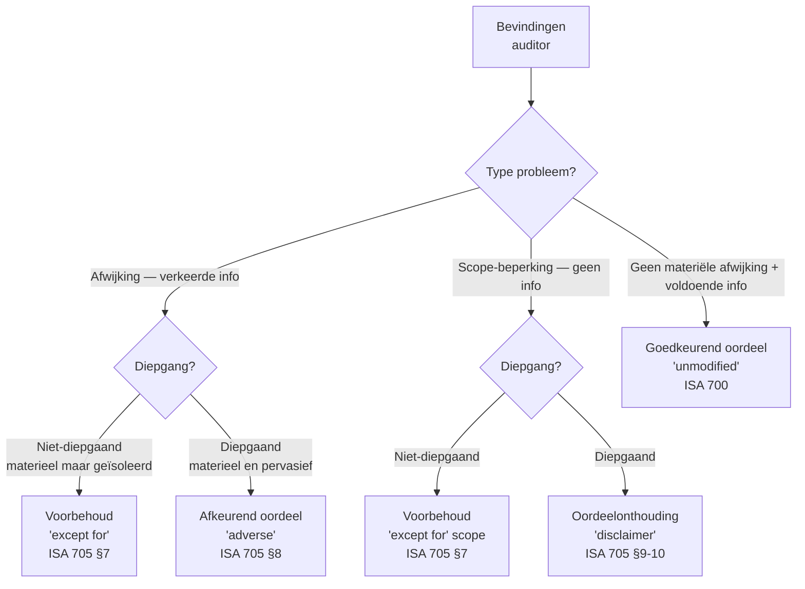

> **Leerstuk — één vraag, helemaal doorgewerkt.** Voor verhaal en routekaart: [[studiemateriaal/1-6|overzicht PO 1.6]]. Dit leerstuk sluit de audit-cyclus af met de keuze die derden uiteindelijk *zien*: de controleverklaring. Lees eerst [[aanvaarden-plannen-en-uitvoeren-van-een-audit]] — de drie REVIA-issues die daar opgebouwd werden krijgen hier hun uitkomst. Onthoud voor het examen één scherp onderscheid dat hier centraal staat: **oordeelonthouding** (geen informatie) is iets fundamenteel anders dan een **afkeurend oordeel** (verkeerde informatie).

## Antwoord in één blik

De afronding van een audit is geen administratieve afsluiting maar de finale toets of het verzamelde bewijs een oordeel kan dragen. Zes ISA-stappen lopen door elkaar — evaluatie van afwijkingen, controle van schattingen, gebeurtenissen na balansdatum, continuïteit, schriftelijke bevestigingen van management plus controle op het jaarverslag, en een slot-cijferanalyse. Dat alles mondt uit in één keuze: welk van de vier oordeel-types brengt de commissaris uit? En na ondertekening van de verklaring volgt nog één wettelijke verplichting — het volledige revisiedossier moet tien jaar bewaard blijven.

De **beslismatrix** is het hart van dit leerstuk. Twee assen sturen de keuze. *Aard van het probleem*: heeft de auditor een **afwijking** vastgesteld (verkeerde informatie zit in de jaarrekening, hij kent het bedrag) of een **scope-beperking** (hij kon geen voldoende bewijs verkrijgen, hij weet niet of er iets fout zit)? *Diepgang*: blijft het effect **geïsoleerd** binnen een specifieke rekening of toelichting, of dringt het zo **diepgaand** door alle lagen van de jaarrekening dat een "behalve voor"-uitzondering geen recht meer doet aan de werkelijkheid? Twee assen, vier cellen — vier oordeel-types.

Drie filters zeven het goedkeurend oordeel van het gemodificeerde af: zijn alle materiële afwijkingen door management gecorrigeerd? Is voldoende en geschikt bewijs verkregen? Bestaat er zekerheid over continuïteit? Drie keer ja → goedkeurend. Eén nee → gemodificeerd. En een vierde mogelijkheid die de matrix niet wijzigt maar wel de leeservaring kleurt: een paragraaf **benadrukking van aangelegenheden**, die de aandacht van de gebruiker richt op iets fundamenteels zonder het oordeel zelf aan te tasten.

We doorlopen hierna eerst de zes afrondings-stappen, bouwen daarna de beslismatrix op, vergelijken die met de drie REVIA-issues uit het vorige leerstuk, en sluiten af met het revisiedossier dat tien jaar moet blijven liggen.

---

## Afronding — zes stappen vóór het oordeel

De afrondings-fase is veel meer dan een administratieve aansluiting. Hier wordt vastgesteld of het bewijs dat tijdens de uitvoering verzameld werd, ook werkelijk volstaat om een oordeel te onderbouwen. Zes normen lopen door elkaar — elk vangt een ander type risico op. We werken ze één voor één uit met REVIA Vlaanderen als doorlopende casus.

### Stap 1 — Evaluatie van afwijkingen

Tijdens de uitvoering werden afwijkingen ontdekt. Tijdens de afronding worden ze **geaccumuleerd** per bewering en geëvalueerd tegen materialiteit. De internationale norm onderscheidt drie soorten:

- **Feitelijke afwijkingen** — onmiskenbare misrekeningen of misinterpretaties. Voorbeeld: een berekenfout in afschrijvingen.
- **Geprojecteerde afwijkingen** — uit een steekproef geëxtrapoleerd naar de populatie. Voorbeeld: een fout in drie van twintig voorraad-items wordt geprojecteerd over de hele voorraadpopulatie.
- **Beoordelings-afwijkingen** — verschillen tussen de schatting van de auditor en die van management. Voorbeeld: de voorraad cleanroom-onderdelen staat in de boeken voor 600.000 euro; de auditor schat de netto-realiseerbare waarde op 220.000 euro.

Voor REVIA Vlaanderen levert de accumulatie aan het einde van de uitvoeringsfase drie posten op. De hangende rechtszaak ROCHE-Gent geeft, na de lawyer's letter met evaluatie "waarschijnlijk veroordeling, raming 800.000 euro", een beoordelings-afwijking van 800k — geen voorziening is geboekt. De voorraad cleanroom-lijn geeft een beoordelings-afwijking van 380k — geen waardevermindering is geboekt. De externe confirmaties van handelsvorderingen daarentegen leveren geen afwijking op maar een **scope-beperking**: voor één klant met saldo 600k konden de alternatieve werkzaamheden geen bevestiging brengen.

Tel de eerste twee bij elkaar op en je krijgt een geaccumuleerde bekende afwijking van 1.180k versus een overall materialiteit van 210k — meer dan vijf keer de drempel. Materieel, zonder twijfel. De auditor deelt dit mee aan management en vraagt om correctie. Bij weigering moet de auditor vaststellen of de niet-gecorrigeerde afwijkingen, afzonderlijk of gezamenlijk, materieel zijn. Voor REVIA is dat antwoord onmiskenbaar ja — een modificatie van het oordeel is onvermijdelijk.

### Stap 2 — Schattingen

Een schatting is een post waarvan de waarde inherent onzeker is. Voorzieningen voor risico's en kosten, waardeverminderingen op voorraad, afschrijvingstermijnen voor machines, voorzieningen voor dubieuze klantvorderingen — telkens moet management een oordeel vellen op basis van veronderstellingen over toekomstige gebeurtenissen. Voor REVIA zijn twee van de drie significante issues schattingen: de voorziening voor de rechtszaak en de waardevermindering op de voorraad.

De herziene norm vraagt de auditor om vier zaken te beoordelen. De **waarderingsmethode** zelf — wordt ze consistent toegepast met vorige jaren? De **hypothesen** die management hanteert — zijn ze redelijk in het licht van marktinformatie en eigen ervaring? Eventueel een **onafhankelijke schatting** uitvoeren ter vergelijking — wat de auditor voor REVIA doet voor de voorraad cleanroom-lijn. En ten slotte de **presentatie en toelichting** in de jaarrekening — wordt de gebruiker voldoende geïnformeerd over de aard en de bandbreedte van de onzekerheid?

Voor de voorraad cleanroom-lijn is de redenering helder. Management schat de boekwaarde op 600k zonder waardevermindering. De auditor reconstrueert de netto-realiseerbare waarde op basis van pipeline-informatie en marktinformatie — uitkomst: 220k. Het verschil van 380k is de beoordelings-afwijking. Indien management onderbouwende bewijzen had aangereikt voor een hogere realiseerbare waarde — langlopende contracten, een nieuwe order — kon de auditor de schatting bijstellen. Dat gebeurt niet.

> **Een schatting evalueren is iets anders dan een schatting maken.** De auditor blijft auditor — hij vervangt de schatting van management niet door zijn eigen schatting. Hij beoordeelt of de schatting van management binnen een redelijke bandbreedte ligt. Pas wanneer die bandbreedte de overall materialiteit overschrijdt én management weigert te corrigeren, leidt dat tot een afwijking die het oordeel raakt.

### Stap 3 — Gebeurtenissen na balansdatum

De auditor stopt zijn werk niet op de balansdatum 31 december maar pas op de **datum van het controleverslag** — voor een Belgisch boekjaar typisch in maart of april van het volgende jaar. Tussen die twee datums kan veel gebeuren. De norm onderscheidt twee soorten gebeurtenissen, en het verschil tussen beide bepaalt de behandeling in de jaarrekening.

**Aanpassende gebeurtenissen** verschaffen informatie over omstandigheden die al op de balansdatum bestonden. De cijfers moeten worden aangepast. Voor REVIA is de lawyer's letter die in februari 2025 binnenkomt met evaluatie "waarschijnlijk veroordeling, raming 800k" zo'n aanpassende gebeurtenis: de rechtszaak liep al sinds 2023, dus de verplichting bestond op 31/12/2024. Een voorziening van 800k hoort in de cijfers terecht te komen.

**Niet-aanpassende gebeurtenissen** verschaffen informatie over een nieuwe situatie. De cijfers blijven onveranderd; bij voldoende materialiteit komt er een **toelichting**. Voor REVIA: een grote brand bij REVIA Polska in april 2025 met productiestop is een nieuwe situatie. De activa per 31/12/2024 waren onbeschadigd. De toelichting in de jaarrekening van REVIA-groep moet de gebeurtenis vermelden — voldoende materieel, geen aanpassing van de cijfers zelf.

| Gebeurtenis | Wanneer | Verwerking | Voorbeeld REVIA |
|---|---|---|---|
| **Aanpassend** | Informatie over situatie die op 31/12 al bestond | Cijfers aanpassen | Lawyer's letter februari 2025 — voorziening 800k boeken |
| **Niet-aanpassend** | Nieuwe situatie na 31/12 | Toelichting (indien materieel) | Brand REVIA Polska april 2025 — vermelding in toelichting |

### Stap 4 — Continuïteit

De jaarrekening wordt opgesteld in de veronderstelling van **going concern** — de aanname dat de vennootschap haar activiteit zal voortzetten. Die veronderstelling zit als waarderingsbasis ingebakken: zonder going concern moet er gewaardeerd worden tegen liquidatiewaarde. De norm vraagt de auditor om de beoordeling van management over continuïteit te evalueren over **minstens twaalf maanden** vanaf balansdatum, onafhankelijk risicofactoren te identificeren, en — afhankelijk van de uitkomst — al dan niet een aparte sectie "onzekerheid van materieel belang met betrekking tot continuïteit" in het verslag op te nemen.

Voor REVIA 2024 ziet de going-concern-beoordeling er gezond uit. Resultaat voor belastingen 4,2 miljoen euro. Positieve operationele kasstromen. Een langlopende BNP-lening van 12 miljoen met covenanten op de verhouding netto-financiële-schuld tot bedrijfsresultaat vóór afschrijvingen, en REVIA blijft ruim onder de grens. Geen aanhoudende verliezen, geen schulden in achterstand. Toetsing aan de Belgische alarmbel-equivalenten voor naamloze vennootschappen — geen alarm. Conclusie: de going-concern-veronderstelling volstaat; geen aparte sectie nodig in de verklaring.

> **Continuïteits-signalen zelf — ratio's, financiële diagnose, voorspelmodellen — leven uitgebreid in PO 1.9.** Voor de doorklik naar de financiële diagnose en de juridische alarmbel-procedures: zie het leerpad continuïteit en faillissementspredictie [[studiemateriaal/1-9|PO 1.9]]. Hier in PO 1.6 beperken we ons tot de auditrechtelijke implicatie: wanneer hoort een continuïteits-onzekerheid in de controleverklaring?

### Stap 5 — Schriftelijke bevestigingen + jaarverslag

Bij afsluiting vraagt de auditor management om in een formele brief — de *letter of representation* — een aantal zaken **schriftelijk te bevestigen**. Dat management de verantwoordelijkheid voor de jaarrekening accepteert. Dat alle bekende rechtszaken en claims zijn meegedeeld. Dat alle transacties met verbonden partijen zijn meegedeeld. Dat alle gebeurtenissen na balansdatum zijn meegedeeld. De brief is geen vervanger van audit-bewijs maar een aanvulling — een formele bevestiging die het verkregen bewijs onderbouwt. Voor REVIA wordt de letter ondertekend door CEO Wouter Verbeke en CFO Eva Vermeulen, en bevestigt onder meer de hangende rechtszaak en de geplande inbreng in natura door de patriarch in 2025.

Naast de jaarrekening publiceert de vennootschap ook een **jaarverslag** — het bestuursverslag dat verplicht is voor grote vennootschappen. Daarvoor heeft de auditor geen audit-opdracht in de strikte zin — het is geen object van zijn oordeel — maar wel een **consistentie-opdracht**: hij moet nagaan of de informatie in het jaarverslag overeenstemt met de jaarrekening en met wat hij tijdens de audit heeft vastgesteld. Bij materiële inconsistenties die niet worden gecorrigeerd: aparte vermelding in de controleverklaring.

Voor REVIA mentioneert het bestuursverslag de hangende rechtszaak ROCHE-Gent (consistent met de toelichting bij de jaarrekening) en de overname-plannen voor 2025 (vooruitkijkende informatie die de auditor toetst tegen het budget). Geen inconsistenties.

### Stap 6 — Slot-cijferanalyses en opdracht-review

Vóór ondertekening voert de opdrachtpartner een **slot-review** uit op de hele audit. Twee componenten lopen samen. Eerst **cijferanalyses op de jaarrekening als geheel** — kloppen de relaties tussen cijfers nog steeds, na alle correcties die tijdens de uitvoering werden verwerkt? Dit is een laatste check op onontdekte materiële afwijkingen. Daarnaast een **review of de geaccumuleerde bevindingen, samen met de uitgevoerde procedures, een coherente basis vormen voor het oordeel** — sluit het verhaal van bewijs en bevinding logisch aan op de oordeels-keuze die volgt?

Voor organisaties van openbaar belang (OOB) — beursgenoteerde ondernemingen, kredietinstellingen, verzekeringsondernemingen — is daarbovenop een **engagement quality review** door een onafhankelijke partner verplicht. REVIA is geen OOB, dus niet verplicht. Maar gezien de drie significante issues heeft kantoor BV Audit & Controle toch een onafhankelijke partner aangewezen — best practice in een dossier met meervoudige modificatie-risico's. De architectuur rond kwaliteitsmanagement op kantoor- en opdrachtniveau wordt uitgewerkt in [[onafhankelijkheid-en-deontologie-bij-controleopdrachten]].

---

## Oordeel-types — de beslismatrix

Met de afronding voltooid komt de keuze: welk oordeel brengt de auditor uit? Vier mogelijkheden staan op tafel. De selectie wordt gestuurd door twee assen — de aard van het probleem en de diepgang ervan — en de combinatie levert vier cellen op. Eerst leggen we de vier oordeel-types uit. Dan bouwen we de matrix op die de keuze tussen die vier stuurt. En ten slotte bekijken we een aparte categorie die de keuze *niet* wijzigt: de paragraaf benadrukking van aangelegenheden.

### De vier oordeel-types

Een **goedkeurend oordeel** (ook "ongewijzigd oordeel" — *unmodified opinion*) volgt wanneer alles in orde is: voldoende en geschikt bewijs is verkregen, geen materiële afwijkingen blijven onopgelost. De formulering is positief gesteld: "de jaarrekening geeft een getrouw beeld van het vermogen, de financiële toestand en het resultaat". Dit is de standaard-uitkomst van een audit op een goed gevoerde boekhouding.

Een **oordeel met voorbehoud** (*qualified opinion*) volgt wanneer er **iets** is, maar het is **niet diepgaand**. Twee subgroepen vallen onder deze noemer. Een **afwijking-met-voorbehoud**: "behalve voor de effecten van ..." — de specifieke fout wordt geïsoleerd vermeld in de basis voor het oordeel, maar de jaarrekening als geheel geeft nog wel een getrouw beeld. En een **scope-met-voorbehoud**: "behalve voor de mogelijke effecten van ..." — een specifieke onzekerheid wordt geïsoleerd vermeld. In beide gevallen blijft het oordeel beperkt tot het geïsoleerde element; de rest van de jaarrekening blijft betrouwbaar.

Een **afkeurend oordeel** (*adverse opinion*) volgt wanneer er een **diepgaand-materiële afwijking** is. De jaarrekening geeft **geen** getrouw beeld. Diepgaand betekent hier: het effect dringt zo door rekeningen en toelichtingen heen dat een "behalve voor" geen recht meer doet aan de realiteit. Een afkeurend oordeel is in de praktijk zeldzaam — meestal corrigeert management vóór het zover komt — maar het bestaat, en het is examenrelevant.

Een **oordeelonthouding** (*disclaimer of opinion*) volgt wanneer er een **diepgaand-materiële scope-beperking** is. De auditor kon **geen** voldoende en geschikt bewijs verkrijgen en weigert daarom een oordeel uit te brengen. Dit is geen "ik vind het slecht" — dat zou afkeurend zijn. Dit is "ik weet het niet en kan het niet weten". De Belgische tekst van de KMO-controlenorm laat over dat onderscheid geen ruimte: oordeelonthouding wanneer "de mogelijke gevolgen van eventuele niet-gedetecteerde afwijkingen voor de financiële overzichten zowel van materieel belang kunnen zijn als een diepgaande invloed zouden kunnen hebben".

> **Belgische bewoordingen versus internationale terminologie.** De ITAA-KMO-controlenorm gebruikt eigen paragraaf-nummering voor de drie types modificatie — voorbehoud, afkeurend, oordeelonthouding — die nauw aansluit bij de internationale norm. Voor het examen volstaat doorgaans de internationale terminologie, maar bij vragen die expliciet de KMO-controlenorm citeren: gebruik dan de Belgische bewoordingen en paragraaf-nummering uit die norm.

### De beslismatrix — twee assen, vier cellen

De beslismatrix is hét kernhulpmiddel om de vier oordeel-types uit elkaar te houden. Twee filters sturen de keuze.

**Filter één — aard van het probleem.** Een **afwijking** betekent dat de jaarrekening verkeerde informatie *bevat*. De auditor heeft bewijs van de fout en kent het bedrag of de aard ervan; management corrigeert echter niet. Een **scope-beperking** betekent dat de jaarrekening potentieel verkeerde informatie bevat zonder dat de auditor kan vaststellen of dat ook werkelijk zo is. De auditor heeft geen bewijs kunnen verkrijgen — geen lawyer's letter, geen voorraadtelling toegelaten, geen toegang tot een bankrelatie. Het verschil is wezenlijk: "ik weet dat er iets fout zit" versus "ik kan niet weten of er iets fout zit".

**Filter twee — diepgang.** Een **niet-diepgaand** probleem (in normentaal: niet-pervasief) blijft beperkt tot specifieke transacties, rekeningen of toelichtingen. Het effect zit niet verspreid over de hele jaarrekening; de rest van de cijfers geeft nog een getrouw beeld. Een **diepgaand** probleem dringt door alle of bijna alle elementen van de jaarrekening — of tast fundamentele waarden voor de gebruiker aan. Het effect is niet meer in een "behalve voor"-zin te vatten zonder de gebruiker te misleiden.

De combinatie van beide filters geeft vier cellen:

| | **Niet-diepgaand** | **Diepgaand** |
|---|---|---|
| **Afwijking** (verkeerde info) | Voorbehoud | Afkeurend |
| **Scope-beperking** (geen info) | Voorbehoud | Oordeelonthouding |

### De matrix toegepast — de drie REVIA-issues

De stagiair moet leren *zien* hoe een bevinding via deze matrix tot een concreet oordeel leidt. Dat doen we hier met de drie issues van REVIA Vlaanderen. Voor elk van de drie volgen we dezelfde route: aard van het probleem identificeren, diepgang inschatten, cel aanwijzen, oordeel formuleren.

**Issue 1 — de rechtszaak ROCHE-Gent.** De lawyer's letter komt binnen met evaluatie "waarschijnlijk veroordeling, raming 800.000 euro". Management weigert een voorziening te boeken. Wat doet de auditor?

Aard van het probleem: **afwijking**. Er is concreet bewijs van een verplichting die niet op de balans staat — de jaarrekening bevat verkeerde informatie. De auditor kent het bedrag (800k) en de aard van de fout (ontbrekende voorziening). Materieel: 800k versus 210k materialiteit — vier keer de drempel, ruim materieel.

Diepgang: **niet-diepgaand**. Het effect is geïsoleerd tot één specifieke voorziening op de balans. Andere rekeningen worden niet geraakt; de toelichting bestaat al (al is ze ontoereikend). De gebruiker leest dat er een rechtsgeding loopt en kan de impact zelf inschatten als hij die wil narekenen. De jaarrekening als geheel blijft, behalve voor deze ene post, een getrouw beeld geven.

Cel: afwijking × niet-diepgaand → **voorbehoud**. Formulering in de basis voor het oordeel: "behalve voor de effecten van het ontbreken van een voorziening van 800.000 euro voor de hangende rechtszaak ROCHE-Gent, geeft de jaarrekening een getrouw beeld ...". Indien management daarnaast ook had geweigerd om de lawyer's letter te laten sturen, dan kantelt het beeld: dan ontstaat een scope-beperking — geen bewijs over de uitkomst en omvang van de claim — en kan die scope-beperking diepgaand worden geacht omdat de auditor de gevolgen voor de jaarrekening niet kan inschatten. In dat tweede scenario zou oordeelonthouding op tafel komen.

**Issue 2 — de voorraad cleanroom-lijn.** De auditor stelt vast dat de netto-realiseerbare waarde naar zijn schatting 220k bedraagt versus een boekwaarde van 600k. Management weigert de waardevermindering van 380k te boeken en levert geen ondersteunend bewijs voor een hogere realiseerbare waarde.

Aard van het probleem: **afwijking**. Bewijs van een waarderingsprobleem ligt op tafel — pipeline-informatie van de verkoopafdeling, marktinformatie, ouderdomslijsten. Materieel: 380k versus 210k materialiteit — bijna twee keer de drempel, materieel.

Diepgang: **niet-diepgaand**. Effect blijft geïsoleerd tot één rubriek (voorraden) en zelfs binnen die rubriek tot één specifieke productlijn. Andere voorraadposten en de rest van de jaarrekening worden niet geraakt.

Cel: afwijking × niet-diepgaand → **voorbehoud**. Tweede voorbehoud-grond in dezelfde verklaring, naast de rechtszaak.

**Issue 3 — de externe confirmaties van handelsvorderingen.** Top-20 confirmaties verzonden, dekking 78 % van het saldo. Respons na vervaldatum: 65 %. De auditor voert voor de non-respondenten alternatieve werkzaamheden uit (*subsequent receipts*-test, verzendingsdocumenten, getekende leveringsbonnen). Voor zes van de zeven non-respondenten leveren de alternatieve werkzaamheden voldoende bewijs op. Voor één klant, met saldo 600k, falen ze: geen betaling ontvangen tot verslagdatum, en de verzendingsdocumenten en leveringsbonnen blijken onvolledig.

Aard van het probleem: **scope-beperking**. De auditor weet niet of de vordering bestaat en correct gewaardeerd is — hij heeft geen voldoende bewijs kunnen verzamelen. Geen bewijs van fout, geen bewijs van correctheid.

Diepgang: **niet-diepgaand**. Het effect blijft beperkt tot één klantsaldo van 600k. De rest van de handelsvorderingen — 10,4 miljoen — is voldoende bevestigd. Andere rekeningen worden niet geraakt.

Cel: scope-beperking × niet-diepgaand → **voorbehoud**. Derde voorbehoud-grond in dezelfde verklaring, deze keer met een "behalve voor de mogelijke effecten van ..."-formulering.

> **Wat als de issues samen wél diepgaand zouden worden?** De stagiair moet aandacht hebben voor **stapeling**. Wanneer drie afzonderlijk niet-diepgaande issues samen het hele beeld van de jaarrekening ondergraven, kan het oordeel kantelen van voorbehoud naar afkeurend. Voor REVIA is dat niet het geval: elke afwijking is geïsoleerd tot één specifieke rekening, en geen enkele tast de fundamentele waarden van de gebruiker aan. Het slot-oordeel is dan ook drievoudig voorbehoud — niet afkeurend. Maar de gewoonte om bij stapeling het beeld als geheel te herevalueren is essentieel.

### Paragraaf benadrukking van aangelegenheden

Niet elke aandachtswaardige gebeurtenis leidt tot modificatie van het oordeel. Een aparte paragraaf — **benadrukking van een aangelegenheid** — laat de auditor toe een zaak te onderlijnen zonder het oordeel zelf aan te tasten. Het oordeel blijft wat het is (typisch goedkeurend, maar de paragraaf kan ook bij een gemodificeerd oordeel voorkomen); de paragraaf richt de aandacht van de gebruiker op iets fundamenteels voor het begrip van de jaarrekening.

Drie typische situaties waar zo'n paragraaf past zonder modificatie. Een **onzekerheid van materieel belang met betrekking tot continuïteit** die correct is toegelicht in de jaarrekening — de toelichting volstaat, maar de auditor wil de zaak in zijn verslag onderstrepen. Een **belangrijke gebeurtenis na balansdatum** die correct is toegelicht — de brand bij REVIA Polska zou hier kunnen voorkomen indien de auditor oordeelt dat de gebeurtenis fundamenteel is voor het begrip van de gebruiker. Een **hangende rechtszaak met materiële onzekerheid** waarvan de toelichting voldoende is — maar waarvan de uitkomst zo zwaar weegt dat benadrukking gepast lijkt.

Naast de paragraaf "benadrukking van aangelegenheden" bestaat er een tweede variant: de paragraaf **andere aangelegenheden**. Het verschil zit in waar de aangelegenheid ligt. *Benadrukking* gaat over zaken die wél in de jaarrekening staan en die de auditor onderlijnt. *Andere aangelegenheden* gaat over zaken die **niet** in de jaarrekening staan maar die toch belangrijk zijn om mee te delen — bijvoorbeeld een vermelding van het opvolgingsmandaat van de vorige commissaris, of een uitleg over de reden van een onthouding van vergelijkende cijfers.

### Opbouw van de controleverklaring

De controleverklaring volgt een vaste structuur. Bedoeld voor derden — duidelijk leesbaar, niet voor specialisten. De gebruiker ziet eerst het oordeel, daarna pas de basis ervoor en de bredere context.

| Sectie verslag | Inhoud | Verplicht? |
|---|---|---|
| **Titel** | "Controleverklaring van de onafhankelijke commissaris" | Ja |
| **Ontvanger** | Algemene vergadering of bestuursorgaan | Ja |
| **Oordeel** | Conclusie eerst — goedkeurend / met voorbehoud / afkeurend / oordeelonthouding | Ja |
| **Basis voor oordeel** | Korte uitleg audit-aanpak + bevestiging van onafhankelijkheid | Ja |
| **Kern-audit-aangelegenheden** | Belangrijkste audit-thema's en hoe behandeld | Ja voor OOB; optioneel voor niet-OOB |
| **Onzekerheid m.b.t. continuïteit** | Aparte sectie wanneer going-concern-issue speelt | Wanneer relevant |
| **Andere informatie (jaarverslag)** | Consistentie-check met jaarrekening | Ja |
| **Verantwoordelijkheden management + governance** | Standaardtekst — boekhouding, interne beheersing, opstellen jaarrekening | Ja |
| **Verantwoordelijkheden auditor** | Standaardtekst — naleving normen, voldoende en geschikt bewijs | Ja |
| **Andere wettelijke vereisten (België)** | Vermeldingen-plicht — bestuursverslag-consistentie, boekhouding, overtredingen wetgeving | Ja |
| **Handtekening commissaris** | Persoonlijke handtekening bedrijfsrevisor-natuurlijke persoon | Ja |
| **Datum** | Na datum jaarrekening en *letter of representation* | Ja |

> **De handtekening is persoonlijk en niet delegeerbaar.** Een commissarisverslag wordt ondertekend door de bedrijfsrevisor-natuurlijke persoon die het kantoor vertegenwoordigt. Niet door het kantoor in abstracte zin, niet door een medewerker, niet door een gemachtigde. Dat persoonlijke element is een hoeksteen van de aansprakelijkheidsregeling.

---

## Revisiedossier — tien jaar bewaring

Alles wat de auditor heeft gedaan moet bewaard blijven. Niet alleen voor toekomstige cliënt-vragen, maar voor **tuchtspoor**, **aansprakelijkheid** en **peer review** door het IBR (kwaliteitstoetsing). De norm vraagt **voldoende documentatie** zodat een ervaren auditor die niet bij de opdracht betrokken was, de uitgevoerde werkzaamheden en de bereikte conclusies kan begrijpen. Het criterium is dus extern: kan iemand anders het werk reconstrueren?

Het revisiedossier bestaat uit drie soorten documenten. Het **permanent dossier** bevat wat van jaar tot jaar bestaat: statuten, samenstelling van het bestuursorgaan, overzicht van verbonden partijen, beschrijving van de interne beheersing, kantoor-overeenkomsten. Het **dossier boekjaar** bevat de werkdocumenten van het specifieke audit-jaar: de jaarrekening, de *letter of representation*, lawyer's letters, het werkprogramma, de bevindingen, het materialiteits-blad, de audit-strategie, de correspondentie met management. De **werkdocumenten** ten slotte bevatten de concrete testen, checklists, steekproef-resultaten en cijferanalyses.

De **bewaringstermijn is tien jaar**, vertrekkend vanaf de datum van het controleverslag — niet vanaf de balansdatum, niet vanaf de algemene vergadering. Voor het verslag over boekjaar 2024 dat REVIA in maart 2025 ondertekend krijgt, betekent dit: het revisiedossier wordt bewaard tot minstens maart 2035. Tien jaar lang moet het beschikbaar blijven voor de toezichthouder, voor de tuchtinstantie en voor eventuele aansprakelijkheidsvorderingen.

| Document-type | Voorbeelden | Levensduur |
|---|---|---|
| **Permanent dossier** | Statuten, bestuurssamenstelling, IC-beschrijving, kantoor-overeenkomsten | Loopt door over jaren — bijgewerkt |
| **Dossier boekjaar** | Jaarrekening, LOR, lawyer's letters, materialiteit-blad, werkprogramma, audit-strategie | Bewaard 10 jaar vanaf datum controleverslag |
| **Werkdocumenten** | Testen, checklists, steekproef-resultaten, cijferanalyses, slot-review-aantekeningen | Bewaard 10 jaar vanaf datum controleverslag |

> **Het revisiedossier wordt niet doorgestuurd — alleen ter beschikking gehouden.** Een veel voorkomende verwarring op het examen: een bijzonder mandaat van een gecertificeerd accountant moet binnen één maand worden doorgestuurd naar het ITAA. Het revisiedossier zelf wordt niet doorgestuurd; het blijft op kantoor beschikbaar voor kwaliteitstoetsing en tucht. De twee zaken — meldingsplicht van een verslag versus bewaringsplicht van een dossier — zijn fundamenteel verschillend.

---

## Drie valkuilen

> **Valkuil 1 — Oordeelonthouding en afkeurend oordeel door elkaar halen.** Ze hebben verschillende oorzaken en verschillende formuleringen. Oordeelonthouding betekent **geen informatie** — een scope-beperking die diepgaand is, waardoor de auditor weigert een oordeel uit te brengen. Afkeurend oordeel betekent **verkeerde informatie** — een afwijking die diepgaand is, waardoor de jaarrekening **geen** getrouw beeld geeft. Examen-klassieker: "wanneer geeft de auditor een oordeelonthouding?" — antwoord verwijst naar de bewoordingen uit de KMO-controlenorm over "niet in staat zijn voldoende en geschikte assurance-informatie te verkrijgen", niet naar een fout in de jaarrekening.

> **Valkuil 2 — Denken dat materieel hetzelfde is als diepgaand.** Het zijn twee verschillende drempels die los van elkaar moeten worden ingeschat. **Materieel** betekent: groter dan de overall materialiteit (voor REVIA 210k) — de auditor moet erop reageren. **Diepgaand** betekent: het effect strekt zich uit over alle of bijna alle rekeningen of toelichtingen, of tast de fundamentele waarden voor de gebruiker aan — een "behalve voor"-formulering doet geen recht meer aan de werkelijkheid. Een afwijking van 800k op één voorziening is materieel maar niet-diepgaand → voorbehoud, niet afkeurend. Een fout in de waarderingsgrondslag van alle vaste activa is ook materieel, en doordat ze elk rekening raakt, ook diepgaand → afkeurend.

> **Valkuil 3 — Denken dat een paragraaf benadrukking gelijkstaat met een modificatie van het oordeel.** Een benadrukkings-paragraaf laat het oordeel **ongemoeid**. Het oordeel blijft goedkeurend (of wat het ook is); de paragraaf vestigt de aandacht van de lezer op een zaak die de auditor fundamenteel acht voor het begrip van de gebruiker. Bijvoorbeeld een continuïteits-onzekerheid die voldoende toegelicht is in de jaarrekening — het oordeel blijft goedkeurend, met een paragraaf benadrukking ernaast. Wie "benadrukking" leest als "voorbehoud-light" verwart twee fundamenteel verschillende verslag-elementen.

---

## Wanneer je dit snapt, ga dan naar

- [[bijzondere-wettelijke-verslagen-bij-vennootschapsverrichtingen]] — vergelijking met het bijzonder-mandaat-spoor. Daar geen controleverklaring met getrouw beeld, maar modelverslag met conclusie "nettoactief niet overgewaardeerd". Beperkte zekerheid in plaats van redelijke. Examenzwaartepunt nummer één in PO 1.6.
- [[onafhankelijkheid-en-deontologie-bij-controleopdrachten]] — voor de kwaliteitsmanagement-architectuur (ISQM 1/2) en de engagement quality review bij slot-review. Kantoor-niveau en opdracht-niveau apart.
- [[aanvaarden-plannen-en-uitvoeren-van-een-audit]] — lees terug indien onzeker over hoe materialiteit, risico-inschatting en procedures de bevindingen produceren die hier in oordeel-keuze komen.
- [[wat-is-externe-controle-en-welke-opdrachten-bestaan]] — voor het kader rond opdracht-types en commissaris-statuut. Lees terug voor de plaats van de controleverklaring in de hele attesterings-architectuur.
- [[studiemateriaal/1-9|continuïteit en faillissementspredictie — PO 1.9]] — voor continuïteits-signalen, ratio's, financiële diagnose en de juridische alarmbel-procedures. Hier in PO 1.6 alleen de audit-implicatie.
- [[studiemateriaal/1-6/samenvatting|Samenvatting PO 1.6]] — voor herhaling vlak vóór het examen: beslismatrix oordeel-types, controleverklaring-opbouw en revisiedossier tien jaar op één pagina.

## Doorklik naar concepten

Voor wie definitorisch detail wil opzoeken:

- [[controleverklaring]] · [[audit-afronding]] · [[revisiedossier]]
- [[continuiteit]] · [[auditcomite]] · [[kwaliteitsmanagement-opdracht]]

---

## Wettelijk fundament

- Evaluatie van afwijkingen: ISA 450 §4-9. Drie categorieën (feitelijke + geprojecteerde + beoordelings) — accumulatie en evaluatie tegen materialiteit.
- Schattingen: ISA 540 (herzien). Schatting-evaluatie, eventueel onafhankelijke schatting, presentatie en toelichting.
- Gebeurtenissen na balansdatum: ISA 560. Onderscheid aanpassende versus niet-aanpassende gebeurtenissen tussen balansdatum en datum controleverslag.
- Continuïteit: ISA 570 (herzien) + KB-WVV art. 3:6 §1. Going concern als waarderingsbasis; aparte sectie "onzekerheid van materieel belang m.b.t. continuïteit" wanneer relevant. Verdere uitwerking: [[studiemateriaal/1-9|PO 1.9]].
- Schriftelijke bevestigingen (letter of representation): ISA 580 §10. Schriftelijke bevestiging door management — verantwoordelijkheid voor jaarrekening + volledigheid van mededelingen.
- Andere informatie (jaarverslag): ISA 720 (herzien). Consistentie-check met jaarrekening; aparte vermelding in verslag bij niet-gecorrigeerde inconsistentie.
- Goedkeurend oordeel: ISA 700 (herzien) §20-49. Modelverslag + verplichte secties. Belgische toepassing via de ITAA-KMO-controlenorm.
- Modificaties van het oordeel: ISA 705 (herzien) §7-10. Voorbehoud §7 · afkeurend §8 · oordeelonthouding §9-10. Belgische bewoordingen in ITAA-KMO-controlenorm §119 (voorbehoud), §120 (afkeurend) en §121 (oordeelonthouding).
- Paragraaf benadrukking van aangelegenheden + andere aangelegenheden: ISA 706 (herzien). *Emphasis of Matter* en *Other Matter* — zonder modificatie van oordeel.
- Documentatie + slot-review: ISA 230 + ISA 220 (herzien) §31 en §36. Voldoende documentatie zodat een ervaren niet-betrokken auditor werkzaamheden en conclusies kan begrijpen; slot-review en — voor OOB of op kantoorkeuze — engagement quality review (ISQM 2).
- Bewaring revisiedossier — 10 jaar: Wet 7 december 2016 betreffende de organisatie van het beroep van en het publiek toezicht op de bedrijfsrevisoren, art. 16. Voor gecertificeerd accountants een analoge regeling via Wet 17 maart 2019 betreffende de beroepen van accountant en belastingadviseur en het bijhorend koninklijk besluit. Vertrekpunt: datum van het controleverslag.
- Vermeldingen-plicht commissaris België: WVV art. 3:75. Bestuursverslag-consistentie + overeenstemming boekhouding met boekhoudregels + vaststelling van overtredingen van de wet of statuten.

---

*Leerstuk PO 1.6 — derde van vijf in het leerpad externe controle (proces 2: afronding + verslag). Voor de volledige routekaart: [[studiemateriaal/1-6|overzicht PO 1.6]].*
