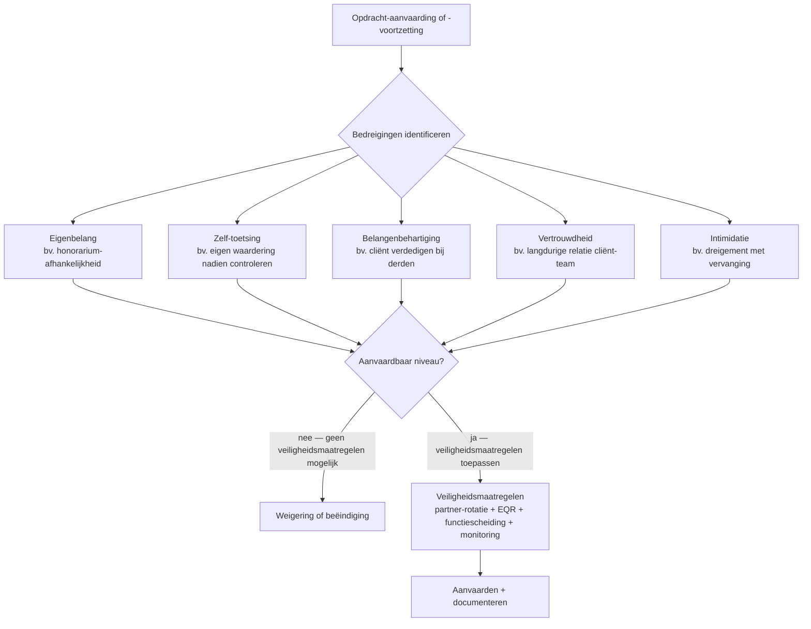

> **Leerstuk — één vraag, helemaal doorgewerkt.** Dit is de deontologische ondergrond onder elk van de vier vorige leerstukken: bij elke opdrachtaanvaarding, elk significant audit-risico, elk bijzonder mandaat en elke ondertekening van een verslag speelt onafhankelijkheid mee. Het hoort dus niet als bijlage — het is het kader dat de andere leerstukken stilzwijgend veronderstellen. De kantoor-brede kant (tucht, kwaliteitstoetsing, antiwitwasplichten, permanente vorming) zit niet hier maar in [[deontologische-beginselen-en-onafhankelijkheid|PO 4.0]]. Voor verhaal en routekaart: [[studiemateriaal/1-6|overzicht PO 1.6]].

## Antwoord in één blik

Onafhankelijkheid bij een controleopdracht is geen afvinklijst maar een **denk-methode**. Je past het IESBA-bedreigingen-kader toe — vijf categorieën die alle mogelijke onafhankelijkheids-risico's organiseren: **eigenbelang**, **zelf-toetsing**, **belangenbehartiging**, **vertrouwdheid** en **intimidatie**. Voor elk concreet dossier doorloop je dezelfde cyclus: identificeer welke bedreigingen spelen, toets of ze binnen een aanvaardbaar niveau blijven, pas veiligheidsmaatregelen toe als dat niet zo is, en weiger of beëindig de opdracht als zelfs die veiligheidsmaatregelen ontoereikend blijken. Het Belgisch recht verankert die laatste stap expliciet: een externe accountant moet een opdracht weigeren of voortijdig beëindigen zodra hij vaststelt dat invloeden, feiten of banden zijn onafhankelijkheid, beoordelingsvrijheid of onpartijdigheid kunnen aantasten.

Dat denkkader leeft op drie niveaus tegelijk. Op **kantoor-niveau** vraagt ISQM 1 dat elk audit-kantoor een kwaliteitsmanagement-systeem opzet — met procedures voor onafhankelijkheids-monitoring, een aanvaardings- en continueringsbeleid en een jaarlijkse evaluatie door de leiding. Op **opdracht-niveau** maakt ISA 220 herzien de opdrachtpartner persoonlijk verantwoordelijk voor de toepassing op één specifieke audit — van team-samenstelling tot slotreview. En op **uitzonderlijk niveau** vraagt ISQM 2 een opdrachtgerichte kwaliteitsbeoordeling door een onafhankelijke partner vóór ondertekening, verplicht voor controles van organisaties van openbaar belang en voor opdrachten waar het kantoor zelf bijzonder risico ziet.

Eén belangrijke nuance vooraf: onafhankelijkheid in deze strikte vorm geldt voor **attesterings-opdrachten** — audit, review, assurance volgens ISAE, bijzondere wettelijke verslagen. Voor zuivere advies- of samenstellings-opdrachten blijven de algemene deontologische beginselen gelden (integriteit, objectiviteit, vakbekwaamheid, vertrouwelijkheid), maar de aanvullende, strengere onafhankelijkheids-standaard is daar niet van toepassing.

We werken eerst het kader uit (vijf bedreigingen + cyclus), dan de Belgische wettelijke verankering, dan de drie kwaliteitsmanagement-lagen. De inbreng van het gebouw van patriarch Hubert Verbeke loopt als rode draad mee — een schoolvoorbeeld van zelf-toetsing waarin een commissaris-kantoor de opdracht doorbewust afwijst.

---

## Het IESBA-bedreigingen-kader — vijf categorieën

Het bedreigingen-kader is geen catalogus van verboden situaties maar een **kapstok**. Wanneer een nieuw mandaat op tafel ligt, of wanneer tijdens een lopend mandaat iets verandert (een nieuwe advies-opdracht, een wijziging in de team-samenstelling, een conflict met management), stel je telkens dezelfde vraag: welke van deze vijf categorieën speelt hier? De examen-klassieker is dan ook niet "is dit toegelaten?" maar "tot welke categorie behoort deze situatie?". Wie de vijf herkent, kan elke variant analyseren — wie ze niet kent, mist het patroon.

### 1. Eigenbelang

Eigenbelang ontstaat wanneer de auditor een **financieel of ander belang** heeft dat hem zou kunnen aanzetten zijn oordeel bij te stellen ten gunste van de cliënt. De klassieke voorbeelden: een rechtstreekse of onrechtstreekse aandelenparticipatie in de cliënt, een lening tussen auditor en cliënt, een sterk concentratie-honorarium dat één cliënt te belangrijk maakt voor het kantoor, of een contingent-fee-regeling waarbij de vergoeding afhangt van de uitkomst van de controle.

Pas dat toe op REVIA. Het commissaris-honorarium van BV Audit & Controle bedraagt 48.000 EUR per jaar op een kantoor-omzet van 3,5 miljoen — ongeveer 1,4 %. Dat is ruim onder de drempel waarboven de IESBA Code expliciet een concentratie-bedreiging vermoedt. Geen aandelenpakket in REVIA, geen lening, geen variabele honorarium-component. De eigenbelang-bedreiging zit hier op aanvaardbaar niveau. Wel een hertoets-trigger meenemen: zou REVIA in de komende jaren een veel groter aandeel van de kantoor-omzet worden — door eigen groei of door wegvallen van andere cliënten — dan kantelt het oordeel.

### 2. Zelf-toetsing

Zelf-toetsing is de **technisch onmogelijke positie** waarin een auditor zijn eigen eerder werk later moet beoordelen. Hij heeft eerst de boekhouding gevoerd of een waardering opgesteld of een interne beheersing ontworpen — en moet datzelfde werk vervolgens auditeren. Hoe kritisch je ook bent, je kan moeilijk objectief blijven tegenover je eigen oordeel.

Drie typische scenario's. **Boekhouding plus audit** — de auditor heeft eerst de jaarrekening helpen opmaken (bij niet-controleplichtige cliënten gebeurt dat in kleinere kantoren) en moet die later auditeren. Voor wettelijke controles is dat in België ook deontologisch uitgesloten. **Waardering plus audit** — de auditor heeft een inbreng-in-natura-waardering opgesteld en moet die waarderingspost later in de jaarrekeningcontrole beoordelen. **Interne beheersing plus evaluatie** — de auditor heeft het interne controle-systeem mee ontworpen en moet later de werking ervan toetsen.

Het tweede scenario is precies de **kern-case van REVIA**. Mevrouw Dewulf is sinds 2023 commissaris bij REVIA Vlaanderen voor de boekjaren 2023-2025. Patriarch Hubert Verbeke wil in 2024 zijn industriegebouw aan de Schaliënhoevedreef 22 — pal naast de bestaande zetel — in natura inbrengen in REVIA, in ruil voor nieuwe aandelen. Geschatte waarde 2,8 miljoen. De vraag op tafel: kan BV Audit & Controle ook de inbreng-opdracht aanvaarden, naast het lopende commissaris-mandaat?

De bedreiging is glashelder zelf-toetsing. Het gebouw verschijnt na de inbreng als materieel vast actief op de balans 2025 — en dat boekjaar valt nog onder het mandaat van Dewulf. Bij de jaarrekeningcontrole 2025 zou ze dus de waarderingspost moeten beoordelen die ze eerder zelf had opgesteld. Twee mogelijke veiligheidsmaatregelen komen in beeld: ofwel **interne functiescheiding** binnen het kantoor (een andere partner doet de inbreng-opdracht, Dewulf alleen de audit), ofwel een **externe kwaliteitsbeoordeling** waarbij een onafhankelijke partner het zelf-toetsings-risico mee bewaakt.

BV Audit & Controle besluit dat interne functiescheiding hier **onvoldoende** is, gezien de omvang van de post (2,8 miljoen tegenover een totaal aan materiële vaste activa van 22 miljoen — een significante balansrubriek). De RvB aanvaardt het advies en wijst voor de inbreng-opdracht een andere beroepsbeoefenaar aan, BVBA Vastgoed-Revisie, zonder enige band met REVIA of met INVESTRA. Het commissaris-mandaat bij REVIA loopt ongewijzigd door.

> **Hoe sterk de zelf-toetsing speelt, hangt af van de aard van het mandaat.** Bij een commissaris-overlap met een omzettings-verslag is de zelf-toetsings-impact vaak beperkt, omdat de waardering het lopende boekjaar zelden raakt. Bij een inbreng-in-natura zoals hier wordt de waardering een blijvende balanspost die jaren meedraait. Per opdracht beoordelen — niet één globaal antwoord voor "alle bijzondere mandaten".

### 3. Belangenbehartiging

Belangenbehartiging ontstaat wanneer de auditor de cliënt **verdedigt** tegenover derden, en daardoor objectief zou moeten oordelen over zijn eigen verdediging. Het klassieke voorbeeld: de auditor vertegenwoordigt de cliënt in een fiscale procedure (bezwaarschrift, rechtszitting) en moet later beoordelen of dezelfde fiscale positie correct in de jaarrekening werd verwerkt. Andere voorbeelden zijn medewerking aan een prospectus voor een publieke aanbieding, of optreden als onderhandelaar in een commercieel geschil over cijfers die later auditeerbaar moeten zijn.

Voor REVIA niet acuut — de drie significante audit-issues (hangende rechtszaak ROCHE-Gent, voorraad-veroudering, lage confirmatie-respons) brengen geen verdediging-rol mee voor de commissaris. Wel een hypothese om in het achterhoofd te houden: zou minderheidsaandeelhouder INVESTRA in de toekomst een verkoop-pakket organiseren en BV Audit & Controle daar een uitgebreide due-diligence- en verkopers-rapportering willen toevertrouwen, dan kantelt de analyse onmiddellijk.

### 4. Vertrouwdheid

Vertrouwdheid is de **te nabije relatie** — langlopend of persoonlijk — die de auditor te sympathiek maakt en zijn professionele scepsis ondergraaft. Hij neemt verklaringen van management aan zonder ze voldoende kritisch te bevragen, omdat het inmiddels "zijn" management is.

Vier typische scenario's: dezelfde opdrachtpartner al lang op dezelfde cliënt (de IESBA Code voorziet daarvoor een partner-rotatie-regel voor controles van organisaties van openbaar belang), familieband tussen een audit-team-lid en cliënt-bestuur, recente werkervaring van een audit-team-lid bij de cliënt (een cooling-off-periode is daarvoor de gangbare veiligheidsmaatregel), of een persoonlijke vriendschap tussen partner en CEO of CFO.

Toets vertrouwdheid 2024 bij REVIA: Dewulf zit pas in haar eerste mandaat (2023-2025), geen familiebanden met de Verbeke's, geen team-lid met recente werkervaring bij REVIA, geen persoonlijke vriendschapsrelaties gemeld. Vertrouwdheid op aanvaardbaar niveau. Bij hernieuwing voor 2026-2028 zou het kantoor partner-rotatie als best practice kunnen overwegen — maar omdat REVIA geen organisatie van openbaar belang is, is dat geen wettelijke verplichting.

### 5. Intimidatie

Intimidatie ontstaat wanneer cliënt-management **druk** uitoefent op de auditor om bevindingen zachter te formuleren of om materiële afwijkingen niet als zodanig te rapporteren. Concreet: dreigement met vervanging als een voorbehoud overwogen wordt, dreigement met juridische actie wegens vermeende fouten in vorige audits, suggesties dat advies-mandaten van het kantoor afhangen van soepele audit-conclusies, of in uitzonderlijke gevallen zelfs persoonlijke bedreigingen.

Bij REVIA loopt 2024 constructief — CEO Wouter Verbeke werkt mee, geen incidenten gemeld. Toch is er een **proactief risico**: de drie audit-issues kunnen op het slot-overleg spanning creëren als ze pas dán expliciet worden. De veiligheidsmaatregel is hier procedureel: pak de issues vroeg op in het oktober-overleg met de Raad van Bestuur, zodat geen enkele bevinding een verrassing wordt op de slot-vergadering. Onafhankelijkheid blijft gewaarborgd door duidelijke documentatie en, voor deze risico-gevoelige opdracht, door een externe kwaliteitsbeoordelaar te betrekken — meer daarover bij ISQM 2 verderop.

---

## De threats-and-safeguards-cyclus

De vijf categorieën identificeren is het begin. Daarna komt de **vier-stappen-cyclus** die elke onafhankelijkheids-vraag doorloopt — en die je in het onafhankelijkheids-dossier zichtbaar moet kunnen documenteren.

**Stap 1 — Identificeren.** Welke categorieën spelen in dit dossier? Bij de REVIA-inbreng vooral zelf-toetsing. Bij een langlopend commissaris-mandaat vooral vertrouwdheid. Bij een complex auditrisico-gevoelig dossier potentieel intimidatie. Per opdracht expliciet uitschrijven — niet uit het hoofd.

**Stap 2 — Evalueren op aanvaardbaar niveau.** Twee toetsen lopen parallel. Een **kwantitatieve** toets gebruikt percentage-drempels en concrete grenzen die het kantoor heeft vastgelegd. Een **kwalitatieve** toets vraagt of een geïnformeerde derde-partij — de zogenaamde "reasonable and informed third party" — zou concluderen dat de auditor objectief kan blijven. Voor REVIA's inbreng-discussie geeft de kwantitatieve toets nog ruimte (eigenbelang ver onder drempel, vertrouwdheid binnen norm), maar de kwalitatieve toets op zelf-toetsing wankelt: zou een buitenstaander geloven dat Dewulf in 2025 objectief haar eigen waardering van 2,8 miljoen kan beoordelen?

**Stap 3 — Veiligheidsmaatregelen toepassen.** Drie types zijn beschikbaar. **Beroeps-niveau** — de wettelijke en deontologische regels zelf (de KB's, de IESBA Code, de ITAA- en IBR-normen): die werken in de achtergrond mee. **Kantoor-niveau** — alles wat het ISQM 1-systeem oplegt: monitoring, partner-rotatie als beleid, jaarlijkse onafhankelijkheids-bevestigingen. **Opdracht-niveau** — interne functiescheiding tussen advies- en audit-team, opdrachtgerichte kwaliteitsbeoordelingen, consultatieprocedures, externe peer review.

**Stap 4 — Weigeren of beëindigen.** Als geen enkele combinatie van veiligheidsmaatregelen de bedreiging tot een aanvaardbaar niveau brengt, is er geen tussenoplossing: weigeren bij aanvaarding, beëindigen bij voortzetting. Het Belgisch recht stelt dat expliciet als plicht, niet als optie — de externe accountant *moet* afzien.

Toegepast op de REVIA-inbreng: stap 1 identificeert zelf-toetsing; stap 2 zegt dat de kwalitatieve toets niet sluitend is door de omvang van de balanspost; stap 3 onderzoekt de twee mogelijke veiligheidsmaatregelen (Chinese muren intern, externe kwaliteitsbeoordeling) en beoordeelt de eerste als onvoldoende voor een post van deze omvang; stap 4 leidt tot weigering van de inbreng-opdracht en doorverwijzing naar BVBA Vastgoed-Revisie. De hele redenering, inclusief de overwogen alternatieven, gaat in het onafhankelijkheids-dossier.

---

## Wettelijke verankering — KB's, wet en internationale code

Het bedreigingen-kader is internationaal. In België is het verankerd in drie regel-bronnen die je apart moet kunnen plaatsen.

Het **KB van 1 maart 1998** legt de plichtenleer van de accountants vast en is nog steeds actief. Vier artikelen vormen samen het hart van de onafhankelijkheids-discipline. Artikel 3 verheft onafhankelijkheid tot een **kenmerk van het vrij beroep** zelf — de accountant moet elke handeling of houding vermijden die onverenigbaar is met de onafhankelijkheid die de uitoefening van een vrij beroep kenmerkt. Artikel 9 vertaalt dat in een **weigerings-plicht**: zodra de accountant vaststelt dat invloeden, feiten of banden zijn onafhankelijkheid, beoordelingsvrijheid of onpartijdigheid kunnen aantasten, moet hij de opdracht weigeren of voortijdig beëindigen. Artikel 11 verbiedt aanvaarding of voortzetting van een opdracht **in een positie van belangenconflict** dat het onafhankelijk oordeel in het gedrang dreigt te brengen, met meldingsplicht aan de cliënt. Artikel 14 voegt een **anti-concentratie-regel** toe: een accountant mag zijn activiteit niet zo beperken dat zijn inkomsten uitsluitend afhangen van één belangengroep of één gezag.

Naast het KB van 1998 staat het **KB van 9 december 2019**, de deontologische code van het ITAA, die de huidige wet op het beroep operationaliseert. De twee KB's gelden naast elkaar — niet in opvolging. Het jongere KB neemt het bedreigingen-kader expliciet over en geeft de veiligheidsmaatregelen-cyclus een duidelijker juridisch handvat, maar het oudere artikel 9 blijft autonoom werken. In de zeldzame gevallen waar beide teksten op hetzelfde punt iets verschillends zouden zeggen, geldt het algemene rechtsbeginsel dat de jongere voorrang heeft — maar in de praktijk versterken ze elkaar.

Voor **bedrijfsrevisoren** is de wet van 7 december 2016 op de organisatie van het revisoraat het kader. Die wet bevat algemene onafhankelijkheids-bepalingen en cumul-verboden (advies-diensten niet vóór een audit-mandaat). Voor controles van **organisaties van openbaar belang** voegt de Europese Verordening 537/2014 een verboden-lijst van niet-controle-diensten toe, een verplichte 10-jaarlijkse rotatie van het audit-kantoor en een 7-jaarlijkse rotatie van de opdrachtpartner. Voor REVIA — niet beursgenoteerd, geen kredietinstelling of verzekeraar — geldt die strenge rotatie-regeling niet. Een kantoor mag ze als best practice toch toepassen, maar wettelijk verplicht is ze niet.

Tot slot de **IESBA Code**: internationaal, niet rechtstreeks bindend in Belgisch recht, maar via verwijzing in de ITAA- en IBR-normen wel toepasbaar gemaakt. De Code is de meest gedetailleerde regel-bron — uitgewerkte bedreigings-categorieën, concrete veiligheidsmaatregelen, expliciete percentage-drempels en talloze toepassings-voorbeelden. Wie de Code en zijn Belgisch addendum kent, kent de praktische uitwerking van wat in de KB's algemener staat.

---

## Kwaliteitsmanagement — drie lagen

Onafhankelijkheid speelt op één opdracht. **Kwaliteitsmanagement** is het ruimere systeem dat de werking van een kantoor en al zijn opdrachten samen waarborgt. Drie internationale normen werken hier in lagen samen, allemaal in voege sinds eind 2022.

### ISQM 1 — kantoor-niveau

ISQM 1 vraagt elk audit-kantoor om een **kwaliteitsmanagement-systeem** op te zetten dat een redelijke mate van zekerheid geeft dat het kantoor en zijn personeel hun verantwoordelijkheden volgens professionele standaarden en wet- en regelgeving vervullen, en dat afgegeven controleverklaringen in de gegeven omstandigheden passend zijn.

Het systeem heeft acht componenten: risico-inschatting op kantoor-niveau, governance en leiderschap, ethische voorschriften (waaronder onafhankelijkheid), aanvaardings- en continueringsbeleid voor cliëntrelaties, uitvoering van opdrachten, middelen (personeel én technologie), informatie en communicatie, en monitoring en remediëring. De leiding van het kantoor evalueert het systeem jaarlijks.

Voor BV Audit & Controle betekent dit concreet dat elke partner en medewerker bij start van het jaar een onafhankelijkheids-bevestiging tekent (geen belangenconflicten ontstaan, geen aandelen in cliënten verworven, geen nieuwe familiebanden). De jaarlijkse evaluatie 2024 stelt het systeem als effectief vast, met als verbeterpunten cyber-veiligheidsdocumentatie en continue training rond het bedreigingen-kader voor nieuwe medewerkers. De kantoor-brede deontologie (permanente vorming, antiwitwasprocedures, peer review, tuchtprocedure) leeft uitgewerkt in PO 4.0 — hier alleen het ISQM 1-deel dat een specifieke controleopdracht ondersteunt.

### ISA 220 herzien — opdracht-niveau

ISA 220 herzien legt het **kwaliteitsmanagement op één opdracht** vast en wijst dat in zijn geheel toe aan de **opdrachtpartner**. Die partner draagt de eindverantwoordelijkheid voor de naleving van de norm zelf — en dus voor de kwaliteit van de hele opdracht, het toepassen van de ethische voorschriften (inclusief onafhankelijkheid), de aanvaardings- en continueringsbeslissing, een passende team-samenstelling, supervisie en review tijdens uitvoering, en de documentatie.

Voor REVIA wordt dat door Dewulf zo ingevuld: het opdrachtteam (junior, manager, partner) wordt zo samengesteld dat geen lid een eerdere werkervaring bij REVIA of een familieband met de Verbeke's heeft. Elk team-lid tekent bij de start een onafhankelijkheids-bevestiging. Supervisie loopt op drie ritmes — dagelijks door de manager, wekelijks door de partner, en een slot-review vóór ondertekening. Alle materialen en bevindingen gaan in het revisiedossier. Bij interpretatie-vragen consulteert het team het interne advies-comité van het kantoor.

### ISQM 2 — opdrachtgerichte kwaliteitsbeoordeling

ISQM 2 regelt de **opdrachtgerichte kwaliteitsbeoordelaar**: een onafhankelijke partner (binnen het kantoor of extern) die vóór ondertekening evalueert of de significante oordeelsvormingen en de bereikte conclusies redelijk zijn. De beoordeling is verplicht voor controles van organisaties van openbaar belang en voor opdrachten waar het kantoor zelf een verhoogd risico ziet.

Voor REVIA is een kwaliteitsbeoordeling niet wettelijk vereist — REVIA is geen organisatie van openbaar belang. Toch besluit BV Audit & Controle de figuur toch in te zetten, wegens de drie significante audit-issues die samen tegelijk lopen. Een externe partner van een ander revisorenkantoor reviewt vóór ondertekening de significante oordeelsvormingen (voorzieningen-keuze rond ROCHE-Gent, voorraad-waardering, alternatieve werkzaamheden voor de confirmaties), de voorgestelde oordeel-keuze en de naleving van de onafhankelijkheids-vereisten. Hij neemt geen beslissing in de plaats van Dewulf — zijn rol is **kritische uitdaging** van het opdrachtteam. Hij komt tijdig tussen, niet last-minute, en zijn opmerkingen worden in het dossier vastgelegd.

---

## Cross-PO doorklik — kantoor-breed in PO 4.0

Hetzelfde woord "deontologie" dekt in dit examen-programma twee verschillende invalshoeken. In dit leerstuk staat het **opdracht-perspectief** centraal: hoe één specifieke audit of één bijzonder mandaat zijn onafhankelijkheid borgt, hoe het bedreigingen-kader op één concreet dossier wordt toegepast. Dat is wat een commissaris in zijn revisiedossier moet kunnen aantonen voor élke opdracht apart.

In PO 4.0 staat daarnaast het **kantoor-perspectief**: hoe het beroep als zodanig georganiseerd is, hoe het ITAA als instituut zijn leden controleert en sanctioneert. Daar leeft de beroepsstructuur met haar organen, de tuchtprocedure bij overtredingen, de antiwitwasplichten op kantoor-niveau, de permanente vorming en de vijfjaarlijkse kwaliteitstoetsing van het hele kantoor. Twee perspectieven, één deontologische orde — maar je moet ze in een examen-antwoord kunnen scheiden: het deel dat over de opdracht gaat, hoort hier; het deel dat over het kantoor of de tucht gaat, hoort in PO 4.0.

---

## Drie valkuilen

**Onafhankelijkheid is geen yes/no-checklist.** De grootste valkuil is denken dat een snelle scan ("geen aandelen, geen familieband — okay, onafhankelijk") volstaat. Het kader vraagt expliciet een redenering per opdracht: identificeer welke bedreigingen spelen, evalueer het niveau, kies de veiligheidsmaatregelen en documenteer. Wie zonder analyse "onafhankelijk" verklaart, verliest zijn rechtvaardiging op het moment dat een tuchtcommissie of een kwaliteitstoetsing erop terugkomt. De examen-vraag "welke bedreigingen-categorieën worden in deze situatie geactiveerd?" toetst dit rechtstreeks.

**Zelf-toetsing en vertrouwdheid worden vaak verward** — terwijl het twee fundamenteel andere bedreigingen zijn met andere veiligheidsmaatregelen. *Zelf-toetsing* is technisch: je moet je eigen eerder werk later beoordelen, en dat is conceptueel onmogelijk om volledig objectief te doen — de veiligheidsmaatregelen liggen in functiescheiding, kwaliteitsbeoordeling of weigering. *Vertrouwdheid* is psychologisch: je staat te dicht bij de cliënt om scepsis op te brengen — de veiligheidsmaatregelen liggen in rotatie en monitoring. Voor REVIA: het inbreng-dilemma is zuiver zelf-toetsing, niet vertrouwdheid. Een examen-strikvraag stuurt graag op dit onderscheid.

**Het KB van 1 maart 1998 is niet vervangen door het KB van 9 december 2019.** Een veelvoorkomende fout: denken dat het oudere KB sinds 2019 buiten werking is. De twee KB's gelden naast elkaar. Artikel 9 van het KB van 1998 (de weigerings-plicht) blijft de wettelijke kapstok waar artikel 3, 11 en 14 omheen werken — het KB van 2019 voegt operationalisering en uitwerking toe, geen vervanging. Dit type vraag duikt op het examen op met enige regelmaat.

---

## Wanneer je dit snapt, ga dan naar

- [[wat-is-externe-controle-en-welke-opdrachten-bestaan]] — Voor het bredere kader: opdracht-types, statuut commissaris en accountant, normbronnen-hiërarchie. Dit leerstuk is de deontologische ondergrond; leerstuk 1 schetst de bouwstenen.
- [[aanvaarden-plannen-en-uitvoeren-van-een-audit]] — De aanvaardings-fase is de eerste plek waar de threats-and-safeguards-cyclus operationeel wordt: bij élke nieuwe cliënt en bij élke continuering van een bestaand mandaat.
- [[bijzondere-wettelijke-verslagen-bij-vennootschapsverrichtingen]] — Bijzondere mandaten triggeren vaak zelf-toetsings-bedreigingen wanneer de commissaris zélf het bijzonder verslag overweegt. De REVIA-inbreng is het schoolvoorbeeld.
- [[afronden-en-rapporteren-van-een-audit]] — Voor de slot-review en de inzet van een opdrachtgerichte kwaliteitsbeoordeling bij risico-gevoelige cases. ISA 220 en ISQM 2 komen daar samen.
- [[studiemateriaal/1-6/samenvatting|Samenvatting PO 1.6]] — Voor herhaling vlak vóór het examen: vijf bedreigingen, vier-stappen-cyclus, drie kwaliteitsmanagement-lagen, vier KB-artikelen op één pagina.

## Doorklik naar concepten

Voor wie definitorisch detail wil opzoeken:

- [[onafhankelijkheid]] · [[deontologie]] · [[kwaliteitsmanagement-opdracht]]
- [[commissaris]] · [[controleopdracht]] · [[opdrachtaanvaarding-en-opdrachtbrief]]
- [[kantoor-organisatie]] · [[beroepsaansprakelijkheid]] · [[kwaliteitstoetsing-itaa]]

---

## Wettelijk fundament

- Weigerings-plicht externe accountant bij onafhankelijkheids-bedreiging: KB 1 maart 1998 art. 9 — kern-artikel; de accountant moet de opdracht weigeren of voortijdig beëindigen zodra hij invloeden, feiten of banden vaststelt die zijn onafhankelijkheid, beoordelingsvrijheid of onpartijdigheid kunnen aantasten.
- Onafhankelijkheid als kenmerk van het vrij beroep: KB 1 maart 1998 art. 3.
- Verbod opdracht-aanvaarding of -voortzetting bij belangenconflict + meldingsplicht aan cliënt: KB 1 maart 1998 art. 11.
- Anti-concentratie (geen activiteits-beperking tot één belangengroep of gezag): KB 1 maart 1998 art. 14.
- Deontologische code ITAA — operationalisering bedreigingen-kader en veiligheidsmaatregelen-cyclus, naast (niet vervangend) KB 1998: KB 9 december 2019.
- Statuut bedrijfsrevisor + algemene onafhankelijkheids-bepalingen en cumul-verboden: Wet 7 december 2016 betreffende de organisatie van het beroep en het publiek toezicht op de bedrijfsrevisoren.
- Verboden niet-controle-diensten, 10-jaarlijkse kantoor-rotatie en 7-jaarlijkse partner-rotatie voor controles van organisaties van openbaar belang: EU-Verordening 537/2014 (niet van toepassing op REVIA).
- IESBA-bedreigingen-kader (vijf categorieën) + conceptueel kader + veiligheidsmaatregelen: IESBA Code of Ethics for Professional Accountants — Deel 1 (algemeen) + Deel 4 (onafhankelijkheid). Niet rechtstreeks bindend in België, maar via verwijzing in de ITAA- en IBR-normen toepasselijk.
- Kwaliteitsmanagement op kantoor-niveau (acht componenten, jaarlijkse evaluatie): ISQM 1 (in voege sinds 15 december 2022).
- Kwaliteitsmanagement op opdracht-niveau (opdrachtpartner-verantwoordelijkheid, team, supervisie, slot-review, documentatie): ISA 220 (herzien).
- Opdrachtgerichte kwaliteitsbeoordeling — verplicht voor organisaties van openbaar belang en voor opdrachten met verhoogd risico: ISQM 2.
- Cross-PO — kantoor-brede deontologie (tucht, kwaliteitstoetsing, permanente vorming, antiwitwasplichten): zie PO 4.0 en de Wet van 17 maart 2019 op het ITAA-beroep, uitgewerkt in [[deontologische-beginselen-en-onafhankelijkheid]] en [[kwaliteitstoezicht-en-tucht]].

---

*Leerstuk PO 1.6 — onderbouwing (transversaal). Status: voorgesteld — ADR-037.*
