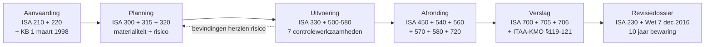
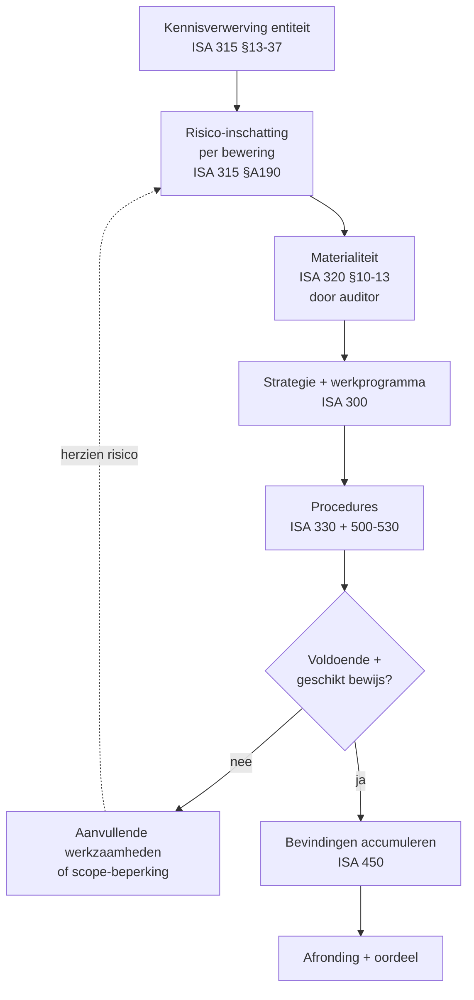
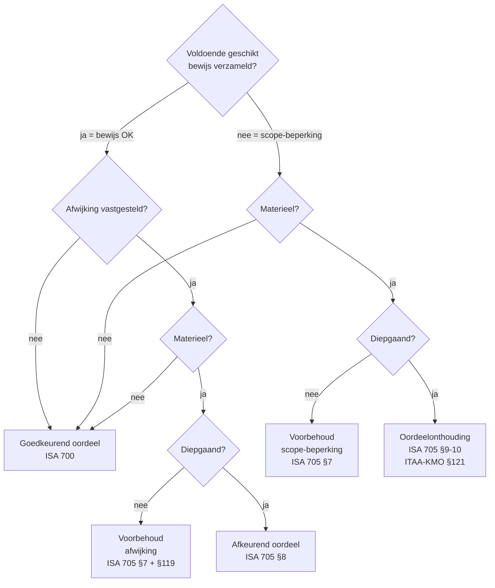
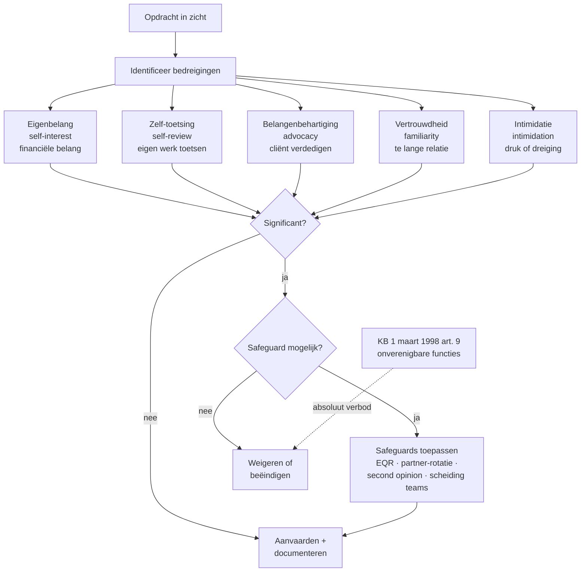

> **Samenvatting — kapstok voor herhaling.** Proces-PO met dubbele zwaartepunt — de audit-cyclus (ISA-kader) én de bijzondere wettelijke verslagen (Boek 14 WVV). Deze samenvatting bundelt de vier opdracht-types langs hun zekerheidsniveau, de zes audit-fases, de beslismatrix voor het oordeel, de zeven controlewerkzaamheden met bewijskracht-rangorde, de vier bijzondere-mandaten-archetypes en het IESBA bedreigingen-kader. Voor verhaal en routekaart: [[studiemateriaal/1-6|overzicht PO 1.6]].

## 1. Take-away — wat je écht moet weten

- **Zekerheidsniveau, niet de naam, bepaalt het type opdracht.** Audit = redelijke zekerheid (positief geformuleerd oordeel — *true and fair view*). Review = beperkte zekerheid (negatief — *niets dat doet vermoeden*). ISAE = redelijk of beperkt op niet-financiële info. AUP = géén zekerheid (bevindingen). Bij elke nieuwe opdracht: éérst het zekerheidsniveau vaststellen, dan pas de norm zoeken — anders mismatch tussen verwachting en eindproduct.
- **De audit-cyclus is iteratief, niet lineair.** Risico-inschatting (ISA 315) stuurt de strategie (ISA 300 + 320); controlebevindingen sturen de risico-inschatting opnieuw bij. Examen-cases integreren altijd meerdere fases — materialiteit + confirmaties + cut-off + voorbehoud in één vraag. Wie de cyclus als checklist behandelt, mist de feedback-loops die het oordeel onderbouwen.
- **Materialiteit ligt bij de auditor — niet bij KB, niet bij de AV.** Vaste regel sinds ISA 320: de auditor stelt overall materiality vast (vuistregels 0,5-1 % omzet · 1-2 % activa · 5-10 % resultaat vóór belastingen) en uitvoeringsmaterialiteit (typisch 50-75 % daarvan). MCQ-strikvraag elk examen: 'wie bepaalt materialiteit?' — auditor, vastgelegd in werkprogramma.
- **Bewijskracht heeft een rangorde.** Externe bevestigingen door derden + eigen waarneming + herberekening = sterk. Inlichtingen + cliënt-cijfers = zwak. Bij een bewijs-mix bouwt de auditor zijn oordeel op de sterkere bron. Lawyer's letter (ISA 580) of bankconfirmatie (ISA 505) krijgt voorrang boven een mondelinge management-toelichting — examen toetst deze hiërarchie expliciet.
- **Vier oordeel-types langs één 2×2-matrix.** Materieel × diepgaand × type probleem (afwijking of scope-beperking). Materieel-niet-diepgaand = voorbehoud · materieel-diepgaand-afwijking = afkeurend · materieel-diepgaand-scope = onthouding · niet-materieel = goedkeurend. Een onthouding (geen informatie) ≠ een afkeurend oordeel (verkeerde informatie) — verwarring is examen-klassieker.
- **Bijzondere mandaten zijn géén audit — limited assurance op een staat door het bestuursorgaan.** Vier verrichtings-types (inbreng natura · omzetting · fusie/splitsing · ontbinding) delen één patroon: opdrachtbrief → staat A&P opgemaakt door bestuursorgaan (max 3 maanden oud) → beperkte zekerheid → modelverslag met expliciete vermelding overwaardering + risico-clausule. Werken op proef- en saldibalans van interne boekhouder = niet aanvaardbaar.
- **Onafhankelijkheid kent vijf bedreigings-categorieën (IESBA).** Eigenbelang · zelf-toetsing · belangenbehartiging · vertrouwdheid · intimidatie. Per opdracht: identificeer → evalueer (significant?) → safeguard of weiger. KB 1 maart 1998 art. 9 verbiedt onverenigbare functies absoluut; voor alle andere bedreigingen weegt de auditor met safeguards. Aanvaarding zonder threats-and-safeguards-cyclus = professional misconduct.

## 2. Vier opdracht-types — IAASB-kader

De keuze tussen audit, review, ISAE en AUP wordt gestuurd door het **gewenste zekerheidsniveau** dat derden van het verslag verwachten — niet door de naam. Bij wettelijke opdrachten (commissaris) is het type vastgelegd; bij contractuele opdrachten kiest de opdrachtgever het niveau. Voor uitwerking: [[wat-is-externe-controle-en-welke-opdrachten-bestaan]].

| Opdracht | Zekerheidsniveau | Norm-kader | Eindproduct |
|---|---|---|---|
| **Audit** (controle van historische financiële info) | **Redelijke zekerheid** (positief) | ISA 100-810 + ITAA-KMO-controlenorm (niet-OOB) | Controleverklaring — *true and fair view* |
| **Review** / beoordeling | **Beperkte zekerheid** (negatief) | ISRE 2400 / 2410 | Beoordelingsverslag — *niets doet vermoeden dat …* |
| **ISAE** (assurance op niet-historische / niet-financiële info) | **Redelijk of beperkt** | ISAE 3000 + 3400 reeks | Assurance-rapport (CSR, prospectus, …) |
| **Overeengekomen procedures (AUP)** | **Géén zekerheid** | ISRS 4400 (herzien 2020) | Rapport van feitelijke bevindingen — gebruiker trekt conclusie |
| **Compilatie** (verwante dienst) | **Géén zekerheid** | ISRS 4410 | Samenstellingsverslag — vermelding 'geen audit of review' |

> **Noot.** Bijzondere wettelijke verslagen (Boek 14 WVV — inbreng, omzetting, fusie, ontbinding) volgen meestal de **limited-assurance-logica** met eigen ITAA-modelverslagen — niet ISRE, niet ISA. Zie blok bijzondere mandaten verderop.

## 3. Audit-cyclus — zes fases van opdracht tot archief

Lineair op het schema, iteratief in de praktijk: planning herziet zich op basis van bevindingen, afronding kan terugkomen op uitvoering. Voor uitwerking: [[aanvaarden-plannen-en-uitvoeren-van-een-audit]] (fases 1-3) + [[afronden-en-rapporteren-van-een-audit]] (fases 4-6).

## 4. Audit-bewijs — risico-gestuurde aanpak

Risico-inschatting (ISA 315) bepaalt strategie + materialiteit (ISA 300 + 320), die de aard, timing en omvang van de procedures (ISA 330 + 500-530) sturen. Procedures genereren bevindingen → evaluatie → oordeel. Voor uitwerking: [[aanvaarden-plannen-en-uitvoeren-van-een-audit]].

## 5. Zeven controlewerkzaamheden — bewijskracht-rangorde

ISA 500 §A14-A25 — de gesloten lijst. Bewijskracht hangt af van bron (extern > intern), aard (direct > afgeleid) en wie de procedure uitvoert (auditor zelf > door derden). Examen-klassieker: 'noem er vier'. Voor uitwerking: [[aanvaarden-plannen-en-uitvoeren-van-een-audit]].

| Werkzaamheid | Wat | Bewijskracht | Typische valkuil |
|---|---|---|---|
| **Externe bevestiging** | Schriftelijk antwoord rechtstreeks aan auditor (bank, debiteur, advocaat, leverancier) | **Zeer sterk** (extern + onafhankelijk + schriftelijk) | Lage respons → alternatieve werkzaamheden ISA 505 §12 — niet automatisch voorbehoud |
| **Inspectie** stukken / activa | Materiële vaststelling van boeken, contracten, fysieke activa | **Sterk** voor bestaan; matig voor waardering | Voorraadtelling (ISA 501) → bestaan ≠ waardering |
| **Observatie** | Bijwonen van een procedure die anderen uitvoeren (telling, cyclische controle) | **Beperkt** — alleen op moment van observatie | Hawthorne-effect: gedrag verandert door observatie |
| **Herberekening** | Auditor controleert zelf de wiskundige juistheid | **Sterk** (door auditor zelf) | Mechanisch — bewijst juistheid, niet volledigheid |
| **Opnieuw uitvoeren** | Auditor herhaalt zelf een controle die door IC werd uitgevoerd | **Sterk** voor IC-werking | Steekproef-design bepaalt geldigheid |
| **Cijferanalyses** | Vergelijking met budget, voorgaande periodes, sectorgemiddelden, ratio's | **Matig** — vooral risico-detectie | Globaal patroon mist micro-anomalieën |
| **Inlichtingen / inquiries** | Vragen aan management of medewerkers | **Zwak** — interne bron + niet-corroborerend | Altijd corroboreren met ander bewijs |

> **Noot.** Vuistregel rangorde: extern > intern; auditor zelf > door anderen; schriftelijk > mondeling; corroboratief > geïsoleerd. Bij conflicterend bewijs prevaleert de sterkere bron.

## 6. Beslismatrix oordeel-types — materieel × diepgaand × type probleem

Twee assen (materieel? diepgaand?) × twee oorzaken (afwijking of scope-beperking) = vier oordeel-types. ISA 705 (herzien) + ITAA-KMO-controlenorm §119-121. Eén centrale beslissing — alle examen-vragen over voorbehoud, afkeurend of onthoudend oordeel volgen deze matrix. Voor uitwerking: [[afronden-en-rapporteren-van-een-audit]].

## 7. Bijzondere wettelijke verslagen — vergelijkings-kapstok

Vier verrichtings-types delen één patroon: opdrachtbrief → staat A&P door **bestuursorgaan** (niet interne boekhouder) → onderzoek door beroepsbeoefenaar met **beperkte zekerheid** → modelverslag met expliciete clausules. Zekerheidsniveau, doel en verplichte vermeldingen verschillen per verrichting. Voor uitwerking: [[bijzondere-wettelijke-verslagen-bij-vennootschapsverrichtingen]].

| Verrichting | Wetbron WVV | Wie staat A&P | Zekerheid | Kern-clausule modelverslag |
|---|---|---|---|---|
| **Inbreng in natura** | art. 5:7 (BV) + 7:7 (NV) | Bestuursorgaan | **Limited assurance** (waardering) | Geen overwaardering nettoactief + correspondentie tegenwaarde |
| **Quasi-inbreng** | art. 5:8 + 7:8 | Bestuursorgaan | Limited assurance | Idem inbreng + transactie binnen 2 jaar na oprichting |
| **Omzetting** van rechtsvorm | art. 14:3 + 14:5 | Bestuursorgaan (staat ≤ 3 maanden oud) | Limited assurance op staat A&P | Risico-clausule **hoofdelijke aansprakelijkheid bij overwaardering** + onderzoek volledigheid |
| **Fusie / splitsing** | art. 12:1 e.v. + gemeenschappelijke IBR-ITAA-fusienorm | Bestuursorganen alle betrokken vennootschappen | Limited assurance | Ruilverhouding pertinent + redelijk + correcte toelichting in fusievoorstel |
| **Ontbinding + vereffening** | art. 2:71 + 2:80 | Bestuursorgaan (staat ≤ 3 maanden) | Limited assurance + **discontinuïteits-waardering** (KB WVV art. 3:6 §2) | Bevestiging volledigheid passiva + bij ontbinding-in-één-akte: alle schulden betaald of geconsigneerd |

> **Noot.** **Privé- en gerechtelijke expertise** (1.6.taak.1.a + 1.6.taak.1.b) volgen een andere logica — geen wettelijke monopolie, tegenspraak-procedure, eindgebruiker is de partij of de rechter. Geen examen-zwaarte; vermelding volstaat.

## 8. IESBA bedreigingen-kader — vijf categorieën + cyclus

Per opdracht: identificeer bedreigingen → evalueer (significant?) → safeguard of weiger. Naast IESBA werken in België ook KB 1 maart 1998 art. 9 (onverenigbare functies — absoluut verbod) en ISQM 1/2 (kwaliteitsmanagement). Voor uitwerking: [[onafhankelijkheid-en-deontologie-bij-controleopdrachten]].

## 9. Klassieke valkuilen (examen-radar)

| Valkuil | Wat klopt er niet | Wat klopt wél |
|---|---|---|
| Lage respons confirmaties = automatisch voorbehoud | Stagiairs concluderen meteen tot scope-beperking bij respons onder 80 % | ISA 505 §12 verplicht **alternatieve werkzaamheden** (subsequent receipts, verzendingsdocumenten, contract-inspectie). Pas als die ook geen bewijs leveren én de post materieel is, ontstaat een scope-beperking — en zelfs dan eerst diepgaand-toets vóór voorbehoud. |
| Materialiteit door KB of door de algemene vergadering | Verwarring met andere drempels die wel wettelijk zijn vastgelegd (controleplicht-drempels WVV art. 1:26) | Materialiteit wordt door de **auditor zelf** vastgesteld (ISA 320). Vuistregels 0,5-1 % omzet · 1-2 % activa · 5-10 % resultaat vóór belastingen. Vastgelegd in werkprogramma en herzien bij significante wijziging. |
| Staat A&P opgemaakt door de interne boekhouder voor een bijzonder mandaat | Interne boekhouder is goed met cijfers — lijkt logisch dat hij ook de staat A&P maakt | De staat A&P moet door het **bestuursorgaan** worden opgemaakt en ondertekend. Interne boekhouder is geen bestuursorgaan. Werken op proef- en saldibalans = niet aanvaardbaar voor bijzonder mandaat — beroepsbeoefenaar moet weigeren of bestuursorgaan tot opmaak verplichten. |
| Oordeelonthouding gelijkstellen aan afkeurend oordeel | Beide zijn 'slecht nieuws' — oogt vergelijkbaar | **Onthouding** = de auditor heeft **onvoldoende bewijs** om een oordeel te vormen (scope-beperking materieel + diepgaand). **Afkeurend** = de auditor heeft **wel bewijs** en de jaarrekening geeft geen getrouw beeld (afwijking materieel + diepgaand). Geen informatie ≠ verkeerde informatie. |
| Vergeten dat de termijn ter beschikking 15 dagen is bij bijzondere mandaten | Stagiair denkt dat het verslag pas op de AV-zitting beschikbaar moet zijn | Het bijzonder verslag + onderliggende staat moeten **15 dagen vóór de AV** ter beschikking liggen van de vennoten op de zetel — bij omzetting, ontbinding én fusie. Niet-naleving = AV-besluit aanvechtbaar. |
| Bewijswaarde van mondelinge management-inlichtingen overschatten | Management is dichtbij de cijfers — kennis = bewijs | Inlichtingen zijn de **zwakste** bewijsbron. Altijd **corroboreren** met extern of objectief bewijs. Lawyer's letter (ISA 580) en management-letter (ISA 580) zijn uitzonderingen: schriftelijk + ondertekend door management/advocaat verhoogt bewijskracht maar vervangt geen externe confirmatie. |
| Onafhankelijkheid evalueren bij aanvaarding en daarna vergeten | Eén check bij opdrachtbrief volstaat | Onafhankelijkheid moet **doorlopend** worden gemonitord (ISA 220 herzien + ISQM 1). Nieuwe omstandigheden (familielid in bestuur, lening bij cliënt, andere opdracht door zelfde partner) kunnen een nieuwe bedreiging opwerpen. Herziening bij elke fase + EQR voor OOB-opdrachten. |

## 10. Verdieping

### Leerstukken — voor pedagogische opfris

Werkt iets niet meer scherp? Klik door naar het leerstuk dat het uitwerkt:

- [[wat-is-externe-controle-en-welke-opdrachten-bestaan]] — vier opdracht-types langs zekerheidsniveau + wettelijke vs contractuele opdracht + statuut commissaris vs gecertificeerd accountant + vier normbronnen-lagen (ISA · ITAA-normen · KB 1 maart 1998 · IESBA)
- [[aanvaarden-plannen-en-uitvoeren-van-een-audit]] — drie fases (aanvaarding · planning · uitvoering) + opdrachtbrief ISA 210 + materialiteit ISA 320 + risico-inschatting per bewering + zeven controlewerkzaamheden + audit-issues REVIA
- [[afronden-en-rapporteren-van-een-audit]] — zes afrondingsstappen (ISA 450 + 540 + 560 + 570 + 580 + 720) + vier oordeel-types + beslismatrix materieel × diepgaand + opbouw controleverklaring + revisiedossier 10 jaar
- [[bijzondere-wettelijke-verslagen-bij-vennootschapsverrichtingen]] — gemeenschappelijk patroon (staat A&P + limited assurance + nettoactief-niet-overwaardering) + vier verrichtings-types (inbreng · omzetting · fusie/splitsing · ontbinding) met wetsartikel + modelverslag-clausule per type
- [[onafhankelijkheid-en-deontologie-bij-controleopdrachten]] — vijf IESBA-bedreigingen + threats-and-safeguards-cyclus + KB 1 maart 1998 art. 9 onverenigbare functies + drie lagen kwaliteitsmanagement (ISQM 1 kantoor · ISA 220 opdracht · ISQM 2 EQR)

### Concept-fiches — voor definitorisch detail

Voor wie een wettekst-pointer of nauwkeurige definitie zoekt:

**Opdracht-kader en statuut** — [[opdracht-types]] · [[controleopdracht]] · [[commissaris]] · [[beoordeling-cyclus]] · [[isae-opdracht]] · [[overeengekomen-procedures-opdracht]] · [[opdrachtaanvaarding-en-opdrachtbrief]]

**Audit-proces** — [[audit-planning]] · [[audit-bewijs]] · [[audit-afronding]] · [[revisiedossier]]

**Oordeel en verslag** — [[controleverklaring]] · [[continuiteit]]

**Bijzondere mandaten** — [[bijzondere-mandaten]]

**Onafhankelijkheid en kwaliteit** — [[onafhankelijkheid]] · [[deontologie]] · [[kwaliteitsmanagement-opdracht]] · [[kwaliteitstoetsing-itaa]]

**Cross-PO koppelvlakken** — [[interne-controle]] · [[auditcomite]]

---

*Samenvatting PO 1.6. Status: voorgesteld — POC volgens ADR-039. Alle wets-claims (vier opdracht-types IAASB, vier oordeel-types ISA 705 + ITAA-KMO §119-121, audit-cyclus zes fases, zeven controlewerkzaamheden ISA 500 §A14-A25, bijzondere mandaten Boek 14 WVV art. 5:7 · 14:3 + 14:5 · 2:71 + 2:80, vijf IESBA bedreigingen-categorieën, KB 1 maart 1998 art. 9, revisiedossier 10 jaar Wet 7 dec 2016) door leerstuk-renders bevestigd; geen MCP-calls in render-fase.*
