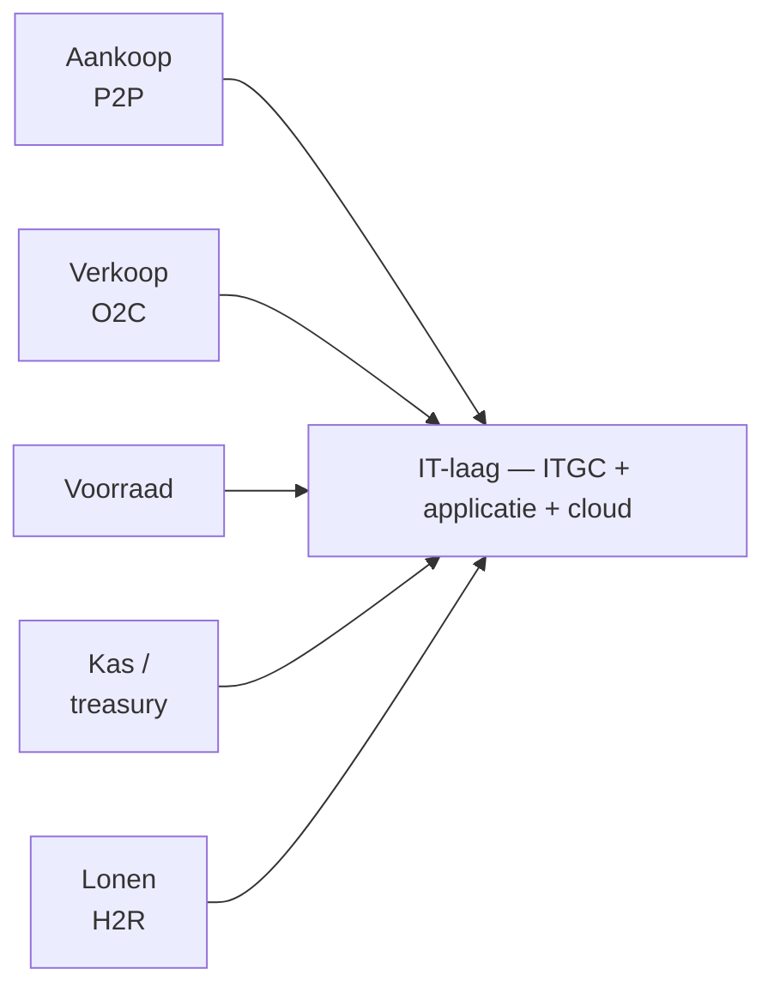
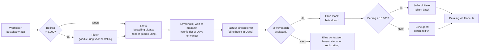
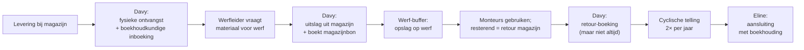
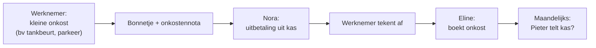
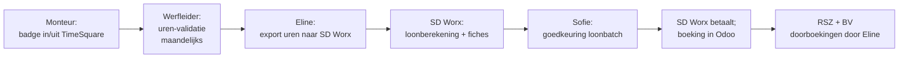
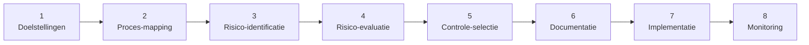

> **Leerstuk — één vraag, helemaal doorgewerkt.** Dit is het zwaarste leerstuk van PO 1.7 — de cyclus-aanpak is het werkpaard van zowel intern beheer als externe controle, en de vijf cycli + de IT-laag worden door elkaar op het examen bevraagd. Bouw eerst de basis op met [[wat-is-interne-controle-en-coso]] (COSO-kader, drie rollen) en [[functiescheiding-en-controlemaatregelen]] (BURCB, 1-2-3-4, preventief versus detectief) — die drie taxonomieën worden hieronder per cyclus toegepast. Voor verhaal en routekaart: [[studiemateriaal/1-7|overzicht PO 1.7]].

## Antwoord in één blik

Cyclus-analyse splitst de bedrijfsvoering op in vijf canonieke transactiecycli — **aankoop** (procure-to-pay), **verkoop** (order-to-cash), **voorraad**, **kas/treasury** en **lonen** (hire-to-retire) — en ontwerpt per cyclus de sleutelcontroles die de typische risico's mitigeren. Het is de standaard-methodologie voor zowel intern beheer (door management) als externe controle (door auditor), en ze werkt omdat ze de bedrijfsvoering volgt in de volgorde waarin transacties écht ontstaan — niet in de volgorde van de jaarrekening-rubrieken.

Per cyclus telkens drie elementen: **flow** (wie doet wat in welke volgorde), **top-risico's** per stap, en **sleutelcontroles** — typisch een combinatie van autorisatie (drempel-goedkeuring), functiescheiding (de vijf-functies-leer BURCB) en matching of reconciliatie (3-way match, bank-reconciliatie, cyclische telling). Boven de vijf cycli ligt een onmisbare **IT-laag**: general IT controls op de informatica-omgeving zelf plus application controls die in elke transactie ingrijpen. In een ERP-gedreven KMO als Bracke passeert bijna elke transactie door een applicatie — wie IT niet doorgrondt, mist het zwaartepunt van de werkende controles.

We doorlopen de vijf cycli in een vaste volgorde — aankoop (zwaartepunt), verkoop, voorraad, kas/treasury, lonen — telkens met de Bracke-flow en de bewuste IC-zwaktes Z1–Z14 als didactische illustratie. Daarna de IT-laag, de walkthrough-techniek en het 8-stappen-ontwerpflow als methode voor wie een IC-systeem opbouwt of na een incident herziet.

---

## Wat is cyclus-analyse — en waarom werkt ze?

Een onderneming als Bracke heeft tientallen processen, honderden risico's, duizenden transacties per maand. Hoe maak je dat behapbaar voor wie interne controle moet ontwerpen, evalueren of toetsen? Het antwoord is verrassend simpel: splits alles op in een beperkt aantal **typische cycli** — elk met eigen processtappen, eigen risico's, eigen sleutelcontroles, eigen IT-systemen. De vijf canonieke cycli zijn:

| # | Cyclus | Engelse term | Wat zit erin? |
|---|---|---|---|
| 1 | **Aankoop** | Procure-to-Pay (P2P) | Behoefte → bestelling → ontvangst → factuur → betaling |
| 2 | **Verkoop** | Order-to-Cash (O2C) | Offerte → order → uitvoering → facturatie → inning |
| 3 | **Voorraad** | — | Ontvangst → opslag → uitslag → telling → aansluiting |
| 4 | **Kas/treasury** | — | Kleine kas + creditcards + bank + cash-inning |
| 5 | **Lonen** | Hire-to-Retire (H2R) | Onboarding → uren → loonbatch → uitbetaling → offboarding |

In sommige sectoren komt er een zesde cyclus bij (**vaste activa** — CapEx en afschrijving) of een zevende (**financiering** — kredieten en dividend). Voor PO 1.7 en de KMO-context volstaan de vijf hierboven — leer die grondig en je hebt een raamwerk dat in elke ERP-context werkt.

De waarde van de cyclus-aanpak: in plaats van losse risico's te lijsten krijg je een **coherent verhaal** dat correspondeert met de feitelijke werking. Je leert risico's herkennen in de volgorde waarin transacties zich uitvoeren. Een fictieve verkoop ontstaat bijvoorbeeld op de orderstap (vóór de levering), niet op de boekingstap (na de factuur). Wie cyclus-vertaalt kijkt op de juiste stap.

Bij Bracke zijn alle vijf cycli aanwezig: aankoop via Nora + Odoo + Isabel, verkoop via de werfleider-offerte + Karim + DSO-opvolging, voorraad in magazijn Aalst met werf-buffers, kas/treasury via Pieter-cashstortingen + Isabel-bankbetalingen + werfleider-creditcards, en lonen via TimeSquare-badging + SD Worx. Klassieke installateur-architectuur. En per cyclus passen we de **vijf-functies-leer BURCB** uit het vorige leerstuk toe: wie *Beschikt*, wie *Uitvoert*, wie *Registreert*, wie *Controleert*, wie *Bewaart*. Elke functiescheidings-gap is een risico-bron — de Z1–Z14-zwaktes hieronder zijn allemaal cyclus-gebonden overtredingen van dat principe.

---

## Cyclus 1 — Aankoop (Procure-to-Pay)

De aankoopcyclus is het zwaartepunt: zes processtappen, vijf functies, drie sleutelcontroles, en — niet toevallig — de cyclus waar Bracke's Bart-fraude (47.300 EUR over 14 maanden) gemonteerd kon worden. De flow gaat van een behoefte op de werf naar een betaling op de bankrekening van de leverancier:

Per stap zit er een typisch risico dat de cyclus genereert. Bij de **bestelaanvraag** kan een werfleider een privé-gebruik of een voorkeur-leverancier zonder concurrentie laten passeren. Bij de **goedkeuring** maakt een te hoge drempel dat veel bestellingen ongecontroleerd doorgaan. Bij de **ontvangst** is een levering rechtstreeks op de werf zonder onafhankelijke controle de klassieke fictieve-levering-trigger (Bart-modus). Bij de **factuur** zijn dubbele facturen of een gefingeerde leverancier de hoofd-risico's. De **3-way match** zelf kan gefingeerd worden via een gefingeerde leverancier + bestelbon + ontvangstbewijs. En bij de **betaling** passeert wat onder de drempel zit zonder een tweede handtekening.

De sleutelcontroles vormen de tegen-architectuur. Een **autorisatie-drempel** voor bestellingen (Pieter goedkeurt boven 5.000 EUR — orde van grootte; de drempel zelf laat je richten op de bedrijfsschaal en het Cijferzakboekje). Een **3-way match** waarbij Odoo automatisch bestelbon, ontvangstbon en factuur vergelijkt op hoeveelheid en prijs, met een flagging bij verschillen boven een marge-percentage. **Functiescheiding** tussen wie de leveranciers-master beheert en wie de betaling doet — deze twee horen aan verschillende personen toegewezen te zijn (bij Bracke is dat geschonden = Z1, de materiële trigger van het Bart-incident). Een **tweede handtekening** voor betalingen boven een tweede drempel. En tot slot een **periodieke spend-analyse** van de top-20-leveranciers door de bedrijfsleider — een detectieve controle die zou opgemerkt hebben dat een nieuwe schoonbroer-BV plots maandelijks duizenden EUR ontving.

| Stap | Top-risico | Sleutelcontrole |
|---|---|---|
| Bestelaanvraag werfleider | Privé-gebruik · voorkeur-leverancier zonder concurrentie | Onafhankelijke prijsvergelijking door aankoop (Nora) |
| Goedkeuring bestelling | Drempel te hoog → veel bestellingen ongecontroleerd | Autorisatie Pieter boven drempel (Z3: drempel uit 2018 te hoog) |
| Ontvangst goederen | Fictieve levering bij werf (Bart-modus) | Onafhankelijke ontvangst-functie (Davy magazijn) |
| Factuur-binnenkomst | Dubbele factuur · fictieve leverancier | Functiescheiding Eline ≠ Pieter (Z1: geschonden bij Bracke) |
| 3-way match | Gefingeerd via fake leverancier + ontvangstbewijs | Odoo automatische flagging bij verschil boven marge |
| Betaling | Onder-drempel passeert zonder 2e handtekening | 2e handtekening boven betaaldrempel (Z2: drempel te hoog) |

De examen-formule voor "wat zijn de risico's bij een aankoopprocedure?" is dus altijd dezelfde vier-stappen-redenering: (a) noem drie risico's per stap; (b) koppel elk risico aan een sleutelcontrole; (c) classificeer die controle als preventief of detectief; (d) verwijs naar de functiescheidings-categorie (1-2-3-4) waar ze toe behoort. Wie zo antwoordt structureert zijn antwoord en mist niets.

---

## Cyclus 2 — Verkoop (Order-to-Cash)

Bij verkoop draait de flow de andere kant op — niet vanuit een interne behoefte, maar vanuit een externe vraag — en dat brengt een ander risico-profiel met zich mee. De grote scharnierstap is de **klantenfiche-aanmaak**: hier worden master-data vastgelegd die de hele rest van de cyclus voeden (BTW-regime, kortingen, kredietlimiet, betalingsvoorwaarden).

```mermaid
graph LR
    A["Klantcontact:<br/>vraag offerte"] --> B["Werfleider:<br/>technische offerte<br/>+ prijsraming"]
    B --> C{"Bedrag<br/>> 10.000?"}
    C -->|Ja| D["Pieter:<br/>commerciële goedkeuring"]
    C -->|Neen| E["Werfleider:<br/>stuurt offerte direct"]
    D --> E
    E --> F["Klant tekent;<br/>Karim maakt klantenfiche aan<br/>(eerste keer)"]
    F --> G["Project gepland;<br/>monteurs uitgevoerd"]
    G --> H["Werkbon getekend<br/>door klant"]
    H --> I["Karim factureert<br/>(eind- of voorschotfactuur)"]
    I --> J["DSO-opvolging<br/>door Karim"]
    J --> K{"> 60 dagen<br/>open?"}
    K -->|Ja| L["Karim escaleert<br/>naar Pieter"]
```

De top-risico's. Bij de **offerte** schommelt het probleem tussen een te lage prijs (marge-verlies) en een te hoge prijs (deal-verlies). Bij de **klantenfiche** liggen drie zware risico's op de loer: een fictieve klant (verkoper-bonus, omzet-inflatie), foute master-data (verkeerd BTW-regime, verkeerde kortingscategorie, verkeerde betalingsvoorwaarden) en — vaak vergeten — het ontbreken van een kredietacceptatie-stap vóór de levering start. Bij de **facturatie** komt het volledigheids-risico op (niet alle leveringen worden gefactureerd) en het cut-off-risico (foutieve periode-toerekening). Bij de **DSO-opvolging** dreigen oninbare vorderingen.

De sleutelcontroles. Een **autorisatie-drempel** op de commerciële offerte. **Functiescheiding** tussen wie de klantfiche aanlegt en wie het project uitvoert — idealiter doet een onafhankelijke credit controller de fiche-aanmaak na een kredietcheck (bij Bracke geschonden = Z4). Een **werkbon-handtekening** door de klant vóór facturatie — bewijst dat de levering effectief plaatsvond. Een **DSO-rapport** met de top-20 oudste vorderingen wekelijks geanalyseerd (detectieve controle). En een **vier-ogen-validatie** op het BTW-regime bij elke nieuwe klant (bij Bracke geschonden = Z6, met een BTW-rechtzetting van 4.800 EUR als gevolg in 2025).

| Stap | Top-risico | Sleutelcontrole |
|---|---|---|
| Offerte werfleider | Te lage marge · te hoge prijs deal-verlies | Standaard prijslijst + Pieter-goedkeuring boven commerciële drempel |
| Klantenfiche aanmaken | Fictieve klant · geen kredietcheck · BTW-fout | Functiescheiding verkoop ↔ credit controller (Z4 geschonden) |
| Project + werkbon | Levering zonder afspraak met klant | Werkbon-handtekening klant vereist vóór facturatie |
| Facturatie | Volledigheid · cut-off | Wekelijkse aansluiting werkbonnen ↔ facturen door Karim |
| DSO-opvolging | Afschrijvingen handelsvorderingen | DSO-rapport top-20 oudste; escalatie naar bedrijfsleider |

De klassieke examenvraag — "drie risico's detecteren bij 'de verkoopafdeling maakt nieuwe klantenfiches aan'" — heeft een vaste modelformule. **R1**: gebrek aan functiescheiding (verkoper initieert + legt master aan, dus fictieve of ghost-klanten worden mogelijk). **R2**: geen kredietwaardigheidstoetsing vóór levering (oninbare vorderingen). **R3**: master-data-kwaliteit zonder vier-ogen (BTW-fouten, foutieve kortingen, foutieve betalingsvoorwaarden). Met deze drie heb je 80 % van de risico-set op één bladzijde.

---

## Cyclus 3 — Voorraad

Voorraad is fysiek-én-administratief: een verschil tussen de fysieke werkelijkheid en de boekhoudkundige registratie genereert direct ofwel onverklaarde voorraad-discrepanties, ofwel materiële afwijkingen in het bedrijfsresultaat (kostprijs verkopen). De cyclus loopt van een levering bij het magazijn naar een aansluiting met de boekhouding na de cyclische telling.

De top-risico's volgen mechanisch uit de flow. Bij de **ontvangst** kunnen niet-geleverde goederen geboekt worden of verkeerde hoeveelheden ingebracht. Bij de **uitslag** vertrekt soms materiaal zonder boeking (krimp). De **werf-buffer** is een lekgevoelig moment — materiaal kan onopgemerkt naar privé-gebruik door monteurs verdwijnen. **Retour-stromen** die niet geboekt worden vertekenen de voorraadwaarde stelselmatig. En bij de **telling** kan een enkele teller (zonder onafhankelijke verificatie) telfouten introduceren of, erger, telfraude afdekken.

De sleutelcontroles. Een **afgesloten magazijn** waar alleen de magazijnier sleutel + ERP-rechten heeft. **Cyclische tellingen** minstens twee keer per jaar, met een ABC-classificatie waarbij top-30-artikelen frequenter geteld worden. **Twee tellers per telling** voor onafhankelijke verificatie (bij Bracke geschonden = Z9). **Functiescheiding** tussen bewaring (sleutel + fysiek beheer) en registratie (Odoo-boekingen) — een klassieke overtreding van de Bewaring/Registratie-scheiding uit het ACR-IH-principe (bij Bracke geschonden = Z7). En tenslotte een **cut-off-controle** bij jaareinde: de laatste ontvangst- en leverbonnen vóór en na de telling vergelijken met de voorraad-registratie om periode-toewijzing zuiver te houden.

> **De externe-audit-koppeling — wat doet de auditor met de voorraad-cyclus?** De controlestandaard die voorraad behandelt is helder: bij voorraad die van *materieel belang* is voor de jaarrekening **moet** de auditor de fysieke voorraadopname *bijwonen*, tenzij dat praktisch onuitvoerbaar is. Bijwonen betekent vier dingen: hij **evalueert** de instructies en procedures van het management voor de telling, **woont** de uitvoering van die procedures bij, **inspecteert** de voorraad om bestaan en conditie vast te stellen (en incourante of beschadigde elementen op te merken), en voert **tellingen ter toetsing** uit. Voor de stagiair die als IC-adviseur aan de andere kant van de tafel zit, is dit het externe-auditor-perspectief op exact dezelfde cyclus die hij intern probeert te versterken — dezelfde flow, dezelfde risico's, andere bril.

---

## Cyclus 4 — Kas / Treasury

Kas/treasury betekent veel meer dan een "kasje op kantoor". Bij Bracke bestaat de cyclus uit vier deel-kanalen met elk een eigen risico-profiel: een **kleine kas** op kantoor (max 1.500 EUR voor klein-onkosten), **drie werfleider-creditcards** (limiet 2.500 EUR per maand per stuk), **bank-betalingen** via Isabel 6 (zie ook de aankoop-cyclus) en **klant-inningen** (95 % bankoverschrijving, 5 % cash bij particulieren). Vier kanalen, vier risico-profielen, vier controle-architecturen.

Per kanaal de top-risico's. Bij de **kleine kas**: kas-tekort onopgemerkt en bonnetjes-fraude. Bij de **creditcards**: privé-gebruik gedekt als beroepskost. Bij de **bank-betalingen**: ongeautoriseerde betalingen (zie de aankoop-cyclus Z1+Z2 — Bart-modus). Bij de **cash-inningen**: niet alle cash gestort, of een verschil tussen wat ontvangen werd en wat geboekt werd.

De sleutelcontroles. Een **maandelijkse bank-reconciliatie** door de boekhouder die het saldo op rekening 550 aansluit met het bankuittreksel. Een **maandelijkse kascontrole** door de bedrijfsleider die de kas telt en aansluit op het kasboek (bij Bracke geschonden = Z10, de laatste 8 maanden niet uitgevoerd). **Cash-stortingen met twee getuigen** of dubbele paraaf (bij Bracke geschonden = Z11, de bedrijfsleider doet de stortingen alleen). Een **creditcard-afrekening** waarbij de maandelijkse creditcardstaat door een onafhankelijke persoon vergeleken wordt met werkstaten (bij Bracke geschonden = Z12). En een **dubbele aftekening** van elke onkostennota (door werknemer + bevoegde tweede persoon) vóór uitbetaling.

De Bart-fraude liep gedeeltelijk via dit kanaal: alle 12 valse facturen waren betalingen via Isabel onder de tweede-handtekening-drempel, dus Z2 (bij aankoop) en Z11 (bij treasury) versterkten elkaar. Een fraude die niet één zwakte uitbuit maar de **combinatie** van zwakten over twee cycli is niet zeldzaam — het is de norm.

> **De examenklassieker voor kas — "stel een procedure op voor kasbetalingen kleine kosten met minimaal twee functiescheidingen".** De modelprocedure heeft vijf stappen, vier personen, drie functiescheidingen. Stap 1: de werknemer initieert (uitvoering) en bewaart het bonnetje. Stap 2: de zaakvoerder of diensthoofd keurt goed (beschikkende functie). Stap 3: de secretaresse betaalt uit en bewaart de kas (uitvoerende + bewarende). Stap 4: de boekhouder registreert (registrerende functie — andere persoon dan de secretaresse). Stap 5: de zaakvoerder doet de kascontrole (controlerende functie — niet de secretaresse en niet de boekhouder). Vijf functies, vier personen, drie functiescheidingen — past op één pagina, scoort vol op het examen.

---

## Cyclus 5 — Lonen (Hire-to-Retire)

De loon-cyclus heeft een eigen vocabulaire — onboarding, badging, loonbatch, offboarding — en haar eigen specifieke risico: de **spookmedewerker**. Bij Bracke kreeg ex-monteur Frank na zijn ontslag in mei 2025 nog 4 maanden doorbetaald (zo'n 12.800 EUR netto) doordat zijn werfleider uren manueel bleef invoeren met de aantekening "badge stuk".

De top-risico's. Bij de **onboarding** kan een medewerker actief raken in het systeem zonder een ondertekend contract, of in de verkeerde loonklasse terechtkomen. Bij de **uren-validatie** valideert de werfleider de uren van zijn *eigen* team — een klassieke zelfcontrole-overtreding die overuren-toekenning aan kennissen mogelijk maakt. Het **spookmedewerker-risico**: een ex-medewerker blijft uren ontvangen na ontslag doordat de werfleider de uren manueel invoert (de Frank-case). Bij de **loonbatch-goedkeuring** wordt de batch te vaak goedgekeurd zonder een vergelijking met de actuele actieve personeelslijst. En bij de **offboarding** zonder formele uittredingsprocedure blijft niet alleen de loonuitbetaling lopen — ook de toegang tot ERP en SharePoint blijft openstaan.

De sleutelcontroles. Een **onboarding-protocol** met HR-validatie en contract-cross-check vóór de TimeSquare-activering. **Uren-validatie door de werfleider + een tweede oog** van de bedrijfsleider op overuren-aanvragen (bij Bracke geschonden = Z14). Een **maandelijkse vergelijking** van de actieve personeelslijst met de SD Worx-loonbatch (bij Bracke geschonden = Z13, de Frank-case). **Functiescheiding** tussen uren-validatie, loonberekening en goedkeuring van de batch — drie verschillende personen (bij Bracke deels in orde door de uitbesteding aan SD Worx). En een **periodieke steekproef** waarbij de bedrijfsleider willekeurig vijf loonfiches selecteert en vergelijkt met de TimeSquare-data.

> **KMO-realiteit: loonadministratie wordt typisch uitbesteed aan een sociaal secretariaat** (SD Worx, Securex, Acerta). Dat is een nuttige compenserende controle — een externe derde rekent de lonen — maar het verplaatst de IC-verantwoordelijkheid *niet*. Het bestuur blijft verantwoordelijk voor wat er aan SD Worx wordt aangeleverd (juiste uren, juiste personen) en voor de goedkeuring van wat terugkomt (de loonbatch). Outsourcing is geen abdicatie van interne controle — het is een keuze in hoe je ze organiseert.

---

## IT-laag — General IT Controls + application controls

In een ERP-gedreven KMO als Bracke passeert bijna elke transactie door een of meerdere applicaties: Odoo voor de boekhouding en aankoop/verkoop, TimeSquare voor de tijdregistratie, Isabel 6 voor de bankbetalingen, SD Worx voor de lonen, SharePoint voor de projectdossiers. **IT-controles vormen vandaag het zwaartepunt van interne controle** — wie ze niet doorgrondt mist het overgrote deel van de werkende beheersing.

De controlestandaarden onderscheiden twee hoofdgroepen IT-controles. **General IT Controls** (ITGC) zijn overkoepelende controles op de *informatica-omgeving zelf* — ze garanderen dat applicaties correct werken, dat data integer blijft en dat onbevoegden er niet bijkunnen. Vier hoofd-categorieën:

1. **Toegangsbeheer** (RBAC — Role-Based Access Control): wie heeft welke rechten in welke applicatie?
2. **Change management**: hoe wordt een ERP-update getest en goedgekeurd vóór ze in productie gaat?
3. **IT operations**: monitoring, incident-respons, dagelijks beheer.
4. **Backup en recovery**: continuïteit bij uitval of incident.

**Application controls** zijn controles die **in een specifieke applicatie zijn ingebouwd** en op individuele transacties ingrijpen. Drie verwerkingsfasen:

- **Input** — veld-validatie, verplichte velden, value-ranges (bv. een BTW-veld dat verplicht ingevuld moet worden bij klantfiche-aanmaak).
- **Processing** — automatische verwerkings-checks (bv. de 3-way match in Odoo die bestelbon, ontvangstbon en factuur vergelijkt en flagging geeft boven een marge-percentage; automatische BTW-berekening).
- **Output** — rapportering met logica-checks (bv. een DSO-rapport dat wekelijks de top-20 oudste vorderingen toont; een exceptie-rapport voor prijswijzigingen boven een drempel).

De **complementariteit** tussen beide groepen is cruciaal. Application controls vergen werkende ITGC om betrouwbaar te zijn — Odoo's 3-way match werkt alleen als het toegangsbeheer (ITGC) verhindert dat een gebruiker zelf de bestelbon-data manipuleert vóór de match draait. Faalt het toegangsbeheer, dan faalt de application control ook, ongeacht hoe slim ze geprogrammeerd is.

Er bestaat ook een derde categorie die vaak vergeten wordt — **IT-dependent manual controls**: handmatige controles die *volledig* steunen op IT-output. Voorbeeld bij Bracke: Eline reviewt het exceptie-rapport voor prijswijzigingen boven een drempel — het oordeel is manueel, maar de input (het rapport zelf) wordt door Odoo gegenereerd. Falen de ITGC of de application controls die het rapport voeden, dan is ook de handmatige beoordeling onbetrouwbaar — al weet de reviewer dat niet.

Tot slot: **cloud shared responsibility**. Bracke draait Odoo in de cloud, wat de verantwoordelijkheids-verdeling herstructureert maar zeker niet elimineert. De **provider** zorgt voor infrastructuur, ITGC op host-niveau, fysieke beveiliging en basis-backup. De **cliënt** (Bracke zelf) blijft verantwoordelijk voor de configuratie, de gebruikersrechten, de application-data en het business-continuity-plan. Vuistregel: *cloud verkleint je IT-werk maar elimineert het niet — wat er op draait, is je verantwoordelijkheid*. Bij Bracke concreet: Odoo draait stabiel in de cloud, maar de admin-rechten zijn te breed verdeeld (Pieter + Sofie + Eline allemaal admin) en er is geen lokale fallback bij een provider-uitval — beide zijn cliënt-verantwoordelijkheid.

| Type IT-controle | Wat houdt ze in? | Bracke-voorbeeld |
|---|---|---|
| **ITGC — Toegangsbeheer** | Wie mag wat in welke applicatie? (RBAC) | Odoo-rol Eline = boekhouding-admin + AP-validator (te breed — Z1) |
| **ITGC — Change management** | ERP-updates getest vóór productie | Odoo cloud-updates door provider; geen lokale test-omgeving |
| **ITGC — Operations** | Monitoring + incident-respons | Geen formeel monitoring; Eline detecteert problemen ad-hoc |
| **ITGC — Backup + recovery** | Continuïteit bij uitval | Odoo cloud-back-up dagelijks (provider); geen lokale fallback |
| **Application — input** | Veld-validatie + verplichte velden | BTW-velden verplicht bij klantfiche-aanmaak |
| **Application — processing** | Automatische verwerkings-checks | 3-way match Odoo flagging bij verschil boven marge |
| **Application — output** | Rapportering met logica-checks | DSO-rapport wekelijks; exceptie-rapport prijswijzigingen |
| **IT-dependent manual** | Handmatige beoordeling van IT-output | Eline reviewt prijswijziging-exceptie-rapport |
| **Cloud shared responsibility** | Wie doet wat (provider vs cliënt)? | Odoo-provider = infra; Bracke = config + rechten + data |

---

## Walkthrough — de techniek om een cyclus te doorgronden

Een **walkthrough** is geen audit en geen test — het is een doorleef-exercitie waarbij je *één concrete transactie* van begin tot eind volgt om te leren hoe de cyclus *écht* werkt, in tegenstelling tot hoe het procedurehandboek het beschrijft. De afstand tussen die twee is meestal groter dan management denkt en kleiner dan auditors hopen.

De techniek heeft vier stappen.

1. **Selecteer** één concrete transactie (bijvoorbeeld de Bracke-bestelling van een Vaillant HVAC-unit, factuur F2025-487).
2. **Volg** hem door alle stappen — wie deed wat wanneer, welk document werd aangemaakt, welk Odoo-scherm gebruikt, welke goedkeuring gegeven.
3. **Documenteer** de werkelijke flow (een flowchart of een korte narrative).
4. **Identificeer** waar de werkelijke flow afwijkt van de geschreven procedure — elke gap is een potentieel risico.

De waarde: een walkthrough is de manier om **design effectiveness** te toetsen (komt aan bod in [[interne-audit-evaluatie-en-aanbevelingen]]) — toets of de procedure *als ontworpen* werkt. Het is **niet** hetzelfde als een test-of-controls, die de **operating effectiveness** toetst (werkt de controle *werkelijk* over een periode, getest op een steekproef). Een walkthrough is één transactie, één moment, één verifying lus.

Concretisering bij Bracke: een walkthrough van de aankoop-cyclus tussen werfleider Marc Peeters en leverancier Vaillant zou de stagiair tonen dat (a) Pieter inderdaad goedkeurt boven 5.000 EUR — maar (b) Davy *soms niet aanwezig is* bij werf-leveringen (een gap met de procedure), en dat (c) Eline de 3-way-match-flagging *wekelijks* reviewt in plaats van realtime (een gap met het design). Drie gaps, drie verbeter-aanbevelingen, één pagina werk. Dat is de kracht van de techniek.

---

## Het 8-stappen-ontwerpflow — IC bouwen of herzien

Tot nu toe lazen we cycli **as-is** — zoals ze bestaan, met hun zwaktes en sterktes. Maar wat als je als adviseur of als nieuwe bedrijfsleider een IC-systeem *moet ontwerpen* (bij een groei-sprong of een fusie) of na een fraude-incident *moet herzien* (zoals Bracke na Bart)? Daarvoor bestaat een methodologisch raamwerk — een 8-stappen-flow die de COSO-componenten operationeel toepast op feitelijke processen.

1. **Doelstellingen formuleren** — welke van de IC-doelen worden geadresseerd? Per cyclus operationaliseren.
2. **Proces-mapping (as-is)** — alle bestaande processen in kaart (flowcharts, narratives) met walkthroughs om de mapping te valideren.
3. **Risico-identificatie** per processtap — wat kan er fout gaan? Input-fout, dubbele boeking, ongeautoriseerde transactie, fraude, IT-uitval, niet-naleving.
4. **Risico-evaluatie** — kans × impact; heat map; prioriteren.
5. **Controle-selectie** per risico — welke controle past best? Preventief versus detectief, automatisch versus handmatig, kosten-baten.
6. **Documentatie** — procedures schrijven, autorisatie-matrix, rol-mapping in het ERP.
7. **Implementatie en uitrol** — communicatie, training, ERP-configuratie.
8. **Monitoring en bijsturing** — periodieke review of de controles nog werken; aanpassen bij wijzigingen (groei, nieuwe ERP, nieuwe wet).

Toegepast op Bracke ná het Bart-incident: stap 1 = doelstelling "voorkom herhaling fraude bij aankoop". Stap 2 = bestaande aankoopcyclus mappen (gedaan in dit leerstuk). Stap 3 = Z1 + Z2 + Z3 als hoofdrisico's. Stap 4 = hoog kans × hoog impact (47.300 EUR realiteit). Stap 5 = nieuwe leverancier krijgt een "in afwachting"-status tot Pieter valideert, drempel voor goedkeuring verlaagd naar 2.500 EUR, periodieke spend-analyse top-20 toegevoegd. Stappen 6-7-8 = procedures herschrijven, Odoo-rollen herinrichten, maandelijkse opvolging op de bedrijfsleiders-meeting. Voor het definitorische detail van het raamwerk: zie [[ontwerp-interne-controle]].

---

## Drie valkuilen

> ⚠️ **Valkuil 1: cycli geïsoleerd lezen.** Cycli *overlappen* — een werfleider-creditcard zit in de kas-cyclus, in de aankoop-cyclus (materiaal-aankoop) en in de loon-cyclus (representatie). Wie elke transactie netjes in één cyclus stopt mist ongeveer 30 % van de risico's, want de gevaarlijkste fraudes en fouten ontstaan precies op de naden tussen cycli (de Bart-fraude zat tussen aankoop + treasury). Antwoord-formule: vermeld bij overlap altijd alle relevante cycli.

> ⚠️ **Valkuil 2: IT-controles overslaan in KMO.** Zelfs een 32-koppige KMO als Bracke heeft Odoo + Isabel + SD Worx + TimeSquare draaien — IT-controles zijn al het zwaartepunt, niet de bijzaak. ITGC en application controls *moeten* besproken worden in elke cyclus-analyse, niet enkel bij multinationals. Antwoord-formule: per cyclus minstens één IT-controle benoemen.

> ⚠️ **Valkuil 3: walkthrough verwarren met test-of-controls.** Walkthrough = *één transactie* om te leren *hoe* het werkt (design effectiveness). Test-of-controls = *steekproef over een periode* om te toetsen of de controle effectief *werkt* (operating effectiveness). Verschillende doelen, verschillende methodes, verschillende plaats in het audit-plan — zie [[interne-audit-evaluatie-en-aanbevelingen]] voor de volledige uitwerking.

---

## Wanneer je dit snapt, ga dan naar

- [[fouten-fraude-en-risicobeheersing]] — de risico-architectuur die de controle-selectie per cyclus voedt: fraudedriehoek, risico-identificatie-methode, heat map kans × impact.
- [[interne-audit-evaluatie-en-aanbevelingen]] — hoe deze cycli geëvalueerd worden: design effectiveness (walkthrough) versus operating effectiveness (test of controls), de management letter als output.
- [[functiescheiding-en-controlemaatregelen]] — de drie taxonomieën die hier per cyclus werden toegepast — voor herhaling van BURCB, 1-2-3-4 en preventief/detectief.
- [[wat-is-interne-controle-en-coso]] — de COSO-componenten waar cyclus-controles in passen, vooral "controleactiviteiten" (component 3).
- [[studiemateriaal/1-7/samenvatting|Samenvatting PO 1.7]] — herhaling: 5 cycli + sleutelcontroles per cyclus + IT-laag (ITGC + applicatie + cloud) + 8-stappen-ontwerpflow.

## Doorklik naar concepten

Voor wie definitorisch detail wil opzoeken:

- [[cyclus-analyse]] · [[it-controles]] · [[ontwerp-interne-controle]]

---

## Wettelijk fundament

- Cyclus-aanpak — algemeen kader voor identificatie en inschatting van risico's: ISA 315 (herzien-2019). De cyclus-methodologie is impliciet in ISA 315: per significante transactiestroom identificeert de auditor de relevante beweringen (assertions) en de bijhorende controles.
- IT-controles — onderscheid ITGC versus application controls: ISA 315 (herzien-2019), Bijlage 6 (overwegingen voor het verwerven van inzicht in general IT controls). Vier hoofd-categorieën ITGC: toegangsbeheer, change management, IT operations, backup en recovery.
- Voorraad — fysieke opname bijwonen: ISA 501 §4(a). Bij materiële voorraad moet de auditor de fysieke voorraadopname bijwonen (tenzij praktisch onuitvoerbaar) — instructies evalueren, uitvoering waarnemen, voorraad inspecteren, tellingen ter toetsing uitvoeren. Uitgewerkt in §A1-A8.
- Controletechnieken — algemeen kader: ISA 500 §A14-A25. De zeven generieke controletechnieken: inspectie, waarneming, externe bevestiging, herberekening, herrekening, navraag, cijferanalyse.
- Test-of-controls — inspelen op ingeschatte risico's: ISA 330. Wanneer de auditor wil steunen op de werking van interne controle, moet hij test of controls uitvoeren over de relevante periode.
- Cut-off + overeenstemmingsbeginsel: KB 29 april 2019 op de jaarrekening + WER Boek III art. III.89. Boekhoudkundige basis voor cut-off-controle en aansluiting boekhouding met inventaris.
- Ontwerp interne controle — 8-stappen-flow: COSO 2013 (internationale doctrine — geen wettekst). Methodologische uitwerking van de vijf COSO-componenten, ondersteund door de design-effectiveness-eisen uit ISA 315.

---

*Leerstuk PO 1.7 — proces, zwaarste (3 van 5). Volgende stap: [[fouten-fraude-en-risicobeheersing]].*
