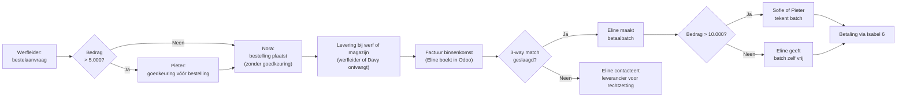

> **Oefening — doe eerst zelf, controleer dan.** Vijf onafhankelijke vragen op de Bracke-installatie-case — elke vraag activeert één van de vijf leerstukken van PO 1.7. Lees eerst de Bracke-context hieronder en werk daarna stap 1 t/m 5 één voor één uit. Klap de uitwerking pas open als je vastloopt of klaar bent. Reken op 60-75 minuten in totaal: stap 1 en 4 vragen meer schrijfwerk, stap 2 is een snelle classificatie, stap 3 een korte risico-opsomming, stap 5 vraagt SMART-discipline. Voor verhaal en routekaart: [[studiemateriaal/1-7|overzicht PO 1.7]].

## Opgave

Bracke Installatie BV is een Belgische middelgrote installateur (HVAC + sanitair + elektriciteit), gevestigd in Aalst — 32 medewerkers, omzet 6,8 mln EUR, balanstotaal 4,2 mln EUR, geen commissaris (onder drempel art. 3:72 WVV). Pieter Bracke (zaakvoerder, 50 % aandelen) en Sofie Vermeulen (co-zaakvoerder, 50 %) leiden het kantoor. Eline Janssens is hoofdboekhouder (10 jaar anciënniteit, breed Odoo-mandaat); Karim Boutaleb doet projectadministratie en verkoop-facturatie; Nora De Cock combineert receptie en aankoop-coördinatie; Davy beheert het magazijn (sleutel én Odoo-rechten); drie werfleiders (Marc · Bart — ondertussen ontslagen · Jens) sturen elk een team van 8 monteurs.

Eind 2025 ontdekte Eline een systematisch lek bij aankopen: werfleider Bart Devlieger had 14 maanden lang fictieve materiaal-aankopen via een gefingeerde leverancier (op naam van zijn schoonbroer's BV) doorgesluisd voor in totaal 47.300 EUR. Bart is ontslagen, strafklacht loopt, schoonbroer-BV inmiddels in vereffening. Het incident heeft Pieter doen besluiten een vrijwillige IC-beoordelingsopdracht uit te besteden aan confrater-accountant Marc Vlaeminck — een mock-managementletter met vier bevindingen ligt nu op tafel.

Jij krijgt vandaag de oefenrol van een stagiair die voor confrater-accountant Vlaeminck mag meewerken aan de IC-quickscan. Vijf onafhankelijke deelvragen — elk activeert één leerstuk uit PO 1.7. Lees eerst de Bracke-context hieronder, werk dan elke stap één voor één uit, en open de modeluitwerking pas nadat je je eigen antwoord hebt opgeschreven.

### Bedrijfsprofiel — recap

Middelgrote KMO · Odoo 17 ERP + TimeSquare-tijdregistratie + Isabel-6-bank · drempel goedkeuring bestelling 5.000 EUR + drempel 2e handtekening betaling 10.000 EUR (drempels dateren van 2018, bedrijfsschaal sindsdien verdubbeld) · Eline heeft simultane rechten op leveranciers-master + factuur-boeking + betaalbatch · Karim maakt klantenfiches aan zodra eerste bestelbon binnenkomt (zonder kredietacceptatie-functie) · Davy combineert bewaring + registratie van voorraad zonder onafhankelijke controle · maandelijkse kascontrole laatste 8 maanden niet uitgevoerd · loonadministratie uitbesteed aan SD Worx.

> De vragen hieronder zijn **onafhankelijk** van elkaar. Je hoeft ze niet in volgorde te maken; filter per vraag zelf welke feiten uit de context relevant zijn.

---

## Uitwerking

### Stap 1 — Aankoop-cyclus: identificeer drie functiescheidings-zwaktes

De aankoop-cyclus van Bracke verloopt als volgt: werfleider stelt bestelaanvraag op → bestelling door Nora of (boven 5.000 EUR) na Pieter-goedkeuring → levering bij werf of magazijn → factuur-binnenkomst Eline → 3-way match → betaalbatch Eline → 2e handtekening Sofie of Pieter boven 10.000 EUR → uitvoering Isabel 6.

Identificeer **drie functiescheidings-zwaktes** in deze cyclus. Voor elke zwakte: beschrijf de zwakte zelf, koppel ze aan de toepasselijke ACR-IH-functie (of aan de 4-categorieën-typologie — beide tellen voor het examen), en benoem het concrete bedrijfsrisico dat eruit volgt.

<strong>Oplossing — klik om te tonen</strong>

Drie zwaktes — elk geformuleerd in drie elementen: (i) wat is er fout, (ii) welke ACR-IH-functie wordt overschreden, (iii) welk risico volgt.

**Zwakte 1 — Eline combineert leveranciers-master + factuur-boeking + betaalbatch.** Eline beheert in één rol de leveranciersgegevens (nieuwe leverancier aanmaken = aspect van Beschikken/autorisatie nieuwe tegenpartij), boekt de factuur (Registreren) en zet de betaalbatch klaar (aanzet tot Uitvoeren). Drie ACR-IH-functies belanden bij één persoon. Risico: Eline — of iemand met haar paswoord — kan een nieuwe leverancier aanmaken, een factuur boeken én de betaling klaarzetten zonder dat een tweede paar ogen iets opmerkt. Klassiek frauderisico; precies wat het opzet van preventieve functiescheiding beoogt te blokkeren.

**Zwakte 2 — drempel 2e handtekening op betalingen ligt op 10.000 EUR.** Bij een gemiddelde projectkost van 25.000 EUR B2B valt het grootste deel van de materiaalfacturen onder die drempel. Eline geeft die alleen vrij. ACR-IH-overtreding: Uitvoeren (vrijgave betaling via Isabel) zonder onafhankelijke controle. Risico: de meerderheid van betalingen passeert zonder vier-ogen-controle. De Bart-fraude leverde het empirische bewijs — alle 12 valse facturen vielen onder de drempel en passeerden ongezien.

**Zwakte 3 — werfleider keurt zelf bestellingen onder 5.000 EUR goed.** Geen onafhankelijke prijscheck of leveranciers-validatie door Nora. ACR-IH-overtreding: dezelfde persoon initieert én autoriseert (combinatie Beschikken + Registreren in één hand). Risico: een werfleider kan systematisch dezelfde leverancier kiezen op basis van privé-relatie of kickback. Eveneens bewezen door de Bart-case — alle 12 valse bestelaanvragen lagen tussen 1.800 en 4.500 EUR.

**Bonus voor wie verder kijkt** — vierde zwakte: leveringen bij de werf (in plaats van bij het magazijn) worden door de werfleider zelf bevestigd. Geen onafhankelijke ontvangst-controle door Davy. Bewaring én Uitvoeren raken hier vermengd: de 3-way match sluit formeel op een ontvangstbewijs dat niemand verifieert.

> **Let op.** Verleiding tot algemene antwoorden ("Eline heeft te veel macht") zonder de specifieke ACR-IH-functie te benoemen. Het examen waardeert juist het koppelen van een zwakte aan de exacte functie die geschonden wordt. Tweede valkuil: niet vergeten dat de 4-categorieën-typologie (1 Autorisatie · 2 Bewaring · 3 Registratie · 4 Controle) een legitieme alternatieve taxonomie is — beide rasters tellen voor het examen, kies één en blijf er consistent in.

---

### Stap 2 — Acht activiteiten classificeren in de 4-categorieën-typologie

De ITAA-doctrine deelt taken in een aankoop-cyclus in vier onverenigbare categorieën: 1 Autorisatie · 2 Bewaring van activa · 3 Registratie en rapportering · 4 Controleprocedures.

Duid voor elke van de acht activiteiten in de tabel hieronder aan welke categorie van toepassing is. Bij twijfel: kies één primaire categorie en motiveer kort waarom.

| # | Activiteit |
|---|---|
| 1 | Goedkeuring bestelling > 5.000 EUR door Pieter |
| 2 | Ontvangst HVAC-units door Davy in magazijn |
| 3 | Inboeken factuur Vaillant door Eline |
| 4 | 3-way match controle door Eline (bestelbon ↔ ontvangstbon ↔ factuur) |
| 5 | Aanmaak wekelijkse betaalbatch door Eline (selectie te betalen facturen) |
| 6 | Goedkeuring betaalbatch > 10.000 EUR door Sofie |
| 7 | Uitvoering bankbetaling via Isabel 6 |
| 8 | Aanmaak nieuwe leverancier in Odoo door Eline |

Tip: vraag jezelf telkens *wat doet deze persoon ten opzichte van de transactie?* Beslist hij dat ze mag (autorisatie), bewaakt hij het actief (bewaring), boekt hij iets (registratie), of toetst hij of een vorige stap correct verliep (controle)?

<strong>Oplossing — klik om te tonen</strong>

| # | Activiteit | Categorie | Motivering |
|---|---|---|---|
| 1 | Goedkeuring bestelling > 5.000 EUR door Pieter | **1 — Autorisatie** | Beslist of de transactie mag plaatsvinden |
| 2 | Ontvangst HVAC-units door Davy in magazijn | **2 — Bewaring activa** | Fysieke ontvangst en bewaring van het materiaal |
| 3 | Inboeken factuur Vaillant door Eline | **3 — Registratie en rapportering** | Boekhoudkundige vastlegging van de transactie |
| 4 | 3-way match controle door Eline | **4 — Controleprocedures** | Toetst of vorige stappen (bestelling + ontvangst + factuur) congruent zijn |
| 5 | Aanmaak wekelijkse betaalbatch door Eline | **3 — Registratie en rapportering** | Selectie en samenstelling van te betalen facturen — administratieve registratie |
| 6 | Goedkeuring betaalbatch > 10.000 EUR door Sofie | **4 — Controleprocedures** | Onafhankelijke toets vóór uitvoering |
| 7 | Uitvoering bankbetaling via Isabel 6 | **2 — Bewaring activa** | Treasury beschikt over het bankactief — handeling op het actief zelf |
| 8 | Aanmaak nieuwe leverancier in Odoo door Eline | **1 — Autorisatie** | Poortwachters-beslissing: bepaalt welke tegenpartij überhaupt mag worden betaald |

**Patroon dat opvalt.** Master-data-onderhoud (nieuwe leverancier aanmaken) valt onder autorisatie — niet onder registratie, ook al gebeurt het in het ERP. Reden: de handeling bepaalt welke tegenpartijen überhaupt mogen worden betaald, een poortwachters-functie. Categorie volgt het *karakter* van de handeling, niet het *systeem* waarin ze plaatsvindt.

**Tweede patroon.** Aanmaak van een betaalbatch is registratie (selectie van te betalen facturen), maar de uitvoering van de betaling is bewaring (treasury beschikt over het bankactief). Twee opeenvolgende stappen, twee verschillende categorieën — daarom moeten ze ook door verschillende personen worden uitgevoerd.

**Klassieke fraudegevoelige combinaties die deze indeling helpt voorkomen.** Aanmaak leveranciersgegevens + uitvoering betaling = fictieve leverancier op eigen rekening (de Bart-modus operandi). Bestelling + ontvangst goederen = bestelling op naam van de vennootschap, levering naar privé. Aanmaak + controle betalingsvoorstel = eigen voorstel zelf goedkeuren.

> **Let op.** Verleiding om "aanmaak nieuwe leverancier in Odoo" als registratie te classificeren omdat het in het ERP gebeurt. Fout — categorie volgt het karakter van de handeling (poortwachters-beslissing = autorisatie), niet het systeem waarin ze plaatsvindt. Tweede valkuil: "3-way match" als registratie afdoen omdat Eline het in Odoo doet — de handeling is een toets, niet een vastlegging, dus controle.

---

### Stap 3 — Klantenfiches-procedure: identificeer drie risico's

Bij Bracke maakt Karim (projectadministratie) de nieuwe klantenfiches aan op het moment dat de werfleider de eerste door een nieuwe klant getekende offerte binnenbrengt. Karim vult BTW-nummer, leveradres, kortingscategorie en betalingsvoorwaarden in op basis van wat de werfleider vermeldt.

Detecteer **drie risico's** in deze procedure. Voor elk risico: beschrijf het risico zelf, benoem de IC-zwakte die het mogelijk maakt, en geef — als je daarover gegevens hebt uit de Bracke-context — een concreet voorbeeld van een vastgestelde uitwerking.

<strong>Oplossing — klik om te tonen</strong>

Drie risico's — elk geformuleerd in drie elementen: (i) risico, (ii) onderliggende IC-zwakte, (iii) concrete uitwerking in Bracke.

**Risico 1 — fictieve klant / omzet-inflate.** Onvoldoende functiescheiding tussen de initiatie van verkoop (werfleider) en aanmaak van de klantenfiche (Karim, op informatie van werfleider) zonder onafhankelijke verificatie. De werfleider kan een fictieve klant introduceren — geen externe bron-validatie. Concreet bij Bracke: omzet-inflate voor commissie of prestige zou mogelijk zijn omdat geen geijkte bron de identiteit van de klant valideert. (Spiegelt symmetrisch het Bart-mechanisme aan de aankoopzijde.)

**Risico 2 — werken voor insolvabele klanten.** Geen kredietacceptatie-functie vooraf. De klant wordt aangemaakt en het project loopt zonder onafhankelijke kredietcheck. Bracke kan beginnen werken voor klanten die niet kunnen betalen. Concreet bij Bracke: twee verlieslatende dossiers in 2025 met afschrijvingen voor totaal ca. 22.000 EUR (particuliere klanten in faling).

**Risico 3 — master-data-kwaliteit zonder vier-ogen-validatie.** BTW-regime, kortingspercentages en betalingsvoorwaarden worden door Karim alleen ingevuld op basis van informatie van de werfleider. Kunnen fout of manipuleerbaar zijn. Concreet bij Bracke: één BTW-rechtzetting van ca. 4.800 EUR in 2025 (renovatie ouder dan 10 jaar foutief in het 21 %-tarief geboekt in plaats van 6 %).

**Bonus voor wie verder kijkt.** GDPR-risico (persoonsgegevens zonder verwerkings-grondslag), doublures (zelfde klant meermaals aangemaakt onder licht verschillende benamingen), anti-witwas-KYC (bij Bracke geen issue door het cliënteel, maar in andere sectoren wel).

> **Let op.** Verleiding om enkel "fraude door werfleider" te benoemen in drie variaties. De examenstijl wil een **spreiding van risico-types**: functiescheiding (governance) + krediet (financieel) + master-data (operationeel/fiscaal). Drie verschillende categorieën onderscheiden levert meer punten op dan drie variaties op één thema.

---

### Stap 4 — Bart-fraude-case: fraudedriehoek + drie zwaktes + drie controles

Werfleider Bart Devlieger heeft van september 2024 tot november 2025 via 12 valse aankoopfacturen (gemiddeld 3.940 EUR per factuur, alle onder de 10.000-EUR-drempel) systematisch 47.300 EUR doorgesluisd naar een gefingeerde leverancier op naam van zijn schoonbroer's BV. Dezelfde Bart leverde zelf de "ontvangstbewijzen" op de werf — de 3-way match in Odoo sloot formeel.

Beantwoord drie deelvragen:

**(a)** Analyseer de fraude via de **fraudedriehoek** (Cressey 1973) — druk · gelegenheid · rationalisatie. Benoem voor elke hoek de Bracke-specifieke invulling.

**(b)** Welke **drie IC-zwaktes** maakten deze fraude mogelijk? Verwijs expliciet naar de zwaktes uit stap 1.

**(c)** Welke **drie controles** hadden het lek vroeger kunnen detecteren — controles die Bracke nu niet had?

<strong>Oplossing — klik om te tonen</strong>

**Deel (a) — fraudedriehoek toegepast op Bart.**

- **Druk**: persoonlijke financiële nood. In de Bracke-context: echtscheiding 2024 + alimentatie + lening voor renovatie van het eigen huis.
- **Gelegenheid**: de drie IC-zwaktes uit stap 1. Eline-master-rechten + drempel 10.000 EUR voor 2e handtekening te hoog + werfleider keurt eigen bestelling onder 5.000 EUR goed.
- **Rationalisatie**: post-hoc verklaring van het type "Bracke heeft mij onderbetaald — ik nam alleen wat me toekwam".

Cruciaal inzicht: druk en rationalisatie kunnen we als IC-ontwerper *niet* sturen. We weten niet welke werknemer welke privé-problemen heeft en hoe hij die verantwoordt voor zichzelf. Aan de **gelegenheid** alleen kunnen we werken — daarom is dat de hoek waarop interne controle ingrijpt.

**Deel (b) — drie IC-zwaktes die het mogelijk maakten** (verwijst naar stap 1):

- **Z1 — Eline-master-rechten**: Bart vroeg Eline om een "eenmalige levering"-leverancier aan te maken. Eline deed dit zonder verificatie, want master + boeking + betaalbatch zaten in haar handen.
- **Z2 — drempel 10.000 EUR voor 2e handtekening**: alle 12 valse facturen vielen onder die drempel.
- **Z3 — werfleider keurt eigen bestellingen < 5.000 EUR goed**: Bart maakte 12 valse bestelaanvragen tussen 1.800 en 4.500 EUR, allemaal door hemzelf "goedgekeurd".

**Deel (c) — drie controles die het lek vroeger hadden gedetecteerd:**

1. **Periodieke leveranciers-spend-analyse top-20 nieuwe leveranciers > X EUR door Pieter** (detectieve controle). Was niet ingericht — zou Bart's schoonbroer-BV als nieuwe top-20-leverancier hebben gesignaleerd binnen één of twee maanden.
2. **Onafhankelijke goedkeuring van nieuwe leveranciers door Pieter of Sofie vóór eerste betaling** (preventieve compenserende controle bij ontbrekende functiescheiding). Was niet aanwezig.
3. **Periodieke vergelijking offerte-database vs. aankoopfacturen** (detecterende controle). Welke leveranciers worden betaald zonder ooit een offerte te hebben gegeven? Zou fictieve leveranciers ontmaskeren. Bestaat niet bij Bracke.

**Conceptueel.** Deel (b) toont de gelegenheid waarop Bart kon inhaken; deel (c) toont preventieve én detecterende compenserende controles. Wie alleen detectieve maatregelen voorstelt (c.1 en c.3) mist de preventieve laag (c.2) — en preventief is bij een KMO vaak goedkoper en effectiever dan een detectieve achteraf-analyse.

> **Let op.** Twee klassieke valkuilen. **Eerste**: de fraudedriehoek toepassen alsof het enkel een classificatie-oefening is — examen-puntenwinst zit juist in de Bracke-specifieke invulling per hoek (welke druk had Bart écht, welke gelegenheid bood Bracke écht, welke rationalisatie heeft hij naar verluidt gebruikt). **Tweede**: alle drie de voorgestelde controles als detectief formuleren (spend-analyse, vergelijking achteraf). Bij een KMO is een preventieve controle (onafhankelijke goedkeuring nieuwe leverancier) vaak goedkoper en effectiever — vermeld er minstens één.

---

### Stap 5 — Managementletter-respons: formuleer een SMART-aanbeveling

Confrater-accountant Marc Vlaeminck heeft een mock-managementletter overhandigd met vier bevindingen:

| Code | Ernst | Beschrijving |
|---|---|---|
| **B1** | Significant deficiency | Eline heeft simultane rechten op leveranciers-master + factuur-boeking + betaalbatch |
| **B2** | Significant deficiency | Drempels 5.000 / 10.000 EUR niet meer afgestemd op huidige bedrijfsschaal |
| **B3** | Deficiency | Davy combineert bewaring + registratie van voorraad zonder telpartner |
| **B4** | Deficiency | Geen documenteerde kascontrole laatste 8 maanden |

Kies één bevinding (advies: **B1** — meest impactvol, materiële trigger van het Bart-incident). Formuleer een aanbeveling voor het bestuur volgens het **SMART-formaat**:

- **S**pecifiek — welke wijziging exact?
- **M**eetbaar — waaraan herken je succes?
- **A**cceptabel — wie draagt de last en aanvaardt die?
- **R**ealistisch — haalbaar binnen de Bracke-context?
- **T**ijd-gebonden — concrete deadline.

Voeg toe: het verwachte **rest-risico** na implementatie. Geen enkele aanbeveling reduceert het risico tot nul — beschrijf wat nog overblijft.

<strong>Oplossing — klik om te tonen</strong>

Aanbeveling voor B1 in SMART-formaat — modelantwoord.

**Specifiek.** Splits de Odoo-rollen van Eline in drie functies. (i) Leveranciers-master-onderhoud: alleen Pieter of Sofie als admin, Eline verliest schrijfrechten op de leveranciers-master. (ii) Factuur-boeking + 3-way match: Eline blijft verantwoordelijk. (iii) Betaalbatch: Eline maakt de batch aan, vrijgave gebeurt door Sofie of Pieter — aanmaker en vrijgever zijn verschillende personen. Nieuwe leverancier krijgt "in afwachting"-status tot Pieter of Sofie validatie geeft; geen betaling mogelijk tot validatie.

**Meetbaar.** Na 3 maanden audit-trail-controle door Marc Vlaeminck: 100 % van de nieuwe leveranciers heeft een Pieter- of Sofie-handtekening vóór de eerste betaling; 100 % van de betaalbatches heeft een aparte aanmaker en vrijgever. Twee KPI's, beide op te halen uit de Odoo-audit-log.

**Acceptabel.** Eline blijft hoofdboekhouder met breed mandaat (factuur-boeking, reconciliaties, cashflow-rapportering); enkel master-data en betalingsvrijgave verschuiven uit haar takenpakket. Sofie aanvaardt de extra last (10-15 minuten per week voor batchgoedkeuring) als compensatie voor het frauderisico — het bestuur draagt dus de prijs, en de prijs is klein.

**Realistisch.** Odoo ondersteunt rolgebaseerde toegang out-of-the-box (RBAC) — geen maatwerk-ontwikkeling nodig. Pieter of Sofie is meestal aanwezig op kantoor of op afstand bereikbaar voor goedkeuring. Bij ziekte of vakantie: backup-procedure (de andere zaakvoerder neemt over).

**Tijd-gebonden.** Implementatie van de rolherinrichting in Odoo tegen 2026-02-28 (3 maanden vanaf de managementletter). Eerste audit-cyclus over Q1 2026 in april 2026.

**Rest-risico.** Management override blijft mogelijk: Pieter of Sofie kunnen formeel goedkeuren zonder werkelijk te verifiëren. Mitigatie: periodieke (kwartaal) spend-analyse van de top-20-leveranciers door de externe accountant — niet door het bestuur zelf, om collusie-risico's te dekken. Tweede rest-risico: collusie tussen Eline en een werfleider zou nog mogelijk zijn — gedeeltelijk gemitigeerd door de scope-beperking van Eline's mandaat (zonder master-rechten zou collusie ook een derde partij vereisen).

**Pedagogisch sluitstuk.** Een SMART-aanbeveling die het rest-risico expliciet benoemt is professioneel sterker dan één die suggereert "het probleem op te lossen". Geen enkel IC-systeem geeft absolute zekerheid — eerlijk benoemen wat overblijft maakt de aanbeveling geloofwaardig en aansluitend bij de leer over inherente beperkingen.

> **Let op.** Twee valkuilen. **Eerste**: vaag formuleren ("verbeter de functiescheiding") in plaats van systeem-niveau-precisie ("splits Odoo-rollen X / Y / Z"). SMART-Specifiek vraagt concrete handelingen, geen intenties. **Tweede**: het rest-risico vergeten benoemen — dan blijft de aanbeveling steken in een "oplossings"-frame, terwijl het bekwaamheidsexamen juist hamert op het concept van *redelijke* (nooit absolute) zekerheid.

---

## Reflectie

Vijf stappen, vijf leerstukken geactiveerd. Wie alle vijf vlot kan lopen, beheerst het examen-patroon van PO 1.7 — herkennen + classificeren + risico's identificeren + analyseren via taxonomieën + adviseren in SMART-formaat. Het bekwaamheidsexamen test geen abstracte theorie, maar je vermogen om in een concrete bedrijfssituatie de juiste taxonomie aan te roepen en concreet te formuleren.

Twee meta-inzichten uit deze quickscan. **Eerste**: de Bracke-zwaktes zijn niet eigen aan Bracke — ze zijn typisch voor een KMO in transitie (snel gegroeid zonder dat de IC-procedures mee evolueerden). Wat hier de Bart-fraude mogelijk maakte, leeft in honderden Belgische KMO's. **Tweede**: de relatie tussen leerstuk en oefening is van een ander didactisch type dan tussen leerstuk en samenvatting. Een leerstuk legt uit; een samenvatting reduceert; een oefening activeert. Wie alleen leest en samenvat haalt het examen niet — wie ook actief deze deelvragen heeft uitgewerkt, ziet patronen sneller.

**Doelstellingen gedekt** — redelijke zekerheid + inherente beperkingen (stap 5 rest-risico); referentiekader ISA 315 + ITAA-norm + COSO impliciet; risico's opsporen in cycli en procedures (stap 1 + 3 + 4); evenwicht tussen zekerheid en compliance (stap 4c + 5); managementletter interpreteren (stap 5); aanbevelingen formuleren (stap 5).

**Valkuilen geoefend** — algemene in plaats van ACR-IH-specifieke zwakte-formulering (stap 1); master-data-onderhoud als registratie classificeren in plaats van autorisatie (stap 2); slechts één risico-categorie noemen in plaats van spreiding (stap 3); fraudedriehoek als pure classificatie in plaats van case-specifieke invulling (stap 4a); alleen detectieve controles voorstellen zonder preventieve laag (stap 4c); vage SMART-Specifiek + rest-risico vergeten (stap 5).

---

## Wanneer dit zit, ga dan naar

- [[wat-is-interne-controle-en-coso]] — voor de 4 doelstellingen + COSO-componenten + 5 inherente beperkingen die de rest-risico-analyse stutten
- [[functiescheiding-en-controlemaatregelen]] — voor de ACR-IH + 4-categorieën + preventief/detectief/correctief-taxonomieën uit stap 1 + 2 + 4c
- [[cyclus-analyse-en-controlemiddelen]] — voor de cyclus-walkthrough-methodiek en het IT-controles-luik dat in stap 1 + 3 impliciet meespeelt
- [[fouten-fraude-en-risicobeheersing]] — voor de fraudedriehoek + drie categorieën fraude + management override (stap 4)
- [[interne-audit-evaluatie-en-aanbevelingen]] — voor ISA 265 management letter + drie ernst-niveaus + SMART-aanbeveling-formaat (stap 5)
- [[studiemateriaal/1-7/samenvatting|Samenvatting PO 1.7]] — compacte herhaling van alle taxonomieën vlak voor het examen
- [[studiemateriaal/1-7/voorbeeldexamenvragen|Voorbeeldexamenvragen PO 1.7]] — om de examen-fragment-vorm te herkennen

---

## Wettelijk fundament

- Beheersingsmaatregelen — preventief versus detectief + functiescheiding: ISA 315 (herzien-2019), Bijlage 3 §20-22 + §A157. *Bijlage 3 §A157 erkent expliciet dat KMO's via direct toezicht door de eigenaar-bestuurder kunnen compenseren voor beperkte functiescheiding.*
- Definities interne beheersing + drie doelstellingen: ITAA KMO-controlenorm, Bijlage 1 (Definities).
- Fraude-verantwoordelijkheden auditor + fraude-categorieën: ISA 240. *Twee hoofd-categorieën: frauduleuze financiële rapportering + misappropriatie van activa; corruptie als variante.*
- Communicatie tekortkomingen interne beheersing — management letter: ISA 265. *Onderscheidt deficiency · significant deficiency · material weakness; significant deficiency moet ten minste aan het met governance belaste orgaan gecommuniceerd worden.*
- Bestuursverantwoordelijkheid voor passende organisatie: ⚠️ te verifiëren — de algemene WVV-bestuursplicht voor passende organisatie wordt vaak met IC-verantwoordelijkheid geïdentificeerd; exacte artikel-referentie niet rechtstreeks via RAG geverifieerd.

---

*Oefening PO 1.7 — Interne controle. Status: POC voor scoped IC-quickscan-format.*
