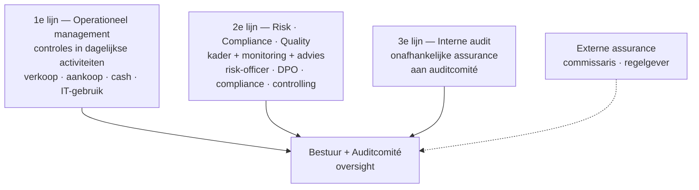
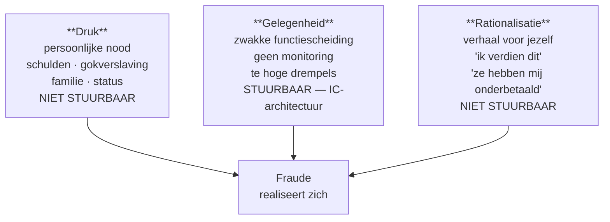
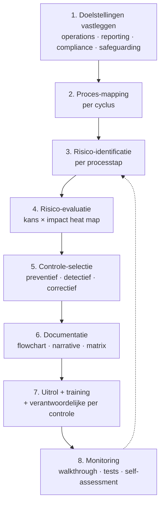

> **Samenvatting — kapstok voor herhaling.** Kader-PO over hoe een onderneming haar eigen processen onder controle houdt — niet over hoe een externe auditor het systeem toetst. Deze samenvatting bundelt de 4 doelen + 5 COSO-componenten + drie functiescheidings-taxonomieën + 5-cycli-overzicht + IT-laag + fraudedriehoek + ISA 265 ernst-niveaus + SMART-formaat. Voor verhaal en routekaart: [[studiemateriaal/1-7|minicursus PO 1.7]]. Voor de auditor-kant (extern): PO 1.6. Voor herhaling, niet om voor het eerst te leren.

## 1. Take-away — wat je écht moet weten

- **Interne controle is een management-systeem, geen auditor-werk.** Het bestuur ontwerpt, implementeert en onderhoudt het IC-systeem; de externe auditor (commissaris) evalueert het van buitenaf. Verwar 'interne controle' niet met 'interne audit' — die laatste is een 3e-lijn-functie die het IC-systeem toetst.
- **Redelijke zekerheid, nooit absolute.** Vijf inherente beperkingen blijven altijd staan: menselijk oordeel, breakdown van controles, collusie, management override, kosten-baten. Een aanbeveling die suggereert 'fraude volledig uitsluiten' past het concept verkeerd toe.
- **Drie taxonomieën die je gegarandeerd op het examen ziet.** (1) BURCB — vijf controletechnische functies (Beschikken · Uitvoeren · Registreren · Controleren · Bewaren) met regel 'max 2 niet-aangrenzende per persoon'. (2) Vier-categorieën-typologie (1 Autorisatie · 2 Bewaring · 3 Registratie · 4 Controleprocedures). (3) Karakter-driehoek (preventief · detectief · correctief). De examinator gebruikt ze door elkaar.
- **Functiescheiding is geen magic bullet.** Sluit collusie en management override **niet** uit. In een KMO mag direct toezicht door de eigenaar-bestuurder compenseren voor beperkte functiescheiding (ISA 315 §A157) — maar de stelregel 'geen functiescheiding nodig in KMO' is fout: vermeld altijd de compenserende controle expliciet.
- **Application control alleen zo betrouwbaar als onderliggende ITGC.** Een automatische 3-way match in Odoo geeft géén comfort als toegangsbeheer, change management of audit trail rammelt. Walkthrough levert design-bewijs en momentopname; operating effectiveness vereist test-of-controls over een periode (ISA 330).
- **Een SMART-aanbeveling die het rest-risico verzwijgt is professioneel zwakker dan één die het expliciet benoemt.** Wie 'het probleem oplost' zonder na te denken over wat overblijft, mist het examen-punt rond redelijke (nooit absolute) zekerheid. Goede ITAA-praktijk: SMART + verwacht rest-risico + opvolg-mechanisme.

---

## 2. Vier doelstellingen van interne controle (COSO + ITAA-norm)

Elke controle moet aantoonbaar bijdragen aan minstens één van deze vier doelen. Bij elke procedure de toetsvraag: 'welk(e) doel(en) dient ze?'

| Doel | Wat | Concreet voorbeeld |
|---|---|---|
| **Operations** | Effectieve en efficiënte bedrijfsvoering | DSO-monitoring · voorraad-rotatie · projectmarge-rapportering |
| **Reporting** | Betrouwbare interne + externe rapportering (financieel + niet-financieel) | Maandelijkse bank-reconciliatie · cut-off-controle bij jaareinde |
| **Compliance** | Naleving van wetten, reglementen en interne richtlijnen | Tijdige BTW-aangifte · GDPR-register · CFI-melding waar van toepassing |
| **Safeguarding of assets** | Bescherming vermogen tegen verlies, diefstal, misbruik | Kluis voor kasbeheer · RBAC op IT-toegang · cyclische voorraad-telling |

> **Noot.** Diepte: [[wat-is-interne-controle-en-coso]]. ITAA-norm KMO-controlenorm Bijlage 1 als referentiekader. COSO IC 2013 als internationale doctrine.

---

## 3. Vijf COSO-componenten (IC 2013, ISA 315 herzien-2019 kader)

ISA 315 hanteert dezelfde 5-componenten-structuur. Wie de stof rond deze kapstok kent, kan elke IC-evaluatie systematisch opbouwen.

| Component | Kern | Vragen bij Bracke-type KMO |
|---|---|---|
| **1. Controleomgeving** | Tone at the top · ethiek · structuur · HR | Is er een geschreven gedragscode? Klokkenluiders-procedure? AMLCO benoemd? |
| **2. Risico-inschatting** | Doelen → risico's → respons | Bestaat een formeel risico-register? Fraude-risico's geïdentificeerd? |
| **3. Controle-activiteiten** | Procedures die risico's mitigeren | Functiescheiding? 3-way match? Autorisatie-drempels up-to-date? |
| **4. Informatie & communicatie** | Info-flow op + neer + horizontaal | Welk ERP? Rapportering richting bestuur formeel of informeel? |
| **5. Monitoring** | Doorlopend + periodiek toetsen werking | Self-assessment? Interne audit-functie? Externe review? |

> **Noot.** Diepte: [[wat-is-interne-controle-en-coso]].

---

## 4. 3 Lines of Defense (IIA-model herzien 2020)

Conceptueel model voor rolverdeling — geen organigram-eis. In KMO mag één persoon meerdere lijnen vervullen, mits documentatie + compenserend toezicht.

---

## 5. Drie taxonomieën functiescheiding + controlemaatregelen

### 1. BURCB — vijf controletechnische functies (Starreveld-traditie)

| Letter | Functie | Rol | Voorbeeld aankoop |
|---|---|---|---|
| **B** | **B**eschikken | Beslist of transactie mag gebeuren | Goedkeuring bestelling boven drempel |
| **U** | **U**itvoeren / Initiëren | Voert transactie fysiek uit | Bestelling plaatsen · ontvangst goederen |
| **R** | **R**egistreren | Boekt + reconcilieert | Factuur boeken · bankreconciliatie |
| **C** | **C**ontroleren | Toetst of vorige stap correct verliep | 3-way match · review betaalbatch |
| **B** | **B**ewaren | Bewaart activa | Magazijn · kassa · IT-rechten |

> **Noot.** Vuistregel: maximaal 2 niet-aangrenzende functies per persoon. B + R is verboden combo (registreert wat hij zelf beschikt). U + B (bewaren) is verboden (uitvoeren + bewaren = diefstal-risico).

### 2. Vier-categorieën-typologie (ITAA-doctrine + ISA 315)

| Categorie | Wat | Voorbeeld |
|---|---|---|
| **1 Autorisatie** | Poortwachters-beslissing — mag dit? | Goedkeuring bestelling · aanmaak nieuwe leverancier (master-data) |
| **2 Bewaring van activa** | Custody — wie heeft fysieke/digitale toegang? | Ontvangst goederen · uitvoering bankbetaling · magazijn-sleutel |
| **3 Registratie & rapportering** | Boeken + verslagleggen | Factuur boeken · aanmaak betaalbatch · journaalpost |
| **4 Controleprocedures** | Detecterende controle op vorige stap | 3-way match · maandelijkse reconciliatie · review-rapport |

> **Noot.** Een fraudegevoelige combinatie wordt voorkomen door 1+2 (autorisatie + custody) te scheiden — bv. wie nieuwe leverancier aanmaakt mag niet betalen.

### 3. Karakter-driehoek (preventief / detectief / correctief)

| Karakter | Wat | Voorbeeld |
|---|---|---|
| **Preventief** | Stopt fout/fraude **vóór** ze ontstaat — staat op transactiepad | Functiescheiding · autorisatie · ERP-veld-validatie · toegangsbeperking |
| **Detectief (≈ repressief)** | Ontdekt fout/fraude **nadat** opgetreden | Bank-reconciliatie · voorraad-telling · exceptie-rapport · interne audit |
| **Correctief** | Herstelt + neemt oorzaak weg | Correctieboeking · disciplinaire actie · procedure-herziening |

> **Noot.** Preventief en detectief zijn **complementair**, geen alternatieven. Een sluitend systeem combineert beide: alleen preventief geeft blinde vlekken (wat als de controle faalt?), alleen detectief betekent schade incasseren vóór correctie.

### Bonus: accountingcontrole vs administratieve controle

Klassiek onderscheid (Starreveld). **Accountingcontrole** bewaakt de juistheid van de boekhouding zelf (cut-off · reconciliatie · aansluiting klantenadm). **Administratieve controle** bewaakt de processen rond de transactie (autorisatie · functiescheiding · vier-ogen). Onderscheid gaat over **wat** wordt gecontroleerd, niet **wanneer**: output (boeken) vs proces (weg ernaartoe).

$$\text{IC-systeem} = \text{Accountingcontrole}_{\text{output}} + \text{Administratieve controle}_{\text{proces}}$$

---

## 6. Vijf transactionele cycli — top-risico × sleutelcontroles

Cyclus-aanpak is werkpaard van zowel IC-design als IC-evaluatie. Per cyclus: top-risico's identificeren + sleutelcontroles benoemen + IT-laag toevoegen.

| Cyclus | Top-risico | Klassieke sleutelcontroles |
|---|---|---|
| **Aankoop (P2P)** | Fictieve leveranciers · over-betaling · kickback | 3-way match (PO + ontvangst + factuur) · leveranciers-master discipline · functiescheiding besteller↔ontvanger↔betaler · spend-analyse top-20 |
| **Verkoop (O2C)** | Niet-geboekte verkoop · krediet-overschrijding · prijslijst-omzeiling | Onafhankelijke kredietacceptatie · order-tot-cash autorisatie · DSO-monitoring · saldo-bevestiging klanten |
| **Voorraad** | Verlies/diefstal · waarderings-fout · obsolescence | Cyclische tellingen met telpartner · ABC-classificatie · waarderings-controle · functiescheiding houden↔registreren |
| **Kas/treasury** | Onbevoegde betalingen · cash-fraude · creditcard-misbruik | Maandelijkse bank-reconciliatie · 4-ogen op betalingen · maandelijkse kascontrole · creditcard-vergelijking met werkstaten |
| **Lonen (H2R)** | Spookmedewerker · onterechte loonsverhoging · oneigenlijke toegangsrechten | Onboarding/offboarding-protocol · functiescheiding HR-administratie↔betaling · 4-ogen op loonbatch · RBAC-review |

> **Noot.** Diepte per cyclus + IT-laag: [[cyclus-analyse-en-controlemiddelen]]. Cycli zijn verweven — een verkoop triggert voorraad-afname; een aankoop triggert betaling. Niet los analyseren.

---

## 7. IT-controles — ITGC vs application vs IT-dependent manual

Drie types die elk een ander stuk afdekken. Application control vertrouwen zonder ITGC-toetsing is een klassieke fout.

| Type | Wat | Voorbeelden | Risico bij verzaken |
|---|---|---|---|
| **ITGC** (General IT Controls) | Onderbouwt application controls | Access management (RBAC) · change management · backup/recovery · operations | Application controls onbetrouwbaar; geen audit trail |
| **Application controls** | Geautomatiseerd per proces | Veld-validaties · automatische BTW-berekening · automatische reconciliatie · 3-way match | Falen detecteer je niet zonder ITGC |
| **IT-dependent manual** | Manual control op IT-output | Manager review van system-generated rapport | Output kan vervalst worden zonder ITGC; manager 'tekent blind' |

> **Noot.** Cloud (M365/Azure/AWS): **shared responsibility** — provider beheert infrastructuur, cliënt blijft verantwoordelijk voor user-management, data-classificatie, application-config. 'Cloud = geen eigen IT-controle' is fout.

---

## 8. Fraudedriehoek (Cressey 1953)

Drie hoeken die samen moeten staan voor fraude tot stand komt. Alleen aan de gelegenheid-hoek kan een IC-ontwerper werken — druk en rationalisatie zijn niet stuurbaar. Vandaar: blokkeer de gelegenheid en je blokkeert de fraude.

---

## 9. Drie fraudecategorieën (ISA 240 + ACFE-doctrine)

Verschillende dader-profielen, verschillende detectie-aanpak. Een aanbeveling tegen één categorie raakt niet altijd de andere.

| Categorie | Wat | Typische dader | Detectie |
|---|---|---|---|
| **Misappropriatie van activa** | Diefstal van cash, voorraad, vaste activa | Werknemer met custody-toegang | Reconciliatie · cyclische telling · forensische analyse |
| **Frauduleuze financiële rapportering** | Manipulatie van cijfers — omzet inflate · kosten verbergen · ongoorloofde provisies | Top-management (CEO/CFO) | Analytische review · benchmarks · whistleblower |
| **Corruptie** | Steekpenningen · kickbacks · belangenconflict | Inkoop · sales · publieke functies | Spend-analyse · related-party checks · klokkenluiders-procedure |

> **Noot.** Diepte: [[fouten-fraude-en-risicobeheersing]]. ISA 240 hanteert de eerste twee als hoofdtypes; corruptie als variant.

---

## 10. Managementletter ISA 265 — drie ernst-niveaus

De externe auditor communiceert tekortkomingen in de interne beheersing volgens een vaste hiërarchie. Significant deficiency + material weakness MOETEN schriftelijk + tijdig aan het met governance belaste orgaan.

| Niveau | Wat | Aan wie gecommuniceerd? | Voorbeeld Bracke |
|---|---|---|---|
| **Deficiency** | Een controle ontbreekt of werkt niet zoals bedoeld — beperkt risico | Optioneel — beoordeling auditor | Geen documenteerde kascontrole laatste 8 maanden |
| **Significant deficiency** | Verdient aandacht van bestuur — risico op materiële afwijking realistisch | **Verplicht** schriftelijk aan bestuur | Eline simultane rechten op leveranciers-master + factuur-boeking + betaalbatch (Bart-fraude-trigger) |
| **Material weakness** | Redelijke kans dat een materiële afwijking niet vroegtijdig wordt voorkomen of gedetecteerd | **Verplicht** schriftelijk aan bestuur + verzwaard tijdig | Geen 4-ogen op betalingen + drempels te hoog — significante materiële fraude mogelijk |

> **Noot.** Diepte: [[interne-audit-evaluatie-en-aanbevelingen]]. ISA 265 is dwingende communicatieplicht — auditor mag significant deficiency niet 'opzij leggen'.

---

## 11. SMART-aanbeveling-formaat — examen-favoriet

### Doelstelling 1.7.taak.1.doel.6 — aanbeveling formuleren

Een goede aanbeveling tegenover een IC-tekortkoming voldoet aan vijf criteria + benoemt expliciet het rest-risico. Wie 'het probleem oplost' zonder rest-risico te benoemen, mist het examen-punt rond redelijke (nooit absolute) zekerheid.

$$\text{Aanbeveling} = S + M + A + R + T + \text{Rest-risico}$$

### Vijf SMART-letters + rest-risico

| Letter | Vraag | Voorbeeld Bracke (B1 — Eline-rechten splitsen) |
|---|---|---|
| **S**pecifiek | Welke wijziging exact? | Splits Odoo-rollen: master-data alleen door Pieter/Sofie; betaalbatch-aanmaak en -vrijgave door twee verschillende personen |
| **M**eetbaar | Waaraan herken je succes? | 100 % van nieuwe leveranciers heeft Pieter/Sofie-handtekening vóór eerste betaling (audit-trail na 3 mnd) |
| **A**cceptabel | Wie draagt de last + aanvaardt die? | Eline blijft hoofdboekhouder; alleen master-data en betalingsvrijgave verschuiven naar zaakvoerders (10-15 min/week extra) |
| **R**ealistisch | Haalbaar binnen context? | Odoo ondersteunt RBAC out-of-the-box; zaakvoerders meestal aanwezig of op afstand bereikbaar |
| **T**ijd-gebonden | Concrete deadline? | Implementatie tegen 2026-02-28; eerste audit-cyclus Q1 2026 in april |
| **+ Rest-risico** | Wat blijft over? | Management override (zaakvoerders kunnen formeel goedkeuren zonder verifiëren) + collusie zaakvoerder ↔ werfleider — mitigatie via periodieke externe spend-analyse |

> **Noot.** Patroon: de SMART-discipline + expliciet rest-risico is wat een ITAA-conform advies onderscheidt van een naïeve 'oplossing'. Diepte: [[interne-audit-evaluatie-en-aanbevelingen]].

---

## 12. 8-stappen-ontwerpflow interne controle

De canonieke aanpak (programma 1.7.VIII.A). Iteratief — bij wijziging (nieuw ERP, M&A, regelgeving) terug naar stap 2.

---

## 13. Klassieke valkuilen

| Valkuil | Wat klopt er niet | Wat klopt wél |
|---|---|---|
| Interne controle = interne audit | Beide intern, dus synoniem | **Interne controle = systeem** ontworpen door management (1e + 2e lijn). **Interne audit = 3e-lijn-functie** die het systeem toetst. Twee verschillende dingen. |
| IC geeft absolute zekerheid | Een goed IC-systeem voorkomt fouten en fraude volledig | Slechts **redelijke** zekerheid — vijf inherente beperkingen blijven: menselijk oordeel · breakdown · collusie · management override · kosten-baten. |
| Functiescheiding als magic bullet | Met goede ACR-IH geen fraude meer mogelijk | Sluit collusie en management override **niet** uit. Combineer met monitoring + tone-at-the-top + auditcomité (waar van toepassing). |
| Pseudo-functiescheiding via gedeelde paswoorden | Op papier verdeeld ⇒ effectief | Alleen effectief als systemen het technisch afdwingen — RBAC + audittrail per gebruiker. Gedeelde logins maken functiescheiding onbestaande. |
| Application control vertrouwen zonder ITGC-toetsing | Systeem rekent automatisch ⇒ correct | Application control is zo betrouwbaar als de **onderliggende ITGC** (toegang · change management · operations). Geen ITGC-test ⇒ geen vertrouwen. |
| Walkthrough = test of controls | Eén transactie nalopen ⇒ controle getoetst | Walkthrough geeft enkel **design-bewijs + momentopname**. Operating effectiveness vereist steekproef over hele periode (ISA 330). |
| Aanbeveling zonder rest-risico | SMART-aanbeveling is volledig zodra de vijf letters geadresseerd zijn | Aanbeveling die rest-risico verzwijgt mist het 'redelijke (nooit absolute) zekerheid'-principe. Goede praktijk: SMART **+ rest-risico expliciet + opvolg-mechanisme**. |

---

## 14. Verdieping

### Leerstukken — voor pedagogische opfris

Werkt iets niet meer scherp? Klik door naar het leerstuk dat het uitwerkt:

- [[wat-is-interne-controle-en-coso]] — 4 doelstellingen + 5 COSO-componenten + redelijke zekerheid + 5 inherente beperkingen + 3 Lines + KMO-proportionaliteit
- [[functiescheiding-en-controlemaatregelen]] — BURCB + 4-categorieën + preventief/detectief/correctief + accountingcontrole vs administratieve controle + KMO-compensatie (ISA 315 §A157)
- [[cyclus-analyse-en-controlemiddelen]] — 5 cycli systematisch (P2P · O2C · voorraad · kas · H2R) + sleutelcontroles per cyclus + IT-laag (ITGC vs application) + 8-stappen-flow
- [[fouten-fraude-en-risicobeheersing]] — Fraudedriehoek Cressey · 3 fraudecategorieën · management override · tone-at-the-top · risico-identificatie-methodes
- [[interne-audit-evaluatie-en-aanbevelingen]] — Interne audit (3e lijn) + auditcomité + design vs operating effectiveness + ISA 265 ernst-niveaus + SMART-aanbeveling-formaat

### Concept-fiches — voor definitorisch detail

Voor wie een wettekst-pointer of nauwkeurige definitie zoekt:

**Begrippen + kader** — [[interne-controle]] · [[coso-framework]] · [[ontwerp-interne-controle]]

**Hefbomen** — [[functiescheiding]] · [[cyclus-analyse]] · [[it-controles]]

**Wat misgaat** — [[fouten-en-fraude]]

**Evaluatie + governance** — [[interne-audit]] · [[auditcomite]] · [[evaluatie-interne-controle]]

---

*Samenvatting PO 1.7 — Interne controle. Status: voorgesteld — POC volgens ADR-039. Geschreven from-scratch op basis van de vijf gerenderde leerstukken (NIET via themafiche-migratie — themafiches verwijderd in dezelfde commit per ADR-039).*
