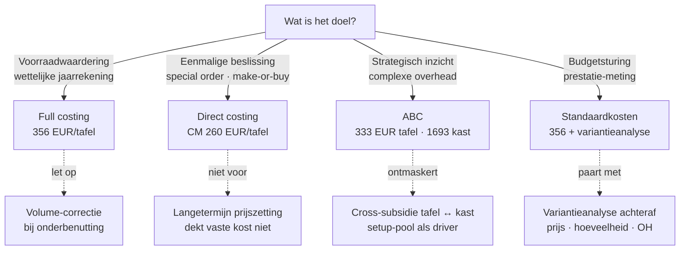

> **Leerstuk — één vraag, helemaal doorgewerkt.** Vier kostprijsmethodes naast elkaar uitgewerkt op één onderneming. Voor het kader (wat is analytische boekhouding, hoe sluit ze aan op de algemene) zie [[wat-is-analytische-boekhouding]]. Voor verhaal en routekaart: [[studiemateriaal/1-8|overzicht PO 1.8]]. Definitorische opzoek-doorklikken vind je doorheen de tekst via wikilinks.

## Antwoord in één blik

Er zijn vier kostprijsmethodes — full · direct · ABC · standaard — en **geen ervan is intrinsiek juist**; de keuze volgt het doel. Full costing voor de wettelijke jaarrekening (voorraadwaardering tegen vervaardigingsprijs), direct costing voor eenmalige beslissingen waar vaste kosten toch doorlopen, ABC voor strategisch inzicht als de overhead complex en de productmix divers is, standaard voor sturing en variantie-opvolging. Dezelfde tafel-eik van het meubelbedrijf Meridia kost **240 EUR** per stuk onder direct costing, **333 EUR** onder ABC, en **355 à 356 EUR** onder full costing of standaardkost — alle drie correct, elk in zijn eigen context.

*Bewust nog geen visualisatie hier* — een vergelijkingsmatrix of beslisboom op dit punt zou termen gebruiken (cross-subsidie, contributiemarge, variantie, setup-pool) die je net pas onder de knie krijgt door de vier methodes één voor één uit te werken. De synthese komt aan het einde: in de laatste sectie vind je de vergelijkingsmatrix mét de beslisboom, en pas dan klikt elke vertakking onmiddellijk vast.

Lees de vier methode-secties één voor één; de vergelijkingsmatrix en beslisboom komen daarna.

---

## Wat onderscheidt de vier methodes? — twee assen

Wie het overzicht zoekt, valt al snel in de val van "vier alternatieven naast elkaar". Dat klopt didactisch niet. De vier methodes zitten op **twee assen tegelijk**, en pas wanneer je beide assen ziet, begrijp je waarom ABC eigenlijk geen vierde alternatief is maar een verfijning die boven op een ander kan zitten.

**As 1 — wat reken je mee?** Full costing rekent alle kosten mee, vast én variabel. Direct costing rekent alleen variabele kosten in het product en parkeert de vaste kosten als periodekost in de resultatenrekening.

**As 2 — hoe bepaal je de cijfers?** Vastgesteld betekent achteraf uit de werkelijke boekhouding rekenen; standaard betekent vooraf een norm vastleggen en achteraf het verschil verklaren. Dit is een tijds-as: kijk je terug of vooruit?

ABC zit eigenlijk op een **derde as** — hoe verdeel je de indirecte kosten? Klassieke methodes gebruiken één globale sleutel (typisch machine-uren of arbeidsuren); ABC verdeelt de overhead in meerdere activity-pools, elk met een eigen driver. Daardoor kan ABC zowel op full als op direct gestapeld worden — het is een verfijning, geen vierde keuze.

| Methode | As 1 — wat meerekenen? | As 2 — hoe bepalen? | Indirecte kosten verdelen via? |
|---|---|---|---|
| **Full costing** | Alle kosten (vast + variabel) | Vastgesteld (achteraf) | Eén globale sleutel (typisch machine- of arbeidsuren) |
| **Direct costing** | Alleen variabele kosten | Vastgesteld (achteraf) | N.v.t. — vaste kosten verdelen we niet |
| **ABC** | Meestal full, mag op direct gestapeld | Vastgesteld (achteraf) | **Meerdere pools met eigen drivers** |
| **Standaardkosten** | Meestal full, kan op direct | **Voorafbepaald (norm)** | Volgens gekozen onderliggende methode |

Voor het kader-overzicht: [[kostprijsmethoden]]. In dit leerstuk werk je het uit op één doorlopende onderneming — meubelmaker **Meridia Meubel BV** met twee productlijnen: tafel-eik (lange serieproductie, 4000 stuks per jaar, 500 EUR verkoopprijs) en kast-op-maat (job-order, 600 stuks per jaar, 1800 EUR verkoopprijs).

**Synthese**: de vraag "welke methode?" is eigenlijk drie vragen tegelijk — wat reken je mee, hoe bepaal je het, en hoe verdeel je de indirecte kosten?

---

## Methode 1 — Full costing: alle kosten op het product

Full costing is wat de wettelijke jaarrekening doet. De wet eist dat voorraden in de balans gewaardeerd worden tegen vervaardigingsprijs — en die vervaardigingsprijs omvat naast de directe materiaal- en arbeidskosten ook een evenredig deel van de productie-overhead. De wet laat één uitzondering toe: de onderneming mag ervoor kiezen om de indirecte productiekosten *niet* op te nemen, maar dat moet dan in de toelichting bij de waarderingsregels vermeld worden. Wie de keuze niet expliciet maakt, valt op de full-costing-regel terug.

De mechaniek verloopt in drie stappen. **Eén** — de directe variabele kosten hangen rechtstreeks aan het product. Voor de tafel-eik van Meridia: 4 kg eik aan 30 EUR/kg geeft 120 EUR materiaal, en 2 uur directe arbeid aan 50 EUR/uur geeft 100 EUR. **Twee** — de variabele overhead wordt via een driver verdeeld. Meridia rekent 20 EUR per CNC-uur (energie + verbruiksgoederen); een tafel vraagt 1 CNC-uur, dus 20 EUR per tafel. **Drie** — de vaste overhead wordt via dezelfde of een andere sleutel uitgesmeerd. Meridia gebruikt CNC-uren: totale vaste overhead 740.000 EUR gedeeld door 6.400 CNC-uren geeft een tarief van **115,63 EUR per CNC-uur**.

### Tafel-eik onder full costing

| Component | Hoeveelheid | Tarief (EUR) | Kost per eenheid (EUR) |
|---|---|---:|---:|
| Materiaal (eik) | 4 kg | 30,00 | 120,00 |
| Directe arbeid | 2 u | 50,00 | 100,00 |
| Variabele OH | 1 CNC-u | 20,00 | 20,00 |
| Vaste OH (via CNC-uur-sleutel) | 1 CNC-u | 115,63 | 115,63 |
| **Totaal full kostprijs** | | | **355,63** |

Verkoopprijs 500 EUR minus 355,63 EUR vol kostprijs geeft een marge van **144,37 EUR per tafel**.

### Kast-op-maat onder dezelfde methode

| Component | Hoeveelheid | Tarief (EUR) | Kost per eenheid (EUR) |
|---|---|---:|---:|
| Materiaal (paneel + ijzerwerk) | 1 set | 600,00 | 600,00 |
| Directe arbeid | 8 u | 50,00 | 400,00 |
| Variabele OH | 4 CNC-u | 20,00 | 80,00 |
| Vaste OH (via CNC-uur-sleutel) | 4 CNC-u | 115,63 | 462,50 |
| **Totaal full kostprijs** | | | **1542,50** |

Verkoopprijs 1800 minus 1542,50 geeft een marge van **257,50 EUR per kast**.

De naïeve interpretatie ligt voor het grijpen: kast heeft een hogere marge per stuk dan tafel, dus de directie zou de kast-lijn voorrang moeten geven. **Hou die conclusie even vast** — ABC zal hem straks omverwerpen.

Voor het definitorische detail (onderbenutting van capaciteit, productie- versus periodekost): [[full-costing]].

> **Twee valkuilen bij full costing.** Met één driver verdeel je de hele 740.000 EUR overhead naar verhouding van CNC-tijd. Maar het setup-deel van die overhead (240.000 EUR voor planner + omsteldienst) volgt *niet* machine-uren — het volgt het aantal omstellingen. Bij Meridia veroorzaakt de kast-lijn 600 van de 800 setups maar slechts 38 % van de CNC-uren. De cross-subsidie die hier ontstaat is precies wat ABC straks ontmaskert. Daarnaast: het tarief van 115,63 EUR/uur is berekend op de werkelijke productie van 6.400 uren. Stel dat de productie zou tegenvallen naar 5.000 uren met dezelfde 740.000 EUR vaste kost, dan zou de eenheidskost stijgen tot 148 EUR — louter door capaciteits-onderbenutting. De boekhoudkundige norm (zowel onder Belgisch recht als IFRS) eist dat de niet-toegerekende vaste overhead bij abnormale onderbenutting direct in resultaat geboekt wordt, niet uitgesmeerd over de overgebleven eenheden.

---

## Methode 2 — Direct costing: alleen variabele kosten, vaste kosten als periodekost

Direct costing draait de centrale vraag om. Niet *"wat kost een tafel gemiddeld om te produceren?"*, maar *"wat brengt één extra tafel bij?"* — incrementeel in plaats van gemiddeld. Alleen variabele kosten (materiaal, directe arbeid, variabele overhead) komen in de productkost. De vaste overhead — bij Meridia het volledige blok van 740.000 EUR — loopt als één post door de resultatenrekening en wordt niet uitgesmeerd over de eenheden.

### Tafel-eik onder direct costing

| Component | Kost per eenheid (EUR) |
|---|---:|
| Materiaal | 120,00 |
| Directe arbeid (variabel deel) | 100,00 |
| Variabele OH | 20,00 |
| **Totaal variabele kost** | **240,00** |
| Verkoopprijs | 500,00 |
| **Contributiemarge per tafel** | **260,00** |
| **CM-percentage** | **52 %** |

De **contributiemarge** — verkoopprijs minus variabele kost — is hier het kernbegrip. Per tafel 260 EUR, 52 % van de prijs. Vermenigvuldigd met 4000 stuks geeft dat 1.040.000 EUR totale CM voor de tafel-lijn alleen. Die contributiemarge wordt straks ook de motor van break-even-analyse en knelpunt-keuzes — zie [[break-even-en-marginale-beslissing]].

### Kast-op-maat onder direct costing

| Component | Kost per eenheid (EUR) |
|---|---:|
| Materiaal | 600,00 |
| Directe arbeid | 400,00 |
| Variabele OH | 80,00 |
| **Totaal variabele kost** | **1080,00** |
| Verkoopprijs | 1800,00 |
| **Contributiemarge per kast** | **720,00** |
| **CM-percentage** | **40 %** |

Belangrijk om te begrijpen: direct costing **geeft een hogere marge per stuk** dan full costing. Voor de tafel: 260 EUR versus 144 EUR. Dat is niet omdat de tafel rendabeler zou zijn — het is omdat de vaste kost niet meer in het product zit. Die zit nu in de periode-rekening; ze verdwijnt niet, ze verhuist. Vandaar dat direct costing nooit een eindplaatje van rendabiliteit geeft — wel een scherpe voorstelling van de marge die het product bijdraagt aan dekking van de vaste kosten.

Voor het contributiemarge-formaat van de resultatenrekening en het verschil in voorraadwaardering: [[direct-costing]].

> **Wanneer direct costing breekt.** Direct costing is uitstekend voor *korte-termijn-beslissingen* waarin de vaste kosten toch doorlopen — een special order voor een eenmalige batch, een make-or-buy-vraag, een knelpunt-mix. Op *lange termijn* breekt het: een productprijs die enkel variabele kosten dekt is niet leefbaar — de onderneming zou nooit de huur, afschrijvingen of directie kunnen betalen. Direct costing zegt "wat je maximaal kunt afzakken in prijs voor één extra deal"; full costing zegt "wat je minimaal moet vragen om duurzaam te overleven". Voor de wettelijke voorraadwaardering moet je full costing aanhouden; voor interne beslissingen mag direct costing als extra cijferbril dienen.

---

## Methode 3 — ABC: cross-subsidie ontmaskeren

De zwakke plek van full costing is de sleutelkeuze. Eén globale sleutel zoals machine-uren klopt alleen als alle indirecte kosten écht door machine-uren worden veroorzaakt. Dat is zelden zo. Bij Meridia springt het in het oog: de **setup-kosten** (240.000 EUR — een voltijdse planner plus de omstel-dienst plus verbruiksgoederen voor het instellen) worden veroorzaakt door het *aantal omstellingen*, niet door machine-uren. De tafel-lijn loopt lang door zonder omstellen — één setup per 20 stuks, dus 200 setups voor de 4000 tafels. De kast-lijn vraagt elke keer een eigen instelling — 600 setups voor 600 kasten. Met één machine-uren-driver smeert je deze druk gelijk uit over alle producten, en de kast krijgt te weinig overhead toegewezen.

ABC werkt in vier stappen. **Eén** — identificeer de activiteiten en groepeer de kosten in pools. **Twee** — ken de overheadkosten toe aan elke pool. **Drie** — kies per pool een cost-driver die de oorzakelijke link met de producten weergeeft. **Vier** — reken de pool-kosten toe aan de producten op basis van hun werkelijk verbruik van de driver.

### De drie pools bij Meridia

| Pool | Bedrag (EUR) | Cost-driver | Totaal driver-verbruik | Tarief per driver-eenheid |
|---|---:|---|---|---:|
| Setup-pool | 240.000 | aantal opstellingen | 800 setups | 300 EUR/setup |
| Machine-pool (afschr + huur) | 320.000 | machine-uren CNC | 6.400 uren | 50 EUR/CNC-u |
| Algemeen + verkoop | 180.000 | directe arbeidsuren (afwerking) | 12.800 uren | 14,06 EUR/u |
| **Totaal** | **740.000** | | | |

### ABC-kostprijs tafel-eik

| Component | Hoeveelheid | Tarief | Kost per eenheid (EUR) |
|---|---|---:|---:|
| Variabele kost (zie direct costing) | | | 240,00 |
| Setup-pool | 0,05 setup/stuk | 300 | 15,00 |
| Machine-pool | 1 CNC-u | 50,00 | 50,00 |
| Algemeen | 2 afwerk-u | 14,06 | 28,12 |
| **Totaal ABC-kostprijs tafel** | | | **333,12** |

Verkoopprijs 500 minus 333,12 geeft een marge van **166,88 EUR per tafel**.

### ABC-kostprijs kast-op-maat

| Component | Hoeveelheid | Tarief | Kost per eenheid (EUR) |
|---|---|---:|---:|
| Variabele kost | | | 1080,00 |
| Setup-pool | 1 setup/stuk | 300 | 300,00 |
| Machine-pool | 4 CNC-u | 50,00 | 200,00 |
| Algemeen | 8 afwerk-u | 14,06 | 112,50 |
| **Totaal ABC-kostprijs kast** | | | **1692,50** |

Verkoopprijs 1800 minus 1692,50 geeft een marge van **107,50 EUR per kast**.

### Het sleutelmoment — de rangorde keert om

Leg de twee margecijfers per methode naast elkaar en kijk wat er gebeurt.

| Productlijn | Marge — Full | Marge — ABC | Verschil | Conclusie |
|---|---:|---:|---:|---|
| tafel-eik | 144,37 | 166,88 | +22,51 | Wint onder ABC — kreeg onterecht hoge OH via machine-uren |
| kast-op-maat | 257,50 | 107,50 | **−150,00** | Verliest onder ABC — kreeg onterecht lage OH (setup-druk genegeerd) |

Onder full costing leek kast het winstgevende product (257 EUR marge, vrijwel het dubbele van tafel). Onder ABC blijkt de tafel **véél rendabeler per stuk** (167 vs 107) — exact omgekeerd. Dit is de **cross-subsidie**: in full costing subsidieerde de tafel-lijn feitelijk de kast-lijn door een te ruim deel van de overhead op te slokken.

De strategische implicatie voor de directie: ofwel de kast-prijs verhogen, ofwel de complexiteit van de kast-lijn reduceren (minder unieke configuraties, batches groeperen), ofwel bewust aanvaarden dat tafel kast subsidieert omdat de kast strategische klanten binnenhaalt. Wat *niet* meer kan is doen alsof de keuze tussen tafel en kast neutraal is — de marges per stuk waren een artefact van de allocatiekeuze.

Voor de TDABC-variant en de bekende kritieken op klassiek ABC: [[activity-based-costing]].

---

## Methode 4 — Standaardkosten: vooraf de norm leggen

Tot nu toe waren alle methodes *vastgesteld*: achteraf uit de werkelijke boekhouding rekenen. Standaardkosten draait die volgorde om. Vóór de productie-periode leg je een **norm** vast — een norm-hoeveelheid en een norm-prijs voor elke kostencomponent — en tijdens de periode boek je "aan norm". Achteraf vergelijk je werkelijke kost met de norm en verklaar je het verschil via variantieanalyse.

### Standaardkost-kaart tafel-eik

| Component | Norm-hoeveelheid | Norm-prijs (EUR) | Standaardkost (EUR) |
|---|---|---:|---:|
| Eik (kg) | 4,0 | 30,00 | 120,00 |
| Directe arbeid (uren) | 2,0 | 50,00 | 100,00 |
| Variabele OH (CNC-uren) | 1,0 | 20,00 | 20,00 |
| Vaste OH allocatie (CNC-uren) | 1,0 | 115,63 | 115,63 |
| **Standaardkost per tafel** | | | **355,63** |

Let op: de standaardkost van 355,63 EUR is hier **getalsmatig identiek** aan de full-costing-kost — dat is bewust ontworpen. De norm reflecteert wat een "normale" productiesessie zou kosten. Het verschil tussen standaard en full zit niet in de waarde, wel in **wanneer** je rekent: standaardkost vóór de productie, full costing achteraf. En het tarief van 115,63 EUR/uur voor de vaste OH-allocatie is berekend op de *normale* CNC-capaciteit van 6.400 uren — niet op een tegenvallend werkelijk volume. Daarmee blijft de norm vrij van een vertekenend volume-effect.

### Boeking van 100 tafels — aan norm, variantie apart

Stel Meridia produceert in één batch 100 tafels. De standaardkost is 100 × 355,63 = **35.563 EUR**. De werkelijke kost wijkt af — de eikprijs is wat gestegen, een nieuwe medewerker is iets minder efficiënt. De werkelijke kost loopt op tot **37.770 EUR**. Het verschil van **2.207 EUR ongunstig** verschijnt op een aparte variantie-rekening (658 voor ongunstige varianties, 758 voor gunstige).

**Boeking — 100 afgewerkte tafels in voorraad aan standaardkost, variantie apart** *(bedragen in EUR)*

|     | MAR | Omschrijving | Debet | Credit |
|:---:|:---:|:---|---:|---:|
|     | 33 | Voorraad afgewerkte producten (tafel-eik, aan standaardkost) | 35.563 |  |
|     | 658 | Ongunstige productie-varianties (decompositie elders) | 2.207 |  |
| aan | 60/61/62 | Werkelijke kosten (grondstof + arbeid + OH) via spiegeling |  | 37.770 |
| | | **Totaal** | **37.770** | **37.770** |

Voor de drie standaard-soorten (ideaal, haalbaar, historisch) en de volledige boekingsflow: [[standaardkostenmethode]]. De *decompositie* van die 2.207 EUR variantie naar prijs- en hoeveelheidsoorzaken — wat heeft de afwijking nu eigenlijk veroorzaakt? — is het hoofdthema van [[budget-en-variantieanalyse]], waar het volledige Q1-2026-rapport van Meridia uitgewerkt wordt.

> **Wanneer wordt een variantie materieel?** Vuistregel in de praktijk: bij een variantie groter dan 5 % van de standaardkost moet je de afwijking pro-rata over voorraad én kostprijs verkochte goederen spreiden, niet integraal in resultaat dumpen. Onder die drempel mag de variantie als periodekost op rekening 658/758 blijven. De redenering: bij materiële afwijking en een grote eindvoorraad zou volledige resultaatsverwerking de voorraadwaardering vertekenen — voorraad zou aan een kunstmatig "normale" prijs blijven staan terwijl de werkelijke kost duidelijk hoger lag. Bij Meridia Q1 2026 (zie het variantierapport in [[budget-en-variantieanalyse]]) bedraagt de variantie −22.170 EUR op standaardkost 355.630 EUR = **−6,2 %** — net boven de drempel, dus pro-rata-correctie. De 5%-drempel zelf is praktijk, geen wettelijke materialiteitsgrens.

---

## Vier methodes naast elkaar — vergelijkingsmatrix + beslisboom

Nu elke methode op zich uitgewerkt is, kunnen we ze samenbrengen. Twee complementaire visualisaties doen dat: de **vergelijkingsmatrix** toont *wat* elke methode anders doet (concrete cijfers per productlijn, voorraad-effect, beslissings-geschiktheid), en de **beslisboom** toont *hoe* je vanuit een vraag bij de juiste methode terechtkomt. De matrix kijkt zijwaarts en vergelijkt; de boom kijkt vooruit en kiest.

Eerst de matrix — per methode de cijfers voor tafel en kast naast elkaar, met het voorraad-effect en de typische use-case. Hier zie je in één oogopslag wat in de vorige secties één voor één opgebouwd is.

| Methode | Tafel (EUR) | Kast (EUR) | Voorraad-effect | Beslissings-geschiktheid | Wanneer gebruiken? |
|---|---:|---:|---|---|---|
| Full costing | 355,63 | 1542,50 | Vaste OH in voorraad → hogere voorraadwaarde | Zwak (allocatie-bias) | Jaarrekening · audit |
| Direct costing | 240,00 | 1080,00 | Vaste OH = periodekost → lagere voorraadwaarde | Goed (transparant) | Special order · BEP · CVP |
| ABC | 333,12 | 1692,50 | Activity-based — realistischer maar zwaar | Zeer goed (strategisch) | Pricing-review · portfolio-rationalisatie |
| Standaardkosten | 355,63 (norm) | — | Aan standaard → variantie apart geboekt | Goed (sturend) | Budget-cyclus · prestatie-meting |

Vervolgens de beslisboom — vertrek vanuit één vraag (*wat is mijn doel?*) en volg de takken naar de geschikte methode. Pas nu, na de vier methode-secties, zijn alle termen in de boom bekend: cross-subsidie heeft een gezicht, contributiemarge is een berekend cijfer, variantieanalyse is een geboekte realiteit. Eerder zou de boom dood gewicht zijn geweest; nu wordt elke vertakking onmiddellijk zinvol.

Wat matrix én boom samen onderstrepen: Meridia gebruikt in de praktijk **alle vier methodes naast elkaar** — niet één-of-andere. Standaardkost als operationele basis voor budget en variantie-opvolging, ABC één keer per jaar voor portfolio-review, direct costing voor ad-hoc beslissingen zoals special orders of make-or-buy-vragen, full costing voor de wettelijke jaarrekening. Dat is geen luxe maar volwassen analytisch beheer — elke methode geeft een ander beslissingsperspectief op dezelfde onderliggende kostenstructuur.

---

## Werkt dit ook voor diensten? — Vega Consulting

Alles tot nu toe speelde zich af in een productie-context — tafels, eikenhout, CNC-machines. Maar het examenprogramma vraagt expliciet ook naar kostenberekening voor **dienstverlenende ondernemingen** — vrije beroepen, IT-bureaus, advocatenkantoren, consultancy. Klopt de logica daar nog?

De bijzonderheid van diensten: er is geen fysieke productie-eenheid om kosten aan op te hangen. Geen voorraad, geen "geproduceerde stuks" als noemer. De **kostendrager** wordt typisch het *declarabel uur* (een consultant-uur dat aan een klant gefactureerd kan worden), het dossier, of de klant zelf.

Werk het uit op een mini-case. **Vega Consulting BVBA** heeft drie consultants. Elke consultant heeft 1.600 werkbare uren per jaar; de bezettingsgraad bedraagt 75 % — dat wil zeggen dat 25 % van de tijd gaat naar interne taken (administratie, opleiding, sales) die niet aan klanten doorgefactureerd worden. Per consultant blijven dus 1.200 declarabele uren over; in totaal voor het bureau **3.600 declarabele uren**.

| Element | Bedrag (EUR) |
|---|---:|
| Loonkost 3 consultants (90.000 × 3) | 270.000 |
| Vaste kosten (huur + software + directie + marketing) | 120.000 |
| **Totale te recupereren kost** | **390.000** |
| Declarabele uren (3 × 1.600 × 75 %) | 3.600 |
| **Kostprijs per declarabel uur (390.000 / 3.600)** | **108,33** |
| Target-marge 40 % → verkoopuurtarief | **180** |

Met een target-marge van 40 % komt het verkoopuurtarief uit op 180 EUR — marktconform voor een gemiddelde Belgische consultancy.

De strategische hefboom bij diensten is de **bezettingsgraad**, niet het volume. Daalt de bezetting van 75 % naar 60 %, dan blijven 2.880 declarabele uren over en stijgt de break-even-uurtarief van 108 naar **135 EUR** (390.000 / 2.880) — een sprong van 25 %. Voor een consultancy is bezetting bewaken even cruciaal als facturatie zelf.

De principes blijven dus volledig dezelfde als bij productie (variabele plus vaste kosten verdelen over kostendragers). Alleen het vocabularium verschuift: machine-uur wordt consultant-uur, productlijn wordt dienstcategorie of klantsegment, voorraad bestaat niet. De rest van de redenering overleeft de overstap.

---

## Drie valkuilen

⚠️ **Denken dat één methode "correct" is en de andere fout.** Alle vier zijn coherente boekhoudkundige redeneringen — de keuze hangt af van het *doel*. Vraag bij elk kostprijscijfer dat op je bureau belandt: "voor welke beslissing dient dit?" Dezelfde tafel-eik is 240, 333 of 356 EUR waard, en alle drie de cijfers zijn juist in hun context. Wie één cijfer als "het" cijfer behandelt, raakt de essentie van analytisch beheer kwijt.

⚠️ **Full costing klakkeloos toepassen op een special-order-vraag.** Bij Meridia: "de kost van een tafel is 356 EUR, dus minder dan 356 vragen betekent verlies" — fout. Bij vrije capaciteit dekt elke euro boven 240 EUR (variabele kost) nog een stukje van de vaste overhead. Wie 350 EUR aanvaardt voor een eenmalige batch zonder cannibalisatie van de gewone verkoop, wint **110 EUR per tafel extra dekking** voor vaste kosten. De cijferbril hiervoor is direct costing, niet full — de volledige uitwerking met cannibalisatie-risico en advies vind je in [[break-even-en-marginale-beslissing]].

⚠️ **ABC implementeren als doel-op-zich.** ABC is duur — het vraagt aparte data-capture per activiteit, time-tracking per pool, periodieke driver-updates. Rendabel is het bij hoge overhead, hoge product-diversiteit, of een duidelijk vermoeden van cross-subsidie. Voor een eenproducts-onderneming of een operatie met overzichtelijke overhead is een goed gekozen full-costing-sleutel even accuraat én veel goedkoper. ABC waar het niet hoeft, is administratie-zonder-meerwaarde.

---

## Wanneer je dit snapt, ga dan naar

- [[break-even-en-marginale-beslissing]] — Hoe gebruik je de contributiemarge uit direct costing om concrete beslissingen te onderbouwen — vanaf welk volume rendabel? Special order aanvaarden? Knelpunt-mix?
- [[budget-en-variantieanalyse]] — Hoe gebruik je de standaardkost als norm voor een masterbudget en hoe decomposeer je de varianties achteraf?
- [[wat-is-analytische-boekhouding]] — Het kader-leerstuk: het kostenvocabularium en de klassen 8/9-mechaniek waarop alle methodes hier voortbouwen.
- [[studiemateriaal/1-8/samenvatting|Samenvatting PO 1.8]] — voor herhaling vlak vóór het examen: PO-brede kapstok (2-4 A4 printbaar) met vergelijkingsmatrix, beslisboom, formules en valkuilen voor het hele vak.
- [[studiemateriaal/1-8/oefening|Oefening — Patisserie Beauclair]] — actieve mini-case (75-90 min) waarin je zelf de methode-keuze + cross-subsidie-omkering doorrekent.

## Doorklik naar concepten

Voor wie definitorisch detail wil opzoeken:

- [[kostprijsmethoden]]
- [[full-costing]] · [[direct-costing]]
- [[activity-based-costing]] · [[standaardkostenmethode]]

---

## Wettelijk fundament

- **Voorraadwaardering — vervaardigingsprijs voor de wettelijke jaarrekening**: KB-WVV art. 3:15. De vervaardigingsprijs omvat naast directe productiekosten ook *het evenredig deel* van de onrechtstreekse productiekosten voor zover ze op de normale productieperiode betrekking hebben. De wet laat de onderneming de keuze om deze onrechtstreekse productiekosten geheel of gedeeltelijk niet op te nemen, maar die keuze moet dan in de toelichting bij de waarderingsregels vermeld worden — wie zwijgt, valt op de full-costing-regel terug.
- **Voorraadwaarderingsmethodes (FIFO · LIFO · gewogen gemiddelde · individualisatie)**: KB-WVV (Afdeling Waardering van voorraden).
- **Onderbenutting van capaciteit — idle-capacity-kost (IFRS-pad)**: IAS 2 §13 (Verordening (EU) 2023/1803). Vaste indirecte productiekosten worden toegerekend op basis van de *normale capaciteit* van de productiefaciliteiten; niet-toegerekende vaste overhead bij abnormale onderbenutting wordt direct als kost in de periode opgenomen. Onder Belgisch recht geldt analoge logica via art. 3:15 (toerekening alleen voor zover de kosten op de *normale* productieperiode betrekking hebben).
- **Spiegelrekening-mechaniek voor de analytische sfeer**: CBN-advies 132/7. De algemene boekhouding kan in complexere gevallen aangevuld worden met een analytische boekhouding in klassen 8 en 9 die via verbindingsrekeningen — *spiegelrekeningen* — op de structuur van de algemene boekhouding is gebaseerd. Geldt ook voor de spiegelboeking van standaardkost-varianties.
- **Materiële variantie — pro-rata-spreiding over voorraad én KGV**: praktijk-vuistregel (geen specifiek wetsartikel). IAS 2 + CBN-praktijk: bij niet-materiële variantie integraal in resultaat (658/758); bij materiële afwijking pro-rata-correctie zodat de voorraadwaardering het werkelijke kostenniveau weergeeft. De 5 %-drempel is praktijk, geen wettelijke materialiteitsdrempel.

---

*Leerstuk PO 1.8 — lstk 2 van 4 (hoe-leerstuk, hoofdgewicht). Status: voorgesteld — gerenderd uit script + Meridia-voorbeeldgroep.*
