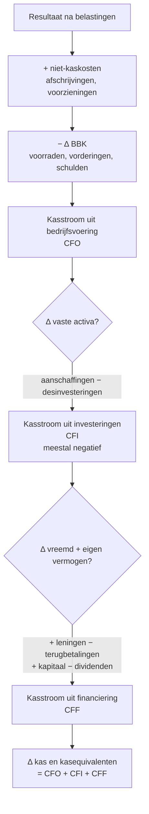
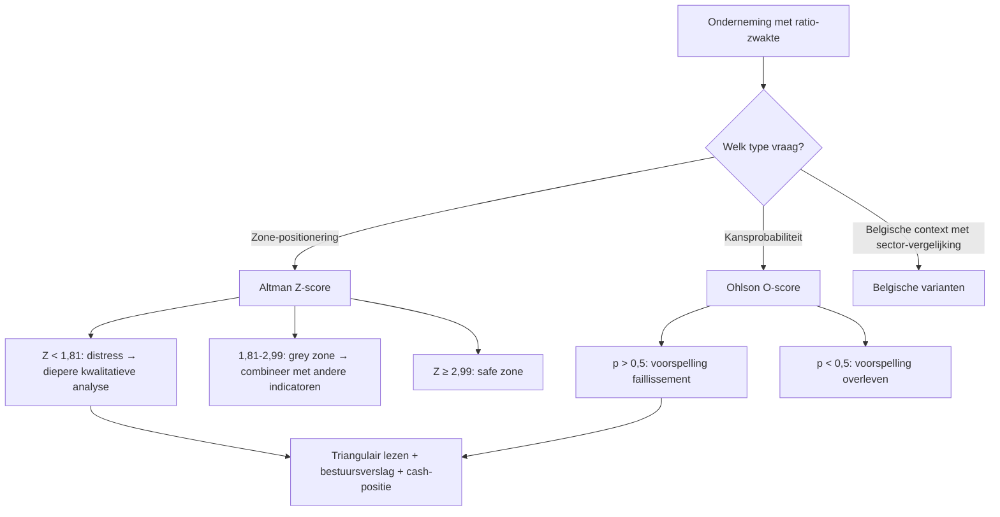

## Wat verwacht het examen van jou?

> [!abstract] Dit programmaonderdeel wordt getoetst op niveau *integratie*.
> Je moet meerdere concepten samen kunnen inzetten in complexe casussen — onderdelen herkennen, prioriteren, en tot een coherent oordeel komen.

**Taken** (uit het ITAA-examenprogramma):

> [!abstract]- **Taak 1** — Opstellen van de individuele en geconsolideerde jaarrekening
>
> **Doelstellingen**:
> - Het doel van financiële analyse is het verstrekken van de informatie die de onderneming nodig heeft om beslissingen te nemen om te voldoen aan de behoeften van aandeelhouders, beleggers, schuldeisers, de ondernemingsrechtbank en de werknemers. Het gaat dus om het begrijpen en interpreteren van de jaarrekening, het verzamelen van relevante informatie om een financiële diagnose op te stellen, het verschaffen van de noodzakelijke basis voor financieel beheer, het vaststellen van financiële risico's en financiële soliditeit, en het uitwerken van scenario's en prognoses om te voldoen aan de toekomstige strategieën van het bestudeerde bedrijf.
> - Lezen en begrijpen van relevante jaarrekeningen
> - De consistentie en relevantie van de gegevens waarborgen
> - Contextualiseren van de omgeving van de onderneming
> - Een grondige financiële diagnose van een onderneming stellen
> - De problematiek vaststellen en aanbevelingen formuleren
> - De passende ratio's gebruiken naargelang de problematiek van de onderneming
> - Relevante informatie verzamelen om de financiële analyse uit te voeren en de databanken kunnen gebruiken
> - Gebruiken van tools voor financiële analyse en beheer
> - Financiële prognoses maken voor ondernemingen
> - De onderneming bijstaan in de verschillende fasen van haar ontwikkeling, van haar oprichting tot haar vereffening

## Leesgids

<!-- TODO: Opus-glue leesgids -->

## Waarom dit programmaonderdeel telt

<!-- TODO: Opus-glue waarom_po -->

## Van toelating naar bekwaamheid: wat verdiept PO 1.9 boven PO 1.3?

<!-- TODO: Opus-glue oriëntatie -->

## Wie leest de jaarrekening en met welk doel? — gebruikersperspectief en scoping

> [!info] Hoort bij taak: Opstellen van de individuele en geconsolideerde jaarrekening

<!-- TODO: Opus-glue thematisch-intro -->

- [[doelstellingen-financiele-analyse|Doelstellingen van financiële analyse]] · `begrip`
- [[gebruikers-jaarrekening|Gebruikers van de jaarrekening]] · `begrip`
- [[getrouw-beeld-jaarrekening|Getrouw beeld van de jaarrekening]] · `regel`
- [[jaarrekening-als-studieobject|Jaarrekening als studieobject van financiële analyse]] · `begrip`
- [[intake-financiele-analyse|Intake (scoping) van financiële analyse]] · `procedure`
- [[bestuursverslag|Bestuursverslag (jaarverslag)]] · `procedure`

## Vertrekpunt: balans-herwerking herhaald, nu vanuit bekwaamheidsperspectief

> [!info] Hoort bij taak: Opstellen van de individuele en geconsolideerde jaarrekening

<!-- TODO: Opus-glue thematisch-intro -->

- [[analytische-balans|Analytische balans (herstructureringsschema)]] · `cluster`

## Resultatenrekening herwerken: vier blokken, drie schema's, toegevoegde waarde

> [!info] Hoort bij taak: Opstellen van de individuele en geconsolideerde jaarrekening

<!-- TODO: Opus-glue thematisch-intro -->

- [[herstructurering-resultatenrekening|Herstructurering van de resultatenrekening]] · `cluster`
- [[toegevoegde-waarde-financiele-analyse|Toegevoegde waarde (economische maatstaf in financiële analyse)]] · `cluster`

## Herstructureren van de resultatenrekening en isoleren van de toegevoegde waarde

> [!info] Hoort bij taak: Opstellen van de individuele en geconsolideerde jaarrekening

<!-- TODO: Opus-glue competentie-intro -->

[[competenties/herstructureren-resultatenrekening-en-toegevoegde-waarde|→ Volledige procedure]]

## Cashflow, financieringsbronnen en mutaties: de tweede pijler naast de balans

> [!info] Hoort bij taak: Opstellen van de individuele en geconsolideerde jaarrekening

<!-- TODO: Opus-glue thematisch-intro -->

- [[cashflow-analyse|Cashflow (bedrijfscashflow)]] · `begrip`
- [[tabel-waardemutaties|Tabel van waardemutaties (mutatietabel vaste activa)]] · `cluster`
- [[financiering-met-eigen-vermogen|Financiering met eigen vermogen]] · `begrip`
- [[financiering-met-derdenkapitaal|Financiering met derdenkapitaal (vreemd vermogen)]] · `begrip`

## Kasstroomoverzicht — operationeel, investerings- en financierings-kasstroom

Het kasstroomoverzicht ontleedt de kasevolutie in drie segmenten: operationele kasstroom (CFO — uit exploitatie), investeringskasstroom (CFI — vaste activa) en financieringskasstroom (CFF — eigen vermogen en schulden). Sluit aan op de balans-evolutie van liquide middelen en is dé synthese die rentabiliteit (resultatenrekening) en vermogen (balans) verbindt met effectieve cash. Niet-verplicht voor verkort/microschema — moet gereconstrueerd worden uit balans, resultatenrekening en toelichtingsstaten.

<!-- TODO: Opus-glue synthese-intro -->

| Segment | Wat zit erin? | Indirecte methode (vertrekpunt) | Wat zegt het over de onderneming? |
|---|---|---|---|
| **Operationeel (CFO)** | Kasstroom uit de eigen activiteit | Resultaat + niet-kaskosten − Δ BBK | Kan het bedrijfsmodel zichzelf bedruipen? |
| **Investerings (CFI)** | In- en uitstroom door aan- en verkoop vaste activa | Aanschaffingen materiële vaste activa min desinvesteringen | Bouwt de onderneming op (negatief = uitbreiding) of leeft ze van afbouw (positief)? |
| **Financierings (CFF)** | In- en uitstroom met kapitaalverschaffers | Nieuwe leningen + kapitaalverhogingen − terugbetalingen − dividenden | Hoe wordt het tekort tussen CFO en CFI overbrugd? |
| **Δ kas en kasequivalenten** | Som van de drie segmenten | CFO + CFI + CFF | Verklaart de Δ liquide middelen op de balans. |

_Bouwt op_: [[cashflow-analyse]] · [[behoefte-aan-bedrijfskapitaal]] · [[financiering-met-eigen-vermogen]] · [[financiering-met-derdenkapitaal]]
## Opstellen van een drie-segmenten-kasstroomoverzicht (CFO, CFI, CFF)

> [!info] Hoort bij taak: Opstellen van de individuele en geconsolideerde jaarrekening

<!-- TODO: Opus-glue competentie-intro -->

[[competenties/opstellen-driesegmenten-kasstroomoverzicht|→ Volledige procedure]]

## Werkkapitaal versus behoefte aan bedrijfskapitaal: de analytische conventie

> [!info] Hoort bij taak: Opstellen van de individuele en geconsolideerde jaarrekening

<!-- TODO: Opus-glue thematisch-intro -->

- [[werkkapitaal|Werkkapitaal (working capital)]] · `begrip`
- [[behoefte-aan-bedrijfskapitaal|Behoefte aan bedrijfskapitaal (BBK)]] · `begrip`

## Bepalen van de behoefte aan bedrijfskapitaal en de nettokas-positie

> [!info] Hoort bij taak: Opstellen van de individuele en geconsolideerde jaarrekening

<!-- TODO: Opus-glue competentie-intro -->

[[competenties/bepalen-behoefte-aan-bedrijfskapitaal|→ Volledige procedure]]

## Ratio-set in de diepte: de vier doelen en hun ratio's

> [!info] Hoort bij taak: Opstellen van de individuele en geconsolideerde jaarrekening

<!-- TODO: Opus-glue thematisch-intro -->

- [[ratio-vier-doelen-vergelijking|De vier analyse-doelen en hun ratio's — overzicht]] · `synthese`
- [[liquiditeitsratio|Liquiditeitsratio (begrip)]] · `begrip`
- [[current-ratio|Current ratio (liquiditeit in ruime zin)]] · `cluster`
- [[quick-ratio|Quick ratio (liquiditeit in enge zin, zuurtegraad)]] · `cluster`
- [[liquiditeitstoets-beslisboom|Welke liquiditeitstoets gebruik ik? — Beslisboom]] · `synthese`
- [[solvabiliteitsratio|Solvabiliteitsratio]] · `cluster`
- [[debt-equity-ratio|Debt-equity ratio (schuldgraad)]] · `cluster`
- [[rentabiliteit-totaal-activa-roa|Rentabiliteit van het totaal der activa (ROA)]] · `cluster`
- [[rentabiliteit-eigen-vermogen-roe|Rentabiliteit van het eigen vermogen (ROE)]] · `cluster`

## Bekwaamheid-niveau lezen: trend, sector en contextuele interpretatie

> [!info] Hoort bij taak: Opstellen van de individuele en geconsolideerde jaarrekening

<!-- TODO: Opus-glue thematisch-intro -->

- [[interpretatie-financiele-ratios|Interpretatie en evaluatie van financiële ratio's (bekwaamheid)]] · `cluster`
- [[horizontale-analyse-jaarrekening|Horizontale analyse (evolutie-analyse)]] · `cluster`
- [[verticale-analyse-jaarrekening|Verticale analyse (percentageanalyse, common-size)]] · `cluster`
- [[sectorvergelijking-financiele-analyse|Sectorvergelijking (benchmarking)]] · `cluster`
- [[historische-evolutie-financiele-analyse|Historische evolutie in financiële analyse]] · `cluster`

## Falen als fenomeen: signalen, alarmbel, covenanten en juridisch kader

> [!info] Hoort bij taak: Opstellen van de individuele en geconsolideerde jaarrekening

<!-- TODO: Opus-glue thematisch-intro -->

- [[falen-van-de-onderneming|Falen van de onderneming (financiële diagnose)]] · `cluster`
- [[risicoparagraaf-bestuursverslag|Risicoparagraaf in het bestuursverslag]] · `regel`
- [[ratio-covenants|Ratiocovenants (financial covenants)]] · `begrip`
- [[cijferanalyses-controle-norm|Cijferanalyses (controlenorm KMO)]] · `regel`

## Kwantitatieve faillissement-predictiemodellen: Altman Z en Ohlson O

> [!info] Hoort bij taak: Opstellen van de individuele en geconsolideerde jaarrekening

<!-- TODO: Opus-glue thematisch-intro -->

- [[altman-z-score|Altman Z-score (faillissement-predictiemodel)]] · `cluster`
- [[ohlson-o-score|Ohlson O-score (faillissement-predictiemodel via logit)]] · `cluster`

## Toepassen van kwantitatieve faillissement-predictiemodellen (Altman Z en Ohlson O)

> [!info] Hoort bij taak: Opstellen van de individuele en geconsolideerde jaarrekening

<!-- TODO: Opus-glue competentie-intro -->

[[competenties/toepassen-faillissement-predictiemodellen|→ Volledige procedure]]

## Kwantitatieve modellen voor financiële diagnose — overzicht

Overzicht-fiche: welke kwantitatieve modellen kan de stagiair inzetten naast klassieke ratio-analyse om falen te voorspellen? Altman Z (discriminantmodel, score-zones, 2-jaarshorizon), Ohlson O (logistische regressie, kansprobabiliteit), aangevuld met sector- en evolutiebenchmarks. Geen vervanging voor inhoudelijk oordeel — wel een tweede toets om signaalsterkte te wegen.

<!-- TODO: Opus-glue synthese-intro -->

| Model | Techniek | Aantal variabelen | Output | Interpretatie hoog | Interpretatie laag |
|---|---|---|---|---|---|
| **Altman Z** | Discriminant-analyse | 5 | Score met 3 zones | Z ≥ 2,99 = gezond | Z < 1,81 = distress |
| **Ohlson O** | Logistische regressie | 9 | Kans 0-1 | Hoog = hoog risico | Laag = laag risico |
| **Belgische varianten** (Score Belfius, Graydon Multiscore) | Eigen propriëtaire modellen op Belgische data | Onbekend | Score 0-100 of letter-rating | Variabel — afhankelijk van bron | Variabel |

_Bouwt op_: [[altman-z-score]] · [[ohlson-o-score]] · [[falen-van-de-onderneming]]
## IT-tools voor financiële analyse: NBB-Online, Bel-First, Graydon, scoringtools

> [!info] Hoort bij taak: Opstellen van de individuele en geconsolideerde jaarrekening

<!-- TODO: Opus-glue thematisch-intro -->

- [[financiele-analyse-software|Financiële-analyse-software (IT-tools)]] · `begrip`

## Gebruiken van financiële-analyse-software voor ratio-set en sectorvergelijking

> [!info] Hoort bij taak: Opstellen van de individuele en geconsolideerde jaarrekening

<!-- TODO: Opus-glue competentie-intro -->

[[competenties/gebruiken-financiele-analyse-software|→ Volledige procedure]]

## Stellen van een complete bekwaamheid-financiële diagnose met aanbevelingen aan het management

> [!info] Hoort bij taak: Opstellen van de individuele en geconsolideerde jaarrekening

<!-- TODO: Opus-glue competentie-intro -->

[[competenties/stellen-bekwaamheid-financiele-diagnose|→ Volledige procedure]]

## Grenzen van kwantitatieve modellen: wat een diagnose NIET kan zeggen

<!-- TODO: Opus-glue oriëntatie -->

## Synthese-stappenplan

<!-- TODO: Opus-glue synthese -->

## Cheatsheet

### Kritische drempelwaarden

| Concept | Naam | Waarde | Eenheid | Gevolg |
|---|---|---|---|---|
| [[altman-z-score]] | Distress zone | Z < 1,81 | Z-score | Hoog faillissementsrisico binnen 2 jaar — diepere diagnose vereist |
| [[altman-z-score]] | Grey zone | 1,81 ≤ Z < 2,99 | Z-score | Onzekere uitkomst — aanvullende analyse vereist |
| [[altman-z-score]] | Safe zone | Z ≥ 2,99 | Z-score | Financieel gezond op basis van het model |

### Vergelijkingsparen-matrix

| Concept | Verwarrend met | Trigger |
|---|---|---|
| [[altman-z-score]] | [[ohlson-o-score]] | Examenvraag 'welk model gebruik je?': Altman geeft een score-positie; Ohlson een kans. Bij twijfel beide berekenen en triangulair lezen. |
| [[behoefte-aan-bedrijfskapitaal]] | [[werkkapitaal]] | Bij examenvraag 'continuïteit / liquiditeitsanalyse': controleer of werkkapitaal de BBK dekt. Niet hetzelfde concept verwarren. |
| [[bestuursverslag]] | [[jaarverslag]] | Twee namen, één document. Term-keuze hangt af van regelgevings-context (BE/EU). |
| [[cashflow-analyse]] | [[rentabiliteit-eigen-vermogen-roe]] | Examenvraag 'cijfer of ratio?': cashflow is een €-bedrag; ROE/ROA op cashflow zijn percentages. |
| [[current-ratio]] | [[quick-ratio]] | Examenvraag 'liquiditeit in ruime / enge zin?': ruim = current; eng = quick. |
| [[debt-equity-ratio]] | [[solvabiliteitsratio]] | Beide drukken financieringsstructuur uit; context bepaalt welke courant is — bankcovenants gebruiken D/E, ratingagentschappen vaker solvabiliteit. |
| [[financiering-met-derdenkapitaal]] | [[financiering-met-eigen-vermogen]] | Examenvraag 'optimale financieringsmix': trade-off tussen kostvoordeel (vreemd is goedkoper) en risico-voordeel (eigen geeft buffer). |
| [[financiering-met-eigen-vermogen]] | [[financiering-met-derdenkapitaal]] | Bij examenvraag 'financieringsmix': bepaal eerst de schuldgraad ([[debt-equity-ratio]]); dat onderscheid is fundamenteel voor solvabiliteits-analyse. |
| [[getrouw-beeld-jaarrekening]] | [[voorzichtigheidsbeginsel]] | Bij een examenvraag 'welk beginsel?' — getrouw beeld als algemeen doel; voorzichtigheid als specifieke voorschrift om risico's volledig op te nemen. |
| [[herstructurering-resultatenrekening]] | [[analytische-balans]] | Examenvraag 'herstructurering jaarrekening': beide aspecten benoemen, niet alleen balans. |
| [[horizontale-analyse-jaarrekening]] | [[verticale-analyse-jaarrekening]] | Examenvraag 'evolutie of structuur?': over de tijd = horizontaal; samenstelling op één moment = verticaal. |
| [[liquiditeitsratio]] | [[solvabiliteitsratio]] | Examenvraag 'kortetermijnsbetaalkracht versus structurele veerkracht': KT = liquiditeit; lang = solvabiliteit. |
| [[liquiditeitsratio]] | [[cash-ratio]] | Examenvraag 'strengste liquiditeitstoets?' of 'welke ratio sluit voorraden én vorderingen uit?': altijd cash ratio. |
| [[ohlson-o-score]] | [[altman-z-score]] | Examenvraag 'welk model levert wat?': Ohlson → kans; Altman → zone. |
| [[quick-ratio]] | [[current-ratio]] | Voorraad-intensiteit: in productie/handel altijd allebei berekenen om de spreiding te zien. |
| [[rentabiliteit-eigen-vermogen-roe]] | [[rentabiliteit-totaal-activa-roa]] | Examenvraag 'welke ratio voor welke vraag?': aandeelhoudersrendement = ROE; economische winstgevendheid van de bedrijfsmiddelen = ROA. |
| [[rentabiliteit-totaal-activa-roa]] | [[rentabiliteit-eigen-vermogen-roe]] | Examenvraag 'economisch vs financieel rendement': economisch = ROA; financieel/aandeelhouder = ROE. |
| [[solvabiliteitsratio]] | [[liquiditeitsratio]] | Examenvraag 'structureel vs operationeel risico': structureel = solvabiliteit; KT betalingsrisico = liquiditeit. |
| [[solvabiliteitsratio]] | [[debt-equity-ratio]] | Solvabiliteitsratio bij algemene structuuranalyse; debt-equity-ratio bij specifieke hefboom- of risicobeoordeling (bankcovenants). |
| [[toegevoegde-waarde-financiele-analyse]] | [[rentabiliteit-totaal-activa-roa]] | Examenvraag 'productiviteit vs rendabiliteit': TW/VTE = arbeidsproductiviteit; ROA = totale kapitaalproductiviteit. Mix niet. |
| [[verticale-analyse-jaarrekening]] | [[horizontale-analyse-jaarrekening]] | Examen 'samenstelling of trend?': samenstelling = verticaal; trend = horizontaal. |
| [[werkkapitaal]] | [[current-ratio]] | Examenvraag 'absolute buffer of relatieve dekking?': absoluut = werkkapitaal; relatief = current ratio. |
| [[werkkapitaal]] | [[werkkapitaalbehoefte]] | Examenvraag 'beschikbaar versus benodigd werkkapitaal' of 'wanneer is er liquiditeitstekort?': vergelijk werkkapitaal (beschikbaar uit balans) met werkkapitaalbehoefte (benodigd voor cyclus). |

## Heb je deze taken in de vingers?

Loop deze taken na vóór je verder gaat met examenfocus. Twijfel je bij een taak? Lees de aangegeven secties nog eens.

- ✓ **1.9.taak.1** — Opstellen van de individuele en geconsolideerde jaarrekening _Behandeld in §5, §6, §7, §8, §9, §10, §11, §12, §13, §14, §15, §16, §17, §18, §19, §20, §21, §22._

## Examenfocus

<!-- TODO: Opus-glue examenfocus -->

> [!question]- Financieel beheer: berekening liquiditeits- en solvabiliteitsratio's
> *Examen 2003-bibf · PO 1.9*
>
> **Balans**
>
> **Actief**
>
> | Rubriek | Bedrag (EUR) |
> | --- | --- |
> | Vaste activa | 150.040,00 |
> | Voorraden | 41.000,00 |
> | Vorderingen op < 1 jaar | 42.700,00 |
> | Geldbeleggingen | 10.000,00 |
> | Liquide middelen | 37.500,00 |
> | TOTAAL ACTIVA | 281.240,00 |
>
> **Passief**
>
> | Rubriek | Bedrag (EUR) |
> | --- | --- |
> | Kapitaal | 100.000,00 |
> | Reserves | 50.400,00 |
> | Overgedragen winst | 2.750,00 |
> | Schulden op > 1 jaar | 51.000,00 |
> | Schulden op < 1 jaar | 77.090,00 |
> | TOTAAL PASSIVA | 281.240,00 |
>
> Bereken het netto bedrijfskapitaal.
>
> > [!success]- Antwoord (klik om te openen)
> > _Antwoord wacht op concept-laag._
>
> Bereken de ruime liquiditeitsratio (current ratio).
>
> > [!success]- Antwoord (klik om te openen)
> > _Antwoord wacht op concept-laag._
>
> Bereken de beperkte liquiditeitsratio (acid test).
>
> > [!success]- Antwoord (klik om te openen)
> > _Antwoord wacht op concept-laag._
>
> Bereken de solvabiliteitsratio.
>
> > [!success]- Antwoord (klik om te openen)
> > _Antwoord wacht op concept-laag._

> [!question]- Berekening van de operationele cash-flow
> *Examen 2003-bibf · PO 1.9*
>
> > Naast de balans van C.1 blijken volgende cijfers uit de resultatenrekening.
>
> **Resultatenrekening (relevante posten)**
>
> | Label | Bedrag |
> | --- | --- |
> | Winst van het boekjaar | 2.750 |
> | Afschrijvingen | 12.100 |
> | Toevoegingen aan voorzieningen | 6.300 |
> | Bestedingen van voorzieningen | -1.650 |
> | Toevoegingen aan waardeverminderingen | 780 |
>
> Bereken de operationele cash-flow.
>
> > [!success]- Antwoord (klik om te openen)
> > _Antwoord wacht op concept-laag._

> [!question]- Behoefte aan bedrijfskapitaal: definitie, berekening en reductiemaatregelen
> *Examen 2008-bibf · PO 1.9*
>
> Wat verstaat men met 'behoefte aan bedrijfskapitaal'?
>
> > [!success]- Antwoord (klik om te openen)
> > _Antwoord wacht op concept-laag._
>
> Hoe wordt de behoefte aan bedrijfskapitaal berekend?
>
> > [!success]- Antwoord (klik om te openen)
> > _Antwoord wacht op concept-laag._
>
> Vanuit het oogpunt van financieel beheer, wat kan worden ondernomen om de behoefte aan bedrijfskapitaal te verminderen?
>
> > [!success]- Antwoord (klik om te openen)
> > _Antwoord wacht op concept-laag._

> [!question]- Haalbaarheid van een investeringskrediet gezien cashflow en aflossingscapaciteit
> *Examen 2008-bibf · PO 1.9*
>
> > Een vennootschap heeft jaarlijks ongeveer 30.000,00 EUR cashflow. Ze betaalt jaarlijks 12.000,00 EUR kapitaalaflossingen op bestaande leningen. Voor een nieuwe investering van 100.000,00 EUR wenst ze van de bank een investeringskrediet te bekomen voor het volledige bedrag. De rentevoet bedraagt 5% per jaar. Ze wenst de nieuwe lening in 5 jaarlijkse gelijke schijven af te lossen.
>
> Wat is uw mening over de haalbaarheid van dit investeringskrediet?
>
> > [!success]- Antwoord (klik om te openen)
> > _Antwoord wacht op concept-laag._

> [!question]- Definities van financiële begrippen
> *Examen 2013-1 · PO 1.9*
>
> > Omschrijf de volgende begrippen:
>
> Omschrijf het begrip 'intrinsieke waarde'.
>
> > [!success]- Antwoord (klik om te openen)
> > _Antwoord wacht op concept-laag._
>
> Omschrijf het begrip 'fractiewaarde'.
>
> > [!success]- Antwoord (klik om te openen)
> > _Antwoord wacht op concept-laag._
>
> Omschrijf het begrip 'netto rendabiliteit van de bedrijfsactiva'.
>
> > [!success]- Antwoord (klik om te openen)
> > _Antwoord wacht op concept-laag._
>
> Omschrijf het begrip 'algemene schuldgraad'.
>
> > [!success]- Antwoord (klik om te openen)
> > _Antwoord wacht op concept-laag._
>
> Omschrijf het begrip 'operationele cash flow voor belastingen'.
>
> > [!success]- Antwoord (klik om te openen)
> > _Antwoord wacht op concept-laag._

> [!question]- Netto bedrijfskapitaal: manieren om het te verhogen
> *Examen 2013-2 · PO 1.9*
>
> > Bij de bespreking van de jaarrekening deelt u aan uw cliënt mede dat het netto bedrijfskapitaal van zijn vennootschap zeer laag is. Hij vraagt u hoe hij het netto bedrijfskapitaal kan verhogen.
>
> Geef drie voorbeelden van maatregelen om het netto bedrijfskapitaal te verhogen.
>
> > [!success]- Antwoord (klik om te openen)
> > _Antwoord wacht op concept-laag._

## Competentie-index

- [[competenties/bepalen-behoefte-aan-bedrijfskapitaal|Bepalen van de behoefte aan bedrijfskapitaal en de nettokas-positie]]
- [[competenties/gebruiken-financiele-analyse-software|Gebruiken van financiële-analyse-software voor ratio-set en sectorvergelijking]]
- [[competenties/herstructureren-resultatenrekening-en-toegevoegde-waarde|Herstructureren van de resultatenrekening en isoleren van de toegevoegde waarde]]
- [[competenties/opstellen-driesegmenten-kasstroomoverzicht|Opstellen van een drie-segmenten-kasstroomoverzicht (CFO, CFI, CFF)]]
- [[competenties/stellen-bekwaamheid-financiele-diagnose|Stellen van een complete bekwaamheid-financiële diagnose met aanbevelingen aan het management]]
- [[competenties/toepassen-faillissement-predictiemodellen|Toepassen van kwantitatieve faillissement-predictiemodellen (Altman Z en Ohlson O)]]

## Concept-index

- [[altman-z-score|Altman Z-score (faillissement-predictiemodel)]] · `cluster`
- [[analytische-balans|Analytische balans (herstructureringsschema)]] · `cluster`
- [[behoefte-aan-bedrijfskapitaal|Behoefte aan bedrijfskapitaal (BBK)]] · `begrip`
- [[bepalen-behoefte-aan-bedrijfskapitaal|Bepalen van de behoefte aan bedrijfskapitaal en de nettokas-positie]] · `competentie`
- [[bestuursverslag|Bestuursverslag (jaarverslag)]] · `procedure`
- [[cashflow-analyse|Cashflow (bedrijfscashflow)]] · `begrip`
- [[cijferanalyses-controle-norm|Cijferanalyses (controlenorm KMO)]] · `regel`
- [[current-ratio|Current ratio (liquiditeit in ruime zin)]] · `cluster`
- [[ratio-vier-doelen-vergelijking|De vier analyse-doelen en hun ratio's — overzicht]] · `synthese`
- [[debt-equity-ratio|Debt-equity ratio (schuldgraad)]] · `cluster`
- [[doelstellingen-financiele-analyse|Doelstellingen van financiële analyse]] · `begrip`
- [[falen-van-de-onderneming|Falen van de onderneming (financiële diagnose)]] · `cluster`
- [[financiering-met-derdenkapitaal|Financiering met derdenkapitaal (vreemd vermogen)]] · `begrip`
- [[financiering-met-eigen-vermogen|Financiering met eigen vermogen]] · `begrip`
- [[financiele-analyse-software|Financiële-analyse-software (IT-tools)]] · `begrip`
- [[gebruiken-financiele-analyse-software|Gebruiken van financiële-analyse-software voor ratio-set en sectorvergelijking]] · `competentie`
- [[gebruikers-jaarrekening|Gebruikers van de jaarrekening]] · `begrip`
- [[getrouw-beeld-jaarrekening|Getrouw beeld van de jaarrekening]] · `regel`
- [[herstructureren-resultatenrekening-en-toegevoegde-waarde|Herstructureren van de resultatenrekening en isoleren van de toegevoegde waarde]] · `competentie`
- [[herstructurering-resultatenrekening|Herstructurering van de resultatenrekening]] · `cluster`
- [[historische-evolutie-financiele-analyse|Historische evolutie in financiële analyse]] · `cluster`
- [[horizontale-analyse-jaarrekening|Horizontale analyse (evolutie-analyse)]] · `cluster`
- [[intake-financiele-analyse|Intake (scoping) van financiële analyse]] · `procedure`
- [[interpretatie-financiele-ratios|Interpretatie en evaluatie van financiële ratio's (bekwaamheid)]] · `cluster`
- [[jaarrekening-als-studieobject|Jaarrekening als studieobject van financiële analyse]] · `begrip`
- [[kasstroomoverzicht-drie-segmenten|Kasstroomoverzicht — operationeel, investerings- en financierings-kasstroom]] · `synthese`
- [[kwantitatieve-financiele-diagnose|Kwantitatieve modellen voor financiële diagnose — overzicht]] · `synthese`
- [[liquiditeitsratio|Liquiditeitsratio (begrip)]] · `begrip`
- [[ohlson-o-score|Ohlson O-score (faillissement-predictiemodel via logit)]] · `cluster`
- [[opstellen-driesegmenten-kasstroomoverzicht|Opstellen van een drie-segmenten-kasstroomoverzicht (CFO, CFI, CFF)]] · `competentie`
- [[quick-ratio|Quick ratio (liquiditeit in enge zin, zuurtegraad)]] · `cluster`
- [[ratio-covenants|Ratiocovenants (financial covenants)]] · `begrip`
- [[rentabiliteit-eigen-vermogen-roe|Rentabiliteit van het eigen vermogen (ROE)]] · `cluster`
- [[rentabiliteit-totaal-activa-roa|Rentabiliteit van het totaal der activa (ROA)]] · `cluster`
- [[risicoparagraaf-bestuursverslag|Risicoparagraaf in het bestuursverslag]] · `regel`
- [[sectorvergelijking-financiele-analyse|Sectorvergelijking (benchmarking)]] · `cluster`
- [[solvabiliteitsratio|Solvabiliteitsratio]] · `cluster`
- [[stellen-bekwaamheid-financiele-diagnose|Stellen van een complete bekwaamheid-financiële diagnose met aanbevelingen aan het management]] · `competentie`
- [[tabel-waardemutaties|Tabel van waardemutaties (mutatietabel vaste activa)]] · `cluster`
- [[toegevoegde-waarde-financiele-analyse|Toegevoegde waarde (economische maatstaf in financiële analyse)]] · `cluster`
- [[toepassen-faillissement-predictiemodellen|Toepassen van kwantitatieve faillissement-predictiemodellen (Altman Z en Ohlson O)]] · `competentie`
- [[verticale-analyse-jaarrekening|Verticale analyse (percentageanalyse, common-size)]] · `cluster`
- [[liquiditeitstoets-beslisboom|Welke liquiditeitstoets gebruik ik? — Beslisboom]] · `synthese`
- [[werkkapitaal|Werkkapitaal (working capital)]] · `begrip`

