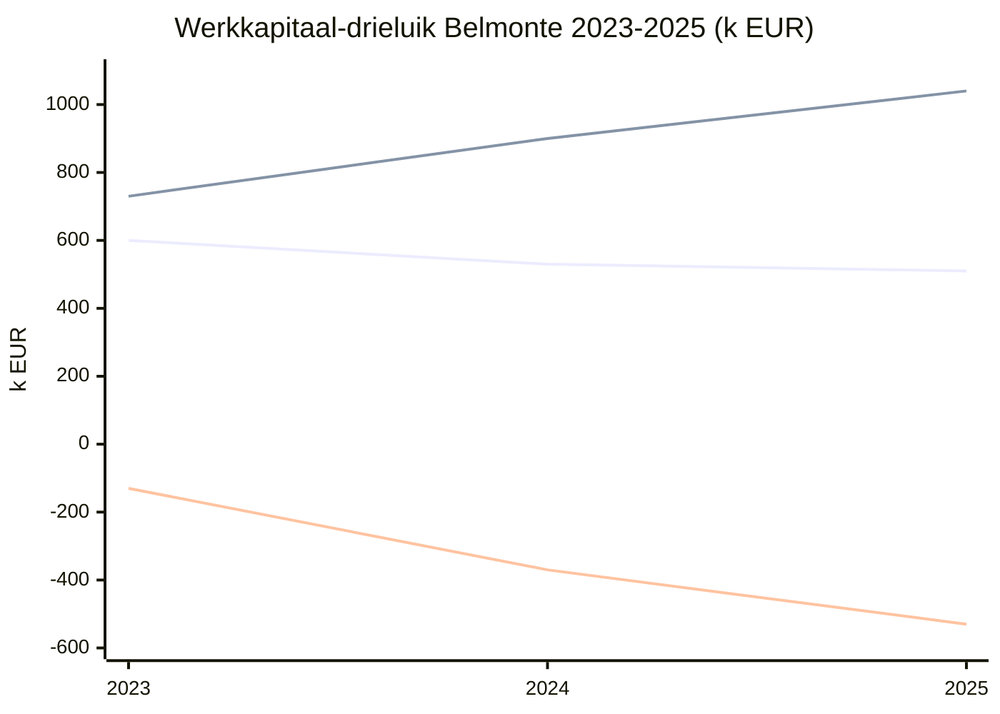

> **Leerstuk — één vraag, helemaal doorgewerkt.** Dit is het eerste leerstuk van PO 1.9 en zet de beheers-laag van de financiële analyse op. De berekeningstechniek van de functionele balans (NBK, BBK, NT) hoort bij PO 1.3 — hier veronderstellen we die als bekend en gebruiken ze als *input*. Voor verhaal en routekaart: [[studiemateriaal/1-9|overzicht PO 1.9]]. Wikilinks doorheen de tekst leiden naar concept-fiches voor definitorische opzoek.

## Antwoord in één blik

Werkkapitaalbeheer is **beslissen op een diagnostische meting** — niet de meting zelf. Het drieluik dat je in PO 1.3 leert berekenen levert drie cijfers: het **netto bedrijfskapitaal** (NBK) toont of permanent vermogen je vaste activa én een buffer financiert; de **behoefte aan bedrijfskapitaal** (BBK) toont hoeveel cash je exploitatiecyclus structureel vastpint; de **nettothesaurie** (NT) is het verschil — ademruimte als hij positief is, structurele kasovertrek-afhankelijkheid als hij negatief blijft. Vier handelingsknoppen volgen daaruit: de behoefte verlagen via voorraden, klantenkrediet en leverancierskrediet; het bedrijfskapitaal verhogen via kapitaalinbreng, lange-termijn-lening, winstreservering of desinvestering; de financieringsmix afstemmen volgens het matching-principe; en bij een dividenddiscussie de wettelijke kapitaalbeschermings-tests doorlopen. Belmonte Industries laat zien hoe dit fout kan lopen — de nettothesaurie zakt drie jaar op rij van −130 naar −530 k EUR.

In de grafiek hierboven zie je drie lijnen: het bedrijfskapitaal blijft min of meer stabiel rond 510-600, de behoefte loopt op van 730 naar 1.040, en de nettothesaurie daalt navenant — van licht negatief naar diep negatief. Het probleem zit niet zozeer bij het bedrijfskapitaal (dat blijft op niveau), maar bij de behoefte die sneller groeit dan het permanent vermogen meebeweegt. We werken de vier knoppen concreet uit aan de Belmonte-case — eerst de diagnose lezen, daarna interveniëren.

---

## Het drieluik als diagnostisch beginpunt

Voor je iets beslist, lees je. De drie cijfers zijn een meting van structurele kasgezondheid op één moment — en hun *evolutie* over meerdere boekjaren is bijna altijd informatiever dan het absolute niveau in één jaar. Voor de berekeningstechniek zelf — hoe je van een Belgische balans naar de functionele indeling gaat — zie [[functionele-balans]].

Belmonte's drie boekjaren in één blik:

| Indicator | 2023 | 2024 | 2025 | Interpretatie |
|---|---:|---:|---:|---|
| Netto bedrijfskapitaal | 600 | 530 | 510 | Licht dalend — geen acute kapitaal-erosie |
| Behoefte aan bedrijfskapitaal | 730 | 900 | 1.040 | Sterk stijgend — exploitatiecyclus vraagt meer cash |
| Nettothesaurie | −130 | −370 | −530 | Verslechterend — groeiende kasovertrek-afhankelijkheid |

Een negatieve nettothesaurie is op zich geen doodzonde. Retail-ketens met korte voorraadrotatie en lange leverancierskredieten leven structureel met een negatieve nettothesaurie — ze laten zich gewoon medefinancieren door hun leveranciers. De cruciale vraag is daarom niet "is het negatief?" maar **"is de trend stabiel of verslechterend?"**. Bij Belmonte is hij drie jaar op rij monotoon verslechterend — dat wijst op een structureel probleem, niet op een toevallige seizoens-uitschuif.

> **Waarom verslechtert het zo snel?** De gemiddelde inningstermijn (DSO) liep op van 47 naar 70 dagen omdat twee grote OEM-klanten hun eigen betalingstermijn van 60 naar 90 dagen verlengden. De voorraad-omloop (DIO) liep op van 49 naar 75 dagen — vraag-zwakte stapelt halffabricaten op. De betalingstermijn aan leveranciers (DPO) liep zelf óók op van 60 naar 70 dagen, maar lang niet genoeg om de twee andere effecten te compenseren. Resultaat: de cash-conversion-cycle ging in twee jaar van 36 naar 75 dagen.

Vanaf hier weten we genoeg om te beslissen waar we op druk zetten. Twee globale richtingen: óf de behoefte verlagen (kleinere voorraden, kortere klantkrediet, langere leverancierskrediet), óf het bedrijfskapitaal verhogen (meer permanent vermogen, minder vaste activa). De volgende twee secties werken die richtingen één voor één uit.

---

## De behoefte verlagen — drie families maatregelen

De formule voor de behoefte aan bedrijfskapitaal is rechttoe rechtaan: **voorraden + handelsvorderingen − handelsschulden**. Daaruit volgen drie knoppen, één per term. Voor de onderliggende ratio's zelf — de inningstermijn, de betalingstermijn, de voorraad-omloop — zie [[activiteits-ratios]].

**Voorraden afbouwen.** Concrete instrumenten: aanvoer just-in-time organiseren, kleinere productie-lots draaien, een bottleneck-analyse op het magazijn, slow-movers identificeren en liquideren, consignatie-voorraad bij de leverancier laten staan. Bij Belmonte is de voorraad in twee jaar opgelopen van 750 naar 1.150 k EUR. De voorraad-omloop staat op 75 dagen tegenover een sectormediaan van 60 — er zit ruimte. Eerste actie: een segmentatie maken van slow-movers (waarschijnlijk halffabricaten waar de vraag van een verloren klant op valt) en die in een uitverkoop wegwerken.

**Klantenkrediet inkorten.** Contractueel kortere betalingstermijnen onderhandelen, een korting voor contante betaling aanbieden, een actiever debiteurenbeheer, of een factoring-overeenkomst sluiten waarbij een factormaatschappij de vorderingen overneemt tegen een vergoeding. Bij Belmonte staat de inningstermijn op 70 dagen, voornamelijk gedreven door twee OEM-klanten die zelf 90 dagen vragen. Onderhandelen is moeilijk gegeven het machtsverschil — factoring is daarom een ernstige optie. Typische factoring-kost: 1 à 3 % van de factuurwaarde, in ruil voor cash binnen vijf dagen in plaats van negentig.

**Leverancierskrediet rekken.** Langere betalingstermijnen onderhandelen, domiciliëren op de laatste vervaldag, geen contante-betalings-korting accepteren wanneer de impliciete jaarrente lager is dan je financieringskost. Bij Belmonte staat de betalingstermijn al op 70 dagen tegenover een sectormediaan van 55 — verdere verlenging schaadt de relatie en riskeert dat leveranciers voorafbetaling gaan eisen.

| Knop | Concrete maatregel | Tegenkracht |
|---|---|---|
| Voorraden | JIT-aanvoer · bottleneck-analyse · consignatie · slow-mover-uitverkoop | Stockbreuken · omzetverlies bij verkooppieken |
| Klantenkrediet (DSO) | Korte termijnen · korting voor contante betaling · debiteurenbeheer · factoring | Klantenverlies · factoring-kost · kredietverzekering-kost |
| Leverancierskrediet (DPO) | Termijnen onderhandelen · domiciliëren op vervaldag · prompt-pay-korting weigeren als impliciete rente < financieringskost | Relatie-schade · verlies prompt-pay-korting · leveringsrisico |

De rechtse kolom toont waarom je deze knoppen nooit los van elkaar kunt indrukken. Te agressief voorraad afbouwen veroorzaakt stockbreuken en omzetverlies. Te kort klantenkrediet kost je klanten. Te lang leverancierskrediet erodeert de relatie of dwingt de leverancier tot voorafbetaling — wat de behoefte juist *vergroot*. Beheer is hier per definitie balanceren tussen financieringskost en commerciële kost.

---

## Het bedrijfskapitaal verhogen — vier families maatregelen

De andere kant van het drieluik: het netto bedrijfskapitaal zelf optillen. De formule is **permanent vermogen − vaste activa**, en daaruit volgen twee assen: meer permanent vermogen óf minder vaste activa. Concreet werken vier knoppen.

**Kapitaalverhoging of inbreng door aandeelhouders.** Dit is een pure permanent-vermogen-stijging — één-op-één verhogen van het bedrijfskapitaal. Voor Belmonte zou een aandeelhouders-inbreng van 200 à 300 k EUR door Marc en Peter een serieuze buffer creëren. Aandachtspunten: dit dilueert (als er externe investeerders zouden komen) en er zijn fiscale overwegingen rond inbreng in geld versus inbreng in natura. Bij familiale KMO's vaak de gezondste optie omdat er geen externe verwatering speelt.

**Lange-termijn-lening aantrekken voor exploitatie-doeleinden.** Hier zit een belangrijke nuance: het bedrijfskapitaal stijgt enkel wanneer de extra schuld op de balans van klasse "schulden ≤ 1 jaar" naar klasse "schulden > 1 jaar" verschuift, of wanneer ze de vlottende activa rechtstreeks voedt. Een variant die bij Belmonte heel concreet speelt: de bestaande kasovertrek van 280 k EUR herfinancieren in een vijfjarige bank-lening — korte bankschuld daalt, lange bankschuld stijgt, bedrijfskapitaal stijgt met 280.

**Winst reserveren in plaats van uitkeren.** Interne kapitaalvorming: elke euro die in plaats van als dividend uit te gaan in de overgedragen winst blijft, verhoogt het eigen vermogen en dus ook het bedrijfskapitaal. Voor Belmonte 2025 niet rechtstreeks relevant (een verlies van 100 k valt niet te reserveren), maar in winstgevende jaren een van de gezondste opties — gratis kapitaal zonder externe afhankelijkheid.

**Desinvesteren of sale-and-leaseback.** Vaste activa dalen, liquide middelen stijgen — bedrijfskapitaal stijgt. Bij Belmonte zou de 25 %-participatie in Belmonte Energy CV (100 k EUR) verkocht kunnen worden; of het industriegebouw via een sale-and-leaseback omgezet worden in cash plus een lange-termijn-leasingverplichting. Let op de subtiliteit: een sale-and-leaseback verhoogt het bedrijfskapitaal alleen als de leasingverplichting effectief langer dan één jaar loopt. Wordt het een korte verplichting, dan verschuift het probleem mee.

| Knop | Effect op de balans | Voorbeeld Belmonte |
|---|---|---|
| Kapitaalverhoging / aandeelhouders-inbreng | Permanent vermogen +X → bedrijfskapitaal +X | Marc + Peter brengen 200 k in |
| Lange-termijn-lening (vrij voor exploitatie) | Korte schulden −X + lange schulden +X → bedrijfskapitaal +X | Herfinanciering 280 k kasovertrek naar 5-jarige bank-LT |
| Winst reserveren | Eigen vermogen +X → bedrijfskapitaal +X | Geen dividend bij positief resultaat (n.v.t. 2025) |
| Desinvestering of sale-and-leaseback | Vaste activa −X + cash +X → bedrijfskapitaal +X | Verkoop 25 %-participatie Belmonte Energy 100 k → cash |

> **Belangrijke valkuil — examen 2013-2.** De stelling "een lange-termijn-lening om vaste activa te kopen verhoogt het bedrijfskapitaal" is **fout**. Het bedrijfskapitaal stijgt alleen wanneer de extra financiering *niet* in vaste activa landt. Een lening van 600 k EUR die gelijktijdig wordt gebruikt om een machine van 600 k EUR te kopen is bedrijfskapitaal-neutraal: permanent vermogen +600, vaste activa +600, netto-effect nul. Voor de Belmonte-investeringsdiscussie betekent dit: de geplande nieuwe CNC-cel financieren met een investeringskrediet helpt het werkkapitaal *niet* — daarvoor moet je een aparte herfinancierings-of-inbreng-actie nemen.

---

## De financieringsmix — eigen tegenover vreemd, kort tegenover lang

Werkkapitaalbeheer is niet alleen "meer cash maken". Het is ook de juiste financierings*structuur* kiezen, en daar lopen twee assen tegelijk: eigen vermogen tegenover vreemd vermogen, en korte termijn tegenover lange termijn. Beide assen hebben hun eigen logica.

Op de **eigen-vermogen-versus-vreemd-vermogen-as** geldt een klassieke afweging. Meer eigen vermogen betekent een lagere financiële hefboom, meer veiligheid bij tegenslag, maar ook een hogere gewogen kapitaalkost — aandeelhouders verwachten typisch een hoger rendement dan een bank-rente, want ze nemen het residuele risico. De optimale schuldgraad zit theoretisch waar de marginale fiscale aftrekbaarheid van interest gelijk wordt aan de marginale stijging van de faillissementskost. In de praktijk speelt voor grotere ondernemingen bovendien de [[thin-cap-regime|EBITDA-regel of thin-cap-grens]]: de aftrekbaarheid van het financieringskostensurplus wordt beperkt tot het hoogste van 30 % van de fiscale EBITDA of een safe-harbour-drempel van 3 mio EUR. Voor een KMO als Belmonte is die laatste drempel ruim genoeg — maar bij snelle schuldopbouw is het iets om in het achterhoofd te houden.

Op de **korte-tegen-lange-termijn-as** weegt herfinancierings-risico tegen rente-kost. Kortere termijnen leveren typisch een lagere nominale rente op, maar je staat elke vervaldag opnieuw aan de bank. Lange termijnen geven zekerheid maar kosten gemiddeld iets meer. Vuistregel: stabiele exploitatie-financiering hoort lang, seizoens-pieken horen kort.

De brug tussen beide assen is het **matching-principe**.

### Matching-principe in detail

Het matching-principe schrijft voor dat je de looptijd van je financiering afstemt op de looptijd van wat ze financiert. Lange-termijn-activa (gebouw, machine) financier je met lange-termijn-passiva (lange schulden of eigen vermogen). Korte-termijn-activa — het schommelende deel van voorraden, vorderingen — financier je met een combinatie van een lange-termijn-buffer (namelijk het bedrijfskapitaal zelf) plus korte-termijn-passiva (handelsschulden, kasovertrek).

Een matching-fout maakt je kwetsbaar. Een CNC-cel met een economische levensduur van acht jaar financieren met een kredietlijn van één jaar betekent dat je elk jaar opnieuw moet herfinancieren — als de bank dan terugtrekt, sta je vast met een machine zonder financiering. Omgekeerd is voorraad financieren met een twintigjarige lening overkill: je betaalt jaren rente over een ophanging die elk kwartaal opnieuw rondrolt.

Belmonte 2025 leest fout op beide assen. De schuldgraad lange termijn ligt op 27,9 % (acceptabel), maar de korte schulden zijn opgelopen tot 1.940 k EUR — waarvan 280 kasovertrek, 320 lopende aflossingen op lange-termijn-leningen, en 90 RSZ-achterstand. De echte mismatch zit dieper: een structurele werkkapitaalbehoefte van 1.040 k wordt deels met korte bankschuld gefinancierd in plaats van met permanent vermogen. Concrete consequentie voor de geplande investering in de nieuwe CNC-cel: voor de bank langsgaan met *eerst* een herfinancierings-plan van de kasovertrek naar een lange-termijn-bank en *daarna* pas een investeringskrediet. Zo niet, dan stapelt het investeringskrediet bovenop een al gebroken structuur.

---

## Dividend-capaciteit — kan ik überhaupt uitkeren?

Werkkapitaalbeheer en dividendbeleid raken elkaar op één scherp punt: een dividend-uitkering is een permanente kapitaal-onttrekking. Voor je over uitkeren beslist, doorloop je twee wettelijke tests én één economische toets.

**Eerst de netto-actief-test.** Na de uitkering mag het netto-actief van de vennootschap niet gedaald zijn beneden een minimum. Voor een NV is dat minimum: het gestort kapitaal plus alle reserves die volgens wet of statuten niet uitkeerbaar zijn (wettelijke reserve, statutair onbeschikbaar gemaakte reserves). Voor een BV is het minimum: het niet-uitkeerbare deel van het ingebrachte eigen vermogen en de onbeschikbare reserves — er is geen kapitaal-concept meer in de BV sinds de WVV. De definitie van netto-actief is in beide gevallen gelijk: totaal activa min voorzieningen min schulden, en specifiek voor de uitkeringstest verminderd met de nog niet afgeschreven kosten van oprichting en uitbreiding en van onderzoek en ontwikkeling. Voor het juridisch kader zie [[kapitaalbescherming]].

**Daarna, voor een BV, de liquiditeitstest.** Het bestuursorgaan moet vaststellen dat de vennootschap na de uitkering, volgens de redelijkerwijs te verwachten ontwikkelingen, in staat zal blijven haar opeisbare schulden te voldoen over de twaalf maanden volgend op de uitkering. Geen wettelijke formule — wel een onderbouwde prognose. In de praktijk komt dit neer op een werkkapitaal- en cashflow-projectie. Voor een NV bestaat deze liquiditeitstest niet als afzonderlijke wettelijke regel, maar de algemene bestuurder-zorgvuldigheidsplicht voorziet een gelijkaardig oordeel: ook NV-bestuurders mogen geen dividend uitkeren waarvan ze redelijkerwijs moeten weten dat het de continuïteit in gevaar brengt.

**Daarbovenop de economische toets.** Ook al passeert het juridisch — is het cashflow-gezond? Bij Belmonte 2025: netto-actief 1.610 k tegenover een wettelijk minimum (voor een NV: helft van het kapitaal van 500 k = 250 k) waar de eigen-vermogen-rubrieken ruim boven blijven. Op papier passeert de netto-actief-test. Maar het boekjaar 2025 sluit met een verlies van 100, de nettothesaurie loopt naar −530, en er staat een RSZ-achterstand open van 90. Een dividend-uitkering in zo'n context zou voor de bank een rood signaal zijn en het continuïteits-risico vergroten. Juridisch toegestaan; economisch onverdedigbaar.

Voor de detail-mechaniek van de kapitaalbescherming en de **alarmprocedure** (wat gebeurt er als het netto-actief onder de helft van het kapitaal zakt) zie het concept [[kapitaalbescherming]] en het leerstuk over [[continuiteit-en-faillissementspredictie]].

---

## Belmonte 2026 — werkkapitaal-routekaart

De diagnose ligt vast. Wat doe je ermee? Bij een verslechterende positie als die van Belmonte werk je op drie horizons tegelijk: nu, binnen twaalf maanden, binnen twee jaar.

**Op de korte termijn (Q1 2026)** zit de focus op cash vrijmaken zonder structuur te raken. Factoring opstarten met de twee OEM-klanten zet de inningstermijn van 70 dagen effectief op 5 — kost iets, maar lost de bottleneck onmiddellijk op. Tegelijk een voorraad-audit: slow-movers identificeren en in een gerichte uitverkoop wegwerken. En een betalingsplan voor de RSZ-achterstand onderhandelen — zonder plan wordt 90 k achterstand een signaal aan de bedrijfsrechtbank, met een paspoort richting alarmprocedure.

**Binnen twaalf maanden** zit de focus op structureel herstel van de financieringsmix. De kasovertrek van 280 k consolideren in een vijfjarige bank-lening. Het gesprek aangaan met ING en KBC over een herfinancierings-pakket, eventueel met een staats-gewaarborgde KMO-lening (Gigarant of de federale Waarborgregeling) om het bankrisico te delen. Het investeringskrediet voor de nieuwe CNC-cel pas aanvragen *na* het werkkapitaal-herstel — anders krijgt de bank een dossier waar twee problemen gestapeld zitten.

**Binnen vierentwintig maanden** beleid maken van de ad-hoc-maatregelen. Een betalingstermijn-policy contractueel verankeren bij nieuwe klanten zodat de inningstermijn niet opnieuw uitloopt. Een voorraadbeleid met cyclus-tellingen en JIT-overweging. En de aandeelhouders-inbreng van 200 à 300 k EUR onderzoeken om een eigen-vermogen-buffer op te bouwen die meebeweegt met de groei.

| Horizon | Actie | Effect op het drieluik | Verantwoordelijk |
|---|---|---|---|
| Nu (Q1 2026) | Factoring + slow-mover-uitverkoop + RSZ-betalingsplan | Behoefte ↓ via voorraden en inningstermijn; nettothesaurie ↑ via cash-vrijmaking | CFO + commercieel |
| 6–12 maanden | Kasovertrek herfinancieren naar lange-termijn-bank | Bedrijfskapitaal ↑ (schulden kort → lang) | CFO + bank |
| 12–24 maanden | Aandeelhouders-inbreng 200–300 k EUR | Bedrijfskapitaal ↑ permanent + financiële autonomie ↑ | Bestuur + aandeelhouders |

Zonder ingreep loopt de trend door: het netto-actief daalt onder de helft van het kapitaal tegen ongeveer 2027, en dan wordt de alarmprocedure acuut. Dat is geen prognose — het is een rechtstreekse extrapolatie van het verlies-tempo gecombineerd met de groeiende kasovertrek-afhankelijkheid. Voor de continuïteits-toets zie [[continuiteit-en-faillissementspredictie]].

---

## Drie valkuilen

> **Valkuil 1 — een lange-termijn-lening voor vaste activa als "bedrijfskapitaal-verhoging" boeken.** Het netto bedrijfskapitaal stijgt alleen wanneer de extra financiering *niet* in vaste activa landt. Een investering van 600 k EUR gefinancierd met een investeringskrediet van 600 k EUR is bedrijfskapitaal-neutraal — permanent vermogen +600, vaste activa +600. Dit is een examen-klassieker en een bestuurs-klassieker tegelijk.

> **Valkuil 2 — de drie reductie-knoppen los van elkaar indrukken.** De behoefte aan bedrijfskapitaal is een drieluik (voorraden, klantenkrediet, leverancierskrediet) waar één knop fout-draaien de andere kapotmaakt. Te lange betalingstermijn naar leveranciers verstoort de relatie → leveranciers eisen voorafbetaling → de winst op inningstermijn-zijde wordt opgegeten door extra werkkapitaalbehoefte aan inkoop-zijde. Beheer in samenhang, niet één knop per kwartaal.

> **Valkuil 3 — een dividend-uitkering puur juridisch toetsen.** Wie alleen de netto-actief-test door rekent en de cashflow-realiteit negeert, verliest de essentie van het kapitaalbeschermings-recht uit het oog. De BV-liquiditeitstest is precies daarvoor in 2019 ingevoerd; voor de NV bestaat ze niet als wettelijke regel maar wel als bestuurder-zorgvuldigheidsplicht. Een wettelijk toegelaten uitkering kan economisch nog steeds bestuurder-aansprakelijkheid uitlokken.

---

## Wanneer je dit snapt, ga dan naar

- [[kredietbeoordeling-en-kasstroomprognose]] — volgende stap: krediet aanvragen en aflossings-capaciteit toetsen. Het integratie-moment waar ratio's, kasstroom en werkkapitaalpositie samen een ja-of-nee-advies opleveren.
- [[continuiteit-en-faillissementspredictie]] — wat als de werkkapitaalstress structureel wordt? Going-concern, alarmprocedure en Altman Z-score.
- [[financiele-diagnose-stellen]] — de integratie-laag: hoe verpak je werkkapitaal-bevindingen in een rapport met aanbevelingen per stakeholder.
- [[studiemateriaal/1-9/samenvatting|Samenvatting PO 1.9]] — voor herhaling vlak vóór het examen: NBK/BBK/NT-formules, de drie reductie-families, het matching-principe en de dividend-capaciteits-tests in één 2-tot-4-A4-kapstok.

## Doorklik naar concepten

Voor wie definitorisch detail wil opzoeken:

- [[functionele-balans]] · [[werkkapitaalbehoefte]]
- [[activiteits-ratios]] · [[liquiditeits-ratios]]
- [[kapitaalbescherming]] · [[thin-cap-regime]]

---

## Wettelijk fundament

- **Functionele-balans-doctrine (NBK / BBK / NT)**: geen wettelijke regel — bedrijfseconomisch model (Ooghe & Van Wymeersch, *Handboek financiële analyse*). De rubriek-indeling die de berekening voedt (klassen 5 voor geldbeleggingen en liquide middelen, rubriek 43 voor bank-schulden kort) volgt het Minimum Algemeen Rekeningenstelsel (KB van 21 oktober 2018).
- **Kapitaalbescherming bij dividend-uitkering NV — netto-actief-test**: WVV art. 7:212 — na de uitkering mag het netto-actief niet dalen beneden het gestort kapitaal vermeerderd met de niet-uitkeerbare reserves. Definitie van netto-actief = totaal activa − voorzieningen − schulden, voor de uitkeringstest bovendien verminderd met niet-afgeschreven oprichtings- en onderzoeks- en ontwikkelingskosten.
- **Kapitaalbescherming bij dividend-uitkering BV — netto-actief-test + liquiditeitstest**: WVV art. 5:142 (netto-actief-test) en art. 5:143 (liquiditeitstest). Het bestuursorgaan moet vaststellen dat de BV haar opeisbare schulden over de twaalf maanden na uitkering kan voldoen, en het besluit motiveren in een verslag dat door de commissaris (indien benoemd) wordt nagezien.
- **Interestaftrek-beperking (thin-cap-regime, ATAD-implementatie)**: WIB92 art. 198/1 — het financieringskostensurplus is aftrekbaar tot het hoogste van 30 % van de fiscale EBITDA of een safe-harbour-drempel van 3 mio EUR (max-functie, niet som). Niet-aftrekbaar overschot is onbeperkt overdraagbaar naar volgende boekjaren. Relevant bij financieringsmix-keuze voor middelgrote tot grote ondernemingen — KMO's blijven typisch onder de safe-harbour-drempel.
- **Alarmprocedure NV**: WVV art. 7:228 — wanneer het netto-actief daalt onder de helft van het kapitaal, moet het bestuursorgaan binnen twee maanden de algemene vergadering bijeenroepen. Werkkapitaal-relevantie: een dividend-uitkering die het netto-actief onder deze drempel zou duwen is de facto verboden onder de bestuurder-zorgvuldigheidsplicht, ook voor de uitkering plaatsvindt.

---

*Leerstuk PO 1.9 — lstk 1 van 4. Status: voorgesteld.*
