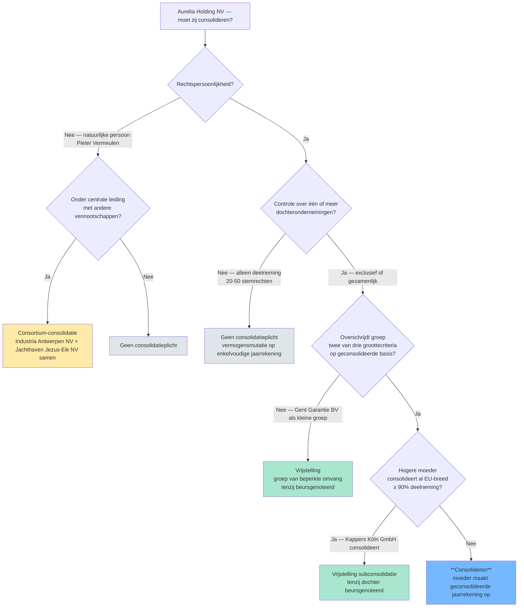

## Leesgids

Deze minicursus volgt de natuurlijke redeneerorde van consolidatie: eerst snap je waarom de geconsolideerde jaarrekening bestaat, dan zie je via een vroege beslisboom wanneer ze verplicht is, daarna bouw je het begrippenkader (controle, actoren) op, vervolgens leer je per competentie hoe je tot een conclusie komt, en ten slotte bekijk je de methodes, publicatie en de IFRS-context. Werk lineair door de hoofdstukken in deze volgorde — de twee synthese-hoofdstukken (beslisboom en methodes-vergelijking) staan bewust op het kantelpunt tussen begrippen en techniek, zodat je ze kunt gebruiken als kapstok voor wat erop volgt. Klik elke wikilink door zodra een concept voor het eerst opduikt en je de definitie nog niet helder hebt; de cheatsheet onderaan dient als snel-naslag voor drempels en vergelijkingsparen.

## Waarom dit programmaonderdeel telt

Een enkelvoudige jaarrekening toont alleen de juridische schil van één vennootschap — niet de economische realiteit van een groep die als één geheel handelt, vorderingen en schulden onderling boekt, en intern winsten realiseert die voor de buitenwereld nog geen winst zijn. Het beschermingsdoel van het jaarrekeningenrecht (transparantie voor aandeelhouders, schuldeisers en werknemers) komt pas tot zijn recht als die groep ook als één geheel wordt afgebeeld. Daarom verplicht de wet de moeder om bovenop haar enkelvoudige cijfers een geconsolideerde jaarrekening op te stellen, met een eigen verslag en een eigen controle door de commissaris. Voor jou als accountant is dit onderdeel dus niet één techniek maar een tweesporig denkkader: wanneer kantelt 'verzameling vennootschappen' naar 'groep waarvoor één gezicht naar buiten moet'? En als die plicht ontstaat — welk soort relatie tussen moeder en dochter krijg je op tafel, en welke methode hoort daarbij?

## Wat is consolideren? Waarom een geconsolideerde jaarrekening?

Consolideren is geen boekhoudtruc om cijfers samen te tellen — het is een fictie die het jaarrekeningenrecht oplegt om recht te doen aan de economische realiteit van een groep. Wie via dochterondernemingen handelt, drijft één economische activiteit door meerdere juridische schillen heen; lezers die alleen de moedercijfers zien, krijgen een vertekend beeld van wat de groep werkelijk bezit, verdient of schuldig is. De geconsolideerde jaarrekening lost dat op door [[moedervennootschap|moeder]] en haar [[dochteronderneming|dochters]] voor te stellen 'alsof het één onderneming was', mits er [[controle]] bestaat. De [[consolidatiekring]] bakent dan af welke vennootschappen meedoen en op welke manier. Houd vanaf nu twee vragen in gedachten die de hele rest van dit programmaonderdeel structureren: bestaat de groep wel als groep (controlevraag), en wie hoort erbij (kring-vraag)?

## Moet ik consolideren? — Beslisboom

Voordat je in de begrippen duikt, krijg je hier de kaart van het terrein. De beslisboom hieronder loopt vooruit op concepten die je verderop in detail ziet ([[controle]], [[consortium]], [[groottecriteria-consolidatie]], [[vrijstelling-subconsolidatie]]) — gebruik hem nu vooral om de structuur van de plichtsvraag te zien: hoe komt de wet via vijf parallelle toetsen tot een ja of nee? Kom na de volgende hoofdstukken terug naar deze boom om te ervaren hoe de begrippen samen één beslissing dragen.

De vraag 'moet mijn cliënt een geconsolideerde jaarrekening opmaken' wordt nooit door één criterium beantwoord. Vijf elementen werken samen: bestaat er controle? heeft de moeder rechtspersoonlijkheid? overschrijdt de groep de groottecriteria? geldt er een vrijstelling? is de groep een consortium? Dit synthese-record volgt de wettelijke beslissingsvolgorde en koppelt elke vraag aan het concept-record dat het beantwoordt.

| Stap | Toets | Welk concept? | Bij 'ja' | Bij 'nee' |
|---|---|---|---|---|
| 1 | Is de moeder een vennootschap met rechtspersoonlijkheid? | [[moedervennootschap]] | Door naar stap 2 | Geen consolidatieplicht (natuurlijke persoon → eventueel consortium-piste) |
| 2 | Bestaat er controle (in rechte of in feite) over één of meer dochters? | [[controle]] | Door naar stap 3 | Geen consolidatieplicht |
| 3 | Of: zijn er meerdere vennootschappen onder centrale leiding zonder onderlinge moeder-dochter? | [[consortium]] | Consortium-consolidatie (horizontaal), door naar stap 4 | Verticale groep, door naar stap 4 |
| 4 | Overschrijdt de groep meer dan één van de groottecriteria op geconsolideerde basis? | [[groottecriteria-consolidatie]] · [[groep-van-beperkte-omvang]] | Door naar stap 5 | Vrijstelling 'groep van beperkte omvang' — geen consolidatieplicht (tenzij beursgenoteerd) |
| 5 | Wordt de moeder zelf al opgenomen in een gelijkwaardige geconsolideerde jaarrekening hogerop in de EU (≥ 90 % deelneming)? | [[vrijstelling-subconsolidatie]] | Vrijstelling subconsolidatie — moeder consolideert niet zelf, tenzij dochter beursgenoteerd | **Consolideren** — moeder maakt geconsolideerde jaarrekening op |



**Kerninzichten**:
- Geen enkele moeder is automatisch consolidatieplichtig — er zijn altijd vijf parallelle toetsen die elk een 'nee' kunnen geven. Een examenvraag die zegt 'moeder X heeft controle over dochter Y, dus moet zij consolideren' kapt de redenering te vroeg af.
- Een natuurlijke persoon kan nooit moeder zijn (geen rechtspersoonlijkheid), maar haar gecontroleerde vennootschappen kunnen samen wel een consortium vormen. De plicht verschuift dan van één entiteit naar 'de leden samen'.
- De groottecriteria zijn 'op geconsolideerde basis' — je moet dus een fictieve geconsolideerde balans opbouwen om te beslissen of je een echte moet maken. Dat is geen circulariteit maar een toetscriterium.
- Beursnotering breekt zowel de 'groep van beperkte omvang'-vrijstelling als de subconsolidatie-vrijstelling. Voor genoteerde vennootschappen geldt: altijd consolideren, drempels of hogere moeder doen er niet toe.

[[consolidatieplicht-beslisboom|→ Volledige synthese-fiche]]

## Het fundamentele begrippenkader: controle en de actoren in een groep

Alle vragen in dit programmaonderdeel — wie consolideert, wie hoort in de kring, welke methode pas je toe — vertrekken vanuit één centraal begrip: controle. Hier definieer je dus eerst wat 'controle' juridisch en feitelijk inhoudt, en kwalificeer je vervolgens de actoren die uit die controlevraag voortvloeien (moeder, dochter, geassocieerde, gemeenschappelijke dochter, consortium-lid). Lees deze blok als woordenboek én als ladder: de actoren zijn telkens een gevolg van het soort relatie tussen vennootschappen, en die relatie wordt zelf bepaald door de mate van invloed — van loutere deelneming, over invloed van betekenis, tot gezamenlijke of exclusieve controle.

**[[controle|Controle]]**: De macht — juridisch (in rechte) of feitelijk (in feite) — om beslissende invloed uit te oefenen op een vennootschap: de meerderheid van de bestuurders aanstellen of de hoofdlijn van het beleid...

**[[moedervennootschap|Moedervennootschap]]**: Een vennootschap die controle uitoefent over een andere vennootschap (de dochter). De moeder is in principe verplicht om een geconsolideerde jaarrekening en een geconsolideerd jaarverslag op te...

**[[dochteronderneming|Dochteronderneming]]**: Een vennootschap waarover een andere vennootschap (de moeder) controle uitoefent. In het WVV is 'dochteronderneming' ruimer dan 'dochtervennootschap': het omvat ook elke instelling naar Belgisch...

**[[exclusieve-controle|Exclusieve controle]]**: De controle die één vennootschap alleen uitoefent over een andere — niet samen met andere vennoten. Exclusieve controle is onweerlegbaar wanneer een vennootschap (rechtstreeks of via dochters)...

**[[gezamenlijke-controle|Gezamenlijke controle]]**: De controle die een beperkt aantal vennoten samen uitoefenen, op grond van een overeenkomst dat beleidsbeslissingen alleen met hun gemeenschappelijke instemming kunnen worden genomen. De...

**[[invloed-van-betekenis|Invloed van betekenis]]**: De macht om deel te nemen aan de financiële en operationele beleidsbeslissingen van een andere onderneming, zonder die beslissingen alleen of samen met anderen te kunnen sturen. Invloed van...

**[[geassocieerde-onderneming|Geassocieerde onderneming]]**: Een onderneming waarop een andere onderneming een invloed van betekenis heeft — maar niet voldoende om er controle over uit te oefenen. De geassocieerde is dus geen dochter en geen...

**[[gemeenschappelijke-dochteronderneming|Gemeenschappelijke dochteronderneming]]**: Een vennootschap waarover een beperkt aantal vennoten samen controle uitoefenen op basis van een overeenkomst dat beleidsbeslissingen alleen met hun gemeenschappelijke instemming kunnen worden...

**[[consortium|Consortium (horizontale groep)]]**: Een groep vennootschappen die niet door een moeder-dochter-relatie zijn verbonden, maar wel onder één gemeenschappelijke leiding staan. In een gewone (verticale) groep moet de moeder consolideren....


## Bepalen of een vennootschap een geconsolideerde jaarrekening moet opstellen

Dit is de eerste vraag die je als accountant beantwoordt zodra een cliënt met een groepsstructuur op tafel komt. De procedure is sterk wettelijk verankerd — je toetst stap voor stap af tegen de criteria van het WVV en de vrijstellingen — maar laat ruimte voor feitelijke beoordeling bij controle in feite en bij de groottetoets. Je bouwt hier de gewoonte op om geen 'ja' uit te spreken zonder eerst alle vrijstellingen te hebben afgevinkt.

[[competenties/bepalen-consolidatieverplichting|→ Volledige procedure]]

**Eerste stap**: Vaststellen of de entiteit als vennootschap kwalificeert — [{'artefact': 'Statuten van de entiteit', 'veld': 'Juridische vorm', 'type': 'document'}, {'artefact': 'KBO-uittreksel', 'veld': 'Rechtsvorm', 'type': 'document'}]

## Afbakenen van de consolidatiekring en beoordelen van uitsluitings- of weglatingsgronden

Zodra je weet dát er geconsolideerd moet worden, ga je inventariseren wie er in de kring hoort. Het uitgangspunt is ruim — moeder en al haar dochters — maar je moet per entiteit toetsen of er een uitsluitings- of weglatingsgrond bestaat (bijvoorbeeld 'te verwaarlozen betekenis' of een belemmering in de uitoefening van controle). Een uitgesloten dochter verdwijnt niet uit beeld: ze wordt typisch via vermogensmutatie opgenomen, zodat het getrouw beeld bewaard blijft.

[[competenties/afbakenen-consolidatiekring|→ Volledige procedure]]

**Eerste stap**: Identificeren van de consoliderende vennootschap — [{'artefact': 'Conclusie uit [[bepalen-consolidatieverplichting]]', 'veld': 'Moeder of consortium-leden', 'type': 'conclusie'}]

## Kwalificeren van de relatie met een deelneming (controle, gezamenlijke controle of invloed van betekenis)

Voor elke entiteit in de kring beantwoord je daarna één precieze vraag: wat is het soort relatie tussen moeder en deelneming? De wet biedt je drempelvermoedens om die kwalificatie te beginnen — boven de helft van de stemrechten, 50/50 met een vennoten-overeenkomst, vanaf een vijfde stemrechten — maar de uiteindelijke kwalificatie hangt af van de feiten. De uitkomst (controle, gezamenlijke controle of invloed van betekenis) bepaalt straks rechtstreeks welke consolidatiemethode je moet gebruiken.

[[competenties/kwalificeren-relatie-deelneming|→ Volledige procedure]]

**Eerste stap**: Vaststellen van het stemrechtpercentage — [{'artefact': 'Aandelenregister van doelvennootschap', 'veld': 'Aandelen per aandeelhouder', 'type': 'document'}, {'artefact': 'Statuten van doelvennootschap', 'veld': 'Aandelen met meervoudig stemrecht, eigen aandelen', 'type': 'document'}, {'artefact': 'Stemafspraken in aandeelhoudersovereenkomsten', 'veld': 'Bindende stemafspraken', 'type': 'document'}]

## Berekenen van controle- en belangenpercentage in een ketenstructuur

In meertraps-structuren splits je systematisch twee getallen: het controlepercentage (gebruikt om te toetsen of er controle bestaat) en het belangenpercentage (gebruikt om winstaandeel en aandeel van derden te berekenen). De rekenregels lijken op elkaar maar gedragen zich verschillend in een keten: het controlepercentage knipt af zodra een tussenschakel zelf controle heeft, terwijl het belangenpercentage van schakel tot schakel wordt vermenigvuldigd. Wie deze twee gewoonten niet uit elkaar houdt, krijgt foute aandelen van derden en foute methode-keuzes.

[[competenties/berekenen-controle-en-belangenpercentage|→ Volledige procedure]]

**Eerste stap**: Tekenen van de aandeelhoudersketen — [{'artefact': 'Aandeelhoudersregister per vennootschap', 'veld': 'Stemrechtpercentage per directe deelneming', 'type': 'percentage'}]

## De drie consolidatiemethoden: integrale, evenredige en vermogensmutatie

Voor elk soort relatie tussen moeder en deelneming heeft de wet een eigen techniek voorzien. De drie hoofdmethodes (integraal, evenredig, vermogensmutatie) lopen parallel met de drie kwalificaties uit het vorige hoofdstuk — controle, gezamenlijke controle, invloed van betekenis — en horizontale consolidatie komt erbij voor het bijzondere geval van een consortium. Lees de fiches hieronder als een spectrum: je gaat van volledige integratie van activa en passiva (integraal), via pro-rata-opname (evenredig), tot één samengevatte balanspost (vermogensmutatie). Hoe verder van controle, hoe minder van de dochter zichtbaar wordt in de geconsolideerde cijfers.

**[[integrale-consolidatie|Integrale consolidatie]]**: De geconsolideerde jaarrekening voorstellen alsof het geheel van de consoliderende vennootschap en haar exclusief gecontroleerde dochterondernemingen één enkele economische entiteit vormt. De...

**[[evenredige-consolidatie|Evenredige consolidatie (proportionele consolidatie)]]**: Een gemeenschappelijke dochter (een vennootschap die door een beperkt aantal vennoten samen wordt gecontroleerd, op grond van een overeenkomst) neem je in de geconsolideerde jaarrekening van elke...

**[[vermogensmutatiemethode|Vermogensmutatiemethode (equity method)]]**: Een deelneming verschijnt in de geconsolideerde jaarrekening niet activum-per-activum, maar als één samengevatte balanspost. Bij de eerste opname waardeer je die post aan jouw pro-rata aandeel in...

**[[horizontale-consolidatie|Horizontale consolidatie]]**: De consolidatietechniek die je toepast wanneer vennootschappen onder gemeenschappelijke leiding staan zonder dat één rechtspersoon de andere controleert — een consortium. De leden van het...


## De vier consolidatiemethodes vergeleken

Nu je de methodes elk afzonderlijk hebt gezien, zet je ze hier naast elkaar. Deze synthese is de scharnier tussen het begrips- en het methodeluik enerzijds, en de competentie 'kiezen van de toe te passen techniek' die meteen volgt anderzijds. Loop de tabel rij voor rij door en let op de twee assen die de methodes uit elkaar trekken: type relatie (verticaal versus horizontaal) en niveau van controle (exclusief, gezamenlijk, invloed van betekenis).

Voor één en hetzelfde fenomeen — een groep van vennootschappen — bestaan vier consolidatiemethodes. Welke je toepast hangt af van het soort relatie tussen moeder en dochter (exclusieve controle, gezamenlijke controle, invloed van betekenis, of horizontale groep zonder moeder). Dit synthese-record toont de vier methodes naast elkaar en geeft een beslisboom.

| Methode | Voorwaarde | Op balans | Belangen van derden | Consolidatieverschil |
|---|---|---|---|---|
| [[integrale-consolidatie\|Integrale consolidatie]] | Exclusieve controle (> 50% stemrechten of controle in feite) | Activa/passiva voor 100% opgenomen | Apart op passiefzijde | Wel mogelijk |
| [[evenredige-consolidatie\|Evenredige consolidatie]] | Gezamenlijke controle (overeenkomst tussen vennoten) | Activa/passiva pro-rata opgenomen | Niet apart (zit niet in de cijfers) | Wel mogelijk |
| [[vermogensmutatiemethode\|Vermogensmutatiemethode]] | Invloed van betekenis (≥ 20% stemrechten) of uitgesloten dochter | Eén balanspost: 'Vennootschappen waarop vermogensmutatie is toegepast' | Niet van toepassing | Wel mogelijk |
| [[horizontale-consolidatie\|Horizontale consolidatie (consortium)]] | Horizontale groep zonder moeder; centrale leiding (kan natuurlijke persoon zijn) | Activa/passiva voor 100% per consortium-lid, eigen-vermogensposten behouden hun karakter | Per consortium-lid | Wel mogelijk |

```mermaid
flowchart TD
  A[Welk type relatie tussen moeder en dochter?] --> B{Is er een echte moeder<br/>die de andere(n) controleert?}
  B -->|Nee — alle leden onder<br/>gemeenschappelijke leiding| C[Horizontale consolidatie<br/>consortium-leden samen]
  B -->|Ja, één moeder| D{Welk niveau van controle?}
  D -->|Exclusieve controle<br/>meer dan 50% stemrechten| E[Integrale consolidatie]
  D -->|Gezamenlijke controle<br/>vennoten-overeenkomst| F[Evenredige consolidatie]
  D -->|Invloed van betekenis<br/>vanaf 20% stemrechten<br/>geen controle| G[Vermogensmutatiemethode]
  D -->|Geen invloed| H[Niet in consolidatiekring<br/>gewone deelneming op balans]
  style C fill:#ffeaa7
  style E fill:#74b9ff
  style F fill:#74b9ff
  style G fill:#74b9ff
  style H fill:#dfe6e9
```

**Kerninzichten**:
- Controle (in rechte of feite) bepaalt eerst of er een groep is. Pas daarna kies je de methode op basis van controle-niveau.
- Het ENIGE verschil tussen integrale en evenredige consolidatie is of je activa/passiva volledig opneemt (en het derden-deel apart presenteert) of pro-rata (zonder afzonderlijke derden-post).
- Horizontale consolidatie is de buitenbeentje: er is geen moeder, er zijn alleen consortium-leden die door een gemeenschappelijke leiding samen opereren. Een natuurlijke persoon (bv. Pieter Vermeulen) kan die leiding zijn.

[[consolidatiemethodes-vergelijking|→ Volledige synthese-fiche]]

## Kiezen van de toe te passen consolidatietechniek per entiteit

Deze competentie is de vertaalslag van kwalificatie naar techniek: voor elke entiteit in je kring kies je één van de vier methodes. De wet dwingt de koppeling in principe af — dochter → integraal, gemeenschappelijke dochter → evenredig, geassocieerde → vermogensmutatie, consortium-lid → horizontaal — maar je hebt nog speelruimte bij het beoordelen van de 'nauwe integratie' van een gemeenschappelijke dochter, wat de keuze kan kantelen tussen evenredig en vermogensmutatie. Documenteer je keuze per entiteit, zodat je beslissing later traceerbaar blijft.

[[competenties/kiezen-consolidatiemethode|→ Volledige procedure]]

**Eerste stap**: Vaststellen van de kwalificatie per entiteit — [{'artefact': 'Werkpapier kwalificatie (uit [[kwalificeren-relatie-deelneming]])', 'veld': 'Kwalificatie per entiteit', 'type': 'conclusie'}]

## Toepassen van uniforme waarderingsregels en hercorrigeren van enkelvoudige cijfers

Voordat je dochtercijfers in de consolidatie kunt opnemen, moeten ze waarderingsgewijs op één lijn liggen met die van de moeder. Een dochter die afschrijvingsmethodes of voorraadwaarderingen anders toepast, vertekent het geconsolideerde resultaat zodra je haar cijfers gewoon optelt. Deze competentie traint je daarom in twee bewegingen: inventariseer eerst de verschillen tussen de enkelvoudige waarderingsregels, en boek vervolgens consolidatie-correcties op de cijfers van de dochters zodat ze passen in het groepsraamwerk — alleen waar afwijken wettelijk verantwoord is, mag je dat motiveren in de toelichting.

[[competenties/toepassen-uniforme-waarderingsregels|→ Volledige procedure]]

**Eerste stap**: Inventariseren van de waarderingsregels — [{'artefact': 'Toelichting bij enkelvoudige jaarrekeningen van Aurelia en dochters', 'veld': 'Beschrijving waarderingsregels', 'type': 'document'}]

## Uitvoeren van de eerste consolidatie van een nieuw verworven dochter of geassocieerde onderneming

De eerste consolidatie is een eenmalige, technisch dichte oefening waarin je twee bedragen tegenover elkaar zet: wat de moeder voor de aandelen heeft betaald, en haar pro-rata aandeel in het eigen vermogen van de dochter op de verwervingsdatum. Het verschil daartussen verdeel je zo veel mogelijk over identificeerbare stille meer- of minderwaarden op specifieke activa en passiva; wat dan nog overblijft is het consolidatieverschil dat als afzonderlijke balanspost wordt geboekt en periodiek afgeschreven. Het beginsel onder de oefening is identificeerbaarheid: alleen wat je objectief aan een actief of passief kunt toerekenen, krijgt daar zijn nieuwe waarde — de rest is residueel.

[[competenties/uitvoeren-eerste-consolidatie|→ Volledige procedure]]

**Eerste stap**: Vaststellen van de aanschaffingswaarde van de deelneming — [{'artefact': 'Aandelenkoopovereenkomst', 'veld': 'Aanschaffingsprijs op verwervingsdatum', 'type': 'boekhoudkundig-bedrag'}, {'artefact': 'Betalingsbewijzen en addenda', 'veld': 'Earn-outs, vendor loans, aanpassingen', 'type': 'boekhoudkundig-bedrag'}]

## Uitvoeren van intragroep-eliminaties en berekenen van het aandeel van derden

Na de eerste consolidatie volgt het routine-werk dat elke verslagperiode terugkomt: alles wat tussen groepsleden gebeurt mag in de geconsolideerde cijfers geen sporen achterlaten. Onderlinge vorderingen en schulden, opbrengsten en kosten, en niet-gerealiseerde winsten in voorraden of vaste activa worden weggeboekt — anders zou de groep met zichzelf handelen en winst boeken op transacties die de groep nog niet verlaten hebben. Tegelijk reken je het deel van het resultaat van een integraal geconsolideerde dochter dat aan andere aandeelhouders toebehoort af als aandeel van derden, zodat 'aandeel van de moeder' eerlijk uit het groepsresultaat valt.

[[competenties/uitvoeren-intragroep-eliminaties|→ Volledige procedure]]

**Eerste stap**: Identificeren van onderlinge vorderingen en schulden — [{'artefact': 'Geconsolideerde proefbalansen van moeder en dochters', 'veld': 'Vorderingen en schulden tegenover groepsvennootschappen', 'type': 'boekhoudkundig-bedrag'}, {'artefact': 'Intercompany-reconciliaties', 'veld': 'Saldi per tegenpartij', 'type': 'boekhoudkundig-bedrag'}]

## Verwerken van een wijziging in de consolidatiekring (inclusief step acquisition)

Groepen zijn zelden statisch: dochters worden verworven of verkocht, deelnemingen kantelen van invloed van betekenis naar controle (step acquisition) of omgekeerd, en transacties tussen entiteiten onder gemeenschappelijke leiding krijgen een eigen behandeling. Elke wijziging vraagt dat je het juiste kantelpunt herkent en de bijhorende behandeling toepast — soms een nieuwe eerste consolidatie, soms een geleidelijke aanpassing van de boekwaarde via vermogensmutatie, soms een gedeeltelijke afstoting met realisatie van een resultaat. Het leidende principe is continuïteit: de geconsolideerde cijfers moeten tussen twee boekjaren vergelijkbaar blijven, en elke breuk wordt toegelicht.

[[competenties/verwerken-wijziging-consolidatiekring|→ Volledige procedure]]

**Eerste stap**: Identificeren van de aard van de wijziging — [{'artefact': 'Wijzigingsoverzicht groep boekjaar t versus t-1', 'veld': 'Verwervingen, vervreemdingen, liquidaties, belang-aanpassingen', 'type': 'document'}]

## Publicatie en rapportering: jaarrekening en jaarverslag

Eens de cijfers staan, wordt de groep ook naar buiten zichtbaar. Het beschermingsdoel van de consolidatieverplichting komt pas tot zijn recht als de groep zowel haar kwantitatieve verhaal (balans, resultatenrekening, toelichting) als haar kwalitatieve verhaal (jaarverslag) openbaar maakt. De jaarrekening en het jaarverslag horen samen, worden samen door de commissaris gecontroleerd en samen gepubliceerd — het zijn twee complementaire vensters op dezelfde economische werkelijkheid.

**[[geconsolideerde-jaarrekening|Geconsolideerde jaarrekening]]**: De jaarrekening die het vermogen, de financiële positie en het resultaat van de hele groep (moeder + alle dochters in de consolidatiekring) presenteert alsof het om één bedrijf gaat. Ze bestaat...

**[[geconsolideerd-jaarverslag|Geconsolideerd jaarverslag]]**: Het narratieve (toelichtende) verslag dat het bestuursorgaan samen met de geconsolideerde jaarrekening opmaakt, laat controleren en publiceert. Het beschrijft de evolutie van de zaken, het...


## IFRS-context: het internationale consolidatieraamwerk

Het Belgische consolidatierecht is geen eiland. Beursgenoteerde groepen en grote internationale ondernemingen rapporteren onder IFRS, en de wetgever heeft het Belgische raamwerk de afgelopen decennia stelselmatig naar IFRS toe laten groeien. Het is daarom nuttig om de Belgische technieken te kunnen plaatsen tegenover hun IFRS-tegenhangers — niet om beide stelsels in detail te kennen, maar om te zien dat beide vertrekken vanuit hetzelfde fundament: controle bepaalt de plicht, kwalificatie bepaalt de methode. De accentverschillen tussen beide stelsels (in de definitie van controle, in de behandeling van het consolidatieverschil, in de keuze tussen evenredige consolidatie en vermogensmutatie) zijn de plekken waar je extra alert moet zijn.

**[[ifrs-consolidatieraamwerk|IFRS-consolidatieraamwerk (IFRS 3 / IFRS 10 / IFRS 11 / IFRS 12)]]**: De verzameling IAS/IFRS-standaarden die het wettelijk kader bepalen voor een geconsolideerde jaarrekening onder IFRS. Voor consolidatie zijn vier standaarden centraal: IFRS 3...


## Synthese-stappenplan

Een consolidatieopdracht doorloop je altijd in dezelfde volgorde, ongeacht hoe complex de groep is. Stap één: stel vast of er überhaupt een plicht is door de moeder, de controle, de groottecriteria en de subconsolidatie-vrijstelling parallel te toetsen. Stap twee: baken de kring af door alle dochters op te lijsten en per entiteit uitsluitings- of weglatingsgronden af te wegen. Stap drie: kwalificeer elke relatie en bereken waar nodig controle- en belangenpercentage in de keten. Stap vier: kies per entiteit de bijhorende techniek (integraal, evenredig, vermogensmutatie of horizontaal). Stap vijf: lijn de waarderingsregels uniform uit en boek correcties op de enkelvoudige cijfers van de dochters. Stap zes: bij een nieuwe verwerving voer je de eerste consolidatie uit en boek je het consolidatieverschil; bij elke periode daarna elimineer je intragroep-relaties en bereken je het aandeel van derden. Stap zeven: detecteer wijzigingen in de kring (verwerving, vervreemding, step acquisition, kantelpunten) en verwerk ze met behoud van vergelijkbaarheid. Stap acht ten slotte: stel jaarrekening én jaarverslag samen, laat ze controleren en publiceer beide.

## Cheatsheet

### Kritische drempelwaarden

| Concept | Naam | Waarde | Eenheid | Gevolg |
|---|---|---|---|---|
| [[exclusieve-controle]] | Onweerlegbaar vermoeden van controle in rechte | > 50 % | stemrechten | Onweerlegbaar vermoeden van exclusieve controle → moeder → integrale consolidatie van de dochter. Bv. Aurelia Holding NV met 80 % stemrechten in Brugse Brouwerij BV → onweerlegbaar. |
| [[geassocieerde-onderneming]] | Weerlegbaar vermoeden invloed van betekenis (= geassocieerde onderneming) | ≥ 20 % | stemrechten | Vermoeden dat de moeder invloed van betekenis heeft op het beleid → kwalificatie als geassocieerde onderneming → opname via vermogensmutatie. Bv. Antwerpse Investments met 25 % in Drukkerij Dendermonde. |
| [[geassocieerde-onderneming]] | Bovengrens (overgang naar dochter) | > 50 % stemrechten of andere titel van controle | stemrechten | Vanaf controle (in rechte of in feite) is de onderneming geen geassocieerde meer maar een dochter → integrale consolidatie. |
| [[geconsolideerde-jaarrekening]] | Maximale afwijking afsluitingsdatum dochter ↔ geconsolideerde jaarrekening | 3 | maanden | KB WVV art. 3:110, tweede lid: als het uiterst moeilijk is om bezittingen, schulden, rechten, verplichtingen, opbrengsten of kosten van de moeder of van een dochter op te nemen op de afsluitingsdatum van de geconsolideerde jaarrekening (of als dat de opstelling en publicatie sterk zou vertragen), mag je ze op een ander tijdstip in aanmerking nemen — mits er tussen beide data of periodes 'onder geen enkel beding' meer dan drie maanden zit. Geldt zowel vóór als na de afsluitingsdatum. Motivering in de toelichting verplicht. Bv. Aurelia (afsluiting 31 december) consolideert Holsters Horst BV (afsluiting 30 september) → afwijking precies 3 maanden, nog binnen de regel. |
| [[groep-van-beperkte-omvang]] | Drempels groep van beperkte omvang (KB WVV art. 1:26 — geaggregeerde basis +20 %) | Maximaal 1 van 3 drempels overschreden | criteria | Wordt aan deze test voldaan, dan is de moeder vrijgesteld van het opstellen van een geconsolideerde jaarrekening en een geconsolideerd jaarverslag (tenzij de groep een organisatie van openbaar belang of een beursgenoteerde groep bevat). |
| [[groottecriteria-consolidatie]] | Kleine vennootschap (WVV art. 1:24) — referentie | jaaromzet ≤ 11.250.000 EUR; balanstotaal ≤ 6.000.000 EUR; jaargemiddelde werknemers ≤ 50 | criteria-set | Hoogstens één drempel overschreden → kleine vennootschap (verkorte schema's mogelijk). Bedragen zoals destijds vermeld in CBN 2017/15; de drempels worden periodiek geïndexeerd (zie CBN 2024/07 voor de meest recente verhoging). Bij examen: het Cijferzakboekje geeft de actuele bedragen. |
| [[groottecriteria-consolidatie]] | Vereenvoudigde berekening op geaggregeerde basis (WVV art. 1:24, § 6) | drempels balanstotaal en omzet vermeerderd met 20 % | %-toeslag | Een moeder die niet wettelijk verplicht is om te consolideren, mag voor de groottetoets alle bedragen van haar verbonden vennootschappen gewoon optellen (geaggregeerd). Om die snelle methode te verantwoorden tegenover de strengere consolidatiebasis, worden de drempels met 20 % verhoogd. Vermijdt een volledige consolidatie-oefening alleen om de drempel-vraag te beantwoorden. |
| [[invloed-van-betekenis]] | Weerlegbaar vermoeden van invloed van betekenis | ≥ 20 % | deelnemingspercentage in stemrechten | Weerlegbaar vermoeden van invloed van betekenis → kwalificatie als geassocieerde onderneming → vermogensmutatiemethode in de geconsolideerde jaarrekening. |
| [[invloed-van-betekenis]] | Bovengrens (overgang naar controle) | > 50 % stemrechten of controle in feite | stemrechten | Boven 50 % stemrechten of bij vastgestelde controle in feite kantelt 'invloed van betekenis' naar 'exclusieve controle'. De deelneming wordt dan een dochter (geen geassocieerde meer) → integrale consolidatie. |

### Vergelijkingsparen-matrix

| Concept | Verwarrend met | Trigger |
|---|---|---|
| [[belangenpercentage]] | [[controlepercentage]] | Examen: vraag eerst 'wat moet ik berekenen?' — winstaandeel of aandeel van derden → belangenpercentage; consolidatieverplichting of -methode → controlepercentage. |
| [[controle]] | [[invloed-van-betekenis]] | Bij percentages 20–50 %: standaard vermogensmutatie (invloed van betekenis). Bij overeenkomst voor gezamenlijke uitoefening van beleid: gezamenlijke controle. |
| [[controle]] | [[controlepercentage]] | Wanneer een opgave een percentage geeft: vraag eerst of het over stemrechten (controle) of over kapitaal (belang) gaat. |
| [[dochteronderneming]] | [[geassocieerde-onderneming]] | Stel de controlevraag: heeft de moeder beslissende invloed (eventueel samen met enkele anderen)? Zo ja: dochter. Zo nee maar wel betekenisvolle invloed (typisch 20-50 %): geassocieerde. |
| [[evenredige-consolidatie]] | [[integrale-consolidatie]] | Soort controle bepaalt de methode: exclusieve controle → integraal; gezamenlijke controle → evenredig (of vermogensmutatie als niet-geïntegreerd). |
| [[evenredige-consolidatie]] | [[vermogensmutatiemethode]] | Mate van integratie van de gemeenschappelijke dochter in de groep — nauw geïntegreerd → evenredig; los → vermogensmutatie. |
| [[exclusieve-controle]] | [[gezamenlijke-controle]] | Cruciale vraag in elke opgave: is er een overeenkomst dat beleidsbeslissingen alleen samen mogen worden genomen? Zo ja: gezamenlijke controle; anders: exclusieve controle of geen controle. |
| [[horizontale-consolidatie]] | [[integrale-consolidatie]] | Het type relatie (verticaal vs. horizontaal) bepaalt of je het integrale-consolidatie-recept op een moeder + haar dochters toepast (verticaal) of op een set zelfstandige consortium-leden onder gemeenschappelijke leiding (horizontaal). |
| [[integrale-consolidatie]] | [[evenredige-consolidatie]] | Soort controle / type relatie tussen moeder en dochter bepaalt welke methode. |
| [[integrale-consolidatie]] | [[vermogensmutatiemethode]] | Soort controle / type relatie tussen moeder en dochter bepaalt welke methode. |
| [[vermogensmutatiemethode]] | [[integrale-consolidatie]] | Soort relatie: controle → integraal; invloed van betekenis (of uitgesloten dochters / niet-geïntegreerde gemeenschappelijke dochters) → vermogensmutatie. |
| [[vermogensmutatiemethode]] | [[evenredige-consolidatie]] | Mate van integratie van de gemeenschappelijke dochter: nauw geïntegreerd → evenredig; los → vermogensmutatie. |
| [[vrijstelling-subconsolidatie]] | [[groottecriteria-consolidatie]] | Examen-keuze-vraag: 'Welke vrijstelling beroept Aurelia zich op?' → toets eerst structuur (is er een top-moeder die al consolideert? → subconsolidatie), daarna omvang (zit de groep onder de drempels? → beperkte omvang). |


## Examenfocus

Het examen toetst op dit programmaonderdeel zelden of je een bedrag uit het hoofd kent — dat staat in het Cijferzakboekje. Wat wordt getoetst, is of je redeneerketens volledig en in de juiste volgorde doorloopt. Een typisch denkpatroon: een opgave geeft je een groep met een paar deelnemingen en vraagt of er consolidatieplicht is — kap je redenering nooit af bij het eerste 'ja' op controle; loop ook altijd door de vrijstellingen. Een tweede denkpatroon: een opgave geeft je percentages in een keten en vraagt zowel controle- als belangenpercentage — toets eerst welk percentage waarvoor wordt gevraagd voor je begint te rekenen, en hou de twee scherp uit elkaar. Een derde denkpatroon: een opgave beschrijft een wijziging in de kring (verwerving, kanteling van geassocieerde naar dochter, gedeeltelijke afstoting) en verwacht dat je het kantelpunt en de techniek correct identificeert. Wie de begrippen kent maar de procedure-volgorde niet bewaakt, verliest hier punten op halve antwoorden.

> [!question]- 2013-1-vr3 (3.0 pt)
> Vraag 3 … / 3 punten
> Een onderneming, die een geconsolideerde jaarrekening moet opstellen, vraagt U onder
> welke post in de geconsolideerde resultatenrekening het gedeelte van het resultaat van de
> volledig geconsolideerde dochterondernemingen dat kan worden toegerekend aan aandelen
> die worden gehouden door andere personen dan de consoliderende vennootschap of de in
> de consolidatie opgenomen dochterondernemingen moet worden vermeld.
> Antwoord
>
> _Thema's: consolidatie_

> [!question]- 2013-1-vr4 (3.0 pt)
> Vraag 4 … / 3 punten
> De geconsolideerde jaarrekening wordt in principe op dezelfde datum afgesloten als de
> jaarrekening van de consoliderende vennootschap. In bepaalde gevallen kan men hiervan
> afwijken. Hoeveel bedraagt de maximale afwijking qua afsluitingsdatum ?
> Antwoord
>
> _Thema's: consolidatie_

> [!question]- 2014-1-vr3 (3.0 pt)
> Vraag 3 … / 3 punten
> De geconsolideerde jaarrekening wordt in principe op dezelfde datum afgesloten als de
> jaarrekening van de consoliderende vennootschap. In bepaalde gevallen kan men hiervan
> afwijken.
> Hoeveel bedraagt de maximale afwijking qua afsluitingsdatum ?
> Antwoord
>
> _Thema's: consolidatie_

> [!question]- 2014-1-vr4 (9.0 pt)
> Vraag 4 … / 9 punten
> Vul onderstaande tabel aan op basis van volgende gegevens.
> M
> 70 % 30 %
> 60 % 20 %
> A B C
> Antwoord
> CONTROLEPERCENTAGE BELANGENPERCENTAGE CONSOLIDATIEMETHODE
> M IN A
> M IN B
> M IN C
>
> _Thema's: consolidatie_

> [!question]- 2015-1-vr4 (6.0 pt)
> Vraag 4 … / 6 punten
> a) Wat is een positief consolidatieverschil ?
> Antwoord … / 2 punten
> b) Geef de vier voornaamste oorzaken van positieve consolidatieverschillen ?
> Antwoord … / 4 punten
>
> _Thema's: consolidatie_


## Concept-index

[[minderheidsbelangen|Belangen van derden / Aandeel van derden in het resultaat (minderheidsbelangen)]] · `fenomeen`
[[belangenpercentage|Belangenpercentage]] · `begrip`
[[consolidatiekring|Consolidatiekring]] · `begrip`
[[consolidatieverplichting|Consolidatieverplichting]] · `regel`
[[consolidatieverschil|Consolidatieverschil]] · `fenomeen`
[[consortium|Consortium (horizontale groep)]] · `actor`
[[controle|Controle]] · `begrip`
[[controlepercentage|Controlepercentage]] · `begrip`
[[consolidatiemethodes-vergelijking|De vier consolidatiemethodes vergeleken]] · `synthese`
[[dochteronderneming|Dochteronderneming]] · `actor`
[[eerste-consolidatie|Eerste consolidatie]] · `fenomeen`
[[evenredige-consolidatie|Evenredige consolidatie (proportionele consolidatie)]] · `methode`
[[exclusieve-controle|Exclusieve controle]] · `begrip`
[[geassocieerde-onderneming|Geassocieerde onderneming]] · `actor`
[[geconsolideerd-jaarverslag|Geconsolideerd jaarverslag]] · `begrip`
[[geconsolideerde-jaarrekening|Geconsolideerde jaarrekening]] · `begrip`
[[gemeenschappelijke-dochteronderneming|Gemeenschappelijke dochteronderneming]] · `actor`
[[gezamenlijke-controle|Gezamenlijke controle]] · `begrip`
[[groep-van-beperkte-omvang|Groep van beperkte omvang]] · `begrip`
[[groottecriteria-consolidatie|Groottecriteria voor de consolidatievrijstelling]] · `drempel`
[[horizontale-consolidatie|Horizontale consolidatie]] · `procedure`
[[ifrs-consolidatieraamwerk|IFRS-consolidatieraamwerk (IFRS 3 / IFRS 10 / IFRS 11 / IFRS 12)]] · `begrip`
[[integrale-consolidatie|Integrale consolidatie]] · `methode`
[[intragroep-eliminaties|Intragroep-eliminaties]] · `procedure`
[[invloed-van-betekenis|Invloed van betekenis]] · `begrip`
[[moedervennootschap|Moedervennootschap]] · `actor`
[[consolidatieplicht-beslisboom|Moet ik consolideren? — Beslisboom]] · `synthese`
[[step-acquisition|Step acquisition (trapsgewijze verwerving)]] · `fenomeen`
[[uniforme-waarderingsregels-consolidatie|Uniforme waarderingsregels in de consolidatie]] · `regel`
[[vermogensmutatiemethode|Vermogensmutatiemethode (equity method)]] · `methode`
[[vrijstelling-subconsolidatie|Vrijstelling van subconsolidatie]] · `regel`
[[wijziging-consolidatiekring|Wijziging van de consolidatiekring]] · `fenomeen`
