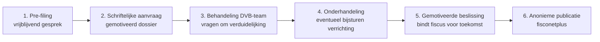

> **Leerstuk — één vraag, helemaal doorgewerkt.** Dit is het sluitstuk van PO 2.1. Na de fundering (wat belast wordt en uit welke bron), het landschap (welke overheid heft), het denkkader (welke beginselen je inroept) en het operationele denkproces (planning versus misbruik), komt hier het preventieve instrument: hoe koop je vooraf zekerheid over een twijfelachtig dossier? Voor verhaal en routekaart: [[studiemateriaal/2-1|overzicht PO 2.1]].

## Antwoord in één blik

Een voorafgaande beslissing — in de praktijk "ruling" genoemd — is een schriftelijke beslissing van de federale Dienst Voorafgaande Beslissingen (DVB) waarin de fiscus zich bindt over de fiscale gevolgen van een door de belastingplichtige voorgenomen verrichting. De beslissing geldt typisch vijf jaar, verlengbaar, zolang de feitelijke en juridische context onveranderd blijft.

Drie operationele regels moet je nooit vergeten. **Vooraf** — voor verrichtingen die op fiscaal vlak al gevolgen hebben gehad, kan geen ruling worden gegeven. **Reëel uit te voeren** — de beslissing bindt de administratie alleen als de werkelijke uitvoering overeenkomt met wat in de aanvraag staat. **Niet boven de wet** — de ruling mag geen vrijstelling of vermindering van belasting tot gevolg hebben.

Wanneer overweeg je een ruling? Bij verrichtingen met substantiële fiscale impact waarvan het resultaat onzeker is: een herstructurering (fusie, splitsing, partiële inbreng), een holding-opzet, een grensoverschrijdende structuur, octrooi-inkomsten, tax shelter — of, zoals in het vignet dat we straks doorwerken, een vastgoedoverdracht aan de eigen holding waar de algemene anti-misbruik-toets uit [[planning-en-misbruik]] twijfelachtig uitvalt. Niet voor elke planning: voor evidente, goed gedocumenteerde planning is een ruling overhead die geen toegevoegde waarde oplevert.

| Vraag | Antwoord in één regel |
|---|---|
| **Wat is een ruling?** | Schriftelijke beslissing van de DVB die vastlegt hoe de wet wordt toegepast op een voorgenomen verrichting |
| **Wie is gebonden?** | De fiscus is gebonden zolang de verrichting reëel zoals beschreven wordt uitgevoerd; de belastingplichtige NIET (hij kan afzien) |
| **Hoe lang?** | Typisch vijf jaar, verlengbaar — vroeger einde bij wetswijziging, feitelijke wijziging of onvolledige/onjuiste info |
| **Wanneer kan het niet?** | Reeds fiscale gevolgen · administratief beroep of gerechtelijke handeling lopende · invordering/vervolgingen · zonder uitwerking |
| **Wanneer is het aangewezen?** | Substantiële fiscale impact + reële onzekerheid + voorzienbaar uitvoeringspad |

We werken de procedure stap voor stap uit en concretiseren met het vignet rond Marc Van Daele, die zijn bedrijfsgebouw in Wevelgem wil verkopen aan zijn eigen holding — een dossier waar de anti-misbruik-analyse uit het vorige leerstuk twijfelachtig uitviel.

## Waarom een ruling? De ratio achter het instrument

Het Belgisch fiscaal recht is complex, evolutief en op meerdere niveaus geregeld — federaal, gewest, gemeente. Een belastingplichtige die een omvangrijke transactie plant, wil niet jaren later via een bezwaar of een rechtbank vernemen of hij de wet correct heeft toegepast. De ruling is het preventieve antwoord op die onzekerheid: vooraf weten waar je staat, in plaats van achteraf hopen dat de controle-ambtenaar dezelfde lezing aanhoudt als jij.

Drie functies maken het instrument waardevol. Ten eerste **rechtszekerheid** voor de belastingplichtige — wat de fiscus vooraf schriftelijk bevestigt, kan ze later niet meer terugnemen binnen de voorwaarden van de beslissing. Ten tweede **vroege detectie** voor de overheid — agressieve fiscale planning komt vroeger in beeld dan via een controle achteraf, en de DVB kan onmiddellijk bijsturen of weigeren. Ten derde **internationale geloofwaardigheid** — buitenlandse investeerders willen comfort dat hun structuur ook over vijf jaar nog werkt; een Belgische ruling levert dat comfort op een manier die een advies van een accountant of advocaat niet kan evenaren.

Concretiseer met het Van Daele-vignet. Marc weet uit het vorige leerstuk dat zijn vastgoedoverdracht aan de holding anti-misbruik-risico draagt: de structuur is op zichzelf legaal maar het belastingvoordeel zou tegenstrijdig kunnen zijn met de doelstellingen van de huur- en bezoldigingsbepalingen. Drie scenario's liggen voor.

1. Niets doen, hopen dat geen controle volgt — risico op naheffing plus boete, en geen rechtszekerheid voor de cashflow-planning op vijf à tien jaar.
2. Niet uitvoeren — fiscaal veilig, maar de vermogensplanning loopt vast en de operationele rationale (risico-isolering, opvolging) gaat verloren.
3. Ruling aanvragen — de DVB beoordeelt de structuur vooraf, eventueel met aanpassingen, en levert bindend comfort.

Voor een transactie van € 1,2 miljoen met meerdere fiscale lagen — privé-meerwaarde, herkwalificatie van huur, anti-misbruik op het geheel van rechtshandelingen — is optie (3) doorgaans de verstandige route. De kost van een degelijke aanvraag is een fractie van het risico op naheffing.

> **De ruling-cultuur is geen vrijbrief meer.** Sinds de internationale focus op agressieve fiscale planning (2015 LuxLeaks-onthullingen, 2017 BEPS-context) is de DVB veel strenger geworden tegenover constructies die enkel een fiscaal voordeel beogen. Geanonimiseerde rulings worden gepubliceerd op fisconetplus, en de DVB onderhandelt actief over de voorgestelde structuur. Voor de adviseur betekent dit: rulings worden niet meer "gewoon afgeleverd" — er is een echte beoordeling, en marginale planning zal afgewezen worden. Een ruling vragen is geen tactiek om iets controversieels te legitimeren; het is een instrument om legitieme planning extra te onderbouwen.

## Wanneer wel, wanneer niet?

De wet lijst expliciet op wanneer de DVB geen beslissing kan geven. Vier uitsluitingsgronden die je als adviseur paraat moet hebben.

De eerste uitsluiting betreft **situaties die op fiscaal vlak al gevolgen hebben gehad** ten name van de aanvrager, of situaties die het voorwerp uitmaken van een administratief beroep of een gerechtelijke handeling tussen de Belgische Staat en de aanvrager. Wie de transactie eerst uitvoert en dan een ruling vraagt "om zeker te zijn", is te laat — de DVB beslist niet retroactief. Wie al een bezwaar lopende heeft over dezelfde verrichting, krijgt geen ruling — die discussie hoort thuis in de bezwaarprocedure, niet in een preventief advies.

De tweede uitsluiting is meer formeel: de DVB beslist niet als het **niet aangewezen is of zonder uitwerking blijft** op grond van de aangevoerde wettelijke of reglementaire bepalingen. Zuiver hypothetische vragen vallen hieronder. De DVB verlangt een concreet, voorgenomen feitencomplex met identificeerbare partijen, bedragen en timing. Een algemene "wat-als"-vraag krijgt geen ruling.

De derde uitsluiting betreft **invordering en vervolgingen**. Wie betwist hoe de fiscus de inning organiseert, hoort dat niet langs de DVB te lopen. En een vierde, recentere uitsluiting raakt enkel grote multinationale groepen: de minimumbelasting (Pillar 2) is uit het ruling-systeem gehaald.

Naast die negatieve afbakening werkt de DVB actief op klassieke ruling-onderwerpen. Herstructureringen met een fiscaal-neutrale fusie of splitsing — hier draait alles om de kwalificatie als "door de fiscale wet vereiste fiscaal neutrale verrichting". Inbreng in natura met een gevoelige waardering. Holding-structuren met de vraag wat de fiscale gevolgen zijn van een specifieke opzet. Beroepsmatige terbeschikkingstelling van vastgoed door een bestuurder aan zijn vennootschap. Transfer pricing-prijsstellingen. Innovatieaftrek en tax shelter. Voor erfbelasting-planning in Vlaanderen bestaat een afzonderlijk Vlaams traject — daarover straks meer.

Het vignet rond Marc valt netjes binnen het toelaatbare. De verrichting is voorgenomen, niet uitgevoerd. Er loopt geen controle of bezwaar over hetzelfde onroerend goed. Het feitencomplex is concreet — gebouw geïdentificeerd, prijs vastgelegd, financieringsopzet uitgewerkt. De vraag aan de DVB is concreet te formuleren: wordt de huur die na de verkoop naar de holding vloeit niet geherkwalificeerd als bezoldiging in de personenbelasting van Marc, en wordt de structuur als geheel niet als fiscaal misbruik verworpen? Marc kan zijn niet-fiscale motieven contemporain documenteren — risico-isolering van het bedrijfsvastgoed buiten privévermogen, voorbereiding van successieplanning, professioneel vastgoedbeheer. Of de DVB die motieven voldoende vindt is haar oordeel — maar de aanvraag zelf is toelaatbaar.

> **Gewestelijke rulings lopen langs een eigen pad.** Voor Vlaamse gewestbelastingen — erfbelasting, registratiebelasting, onroerende voorheffing voor zover door VLABEL geïnd — bestaat een afzonderlijk Vlaams ruling-systeem bij de bevoegde entiteit van de Vlaamse administratie. Het werkt op vergelijkbare principes (schriftelijke aanvraag, gemotiveerde beslissing, geen vrijstelling of vermindering van belasting) maar volgt de Vlaamse Codex Fiscaliteit als materieel én procedureel kader. De federale DVB beslist niet over gewestbelastingen die door VLABEL worden geïnd. Voor een vastgoedaankoop in Vlaanderen met een registratierecht-vraag is VLABEL je gesprekspartner; voor de inkomstenbelasting blijft het de federale DVB. Bij gewest-overschrijdende dossiers loop je beide paden parallel.

## Hoe loopt de procedure?

Van eerste verkenning tot publicatie doorloop je zes stappen. Het overzicht eerst:

**Pre-filing** is vrijblijvend en kan eventueel anoniem. Een verkennend gesprek met een DVB-team waarin je voelt of het dossier kans heeft, welke argumenten cruciaal zullen worden, of de structuur misschien moet worden bijgestuurd. Geen binding — voor jou noch voor de DVB. Voor twijfeldossiers is het de manier om vroeg te ontdekken welke kant het op moet.

**De schriftelijke aanvraag** is de formele stap. De wet eist dat de aanvraag gemotiveerd is en de identiteit van de aanvrager, eventueel betrokken partijen en derden bevat, een beschrijving van de activiteiten, een volledige beschrijving van de bijzondere situatie of verrichting, en een verwijzing naar de wettelijke of reglementaire bepalingen waarop de beslissing moet slaan. Loopt er een parallel-aanvraag in een andere EU-lidstaat of een verdragsstaat? Dan moet die volledig worden meegestuurd, samen met de eventuele beslissing. Vanaf de indiening loopt de termijn.

**Behandeling door het DVB-team** — gespecialiseerd per materie. Ze beoordelen het dossier, vragen verduidelijking, leggen je soms aanvullende vragen voor. Zolang er geen beslissing is genomen, moet de aanvraag worden aangevuld met elk nieuw element dat betrekking heeft op de voorgenomen situatie of verrichting. Achterhouden van een feit dat later opduikt is geen "vergeten" — het zet de bindende werking op de helling.

**Onderhandeling** is waar het instrument vaak waarde wint. Een kleine bijstelling van de structuur — een datum vervroegen, een waardering verfijnen, een clausule toevoegen, een tussenstap schrappen — kan voldoende zijn om een gunstige beslissing mogelijk te maken die anders negatief zou uitvallen. Voor Marc zou een verfijning kunnen betekenen: een externe waardering door een vastgoedexpert in plaats van een eigen schatting, of een expliciete clausule die de huur-aanpassing aan de marktevolutie koppelt.

**De schriftelijke gemotiveerde beslissing** is de uitkomst. De wet zegt: een termijn die niet langer mag zijn dan vijf jaar, behoudens in de gevallen waarin het voorwerp van de aanvraag iets anders rechtvaardigt. De beslissing motiveert waarom de DVB tot haar conclusie komt, zodat de aanvrager weet waarop hij zich kan beroepen — en zodat eventuele rechters of latere controle-ambtenaren de redenering kunnen volgen.

**Anonieme publicatie** sluit het traject af. De beslissingen worden op anonieme wijze gepubliceerd, onder naleving van het beroepsgeheim. Recente rulings worden op fisconetplus geplaatst om de fiscale praktijk transparant te maken; de namen van partijen worden weggehaald, de inhoudelijke beoordeling blijft. De minister van Financiën bezorgt daarnaast elk jaar een verslag aan de Kamer van volksvertegenwoordigers over de toepassing van het systeem.

Investeer als adviseur tijd in het aanvraagdossier. Een onvolledige aanvraag wordt teruggestuurd of leidt tot een negatieve beslissing. Een degelijke aanvraag — helder feitenrelaas, concrete vragen, voorgestelde beoordeling, contemporaine documentatie van niet-fiscale motieven — wint meer tijd dan ze kost.

> **De accountant als mandataris in het ruling-traject.** Je bent typisch niet alleen de adviseur die het dossier opbouwt, je bent ook de mandataris die de aanvraag ondertekent en de besprekingen voert. Voor de stagiair betekent dit: leer aanvraag-documentatie schrijven (helder feitenrelaas, concrete vragen, voorgestelde beoordeling), en bouw een dossier op dat een onbekende DVB-medewerker in één lectuur kan vatten. Een goed ruling-dossier leest als een memorandum dat de zaak voor zichzelf laat spreken — zonder dat de lezer eerst telefoontjes moet plegen om de context te begrijpen.

## De bindende werking — wat de ruling waard is

De voorafgaande beslissing bindt de federale fiscus voor de toekomst, zolang de verrichting reëel wordt uitgevoerd zoals beschreven. De aanslagdienst mag niet afwijken van de ruling-uitspraak — dat is haar grootste praktijkwaarde. De belastingplichtige zelf is **niet** gebonden: hij kan afzien van de verrichting of er anders mee omgaan, zonder fiscaal gevolg van de niet-uitvoering. De ruling is een vangnet, geen verplichting.

De geldigheidsduur is typisch vijf jaar, behoudens wanneer het voorwerp van de aanvraag iets anders rechtvaardigt, en verlengbaar op gemotiveerde aanvraag. De wet voorziet vier gevallen waarin de bindende werking vroeger eindigt.

1. **De voorwaarden van de ruling zijn niet vervuld** — bijvoorbeeld als de marktconforme huur die de ruling oplegde niet wordt aangerekend.
2. **De situatie of verrichting blijkt onvolledig of onjuist omschreven**, of essentiële elementen zijn niet verwezenlijkt op de beschreven wijze — dit is waar het volledigheidsbeginsel zijn tanden toont.
3. **De wetgeving wijzigt** — een nieuw verdrag, een nieuwe EU-bepaling of een nieuwe Belgische wet die de behandelde situatie raakt, maakt de ruling-bescherming voor de toekomst voorwerp van herziening.
4. **De fiscale gevolgen worden beïnvloed door een wijziging** van de bepalingen waarop de beslissing rust.

Voor Marc maakt dit het volgende verschil. Stel dat hij een gunstige ruling krijgt op zijn vastgoedoverdracht. Twee jaar later beslist hij de holding-financiering te herstructureren — de banklening wordt vervangen door een familielening van zijn schoonbroer. Verandert dit de ruling-bescherming? Mogelijk wel: de financierings-as was deel van de beoordeling (timing, marktconformiteit, zelfstandigheid van de wederpartij). Een herstructurering die de uitvoering wezenlijk wijzigt, kan de bindende werking aantasten. Een verschuiving van enkele weken in timing is meestal geen probleem; een bedrag dat 20 % afwijkt van de aanvraag is gevoelig; een andere financieringsbron, andere partijen of een andere transactie-structuur vraagt om een nieuwe aanvraag.

Wat "wezenlijk" is, is een feitenkwestie. Vuistregel voor de adviseur: vóór elke verlengde uitvoering of materiële wijziging toetsen of alle feiten nog zoals beschreven zijn, en of de wet nog dezelfde is. Een ruling is geen eeuwig geldig zegel.

> **De ironie van anti-misbruik en ruling.** De ruling neutraliseert het anti-misbruik-risico voor de gespecifieerde verrichting — dat is haar grootste waarde voor planning-dossiers. Maar de DVB zelf zal weigeren een ruling te geven die op anti-misbruik botst. Wanneer je de ruling het meest nodig hebt — bij een twijfelachtige anti-misbruik-toets — is ze het moeilijkst te krijgen. De ruling-procedure dwingt zo de adviseur om de structuur eerlijk te beoordelen: als de DVB het niet wil dragen, is dat een sterk signaal dat het dossier zonder ruling ook problematisch is.

## Grenzen aan de ruling-bescherming

Een ruling is sterk maar niet absoluut. De wet zelf zegt dat de voorafgaande beslissing geen vrijstelling of vermindering van belasting tot gevolg mag hebben — de DVB mag niet beslissen wat de wetgever niet heeft toegestaan. Rulings die de wetgeving omzeilen kunnen later door de rechter naast zich neergelegd worden; de strengere ruling-cultuur sinds 2015 weerspiegelt precies die les.

Drie operationele grenzen blijven scherp. De **wet evolueert** — een ruling die geldig is onder de huidige wet kan door een nieuwe wet worden achterhaald. De ruling-bescherming geldt typisch tot aan de wetswijziging, eventueel met een overgangsperiode als de wetgever die voorziet. De **feiten moeten kloppen** — een "vergeten" feit dat de DVB tot een andere beslissing zou hebben gebracht, ontneemt de ruling haar bindende werking. Het volledigheidsbeginsel is geen vrijblijvende formaliteit. En de **rechter behoudt zijn beoordelingsbevoegdheid** — een ruling bindt de federale fiscus, niet de rechter. In een fiscaal geschil kan de rechter de ruling-beoordeling in theorie tegenspreken, vooral bij flagrante miskenning van de wet. In de praktijk gebeurt dat zelden, omdat de fiscus zich aan haar eigen ruling houdt — maar het juridische principe blijft.

> **Ruling als sluitstuk, niet als startpunt.** De adviseur die enkel een ruling vraagt zonder grondige interne analyse, mist het punt van het instrument. Een ruling-aanvraag is het eindpunt van een diepgaande voorbereiding: feiten verzamelen, niet-fiscale motieven documenteren, de anti-misbruik-toets uit het vorige leerstuk doorlopen, structuur eventueel bijstellen, en pas dan formeel aanvragen. De ruling formaliseert wat de adviseur al heeft geverifieerd — niet andersom.

## De rol van de accountant — synthese over PO 2.1 heen

PO 2.1 ging niet over één onderwerp. Het ging over een denkkader dat door alle taken van de accountant loopt. Vat de rol samen op vijf momenten, één per leerstuk.

In **[[belasting-en-bronnen]]** leerde je bronnen onderscheiden. Bij elke fiscale vraag eerst de wet lezen, dan pas de circulaire. Een circulaire die de wet inperkt is geen voldongen feit — er bestaat een argumentatie. Wie automatisch de circulaire toepast geeft het juridische werk uit handen voor de operationele realiteit van de controle.

In **[[wie-heft-wie-betaalt]]** leerde je actoren herkennen. Welke administratie is je gesprekspartner? Welke procedure-codex geldt? Federaal of gewest? Een verkeerde gesprekspartner aanspreken kost tijd, geld en geloofwaardigheid. Het Van Daele-pand in Aalst hoort bij VLABEL, niet bij de federale FOD Financiën — die schakel moet je in stap één maken.

In **[[beginselen-en-grenzen]]** leerde je beginselen inroepen. Legaliteit, gelijkheid, niet-retroactiviteit en in dubio contra fiscum zijn geen academische curiosa — het zijn argumenten in een bezwaar of pleidooi. Wie ze niet kent, mist verdedigingsmiddelen die de wet expliciet aanreikt.

In **[[planning-en-misbruik]]** leerde je het misbruik-risico inschatten. Vóór elke planning de drielagen-toets: simulatie, specifieke anti-misbruik-bepaling, algemene anti-misbruik-bepaling. Documenteer niet-fiscale motieven contemporain, niet achteraf bij een controle. Een goed gedocumenteerde planning houdt langer stand dan een mooi geconstrueerde.

En in dit leerstuk leer je de **ruling overwegen**. Bij substantiële onzekerheid: aanvraag overwegen. Niet voor elke transactie, wel als de risico's serieus zijn en het uitvoeringspad voorzienbaar is. De ruling is geen plichtsoefening — ze is een instrument voor dossiers waar de inzet hoog is en het juridische antwoord open.

Dezelfde adviseur doorloopt typisch in één dossier drie taken die in PO 2.1 onderscheiden werden. **Adviseren** over de structurering. **Bijstaan** bij de aangifte en de bewijsstukken. **Vertegenwoordigen** als de fiscus controleert of betwist. Leer schakelen tussen die drie posities. Het denkkader is hetzelfde — de toon en het doel verschillen per fase. In de adviesfase ben je creatief binnen de grenzen. In de aangifte-fase ben je secuur. In de geschillenfase ben je strijdvaardig.

PO 2.2 (personenbelasting), PO 2.3 (vennootschapsbelasting), PO 2.4 (btw) en PO 2.5 (procedure) bouwen op het denkkader uit PO 2.1. De stagiair die de beginselen vlot kan inzetten, de drielagen-toets kan doorlopen en weet wanneer een ruling het juiste instrument is, heeft het werkelijke gewicht van PO 2.1 mee. Geen losse definities — een werkmethode.

## Wanneer je dit snapt, ga dan naar

- [[planning-en-misbruik]] — terug naar de operationele drielagen-toets, om te zien hoe ruling en anti-misbruik-analyse op elkaar inhaken in concrete planning-dossiers
- [[beginselen-en-grenzen]] — het denkkader nog eens nalopen, vooral de interpretatie-leer komt bij ruling-discussies recurrent terug
- [[studiemateriaal/2-1/samenvatting|Samenvatting PO 2.1]] — procedure-flowchart en checklist "wanneer wel/niet ruling" voor herhaling vlak vóór het examen

## Doorklik naar concepten

Voor wie definitorisch detail wil opzoeken:

- [[voorafgaande-beslissing-dvb]]
- [[algemene-anti-misbruik-bepaling]] · [[anti-misbruik]]
- [[fiscale-actoren]]

---

## Wettelijk fundament

- Wettelijk kader voorafgaande beslissingen — instelling van het systeem en definitie: Wet 24 december 2002 art. 20-26 (programmawet). Art. 21 regelt de inhoud van de aanvraag, art. 22 de uitsluitingen, art. 23 de bindende werking en geldigheidsduur, art. 24 de anonieme publicatie, art. 25 het jaarverslag aan de Kamer.
- Uitvoeringsbesluit ruling-procedure: K.B. 30 januari 2003 tot uitvoering van artikel 26 van de wet van 24 december 2002. Regelt de oprichting van de dienst en haar werkingsmodaliteiten.
- Uitsluitingen — reeds fiscale gevolgen, administratief beroep of gerechtelijke handeling, niet aangewezen of zonder uitwerking, invordering en vervolgingen, Pillar 2-minimumbelasting: Wet 24 december 2002 art. 22.
- Bindende werking en uitzonderingen (vijf jaar, behoudens niet-vervulde voorwaarden, onvolledige of onjuiste omschrijving, wetswijziging): Wet 24 december 2002 art. 23.
- Vlaamse ruling-procedure voor gewestbelastingen: Vlaamse Codex Fiscaliteit art. 3.22.0.0.1 (definitie en aanvraag) en art. 3.22.0.0.2 (bindend advies bij gemengde bevoegdheid).
- Algemene anti-misbruik-bepaling — relatie met ruling: WIB92 art. 344 §1. Een ruling neutraliseert het anti-misbruik-risico voor de gespecifieerde verrichting; de DVB zal echter weigeren een ruling te geven die op anti-misbruik botst.

---

*Leerstuk PO 2.1 — sluitstuk. Het leerpad PO 2.1 is volledig — ga naar [[studiemateriaal/2-1/samenvatting|samenvatting]] voor herhaling of [[studiemateriaal/2-1/oefening|oefening]] voor doorwerk.*
