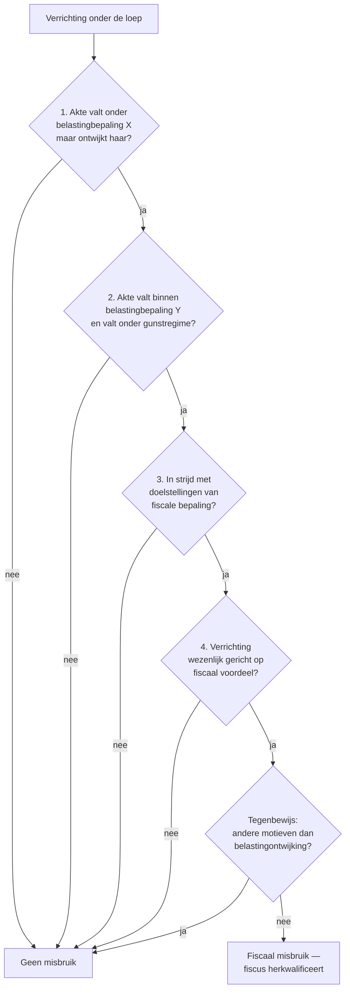

> **Samenvatting — kapstok voor herhaling.** Enkele A4 die het hele programmaonderdeel samenvatten in vaste blokken: de acht beginselen, bronnen-hiërarchie, het drie-lagen-denkproces minst-belaste-weg / simulatie / misbruik, en de voorafgaande beslissing. Bedoeld om in één avond door te lopen — niet om voor het eerst te leren. Voor uitleg + doorwerking: de vijf leerstukken van dit leerpad. Voor verhaal en routekaart: [[studiemateriaal/2-1|overzicht PO 2.1]].

---

## 1. Take-away (wat je écht moet weten)

- **Wat is een belasting?** Eenzijdig opgelegd · zonder rechtstreekse tegenprestatie · voor algemeen belang. Verschilt van retributie (geld voor concrete dienst) en sociale bijdrage (recht op uitkering).
- **Bronnen in rangorde**: Grondwet → internationale verdragen + EU-recht → wet (federaal of decreet) → KB/MB → circulaire. **De circulaire bindt enkel de fiscus** (via vertrouwensbeginsel) — niet de rechter, niet de belastingplichtige.
- **Vier heffende niveaus**: federale staat, gemeenschappen/gewesten, provincies, gemeenten. Elk niveau heeft een eigen grondwettelijke basis (Grondwet art. 170 §1-§4).
- **Acht beginselen**: vier grondwettelijk (legaliteit · annaliteit · gelijkheid · niet-retroactiviteit) + vier algemeen (territorialiteit · non bis in idem · realiteit · moraliteits-neutraliteit). Strikte interpretatie is het *gevolg* van legaliteit.
- **Drie-lagen-test in elk dossier**: (1) minst belaste weg → toelaatbaar; (2) simulatie → fiscus mag tegenakte aanvoeren; (3) fiscaal misbruik → akte blijft civielrechtelijk geldig maar fiscus mag haar niet tegenwerpen.
- **Voorafgaande beslissing (DVB-ruling)**: bindt fiscus voor 5 jaar — mits feiten en wet ongewijzigd. Vooraf aanvragen (vóór de verrichting fiscale gevolgen heeft). Weigert bij lopende controle/beroep, bij invordering, en bij Pillar 2.

---

## 2. De acht beginselen — overzicht

Vier grondwettelijke pijlers + vier algemene rechtsbeginselen. Wettekst-refs in "Wettelijk fundament" van [[beginselen-en-grenzen]].

| Beginsel | Bron | Wat zegt het? | Examen-haakje |
|---|---|---|---|
| **Legaliteit** | Grondwet art. 170 | Geen belasting zonder wet (of decreet); strikte interpretatie + verbod analogie | Argument bij delegatie aan KB of bij circulaire die wet uitbreidt |
| **Annaliteit** | Grondwet art. 171 | Jaarlijkse stemming bij begroting; bij niet-vernieuwing vervalt heffing na één jaar | Toets op overgangsrecht bij wisseling regering |
| **Gelijkheid (fiscaal)** | Grondwet art. 172 | Geen voorrechten; vrijstelling enkel bij wet — gekoppeld aan art. 10/11 Grondwet | Bezwaargrond bij ongerechtvaardigd onderscheid |
| **Niet-retroactiviteit** | Wet zelf + algemeen rechtsbeginsel | Belasting kan in beginsel niet ingaan op feiten van vóór publicatie | Toets op nieuwe wet die ingaat op afgesloten boekjaar |
| **Territorialiteit** | Algemeen rechtsbeginsel + grenzen aan extraterritoriaal heffen | Belastingjurisdictie volgt verbondenheid met grondgebied (woonst, bron, plaats) | Verschil tussen rijksinwoner (wereldinkomen) en niet-inwoner (Belgische bron) |
| **Non bis in idem** | EVRM Protocol 7 art. 4 + intern fiscaal | Niet tweemaal gestraft voor hetzelfde feit (strafrechtelijke component) | Engel-criteria bepalen of fiscale boete "straf" is |
| **Realiteit** | Algemeen rechtsbeginsel | Belastingwet volgt economische werkelijkheid — opmaat naar simulatie + anti-misbruik | Brepols-doctrine: civielrechtelijke kwalificatie telt, tenzij geveinsd |
| **Moraliteits-neutraliteit** | Algemeen rechtsbeginsel | Belastbaar feit is onafhankelijk van legaal/illegaal karakter; sommige uitgaven blijven wel niet-aftrekbaar | Steekpenningen + boetes als illustratie (niet-aftrekbaar) |

---

## 3. Drie-lagen-test — planning, simulatie of misbruik?

Het denkproces dat je in elk dossier loopt. Loop deze drie lagen door — pas wanneer een laag "pakt" kan de fiscus optreden.

| Laag | Wat doet de belastingplichtige? | Wat doet de fiscus? | Wettelijk anker |
|---|---|---|---|
| **1. Minst belaste weg** | Kiest, binnen de wet, de optie met laagste belasting — alle gevolgen aanvaardend | Niets — keuze is toelaatbaar (Brepols, Cass. 6 juni 1961) | Algemeen rechtsbeginsel — geen anti-bepaling |
| **2. Simulatie** | Stelt iets voor *anders* dan wat partijen werkelijk willen (tegenakte naast openbare akte) | Mag de civielrechtelijke werkelijkheid (tegenakte) aanvoeren — herkwalificeert | Au Vieux Saint-Martin, Cass. 29 januari 1988 + algemeen leerstuk |
| **3. Fiscaal misbruik** | Verrichting is civielrechtelijk geldig en niet geveinsd, maar in wezen gericht op fiscaal voordeel in strijd met doelstelling wet | Negeert de gekozen weg fiscaal — herstel op de "normale" weg. Tegenbewijs: andere niet-fiscale motieven | Algemene anti-misbruikregel inkomstenbelastingen + btw + parallel in registratie- en gewestelijke fiscaliteit |

> De drie lagen worden cumulatief getoetst — eerst kijken of simulatie speelt, pas dán naar de anti-misbruikregel grijpen. Bewijslast eerste twee elementen ligt bij fiscus; tegenbewijs niet-fiscale motieven bij belastingplichtige.

---

## 4. Beslisboom — is dit fiscaal misbruik?

Vier voorwaarden cumulatief. Pas wanneer alle vier zijn voldaan, slaat de algemene anti-misbruikregel toe. Eén breuk volstaat om uit het misbruik-vakje te springen.

---

## 5. Voorafgaande beslissing — kompas

De DVB-ruling is het instrument om fiscale onzekerheid vóór de verrichting weg te nemen. Niet voor elke vraag inzetbaar.

### Wanneer wel, wanneer niet?

| Wel mogelijk | Niet mogelijk |
|---|---|
| Geplande verrichting (nog geen fiscale gevolgen gehad) | Verrichting heeft reeds fiscale gevolgen of zit in administratief beroep / gerechtelijke procedure |
| Concrete feiten + concrete wetstoepassing | Vraag enkel naar interpretatie zonder concreet dossier |
| Belasting binnen DVB-bevoegdheid (PB, VenB, BTW, ...) | Invorderingsfase of vervolgingen |
| — | Pillar 2 (sinds 2024) |

> Uitsluitingsgronden cumulatief: één volstaat om aanvraag te weigeren.

### Bindende werking — hoofdregel + uitzonderingen

| Hoofdregel | Geldt niet als... |
|---|---|
| Beslissing bindt fiscus voor 5 jaar zolang de aanvrager de werkelijke uitvoering respecteert | Voorwaarden waarin beslissing voorziet niet of niet meer zijn vervuld |
| — | Verrichting niet conform de beschrijving in aanvraag is uitgevoerd |
| — | Essentiële elementen van verrichting niet gerealiseerd op de wijze die in aanvraag was voorgesteld |
| — | Latere bepalingen van Belgisch recht, EU-recht of internationaal verdrag de toestand wijzigen |

---

## 6. Klassieke valkuilen

| Valkuil | Wat klopt er niet | Wat klopt wél |
|---|---|---|
| Circulaire = wet | Behandelt circulaire als bindende rechtsbron | Circulaire is interne dienstinstructie — bindt enkel fiscus (vertrouwensbeginsel), niet de rechter, niet de belastingplichtige |
| Minst belaste weg = misbruik | Elke fiscaal gemotiveerde keuze automatisch gelijkstellen aan ontwijking | Keuze van minst belaste weg is toelaatbaar (Brepols). Pas bij simulatie of bij voldoen aan vier-voorwaardentest van de algemene anti-misbruikregel ligt de grens |
| Simulatie en misbruik gelijkstellen | De twee categorieën door elkaar gebruiken | Bij simulatie is de akte niet wat ze voorstelt (tegenakte). Bij misbruik is de akte civielrechtelijk wél echt, maar fiscaal niet tegenwerpelijk wegens strijd met doelstelling wet |
| Vier voorwaarden niet cumulatief lezen | Eén voorwaarde van de anti-misbruikregel volstaat voor misbruik | De vier voorwaarden + tegenbewijs zijn cumulatief — fiscus moet alle elementen aantonen vooraleer misbruik vaststaat |
| DVB-ruling kan álle vragen beantwoorden | Ruling aanvragen voor verrichtingen die reeds gevolgen hebben of in geschil zijn | Ruling is uitsluitend vooraf inzetbaar. Reeds-fiscale-gevolgen + lopende controle/beroep + invordering + Pillar 2 = weigering |
| Strikte interpretatie ≠ in dubio contra fiscum | De twee regels gelijkstellen | Strikte interpretatie geldt voor élke fiscale wet (gevolg legaliteit). In dubio contra fiscum geldt enkel bij écht onduidelijke tekst — na grammaticale + teleologische + systematische lezing |
| Lokale belasting = zelfde regime als federale | Gemeentebelasting onder federale bevoegdheid plaatsen | Gemeenten hebben fiscale autonomie (Grondwet art. 170 §4 + art. 41/162), met eigen procedure. Federale wet geldt enkel waar uitdrukkelijk verwezen |

---

## 7. Verdieping

### Leerstukken — voor pedagogische opfris

Werkt iets niet meer scherp? Klik door naar het leerstuk dat het uitwerkt:

- [[belasting-en-bronnen]] — definitie belasting · functies · bronnen-hiërarchie · indelings-assen
- [[wie-heft-wie-betaalt]] — vier heffende niveaus · gewestelijke + lokale autonomie · onderscheid schuldenaar/belastingplichtige/drager
- [[beginselen-en-grenzen]] — acht beginselen volledig uitgewerkt · interpretatie-leer · in dubio contra fiscum
- [[planning-en-misbruik]] — drie-lagen-test · simulatie-leer · vier-voorwaardentest van de algemene anti-misbruikregel
- [[rechtszekerheid-bouwen]] — voorafgaande beslissing — procedure, weigeringsgronden, bindende werking

### Concept-fiches — voor definitorisch detail

Voor wie een wettekst-pointer of nauwkeurige definitie zoekt:

**Kaders + bronnen** — [[belasting-definitie-en-functies]] · [[fiscaal-recht]] · [[normbronnen]] · [[indeling-belastingen]]

**Actoren + autonomie** — [[fiscale-actoren]] · [[gewestelijke-fiscale-autonomie]] · [[lokale-fiscale-autonomie]] · [[lokale-en-regionale-belastingen]] · [[toepassingsgebied-belasting]]

**Beginselen + interpretatie** — [[fiscale-beginselen]] · [[interpretatie-fiscale-wet]]

**Planning + misbruik** — [[simulatie-leer]] · [[algemene-anti-misbruik-bepaling]] · [[anti-misbruik]] · [[verboden-constructies]]

**Rechtszekerheid** — [[voorafgaande-beslissing-dvb]]

---

*Samenvatting PO 2.1 — geheugen-kapstok voor herhaling. Gebaseerd op de vijf leerstukken van dit leerpad; wettelijke claims daar verankerd via MCP-verificatie.*
