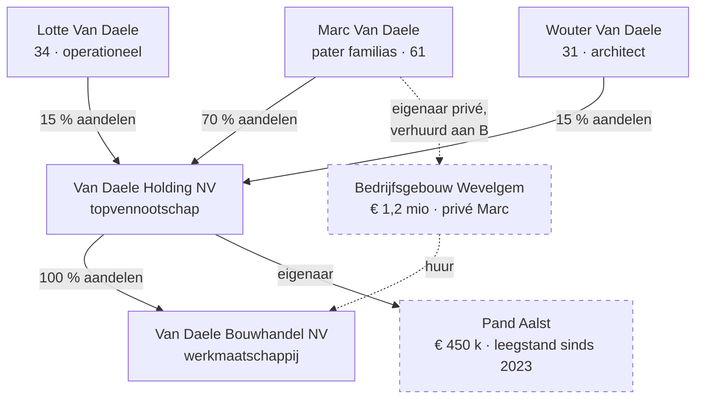

> **Leerstuk — één vraag, helemaal doorgewerkt.** Voor je begint: lees eerst [[belasting-en-bronnen]] — daar zijn de drie indelings-assen ingevoerd. Dit leerstuk werkt vooral de federaal/gewest/lokaal-as uit en koppelt ze aan de actoren die je in een dossier tegenkomt. Voor verhaal en routekaart: [[studiemateriaal/2-1|overzicht PO 2.1]].

## Antwoord in één blik

België is fiscaal **polycentrisch**: drie niveaus heffen tegelijk. Federaal int de personenbelasting, vennootschapsbelasting, btw en accijnzen. De gewesten heffen registratie- en successierechten, onroerende voorheffing, verkeersbelasting en eigen heffingen zoals de Vlaamse leegstandsheffing. Gemeenten heffen aanvullende belasting op de personenbelasting, opcentiemen op de onroerende voorheffing en eigen reglement-belastingen. Elk niveau heeft een eigen grondwettelijke basis: de financiën-bepalingen van de Grondwet behandelen die vier niveaus apart. Bij elke fiscale vraag stel je dus dezelfde drie sub-vragen: welk niveau, welke administratie, welke procedure-codex?

Daarnaast zijn er twee personen-vragen die je nooit door elkaar mag halen. **Wie wordt aangeslagen?** (de belastingplichtige — wettelijk aangewezen). **Wie draagt de last in zijn portemonnee?** (de belastingdrager — economisch). Bij directe belastingen vallen die twee meestal samen. Bij indirecte belastingen — denk btw — vallen ze uiteen: de handelaar betaalt aan de fiscus, de eindklant draagt.

Wie zit er aan tafel? Drie soorten gesprekspartners: de **administraties** (FOD Financiën met haar verschillende takken, VLABEL voor Vlaamse gewestbelastingen, gemeentediensten), de **belastingplichtige** zelf (natuurlijke persoon, vennootschap, vereniging zonder winstoogmerk), en in geschil de **rechtbank**. De accountant staat ernaast — als adviseur, compliance-bijstand of vertegenwoordiger.

We werken die structuur uit aan de hand van de Van Daele-holding: vader Marc (61) met holding-NV en werkmaatschappij in bouwmaterialen, twee kinderen-aandeelhouders, één privé-bedrijfsgebouw in Wevelgem en één leegstaand pand in Aalst dat sinds 2023 op een aanmaning van VLABEL wacht.

## Drie heffende niveaus — federaal, gewest, gemeente

Begin bij de Grondwet als ordenende as. De fundamentele financiën-bepaling is opzettelijk in vier paragrafen verdeeld — één per heffend niveau. Lees ze achter elkaar en het Belgisch fiscaal landschap klikt vast.

**Federaal niveau (§1)**: een federale belasting kan alleen worden ingevoerd door een wet, aangenomen door het federaal parlement. Op dit niveau leven de grote algemene wetboeken: het Wetboek van de inkomstenbelastingen 1992 (personenbelasting en vennootschapsbelasting), het Wetboek van de belasting over de toegevoegde waarde, en de accijns- en douanewetgeving. De federale fiscus regelt ook het kader en de inning van veel afgeleide bevoegdheden — daarover later meer.

**Gewest en gemeenschap (§2)**: een gewestelijke belasting vereist een decreet (Vlaanderen, Wallonië, Duitstalige Gemeenschap) of een ordonnantie (Brussel-Hoofdstad). Op dit niveau leven de Vlaamse Codex Fiscaliteit, de Brusselse Codex Fiscale Procedure en het Waals decreet van 6 mei 1999.

**Provincie (§3)**: een provinciale belasting vereist een beslissing van de provincieraad. Sinds 2018 is de provinciale fiscale ruimte in Vlaanderen sterk afgeslankt — we komen daarop terug onder lokale autonomie.

**Gemeente, agglomeratie of federatie van gemeenten (§4)**: een gemeentebelasting wordt aangenomen door een beslissing van de gemeenteraad. Niet door het college, niet door de burgemeester — door de raad. Dat is geen formaliteit: een belastingreglement aangenomen door het verkeerde orgaan is nietig.

Op gewestelijk niveau is er nog een belangrijke nuance. Gewesten kennen drie soorten ontvangsten naast elkaar. **Eigen gewestbelastingen** — het gewest bepaalt grondslag, tarief én vrijstellingen volledig zelf. De Bijzondere Financieringswet van 16 januari 1989 lijst ze op: registratie- en successierechten, hypotheekrechten, onroerende voorheffing, verkeersbelasting, belasting op inverkeerstelling, eurovignet, belasting op spelen en weddenschappen, en enkele kleinere. **Aanvullende gewestelijke personenbelasting** — het gewest moduleert via opcentiemen of kortingen op de gewestelijke schijf van de federaal berekende basisbelasting. De federale fiscus berekent en int; het gewest bepaalt zijn eigen verfijning. **Gedeelde belastingen** — federaal heft, een deel van de opbrengst vloeit via dotatie naar het gewest. Bij die laatste categorie heeft het gewest geen beleidshefboom, alleen een ontvangst.

Lokaal kan een gemeente twee dingen doen. (1) Een **aanvullende belasting op de personenbelasting** — een percentage op de federaal berekende basisbelasting. Tarieven variëren typisch tussen zo'n 6 % en 9 % naargelang de gemeente. Een dossier dat verhuist van een gemeente met 6 % naar één met 9 % betekent een directe stijging van de personenbelasting, zonder dat één federaal tarief is gewijzigd. (2) **Eigen gemeentebelastingen** via belastingreglement — terrasvergoeding, reclameborden, huisvuilophaling als belasting, belasting op tweede verblijven, leegstandsbelasting op woningen. Provincies kunnen sinds 2018 geen aanvullende belasting meer heffen op de personenbelasting, maar wel eigen provinciebelastingen invoeren binnen hun bevoegdheidssfeer.

Op één holdingstructuur kan je vlot drie niveaus tegelijk identificeren. Op Van Daele werkt dat zo: federaal (vennootschapsbelasting op Van Daele Holding NV en personenbelasting op Marc), gewest (onroerende voorheffing en leegstandsheffing op het pand Aalst), gemeente (aanvullende gemeentebelasting op Marc's personenbelasting, eventueel een gemeentebelasting op kantooroppervlakte). Eén dossier, drie deuren.

| Niveau | Wettelijke basis | Wettelijk instrument | Voorbeelden | Beleidsmaker |
|---|---|---|---|---|
| **Federaal** | Grondwet art. 170 §1 | Wet (federaal parlement) | Personenbelasting (basis), vennootschapsbelasting, btw, accijnzen, douane | Federale regering + Kamer |
| **Gewest / gemeenschap** | Grondwet art. 170 §2 + Bijzondere Financieringswet 16-01-1989 | Decreet (Vlaanderen, Wallonië, Duitstalige Gemeenschap) of ordonnantie (Brussel) | Registratie- en successierechten, onroerende voorheffing, verkeersbelasting, belasting op inverkeerstelling, leegstandsheffing, aanvullende gewestelijke personenbelasting | Vlaamse / Waalse / Brusselse / Duitstalige regering + parlement |
| **Provincie** | Grondwet art. 170 §3 + art. 41 en 162 | Provincieraadsbeslissing | Provinciebelasting op vergunningplichtige inrichtingen, eigen heffingen | Provincieraad |
| **Gemeente / agglomeratie** | Grondwet art. 170 §4 + art. 41 en 162 | Belastingreglement van gemeenteraad | Aanvullende gemeentebelasting op de personenbelasting, opcentiemen op onroerende voorheffing, eigen belastingen (terras, reclame, huisvuil) | Gemeenteraad + college |

## Gewestelijke autonomie — wat het Vlaamse Gewest concreet kan

Wat de drie-niveau-tabel nog niet voelbaar maakt: gewestelijke autonomie is geen afgeleide bevoegdheid. Het is een grondwettelijk verankerde, zelfstandige fiscale bevoegdheid. Tijd om dat met een vignet te concretiseren.

Eind 2025 valt bij de Van Daele-holding een eerste aanmaning van VLABEL in de bus: het pand in Aalst staat op de inventaris van leegstaande bedrijfsruimten en de leegstandsheffing is in voorbereiding. Marc reageert verbaasd: "Sinds wanneer kan een Vlaamse administratie een belasting heffen op iets wat federaal niet bestaat?" Het korte antwoord: heel goed, omdat de Grondwet zelf het gewest die bevoegdheid geeft. De gewestelijke fiscaliteit is niet "federale fiscaliteit met een Vlaamse smaak" — ze is een eigen circuit.

Dat heeft een concreet gevolg. **Hetzelfde belastbaar feit kan in elk gewest anders uitvallen.** Een nalatenschap die in Brussel openvalt wordt belast volgens de Brusselse erfbelasting; dezelfde nalatenschap in Vlaanderen volgens de Vlaamse Codex Fiscaliteit, met andere tarieven, andere vrijstellingen en andere verminderingsregimes. Een woning kopen in Antwerpen is voor het registratierecht een wezenlijk andere zaak dan diezelfde woning kopen in Brussel of Luik — klein-beschrijf, abattementen en meeneembaarheid zijn drie gewestelijk gemoduleerde regimes. De richtcijfers zelf staan in het Cijferzakboekje; je hoeft ze niet uit het hoofd te kennen, maar je moet wéten dat ze gewestelijk verschillen.

Welk gewest is dan bevoegd? Het antwoord volgt een lokalisatie-criterium dat per belasting verschilt. Voor de onroerende voorheffing en de registratierechten: de ligging van het onroerend goed. Voor de successierechten: de laatste fiscale woonplaats van de erflater — en bij wisseling, de woonplaats waar hij het langst woonde in de laatste vijf jaar. Voor de verkeersbelasting en de belasting op inverkeerstelling: de woonplaats van wie het voertuig inschrijft. Voor de aanvullende gewestelijke personenbelasting: de fiscale woonplaats van de belastingplichtige op 1 januari van het aanslagjaar.

Toegepast op de Van Daele-case: het pand Aalst ligt in het Vlaamse Gewest. Dus de Vlaamse Codex Fiscaliteit is van toepassing — niet alleen voor de onroerende voorheffing, maar ook voor de leegstandsheffing bedrijfsruimten. De heffing wordt verschuldigd vanaf het kalenderjaar volgend op de derde opeenvolgende registratie van het pand in de inventaris. VLABEL is de bevoegde administratie. Marc heeft eventueel verweer onder de opschortingsregeling wegens bedrijfseconomische omstandigheden — maar geen federale fiscus om naar terug te vallen.

> **Het gewest blijft grondwettelijk gebonden.** Autonomie is geen vrijbrief. Het legaliteitsbeginsel eist dat de Vlaamse decreetgever zelf de grondslag, het tarief en de vrijstellingen vastlegt — geen blanco delegatie aan de uitvoerende macht. Het gelijkheidsbeginsel is door het Grondwettelijk Hof uitdrukkelijk toepasselijk verklaard op decreten. Een Vlaamse heffing die ongelijk uitvalt voor vergelijkbare situaties is in principe aanvechtbaar voor het Grondwettelijk Hof — een hoge drempel, maar het verweer bestaat. Operationeel zelden de eerste lijn: meestal start de discussie met een opschortingsverzoek of een betwisting van de inventarisatie zelf.

## Lokale autonomie — wat de gemeente kan

Het lokale niveau wordt vaak vergeten in de fiscale analyse — terwijl het op een KMO-dossier substantieel kan wegen. Aanvullende gemeentebelasting op de personenbelasting, opcentiemen op de onroerende voorheffing, lokale reglementaire heffingen: drie sporen die optellen tot een serieuze gemeentelijke factuur.

Werk twee mechanismen uit. **Aanvullende belasting op de personenbelasting** — de gemeente mag een percentage heffen bovenop de federaal berekende basisbelasting. De federale fiscus int, voor rekening van de gemeente. Dat verklaart waarom een verhuizing van Wevelgem naar een buurgemeente met een hoger tarief een directe personenbelasting-stijging meebrengt, zonder dat het federaal tarief of de federale grondslag wijzigt. Het mechanisme zit verstopt achter één aanslagbiljet, maar de impact is reëel. **Eigen gemeentebelastingen** worden ingevoerd via belastingreglement van de gemeenteraad: terrasvergoeding, reclameborden, huisvuilophaling-als-belasting, belasting op tweede verblijven, leegstandsbelasting op woningen (bovenop een eventuele gewestelijke leegstandsheffing voor bedrijfsruimten).

Een klassieke valkuil: een collegebeslissing volstaat **niet** om een belasting in te voeren. Het is altijd de gemeenteraad die het reglement aanneemt — anders is de heffing nietig. Dat hangt direct samen met het grondwettelijk legaliteitsbeginsel op lokaal niveau: alleen de raad mag de last invoeren. Een terrasvergoeding kan trouwens ofwel een belasting zijn (verplichte bijdrage zonder directe individuele tegenprestatie — vereist gemeenteraadsreglement) ofwel een retributie (tegenprestatie voor het gebruik van openbaar domein — andere juridische grondslag, andere procedure). Het onderscheid is geen woordspel: de Grondwet behoudt de belasting-figuur uitdrukkelijk voor de Staat, de gemeenschap, het gewest, de agglomeratie, de federatie van gemeenten of de gemeente — buiten enkele uitzonderingen kan van burgers geen retributie worden gevorderd dan alleen als belasting.

> **Provincies sinds 2018.** Door het Vlaams decreet van 18 mei 2018 ("afslanking provincies") kunnen Vlaamse provincies geen aanvullende belasting meer heffen op de personenbelasting. Eigen provinciebelastingen blijven mogelijk binnen hun bevoegdheidssfeer. Waalse en Brusselse provincies kennen een eigen regeling — de praktijk weegt er meer dan in Vlaanderen.

## Wie betaalt? Juridisch versus economisch

In elk btw- en in elk voorheffings-dossier duikt hetzelfde onderscheid op. De wet wijst altijd één persoon aan als **belastingplichtige** — wie juridisch moet aangeven en betalen. Maar wie de last in zijn portemonnee voelt, is een tweede vraag. Voor de accountant is dat onderscheid niet academisch: het bepaalt wie je vertegenwoordigt, wie de fiscus aanspreekt, en wie de discussie met de administratie mag voeren.

Drie scenario's helpen het onderscheid scherp te zetten.

**Directe belastingen — meestal samenvallend.** De personenbelasting op Marc: Marc is belastingplichtige (juridisch aangeslagen) én belastingdrager (economisch belast). De vennootschapsbelasting op Van Daele Holding NV: de vennootschap betaalt en draagt. Er is één naam, en die naam zit aan beide kanten van de transactie.

**Indirecte belastingen — uiteenvallend.** Btw op een verkoop door Van Daele Bouwhandel: de bouwhandel is btw-belastingplichtige (int de btw bij de klant, stort ze door aan de schatkist). Maar de klant is de belastingdrager — zijn portemonnee wordt lichter. De bouwhandel is wettelijk schuldenaar en functioneert als incassant; de last loopt economisch door naar de eindklant.

**Voorheffingen — drie partijen tegelijk.** Lotte ontvangt een bestuurdersbezoldiging van Van Daele Bouwhandel. De werkgever houdt bedrijfsvoorheffing in en stort ze door aan de fiscus — de werkgever is wettelijke schuldenaar tegenover de schatkist. Lotte is belastingplichtige op haar inkomen: zij geeft het aan in haar personenbelasting en krijgt de eindafrekening. De voorheffing wordt daar verrekend. Drie verschillende personen vervullen drie verschillende rollen in één belastingstroom.

Daar bovenop kunnen **hoofdelijke medeschuldenaars** een vierde laag toevoegen. In sommige situaties stelt de wet meerdere personen aansprakelijk voor dezelfde schuld — een zaakvoerder of bestuurder kan onder strikte voorwaarden hoofdelijk worden aangesproken voor bedrijfsvoorheffing of btw die de vennootschap niet doorstort. Dat verandert "wie betaalt" opnieuw fundamenteel. Niet relevant voor de basisindeling — wel essentieel zodra je in een aansprakelijkheidsdossier zit.

| Belasting | Wettelijke schuldenaar (betaalt juridisch) | Belastingplichtige (wordt aangeslagen) | Belastingdrager (draagt economisch) |
|---|---|---|---|
| Personenbelasting op Marc | Marc | Marc | Marc |
| Vennootschapsbelasting op Van Daele Holding NV | Holding NV | Holding NV | Holding NV (vermindert het uitkeerbaar resultaat) |
| Btw bij verkoop bouwmaterialen | Bouwhandel NV (stort door) | Bouwhandel NV (statuut btw-belastingplichtige) | Eindklant (op de factuur) |
| Bedrijfsvoorheffing op bestuurdersbezoldiging Lotte | Bouwhandel NV (werkgever) | Lotte (in haar personenbelasting) | Lotte (de voorheffing komt op haar eindafrekening) |
| Onroerende voorheffing pand Aalst | Holding NV (eigenaar) | Holding NV | Holding NV |

## Met wie zit de accountant aan tafel?

Wie bel je, naar wie schrijf je, en voor welke administratie verschijn je in een geschil? Het antwoord verschilt per belasting en per gewest. Voor de stagiair is dit de minst spectaculaire kennis, maar in de praktijk de meest gebruikte.

**Federale administraties.** De FOD Financiën bundelt vier algemene administraties die voor de accountant relevant zijn. De Algemene Administratie van de Fiscaliteit (AAFisc) beheert en controleert personenbelasting, vennootschapsbelasting, btw en belasting van niet-inwoners. De Algemene Administratie van de Bijzondere Belastinginspectie (AABBI) doet onderzoeken bij ernstige inbreuken en grote of complexe dossiers — een AABBI-brief krijgen is geen alledaagse gebeurtenis. De Algemene Administratie van de Inning en de Invordering komt in beeld bij niet-betaling. De Algemene Administratie van de Patrimoniumdocumentatie beheert kadaster en hypotheek, en het federaal beheer van registratierechten waar dat nog niet door VLABEL is overgenomen.

**Gewestelijke administraties.** VLABEL (de Vlaamse Belastingdienst) heeft sinds 2015 de Vlaamse erfbelasting (in de plaats van de federale successierechten in Vlaanderen) en de Vlaamse registratiebelasting voor de meeste verrichtingen overgenomen, en in opbouwende fasen onroerende voorheffing en verkeersbelasting. Brussel Fiscaliteit en Service Public de Wallonie — Fiscalité doen vergelijkbaar werk voor hun gewest, met een eigen tempo van inning-overname. Het detail "wie int al, wie int nog niet" is gewest- en jaar-afhankelijk en hoort tot de operationele kennis die je per dossier checkt.

**Lokale administraties.** Gemeentediensten (vaak via een financiële dienst gemeente) en provinciebesturen voor hun eigen belastingen. Sommige gemeenten besteden de inning van bepaalde belastingen uit aan gespecialiseerde firma's — de procedure verandert dan in detail, niet in juridische aard.

Concreet voor de Van Daele-groep:

- Personenbelasting van Marc — federaal, AAFisc.
- Vennootschapsbelasting van de twee vennootschappen — federaal, AAFisc.
- Btw van de bouwhandel — federaal, AAFisc btw-team.
- Erfbelasting bij overlijden van Marc — VLABEL (woonplaats Vlaanderen).
- Registratierecht bij overdracht van een bedrijfsgebouw — VLABEL (ligging Vlaanderen).
- Onroerende voorheffing pand Aalst — VLABEL.
- Leegstandsheffing pand Aalst — VLABEL.
- Aanvullende gemeentebelasting op de personenbelasting van Marc — federaal int voor rekening van de gemeente.

Eén familie, vijf administraties.

> **De rol van de accountant: drie posities.** Vaak in één dossier door elkaar. (1) **Adviseur** — proactief, vóór de verrichting. Welke route is fiscaal helder, welke roept vragen op? (2) **Compliance-bijstand** — bij aangifte, bewijsstukken, termijnen. Operationeel werk dat de cliënt geen omissie kost. (3) **Vertegenwoordiger** — als mandataris die de belastingplichtige bijstaat of vertegenwoordigt in de dialoog met de administratie. Welke positie je inneemt bepaalt welke argumenten je in stelling brengt en welke documenten je nodig hebt. De drie posities sluiten elkaar niet uit, maar lopen wel niet vanzelf in elkaar over — bewust schakelen tussen rollen scheelt veel verwarring met de cliënt.

## Wanneer je dit snapt, ga dan naar

- [[beginselen-en-grenzen]] — Welke grondwettelijke en algemene beginselen begrenzen alle heffende overheden — federaal, gewest én gemeente — en hoe lees je een fiscale wet?
- [[planning-en-misbruik]] — Hoe ver mag een belastingplichtige gaan om de meest gunstige weg te kiezen — en wanneer slaat de fiscus terug met simulatie of fiscaal misbruik?
- [[studiemateriaal/2-1/samenvatting|Samenvatting PO 2.1]] — Driehoek federaal/gewest/gemeente + tabel "wie betaalt juridisch versus economisch" voor herhaling vlak vóór het examen.

## Doorklik naar concepten

Voor wie definitorisch detail wil opzoeken:

- [[fiscale-actoren]] · [[gewestelijke-fiscale-autonomie]]
- [[lokale-fiscale-autonomie]] · [[lokale-en-regionale-belastingen]]
- [[toepassingsgebied-belasting]]

---

## Wettelijk fundament

- Heffende bevoegdheid — vier niveaus: Grondwet art. 170 §§1-4. Federaal (§1), gewest/gemeenschap (§2), provincie (§3), agglomeratie/federatie/gemeente (§4). Elk niveau vereist een eigen wettelijk instrument.
- Belasting-monopolie tegenover retributie: Grondwet art. 173. Buiten enkele uitzonderingen kan van burgers geen retributie worden gevorderd dan alleen als belasting ten behoeve van Staat, gemeenschap, gewest, agglomeratie, federatie van gemeenten of gemeente.
- Lokale fiscale autonomie — verankering: Grondwet art. 41 en 162 (gemeentelijke en provinciale autonomie).
- Bijzondere Financieringswet — gewestelijke fiscale autonomie: Bijzondere wet 16 januari 1989 art. 3 (eigen gewestbelastingen), art. 5 (lokalisatie + overname inning), art. 5/1 e.v. (aanvullende gewestelijke personenbelasting). Lijst eigen gewestbelastingen: registratie- en successierechten, hypotheekrechten, onroerende voorheffing, verkeersbelasting, belasting op inverkeerstelling, eurovignet, spelen en weddenschappen, automatische ontspanningstoestellen, openingsbelasting slijterijen.
- Aanvullende gemeentebelasting op de personenbelasting: WIB92 art. 465. In afwijking van art. 464 mogen agglomeraties en gemeenten een aanvullende belasting op de personenbelasting vestigen. Tarieven vastgesteld door belastingreglement van de gemeenteraad.
- Opcentiemen provincie/agglomeratie/gemeente op de onroerende voorheffing en bepaalde gewestbelastingen: WIB92 art. 464/1.
- Vlaamse leegstandsheffing bedrijfsruimten: Vlaamse Codex Fiscaliteit art. 2.6.1.0.1 (heffing) + art. 2.6.7.0.1 (verschuldigd vanaf het kalenderjaar volgend op de derde opeenvolgende registratie in de inventaris) + art. 2.6.7.5.1 (opschorting wegens bedrijfseconomische omstandigheden). Eigen Vlaamse heffing — geen federaal equivalent. Geïnd door VLABEL.
- Belastbare inkomsten van bestuurder — bedrijfsleidersbezoldiging: WIB92 art. 32. Werkgever houdt bedrijfsvoorheffing in en stort door; bestuurder geeft aan in personenbelasting. Klassiek voorbeeld van uiteenvallen "wettelijke schuldenaar" versus "belastingplichtige".

---

*Leerstuk PO 2.1 — landschap. Volgende stap: [[beginselen-en-grenzen]].*
