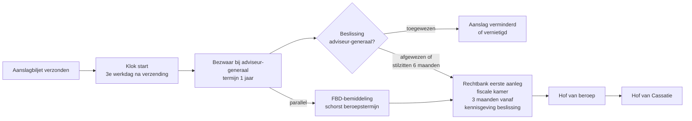

> **Leerstuk — één vraag, helemaal doorgewerkt.** Voor verhaal en routekaart: [[studiemateriaal/2-5|overzicht PO 2.5]]. Dit leerstuk werkt expliciet de **federale** bezwaarroute uit. Gewestelijke eigenheden (Vlabel, Brussel, Wallonië) en btw komen kort aan bod met doorklik naar [[studiemateriaal/2-7|PO 2.7]] en [[studiemateriaal/2-4|PO 2.4]]. Voor wat hieraan voorafging: [[taxatie-bericht-van-wijziging-en-ambtshalve-aanslag]]. Voor wat parallel loopt op het invorderingsspoor: [[invordering-en-verzet-tegen-dwangbevel]].

## Antwoord in één blik

De federale geschilroute is een **cascade van drie schakels**. Eerst dien je een bezwaarschrift in bij de adviseur-generaal — en je hebt daar **één jaar** de tijd voor, te rekenen vanaf de derde werkdag na verzending van het aanslagbiljet. Niet zes maanden (die foutieve waarde duikt nog op in oude cursussen en zelfs in een verouderde concept-record). Niet vanaf de datum op het biljet, en niet vanaf ontvangst — **de derde werkdag na verzending**. Tijdens dat bezwaar kun je parallel een **fiscale bemiddeling** aanvragen, die de eventuele beroepstermijn naar de rechtbank schorst. Pas na de beslissing van de adviseur-generaal — of bij stilzwijgen na zes maanden, wat als fictieve afwijzing geldt — opent de **gerechtelijke fase** bij de fiscale kamer van de rechtbank van eerste aanleg, binnen drie maanden.

Twee kapitale spelregels lopen door de hele cascade. Eén: de adviseur-generaal mag de aanslag op bezwaar **nooit verhogen** — alleen handhaven, verminderen of vernietigen. Twee: het bezwaar **schorst de invordering niet**. Het onbetwist verschuldigd deel blijft opeisbaar; de ontvanger kan zelfs bewarend beslag laten leggen op het betwist deel. En een laatste waarschuwing voor het examen: bezwaar (administratief, tegen de aanslag) is iets totaal anders dan verzet (gerechtelijk, tegen het dwangbevel). De verwarring tussen die twee is een examen-klassieker.

We werken hierna in volgorde uit: eerst de termijn-en-vorm-regels van het bezwaar, dan de tussenkomst van de bemiddelingsdienst, dan de gerechtelijke cascade. We sluiten af met de gewestelijke afwijkingen kort in tabel-vorm, een blik op de beginselen van behoorlijk bestuur die hier concreet leven, en de brug naar [[invordering-en-verzet-tegen-dwangbevel]].

---

## De bezwaartermijn — één jaar vanaf de derde werkdag na verzending

De scharniervraag: hoeveel tijd heeft je cliënt om bezwaar in te dienen, en wanneer begint die klok precies te lopen?

De wettelijke termijn is **één jaar**. Niet zes maanden — die kortere termijn leeft nog in verouderd cursusmateriaal en in een stale concept-record, maar de actuele wettekst is glashelder: één jaar. Wie nog zes maanden hanteert, levert zijn cliënt zes maanden bezwaarrecht in zonder enige reden. Voor de adviseur is dit een ernstige fout — een vermijdbaar verlies van rechten.

De klok begint te lopen op de **derde werkdag na verzending** van het aanslagbiljet. Drie aandachtspunten zitten in die formule. *Werkdag*, niet kalenderdag — weekends en wettelijke feestdagen tellen niet mee. *Na verzending*, niet vanaf ontvangst — wat de post doet of niet doet verandert niets aan de termijn. En *verzending*, niet de datum die bovenaan het biljet staat afgedrukt (die datum kan een eerdere bewerkingsdatum zijn). Drie keer een examen-strikvraag in MCQ-vorm.

Concretiseer op De Vlieg & Partners. Het aanslagbiljet wordt verzonden op dinsdag 8 juli 2025. Drie werkdagen verder: woensdag 9, donderdag 10, vrijdag 11. De klok start dus op vrijdag 11 juli 2025, en de uiterste bezwaardatum is vrijdag 11 juli 2026. De accountant dient bezwaar in op 9 september 2025 — ruim binnen termijn.

| Termijn-element | Wat je moet onthouden | Examen-valkuil |
|---|---|---|
| Duur | **1 jaar** (federaal) | Niet 6 maanden — dat was vóór de wetshervorming en leeft nog in oude bronnen |
| Starttrigger | **3e werkdag na verzending** aanslagbiljet | Niet de datum op het biljet; niet de ontvangstdatum |
| Werkdagen | Weekends + wettelijke feestdagen overslaan | Vrijdag verzonden = klok start op woensdag (niet maandag) |
| Indieningsdatum | Datum poststempel telt bij aangetekend | Op de uiterste dag aangetekend posten is nog tijdig |

**Vorm-vereisten:** het bezwaarschrift moet schriftelijk zijn, gemotiveerd, en ondertekend door de belastingplichtige (of door een lasthebber met volmacht). Het wordt gericht aan de **adviseur-generaal** van de Algemene Administratie van de Fiscaliteit (de functietitel die het vroegere "gewestelijk directeur" heeft vervangen). Aangetekend versturen is sterk aan te raden — de datum van de poststempel geldt dan als indieningsdatum, wat houvast geeft bij latere discussie.

> **Wat als je cliënt op de laatste dag pas tot bezwaar beslist?** Een aangetekende brief geposteerd op de uiterste dag is in beginsel tijdig — de poststempel geldt. In spoedeisende gevallen kun je tegelijk een e-mail sturen naar het officieel adres en later met aangetekend bevestigen. De vorm-vereisten zijn relatief soepel, maar de termijn is hard.

---

## Het bezwaar bij de adviseur-generaal — vorm, inhoud, behandeling

Het bezwaar bij de adviseur-generaal is een **administratief beroep**. Geen rechter, maar een hogere ambtenaar van dezelfde administratie die de aanslag opnieuw bekijkt — met de bevoegdheid de aanslag te handhaven, te verminderen of te vernietigen.

### Wie kan indienen, wie kan ondertekenen?

In de praktijk komt deze vraag vaker dan je zou denken — vooral bij vennootschappen met meerdere bestuurders. Vier categorieën spelen.

De **belastingplichtige zelf** kan altijd ondertekenen. Voor een natuurlijke persoon: persoonlijk. Voor een vennootschap: via de wettelijk vertegenwoordiger volgens de statuten — een zaakvoerder, een bestuurder, of een gemachtigd directielid. Bij meerdere bestuurders met collegiale werking: laat in twijfelgeval beide tekenen, of regel vooraf een uitdrukkelijke volmacht voor één van hen.

Een **lasthebber met expliciete volmacht** kan eveneens ondertekenen — typisch de accountant. De volmacht hoeft niet bij elk bezwaar opnieuw te worden opgesteld: een doorlopende lastgevingsovereenkomst tussen cliënt en accountant volstaat, op voorwaarde dat ze fiscale vertegenwoordiging expliciet vermeldt. Een algemene "boekhoud-opdracht" volstaat *niet*.

Een **advocaat** ten slotte heeft een algemeen mandaat vanuit zijn beroep en heeft geen aparte volmacht nodig.

### Inhoud — meer dan een formulier

Een bezwaarschrift is geen invuldocument maar een **argumentatief stuk** dat de adviseur-generaal moet overtuigen op feit én recht. Wat erin moet:

- Identificatie van de cliënt, het aanslagjaar en het aanslagnummer
- Datum van het aanslagbiljet
- **Grieven** — wat precies wordt betwist
- **Motivering** — waarom je dat betwist, op feit en op recht
- **Conclusies** — wat je vraagt (vernietiging, vermindering tot bedrag X, subsidiair vermindering van de belastingverhoging)
- Ondertekening

Strategisch loont het om in **drie blokken** te redeneren. *Feit*: welke feiten betwist je, en met welk bewijs? *Recht*: welke wetstoepassing klopt volgens jou niet? *Subsidiair*: als alle voorgaande argumenten falen, betwist dan minstens de belastingverhoging op redelijkheid — een verhoging van 50 % bij een eerste overtreding zonder fraude is bijna altijd argumenteerbaar te verminderen. Verzoek ook expliciet om **hoorrecht**: de adviseur-generaal kan dit toestaan, en het biedt de gelegenheid om mondeling te argumenteren. Hoorrecht wordt niet automatisch toegekend, maar in complexere dossiers vaak gewillig.

In het dossier De Vlieg dient de accountant op 9 september 2025 een bezwaarschrift in dat de marktconformiteit van de aannemingsfactuur staaft met drie alternatieve offertes, de toepassing van de bepaling over abnormale of goedgunstige voordelen aanvecht (verbonden onderneming uit dezelfde sector aan normale prijzen), en subsidiair vraagt om de belastingverhoging terug te brengen naar 10 %. Hoorrecht wordt expliciet gevraagd.

### Bezwaar schorst de invordering niet

Dit is een **examen-klassieker** en tegelijk een belangrijke praktijkwaarschuwing. Bezwaar indienen betekent **niet** dat de cliënt mag wachten met betalen. Het onbetwist verschuldigd deel blijft opeisbaar. En zelfs op het betwist deel kan de ontvanger **bewarend beslag** laten leggen om zijn rechten te vrijwaren.

Praktisch betekent dit dat je bij elk bezwaar drie sporen tegelijk moet meedenken. Eén: het inhoudelijk bezwaar bij de adviseur-generaal. Twee: een verzoek tot opschorting van de invordering — de ontvanger kan dit toestaan, maar op discretionaire basis. Drie: het onbetwist deel tijdig betalen om beslag te vermijden.

In het dossier De Vlieg laat de ontvanger op 10 oktober 2025 — een maand na het ingediende bezwaar — bewarend beslag leggen op de zichtrekening van de BV. Voor de belastingverhoging en de gemeente-opcentiemen (het onbetwist verschuldigd deel). De cliënt is verrast — "ik heb toch bezwaar?" Een verkeerde reflex. Hoe het invorderingsspoor parallel verder loopt — dwangbevel, uitvoerend beslag, verzet bij de beslagrechter — werk ik uit in [[invordering-en-verzet-tegen-dwangbevel]].

### Reformatio in pejus verboden — de directeur mag niet verhogen

Een bezwaar is een **asymmetrisch rechtsmiddel**. De adviseur-generaal kan de aanslag vernietigen, verminderen of handhaven, maar **niet verhogen**. Deze regel — bekend onder de Latijnse term *reformatio in pejus verboden* — verlaagt de drempel voor bezwaar drastisch: de cliënt riskeert niet dat hij na het indienen van bezwaar slechter af is dan vóór.

> **Wat het verbod precies inhoudt en wat niet.** Het verbod geldt strikt het *voorwerp* van het bezwaar — de aanslag waartegen bezwaar werd ingediend kan niet hoger worden. Het verhindert de fiscus niet om een nieuwe aanslag te vestigen voor andere perioden of andere grieven, en het belet evenmin tegenvorderingen in een latere gerechtelijke fase. Op het bezwaar zelf is de spelregel onverbiddelijk: alleen vermindering of handhaving.

Strategisch advies dat hieruit volgt: bezwaar is een **laag-risico beweging**. Bij twijfel over de juistheid van de aanslag is het verstandig advies bijna altijd "dien bezwaar in" — slechter dan vandaag kan de cliënt op dat bezwaar niet worden.

### De beslistermijn van de adviseur-generaal — en de uitweg bij stilzwijgen

Een eigenaardigheid van de federale bezwaarprocedure: er is **geen dwingende termijn** waarbinnen de adviseur-generaal moet beslissen. Hij kan een dossier drie maanden behandelen of acht maanden laten liggen, en de cliënt heeft daar geen direct rechtsmiddel tegen.

Maar er is een uitweg. Na **zes maanden zonder beslissing** (negen maanden bij een ambtshalve aanslag) mag de belastingplichtige rechtstreeks naar de rechtbank — een mechanisme dat in de praktijk **fictieve afwijzing** wordt genoemd. De zes-maanden-klok start bij de indiening van het bezwaar. In het dossier De Vlieg, met bezwaar ingediend op 9 september 2025: fictieve afwijzing wordt mogelijk vanaf 9 maart 2026.

Praktijk: na ongeveer vijf maanden bekijk je samen met de cliënt of er beweging in het dossier zit. Soms is een schriftelijk rappel met expliciete dreiging van fictieve afwijzing voldoende om een directeursbeslissing los te krijgen. Beslist de adviseur-generaal alsnog inhoudelijk (gunstig, ongunstig of gedeeltelijk gunstig), dan start vanaf **kennisgeving** van die beslissing een nieuwe termijn van drie maanden om naar de rechtbank te gaan.

---

## De Fiscale Bemiddelingsdienst — een parallel spoor

De Fiscale Bemiddelingsdienst (FBD) is een **neutrale tussenpersoon** binnen de FOD Financiën — geen inspecteur, geen adviseur-generaal, maar een derde dienst die probeert tot een redelijk akkoord te komen. Opgericht door de wet van 25 april 2007.

Wanneer aanvragen? Tijdens een **lopend bezwaar** (parallel) of bij een geschil over de invordering. *Niet* vooraleer er bezwaar is ingediend — de FBD heeft geen pre-bezwaar-rol.

De **belangrijkste mechaniek** voor de adviseur: een aanvraag van fiscale bemiddeling **schorst de termijn** voor beroep naar de rechtbank, tot de bemiddeling formeel wordt afgesloten. Dat geeft extra ruimte om tot een akkoord te komen zonder dat de gerechtelijke deur in tussentijd dichtvalt.

Wat kan de bemiddeling concreet opleveren? De bemiddelaar maakt geen bindende uitspraak — hij brengt partijen rond de tafel en stelt een advies op. Bij een geslaagde bemiddeling neemt de adviseur-generaal het akkoord typisch over in zijn beslissing: een vermindering van de belastingverhoging, een overeenkomst over de kwalificatie van een kostenpost, een gedeeltelijke vermindering van de basisrechtzetting. Sinds 2019 is de FBD bovendien bevoegd voor **invorderingsgeschillen** — bijvoorbeeld het vragen van een afbetalingsplan of opschorting van een beslag.

In het dossier De Vlieg vraagt de cliënt op 15 november 2025 — twee maanden na het bezwaar — fiscale bemiddeling aan, vooral over de hoogte van de belastingverhoging waar ruimte voor compromis lijkt. De eventuele beroepstermijn naar de rechtbank wordt geschorst zolang de bemiddelaar werkt.

> **Bemiddeling is een aanvulling, geen vervanger.** De adviseur-generaal blijft de juridische beslisser; de FBD probeert het gesprek vlot te krijgen. Strategisch overweeg je een aanvraag wanneer er duidelijk ruimte voor compromis lijkt — niet wanneer de standpunten gepolariseerd zijn en partijen op een principebeslissing aansturen.

---

## De gerechtelijke fase — rechtbank, hof, cassatie

Na de bezwaarbeslissing (of bij fictieve afwijzing na zes maanden) opent de weg naar de rechter. Belangrijk om vooraf vast te leggen: het bezwaar is een **toegangsvoorwaarde** voor de rechtbank. Zonder voorafgaand bezwaar geen rechtbank — op enkele wettelijke uitzonderingen na.

### Rechtbank van eerste aanleg — fiscale kamer

Bevoegd is de **rechtbank van eerste aanleg, fiscale kamer**. Fiscale geschillen worden typisch geconcentreerd in één of twee zetels per arrondissement.

De **termijn** is drie maanden vanaf de kennisgeving van de directeursbeslissing. Bij fictieve afwijzing — wanneer de cliënt na zes maanden stilzwijgen rechtstreeks naar de rechter stapt — is er geen aparte drie-maandsklok meer; vanaf maand zeven kun je dagvaarden tot er een directeursbeslissing valt of het dossier op een andere manier ten einde komt.

De **vorm**: voor de rechter is rechtsbijstand door een advocaat verplicht. De accountant blijft betrokken voor de inhoudelijke voorbereiding van het dossier — het cijfer-, feiten- en redeneringswerk — maar tekent niet voor de zitting.

Wat **oordeelt de rechter**? Volle jurisdictie over feit en recht. Geen marginale controle zoals bij sommige administratieve rechtscolleges — de fiscale rechter herziet het hele dossier. Hij kan de aanslag vernietigen, verminderen of handhaven. Het verbod op verhoging (*reformatio in pejus*) geldt ook hier — standaard rechtsprincipe in alle fiscale jurisdicties.

In het dossier De Vlieg, hypothetisch: bij afwijzing of gedeeltelijke afwijzing door de adviseur-generaal volgt een vordering bij de rechtbank van eerste aanleg Antwerpen, fiscale kamer, binnen drie maanden na kennisgeving van de beslissing.

### Hoger beroep en cassatie

Tegen het vonnis van de rechtbank van eerste aanleg staat **hoger beroep** open bij het hof van beroep, fiscale kamer. Termijn: één maand vanaf betekening van het vonnis. De fiscus heeft eenzelfde termijn voor incidenteel beroep. Het hof oordeelt opnieuw over feit en recht — opnieuw volle jurisdictie.

Daarna nog: het **Hof van Cassatie**. Termijn: drie maanden vanaf betekening van het arrest van het hof van beroep. Cassatie beoordeelt enkel **rechtsvragen**, niet feiten. De klassieke gronden: schending van een wetsartikel, schending van de motiveringsplicht, schending van procedure-regels. Voor de adviseur: cassatie is een instrument voor **structurele rechtsvragen** — niet voor een hertoetsing van feiten. Voor "gewone" rechtzettingen volstaat in de praktijk de rechtbank en eventueel het hof van beroep. Cassatie overweeg je wanneer een principekwestie speelt — bijvoorbeeld de interpretatie van een nieuwe wet.

---

## Andere routes — gewest en btw kort

Alles wat tot hier behandeld werd, geldt voor **federale directe belastingen**: personenbelasting, vennootschapsbelasting, rechtspersonenbelasting, belasting niet-inwoners. Andere belastingen volgen andere routes — en de termijnen verschillen sterk. De doorklik naar [[studiemateriaal/2-7|PO 2.7]] werkt de gewestelijke en lokale procedures volledig uit; voor btw zie [[studiemateriaal/2-4|PO 2.4]]. Hier de essentie in één tabel.

| Belasting | Bezwaarinstantie | Termijn | Starttrigger |
|---|---|---|---|
| **Federaal — directe belastingen** (PB, VenB, RPB, BNI) | Adviseur-generaal AAFisc | **1 jaar** | 3e werkdag na verzending |
| **Vlaams gewest** (OV, verkeer, BIV, erf, registratie) | Vlabel | 3 maanden | 3e werkdag na verzending |
| **Brussels gewest** | Bruxelles Fiscalité | 186 dagen | 7e dag na verzending |
| **Waals gewest** | SPW Fiscalité | 6 maanden | Uitwerking kennisgeving |
| **Btw** (federaal) | Adviseur-generaal AAFisc btw | 3 maanden | (Zie [[studiemateriaal/2-4|PO 2.4]]) |
| **Gemeente / provincie** | College B&S / Bestendige Deputatie | 3 maanden | 3e werkdag na verzending |

De essentie voor het examen: weet dat federaal en gewestelijk **fundamenteel anders** lopen, en gebruik nooit de federale termijn van één jaar voor een gewestbelasting. De Vlaamse termijn van drie maanden is *vier keer korter* dan de federale — een dossier dat federaal nog ruim binnen termijn ligt, kan voor een gewestbelasting al verjaard zijn.

---

## Twee beginselen behoorlijk bestuur die hier concreet leven

Twee algemene rechtsbeginselen uit [[studiemateriaal/2-1|PO 2.1]] krijgen in de bezwaarfase een zeer concrete operationele uitwerking — de moeite om ze hier kort vast te pinnen.

**Het verbod op *reformatio in pejus*** is een operationalisering van rechtszekerheid en redelijkheid. De cliënt moet kunnen vertrouwen dat het instellen van een rechtsmiddel hem niet slechter af maakt — anders zou bezwaar effectief worden afgeschrikt. De wetgever heeft die bescherming uitdrukkelijk in de fiscale procedure verankerd.

**De motiveringsplicht bij de directeursbeslissing** vloeit voort uit de algemene wet motivering bestuurshandelingen (Wet 29 juli 1991). De adviseur-generaal moet zijn beslissing zowel feitelijk als juridisch motiveren — een afwijzing met enkel "bezwaar ongegrond" is niet voldoende. De beslissing moet de aangevoerde argumenten van de cliënt expliciet adresseren. Een ongemotiveerde beslissing kan op die grond zelf voor de rechtbank ter discussie staan.

Naast deze twee verdient een derde rechtsmiddel kort vermelding: **ambtshalve ontheffing**. Voor materiële vergissingen en gevallen van dubbele belasting bestaat een aparte ontheffingsprocedure met een veel ruimere termijn — vijf jaar vanaf 1 januari van het aanslagjaar. Deze procedure staat naast het bezwaar en is bedoeld voor evidente fouten die buiten de bezwaartermijn nog kunnen worden rechtgezet. Geen vervanger voor bezwaar — wel een vangnet bij echte vergissingen.

---

## Bezwaar is geen verzet — de brug naar het invorderingsspoor

Tot slot het onderscheid dat het examen graag toetst: **bezwaar versus verzet**. Beide zijn rechtsmiddelen, beide klinken vergelijkbaar, maar ze hebben fundamenteel verschillende functies — verschillende organen, verschillende termijnen, verschillende effecten.

| | Bezwaar | Verzet |
|---|---|---|
| **Aard** | Administratief beroep | Gerechtelijk verweer |
| **Tegen wat?** | De aanslag (heffing) | Het dwangbevel (tenuitvoerlegging) |
| **Bij wie?** | Adviseur-generaal | Beslagrechter |
| **Termijn** | **1 jaar** vanaf 3e werkdag | Typisch 1 maand vanaf betekening |
| **Resultaat bij succes** | Aanslag verminderd of vernietigd | Beslag vernietigd of opgeschort |
| **Behandeld in** | Dit leerstuk | [[invordering-en-verzet-tegen-dwangbevel]] |

De examen-klassieker: cliënt krijgt een dwangbevel — kan hij "bezwaar" indienen? Antwoord: nee. Bezwaar gaat over de aanslag, niet over de tenuitvoerlegging. Tegen een dwangbevel is het rechtsmiddel **verzet**, in te stellen via een vordering in rechte bij de beslagrechter.

Strategisch komt het regelmatig voor dat een aanslag én een dwangbevel tegelijk moeten worden aangepakt — bijvoorbeeld wanneer de cliënt zowel inhoudelijk de aanslag betwist als procedureel de invordering aanvecht. Dan lopen **twee parallelle procedures** op verschillende gronden bij verschillende instanties. Geen probleem in beginsel, maar het vraagt strakke dossierregie.

---

## Drie valkuilen om mee te nemen

> **Valkuil 1 — De bezwaartermijn op zes maanden zetten.** De correcte termijn is **één jaar** — een veelvoorkomende fout omdat oude cursussen en zelfs verouderde concept-records nog de vroegere termijn vermelden. Wie zes maanden hanteert, halveert de bezwaarruimte van de cliënt nodeloos. Examen-strikvraag in MCQ-vorm: een fout antwoord "6 maanden" verschijnt vrijwel altijd tussen de opties.

> **Valkuil 2 — De startdatum verwarren.** Niet de datum bovenaan het biljet, niet de datum van ontvangst — **de derde werkdag na verzending**. Voor een biljet verzonden op vrijdag 7 augustus: werkdagen 1 = maandag 10, 2 = dinsdag 11, 3 = woensdag 12. De klok start op woensdag, niet op zaterdag of maandag. Weekends en wettelijke feestdagen tellen niet mee.

> **Valkuil 3 — Denken dat bezwaar de invordering schorst.** Het schorst alleen het *betwist* deel, en zelfs daar kan de ontvanger nog bewarend beslag laten leggen ter vrijwaring. Het onbetwist verschuldigd deel blijft volledig opeisbaar. Drie sporen meedenken bij elk bezwaar: inhoudelijk bezwaar indienen, vragen om opschorting van de invordering, en tijdig betalen van het onbetwist deel om beslag op de bedrijfsrekening te vermijden.

---

## Wanneer je dit snapt, ga dan naar:

- [[invordering-en-verzet-tegen-dwangbevel]] — wat parallel met het bezwaar loopt op het invorderingsspoor: dwangbevel, bewarend beslag, verzet bij de beslagrechter.
- [[taxatie-bericht-van-wijziging-en-ambtshalve-aanslag]] — wat aan het bezwaar voorafgaat: bericht van wijziging en aanslagvestiging vormen samen de voorwaarde voor bezwaar.
- [[controle-onderzoek-en-bewijs]] — voor de bewijslast-context, vooral relevant bij een aanslag van ambtswege waar de bewijslast wordt omgekeerd in het bezwaar.
- [[wat-is-fiscale-procedure-en-aanslagcyclus]] — voor het kader: de drie fases van de fiscale procedure op één tijdlijn.
- [[studiemateriaal/2-5/samenvatting|Samenvatting PO 2.5]] — voor herhaling vlak vóór het examen: bezwaar-cascade, termijntabel, reformatio in pejus en FBD-schorsing in één oogopslag.

**Voor wie definitorisch detail wil opzoeken** *(let op: de concept-record `bezwaarprocedure` bevat een verouderde "6 maanden"-claim — de actuele wettekst zegt 1 jaar)*: [[bezwaarprocedure]] · [[fiscale-bemiddelingsprocedure]] · [[gerechtelijke-fase-belasting]]

---

## Wettelijk fundament

- Bezwaar — bij wie + vorm: WIB92 art. 366. Schriftelijk, gemotiveerd, ondertekend, gericht aan de adviseur-generaal AAFisc.
- Bezwaartermijn directe belastingen: WIB92 art. 371 — **één jaar** vanaf de derde werkdag na verzending van het aanslagbiljet. Niet zes maanden.
- Reformatio in pejus verboden: WIB92 art. 375. De adviseur-generaal kan vernietigen, verminderen of handhaven — niet verhogen.
- Ambtshalve ontheffing — cross-fase rechtsmiddel: WIB92 art. 376. Vijf jaar vanaf 1 januari van het aanslagjaar, voor materiële vergissingen en dubbele belasting.
- Aanvraag fiscale bemiddeling op een lopend bezwaar: WIB92 art. 376quinquies — verwijst naar de Fiscale Bemiddelingsdienst opgericht bij Wet 25 april 2007 art. 116 (houdende diverse bepalingen IV).
- Invordering — bezwaar schorst niet: WIB92 art. 410. Onbetwist deel blijft opeisbaar; bewarend beslag mogelijk op betwist deel.
- Gerechtelijke fase — rechtbank fiscale kamer: Ger.W. art. 569, 16° (bevoegdheid) + art. 1385undecies (drie maanden vanaf kennisgeving directeursbeslissing; fictieve afwijzing na zes maanden stilzwijgen).
- Motiveringsplicht directeursbeslissing: Wet 29 juli 1991 betreffende de uitdrukkelijke motivering van bestuurshandelingen.
- Gewestelijke bezwaartermijnen (cross-PO doorklik [[studiemateriaal/2-7|PO 2.7]]): VCF art. 3.5.2.0.1 (Vlaams — drie maanden) · Brusselse Codex Fiscale Procedure art. 100 (Brussel — 186 dagen vanaf de zevende dag) · Decreet 6 mei 1999 (Wallonië — zes maanden).
- Lokale bezwaarprocedure (cross-PO doorklik [[studiemateriaal/2-7|PO 2.7]]): Wet 24 december 1996 art. 9 (gemeente en provincie, drie maanden).

---

*Leerstuk PO 2.5 — vierde van vijf in het leerpad fiscale procedure. Voor de volledige routekaart: [[studiemateriaal/2-5|overzicht PO 2.5]].*
