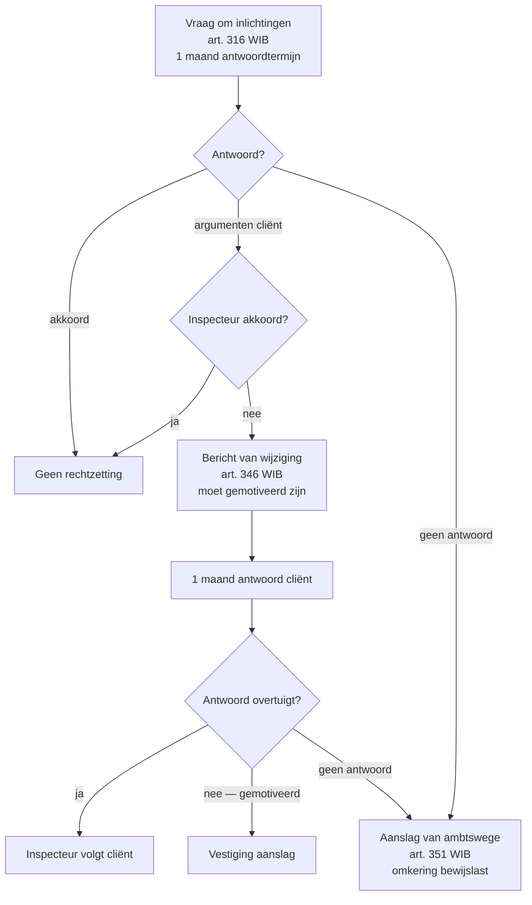

> **Leerstuk — één vraag, helemaal doorgewerkt.** Lees eerst [[wat-is-fiscale-procedure-en-aanslagcyclus]] voor de timeline en de drie fases waarbinnen onderzoek zich afspeelt. Hier ga je in op de techniek: wat mag de fiscus opvragen, binnen welke termijnen, en met welke bewijsmiddelen kan hij een rechtzetting hard maken? Voor verhaal en routekaart: [[studiemateriaal/2-5|overzicht PO 2.5]].

## Antwoord in één blik

Een fiscale controle is een **gesprek met regels**. De fiscus heeft een gereedschapskist van zes onderzoeksbevoegdheden, mag die enkel inzetten **binnen de aanslagtermijn** (3, 4, 6 of 10 jaar voor directe belastingen; 3, 4 of 7 jaar voor btw), en moet zijn rechtzetting onderbouwen met één van **vier bewijsmiddelen**. Tegenover elk gereedschap staat een grens uit de wet of uit de beginselen van behoorlijk bestuur — overtreedt de inspecteur die grens, dan is het verkregen bewijs in principe aanvechtbaar en valt de aanslag die erop steunt.

Drie aspecten lopen altijd samen. Het examen toetst zelden één los aspect; het toetst de **dialoog**: wat mag (bevoegdheid) · binnen welke termijn · met welk bewijsmiddel. Een tekenen-en-indiciën-aanslag op basis van een rekeningonderzoek blijft alleen overeind als de aanslag binnen de aanslagtermijn gevestigd wordt, én als het rekeningonderzoek zelf regelmatig verliep.

Btw heeft een **eigen regime** — eigen wetboek, eigen termijnen, eigen bevoegdheden. "Altijd 7 jaar btw" is een courant misverstand dat in examens als foute MCQ-optie verschijnt: ook btw kent een gedifferentieerd 3/4/7-stelsel.

We werken alles uit op één doorlopende cliënt — **BV De Vlieg & Partners**, een Mechelse bouwonderneming met een lopend fiscaal dossier voor aanslagjaar 2024. De vraag om inlichtingen die de inspecteur op 22 februari 2025 stuurt, illustreert de drie draden samen.

---

## Vertrekpunt — drie draden van één gesprek

Voor we in de techniek duiken: een controle is geen monoloog van de administratie. De inspecteur stelt vragen via een vaste set bevoegdheden, de cliënt antwoordt binnen wettelijke termijnen, beide kanten leveren stukken aan die als bewijs in een latere rechtzetting of in bezwaar zullen dienen. Wie één van de drie draden los bekijkt, mist het gesprek.

Hieronder zie je de drie draden in één tabel — elk wordt verderop in zijn eigen sectie uitgewerkt. Aan het einde komen ze samen in een doorgewerkte synthese op het De Vlieg-dossier.

| Draad | Hoofdvraag | Wetbron | Uitgewerkt in |
|---|---|---|---|
| **Bevoegdheden** | Wat *mag* de fiscus opvragen of doen? | WIB92 (artikelen 315–326 + 333) · WBTW (artikelen 60–63) | Sectie 1 |
| **Termijnen** | *Binnen welke periode* mag dat? | WIB92 (artikel 354 + 358) · WBTW (artikel 81bis) | Sectie 2 |
| **Bewijsmiddelen** | *Met welke argumenten* houdt een rechtzetting stand? | WIB92 (artikelen 339–344) | Sectie 3 |

Onderaan dit leerstuk volgt nog een blok **Beginselen-haakjes** — daar leer je herkennen wanneer een onderzoekshandeling de grenzen van zorgvuldigheid of motivering raakt. Die [[beginselen-behoorlijk-bestuur]] leven niet apart maar **in** de onderzoeksgrenzen zelf.

---

## 1. De zes onderzoeksinstrumenten — wat mag de fiscus?

De wetgever heeft de fiscus zes vaste instrumenten gegeven, elk met eigen voorwaarden en grenzen. Het is een **gesloten lijst** — alles wat niet in die zes past is verboden of vraagt een rechterlijke machtiging. In de praktijk worden ze achtereenvolgens ingezet, van licht (vraag om inlichtingen) naar zwaar (bankonderzoek of fraude-traject).

De volgende tabel geeft je het overzicht. Daarna zoomen we in op de drie instrumenten die in examens het vaakst terugkeren — vraag aan de cliënt, vraag aan derden, en onderzoek in de fraude-termijn.

| Bevoegdheid | Termijn | Grens | Gevolg bij weigering |
|---|---|---|---|
| **Boeken en bescheiden opvragen / inzien** | Op redelijke vraag, op zetel of woning | Bewaarplicht 10 jaar (fiscaal); voorleggen zonder verplaatsing | Verzwaard bewijsstuk + ambtshalve aanslag + omkering bewijslast |
| **Vraag om inlichtingen aan de cliënt** | 1 maand vanaf 3e werkdag na verzending | Geen algemeen onderzoek — moet betrekking hebben op een aanslag in voorbereiding | Ambtshalve aanslag + boete |
| **Controle ter plaatse (zetel / woning)** | Tijdens werkuren (zetel); privé-woning na machtiging | Privé-woning vereist **machtiging politierechter** | Verhinderen onderzoek = boete + ambtshalve aanslag |
| **Vraag aan derden** (klanten, leveranciers) | Geen wettelijk minimum — door administratie, *mits redelijk* | Beroepsgeheim (advocaten, artsen — beperkt); derde mag antwoorden | Derde aansprakelijk; cliënt niet direct |
| **Bankgeheim doorbreken via Centraal Aanspreekpunt** | Procedure via art. 322 §2 + voorafgaande kennisgeving | Vereist aanwijzingen van belastingontduiking; voorafgaande kennisgeving via aangetekende brief | Bewijs onbruikbaar zonder kennisgeving |
| **Onderzoek in fraude-termijn (verlengde aanslagtermijn)** | Mits voorafgaande schriftelijke kennisgeving | Kennisgeving moet de aanwijzingen **nauwkeurig** vermelden — op straffe van nietigheid van de aanslag | Aanslag aanvechtbaar; onderzoek nietig |

### Vraag om inlichtingen aan de cliënt — 1 maand antwoord

Dit is verreweg de meest voorkomende controlestap. De inspecteur stuurt een schriftelijke vraag over één of meer specifieke posten — een kostenpost die te hoog lijkt, een aftrek waarvan de staving ontbreekt, een buitenlandse betaling. Geen algemene "stuur ons alles van de laatste vijf jaar"-vraag: de wet eist dat het verzoek **gevorderd wordt met het oog op het onderzoek van de fiscale toestand** van de cliënt.

De **termijn**: één maand, te rekenen vanaf de derde werkdag volgend op de verzending van de aanvraag. Die termijn is *wegens wettige redenen verlengbaar* — op gemotiveerd verzoek, ingediend vóór vervaldag. De verlenging is geen automatisme; je vraagt ze tijdig en je motiveert (omvang dossier, afwezigheid zaakvoerder, vakantieperiode boekhouding).

De **vorm**: schriftelijk, op briefpapier van de administratie, met vermelding van de termijn en van de mogelijke gevolgen bij niet-antwoord (ambtshalve aanslag met omkering bewijslast plus boete). Wie tekent? De cliënt zelf, of zijn lasthebber. In een vennootschap: de zaakvoerder of bestuurder, of een mandataris met expliciete volmacht. Examen-klassieker: een accountant ondertekent best mét aangehechte schriftelijke volmacht, niet "namens" zonder bewijs.

De **grens**: een vraag moet betrekking hebben op een aanslag in voorbereiding. Wie alle facturen van vijf jaar opvraagt zonder gerichte aanleiding, overschrijdt zijn bevoegdheid. Dat is geen formaliteit: een te brede vraag wordt door rechtbanken regelmatig als onregelmatig onderzoek bestempeld, met nietigheid van de aanslag als gevolg.

> **De Vlieg-case — episode 2 en 3.** Op 22 februari 2025 ontvangt de cliënt een vraag om inlichtingen over 80.000 EUR onderaannemingskosten gefactureerd door een zustervennootschap. De termijn start op 25 februari (de derde werkdag na 22 februari) en loopt af op 25 maart. De accountant antwoordt op 20 maart met de onderaannemingscontracten, de facturen, foto's van de bouwplaats en een prijsvergelijking met drie alternatieven. De vraag is gericht (één specifieke kostenpost), valt ruim binnen de aanslagtermijn (5 maanden na aangifte) en de cliënt heeft tijdig én onderbouwd geantwoord. De inspecteur zal nu beslissen: aanvaarden, een bericht van wijziging sturen, of — bij niet-antwoord — ambtshalve aanslaan.

### Vraag aan derden — geen wettelijk minimum

Hier richt de fiscus zich niet tot de cliënt zelf maar tot een **derde**: een klant, een leverancier, een opdrachtgever, of via een afzonderlijke procedure een financiële instelling. De wet legt **geen minimum-antwoordtermijn** op — de administratie bepaalt zelf, *mits redelijk*. In de praktijk vaak tien dagen.

Die korte termijn is een terugkerend punt van betwisting. Klassieker uit voorbeeldexamens: een vraag aan een leverancier met antwoordtermijn 10 dagen, verstuurd middenin een staking, wordt door de rechter aanvaard als **onregelmatig** wegens schending van het zorgvuldigheidsbeginsel. De fiscus mag termijnen vrij bepalen, maar mag ook geen onhaalbare termijnen opleggen.

Twee inhoudelijke grenzen. Een derde kan zich op **beroepsgeheim** beroepen voor cliënt-gevoelige informatie — geldt vooral voor advocaten, artsen en notarissen, en is binnen die beroepen ook niet onbeperkt. Een derde kan ook niet *gedwongen* worden bewijslast tegen de cliënt op te bouwen die hij uit hoofde van zijn eigen activiteit niet normaal weet.

Het **bankgeheim** is een aparte regeling. Sinds een wetshervorming in 2011 mag de fiscus rekeninggegevens opvragen via het Centraal Aanspreekpunt, op voorwaarde dat hij eerst gericht naar de cliënt zelf vroeg én aanwijzingen heeft van belastingontduiking. Bij die procedure stuurt de administratie een aangetekende kennisgeving aan de cliënt **gelijktijdig** met de vraag aan de bank — dat is wettelijk voorgeschreven, niet optioneel.

> **Waarom is de vraag aan derden zo gevoelig?** Het instrument doorbreekt de symmetrie van het gesprek tussen fiscus en cliënt. Een leverancier kan factuurbedragen aan de administratie meedelen die de cliënt nooit boekhoudkundig heeft verwerkt. Voor de accountant: hou er in de risico-analyse rekening mee dat ook stukken van derden in het controle-dossier kunnen verschijnen. Een cliënt die "vergat" een omzet aan te geven kan niet rekenen op stilzwijgen aan de leverancierszijde.

### Onderzoek in fraude-termijn — voorafgaande kennisgeving op straffe van nietigheid

De hoofdregel is eenvoudig: het onderzoek loopt **parallel met de aanslagtermijn**. Wat niet binnen de gewone termijn van 3, 4 of 6 jaar gevestigd kan worden, mag in beginsel ook niet meer onderzocht worden. De wet vermeldt dit expliciet — onderzoekingen mogen "zonder voorafgaande kennisgeving" worden verricht *binnen* de gewone aanslagtermijnen.

De **uitzondering**: bij aanwijzingen van belastingontduiking strekt de aanslagtermijn naar tien jaar. Maar wie wil onderzoeken in die verlengde, aanvullende termijn — concreet: vanaf het zevende jaar terug — moet vooraf een **schriftelijke en nauwkeurige kennisgeving** aan de cliënt sturen met **de aanwijzingen van fraude** die op hem bestaan. Die voorafgaande kennisgeving is voorgeschreven *op straffe van nietigheid van de aanslag*. Niet alleen het onderzoek is dan onregelmatig — de aanslag die op dat onderzoek steunt, kan in bezwaar onderuit.

Wat is een "aanwijzing van fraude"? Geen bewezen fraude — maar **concrete indicaties**: een anonieme tip, een discordantie tussen aangifte en derden-informatie, ongebruikelijke bewegingen op bankrekeningen. De kennisgeving moet die aanwijzingen *identificeren*, niet alleen vermelden dat "fraude vermoed wordt". Een loutere fraude-allegatie zonder ankerpunten in concrete feiten houdt geen stand.

> **Mini-case 2 — vijf jaar terug onderzoeken.** In 2027 ontvangt de fiscus een anonieme tip over zwarte ontvangsten van De Vlieg in 2020. Onderzoek 2020 = zeven jaar terug, dus *in* de fraude-termijn. Mag de inspecteur de boeken 2020 controleren? **Ja**, maar **enkel met** voorafgaande schriftelijke kennisgeving waarin de anonieme tip én de eruit afgeleide aanwijzingen worden vermeld. Stuurt hij die niet, en stelt hij toch een aanslag, dan is die aanslag in bezwaar aanvechtbaar. De examenvraag "kan de administratie?" heeft dus twee laagjes: ja-mits.

---

## 2. De klok — aanslagtermijnen en onderzoekstermijnen

Onderzoek loopt parallel met aanslag. Dat klinkt vanzelfsprekend tot je het mechanisch uitschrijft: wat niet meer aangeslagen kan worden, mag in principe niet meer onderzocht worden — anders bouwt de fiscus bewijs voor een aanslag die hij toch niet kan vestigen. Voor de stagiair is de termijntabel hieronder de centrale **tabel om uit het hoofd te kennen**.

Sinds een wetshervorming eind 2022 geldt voor aanslagjaren vanaf 2023 een nieuw stelsel: drie jaar als basis (regelmatige aangifte), vier jaar bij laattijdige of geen aangifte, zes jaar voor complexe aangiften (lokaal dossier, landenrapport, dubbele-belasting-vermijdingsverdragen), en tien jaar bij fraude. Het oude regime van 3+7 jaar — drie jaar standaard, zeven jaar bij fraude — geldt nog voor oudere aanslagjaren; voorbeeldexamens van vóór 2024 hanteren die nog.

| Wat | Termijn | Wetbron | Valkuil |
|---|---|---|---|
| **Aanslag directe belastingen** — regelmatige aangifte | **3 jaar** vanaf 1 januari aanslagjaar | WIB92 art. 354 §1 lid 1 | Nieuw stelsel sinds AJ 2023 |
| Idem — laattijdige of geen aangifte | **4 jaar** | WIB92 art. 354 §1 lid 2 | — |
| Idem — complexe aangifte (lokaal dossier, landenrapport) | **6 jaar** | WIB92 art. 354 §1 lid 2-3 | Nieuw sinds Wet 20.11.2022 |
| Idem — fraude | **10 jaar** | WIB92 art. 354 §1 lid 4 | Voorafgaande kennisgeving aanwijzingen fraude vereist |
| Verlenging bij BvW op nakende verjaring | **+ 6 maanden** | WIB92 art. 354 §1 lid 4 (in fine) | Redt aanslag bij dreigende verjaring |
| **Aanslag btw** | **3 / 4 / 7 jaar** | WBTW art. 81bis | Geen 10-jaars-regel; geen "altijd 7 jaar" |
| Buitenlandse inlichtingen via DBV | **24 maanden** vanaf kennisname Belgische administratie | WIB92 art. 358 §1 2° + §2 | Foute MCQ-optie: "12 maanden" |
| Antwoord cliënt op vraag om inlichtingen | **1 maand** vanaf 3e werkdag | WIB92 art. 316 | Verlengbaar op gemotiveerd verzoek |
| Antwoord vraag aan derden | **Geen wettelijk minimum** | WIB92 art. 323 | Mits redelijk — vaak 10 dagen |
| Antwoord cliënt op BvW | **1 maand** vanaf 3e werkdag | WIB92 art. 346 | Verlengbaar |
| Bezwaartermijn directe belastingen | **1 jaar** vanaf 3e werkdag na verzending aanslagbiljet | WIB92 art. 371 | Niet 6 maanden; niet vanaf datum biljet of ontvangst |
| Vordering rechtbank na directeursbeslissing | **3 maanden** vanaf kennisgeving | Ger.W. art. 1385undecies | — |
| Fictieve afwijzing — naar rechtbank | Na **6 maanden** stilzwijgen | Ger.W. art. 1385undecies | — |

Twee verlengingen verdienen extra aandacht — beide zijn examen-favorieten.

**De BvW-verlenging.** Wanneer een bericht van wijziging verzonden wordt op een moment dat de gewone aanslagtermijn binnen zes maanden zou verstrijken, wordt de termijn automatisch met zes maanden verlengd. Dat redt de aanslag bij nakende verjaring: de inspecteur die op het laatste moment een wijziging voorstelt, krijgt zo de adempauze om na het antwoord van de cliënt nog te kunnen inkohieren. Klassieker in voorbeeldexamens — leerlingen vergeten de verlenging en concluderen ten onrechte tot verjaring.

**Buitenlandse inlichtingen.** Wanneer de Belgische administratie via een dubbel-belasting-verdrag informatie ontvangt uit het buitenland, beschikt zij over **24 maanden** vanaf kennisname om die te benutten — niet 12. De foute optie "12 maanden" duikt in voorbeeldexamens op precies omdat het detail makkelijk verglijdt naar half-onthouden.

### Bewaarplicht — boekhoudkundig 7 jaar vs fiscaal 10 jaar

Twee parallelle regimes, twee verschillende doelen. **Boekhoudrechtelijk** geldt een bewaarplicht van **zeven jaar** voor de boeken en verantwoordingsstukken — dat is de minimum-floor uit het Wetboek van Economisch Recht. **Fiscaal** geldt een langere termijn: alle "boeken en bescheiden" die noodzakelijk zijn om het bedrag van de belastbare inkomsten te bepalen, moeten op vraag van de administratie voorgelegd worden, en sinds aanslagjaar 2023 sluit die voorleggings- en bewaartermijn aan op de tienjarige fraude-termijn.

Welke stukken vallen onder die fiscale termijn? Niet alleen de boekhouding in strikte zin — ook **alle stukken die de fiscale kwalificatie ondersteunen**: bestelbonnen, contracten met onderaannemers, e-mailcorrespondentie over voorwaarden, prijsoffertes, foto's van de bouwplaats. Een zaakvoerder die in jaar acht na boekjaar zijn bestelbonnen weggooit omdat hij denkt "het zijn maar boekhoudkundige stukken, 7 jaar volstaat", riskeert dat in jaar 9 of 10 de fiscus die stukken nodig heeft om een fraude-onderzoek te dekken — én ze niet kan voorleggen. Gevolg: verzwaard bewijsstuk plus ambtshalve aanslag met omkering bewijslast.

| Stukken | Wetbron | Termijn | Doel |
|---|---|---|---|
| Boekhoudkundige stukken (jaarrekening, dagboeken, inventaris) | WER (Boek III, art. III.86 + 88) | **7 jaar** | Minimum-floor — boekhoudrechtelijk |
| Boeken en bescheiden voor toepassing WIB (incl. bestelbonnen, contracten, e-mails) | WIB92 art. 315 | **10 jaar** (sinds AJ 2023) | Fiscaal — voorleggingsplicht bij controle |
| Facturen + onderliggende stukken btw | WBTW art. 60 | **10 jaar** (sinds 2023; was 7 jaar) | Btw-controle + voorleggingsplicht |

> **Mini-case 1 — bestelbonnen 2018.** Tijdens een controle in 2025 vraagt de fiscus de bestelbonnen van 2018 op. De boekhouder antwoordt: "die hebben we al weggegooid, dat zijn maar boekhoudkundige stukken, na zeven jaar mag dat." **Fout** — bestelbonnen ondersteunen de boekhoudkundige verantwoording en vallen daarmee onder de fiscale voorleggingsplicht voor tien jaar. Bij weigering: ambtshalve aanslag met omkering bewijslast.

---

## 3. De vier bewijsmiddelen — hoe houdt een rechtzetting stand?

De centrale stelregel van het Belgische fiscale bewijsrecht is dat **de administratie de bewijslast draagt**. Zij moet aantonen dat de aangegeven gegevens onjuist zijn — een tijdig en regelmatig ingediende aangifte geniet een **vermoeden van juistheid**. Tegen dat vermoeden kan de fiscus vier soorten bewijs inzetten, die onderling cumuleerbaar zijn.

| Bewijsmiddel | Rol | Voorbeeld |
|---|---|---|
| **Gemeen recht** — schriftelijke stukken, vermoedens, getuigenissen | Basis-bewijsmiddel; volgt de regels van het burgerlijk recht | Factuur, contract, getuigenverklaring leverancier |
| **Tekenen en indiciën** | Fiscus reconstrueert inkomen op basis van uitgaven, levensstandaard, vermogensaanwas die niet door aangegeven inkomen verklaard wordt | Cliënt geeft 25.000 EUR aan, koopt huis van 600.000 EUR zonder andere bron |
| **Vergelijking met soortgelijke belastingplichtigen** | Voor specifieke sectoren — forfaitaire grondslagen | Café-uitbater met omzet ver onder sectoreigenheid |
| **Antimisbruik-herkwalificatie** | Fiscus mag rechtshandelingen anders kwalificeren wanneer ze enkel een fiscaal doel dienen — bewijslast bij fiscus | Structuur uitsluitend gericht op aftrek-creatie zonder economische realiteit |

Er bestaat één belangrijke uitzondering: bij **ambtshalve aanslag** (na weigering medewerking of niet-antwoord op een bericht van wijziging) **draait de bewijslast om**. De cliënt moet dan in bezwaar bewijzen dat de cijfers van de administratie *onjuist* zijn — niet meer omgekeerd. Dat is de zwaarste sanctie op niet-medewerken in onderzoek, en de directe reden waarom een antwoord op een vraag om inlichtingen of op een BvW procedureel **altijd** zinvol is, ook als de cliënt het inhoudelijk niet eens is. De uitwerking van die ambtshalve aanslag en haar gevolgen vind je in [[taxatie-bericht-van-wijziging-en-ambtshalve-aanslag]].

### Tekenen en indiciën — de levensstandaardtoets

De logica is eenvoudig. Wanneer een aangegeven inkomen niet rijmt met de waargenomen uitgaven of vermogensaanwas, mag de fiscus het inkomen **reconstrueren** op basis van die indiciën. Klassiek voorbeeld: een cliënt geeft 25.000 EUR jaarinkomen aan maar koopt een huis van 600.000 EUR, zonder geërfd kapitaal of een aangetoonde lening. Die discrepantie is een **teken**. De fiscus mag dan bijschatten — niet de aankoop zelf belasten, maar het inkomen dat zo'n levensstandaard impliceert.

Het **tegenbewijs** voor de cliënt: aantonen waar de gelden vandaan komen. Schenking + bewijsstuk; erfenis + aangifte nalatenschap; lening + leningsovereenkomst; buitenlandse rekening + bewijs van eerdere fiscale aangifte. Geen aanvaardbare verklaring betekent dat de bijschatting overeind blijft.

> **Cliënten misverstaan dit vaak.** "Ze kunnen toch niets bewijzen" — dat is onjuist. De fiscus moet enkel de **discrepantie** aantonen; de cliënt moet ze **verklaren**. Het is geen vermoeden zoals in burgerlijk recht, het is een wettelijke bewijstechniek met omgekeerde bewijslast eens de discrepantie vaststaat. Voor de accountant: bij grote vermogensbewegingen op een privé-balans is documentatie geen luxe maar verzekering.

### Antimisbruik — herkwalificatie

De algemene antimisbruikbepaling is geen "gewoon" bewijsmiddel — het is een **herkwalificatie-recht** dat de fiscus toelaat een rechtshandeling of een samenstel van rechtshandelingen *fiscaal anders te kwalificeren* dan ze juridisch geldt. Twee voorwaarden moeten samen vervuld zijn: de rechtshandeling strijdt met de doelstellingen van een fiscale bepaling, én de belastingplichtige kan geen niet-fiscale motieven aantonen voor de gekozen constructie.

De **bewijslast ligt bij de fiscus** — die moet aantonen dat de structuur fiscaal-misbruik beoogt. Het cliënt-tegenbewijs is positief: aantonen dat er wél substantiële niet-fiscale motieven zijn — economische, juridische, familiale. De algemene antimisbruikbepaling als denkkader (toepassingsvoorwaarden, ratio, verhouding tot specifieke antimisbruik-regels) leeft buiten dit leerstuk — zie [[fiscale-bewijsmiddelen]] voor de breedte. Hier alleen het procedurele aspect: wanneer en hoe de fiscus dit middel inzet tijdens controle of in een bericht van wijziging.

---

## 4. Btw — eigen onderzoeksregime en eigen verjaring

Alles wat hierboven over WIB-onderzoek staat geldt **niet zonder meer** voor btw. Btw heeft een parallel maar eigen regime, met eigen termijnen en eigen bevoegdheden.

**Verjaring** — drie jaar als basis (regelmatige aangifte), vier jaar bij niet-aangifte of laattijdige aangifte, zeven jaar bij fraude of bij buitenlandse inlichtingen via internationale uitwisseling. Geen tien-jaars-regel zoals bij directe belastingen — onthou: btw verjaart **korter** dan WIB in fraude-gevallen, niet langer.

**Onderzoeksbevoegdheden** — parallel aan WIB maar met eigen accenten. Visitatie ter plaatse in beroepslokalen tijdens werkuren; vraag om inlichtingen; inzage van boeken en bescheiden; controle van elektronische bestanden (die laatste is bij btw soms verder uitgewerkt dan bij WIB). De **bewaarplicht** btw bedraagt tien jaar voor facturen en onderliggende stukken — gelijk aan WIB, sinds een wetswijziging eind 2022 die de bewaartermijn van zeven naar tien jaar bracht voor opeisbaarheden vanaf 2023.

> **Mini-case 3 — btw-renovatieaftrek 2018.** Een cliënt-eenmanszaak voerde in 2018 een btw-renovatieaftrek in; in 2025 vraagt de btw-controle de stukken op. De cliënt zegt: "btw is altijd 7 jaar terug, dus jullie zijn binnen termijn." **Fout** — de wet differentieert. Voor regelmatige aangifte 2018 = drie jaar terug → verjaring sinds 2022. Enkel bij een fraude-aanwijzing met voorafgaande kennisgeving zou de zevenjarige termijn van toepassing zijn, en zelfs dan zou de controle exact dezelfde formele eisen aan kennisgeving moeten respecteren als in de directe-belastingen-procedure.

Voor de btw-aangiftemantel, de specifieke btw-controle-procedure en het btw-bezwaar (3 maanden, niet 1 jaar) verwijzen we naar het btw-luik van het examenprogramma.

---

## 5. Beginselen-haakjes — waar leven de beginselen in dit leerstuk?

De [[beginselen-behoorlijk-bestuur]] (zorgvuldigheid, redelijkheid, motivering, rechtszekerheid, vertrouwen) zijn geen apart leerstuk dat los van de procedure leeft. Ze **leven in** de onderzoeksgrenzen zelf. Twee haakjes voor dit leerstuk; de andere haakjes liggen verder in de procedure (motivering van het BvW en van de directeursbeslissing).

**Haakje 1 — Zorgvuldigheid bij kennisgeving fraude.** Een onderzoek vijf jaar terug zonder voorafgaande kennisgeving is **geen zorgvuldig onderzoek** — en dus, in combinatie met de uitdrukkelijke nietigheidssanctie, een nietige aanslag. De zorgvuldigheidsplicht is hier *operationeel*: niet alleen "goed werken" als algemene norm, maar concreet "de cliënt vooraf informeren over de aanwijzingen die de verlenging dragen".

**Haakje 2 — Privacy bij privé-woning.** Beroepslokalen mogen tijdens werkuren vrij betreden worden voor controle; een **privé-woning** vereist een **machtiging van de politierechter**. Dat is geen formaliteit maar de uitwerking van een grondrecht — de onschendbaarheid van de woning, bevestigd in artikel 15 van de Grondwet. Een doorzoeking zonder machtiging is onregelmatig; bewijs eruit verkregen is in principe niet bruikbaar.

De algemene rechtsbeginselen (legaliteit, gelijkheid, non-bis-in-idem) komen in het overzicht van het algemeen fiscaal recht aan bod; de operationele beginselen behoorlijk bestuur (zorgvuldigheid, motivering bij BvW, redelijkheid bij sanctie) leven hier en in [[taxatie-bericht-van-wijziging-en-ambtshalve-aanslag]].

---

## 6. De dialoog in actie — De Vlieg & Partners

Hoe spelen bevoegdheid + termijn + bewijsmiddel concreet samen in één dossier? We werken de mermaid-flow door op de De Vlieg-case, met aanslagjaar 2024 als anker. De aangifte VenB is ingediend op 12 september 2024, dus de aanslagtermijn loopt drie jaar vanaf 1 januari 2024 — tot 31 december 2027.

**E2 — 22 februari 2025 — Vraag om inlichtingen.** De inspecteur vraagt staving van 80.000 EUR onderaannemingskosten gefactureerd door een zustervennootschap. Drie observaties: (a) **gericht** — over één specifieke kostenpost, niet algemeen; (b) **binnen termijn** — 5 maanden na aangifte, ruim binnen de driejarige periode; (c) cliënt krijgt 1 maand vanaf de derde werkdag — concreet tot 25 maart 2025.

**E3 — 20 maart 2025 — Antwoord cliënt.** De accountant levert contracten, facturen, foto's van de bouwplaats, en een prijsvergelijking met drie alternatieven. Drie observaties: (a) de bewijslast voor verwerping ligt nog steeds bij de fiscus — het vermoeden van juistheid van de aangifte is intact; (b) de cliënt heeft *geanticipeerd* door tegenbewijs te leveren op gemeen-recht-basis; (c) de inspecteur zal nu beslissen — aanvaarden, BvW, of (als de cliënt zou zwijgen) ambtshalve aanslag.

**E4 — 14 april 2025 — Bericht van wijziging.** De inspecteur volgt de cliënt niet. Hij motiveert: geen onafhankelijke prijsstaving, verbondenheid via gemeenschappelijke zaakvoerder van de zustervennootschap. Drie observaties: (a) hij baseert zich op een specifieke fiscale bepaling over abnormale of goedgunstige voordelen tussen verbonden ondernemingen — herkwalificatie-equivalent; (b) zijn motivering moet voldoen aan de algemene wettelijke motiveringsplicht voor bestuurshandelingen — anders nietig; (c) hij **kiest** voor BvW en niet voor ambtshalve aanslag, precies omdat de cliënt netjes geantwoord heeft. Verschil maakt dit uit: bij BvW blijft de bewijslast bij de fiscus, bij een ambtshalve aanslag verschuift ze naar de cliënt in bezwaar.

**Synthese.** De drie draden lopen continu samen. Wie alleen "wat mag de fiscus" kent zonder termijn, mist of de stap regelmatig is. Wie alleen termijnen kent zonder bewijsmiddelen, kan de uitkomst niet voorspellen. Wie alleen bewijsmiddelen kent zonder bevoegdheidsgrens, mist of het bewijs bruikbaar verzameld is. Examen-toets: bij elke onderzoekshandeling, vraag tegelijk "bevoegdheid? termijn? bewijsmiddel?" — niet apart.

---

## Drie valkuilen

> **Valkuil 1 — "Altijd 7 jaar btw."** Fout. De btw-wet differentieert: 3 jaar bij regelmatige aangifte, 4 jaar bij laat of geen aangifte, 7 jaar bij fraude (met voorafgaande kennisgeving). Voor een regelmatig ingediende btw-aangifte van 2018 is de bevoegdheid sinds 2022 verjaard. De foute optie "altijd 7 jaar" duikt in voorbeeldexamens op als MCQ-stikvraag.

> **Valkuil 2 — "Buitenlandse inlichtingen 12 maanden."** Fout. De wet voorziet **24 maanden** vanaf kennisname door de Belgische administratie. De foute MCQ-optie "12 maanden" verschijnt precies omdat het detail makkelijk verglijdt; wie de termijntabel uit het hoofd kent loopt er niet in.

> **Valkuil 3 — "Bestelbonnen maar 7 jaar bewaren."** Fout. De boekhoudrechtelijke 7-jaars-regel is de minimum-floor, niet de fiscale termijn. Alle stukken die de boekhoudkundige verantwoording onderbouwen — bestelbonnen, contracten, e-mails — vallen onder de fiscale voorleggingsplicht die aansluit op de tienjarige fraude-termijn (sinds aanslagjaar 2023). Weggooien in jaar acht = verzwaard bewijsstuk bij controle.

---

## Wanneer je dit snapt

- Voor de timeline en de drie fases waarbinnen onderzoek zich afspeelt: [[wat-is-fiscale-procedure-en-aanslagcyclus]].
- Voor wat *na* het onderzoek gebeurt — BvW als gevolg, ambtshalve aanslag als sanctie op weigerend onderzoek: [[taxatie-bericht-van-wijziging-en-ambtshalve-aanslag]].
- Voor de betwisting van een aanslag — bewijslast in bezwaar, omkering bij ambtshalve aanslag: [[bezwaar-bemiddeling-en-gerechtelijke-fase]].
- Voor wat *na* de aanslag — invorderingsfase bij niet-betaling: [[invordering-en-verzet-tegen-dwangbevel]].
- Voor herhaling — termijntabel, onderzoeksbevoegdheden en bewijsmiddelen naast elkaar in één blik: [[studiemateriaal/2-5/samenvatting|Samenvatting PO 2.5]].

---

## Wettelijk fundament

- Voorleggingsplicht boeken en bescheiden — bewaarplicht 10 jaar (sinds AJ 2023): WIB92 art. 315.
- Vraag om inlichtingen aan de cliënt — 1 maand antwoordtermijn vanaf 3e werkdag, verlengbaar op gemotiveerd verzoek: WIB92 art. 316.
- Controle ter plaatse — privé-woning vereist machtiging politierechter: WIB92 art. 319 (§ 3 voor woning).
- Vraag aan derden — geen wettelijk minimum, "mits redelijk": WIB92 art. 322 + 323.
- Bankgeheim doorbreken via Centraal Aanspreekpunt — kennisgeving via aangetekende brief gelijktijdig met vraag aan financiële instelling: WIB92 art. 322 §2 + art. 333/1.
- Verlenging onderzoekstermijn naar fraude — voorafgaande schriftelijke en nauwkeurige kennisgeving van de aanwijzingen van belastingontduiking, op straffe van nietigheid van de aanslag: WIB92 art. 333 (derde alinea).
- Bewijsmiddelen — gemeen recht + tekenen en indiciën + vergelijking + antimisbruik: WIB92 art. 339-340, 341, 342, 344 §1.
- Aanslagtermijnen directe belastingen — 3 / 4 / 6 / 10 jaar (sinds Wet 20.11.2022, voor AJ ≥ 2023) + verlenging 6 maanden bij BvW op nakende verjaring: WIB92 art. 354.
- Bijzondere termijnen incl. 24 maanden buitenlandse inlichtingen via DBV: WIB92 art. 358.
- Btw — verjaring 3 / 4 / 7 jaar; onderzoek + bewaarplicht 10 jaar (sinds 2023): WBTW art. 60, 62, 63 + art. 81bis.
- Bewaarplicht boekhoudkundig — 7 jaar minimum-floor: WER art. III.86 + art. III.88.
- Motiveringsplicht bestuurshandelingen — geldt voor BvW, aanslag en directeursbeslissing (uitgewerkt in [[taxatie-bericht-van-wijziging-en-ambtshalve-aanslag]]): Wet 29 juli 1991 betreffende de uitdrukkelijke motivering van bestuurshandelingen.

**Doorklik naar concepten** — voor wie definitorisch detail wil opzoeken:
[[fiscale-controle]] · [[fiscale-bewijsmiddelen]] · [[aanslagtermijnen]] · [[beginselen-behoorlijk-bestuur]]

---

*Leerstuk PO 2.5 — status: voorgesteld. Volgt ADR-037 (leerstuk-vierde-leerlaag).*
