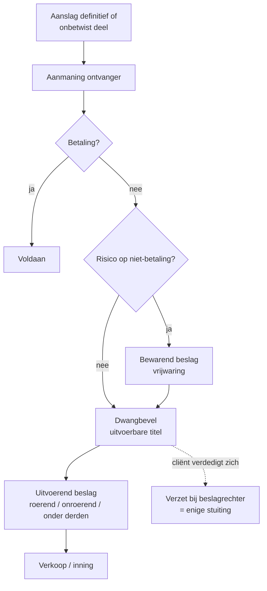

> **Leerstuk — één vraag, helemaal doorgewerkt.** Dit leerstuk speelt zich af nadat alles uit de vorige leerstukken al gepasseerd is: de aanslag is definitief (of er is een onbetwist deel) en de schuld blijft onbetaald. De logica draait nu om: hoe vordert de ontvanger in, en hoe verdedig je je cliënt tegen die tenuitvoerlegging? Bezwaar — het rechtsmiddel uit het vorige leerstuk — is hier niet meer het juiste instrument. Voor verhaal en routekaart: [[studiemateriaal/2-5|overzicht PO 2.5]].

## Antwoord in één blik

Wanneer de aanslag definitief is en niet (volledig) betaald wordt, start de **ontvanger** een invorderingscyclus: aanmaning → eventueel **bewarend beslag** ter vrijwaring → **dwangbevel** als uitvoerbare titel → **uitvoerend beslag** (drie types: roerend, onroerend, onder derden) → verkoop of inning. Het kohier vormt op zichzelf een uitvoerbare titel — geen rechterlijke uitspraak nodig.

Het scherpe onderscheid dat je paraat moet hebben: **bezwaar ≠ verzet.** Bezwaar is administratief en richt zich tegen de *aanslag* (bij de adviseur-generaal, termijn 1 jaar). **Verzet is gerechtelijk en richt zich tegen de *tenuitvoerlegging*** — bij de **beslagrechter** binnen typisch één maand vanaf de betekening van het dwangbevel. Wie tegen een dwangbevel bezwaar indient, kiest het verkeerde rechtsmiddel.

Eerst de invorderingscyclus + drie beslagtypes, dan het dwangbevel + verzet, dan kort hoofdelijkheid bestuurder en de geheime commissielonen-aanslag — twee specials die in invordering vaak opduiken.

---

## De invorderingscyclus — van aanmaning tot verkoop

De startsituatie: het aanslagbiljet is verstuurd, de betaaltermijn (typisch twee maanden) is verstreken zonder volledige betaling. De **ontvanger** — het lokale kantoor van de FOD Financiën dat instaat voor de inning — start nu de invordering. Eerst administratief, daarna dwingend.

**Stap 1 — Aanmaning.** Een schriftelijke betalingsherinnering. Geen beslagvatbaar instrument, alleen een administratief signaal: laatste kans op vrijwillige betaling of op een afbetalingsplan. Veel dossiers eindigen hier al — een belletje naar de ontvanger met een redelijk voorstel werkt vaker dan stagiairs denken.

**Stap 2 (parallel mogelijk) — Bewarend beslag.** Wanneer de ontvanger vreest voor risico op niet-betaling — vermogensaftakeling, vluchtgevaar, structurele insolventie — kan hij vóór er een uitvoerbare titel is **bewarend beslag** laten leggen op vermogensbestanddelen. Doel: vrijwaring, niet verkoop. De goederen worden vastgehouden, niet uitgewonnen. Vereist in beginsel een gerechtelijke machtiging.

Belangrijk: **een lopend bezwaar tegen de aanslag schorst de invordering niet voor het onbetwist deel.** De ontvanger kan dus, terwijl het bezwaar nog hangt, het onbetwist gebleven deel opeisen én bewarend beslag leggen ter vrijwaring van het betwist deel. Dat is precies wat in de De Vlieg-timeline gebeurt: terwijl de bezwaarprocedure loopt, legt de ontvanger bewarend beslag op de zichtrekening van de BV — niet voor verkoop, maar als vrijwaring.

**Stap 3 — Dwangbevel.** De ontvanger vaardigt op grond van het **kohier** een dwangbevel uit. Het kohier is op zichzelf al een uitvoerbare titel — geen rechterlijke uitspraak nodig. Het dwangbevel is het *vehikel* waarmee die titel geactiveerd wordt voor tenuitvoerlegging. Het wordt door een **gerechtsdeurwaarder betekend** aan de schuldenaar persoonlijk of aan zijn woonplaats. Vanaf de betekening — niet vanaf de vaardiging — loopt de verzettermijn.

Een dwangbevel bevat: identificatie schuldenaar, aanslagjaar, het verschuldigd bedrag opgesplitst (hoofdsom + nalatigheidsintresten + kosten), bevel tot betaling, en vermelding van de verzetmogelijkheid en termijn.

**Stap 4 — Uitvoerend beslag.** Op basis van het dwangbevel mag de deurwaarder nu uitvoerend beslag leggen. Drie types — die werk je in de volgende sectie uit.

**Stap 5 — Verkoop of inning.** Roerende goederen worden openbaar verkocht, onroerende goederen via een notaris. Bij beslag onder derden volgt geen verkoop — de derde (werkgever, bank, klant) stort het ingehouden bedrag rechtstreeks aan de ontvanger.

> **Praktijktip.** Een dwangbevel komt zelden onverwacht. Er gaat een aanmaning aan vooraf, en vaak meerdere herinneringen. Wanneer een cliënt belt met een aanmaning: drie sporen om te overwegen — (a) tijdig betalen of een afbetalingsplan onderhandelen; (b) als de aanslag onjuist is: bezwaar lopend houden plus expliciet verzoek tot opschorting van invordering; (c) bij dreigend dwangbevel: cashpositie evalueren en met de ontvanger spreken vóórdat het dwangbevel betekend wordt — daarna is de manoeuvreerruimte kleiner.

---

## De drie types beslag — roerend, onroerend, onder derden

Elke ondernemer stelt op een bepaald moment de vraag: *wat kan de fiscus eigenlijk doen?* Het antwoord ligt in drie beslagtypes, met elk een eigen doel, een eigen procedure en eigen beperkingen.

| Type beslag | Doel | Wat wordt belast? | Beperkingen |
|---|---|---|---|
| **Beslag op roerende goederen** | Verkoop ter aanzuivering van de belasting | Inboedel, machines, voertuigen, voorraad, geldsommen | **Onontvreemdbare goederen** blijven buiten beslag — kledij, gewoon huisraad, werktuig nodig voor beroep |
| **Beslag op onroerende goederen** | Openbare verkoop via notaris | Woning, gebouwen, gronden | Bescheidene eigen woning blijft typisch buiten schot bij een eerste aanslag; bij grotere schulden mogelijk |
| **Beslag onder derden** | Directe inning via een derde-schuldenaar | Loon (werkgever) · banksaldo · klant-vorderingen · huur | **Loonbescherming** via beslagdrempels in het Gerechtelijk Wetboek — minimum-inkomen blijft beschermd |

### Beslag onder derden — de meest voorkomende vorm

In de praktijk is **beslag onder derden** verreweg het meest gebruikte instrument tegen KMO's en zelfstandigen. Het werkt discreet (geen deurwaarder die de inboedel komt opmeten), snel (geen verkoopprocedure nodig), en raakt zelden de operationele werking. Drie typische varianten:

**Bij de bank.** De ontvanger betekent een vereenvoudigd derdenbeslag aan de bank. De bank moet binnen vijftien dagen aangeven welke saldi de cliënt heeft en die vasthouden voor de fiscus. In praktijk verliest de cliënt op datzelfde moment de toegang tot zijn rekening — vandaar dat ondernemers vaak al bij een *bewarend* beslag financieel verlamd raken, ook al is dat formeel maar vrijwaring.

**Bij de werkgever** (voor de persoonlijke belastingschulden van bijvoorbeeld een zaakvoerder of werknemer). De werkgever moet de beslagdrempels respecteren: een minimum-bedrag blijft altijd beschermd. Voor hogere lonen kan een aanzienlijk deel worden ingehouden.

**Bij klanten van het bedrijf.** De ontvanger betekent derdenbeslag aan grote klanten — die mogen dan niet meer aan het bedrijf betalen, maar moeten de bedragen rechtstreeks aan de ontvanger storten. Effect op de cashflow: dramatisch. Vaak het einde van de feitelijke activiteit.

> **Aside — beslag onder derden is sterker dan beslag op zaken.** Het werkt onmiddellijk, vereist geen verkoop, en heeft een belangrijke ontradende werking. Voor de accountant betekent dat: bij een dreigend dwangbevel altijd eerst de cashpositie nakijken en, als die marginaal is, onderhandelen over een afbetalingsplan vóórdat het dwangbevel betekend wordt. Eens betekend, is het derdenbeslag op een klantenportefeuille moeilijk terug te draaien.

---

## Het dwangbevel — uitvoerbare titel zonder rechter

De eigenaardigheid van het dwangbevel ligt in iets dat in het Belgische schuldvorderingsrecht uitzonderlijk is: er komt **geen rechter** aan te pas. Bij een privaatrechtelijke schuldvordering heeft de schuldeiser bijna altijd eerst een vonnis nodig vóór hij kan uitvoeren. De fiscus niet. Het kohier — de ingeschreven aanslag — vormt op zichzelf een uitvoerbare titel.

Het dwangbevel is dus geen *creatie* van uitvoerbaarheid, maar de *activering* ervan. De ontvanger ondertekent het dwangbevel, de gerechtsdeurwaarder betekent het, en vanaf dat moment kan de deurwaarder uitvoeren — beslag leggen, openbaar verkopen, inning bij derden.

Twee gevolgen voor de praktijk. **Eén** — de termijnen lopen kort. Vanaf de betekening heeft de cliënt typisch één maand om verzet aan te tekenen; daarna gaat de tenuitvoerlegging gewoon door. **Twee** — er zijn maar weinig mechanismen om de tenuitvoerlegging te stuiten. Bezwaar tegen de onderliggende aanslag (zie het [[bezwaar-bemiddeling-en-gerechtelijke-fase|vorige leerstuk]]) helpt hier niet — dat richt zich tegen de aanslag, niet tegen het dwangbevel. De enige stuiting is een vordering in rechte bij de beslagrechter — verzet.

---

## Verzet bij de beslagrechter — de enige stuiting

Een dwangbevel kan niet ongedaan worden gemaakt door bezwaar. Bezwaar gaat over de *aanslag*, niet over de *tenuitvoerlegging*. De enige manier waarop de cliënt de tenuitvoerlegging kan aanvechten, is een **vordering in rechte bij de beslagrechter**.

**Wat is de beslagrechter?** Een specifieke functie binnen de rechtbank van eerste aanleg. De beslagrechter is bevoegd voor alle geschillen over uitvoerend en bewarend beslag, dwangbevelen, en andere maatregelen van tenuitvoerlegging. Het is geen aparte rechtbank, maar een aangewezen rechter binnen de eerste aanleg.

**Termijn.** Typisch één maand vanaf de betekening van het dwangbevel. Veel korter dan de bezwaartermijn van één jaar — invordering staat onder tijdsdruk, en de wetgever wil dat tenuitvoerleggingsbetwistingen snel uitgeklaard worden.

**Welke gronden mag je inroepen?** Verzet gaat over de *procedure* en de *titel*, niet over de inhoudelijke juistheid van de aanslag. Klassieke gronden:

- **Vormgebreken** in het dwangbevel — geen handtekening van een bevoegd ontvanger, foute identificatie schuldenaar, foute bedragen, geen vermelding van de verzetmogelijkheid
- **Onregelmatige betekening** door de deurwaarder — verkeerde woonplaats, foutieve persoon, formele tekorten in het exploot
- **Verjaring van de invordering** — de invorderingstermijn voor fiscale schuldvorderingen is begrensd; een dwangbevel buiten die termijn is aanvechtbaar
- **Dubbele invordering** of inning van bedragen die niet (meer) verschuldigd zijn

**Wat hoort hier NIET thuis?** De inhoudelijke betwisting van de aanslag zelf. Stel: de cliënt vindt dat de fiscus de aftrek had moeten toestaan, of dat een bestanddeel niet belastbaar is. Dat zijn bezwaargronden, niet verzetgronden. Wie ze toch in verzet inbrengt, riskeert dat de beslagrechter zich onbevoegd verklaart of de vordering ongegrond verklaart.

**Schort verzet de tenuitvoerlegging?** Niet automatisch. De beslagrechter *kan* op verzoek opschorting verlenen, maar verzet op zichzelf belet de ontvanger niet om beslag te blijven leggen tijdens de procedure. Praktijktip: vraag in de inleidende dagvaarding **expliciet** om opschorting — anders gaat de invordering gewoon door terwijl je voor de beslagrechter pleit.

> **Aside — twee parallelle sporen zijn niet uitzonderlijk.** Een dossier kan tegelijk inhoudelijk fout zijn (de aanslag deugt niet → bezwaar) én procedureel onregelmatig (het dwangbevel heeft een vormgebrek → verzet). Strategisch is dat zelfs aanbevolen: het sterkste argument loopt langs het juiste spoor, het zwakkere argument langs het andere. Je verliest niets en wint een tweede kans.

---

## Hoofdelijkheid van de bestuurder — een uitzondering op de rechtspersoonlijkheid

Een zaakvoerder die in de problemen komt, stelt vaak de vraag waar elke ondernemer 's nachts wakker van ligt: *als mijn vennootschap de belasting niet kan betalen, kan de fiscus dan bij mij persoonlijk aankloppen?* In beginsel niet — de rechtspersoonlijkheid scheidt het vermogen van de vennootschap van dat van de bestuurder. Maar er bestaan uitzonderingen, en de fiscale invordering kent er één heel belangrijke.

Voor **bedrijfsvoorheffing** en **btw** geldt een hoofdelijke aansprakelijkheid van de bestuurder of zaakvoerder. Drie voorwaarden moeten samen vervuld zijn:

- De vennootschap is in gebreke met betaling van bedrijfsvoorheffing of btw
- Er is een **fout of tekortkoming** aan te tonen bij de bestuurder — niet louter het feit dat de vennootschap niet betaalt, maar een verwijtbaar handelen of nalaten (herhaalde niet-betaling, geen aangifte, gebrek aan inning bij klanten, prioriteit aan andere schulden terwijl BV en btw verwaarloosd worden)
- De bestuurder was in functie tijdens de relevante periode

De bewijslast voor de fout of tekortkoming rust bij de **administratie**. Louter de vaststelling dat de vennootschap niet betaald heeft, volstaat niet — vaste cassatierechtspraak onderstreept dat punt.

**Strategische implicatie.** Bij financiële moeilijkheden van de vennootschap heeft het betalen van bedrijfsvoorheffing en btw **voorrang** boven andere schuldeisers — niet uit fiscaal-technische, maar uit *persoonlijke* overwegingen voor de bestuurder. Wie zijn BV laat uitstaan ten gunste van bijvoorbeeld leveranciers, vergroot het risico dat de fiscus bij faillissement de bestuurder hoofdelijk aanspreekt.

Voor de algemene bestuurdersaansprakelijkheid in faillissementscontext — wanneer is er sprake van een "kennelijk grove fout" die tot faillissement heeft bijgedragen — zie [[studiemateriaal/3-0|PO 3.0]]. De fiscale hoofdelijkheid werkt onafhankelijk van faillissement: de fiscus kan al vorderen vóór de boedel zelfs maar betrokken is. Het concept [[bestuurdersaansprakelijkheid]] geeft de definitie.

---

## Geheime commissielonen-aanslag — kort, want PO 2.3 doet de inhoud

In invorderingscontext duikt de geheime commissielonen-aanslag opvallend vaak op, om twee redenen: de aanslag is snel eisbaar (geen lange bericht-van-wijziging-cyclus vereist als de bedragen vaststaan), en het tarief is hoog. Twee tarieven, afhankelijk van de identificatie van de begunstigde:

- **50%** wanneer de verkrijger een rechtspersoon is
- **100%** in alle andere gevallen (de restcategorie — typisch wanneer de begunstigde een natuurlijke persoon is en niet tijdig geïdentificeerd werd)

Daarnaast bestaat een veiligheidsklep: als de vennootschap de bedragen alsnog op een individuele fiche aangeeft binnen een door de wet bepaalde termijn (doorgaans twee jaar en zes maanden vanaf de toekenning van het voordeel), kan de aanslag vermeden worden.

**Voor invordering relevant.** Geheime commissielonen-aanslagen worden snel definitief en gaan dan vlot in invordering. Het tarief verhoogt de hoofdsom aanzienlijk, en daarbovenop komen nog nalatigheidsintresten en eventueel een belastingverhoging. Een schuld van enkele tienduizenden euro kan in dwangbevelfase oplopen tot het dubbele.

De materiële inhoud — wanneer is een uitgave een "geheim commissieloon", welke vrijstellingen bestaan, hoe vermijd je dat een legitieme kost gekwalificeerd wordt — zit in [[studiemateriaal/2-3|PO 2.3]]. Hier alleen de procedurele plaatsing. Voor de definitie: [[geheime-commissielonen]].

---

## Bezwaar ≠ verzet — de kern-leertabel

Het onderscheid bezwaar–verzet is de examen-klassieker van dit programmaonderdeel. In de minicursus en in het [[bezwaar-bemiddeling-en-gerechtelijke-fase|vorige leerstuk]] kwam het al voorbij; hier de definitieve tabel.

| Aspect | Bezwaar | Verzet |
|---|---|---|
| **Karakter** | Administratief beroep | Gerechtelijke vordering |
| **Tegen wat?** | De aanslag (het kohier / aanslagbiljet) | De tenuitvoerlegging (dwangbevel, beslag) |
| **Bij wie?** | Adviseur-generaal van de fiscale administratie | Beslagrechter (rechtbank van eerste aanleg) |
| **Termijn (federaal)** | 1 jaar vanaf 3de werkdag na verzending aanslagbiljet | Typisch 1 maand vanaf betekening dwangbevel |
| **Welke gronden?** | Inhoudelijke betwisting van de belasting (te hoog, niet verschuldigd, foute kwalificatie) | Vormgebreken dwangbevel · verjaring invordering · onregelmatige betekening · dubbele invordering |
| **Werking op invordering** | Geen schorsing — onbetwist deel blijft opeisbaar; bewarend beslag mogelijk | Geen automatische schorsing — beslagrechter kan op verzoek opschorting toestaan |
| **Effect bij succes** | Aanslag vermindert of vervalt | Dwangbevel vervalt of wordt geschorst; aanslag blijft (vereist apart bezwaar) |

Cruciaal punt onderaan de tabel: een succesvol verzet ruimt het dwangbevel op, niet de onderliggende aanslag. Wie alleen verzet wint, krijgt mogelijk een nieuw — correct opgesteld — dwangbevel terug. Wie *zowel* bezwaar als verzet wint, is van beide kanten af.

---

## Drie valkuilen

⚠️ **Bezwaar indienen tegen een dwangbevel.** Het verkeerde rechtsmiddel. Bezwaar is administratief en gaat over de aanslag; tegen een dwangbevel is verzet bij de beslagrechter het correcte middel. Een bezwaarschrift dat de bezwaartermijn ingaat tegen een dwangbevel is onontvankelijk — en intussen tikt de verzettermijn van één maand door.

⚠️ **Denken dat de bestuurder onaantastbaar is achter de rechtspersoonlijkheid.** Voor bedrijfsvoorheffing en btw geldt een hoofdelijke aansprakelijkheid bij aantoonbare fout of tekortkoming. Bij financiële moeilijkheden van de vennootschap moet de zaakvoerder **bedrijfsvoorheffing en btw prioriteren** om persoonlijk vermogen te beschermen — niet de leveranciers of de RSZ-achterstand wegwerken terwijl de fiscale schulden oplopen.

⚠️ **De totale invorderingsschuld onderschatten.** Een aanmaning of dwangbevel werkt nooit alleen op de hoofdsom. Invordering omvat hoofdsom + nalatigheidsintresten + (eventueel) belastingverhoging + boete + deurwaarderskosten. Bij een aanslag van 20.000 EUR met 50% belastingverhoging en twee jaar intresten zit je al snel boven 35.000 EUR. Aan cliënten: toon de **totale schuld**, niet alleen de aanslag.

---

## Wanneer je dit snapt, ga dan naar

- [[bezwaar-bemiddeling-en-gerechtelijke-fase]] — voor de andere kant van het onderscheid bezwaar ≠ verzet: bezwaar tegen de aanslag.
- [[wat-is-fiscale-procedure-en-aanslagcyclus]] — voor de gehele timeline van aangifte tot invordering, met invordering als derde fase.
- [[taxatie-bericht-van-wijziging-en-ambtshalve-aanslag]] — voor de oorsprong: belastingverhoging en boete die in invordering meelopen.
- [[controle-onderzoek-en-bewijs]] — voor de aanloop: onderzoek en bewijs als verre oorsprong van de uiteindelijk gevorderde schuld.
- [[studiemateriaal/3-0|PO 3.0]] — voor bestuurdersaansprakelijkheid in faillissementscontext, naast de fiscale hoofdelijkheid die hier behandeld is.

## Doorklik naar concepten

Voor wie definitorisch detail wil opzoeken:

- [[invorderingsprocedure]] · [[bestuurdersaansprakelijkheid]]
- [[geheime-commissielonen]] · [[fiscale-sancties]]

---

## Wettelijk fundament

- Dwangbevel als uitvoerbare titel: Wetboek van de minnelijke en gedwongen invordering van fiscale en niet-fiscale schuldvorderingen (1.1.2020), art. 13. Federaal wetboek dat verspreide invorderingsregels uit WIB en WBTW bundelt.
- Verjaring invordering: Wetboek Invordering 2020, art. 23. Vijf jaar vanaf het definitief worden van de aanslag; gestuit door dwangbevel of door regelmatige betalingsherinnering.
- Kohier als uitvoerbare titel: WIB92 art. 297-298.
- Bezwaar schorst de invordering niet: WIB92 art. 410 (federaal); voor gewestelijke belastingen analoog in VCF art. 3.4.2.0.3 (Vlaanderen) en art. 34 + 105 Brusselse Codex Fiscale Procedure. Onbetwist deel blijft opeisbaar; bewarend beslag mogelijk op het betwist deel.
- Hoofdelijkheid bestuurder voor bedrijfsvoorheffing + btw: Wetboek Invordering 2020 art. 51 (overgenomen uit het vroegere WIB92 art. 442quater + parallel-bepaling btw). Vereist een fout of tekortkoming aan de zijde van de bestuurder; bewijslast bij administratie. Cross-PO doorklik [[studiemateriaal/3-0|PO 3.0]] voor bestuurdersaansprakelijkheid in ruimere context.
- Geheime commissielonen-aanslag: WIB92 art. 219 — tarief 50% (verkrijger rechtspersoon) of 100% (restcategorie). Identificatie van de begunstigde op individuele fiche binnen de wettelijk bepaalde termijn kan de aanslag vermijden. Materiële inhoud: cross-PO [[studiemateriaal/2-3|PO 2.3]].
- Beslagrechter — bevoegdheid voor tenuitvoerleggingsgeschillen + verzet tegen dwangbevel: Gerechtelijk Wetboek art. 1395 e.v. Verzettermijn typisch één maand vanaf betekening dwangbevel; geen automatische schorsing van tenuitvoerlegging.
- Onontvreemdbare goederen — beslagvrije sfeer: Gerechtelijk Wetboek art. 1408 (kledij, gewoon huisraad, werktuig nodig voor beroep).
- Loonbescherming bij derdenbeslag: Gerechtelijk Wetboek art. 1409 (beslagdrempels — minimum-inkomen beschermd).
- Bewarend beslag — algemene regels: Gerechtelijk Wetboek art. 1413 e.v. Vereist in beginsel gerechtelijke machtiging; doel is vrijwaring vóór er een uitvoerbare titel is.

Drempels en tarieven (beslagdrempels Ger.W. 1409, nalatigheidsintresten, kosten deurwaarder): zie het Cijferzakboekje — niet hardcoden.

---

*Leerstuk PO 2.5. Status: voorgesteld — POC volgens ADR-037.*
