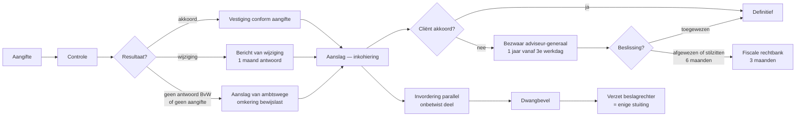
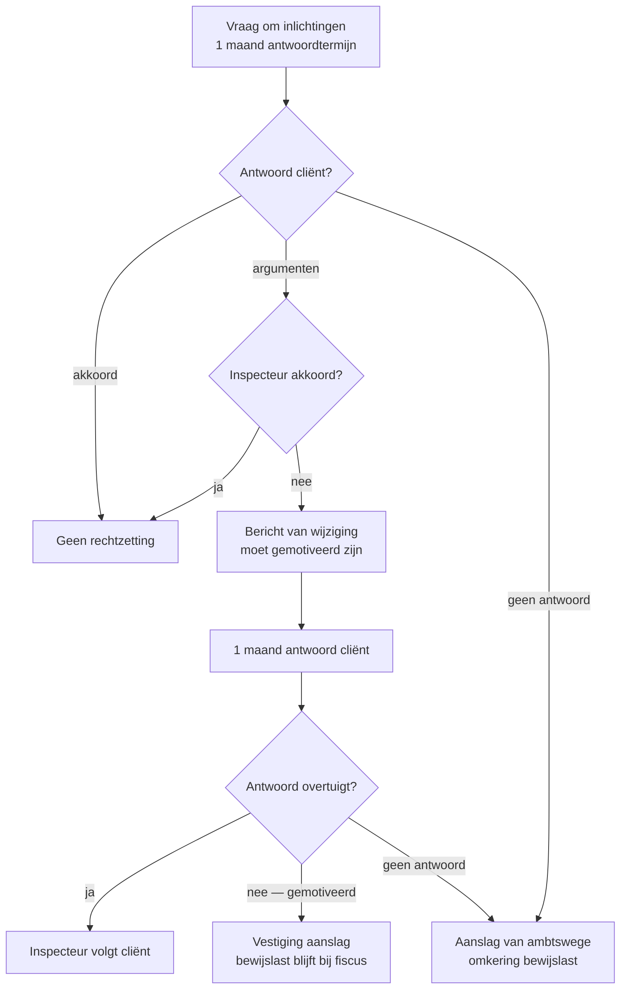
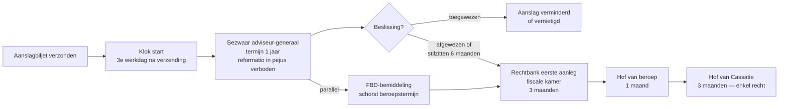
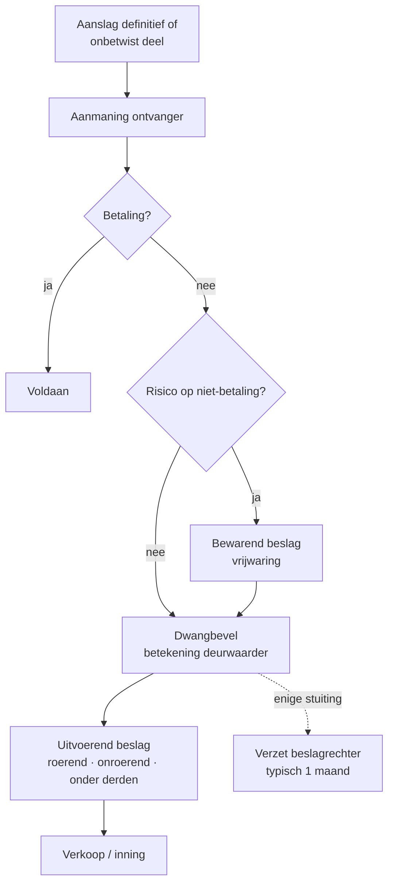

> **Samenvatting — kapstok voor herhaling.** Procedure-PO over termijnen, rechten van verdediging en de twee scharniermomenten waarop de cliënt belt. Deze samenvatting bundelt de timeline (drie fases), de federale termijntabel, de zes onderzoeksbevoegdheden, het BvW-scharnier, de bezwaar-cascade, de invorderings-cyclus en het kern-onderscheid bezwaar ≠ verzet. Voor verhaal en routekaart: [[studiemateriaal/2-5|overzicht PO 2.5]].

## 1. Take-away — wat je écht moet weten

- **De fiscale procedure is geen sequentie, het zijn drie parallelle sporen.** Taxatie · betwisting · invordering kunnen voor dezelfde aanslag tegelijk lopen. Bezwaar schorst de invordering NIET — het onbetwist deel blijft opeisbaar en de ontvanger kan bewarend beslag leggen op het betwist deel. Wie alleen aan bezwaar denkt en het invorderingsspoor negeert, wordt verrast door een deurwaarder.
- **Twee scharniermomenten, géén andere.** Bij ontvangst van een **bericht van wijziging** (1 maand antwoord) en bij ontvangst van een **aanslagbiljet** (1 jaar bezwaar) belt de cliënt. Andere brieven kunnen wachten. Bij elke nieuwe brief: welk soort? welke verzenddatum? welke aanslag? Daarna pas inhoudelijk advies.
- **De termijnklok start zelden waar je denkt.** Niet bij ontvangst, niet bij datum op het biljet — bij de **3e werkdag na verzending**. Weekends en wettelijke feestdagen tellen niet mee. MCQ-strikvraag in elk examen. Een biljet verstuurd op donderdag 7 augustus laat de klok starten op dinsdag 12 augustus.
- **Niet antwoorden = bewijslast omkeren.** Geen antwoord op een vraag om inlichtingen of op een BvW geeft de fiscus het recht ambtshalve te taxeren. Het gevolg dat zwaarder weegt dan de aanslag zelf: de bewijslast keert om — de cliënt moet in bezwaar bewijzen dat de cijfers van de fiscus onjuist zijn. Altijd antwoorden, ook gedeeltelijk, ook te laat.
- **Bezwaar ≠ verzet — het examen toetst dit elke keer.** Bezwaar gaat tegen de aanslag, bij de adviseur-generaal, federaal binnen 1 jaar. Verzet gaat tegen het dwangbevel, bij de beslagrechter, binnen typisch 1 maand. Een bezwaarschrift tegen een dwangbevel is onontvankelijk — en intussen tikt de verzettermijn van 1 maand door.
- **Reformatio in pejus verboden — bezwaar is laag-risico.** De adviseur-generaal mag de aanslag op bezwaar handhaven, verminderen of vernietigen, maar NIET verhogen. Slechter af dan vandaag kan de cliënt op bezwaar niet worden. Bij twijfel over de aanslag: bezwaar indienen is het verstandige advies.

## 2. Timeline fiscale procedure — drie fases, twee scharniermomenten

Aangifte → controle → taxatie → bezwaar → rechter → invordering. De drie fases lopen parallel, niet sequentieel: invordering start zodra de aanslag definitief is op het onbetwist deel, ook als er bezwaar loopt. Voor uitwerking: [[wat-is-fiscale-procedure-en-aanslagcyclus]].

## 3. Termijntabel federaal — het hart van het PO

### Aanslag- en onderzoekstermijnen

| Wat | Termijn | Wetbron | Valkuil |
|---|---|---|---|
| **Aanslag directe belastingen** — regelmatige aangifte | **3 jaar** vanaf 1 januari aanslagjaar | WIB92 art. 354 §1 lid 1 | Sinds Wet 20.11.2022 (AJ ≥ 2023) |
| Idem — niet-aangifte of laat | **4 jaar** | WIB92 art. 354 §1 lid 2 | — |
| Idem — complexe aangifte (lokaal dossier, landenrapport) | **6 jaar** | WIB92 art. 354 §1 lid 2-3 | Nieuw sinds Wet 20.11.2022 |
| Idem — fraude | **10 jaar** | WIB92 art. 354 §1 lid 4 | Voorafgaande kennisgeving aanwijzingen vereist (art. 333 derde alinea) |
| Verlenging bij BvW op nakende verjaring | **+ 6 maanden** vanaf antwoord of vervaldag | WIB92 art. 354 §1 lid 4 (in fine) | Redt aanslag bij dreigende verjaring |
| **Aanslag btw** | **3 / 4 / 7 jaar** | WBTW art. 81bis | Geen 10-jaars-regel; geen 'altijd 7 jaar' |
| Bijzondere termijn — buitenlandse inlichtingen DBV | **24 maanden** vanaf kennisname | WIB92 art. 358 §1 2° | Foute MCQ-optie: '12 maanden' |

### Antwoord- en bezwaartermijnen

| Wat | Termijn | Wetbron | Valkuil |
|---|---|---|---|
| Antwoord cliënt op **vraag om inlichtingen** | **1 maand** vanaf 3e werkdag | WIB92 art. 316 | Verlengbaar op gemotiveerd verzoek vóór vervaldag |
| Antwoord vraag aan **derden** | **Geen wettelijk minimum** | WIB92 art. 323 | Vaak 10 dagen — onregelmatig bij overmacht |
| Antwoord cliënt op **BvW** | **1 maand** vanaf 3e werkdag | WIB92 art. 346 | Verlengbaar; niet-antwoord = ambtshalve aanslag |
| **Bezwaar** directe belastingen (federaal) | **1 jaar** vanaf 3e werkdag na verzending aanslagbiljet | WIB92 art. 371 | NIET 6 maanden; NIET vanaf datum biljet of ontvangst |
| Vordering rechtbank na directeursbeslissing | **3 maanden** vanaf kennisgeving | Ger.W. art. 1385undecies | — |
| **Fictieve afwijzing** — rechtstreeks naar rechtbank | Na **6 maanden** stilzwijgen (9 mnd bij ambtshalve) | Ger.W. art. 1385undecies | Klok start bij indiening bezwaar |
| Hoger beroep tegen vonnis rechtbank | **1 maand** vanaf betekening | Ger.W. | — |
| Cassatie tegen arrest hof van beroep | **3 maanden** vanaf betekening | Ger.W. | Enkel rechtsvragen, niet feiten |
| **Verzet tegen dwangbevel** | Typisch **1 maand** vanaf betekening | Ger.W. art. 1395 e.v. | Bij beslagrechter — NIET bij adviseur-generaal |
| **Ambtshalve ontheffing** — materiële vergissing | **5 jaar** vanaf 1 januari aanslagjaar | WIB92 art. 376 | Vangnet buiten bezwaartermijn |

### Bewaarplicht — drie parallelle regimes

| Stukken | Termijn | Wetbron |
|---|---|---|
| Boekhoudkundige stukken — minimum-floor | **7 jaar** | WER art. III.86 |
| Boeken en bescheiden voor WIB (incl. bestelbonnen, contracten, e-mails) | **10 jaar** (sinds AJ 2023) | WIB92 art. 315 |
| Facturen + onderliggende stukken btw | **10 jaar** (sinds 2023) | WBTW art. 60 |

> **Noot.** Klassieker — bestelbonnen weggooien na 7 jaar = fout. Ze ondersteunen de fiscale verantwoording en vallen onder de 10-jaars-fiscale termijn. Weggooien in jaar 8 = verzwaard bewijsstuk + ambtshalve aanslag.

## 4. Zes onderzoeksbevoegdheden — wat mag de fiscus?

Gesloten lijst — alles wat niet in deze zes past is verboden of vereist rechterlijke machtiging. Tegenover elk gereedschap een wettelijke grens; overschrijden = bewijs aanvechtbaar + aanslag aanvechtbaar. Voor uitwerking: [[controle-onderzoek-en-bewijs]].

| Bevoegdheid | Wetbron | Termijn / grens | Gevolg weigering |
|---|---|---|---|
| **Boeken en bescheiden** opvragen / inzien | WIB92 art. 315 | Bewaarplicht 10 jaar; voorleggen zonder verplaatsing | Verzwaard bewijsstuk + ambtshalve aanslag + omkering bewijslast |
| **Vraag om inlichtingen** aan cliënt | WIB92 art. 316 | 1 maand vanaf 3e werkdag; geen algemeen onderzoek | Ambtshalve aanslag + boete |
| **Controle ter plaatse** | WIB92 art. 319 | Beroepslokalen tijdens werkuren; privé-woning vereist **machtiging politierechter** (§ 3) | Verhinderen = boete + ambtshalve aanslag |
| **Vraag aan derden** (klanten, leveranciers) | WIB92 art. 322 + 323 | Geen wettelijk minimum, mits redelijk; beroepsgeheim als grens | Derde aansprakelijk |
| **Bankgeheim** doorbreken via CAP | WIB92 art. 322 §2 + 333/1 | Aanwijzingen ontduiking vereist; voorafgaande kennisgeving via aangetekende brief | Bewijs onbruikbaar zonder kennisgeving |
| **Onderzoek in fraude-termijn** (verlengd) | WIB92 art. 333 derde alinea | Voorafgaande schriftelijke + nauwkeurige kennisgeving van aanwijzingen | Aanslag nietig — onderzoek nietig |

> **Noot.** Vier bewijsmiddelen voor de rechtzetting: **gemeen recht** (art. 339-340) · **tekenen en indiciën** (art. 341) · **vergelijking soortgelijke belastingplichtigen** (art. 342) · **antimisbruik-herkwalificatie** (art. 344 §1). Cumuleerbaar. Bewijslast bij fiscus — tenzij ambtshalve aanslag: dan omkering naar cliënt.

## 5. BvW-flow — drie wegen uit het onderzoek

Het scharniermoment. De fiscus kiest tussen aanvaarding · bericht van wijziging · ambtshalve aanslag. Welke weg bepaalt of de bewijslast bij de fiscus blijft of omkeert. Voor uitwerking: [[taxatie-bericht-van-wijziging-en-ambtshalve-aanslag]].

## 6. Bezwaar-cascade — administratief, gerechtelijk, cassatie

Drie schakels na een gevestigde aanslag. Bezwaar is **toegangsvoorwaarde** voor de rechter — zonder voorafgaand bezwaar geen rechtbank. FBD-bemiddeling loopt parallel en schorst de beroepstermijn naar de rechtbank. Voor uitwerking: [[bezwaar-bemiddeling-en-gerechtelijke-fase]].

## 7. Invorderings-cyclus — aanmaning tot verkoop

Het kohier is op zichzelf een uitvoerbare titel — geen rechter nodig. Het dwangbevel is het *vehikel* dat die titel activeert via betekening door de gerechtsdeurwaarder. Bezwaar tegen de aanslag schorst dit spoor NIET. Voor uitwerking: [[invordering-en-verzet-tegen-dwangbevel]].

## 8. Bezwaar ≠ verzet — de kern-leertabel

Examen-klassieker bij uitstek. Twee verschillende rechtsmiddelen, twee verschillende instanties, twee verschillende termijnen, twee verschillende effecten. Verwarring kost een termijn of een rechtsmiddel.

| Aspect | **Bezwaar** | **Verzet** |
|---|---|---|
| **Karakter** | Administratief beroep | Gerechtelijke vordering |
| **Tegen wat?** | De aanslag (kohier / aanslagbiljet) | De tenuitvoerlegging (dwangbevel, beslag) |
| **Bij wie?** | Adviseur-generaal AAFisc | Beslagrechter (rechtbank eerste aanleg) |
| **Termijn (federaal)** | **1 jaar** vanaf 3e werkdag na verzending aanslagbiljet | Typisch **1 maand** vanaf betekening dwangbevel |
| **Welke gronden?** | Inhoudelijke betwisting belasting (te hoog, foute kwalificatie) | Vormgebreken dwangbevel · verjaring invordering · onregelmatige betekening |
| **Werking op invordering** | Geen schorsing — onbetwist deel blijft opeisbaar; bewarend beslag mogelijk | Geen automatische schorsing — beslagrechter kan op verzoek toestaan |
| **Effect bij succes** | Aanslag vermindert of vervalt | Dwangbevel vervalt; aanslag blijft (vereist apart bezwaar) |

> **Noot.** Een dwangbevel kan inhoudelijk fout zijn én procedureel onregelmatig — dan twee parallelle sporen tegelijk: bezwaar (tegen aanslag) bij adviseur-generaal én verzet (tegen tenuitvoerlegging) bij beslagrechter. Niet uitzonderlijk; strategisch aanbevolen wanneer beide gronden serieus zijn.

## 9. Klassieke valkuilen (examen-radar)

| Valkuil | Wat klopt er niet | Wat klopt wél |
|---|---|---|
| Federale bezwaartermijn op 6 maanden zetten | Verouderde cursussen + sommige stale concept-records vermelden nog 6 maanden | **1 jaar** vanaf 3e werkdag na verzending (WIB92 art. 371). Wie 6 maanden hanteert, halveert de bezwaarruimte van de cliënt nodeloos. Verschijnt vrijwel altijd als foute MCQ-optie. |
| Termijnklok laten starten op datum biljet of ontvangstdatum | Stagiairs rekenen instinctief vanaf 'datum op de brief' of 'ontvangst' | **3e werkdag na verzending**. Werkdagen, geen kalenderdagen — weekends en feestdagen tellen niet mee. Biljet verstuurd op donderdag 7 augustus = klok start dinsdag 12 augustus. |
| Bezwaar indienen tegen een dwangbevel | Bezwaar en verzet klinken vergelijkbaar — verwarring is een examen-klassieker | Bezwaar = administratief, tegen aanslag, bij adviseur-generaal, 1 jaar. **Verzet** = gerechtelijk, tegen dwangbevel, bij **beslagrechter**, typisch 1 maand. Verkeerd rechtsmiddel = onontvankelijk én intussen verstrijkt de verzettermijn. |
| Denken dat bezwaar de invordering schorst | Cliënt indient bezwaar, voelt zich veilig, betaalt het onbetwist deel niet | Bezwaar schorst NIET. Onbetwist deel blijft opeisbaar; ontvanger kan bewarend beslag leggen op het betwist deel (WIB92 art. 410). Drie sporen meedenken: bezwaar · opschorting vragen · onbetwist deel tijdig betalen. |
| 'Altijd 7 jaar btw' | Verspreid misverstand dat btw-verjaring altijd 7 jaar zou zijn | Btw differentieert (WBTW art. 81bis): **3 jaar** regelmatig · **4 jaar** laat/niet · **7 jaar** fraude (met voorafgaande kennisgeving). Geen 10-jaars-regel zoals WIB. Voor een regelmatig ingediende btw-aangifte 2018 is de bevoegdheid sinds 2022 verjaard. |
| Niet antwoorden op vraag om inlichtingen of BvW = tijdrekken | Stilzitten lijkt veilig of strategisch | Geen antwoord = aanslag van ambtswege + **omkering bewijslast**. De zwaarste procedurele sanctie. Cliënt verschuift van 'fiscus moet bewijzen' naar 'cliënt moet bewijzen'. Altijd antwoorden — ook gedeeltelijk, ook te laat — beter dan ambtshalve. |
| Bestuurder is onaantastbaar achter rechtspersoonlijkheid | 'Mijn BV moet betalen, niet ik persoonlijk' | Voor **bedrijfsvoorheffing + btw** geldt hoofdelijke aansprakelijkheid bij aantoonbare fout of tekortkoming (Wetboek Invordering 2020 art. 51). Bij financiële moeilijkheden: BV-betalingen en btw **prioriteren** boven andere schuldeisers — anders persoonlijk vermogen in gevaar. |

## 10. Verdieping

### Leerstukken — voor pedagogische opfris

Werkt iets niet meer scherp? Klik door naar het leerstuk dat het uitwerkt:

- [[wat-is-fiscale-procedure-en-aanslagcyclus]] — timeline + drie fases (taxatie · betwisting · invordering) + twee scharniermomenten + drie wetboeken (WIB92 · WBTW · W.Inv. 2020)
- [[controle-onderzoek-en-bewijs]] — zes onderzoeksbevoegdheden + aanslagtermijnen 3/4/6/10 jaar + vier bewijsmiddelen + bewaarplicht 10 jaar fiscaal vs 7 jaar boekhoudkundig
- [[taxatie-bericht-van-wijziging-en-ambtshalve-aanslag]] — drie wegen (aanvaarding · BvW · ambtshalve) + BvW-vorm + antwoord-strategie + omkering bewijslast + BvW-verlenging 6 maanden + sanctie-laag
- [[bezwaar-bemiddeling-en-gerechtelijke-fase]] — bezwaartermijn 1 jaar + reformatio in pejus verboden + fictieve afwijzing 6 maanden + FBD-schorsing + rechtbank → hof → cassatie
- [[invordering-en-verzet-tegen-dwangbevel]] — invorderingscyclus + drie beslagtypes + dwangbevel als uitvoerbare titel + verzet bij beslagrechter + hoofdelijkheid bestuurder + geheime commissielonen

### Concept-fiches — voor definitorisch detail

Voor wie een wettekst-pointer of nauwkeurige definitie zoekt:

**Kader en cyclus** — [[fiscale-procedure]] · [[aanslag-cyclus]] · [[fiscale-actoren]] · [[aangifteplicht]] · [[aanslagbiljet-pb]]

**Controle en bewijs** — [[fiscale-controle]] · [[aanslagtermijnen]] · [[fiscale-bewijsmiddelen]] · [[beginselen-behoorlijk-bestuur]]

**Taxatie en sancties** — [[taxatieprocedure]] · [[fiscale-sancties]] · [[geheime-commissielonen]]

**Bezwaar en gerechtelijke fase** — [[bezwaarprocedure]] · [[fiscale-bemiddelingsprocedure]] · [[gerechtelijke-fase-belasting]]

**Invordering** — [[invorderingsprocedure]] · [[bestuurdersaansprakelijkheid]]

---

*Samenvatting PO 2.5. Status: voorgesteld — POC volgens ADR-039. Alle wets-claims (bezwaartermijn 1 jaar, aanslagtermijnen 3/4/6/10, btw 3/4/7, bewaarplicht 10/10/7, hoofdelijkheid bestuurder art. 51 W.Inv. 2020) door leerstuk-renders bevestigd; geen MCP-calls in render-fase.*
