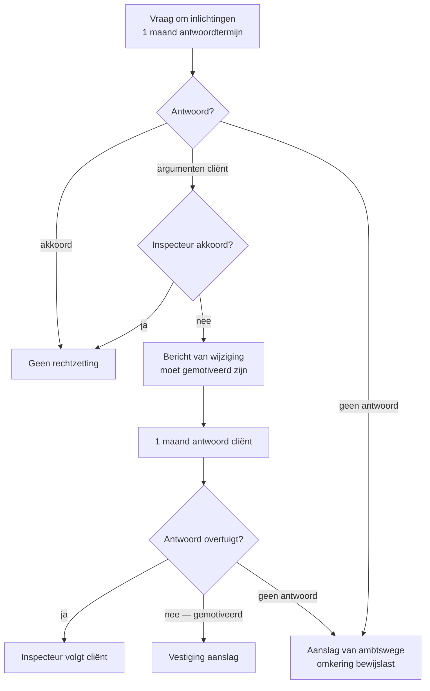

> **Leerstuk — één vraag, helemaal doorgewerkt.** Dit is het *scharniermoment* van de hele [[taxatieprocedure]]: hier wordt het dossier gemaakt of verloren. Wie correct antwoordt op een bericht van wijziging, houdt de bewijslast bij de fiscus. Wie te laat of niet antwoordt, betaalt zes maanden later met een bewijslast-handicap in bezwaar. Voor verhaal en routekaart: [[studiemateriaal/2-5|overzicht PO 2.5]].

## Antwoord in één blik

Na het onderzoek heeft de fiscus **drie wegen** om de aanslag te vestigen. Bij **aanvaarding** is hij overtuigd door de aangifte of het antwoord van de cliënt — de aanslag volgt stilzwijgend. Bij een **bericht van wijziging** (afgekort BvW) wil hij rechtzetten, maar de cliënt heeft meegewerkt: hij krijgt een gemotiveerd voorstel en één maand om te antwoorden. Bij een **ambtshalve aanslag** heeft de cliënt niet of fout gereageerd: de fiscus schat zelf, en de cliënt draagt voortaan de bewijslast.

Het BvW-moment is *het* scharniermoment. Drie regels gelden altijd: **(1)** antwoord binnen de termijn, ook bij akkoord; **(2)** motiveer inhoudelijk — in latere bezwaar telt vooral wat in die brief stond; **(3)** check de motivering van de fiscus, want een ongemotiveerde BvW is nietig.

We werken eerst de drie wegen door, dan het BvW in detail (vorm · antwoord · motivering toetsen), dan de ambtshalve aanslag, dan de verlenging van zes maanden bij nakende verjaring, en sluiten af met de sanctie-laag en de drie beginselen-haakjes.

---

## Drie wegen uit het onderzoek

Het onderzoek dat je in [[controle-onderzoek-en-bewijs]] zag, levert een uitkomst die voor de fiscus drie wegen openhoudt. Welke weg hij kiest, hangt af van twee dingen: heeft de cliënt meegewerkt, en kan de inspecteur zijn rechtzetting motiveren?

**Weg 1 — Aanvaarding.** De inspecteur is overtuigd door het antwoord van de cliënt of vindt geen onregelmatigheden. De aanslag wordt gevestigd conform de aangifte. Geen BvW, geen sanctie. Een stilzwijgend resultaat — de cliënt merkt het pas wanneer de gewone aanslag binnenkomt.

**Weg 2 — Bericht van wijziging.** De inspecteur is niet overtuigd en wil rechtzetten, maar de cliënt heeft wel geantwoord (of de aangifte was tijdig ingediend). Hij stuurt een schriftelijk, gemotiveerd voorstel; de cliënt heeft één maand om te reageren; pas daarna vestigt hij de aanslag. **De bewijslast blijft bij de fiscus** — wat in De Vlieg & Partners zal blijken een waardevolle juridische positie.

**Weg 3 — Ambtshalve aanslag.** De cliënt heeft géén aangifte ingediend, of niet (of laat) geantwoord op een vraag om inlichtingen, of niet geantwoord op een BvW, of het onderzoek belemmerd. De fiscus kondigt de ambtshalve aanslag aan, geeft één maand voor opmerkingen, en vestigt vervolgens een aanslag op basis van zijn eigen schatting. **Het gevolg is fundamenteel**: de bewijslast keert om — in bezwaar moet de cliënt zelf bewijzen dat de cijfers van de fiscus onjuist zijn.

| Weg | Wanneer | Termijn voor cliënt | Bewijslast in bezwaar |
|---|---|---|---|
| **Aanvaarding** | Inspecteur overtuigd of geen onregelmatigheid | — | — |
| **Bericht van wijziging** | Cliënt heeft meegewerkt; rechtzetting voorgenomen | 1 maand vanaf 3e werkdag na verzending (verlengbaar) | Fiscus moet bewijzen (vermoeden juistheid aangifte) |
| **Ambtshalve aanslag** | Geen aangifte · geen antwoord vraag inlichtingen · geen antwoord BvW · onderzoek belemmerd | 1 maand opmerkingen op kennisgeving | **Omkering** — cliënt moet bewijzen dat de aanslag onjuist is |

In de zaak De Vlieg & Partners kiest de inspecteur na de vraag om inlichtingen en het antwoord van de cliënt voor *weg 2*. Hij *kan* niet voor weg 3 kiezen, want de cliënt heeft binnen termijn geantwoord met stukken. Dat verschil weegt later door in bezwaar: de fiscus zal het *abnormale voordeel* moeten bewijzen, niet de cliënt het tegendeel.

---

## Het bericht van wijziging — in detail

Dit is de gewoonste weg na een controle waar de cliënt heeft meegewerkt maar de inspecteur het op een of meer punten oneens blijft. Drie sub-vragen krijgen elk hun uitwerking: hoe ziet een correct BvW eruit, wat is de antwoord-strategie, en hoe toets je de motivering van de fiscus?

### Vorm en inhoud van een BvW

Wanneer een cliënt belt met een BvW in de hand, is je eerste reflex *niet* meteen inhoudelijk discussiëren — eerst controleren wat er op het document staat.

**Vorm-vereisten.** Het document is schriftelijk, op briefpapier van de FOD Financiën, met datum van verzending vermeld. De antwoordtermijn van één maand staat erop. De mogelijke gevolgen bij niet-antwoorden — ambtshalve aanslag met omkering bewijslast — moeten vermeld zijn. Het stuk is ondertekend door een bevoegd inspecteur.

**Inhoud-vereisten.** Vier elementen moeten erin staan:

1. **De wijzigingen** die de inspecteur wil aanbrengen — concreet (welk bedrag, welke rubriek), niet vaag.
2. **De motivering** — zowel feitelijk (welke vaststellingen) als juridisch (welke wetsbepaling, hoe toegepast).
3. **De antwoordtermijn** — één maand, vanaf de derde werkdag na verzending.
4. Eventueel: het **voornemen van belastingverhoging + boete** als sanctie-laag.

> **Aside — motivering is een grondrecht, niet een formaliteit.** De motiveringsplicht van een bestuurshandeling is geen administratieve formaliteit maar een uitwerking van de *rechten van verdediging*. Een BvW die alleen "aftrek niet vervuld" zegt zonder uit te leggen *welke* voorwaarde precies niet vervuld is en *op grond van welke feiten*, is op die basis aanvechtbaar. De cliënt moet de redenering kunnen verifiëren — anders kan hij zich niet zinvol verweren.

### Antwoord-strategie — drie reflexen

De hoofdregel: **altijd antwoorden, ook bij akkoord**. Geen antwoord betekent het risico op een ambtshalve aanslag. Een akkoord-antwoord daarentegen houdt de bewijslast bij de fiscus — en dat is in latere bezwaar veel waard. Drie concrete reflexen:

**Reflex 1 — vraag verlenging als nodig.** De termijn van één maand is verlengbaar op gemotiveerd verzoek vóór de vervaldag. Vakantie van de cliënt, complexe stukken, vertaling van buitenlandse contracten — dat is voldoende reden. Vraag tijdig (binnen de eerste week na ontvangst), schriftelijk, met opgave van de reden.

**Reflex 2 — antwoord inhoudelijk gemotiveerd in drie blokken.**

- **Feitelijke betwisting** — welke feiten klopt de inspecteur niet? Onderbouw met stukken.
- **Juridische betwisting** — welke wetstoepassing is onjuist? Verwijs naar de exacte voorwaarde van de bepaling die niet vervuld zou zijn.
- **Subsidiair** — als de rechtzetting toch overeind blijft, betwist dan de belastingverhoging op redelijkheidsgrond.

**Reflex 3 — stukken opnieuw bijvoegen.** Stukken die je in antwoord op de vraag om inlichtingen al gestuurd hebt — niet veronderstellen dat de inspecteur ze paraat heeft. Bij elke argumentatie de stavende stukken meesturen. De adviseur-generaal in latere bezwaar leest dan beide brieven naast elkaar.

In de zaak De Vlieg antwoordt de accountant op 13 mei 2025. Hij handhaaft het standpunt van marktconformiteit met *aanvullende offertes* van onafhankelijke aannemers, betwist de toepassing van de bepaling over abnormale voordelen (verbonden onderneming binnen dezelfde sector betekent niet automatisch dat een prijs abnormaal is), en betwist subsidiair de aangekondigde belastingverhoging van 50% — het is een eerste overtreding op die rubriek, geen herhaling.

> **Aside — de antwoord-brief is een procedureel pivot.** In latere bezwaar mag je in principe nieuwe argumenten aanvoeren (geen estoppel-regel in fiscaal procesrecht). Maar de feitelijke elementen die níét in de antwoord-brief stonden, krijgen later vaak minder geloofwaardigheid. Strategie: zo volledig mogelijk antwoorden, ook al lijkt een akkoord-gedeelte vanzelfsprekend.

### De motivering van de fiscus toetsen

Een BvW is geen voldongen feit — de motivering moet stevig zijn, en de accountant doet drie testen.

**Test 1 — feitelijke motivering.** Welke concrete feiten ondersteunen de rechtzetting? "Bestelbonnen niet voorgelegd" — wat heeft de inspecteur dan gevraagd, wanneer, en wat ontving hij? "Kost niet marktconform" — op welke prijsvergelijking baseert hij zich? Onvolledige feitelijke motivering is aanvechtbaar.

**Test 2 — juridische motivering.** Welke bepaling wordt ingeroepen en hoe wordt zij toegepast? De algemene aftrekvoorwaarde voor beroepskosten vereist toetsing aan drie elementen: causaal verband met de beroepswerkzaamheid, noodzakelijkheid voor het beroep, en de realiteit van de uitgave. Een rechtzetting onder *abnormale voordelen* vereist dat de fiscus aantoont dat er een voordeel werd verleend én dat het abnormaal of goedgunstig is. Een BvW die alleen het artikelnummer noemt zonder uitwerking, sneuvelt op test 2.

**Test 3 — proportionaliteit van de sanctie.** Staat de voorgestelde belastingverhoging in verhouding tot de overtreding? De schaal voor belastingverhogingen kent een gradatie van eerste overtreding (zonder bedoeling te ontduiken) tot fraude met opzet. Een hoog tarief op een eerste overtreding van een complexe regel kan onredelijk zijn — daar staat het redelijkheidsbeginsel.

Het denkkader van de [[beginselen-behoorlijk-bestuur]] zag je in [[wat-is-fiscale-procedure-en-aanslagcyclus]]; hier wordt het *operationeel* — drie concrete testen op één document.

---

## Ambtshalve aanslag — wanneer en met welk gevolg

De cliënt-vraag die de accountant elke maand hoort: *"wat gebeurt er als ik niets doe?"* Het antwoord is de ambtshalve aanslag. In negen van de tien gevallen is dat een veel slechter scenario dan een BvW-traject.

### Wanneer mag de fiscus ambtshalve aanslag vestigen?

De wet voorziet een gesloten lijst van gevallen — niet vrij naar keuze. De fiscus mag ambtshalve aanslaan wanneer de belastingplichtige:

1. geen **aangifte** heeft ingediend binnen de wettelijke termijn;
2. wel een aangifte indiende maar **niet (of laat) antwoordde op een vraag om inlichtingen**;
3. wel antwoordde op de vraag om inlichtingen, maar **niet (of laat) antwoordde op een BvW**;
4. het **onderzoek belemmerde** — weigerde boeken voor te leggen, belette een visitatie;
5. geen voldoende bewijsmiddelen leverde voor reconstructie — dan grijpt de fiscus naar bewijs via *tekenen en indiciën*, met de ambtshalve aanslag als vorm.

Vóór de eigenlijke vestiging stuurt de administratie een aangetekende brief met de redenen waarom zij van die procedure gebruikmaakt, het bedrag van de inkomsten en de andere gegevens waarop de aanslag zal steunen, en de termijn waarbinnen de cliënt opmerkingen mag maken — typisch één maand. Pas daarna wordt de aanslag gevestigd.

### Het gevolg — omkering bewijslast

Omkering bewijslast is de **zwaarste procedurele sanctie** van de fiscale procedure. Het is geen straf maar een *gevolg*: de wet veronderstelt dat wie niet meewerkt, ook in bezwaar de cijfers van de fiscus moet weerleggen.

Wat verandert er concreet? Normaal moet de fiscus aantonen dat de aangifte onjuist is — de aangifte geniet een vermoeden van juistheid. Bij ambtshalve verschuift dat: de fiscus mag *redelijk schatten* (geen volledige bewijsplicht meer), en de cliënt moet vervolgens aantonen dat die schatting onjuist is.

**Praktisch advies bij dreigende ambtshalve aanslag**: altijd nog antwoorden, zelfs gedeeltelijk, zelfs te laat. Een laat antwoord neemt soms de ambtshalve-grondslag weg, afhankelijk van de bereidheid van de administratie. Een "beter laat dan nooit"-brief is beter dan een ambtshalve aanslag plus een jaar bewijs-handicap in bezwaar.

> **Aside — omkering is geen carte blanche.** Ook bij ambtshalve aanslag moet de fiscus zijn schatting *redelijk* en *gemotiveerd* onderbouwen. Een wildgroei-schatting (bijvoorbeeld vijf keer de aangegeven omzet zonder enige basis) blijft op het redelijkheidsbeginsel aanvechtbaar. Maar de drempel voor de cliënt om te weerleggen ligt hoger — hij moet positief bewijs leveren, niet alleen twijfel zaaien.

---

## BvW-verlenging van zes maanden — de redding bij nakende verjaring

Stel: een inspecteur ontdekt eind 2027 een twijfel op de aangifte vennootschapsbelasting van aanslagjaar 2024. De gewone aanslagtermijn voor een regelmatige aangifte loopt drie jaar vanaf 1 januari van het aanslagjaar — tot 31 december 2027. Hij heeft dus geen tijd meer voor de volle BvW-cyclus van één maand antwoord plus tijd om de aanslag te vestigen vóór 31 december 2027. Wat doet hij?

De wet voorziet een **automatische verlenging van zes maanden**: wanneer een BvW wordt verzonden in de laatste zes maanden van de aanslagtermijn, verlengt de termijn met zes maanden vanaf het antwoord van de cliënt — of vanaf de vervaldag van de antwoordtermijn als er geen antwoord komt.

**Concreet voorbeeld.** BvW verzonden op 1 december 2027 (binnen zes maanden vóór 31 december 2027). De cliënt antwoordt op 28 december 2027. De aanslag mag worden gevestigd tot 28 juni 2028.

**Strategische implicatie voor de accountant.** Bij een BvW dicht bij het einde van de termijn is "tijdrekken" geen optie meer. De verlenging maakt de fiscus immuun voor verjaring. De beste strategie is dan *inhoudelijk verweer voeren* — niet hopen dat de klok wint.

> **Aside — de verlenging is BvW-specifiek.** Deze verlenging van zes maanden is gebonden aan het BvW-mechanisme. Voor andere stappen (vraag om inlichtingen, ambtshalve aanslag, bijzondere termijnen na rechterlijke vernietiging) gelden eigen mechanieken. Niet veralgemenen.

---

## De sanctie-laag — belastingverhoging, boete, geheime commissielonen

Een rechtzetting via BvW gaat zelden alleen om de fiscale meerwaarde — er komt vaak een belastingverhoging bij, soms een boete, en in bijzondere gevallen de aparte aanslag geheime commissielonen.

| Sanctie | Mechaniek | Redelijkheidstoets |
|---|---|---|
| **Belastingverhoging** | Percentage van de bijkomende belasting. Gradatie van 10% (eerste overtreding zonder bedoeling te ontduiken) tot 200% (georganiseerde fraude). Tarieven: Cijferzakboekje. | Ja — proportionaliteit + niet-cumulatie met andere sancties |
| **Boete** | Vast bedrag per overtreding (orde van grootte 50-1.250 EUR). Voor specifieke overtredingen — niet-voorlegging stukken, niet-aangifte. Bedragen: Cijferzakboekje. | Ja — proportionaliteit |
| **Geheime commissielonen-aanslag** *(cross-PO)* | Bijzondere aanslag op niet-aangegeven commissielonen, presentiegelden, lonen of voordelen van alle aard. Tarief 100%, of 50% als de begunstigde identificeerbaar is. | Uitgewerkt in PO 2.3 |

**Drie advies-haakjes voor de cliënt:**

1. **Belastingverhoging is toetsbaar op redelijkheid.** Een 50%-tarief op een eerste overtreding van een complexe aftrekregel kan onevenredig zijn. De rechter mag de proportionaliteit toetsen en het tarief verminderen.
2. **Cumulatie met strafrechtelijke vervolging vereist een non-bis-in-idem-toets** — vooral bij fraude-tarieven. Wie strafrechtelijk wordt vervolgd voor hetzelfde feit, kan zich tegen de cumulatie verzetten.
3. **Betaling zonder voorbehoud kan als impliciete erkenning gelezen worden.** Communiceer altijd expliciet "betaling onder voorbehoud van bezwaar" — anders riskeer je dat een latere directeursbeslissing de betaling als instemming kwalificeert.

In de zaak De Vlieg kondigt de BvW een belastingverhoging van 50% aan, gemotiveerd als "tweede overtreding zonder bedoeling te ontduiken". De accountant betwist in zijn antwoord: het is een eerste overtreding op die rubriek, dus 10% is redelijker. In het aanslagbiljet vermindert de inspecteur effectief naar 30% — een gedeeltelijke winst zonder dat er bezwaar nodig was. Het scharniermoment heeft zijn werk gedaan.

---

## Drie beginselen-haakjes — motivering, redelijkheid, zorgvuldigheid

Drie [[beginselen-behoorlijk-bestuur]] landen in dit leerstuk concreet, elk op een ander moment van de cyclus.

| Beginsel | Operationeel in dit leerstuk |
|---|---|
| **Motiveringsplicht** | Toetsbaar op de BvW én op de aanslag. Een ongemotiveerde BvW is nietig — grondrecht, geen formaliteit. |
| **Redelijkheid** | Vooral bij de belastingverhoging. Een tarief moet in verhouding staan tot de overtreding. |
| **Zorgvuldigheid** | Vooral bij de ambtshalve aanslag. De schatting moet redelijk én gemotiveerd zijn — geen wildgroei. |

Het kader zelf hoort in [[wat-is-fiscale-procedure-en-aanslagcyclus]]; hier zie je de *operationele uitwerking* van het kader binnen één concreet document — het BvW en de daaropvolgende aanslag.

---

## Drie valkuilen

⚠️ **"Niets antwoorden op BvW = tijdrekken."** Fout. Geen antwoord betekent ambtshalve aanslag plus omkering bewijslast in latere bezwaar. De cliënt verschuift dus van "fiscus moet bewijzen" naar "cliënt moet bewijzen". De strategie "wachten en zien" kost vaak het hele dossier.

⚠️ **"Bij nakende verjaring is de aanslag gered."** Fout. De BvW-verlenging van zes maanden treedt automatisch in werking wanneer de BvW wordt verzonden in de laatste zes maanden van de aanslagtermijn. Een cliënt die op 1 december 2027 een BvW krijgt voor aanslagjaar 2024 (gewone termijn tot 31 december 2027), zit tot juli 2028 in procedure — geen verjaring.

⚠️ **Belastingverhoging klakkeloos aanvaarden.** Fout. De schaal voorziet 10% voor een *eerste overtreding zonder bedoeling te ontduiken*. Een 50% of 100% is een scherp standpunt van de fiscus — toetsbaar op het redelijkheidsbeginsel. Het subsidiaire argument "subsidiair betwisten we de belastingverhoging" hoort altijd in het antwoord op een BvW.

---

## Wanneer je dit snapt, ga dan naar

- [[controle-onderzoek-en-bewijs]] — voor wat er *vóór* de BvW gebeurt: onderzoek, termijnen, bewijsmiddelen.
- [[bezwaar-bemiddeling-en-gerechtelijke-fase]] — voor wat *na* de aanslag komt: bezwaar bij de adviseur-generaal, fiscale bemiddeling, rechtbank.
- [[invordering-en-verzet-tegen-dwangbevel]] — parallel met bezwaar, want bezwaar schorst de invordering niet.
- [[wat-is-fiscale-procedure-en-aanslagcyclus]] — voor het kader: drie fases en twee scharniermomenten.
- [[studiemateriaal/2-5/samenvatting|Samenvatting PO 2.5]] — voor herhaling: BvW-flow, ambtshalve aanslag, verlenging zes maanden, sanctie-laag.

## Doorklik naar concepten

Voor wie definitorisch detail wil opzoeken:

- [[taxatieprocedure]] · [[beginselen-behoorlijk-bestuur]]
- [[fiscale-sancties]] · [[geheime-commissielonen]]
- [[aanslagtermijnen]]

---

## Wettelijk fundament

- Bericht van wijziging: WIB92 art. 346 — kennisgeving per aangetekende brief, met vermelding van de voorgenomen inkomsten en gegevens en de redenen die de wijziging rechtvaardigen; antwoordtermijn één maand vanaf de derde werkdag na verzending, verlengbaar op gemotiveerd verzoek.
- Aanslag van ambtswege: WIB92 art. 351 — vijf gevallen (geen aangifte, vormgebreken, niet-overlegging boeken, geen antwoord op vraag om inlichtingen, geen antwoord op BvW). Voorafgaande aangetekende kennisgeving van redenen en grondslag verplicht.
- Omkering bewijslast bij ambtshalve aanslag: WIB92 art. 352 — de belastingplichtige moet het juiste bedrag van de belastbare inkomsten bewijzen, behalve bij wettige verhindering of bij vroegtijdige vestiging wegens gevaar voor de Schatkist.
- Vestiging van de aanslag — kohier: WIB92 art. 297-298 + 359.
- BvW-verlenging zes maanden bij nakende verjaring: WIB92 art. 354 §1 — verzending van een BvW in de laatste zes maanden van de aanslagtermijn verlengt die termijn automatisch met zes maanden vanaf antwoord cliënt of vervaldag.
- Belastingverhoging: WIB92 art. 444 + KB 27 augustus 1993 (schaal 10-200%). Tarieven via Cijferzakboekje.
- Administratieve geldboete: WIB92 art. 445 — 50 tot 1.250 EUR per overtreding; schaal vastgelegd bij KB.
- Bijzondere aanslag geheime commissielonen *(cross-PO)*: WIB92 art. 219 — 100%, of 50% indien begunstigde identificeerbaar. Uitgewerkt in PO 2.3.
- Motiveringsplicht bestuurshandelingen: Wet 29 juli 1991 betreffende de uitdrukkelijke motivering van bestuurshandelingen — ongemotiveerde of gebrekkig gemotiveerde BvW = nietig.

---

*Leerstuk PO 2.5. Status: voorgesteld — POC volgens ADR-037.*
