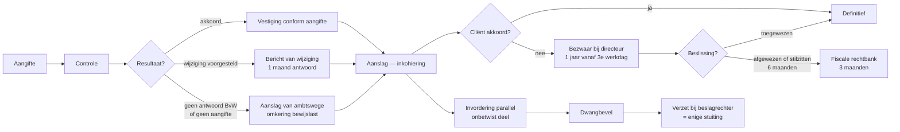

> **Leerstuk — één vraag, helemaal doorgewerkt.** Dit is de entry-fiche voor PO 2.5: eerst de mentale kaart leggen — drie fases, twee scharniermomenten, drie wetboeken. Wie die kaart heeft, herkent later in welke fase elk dossier zit. De techniek per fase staat in [[controle-onderzoek-en-bewijs]], [[taxatie-bericht-van-wijziging-en-ambtshalve-aanslag]], [[bezwaar-bemiddeling-en-gerechtelijke-fase]] en [[invordering-en-verzet-tegen-dwangbevel]]. Voor verhaal en routekaart: [[studiemateriaal/2-5|overzicht PO 2.5]].

## Antwoord in één blik

De fiscale procedure is de levensloop van één aanslag in **drie fases**: **taxatie** (van aangifte tot inkohiering — hier bepaalt de fiscus wát verschuldigd is), **betwisting** (van bezwaar tot eventueel cassatie — alleen wanneer de cliënt niet akkoord gaat) en **invordering** (van betaaltermijn tot dwangbevel en beslag — loopt parallel met de betwisting). Op die levensloop liggen **twee scharniermomenten** waarop de cliënt zijn accountant belt: de ontvangst van een **bericht van wijziging** (één maand om gemotiveerd te antwoorden) en de ontvangst van een **aanslagbiljet** (één jaar om bezwaar in te dienen). Andere brieven kunnen wachten — deze twee niet.

In dit leerstuk teken je de kaart. De vier volgende leerstukken bouwen elke fase technisch uit; hier blijf je bewust op het niveau van de mentale routekaart.

---

## De drie fases van elke aanslag

Of het nu gaat om de personenbelasting van een gepensioneerde, een vennootschapsbelasting-rechtzetting bij een KMO, of een btw-controle bij een eenmanszaak — élke fiscale aanslag doorloopt dezelfde drie fases. Wie de fases kent, weet bij elke brief van de fiscus meteen in welke fase de cliënt zit, en dus welke termijn er loopt en welke vervolgstap volgt.

### Fase 1 — Taxatie: bepalen wat verschuldigd is

De taxatie start bij de aangifte en eindigt bij de **inkohiering**, het ogenblik waarop de aanslag officieel gevestigd is. Tussenin zit het hele administratieve werk van de fiscus: aangifte verwerken, eventueel controle uitvoeren, vraag om inlichtingen sturen, antwoorden lezen, een bericht van wijziging opmaken bij meningsverschil, in extremis een aanslag van ambtswege vestigen wanneer de cliënt niet antwoordt. Het kohier dat hier ontstaat is geen administratief formuliertje — het is een **uitvoerbare titel** die het recht van de fiscus om te innen vastlegt.

Twee begrippen krijgen later een eigen leerstuk: [[controle-onderzoek-en-bewijs]] werkt de onderzoeksbevoegdheden uit (wat mag de fiscus opvragen, bij wie, binnen welke termijn), en [[taxatie-bericht-van-wijziging-en-ambtshalve-aanslag]] werkt het scharniermoment BvW uit (hoe antwoord je, wat als je niet antwoordt, hoe wordt de belastingverhoging berekend).

### Fase 2 — Betwisting: alleen wanneer de cliënt niet akkoord gaat

De betwisting is **optioneel**. Wie zich neerlegt bij de aanslag, slaat deze fase over en gaat rechtstreeks naar de invordering. Wie wel betwist, doorloopt een vaste cascade: eerst administratief bezwaar bij de adviseur-generaal, eventueel parallel een fiscale bemiddeling, daarna — bij afwijzing of stilzitten — een vordering bij de fiscale kamer van de rechtbank van eerste aanleg, daarna hoger beroep en in laatste instantie cassatie. Elke trap heeft zijn eigen termijn en zijn eigen procedurele eigenheid.

Dit hele traject staat uitgewerkt in [[bezwaar-bemiddeling-en-gerechtelijke-fase]].

### Fase 3 — Invordering: parallel met de betwisting

Hier maken veel stagiairs een denkfout. De invordering wacht **niet** tot de betwisting voorbij is. Het bezwaar schorst de invordering niet — alleen het deel waarover bezwaar wordt ingediend is tijdelijk niet opeisbaar, en zelfs voor dat betwiste deel mag de ontvanger **bewarend beslag** laten leggen om zich te wapenen tegen insolventie. De fase doorloopt aanmaning → eventueel bewarend beslag → dwangbevel → uitvoerend beslag → verkoop of inning.

De techniek + de enige rechtsweg tegen tenuitvoerlegging (verzet bij de beslagrechter — niet bezwaar) staan in [[invordering-en-verzet-tegen-dwangbevel]].

**De drie fases zijn dus geen drie alternatieven — het zijn drie opeenvolgende lagen die voor één aanslag tegelijk kunnen lopen.** Een examenklassieker speelt precies daarop in: een cliënt heeft bezwaar ingediend en denkt veilig te zijn — fout, de ontvanger kan ondertussen al een bewarend beslag laten leggen op zijn zichtrekening. Wie alleen aan de bezwaarkant denkt en het invorderingsspoor vergeet, ziet zijn cliënt verrast worden door een deurwaarder.

---

## De twee scharniermomenten — wanneer de cliënt belt

De fiscale procedure heeft veel termijnen, maar twee momenten zijn beslissend voor de cliënt-relatie. Op die twee momenten **belt de cliënt zijn accountant** — andere brieven kunnen tot het einde van de week wachten. Wie de twee momenten herkent én correct antwoordt, voorkomt dat een dossier ontspoort.

### Scharniermoment 1 — Het bericht van wijziging

Het **bericht van wijziging** (BvW) is de brief waarin de inspecteur aankondigt dat hij van plan is iets aan de aangifte te wijzigen — een kostenpost verwerpen, een inkomen bijschatten, een aftrek weigeren. Het is géén aanslag, maar wel de laatste rechtstreekse gelegenheid voor de cliënt om de inspecteur op andere gedachten te brengen vóór de aanslag gevestigd wordt.

Vanaf het ogenblik dat de cliënt deze brief opent, loopt een termijn van **één maand** om gemotiveerd te antwoorden. Wie niet antwoordt riskeert twee dingen tegelijk: een **aanslag van ambtswege**, en — wat zwaarder weegt — een **omkering van de bewijslast** in een later bezwaar. Stilzitten op een BvW betekent het sterkste argument weggeven voor de hele resterende procedure.

De antwoord-strategie zelf — hoe schrijf je een goed antwoord, wat doe je met de belastingverhoging die in het BvW wordt aangekondigd — wordt uitgewerkt in [[taxatie-bericht-van-wijziging-en-ambtshalve-aanslag]].

### Scharniermoment 2 — Het aanslagbiljet

Het **aanslagbiljet** is de officiële kennisgeving van de gevestigde aanslag. Vanaf het ogenblik dat het biljet verstuurd is, loopt een termijn van **één jaar** om bezwaar in te dienen. Daarna is de aanslag definitief en kan alleen verzet tegen dwangbevel de invordering nog stuiten — een veel smallere rechtsweg dan bezwaar. Geen tussenstap: ofwel betalen, ofwel binnen het jaar bezwaar.

Let op de termijn: één jaar, niet zes maanden. Vóór een eerdere wetshervorming was dat anders, en op het examen blijft "zes maanden" als foute optie regelmatig opduiken.

> **Belangrijke nuance — wanneer start die klok eigenlijk?** Niet op de datum die op het biljet of het BvW staat. Niet bij ontvangst. Maar **de derde werkdag na de verzendingsdatum**. Een biljet verstuurd op vrijdag laat de klok starten op woensdag. Een biljet verstuurd op donderdag 7 augustus laat de klok starten op dinsdag 12 augustus — drie werkdagen later, weekend overgeslagen. Het is een verraderlijke regel: stagiairs rekenen instinctief vanaf "datum op de brief", terwijl de wettelijke startgebeurtenis "verzending + 3 werkdagen" is. Dit verschil is bij meerdere examen-vragen het hele verschil tussen ontvankelijk en onontvankelijk bezwaar.

| Wanneer de cliënt belt | Termijn | Start | Gevolg bij niets doen |
|---|---|---|---|
| **Bericht van wijziging** ontvangen | 1 maand (verlengbaar op gemotiveerd verzoek) | 3e werkdag na verzending | Aanslag van ambtswege + omkering bewijslast in later bezwaar |
| **Aanslagbiljet** ontvangen | 1 jaar | 3e werkdag na verzending | Aanslag definitief — alleen verzet tegen dwangbevel kan invordering nog stuiten |
| **Vraag om inlichtingen** ontvangen (vóór BvW) | 1 maand (verlengbaar) | 3e werkdag na verzending | Aanslag van ambtswege + administratieve boete |
| **Dwangbevel** betekend | 1 maand (verzet) | Datum betekening | Tenuitvoerlegging gaat door — beslag op rekening, loon, goederen |

### De Vlieg & Partners — hoe een dossier door beide scharnieren loopt

De voorbeeldgroep [[de-vlieg-partners]] illustreert beide momenten op één tijdlijn. De inspecteur verstuurt op **14 april 2025** een BvW voor de BV met voorgenomen rechtzetting van 80.000 EUR onderaannemingskosten. Vanaf de derde werkdag na verzending — dus vanaf 17 april — start de antwoordklok. De accountant heeft uiterlijk tot **17 mei 2025** om gemotiveerd te antwoorden, en gebruikt die maand om aanvullende offertes te verzamelen en de marktconformiteit te beargumenteren. Drie maanden later, op **8 juli 2025**, ontvangt de cliënt het aanslagbiljet — de bezwaartermijn van één jaar loopt dan tot **11 juli 2026**. Twee scharniermomenten, twee verschillende termijnen, één doorlopend dossier.

---

## Drie wetboeken voor drie domeinen

Een jonge accountant die voor het eerst een fiscale brief in handen krijgt, stelt zichzelf bijna altijd dezelfde vraag: *in welk wetboek staat dit?* De fiscale procedure leeft niet in één bundel — drie wetboeken delen het werk, en wie de juiste bundel pakt verliest geen kostbare tijd.

| Wetboek | Wanneer | Waarvoor gebruiken |
|---|---|---|
| **WIB92** (Wetboek Inkomstenbelastingen 1992) | Federale directe belastingen — personenbelasting · vennootschapsbelasting · rechtspersonenbelasting · belasting niet-inwoners | Aangifte · onderzoek · bewijs · BvW · aanslag van ambtswege · aanslagtermijnen · bezwaar |
| **WBTW** (Wetboek Btw) | Btw — eigen onderzoek + eigen verjaring | Btw-onderzoek (parallel maar niet identiek aan WIB) · eigen verjaringsregime |
| **Wetboek Invordering 2020** | Federale dwanginvordering — ongeacht of het PB, VenB of btw betreft | Dwangbevel als uitvoerbare titel · beslag · verzet |
| **VCF / Brusselse Codex / Waals Décret 6.5.1999** | Gewestbelastingen — OV · verkeer · BIV · erf · registratie | Gewestelijke procedure — zie [[studiemateriaal/2-7|overzicht PO 2.7]] |
| **Wet 24.12.1996** | Provincie- en gemeentebelastingen | Lokale bezwaarprocedure |
| **Wet 29.7.1991** | Motiveringsplicht bestuurshandelingen | Geldt voor élke fiscale beslissing — BvW, aanslag, directeursbeslissing |
| **Wet 25.4.2007** | Fiscale bemiddelingsdienst (FBD) | Schorst beroepstermijn naar rechter |

Het **WIB92** is de hoofdtekst voor PO 2.5. Wie het ruwweg uit het hoofd kan opdelen, vindt elke regel binnen vijf minuten: aangifte vooraan, daarna onderzoek, dan bewijs, dan taxatie, dan bezwaar, dan invordering. De artikel-nummers staan in het Wettelijk fundament onderaan — hier is de logica van de opdeling belangrijker dan de exacte nummers.

Het **WBTW** verdient een aparte voetnoot. Btw heeft een eigen verjaringsregime en eigen onderzoeksbevoegdheden — parallel aan het WIB, maar niet identiek. "Altijd 7 jaar btw" is een wijdverbreid misverstand: het btw-regime kent drie termijnen, niet één. De btw-techniek zelf staat in [[studiemateriaal/2-4|overzicht PO 2.4]].

Het **Wetboek Invordering** is sinds 1 januari 2020 in werking. Het vervangt de oude invorderingsregels die verspreid zaten over WIB en WBTW en bundelt ze in één federaal kader voor alle directe en indirecte belastingen. Centrale bepaling: het **dwangbevel** als uitvoerbare titel.

Naast de federale wetboeken bestaan er gewestelijke en lokale bundels — de Vlaamse Codex Fiscaliteit, de Brusselse Codex Fiscale Procedure, het Waals Decreet van 6 mei 1999 voor de gewestelijke heffingen, en de Wet van 24 december 1996 voor provincie- en gemeentebelastingen. Wie weet welk wetboek bij welke fase + welk niveau hoort, vindt elke regel binnen vijf minuten — dat is geen detail, dat is hoe een accountant onder tijdsdruk werkt.

---

## Cliënt belt — wat doe jij?

Telefoon rinkelt. De cliënt zegt: "ik heb een brief van de fiscus." Wat zijn jouw eerste drie vragen, vóór je inhoudelijk iets begint te zeggen?

**Vraag 1 — welk soort brief is het?** Vraag om inlichtingen, bericht van wijziging, aanslagbiljet, aanmaning, dwangbevel — elk soort heeft een eigen termijn en een eigen vervolg. Vraag de cliënt om het document te **scannen en mailen** in plaats van te beschrijven. "Ik denk dat het…" is geen werkbare diagnose; de aanhef van de brief lost de vraag in één seconde op.

**Vraag 2 — wat is de verzenddatum?** Niet de ontvangstdatum, niet de datum bovenaan het document — de verzenddatum start de termijnklok. Bij twijfel: kijk naar de poststempel of het automatisch gegenereerde verzenddatum-veld van de fiscus. Tussen "datum biljet" en "verzenddatum" kunnen dagen zitten — en die dagen bepalen of een bezwaar nog ontvankelijk is.

**Vraag 3 — welke aanslag betreft het?** Personenbelasting, vennootschapsbelasting, btw, gewestelijk of gemeente — dit bepaalt het wetboek én de bezwaarinstantie. Een gemeentelijk aanslagbiljet aanvechten bij Vlabel is onontvankelijk; een btw-aanslag aanvechten als ging het om directe belastingen evenzeer. Voor de gewestelijke en lokale routes verwijst de procedure naar [[studiemateriaal/2-7|overzicht PO 2.7]].

Pas **daarna** geef je inhoudelijk advies. De drie vragen zijn diagnose — een halfuur loodgieterswerk redt soms een jaar bezwaar. Wie meteen inhoudelijk begint te discussiëren mist het feit dat de termijn morgen verstrijkt, of dat de cliënt de brief bij het verkeerde loket moet indienen.

| Cliënt heeft ontvangen | Eerste drie vragen | Onder welk leerstuk uitgewerkt |
|---|---|---|
| Vraag om inlichtingen | Wanneer verzonden? · welk wetboek? · welke aanslag betreft het? | [[controle-onderzoek-en-bewijs]] |
| Bericht van wijziging | Wanneer verzonden? · welke kostenpost wordt verworpen? · is motivering toereikend? | [[taxatie-bericht-van-wijziging-en-ambtshalve-aanslag]] |
| Aanslagbiljet | Wanneer verzonden? · is rechtzetting conform BvW? · welke termijn voor bezwaar? | [[bezwaar-bemiddeling-en-gerechtelijke-fase]] |
| Dwangbevel | Wanneer betekend? · is bezwaar lopend? · welke beslagen reeds gelegd? | [[invordering-en-verzet-tegen-dwangbevel]] |

> **Een vooraf-vraag is even waardevol als een reactieve.** Een cliënt belt bijvoorbeeld in januari: "ik verhuis op 1 maart definitief naar Portugal, wat moet ik fiscaal regelen?" Antwoord: een bijzondere aangifte personenbelasting voor de periode 1 januari tot vertrekdatum, in te dienen binnen drie maanden na vertrek. Niet wachten op een vraag om inlichtingen — de aangifte loopt vooraf, niet achteraf. Hier is de diagnose-vraag preventief, maar de logica blijft dezelfde: welke aanslag · welk wetboek · welke termijn.

---

## De aangifte — startpunt van de hele cyclus

De aangifte is meer dan een administratieve formaliteit. Ze is de **opening van de procedure** en draagt een vermoeden van juistheid: wat de cliënt te goeder trouw aangeeft, vormt het uitgangspunt waarvan de fiscus afwijken alleen door tegenbewijs kan. Een tijdige en correcte aangifte is daarmee de eerste verdediging — vóór er ook maar een controle plaatsvindt.

Er zijn drie aangifte-types die de accountant kent, niet als technische inhoud maar als procedure-startpunt:

| Aangifte | Wetbron | Termijn | Indienen via |
|---|---|---|---|
| Personenbelasting | WIB92 | Verschilt per jaar — vermeld op aangifteformulier (typisch eind juni-juli) | Tax-on-web of papier |
| Bijzondere PB bij vertrek uit België | WIB92 | 3 maanden na vertrek | Tax-on-web of papier |
| Vennootschapsbelasting | WIB92 + KB | 1 maand na goedkeuring jaarrekening door AV, uiterlijk 7 maanden na boekjaareinde | Biztax |
| Btw periodiek | WBTW + KB | 20e dag van de maand volgend op aangifteperiode (maand of kwartaal) | Intervat |

De **vennootschapsbelasting-termijn** is een examenklassieker. Voor een boekjaar dat sluit op 31 december moet de algemene vergadering vóór 30 juni plaatsvinden (statutair, op grond van het WVV), en de aangifte volgt binnen één maand na die AV. Wie de AV uitstelt loopt vast op de buitengrens van uiterlijk zeven maanden na boekjaareinde. Voor een kalenderboekjaar betekent dat: aangifte vóór eind juli. De [[de-vlieg-partners]]-case volgt dit ritme: aangifte AJ 2024 ingediend op 12 september 2024 (binnen de wettelijke termijn, na goedkeuring door de AV van 28 juni 2024).

De **bijzondere aangifte bij vertrek uit België** verdient aparte aandacht. Bij een definitieve verhuis naar het buitenland moet de natuurlijke persoon binnen drie maanden na vertrek aangifte doen voor de periode van 1 januari tot vertrekdatum. De aanslag wordt vervroegd gevestigd — de fiscus wacht niet tot het reguliere aanslagjaar, want na vertrek wordt invordering in het buitenland veel moeilijker.

> **Een tijdige aangifte is meer dan een vinkje.** Ze verkort de aanslagtermijn van vier jaar (laat of niet) naar drie jaar (regelmatig). Ze voorkomt een aanslag van ambtswege met omkering van de bewijslast. En ze laat het vermoeden van juistheid spelen. Drie verdedigingslinies tegelijk — verloren door één laat ingediende aangifte. Dat verklaart waarom een professionele accountant de aangifte-deadline nooit op het laatste nippertje plant.

Voor de inhoudelijke aangifte-mantel zelf (welke vakken, welke codes, welke aftrekposten) verwijs je door naar [[studiemateriaal/2-2|overzicht PO 2.2]] (PB), [[studiemateriaal/2-3|overzicht PO 2.3]] (VenB) en [[studiemateriaal/2-4|overzicht PO 2.4]] (btw).

---

## Drie valkuilen

⚠️ **Denken dat bezwaar de invordering schorst.** Fout. Het onbetwist verschuldigd deel blijft gewoon opeisbaar, en zelfs voor het betwiste deel kan de ontvanger bewarend beslag laten leggen om zich tegen insolventie te wapenen. Bezwaar en invordering zijn **twee parallelle sporen**. Wie alleen bezwaar indient en het invorderingsspoor negeert, ziet zijn cliënt verrast worden door een dwangbevel.

⚠️ **Denken dat de termijnklok start op de datum bovenaan het aanslagbiljet of bij ontvangst.** Fout. De termijnen die "verzending" als startpunt nemen, beginnen de **derde werkdag** na de verzendingsdatum. Voor een biljet verzonden op donderdag 7 augustus start de klok op dinsdag 12 augustus — drie werkdagen later, weekend overgeslagen. Een MCQ-examen verstopt foute opties als "datum biljet" of "vijfde werkdag" precies hier.

⚠️ **Denken dat één wetboek volstaat.** Fout. Btw-onderzoek volgt het WBTW (parallel maar verschillend van het WIB); de invordering volgt het Wetboek Invordering 2020 (vervangt verspreide oude regels); gewestelijke heffingen volgen de VCF, de Brusselse Codex of het Waals Decreet. Een blik dat alleen het WIB ziet, mist veertig procent van de procedure. Toets bij elke nieuwe brief: **federaal of gewestelijk? directe of indirecte? taxatie of invordering?**

---

## Wanneer je dit snapt, ga dan naar

- [[controle-onderzoek-en-bewijs]] — Wat mag de fiscus controleren — onderzoeksbevoegdheden, termijnen, bewijsmiddelen en de grenzen van de cliënt.
- [[taxatie-bericht-van-wijziging-en-ambtshalve-aanslag]] — Het BvW als scharniermoment — antwoord-strategie, aanslag van ambtswege en belastingverhoging.
- [[bezwaar-bemiddeling-en-gerechtelijke-fase]] — Hoe een gevestigde aanslag betwisten — bezwaar bij de directeur, fiscale bemiddeling, rechtbank en cassatie.
- [[invordering-en-verzet-tegen-dwangbevel]] — Aanslag onbetaald — dwangbevel, beslagen en verzet bij de beslagrechter.
- [[studiemateriaal/2-5/samenvatting|Samenvatting PO 2.5]] — Voor herhaling vlak vóór het examen — termijntabel, drie fases timeline en onderzoeksgrenzen samen.

## Doorklik naar concepten

Voor wie definitorisch detail wil opzoeken:

- [[fiscale-procedure]] · [[aanslag-cyclus]]
- [[aangifteplicht]] · [[aanslagbiljet-pb]]
- [[fiscale-actoren]]

---

## Wettelijk fundament

- Aangifte directe belastingen — algemene basis: WIB92 art. 305-310. Onder meer art. 305 algemene aangifteplicht; art. 309 bijzondere aangifte bij vertrek uit België (3 maanden); art. 310 aangifte vennootschapsbelasting (1 maand na goedkeuring jaarrekening AV, uiterlijk 7 maanden na boekjaareinde).
- Vestiging van de aanslag — inkohiering: WIB92 art. 297-298 + art. 359. Het kohier is een uitvoerbare titel; het aanslagbiljet wordt op basis van het kohier verzonden.
- Aanslagtermijnen — overzicht: WIB92 art. 354 (3/4/6/10 jaar sinds Wet 20.11.2022, in voege vanaf aanslagjaar 2023). Uitgewerkt in [[controle-onderzoek-en-bewijs]] en de samenvatting.
- Bezwaar — administratieve fase: WIB92 art. 366 (bezwaarschrift) + art. 371 (termijn 1 jaar vanaf 3e werkdag na verzending aanslagbiljet). Niet 6 maanden. Uitgewerkt in [[bezwaar-bemiddeling-en-gerechtelijke-fase]].
- Invordering — bezwaar schorst niet: WIB92 art. 410. Onbetwist deel blijft opeisbaar; bewarend beslag mogelijk op het betwiste deel.
- Btw — eigen verjaring + onderzoek: WBTW art. 81bis (verjaring 3/4/7 jaar) + art. 60-63 (onderzoek). Cross-PO doorklik naar [[studiemateriaal/2-4|overzicht PO 2.4]].
- Federale dwanginvordering: Wetboek van de minnelijke en gedwongen invordering van fiscale en niet-fiscale schuldvorderingen (in werking 1.1.2020), art. 13 (dwangbevel als uitvoerbare titel).
- Motiveringsplicht bestuurshandelingen: Wet 29.7.1991 betreffende de uitdrukkelijke motivering van bestuurshandelingen. Geldt voor BvW, aanslag en directeursbeslissing — uitgewerkt in [[taxatie-bericht-van-wijziging-en-ambtshalve-aanslag]].
- Fiscale bemiddelingsdienst: Wet 25.4.2007 betreffende de fiscale bemiddelingsdienst. Uitgewerkt in [[bezwaar-bemiddeling-en-gerechtelijke-fase]].
- Gerechtelijke fase — bevoegdheid + termijnen: Gerechtelijk Wetboek art. 569 16° (bevoegdheid fiscale kamer) + art. 1385undecies (termijn 3 maanden na directeursbeslissing; fictieve afwijzing na 6 maanden stilzitten).

---

*Leerstuk PO 2.5. Status: voorgesteld — POC volgens ADR-037.*
