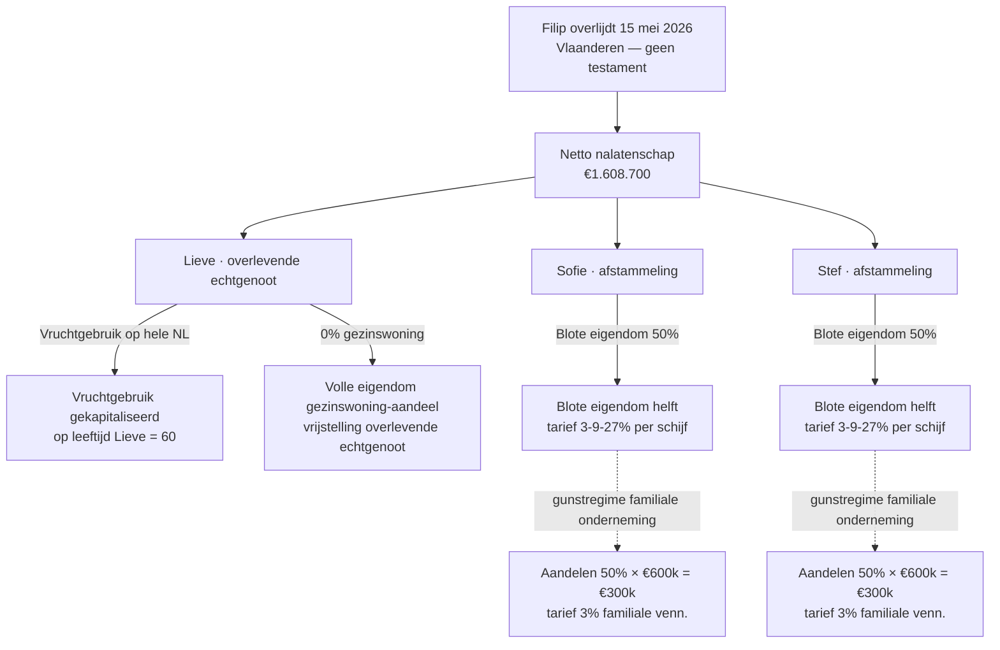

> **Leerstuk — één vraag, helemaal doorgewerkt.** Dit leerstuk is bewust zwaarder dan de drie voorgaande in PO 2.6: vijf deelvragen (wie erft? wat valt in de nalatenschap? hoeveel belasting? welke aangifteplicht? welke fictie?) worden samen behandeld omdat ze didactisch onlosmakelijk zijn — wie alleen het tarief kent zonder devolutie, kan geen aangifte opstellen. Lees vooraf [[wat-zijn-registratie-en-successierechten]] (kader) en [[registratieformaliteit-en-procedure]] (proces). Voor verhaal en routekaart: [[studiemateriaal/2-6|overzicht PO 2.6]].

## Antwoord in één blik

Erfbelasting is een **gewestelijke heffing op de overgang van vermogen bij overlijden**. Je beantwoordt drie samenhangende vragen vóór je een aanslag of een aangifte aanraakt: **wat valt in de nalatenschap** (civiel + fiscaal — huwelijksstelsel bepaalt of een goed eigen of gemeenschappelijk is, dus of het geheel of voor de helft in de nalatenschap valt), **wie erft welk deel** (devolutie hervormd erfrecht 2018), en **tegen welk tarief** (per erfgenaam, per gewest van fiscale woonplaats van de erflater). De **aangifte van nalatenschap** is het procedurele instrument — binnen 4 maanden bij overlijden in België (5 maanden bij overlijden elders in Europa, 6 maanden buiten Europa), ingediend door de erfgenamen en algemene legatarissen, betaling van de erfbelasting binnen 2 maanden na het verstrijken van de aangiftetermijn. Vijf **fictiebepalingen** breiden de belastbare grondslag uit naar planning-trucs in extremis (schenking < 3 jaar zonder registratie, levensverzekering aan begunstigde, beding van aanwas, sterfhuisclausule, schuldbekentenis aan erfgenaam) — zonder die fictie zou een Tak 21/23-uitkering of een hand-gift kort vóór overlijden de erfbelasting volledig omzeilen.

Voor de accountant zit het zwaarste werk in stap 1 (inventarisatie vermogen + huwelijksstelsel-toepassing) en stap 2 (aannemelijk-passief-classificering): de helft van de PO 2.6-examenvragen test of je posten correct kunt rangschikken volgens art. 27 + 33 W.Succ./art. 2.7.3.4.1 VCF.

| Stap | Wat doe je? |
|---|---|
| **1. Civiel kader** | Huwelijksstelsel + devolutie bepalen → wat valt in nalatenschap + wie erft |
| **2. Bruto actief** | Inventarisatie + waardering goederen erflater + helft gemeenschap |
| **3. Aannemelijk passief** | Schulden bestaand op overlijdens-dag + begrafeniskosten + uitzondering lening erfgenaam |
| **4. Fictie-bepalingen** | Schenking < 3 jaar zonder registratie · levensverzekering · beding van aanwas · sterfhuisclausule |
| **5. Bevoegd gewest + tarief** | Fiscale woonplaats erflater bepaalt VCF / W.Succ. — tarief progressief per erfgenaam |
| **6. Aangifte indienen** | 4 maanden in België · 5/6 maanden Europa/buitenland · aangifteplichtigen art. 38 |

We werken alles uit op één doorlopende voorbeeldcase: het hypothetisch overlijden van **Filip De Wilde** op 15 mei 2026, gehuwd onder het wettelijk stelsel met Lieve Janssens, met twee meerderjarige kinderen Sofie en Stef, en een gemengd vermogen (gezinswoning Antwerpen, tweede verblijf Knokke, studio Brussel, beleggingen, en 60 % aandelen in De Wilde Bouw NV). Telkens je een regel hebt gezien, pas je hem op Filip toe.

---

## Civielrechtelijk fundament — huwelijksvermogen + devolutie

Erfbelasting bouwt op civiel recht. Het examen straft hard wie naar de tarieventabel grijpt zonder eerst de civiele basis vast te leggen — want zonder het huwelijksstelsel weet je niet wat in de nalatenschap valt, en zonder devolutie weet je niet over hoeveel personen je het tarief moet verdelen. Twee kennisstromen moeten samenkomen: het **huwelijksvermogensrecht** (Boek 2 van het Burgerlijk Wetboek, hervormd in 2018) bepaalt *wat* tot de nalatenschap behoort, het **erfrecht** (Boek 4, eveneens hervormd in 2018) bepaalt *wie* welk deel krijgt.

### Huwelijksvermogensrecht — drie stelsels

België kent drie stelsels — het werkelijk geldende stelsel volgt uit het huwelijkscontract of, bij gebreke daaraan, uit de wet:

- **Wettelijk stelsel** (gemeenschap van aanwinsten + behoud eigen goederen). Wie huwt zonder contract, valt hieronder. Drie vermogens naast elkaar: het eigen vermogen van elke echtgenoot (goederen van vóór het huwelijk + erfenissen + schenkingen tijdens het huwelijk) plus het gemeenschapsvermogen (alle aanwinsten — typisch arbeidsinkomsten en wat daarmee aangekocht wordt).
- **Gemeenschap van alle goederen.** Contractueel — alles wordt gemeenschappelijk, ook wat één echtgenoot meebrengt of erft.
- **Zuivere scheiding van goederen.** Contractueel — elke echtgenoot houdt zijn vermogen volledig apart; er is geen gemeenschap. Veel gebruikt door zelfstandigen of in tweede huwelijken.

> **Waarom is dit fiscaal cruciaal?** Bij overlijden wordt eerst het huwelijksvermogen **ontbonden**. Bij een wettelijk stelsel betekent dat: de helft van het gemeenschapsvermogen behoort sowieso aan de overlevende echtgenoot (geen erfenis, dus geen erfbelasting). Alleen de andere helft valt in de nalatenschap van de overledene — samen met diens eigen goederen. Wie het gemeenschappelijk vermogen *integraal* aangeeft, dubbelt zijn belastbare grondslag.

Filip en Lieve huwden in 1988 zonder huwelijkscontract — wettelijk stelsel. Bij Filips overlijden ontbindt het gemeenschapsvermogen eerst. Het tweede verblijf Knokke (geërfd van Filips vader in 2010) en het deel van de aandelen De Wilde Bouw NV dat hij eveneens uit die erfenis kreeg, zijn eigen goederen van Filip — ze gaan **integraal** in zijn nalatenschap. De gezinswoning Antwerpen, de studio Brussel, de beleggingsportefeuille en de bankrekeningen zijn gemeenschappelijk — daarvan zit alleen de **helft** in de nalatenschap. Lieves eigen goederen (in dit geval geen) blijven sowieso buiten beeld.

| Goed | Stelsel-kwalificatie | In nalatenschap Filip? |
|---|---|---|
| Gezinswoning Antwerpen | Gemeenschap | **Helft** *(€225.000)* → wel |
| Tweede verblijf Knokke | Eigen Filip *(erfenis 2010)* | **Volledig** *(€350.000)* → wel |
| Studio Brussel | Gemeenschap | **Helft** *(€110.000)* → wel |
| 20 % aandelen via erfenis 2010 | Eigen Filip | **Volledig** *(~€300.000)* → wel |
| 40 % aandelen via aankoop | Gemeenschap | **Helft** *(~€300.000)* → wel |
| Beleggingsportefeuille KBC | Gemeenschap | **Helft** *(€250.000)* → wel |
| Tak 23 levensverzekering Filip | Premies uit gemeenschap | Fictie-bepaling — 50 % belastbaar *(zie verder)* |
| Zicht- en spaarrekeningen | Gemeenschap | **Helft** *(€20.000)* → wel |

### Devolutie — hervormd erfrecht 2018

Devolutie beantwoordt de vraag *wie krijgt wat?* — bij wettelijke regels (geen testament) of binnen de grenzen die de reserve oplegt aan een testament.

Drie hoofdregels van het hervormde erfrecht 2018:

- **Afstammelingen erven bij voorrang.** Kinderen eerst, daarna kleinkinderen via plaatsvervulling als een kind vooroverleden is, daarna achterkleinkinderen.
- **Overlevende echtgenoot naast afstammelingen krijgt vruchtgebruik op de hele nalatenschap.** De afstammelingen krijgen de blote eigendom. Het vruchtgebruik wordt voor de erfbelasting gekapitaliseerd op basis van de leeftijd van de langstlevende — hoe jonger de overlevende echtgenoot, hoe hoger het kapitalisatiepercentage en dus hoe meer van de belastbare grondslag bij hem of haar terechtkomt.
- **Bij afwezigheid van afstammelingen** erft de overlevende echtgenoot meer — volle eigendom met regels voor de zijlijn (ouders, broers, zussen).

> **Reservatair erfdeel.** De afstammelingen hebben een **wettelijke reserve van de helft** van de nalatenschap (vóór de hervorming 2018 was die reserve afhankelijk van het aantal kinderen; nu is ze een vaste globale helft, ongeacht of er één of vier kinderen zijn). De andere helft is het *beschikbaar deel* waarover de erflater testamentair vrij kan beschikken. Onterft een ouder zijn kind tot beneden de reserve, dan wordt het testament bij betwisting teruggebracht tot wat de reservataire bescherming toelaat. De vroegere reserves voor ouders zijn afgeschaft — alleen afstammelingen en de overlevende echtgenoot (met een aparte concrete reserve) genieten nog reservataire bescherming.

Filip overlijdt zonder testament. Wettelijke devolutie speelt: Lieve krijgt het vruchtgebruik op de hele netto-nalatenschap; Sofie en Stef krijgen elk de **helft van de blote eigendom**.

### Vier legataris-categorieën

Een testament kan iemand die geen wettelijk erfgenaam is, aanwijzen als legataris. De wet onderscheidt vier kwalificaties — elk met eigen rechten *en* een eigen aangifteplicht. Het verschil lijkt schools maar valt in examenvragen omdat het rechtstreeks bepaalt wie de aangifte moet ondertekenen en wie hoofdelijk aansprakelijk is voor de juistheid.

- **Erfgenaam volgens wettelijke devolutie** — afstammelingen, echtgenoot, ouders, broers/zussen volgens de wettelijke volgorde.
- **Algemeen legataris** — krijgt de hele nalatenschap (of het hele beschikbaar deel ervan, als reservataire erfgenamen bestaan).
- **Legataris onder algemene titel** — krijgt een fractie (bv. 1/3) of een categorie van goederen (bv. "al mijn onroerend goed").
- **Bijzondere legataris** — krijgt een specifiek goed (bv. "mijn schilderij van Magritte aan Jan").

De kwalificatie raakt de aangifte: erfgenamen, algemene legatarissen en algemene begiftigden (bij contractuele erfstelling) zijn aangifteplichtig. Bijzondere legatarissen meestal niet — zij ontvangen hun specifieke goed en betalen wel erfbelasting op hun aandeel, maar de aangifte zelf wordt door de algemene erfgenamen ingediend. Een klassieke examenvraag toetst dit precies bij een testament met meerdere legataris-types: wie moet ondertekenen?

| Legataris-categorie | Wat krijgt hij? | Aangifteplichtig? |
|---|---|---|
| **Erfgenaam *(wettelijke devolutie)*** | Volgens wettelijke regels (afstammelingen, echtgenoot, ouders, broers/zussen) | **Ja** |
| **Algemeen legataris** | Hele nalatenschap (of beschikbaar deel) | **Ja** |
| **Legataris onder algemene titel** | Fractie (1/3, 1/4) of categorie goederen | Soms — afhankelijk van scope |
| **Bijzondere legataris** | Specifiek goed of bedrag | **Nee** *(maar wel verschuldigd erfbelasting op zijn aandeel)* |
| **Algemeen begiftigde** *(contractuele erfstelling)* | Vergelijkbaar met algemeen legataris | **Ja** |

---

## Bruto actief min aannemelijk passief — wat staat erin?

Het netto-belastbaar bedrag is een eenvoudig saldo: **bruto actief min aannemelijk passief**. Beide componenten verdienen aparte aandacht — vooral het passief, omdat daar de klassieke examen-camouflage zit waar je een lijst van zes posten krijgt en er twee of drie moet schrappen.

### Bruto actief — vijf componenten

Het bruto actief is een inventaris. Niets meer, niets minder. Voor Filips nalatenschap doorloop je elk vermogensbestanddeel en plaatst het in één van vijf categorieën:

- **Eigen onroerend goed van de erflater** — gewaardeerd tegen verkoopwaarde op de dag van overlijden.
- **Helft van het gemeenschappelijk onroerend goed** — dit is waar de huwelijksstelsel-toepassing binnenkomt. Bij Filip en Lieve: de helft van de gezinswoning en de helft van de studio Brussel.
- **Roerend goed** — beleggingen, cash, voertuigen, kunst (waardering volgens marktwaarde of forfait).
- **Aandelen en bedrijfsbelangen** — waardering tegen de werkelijke economische waarde, vaak betwist terrein bij familiebedrijven.
- **Vorderingen** — op derden, op vennootschappen, op familieleden.

> **Waardering — verkoopwaarde op datum overlijden.** Voor onroerend goed gebeurt dat in de praktijk via een schattingsverslag of vergelijkbare verkoopprijzen. Voor effecten: beurskoers op de dag van overlijden of binnen een redelijke periode (typisch 15 dagen). Voor niet-genoteerde aandelen: combinatie van substantie + discounted cashflow + multiples — dit is het terrein waar Vlabel kritisch nakijkt en waar je als accountant de waarderingsmethode argumentatief moet onderbouwen.

### Aannemelijk passief — de kern-camouflage

Hier zit de zwaarste valkuil van PO 2.6. De stelregel is strikt en limitatief — niets wat er niet onder valt, mag in mindering:

> Aannemelijk passief van een binnenlandse nalatenschap is **alleen** (1) de op de dag van overlijden bestaande schulden van de overledene, plus (2) de begrafeniskosten.

Twee criteria, samen. Bestond de schuld niet op de overlijdens-dag? Geen aftrek. Is het wel een schuld, maar geen begrafeniskost en niet bestaand op overlijdens-dag? Geen aftrek.

Vier typische **WEL passief**-posten:

- Openstaande hypothecaire lening op de gezinswoning of een ander onroerend goed.
- Lopende facturen (energie, water, telecom, dagelijks beheer) gefactureerd vóór overlijden, betaald nadien.
- Belastingschulden die rusten op de erflater zelf — typisch de personenbelasting voor het overlijdens-jaar en lokale belastingen.
- Begrafeniskosten + repatriëring + plechtigheid — de wet noemt deze expliciet, zonder plafond.

Vier typische **GEEN passief**-posten:

- Ereloon van notaris of advocaat voor de opmaak van de aangifte van nalatenschap of het attest van erfopvolging — ontstaan **ná** overlijden, dus geen schuld van de erflater.
- Stookolie, brandstof, materialen geleverd ná de overlijdens-datum — pure leveringen aan de erfgenamen, geen schuld van de erflater.
- Lening die de overledene had bij één van zijn erfgenamen — uitgesloten als anti-misbruik (zie hieronder).
- Een algemene vermogensbelasting bij de erfgenamen — bestaat (nog) niet in België.

#### Uitzondering: lening bij een erfgenaam

De wetgever wantrouwt schulden van de overledene aan zijn eigen erfgenamen — ouders zouden anders kort voor het overlijden "leningen" kunnen creëren die het belastbaar netto van de nalatenschap kunstmatig drukken. Daarom zijn die leningen in principe **niet** aannemelijk. Twee uitzonderingen waardoor de lening alsnog wel kan worden afgetrokken:

1. **Het bewijs van echtheid** wordt door de aangevers geleverd — alle middelen van gemeen recht zijn toegelaten (getuigen, vermoedens, schriftelijke stukken; alleen de eed is uitgesloten).
2. De lening had als **onmiddellijke en rechtstreekse oorzaak de verkrijging, de verbetering, het behoud of de terugbekoming** van een goed dat zich op de dag van overlijden nog in de nalatenschap bevindt.

> **Waarom net deze vier oorzaken?** De wetgever wil legitieme intra-familiale investeringen in onroerend goed niet straffen. Een kind dat zijn ouder geld leent voor de renovatie van het ouderlijk huis voegt waarde toe aan een goed dat straks in de nalatenschap valt — die waardevermeerdering wordt fiscaal getoetst, dus moet de oorspronkelijke schuld eerlijk in mindering kunnen. Vier oorzaken vormen samen een gesloten lijst: verkrijging (aankoop), verbetering (renovatie), behoud (onderhoudslast) of terugbekoming (uitwinning na faillissement bv.).

### Filip-scenario — vijf passief-posten getoetst

Toepassen op Filip: vijf posten worden voorgelegd, je weegt elke post tegen het dubbele criterium "bestaand op overlijdens-dag?" + "voldoet aan art. 27 of een uitzondering van art. 33?".

| Filip overlijdt — passief-post | Bedrag | Status | Argument |
|---|---:|---|---|
| Begrafeniskosten + repatriëring + plechtigheid | €9.500 | **AANGENOMEN** | Begrafeniskost — expliciet vermeld, zonder plafond |
| Lopende facturen *(gas, water)* gefactureerd vóór overlijden | €1.800 | **AANGENOMEN** | Schuld bestaand op overlijdens-dag |
| Ereloon advocaat voor opmaak aangifte van nalatenschap | €3.500 | **NIET AANGENOMEN** | Ontstaan ná overlijden — geen schuld van Filip |
| Lening van zoon Stef *(renovatie Knokke)* | €25.000 | **AANGENOMEN** | Uitzondering — bestemming verbetering van een nalatenschapsgoed |
| Stookolie geleverd juli 2026 | €1.200 | **NIET AANGENOMEN** | Levering ná overlijden (mei 2026) |
| **Aannemelijk passief totaal** | **€36.300** | | |

Hier zie je in werking wat het examen telkens weer toetst: een gemengde lijst waarin twee posten weg moeten op grond van het *dag-van-overlijden*-criterium (advocaten-ereloon + stookolie), en één post die op het eerste gezicht uitgesloten zou zijn (lening aan een erfgenaam) maar via de uitzondering van art. 33, 2° alsnog mag — omdat de bestemming bewezen is en het goed (tweede verblijf Knokke) zich nog in de nalatenschap bevindt.

### Bruto, passief, netto — het saldo

Het bruto actief van Filip bevat al de helft van het gemeenschapsvermogen, zijn eigen goederen, én — vooruitlopend op de fictie-sectie — €90.000 als belastbaar aandeel van de Tak 23-levensverzekering. Onder die laatste post: de volledige reserve is €180.000, maar omdat de premies uit gemeenschap betaald werden, is slechts de helft fiscaal als legaat te behandelen.

| Filip nalatenschap-saldo | Bedrag |
|---|---:|
| Bruto actief *(incl. fictie levensverzekering €90.000)* | **€1.645.000** |
| Aannemelijk passief | **−€36.300** |
| **Netto belastbaar bedrag** | **€1.608.700** |

> **Waarom de fictie levensverzekering al in stap 2 zit?** De fictie-bepaling is een uitbreiding van het belastbare voorwerp en behoort fiscaal-technisch tot de grondslag — je inventariseert het belastbare goed alsof er een legaat is. Civielrechtelijk zit de Tak 23-uitkering *buiten* de nalatenschap (rechtstreeks van verzekeraar naar Lieve), maar voor de erfbelasting wordt ze gelijkgesteld met een legaat aan Lieve. Sectie 4 (fictiebepalingen) werkt de logica volledig uit; hier neem je het bedrag alvast op om het saldo te kunnen rapporteren.

---

## Bevoegd gewest + tariefschalen — wie betaalt hoeveel?

Het gewest dat de erfbelasting heft is dat van de **fiscale woonplaats van de erflater op de dag van overlijden** — niet de ligging van het vermogen, niet de woonplaats van de erfgenaam. Bij verhuis korte tijd vóór overlijden geldt een vijfjaarsregel: het gewest waar de erflater het langst zijn voornaamste verblijfplaats had in de laatste vijf jaar, wordt bevoegd. Dat voorkomt last-minute verhuizen om in een gunstiger gewest te belanden.

Voor Filip is dat eenvoudig: woonplaats Antwerpen sinds 1990, bij overlijden in 2026 dus VCF (Vlaanderen) — voor het hele vermogen, ook de studio Brussel. Brussel- of Waalse W.Succ. komen niet kijken.

### Vlaamse tariefschalen — drie categorieën

De Vlaamse erfbelasting kent drie tarief-categorieën, met een **per-erfgenaam-aanslag**. Sofie en Stef worden niet samengeteld — elk krijgt zijn eigen aanslag op zijn eigen aandeel, met zijn eigen progressie. Dat is fundamenteel gunstiger dan een nalatenschapstarief omdat elke erfgenaam de lage schijven afzonderlijk benut. De concrete schaalbedragen vind je in het Cijferzakboekje — orde van grootte:

| Vlaamse erfbelasting tariefschijf | Rechte lijn | Broers/zussen | Anderen |
|---|---:|---:|---:|
| €0 — €50.000 | **3 %** | 25 % | 25 % |
| €50.000 — €75.000 | **9 %** | 25 % | 25 % |
| €75.000 — €125.000 | **9 %** | 30 % | 45 % |
| €125.000 — €250.000 | **9 %** | 55 % | 55 % |
| > €250.000 | **27 %** | 55 % | 55 % |

> **Rechte lijn vs broers/zussen vs anderen.** "Rechte lijn" omvat afstammelingen (kinderen, kleinkinderen) en de echtgenoot of wettelijk samenwonende — duidelijk het gunstigste tarief. "Broers/zussen" is een aparte tussencategorie. "Anderen" zijn niet-verwanten zoals vrienden, niet-gehuwde partners zonder wettelijke samenwoning, of verre familie — bijna altijd het duurste tarief.

### Bijzondere tariefregimes

Naast de progressieve schalen bestaan er drie regimes die in PO 2.6 vaak getoetst worden:

| Bijzondere tariefregime | Tarief | Voorwaarden |
|---|---|---|
| Gezinswoning → overlevende echtgenoot | **0 %** | Echtgenoot of wettelijk samenwonende is de overlevende; gezinswoning was gezamenlijke hoofdverblijfplaats |
| Familiale onderneming bij erfopvolging | **3 %** rechte lijn · **7 %** anderen | Familiale vennootschap, reële economische activiteit, continuïteit + participatie 3 jaar nadien |
| Roerende schenking < 3 jaar zonder registratie | Reguliere erfbelasting *(fictie)* | Schenking niet geregistreerd, overlijden binnen 3 jaar |

> **Twee subtiliteiten over de gezinswoning-vrijstelling.** Eén: het is alleen de **gezinswoning** — een tweede verblijf of een verhuurde studio valt er *niet* onder. Het tweede verblijf Knokke en de studio Brussel van Filip worden dus volgens de gewone schalen belast, niet vrijgesteld. Twee: de vrijstelling geldt alleen voor de **overlevende echtgenoot of wettelijk samenwonende** — niet voor de kinderen die de blote eigendom van de woning erven. Lieve betaalt 0 % op haar deel van de gezinswoning; Sofie en Stef betalen wel het normale tarief op hun blote eigendom van diezelfde woning.

### Filip-scenario — vereenvoudigde tarief-toepassing

Het netto-belastbare bedrag €1.608.700 wordt toegedeeld volgens de devolutie en daarna per erfgenaam belast. Voor Lieve geldt de vrijstelling gezinswoning voor het deel van de gezinswoning dat naar haar gaat (€225.000 → €0 erfbelasting). Op het vruchtgebruik dat zij op de rest van de nalatenschap krijgt, wordt de waarde gekapitaliseerd op basis van haar leeftijd (60 jaar) — daarop volgt het tarief rechte lijn 3 % / 9 % / 27 % per schijf. Voor Sofie en Stef geldt: blote eigendom op (€1.608.700 − €225.000 − gekapitaliseerd vruchtgebruik Lieve) / 2, telkens belast aan rechte lijn.

> **Familiale-onderneming-toepassing.** Voor de aandelen De Wilde Bouw NV die in Filips nalatenschap zitten (~€600.000), is het gunstregime erfopvolging mogelijk: in plaats van de progressieve schalen tot 27 %, een **vlak tarief van 3 %** rechte lijn — als de familiale-vennootschap-voorwaarden vervuld blijven gedurende 3 jaar na overlijden (continuïteit van de activiteit + behoud van de participatie). Sofie en Stef moeten dit expliciet in de aangifte vragen; het is geen automatische toekenning.

### Brussel en Wallonië — wat is anders?

Brussel en Wallonië hanteren elk hun eigen W.Succ.-schalen. Brussel: rechte lijn 3 %/8 %/9 %/18 %/24 %/30 % over een fijner gestructureerde reeks schijven (orde van grootte tot €500.000, dan top). Wallonië: rechte lijn 3-30 % progressief. Geen vrijstelling gezinswoning zoals in het Vlaamse gewest — wel bepaalde verminderingen of abattementen in beperkte mate. In Brussel geldt bovendien een **nalatenschapstarief** in plaats van een per-erfgenaam-tarief — alle erfdelen worden samengevoegd voor de progressie. Voor één en hetzelfde vermogen kan dat hetzelfde aantal kinderen in Brussel duurder uitkomen dan in Vlaanderen, omdat lage schijven niet worden gestapeld over de erfgenamen.

> **Per-erfgenaam vs per-nalatenschap — het cumulatie-effect.** In Vlaanderen worden de schijven *per erfgenaam* doorlopen. Een nalatenschap van €600.000 verdeeld over drie kinderen levert drie keer een eigen aanslag op €200.000 op — elk benut volledig de schijven 3 % en 9 %. In Brussel zou dezelfde nalatenschap progressief belast worden alsof het één globale erfdeel was — daarom kan een Brusselse nalatenschap met meerdere kinderen op het eerste gezicht onverwacht duur uitvallen. Op het examen wordt dit verschil typisch getoetst via een vergelijkende oefening waarbij hetzelfde vermogen in twee gewesten doorgerekend wordt.

---

## Aangifte van nalatenschap — termijn, aangifteplichtigen, sancties

De aangifte van nalatenschap is een **aparte aangifte** met eigen termijnen en sancties — los van de registratieformaliteit uit het vorige leerstuk. Vier vragen beantwoorden ze samen: wie? wanneer? waar? en wat als laattijdig?

### Wie? — aangifteplichtigen

De aangifteplicht ligt limitatief bij drie categorieën:

- De **erfgenamen** — wettelijke en testamentaire.
- De **algemene legatarissen** — wie het hele beschikbaar deel krijgt.
- De **algemene begiftigden** — bij contractuele erfstelling.

Andere legatarissen of begiftigden (legatarissen onder algemene titel, bijzondere legatarissen) zijn in eerste orde **niet** aangifteplichtig. Subsidiair speelt wel een vangnet: blijven de hoofdaangifteplichtigen stilzitten, dan kan de ontvanger via aangetekende zending de andere legatarissen vragen voor hun aandeel aangifte te doen.

De aangifte mag door één aangifteplichtige worden ondertekend met effect voor allen — praktisch handig. Maar elke aangifteplichtige blijft **hoofdelijk aansprakelijk** voor de juistheid van wat opgenomen werd. Wie het document ondertekent en achteraf een onvolledige opgave aantreft, kan dus voor het volledige tekort aangesproken worden — niet enkel voor zijn eigen aandeel.

### Wanneer? — drie termijnen

De wettelijke aangiftetermijn hangt af van waar het overlijden plaatsvond:

- **In België**: **4 maanden** vanaf de overlijdens-datum.
- **In een ander Europees land**: **5 maanden**.
- **Buiten Europa**: **6 maanden**.

Filip overlijdt op 15 mei 2026 in Antwerpen → aangifte uiterlijk **15 september 2026**.

> **Termijnverlenging is mogelijk** maar geen automatisme. Je moet ze aanvragen vóór het verstrijken van de oorspronkelijke termijn. Vlabel of de FOD kent verlenging toe bij bijzondere omstandigheden — typisch een internationaal verspreid vermogen waarvoor buitenlandse documenten nodig zijn, vermiste erfgenamen, of een lopende rechtszaak over de legataris-kwalificatie. Niet voor "ik had het druk".

### Waar? — bevoegde administratie

Bij overlijden in Vlaanderen: **Vlabel**. Brussel of Wallonië: **FOD Financiën — Algemene Administratie van de Patrimoniumdocumentatie**. Indienen kan online of via een gestandaardiseerd papieren formulier.

### Wat staat er in de aangifte?

De aangifte is een gestructureerd document met vaste rubrieken: identificatie van de aangifteplichtigen, huwelijksstelsel-verklaring, inventaris van het bruto actief (per categorie), inventaris van het aannemelijk passief, expliciete vermelding van eerdere schenkingen binnen 3 jaar vóór overlijden (al dan niet geregistreerd), de fictie-bepalingen die spelen, en — bij beroep op het gunstregime familiale onderneming — een attest van Vlabel dat de familiale-vennootschap-kwalificatie bevestigt.

### Betaaltermijn

De erfbelasting moet betaald worden **binnen 2 maanden na het verstrijken van de aangiftetermijn**. Voor Filip: aangiftetermijn 15 september 2026 → **betaling uiterlijk 15 november 2026**. Bij betalingsmoeilijkheden — typisch wanneer het vermogen sterk geconcentreerd zit in een onroerend goed of in aandelen van een actieve onderneming — kan een afbetalingsplan worden aangevraagd. Voor maximaal vijf jaar vanaf overlijden, tegen waarborg.

### Sancties bij laattijdigheid

Drie soorten sancties wachten wie de termijnen mist:

- **Laattijdige aangifte**: een belastingverhoging die varieert van 10 % (lichte vertraging, goede trouw aantoonbaar) tot 100 % (vastgestelde fraude).
- **Laattijdige betaling**: nalatigheidsinteresten + eventuele dwanginvordering, eindigend in beslag op nalatenschap-bestanddelen.
- **Onvolledige aangifte**: na controle een bijkomende aanslag plus klassiek 50 % belastingverhoging.

### Termijn-kompas Filip

| Termijn | Wettelijk | Filip-scenario *(overlijden 15 mei 2026)* |
|---|---|---|
| Aangifte — overlijden in België | **4 maanden** | Uiterlijk **15 september 2026** |
| Aangifte — overlijden in EU | 5 maanden | n.v.t. |
| Aangifte — overlijden buiten EU | 6 maanden | n.v.t. |
| Betaling erfbelasting | **2 maanden** na aangiftetermijn | Uiterlijk **15 november 2026** |
| Termijnverlenging aangifte | Op aanvraag — vóór termijn | Geen aanvraag nodig |

Zes maanden beslaat het hele proces. De accountant orchestreert.

> **Opschortende voorwaarde in een testament**. Stel dat het testament bepaalt: "mijn zoon krijgt het bedrijfsgebouw als hij de familienaam draagt". Die voorwaarde **schorst de heffing niet**. De aangifte moet binnen de gewone termijn worden ingediend, met een provisorische opname; bij latere realisatie of niet-realisatie van de voorwaarde volgt verrekening. Wie wacht "tot duidelijk is of de zoon de naam draagt" is dus te laat.

---

## Fictiebepalingen — de grondslag uitgebreid

Vijf fictiebepalingen breiden de belastbare grondslag uit naar verrichtingen die civielrechtelijk **bij leven** plaatsvonden of buiten de nalatenschap blijven, maar fiscaal worden behandeld alsof het overdrachten **bij overlijden** waren. Allemaal anti-misbruik: ze neutraliseren planning-trucs die anders erfbelasting zouden ontwijken.

### Fictie 1 — schenking < 3 jaar zonder registratie

Een schenking gedaan binnen drie jaar vóór overlijden, **zonder dat de schenkbelasting werd betaald** (= niet geregistreerd), wordt voor de erfbelasting als legaat behandeld. Doel: voorkomen dat ouders kort vóór hun overlijden snel alles wegschenken via handgift om de erfbelasting volledig te omzeilen.

> **Planning-implicatie.** Wie een roerende schenking **registreert** (3 % rechte lijn / 7 % anderen) verlost zich definitief van de fictie — het goed verlaat de toekomstige nalatenschap. Wie de schenking **niet registreert** (zuivere handgift of bankgift met aangetekende brief) bespaart de schenkbelasting maar moet drie jaar overleven; sterft hij binnen die termijn, dan wordt het goed alsnog als legaat fiscaal behandeld. De trade-off — onmiddellijke schenkbelasting versus drie-jaar-radar — is precies wat in [[successieplanning-en-gunstregime]] wordt uitgewerkt.

### Fictie 2 — levensverzekering aan begunstigde

Een uitkering van een levensverzekering bij overlijden van de verzekerde aan een aangeduide begunstigde wordt voor de erfbelasting **als legaat van de erflater aan de begunstigde** beschouwd. Zonder deze fictie zou een Tak 21- of Tak 23-verzekering een belastingvrije vermogensoverdracht zijn buiten de nalatenschap om — een te grote bypass om door de wetgever ongemoeid gelaten te worden.

#### Pro-rata bij gemeenschap

De praktisch belangrijkste verfijning betreft echtgenoten gehuwd onder gemeenschap. De wet maakt een onderscheid op basis van de financieringsbron van de premies:

- Werden de premies betaald **uit eigen goederen** van de erflater — dan is de **volledige** uitkering belast als legaat aan de overlevende echtgenoot.
- Werden de premies betaald **uit het gemeenschapsvermogen** — dan wordt de uitkering **slechts voor de helft** belast.
- Wordt bewezen dat de uitkering een tegenwaarde is voor **eigen goederen van de begunstigde** zelf — dan is geen erfbelasting verschuldigd.

Voor Filip: de Tak 23-reserve bedraagt €180.000, premies betaald uit gemeenschap → **50 % = €90.000** wordt als legaat aan Lieve in de aangifte opgenomen. Dat bedrag valt onder het rechte-lijn-tarief, maar de vrijstelling gezinswoning geldt er niet op (die geldt alleen voor de gezinswoning zelf). De aangifteplichtige moet de fictie expliciet vermelden — Vlabel/FOD kan achteraf bij polis-controle de niet-aangegeven uitkering vaststellen en een bijkomende aanslag met 50 % belastingverhoging opleggen.

> **Vermoeden van kosteloosheid.** De verkrijging wordt vermoed kosteloos te zijn ontvangen, behoudens tegenbewijs. Wie wil ontsnappen aan de heffing op grond van "premies uit eigen vermogen van de begunstigde", moet dat dus actief bewijzen — het is niet de fiscus die het tegendeel moet aantonen.

### Fictie 3 — beding van aanwas

Twee echtgenoten of partners spreken contractueel af dat bij overlijden van één van hen het gemeenschappelijke onroerend goed (typisch een tweede verblijf, of een onverdeelde portefeuille) volledig overgaat naar de overlevende — in plaats van naar de erfgenamen. Civielrechtelijk geldig en buiten de nalatenschap; fiscaal echter behandeld alsof het overgenomen aandeel een legaat is. Anti-misbruik tegen ontwijking van het erfdeel van de kinderen én van de erfbelasting.

### Fictie 4 — sterfhuisclausule

Een variant van het beding van aanwas, contractueel ingeschreven in een huwelijkscontract bij ernstige ziekte van één echtgenoot. De goederen van de zieke echtgenoot vallen onmiddellijk bij overlijden van die echtgenoot aan de gezonde, zonder dat dit als gewone nalatenschap geldt. Fiscaal: als legaat beschouwd voor de erfbelasting — net als het beding van aanwas.

### Fictie 5 — schuldbekentenis aan erfgenaam

Reeds besproken bij het passief. Als anti-misbruik: een "schuldbekentenis" kort vóór overlijden waarbij de overledene zogezegd geld leende van een erfgenaam, wordt **niet** als passief erkend — dus geen aftrek van het bruto actief. Tenzij de uitzondering uit art. 33, 2° W.Succ./art. 2.7.3.4.1 VCF speelt: lening met bestemming verkrijging, verbetering, behoud of terugbekoming van een goed dat zich nog in de nalatenschap bevindt.

### Filip-scenario — fictie-toepassing

| Fictie | Wat wordt belast? | Filip-toepassing |
|---|---|---|
| Schenking < 3 jaar zonder registratie | Geschonken goed = fictief legaat | Schenking aandelen 2018 aan Sofie was geregistreerd → fictie speelt niet |
| Levensverzekering aan begunstigde | Uitkering pro rata = fictief legaat | Tak 23 €180k → 50 % (€90k) belastbaar als legaat aan Lieve |
| Beding van aanwas | Overgang aandeel onverdeeld goed | Filip-Lieve hebben geen beding van aanwas — niet van toepassing |
| Sterfhuisclausule | Idem — variant huwelijkscontract | Niet van toepassing |
| Schuldbekentenis aan erfgenaam | Lening = geen passief tenzij verbetering goed | Lening Stef €25k = aangenomen (uitzondering — renovatie Knokke) |

> **Waarom fictiebepalingen examen-favoriet zijn.** Ze tonen het verschil tussen civielrechtelijke vorm en fiscale realiteit. De stagiair die alleen burgerlijk recht heeft, ziet de schenking definitief uit het patrimonium verdwijnen; de fiscalist ziet de drie-jaars-radar nog tikken. Inzicht in beide perspectieven is voor de accountant essentieel — dat is precies wat de adviesvraag van de cliënt vraagt: "kan ik dit fiscaal veilig zo doen?". Antwoord vraagt beide registers tegelijk.

---

## Drie valkuilen

**Valkuil 1 — Helft gemeenschapsvermogen vergeten af te trekken.** Bij overlijden van Filip valt alleen de helft van de gemeenschapsgoederen in zijn nalatenschap — niet het geheel. Studio Brussel staat voor €220.000 op tafel; nalatenschap-aandeel Filip = €110.000. Wie het geheel optelt, dubbelt de belastbare grondslag en betaalt fictief erfbelasting op vermogen dat als gemeenschapshelft al naar Lieve gaat. Eerste check bij elke aangifte: **welk stelsel + helft eraf**.

**Valkuil 2 — Ereloon notaris/advocaat voor de aangifte als passief inschrijven.** Klassieke camouflage. Het ereloon ontstaat **ná** overlijden = geen schuld van de erflater, dus geen aftrek. Examenvragen testen dit telkens met cijfers rond €3.000-€5.000 die plausibel in een lijstje passen — je moet ze schrappen. Hetzelfde geldt voor stookolie of materialen geleverd na overlijden, en voor het ereloon van de notaris voor het attest van erfopvolging.

**Valkuil 3 — Fictiebepaling levensverzekering vergeten in te schrijven.** De Tak 21/23-uitkering aan de overlevende echtgenoot komt **niet automatisch** in de aangifte — de aangifteplichtige moet de pro-rata expliciet vermelden (50 % bij premies uit gemeenschap). Vlabel/FOD kan achteraf bij polis-controle de niet-aangegeven uitkering vaststellen, een bijkomende aanslag opleggen plus klassiek 50 % belastingverhoging. Voorkomen: bij elk overlijden de volledige polis-portefeuille opvragen vóór indienen.

---

## Wanneer je dit snapt, ga dan naar

- [[successieplanning-en-gunstregime]] — hoe je erfbelasting kunt beperken via planning bij leven (testament, schenking, huwelijkscontract, levensverzekering) en via het gunstregime familiale onderneming. Synthese-leerstuk dat op dit techniek-leerstuk bouwt.
- [[registratierechten-vastgoed]] — schenking onroerend bij leven (schenkbelasting) als alternatief voor erfbelasting bij overlijden — dezelfde progressieve schalen, andere triggermomenten.
- [[registratieformaliteit-en-procedure]] — bezwaarprocedure als de aanslag erfbelasting verkeerd is — ruling bij twijfel over het gunstregime familiale onderneming.
- [[studiemateriaal/2-6/samenvatting|Samenvatting PO 2.6]] — voor herhaling vlak vóór het examen: tabel passief-posten + tariefschalen + fictie-overzicht + termijn-kompas op één plek.

## Doorklik naar concepten

Voor wie definitorisch detail wil opzoeken:

- [[erfbelasting]] · [[aangifte-nalatenschap]]
- [[erfrecht]] · [[huwelijksvermogensrecht]]
- [[levensverzekering-successieplanning]] · [[gunstregime-familiale-onderneming]]

---

## Wettelijk fundament

- **Bevoegd gewest erfbelasting**: VCF art. 5/1 (Vlaanderen) + analoge federale regel voor W.Succ. Brussel/Wallonië. Fiscale woonplaats erflater op dag overlijden; bij verhuis < 5 jaar: voornaamste verblijfplaats in laatste 5 jaar.
- **Huwelijksvermogensrecht — hervorming 2018**: BW Boek 2 — wet 22 juli 2018 (in werking 1.9.2018). Wettelijk stelsel = gemeenschap van aanwinsten + behoud eigen goederen. Federaal — geldt identiek in alle drie gewesten.
- **Erfrecht — hervorming 2018**: BW Boek 4 — wet 31 juli 2017 (in werking 1.9.2018). Reservataire erfgenaam = afstammelingen (helft van nalatenschap); overlevende echtgenoot krijgt vruchtgebruik op hele nalatenschap naast afstammelingen (art. 4.196 BW).
- **Bruto actief + aannemelijk passief**: W.Succ. art. 15 (actief) + art. 27 (passief — limitatief: schulden bestaand op overlijdens-dag + begrafeniskosten) + art. 33 (uitsluiting schulden t.a.v. erfgenaam, met uitzondering 1° bewijs echtheid + 2° bestemming verkrijging/verbetering/behoud/terugbekoming nalatenschapsgoed) / VCF art. 2.7.3.4.1.
- **Tariefschalen erfbelasting Vlaanderen**: VCF art. 2.7.4.1.1 (rechte lijn) · art. 2.7.4.2.1 (anderen). Schalen rechte lijn 3 % / 9 % / 27 %. Bedragen in Cijferzakboekje. Brussel + Wallonië: eigen W.Succ.-schalen.
- **Vrijstelling gezinswoning overlevende echtgenoot**: VCF art. 2.7.6.0.3 + definitie gezinswoning in VCF art. 1.1.0.0.2, 2°. 100 % vrijstelling op deel gezinswoning dat naar overlevende echtgenoot of wettelijk samenwonende toekomt. Brussel + Wallonië: beperkter.
- **Gunstregime familiale onderneming bij erfopvolging**: VCF art. 2.7.4.2.2. 3 % rechte lijn / 7 % anderen i.p.v. progressief. Voorwaarden: familiale vennootschap, reële economische activiteit, continuïteit + participatie 3 jaar nadien.
- **Aangifte van nalatenschap — termijn**: W.Succ. art. 40 / VCF art. 3.3.1.0.6. 4 maanden overlijden in België; 5 maanden EU; 6 maanden buiten EU. Termijnverlenging mogelijk op aanvraag vóór verstrijken.
- **Aangifteplichtigen**: W.Succ. art. 38 / VCF art. 3.3.1.0.5. Erfgenamen + algemene legatarissen + algemene begiftigden, met uitsluiting van andere legatarissen of begiftigden. Bij stilzitten: subsidiair op aanmaning ook andere legatarissen voor hun aandeel. Hoofdelijk aansprakelijk voor juistheid.
- **Betaaltermijn erfbelasting**: W.Succ. art. 77 / VCF art. 3.10.4.4.1. 2 maanden na verstrijken aangiftetermijn. Afbetalingsplan mogelijk tot 5 jaar na overlijden, tegen waarborg.
- **Fictie schenking < 3 jaar zonder registratie**: VCF art. 2.7.1.0.5 / W.Succ. art. 7. Schenking gedaan binnen 3 jaar vóór overlijden zonder schenkbelasting → behandeld als legaat.
- **Fictie levensverzekering**: VCF art. 2.7.1.0.6 + waarderingsregel VCF art. 2.7.3.2.8 / W.Succ. art. 8. Uitkering bij overlijden van verzekerde aan begunstigde = legaat voor erfbelasting; pro-rata-regel bij gemeenschap (volledig belast als premies uit eigen goed erflater; voor de helft belast als premies uit gemeenschap; niet belast als bewezen wordt dat de premies uit eigen goederen van de begunstigde komen).
- **Fictie beding van aanwas + sterfhuisclausule**: VCF art. 2.7.1.0.7. Contractuele aanwas-clausules tussen echtgenoten/partners: overgang behandeld als legaat.
- **Belastingverhoging laattijdige aangifte**: VCF art. 3.18.0.0.4 + uitvoeringsbesluiten. 10-100 % afhankelijk van mate goede trouw + herhaling + fraude.
