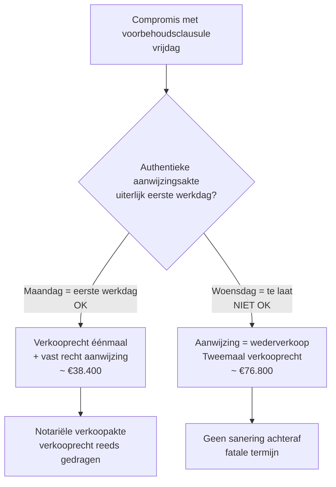

> **Leerstuk — één vraag, helemaal doorgewerkt.** Voor verhaal en routekaart: [[studiemateriaal/2-6|overzicht PO 2.6]]. Het leerstuk [[wat-zijn-registratie-en-successierechten]] zet de heffingen en spelers op een rij; [[registratierechten-vastgoed]] werkt tarieven en grondslagen uit. Hier draait alles om **proces** — welke akte, welke termijn, welke handeling. De aangifte van nalatenschap is een aparte procedurele lijn die in [[erfbelasting-en-aangifte-nalatenschap]] aan bod komt.

## Antwoord in één blik

Registratie is een formaliteit met een **dubbele functie**: fiscaal (de heffing vestigen) en juridisch (vaste datum + bewijskracht tegenover derden). Niet elke akte moet geregistreerd worden, maar voor de akten die wel onder de plicht vallen, zijn de termijnen strikt.

Drie categorieën leven naast elkaar. **Verplicht** registreerbaar zijn alle notariële akten (vooral over onroerend goed, schenkingen, hypotheek, vennootschap), en daarnaast onderhandse akten waarbij vastgoed wordt overgedragen of langdurig verhuurd. **Vrijwillig** registreerbaar zijn de meeste andere onderhandse contracten — partijen kiezen zelf of ze vaste datum willen. **Niet onderworpen** zijn commerciële contracten zonder onroerend-goed-component die zonder registratie blijven.

De termijnen die je paraat moet hebben: **vijftien dagen** voor notariële akten (de notaris bewaakt), **vier maanden** voor onderhandse akten van vastgoed-overdracht, en — de kortste fatale termijn van het hele wetboek — **de eerste werkdag na het compromis** voor de aanwijzing van lastgever in Vlaanderen en federaal. Twee procedurele instrumenten verdienen aandacht bovenop het basisschema: de **command-techniek** voor compromis-koop met later aan te wijzen koper, en de **ruling-aanvraag** waarmee je vooraf zekerheid haalt over een gunstregime. Plus de bezwaarprocedure wanneer het achteraf misloopt.

| Akte | Verplicht registreren? | Termijn |
|---|---|---|
| Notariële akte verkoop onroerend goed | Ja | 15 dagen vanaf akte |
| Notariële akte schenking | Ja | 15 dagen |
| Onderhandse akte verkoop onroerend goed (compromis) | Ja | 4 maanden vanaf akte |
| Onderhandse huur > 9 jaar | Ja | 4 maanden |
| Aanwijzing van lastgever (Vlaanderen / federaal) | Ja | **Eerste werkdag na compromis** *(fataal)* |
| Aangifte van nalatenschap *(aparte lijn — zie [[erfbelasting-en-aangifte-nalatenschap]])* | Ja | 4 maanden vanaf overlijden in België |
| Onderhandse handelsovereenkomst zonder onroerend | Vrijwillig | Geen *(tenzij vaste datum gewenst)* |

We werken vier onderdelen uit: welke akten met welke termijn, sancties bij laattijdigheid, de command-techniek met haar valstrik, en de vertegenwoordigingsrol bij bezwaar en ruling.

---

## Welke akten moet je registreren — en wanneer?

De wet noemt expliciet de **lijst van verplicht registreerbare akten**. De Vlaamse Codex Fiscaliteit volgt voor de gewestelijke materies dezelfde logica. Drie hoofdcategorieën leven naast elkaar.

### Categorie 1 — Authentieke akten

Alle akten verleden voor een notaris (of een andere overheidsambtenaar die authentieke akten opmaakt) zijn verplicht registreerbaar binnen **vijftien dagen** vanaf de datum van de akte. Praktisch betekent dat: elke notariële verkoopakte van onroerend goed, elke notariële schenkingsakte, elke oprichtingsakte of statutenwijziging van een vennootschap, elke akte van hypotheek-vestiging. De notaris bewaakt deze termijn — hij is bovendien solidair aansprakelijk voor het verschuldigde recht.

> **Waarom ligt de termijn voor authentieke akten zo kort?** De fiscale logica: een authentieke akte heeft uit zichzelf al vaste datum en bewijskracht — registratie dient hier vooral om de heffing snel binnen te halen. Voor onderhandse akten geldt de langere viermaanden-termijn omdat partijen tijd nodig hebben om de akte te formaliseren en op te laten zoeken.

### Categorie 2 — Onderhandse akten met vastgoed-component

Een compromis (onderhandse verkoopovereenkomst van onroerend goed), een onderhandse schenking, een onderhandse huurovereenkomst van meer dan negen jaar: voor al deze akten geldt een termijn van **vier maanden** vanaf de datum van de akte. Het compromis triggert al het verkooprecht; de latere notariële akte van levering verwijst naar het reeds betaalde recht en wordt zo niet dubbel belast.

Belangrijke nuance: het compromis en de notariële akte zijn **twee aparte tellers**. Een compromis van 5 april telt vanaf 5 april (vier maanden). De notariële akte daarop telt vanaf zijn eigen datum (vijftien dagen). Beide moeten gerespecteerd zijn voor een risicovrije aflevering.

### Categorie 3 — Vrijwillige registratie

Onderhandse contracten zonder onroerend-goed-component — een leningsovereenkomst, een schuldbekentenis, een samenlevingsovereenkomst, een handelscontract — vallen niet onder de registratieplicht. Partijen mogen ze wel laten registreren als ze **vaste datum** en **bewijskracht tegenover derden** willen. Tarief: het algemeen vast recht (een vast forfaitair bedrag, raadpleegbaar in het Cijferzakboekje). Geen termijn, geen sanctie bij niet-registratie — alleen verlies van vaste datum.

Toegepast op de familie De Wilde: drie situaties. (a) De notariële verkoopakte van de studio Brussel zou onder de vijftiendagen-termijn vallen, met de notaris als bewaker. (b) Een compromis voor diezelfde verkoop zou de viermaanden-teller starten; meestal regelt de notaris dat de notariële akte snel volgt. (c) Een handgift van geld aan de kinderen via overschrijving met een aangetekende brief (de zogenaamde *pacte adjoint*) valt niet onder de verplichting — vrijwillige registratie blijft zinvol om de driejaars-fictiebepaling te omzeilen, een onderwerp dat in [[erfbelasting-en-aangifte-nalatenschap]] aan bod komt.

| Categorie | Voorbeeld | Termijn | Wie bewaakt? |
|---|---|---|---|
| Authentieke akte onroerend | Notariële verkoopakte gezinswoning | **15 dagen** vanaf akte | Notaris *(solidair aansprakelijk)* |
| Authentieke akte schenking | Notariële schenkingsakte ouders naar kinderen | 15 dagen | Notaris |
| Authentieke akte vennootschap | Oprichtingsakte BV of NV | 15 dagen | Notaris |
| Onderhandse akte vastgoed | Compromis verkoop appartement | **4 maanden** vanaf akte | Partijen *(meestal koper)* |
| Onderhandse huur > 9 jaar | Handelshuur 27 jaar | 4 maanden | Partijen |
| Aanwijzing van lastgever (VL/federaal) | Akte van command na compromis | **Eerste werkdag na compromis** *(fataal)* | Partijen + notaris |
| Vrijwillig | Onderhandse leningsovereenkomst | *(geen termijn)* | Partijen op eigen initiatief |

---

## Sancties — wat als je een termijn mist?

Een gemiste termijn betekent niet "geen registratie" — het betekent registratie **mét** een belastingverhoging en nalatigheidsinteresten. In sommige gevallen verlies je bovendien een gunstregime. Voor de adviseur is dit onderdeel vaak belangrijker dan tariefkennis: cliënten bellen zelden met "wat is mijn verkooprecht?" (dat berekent de notaris), wel met "we zijn dit vergeten te registreren, wat nu?".

**Belastingverhoging.** Het algemene principe is een verhoging van het verschuldigde recht, met een schaal die loopt van bescheiden percentages bij eerste overtreding te goeder trouw tot zeer hoge percentages bij herhaling of frauduleus opzet. De Vlaamse en de federale schaal verschillen in detail (de VCF gebruikt een eigen indeling, het federale W.Reg. werkt met andere percentages), maar de logica is dezelfde: hoe meer recidive of kwade trouw, hoe zwaarder de verhoging. Concrete percentages staan in het Cijferzakboekje.

**Nalatigheidsinteresten.** Bovenop het recht en de verhoging loopt nalatigheidsrente vanaf de wettelijke vervaldag. Het tarief is marktconform en wordt jaarlijks aangepast. Op grote bedragen tikt het snel op.

**Verlies van gunstregime.** Verschillende gunstregimes (verlaagd tarief eigen woning, abattement, gunstregime familiale onderneming) hangen aan formele voorwaarden die in de akte zelf vermeld moeten staan en aan termijnen die strikt moeten gerespecteerd worden. Een niet-tijdige registratie of een niet-vermelding van het gunstregime betekent terugkeer naar het standaardtarief plus de verschuldigde verhoging. Dat is niet altijd reparabel.

**Solidaire aansprakelijkheid.** Bij notariële akten staat de notaris solidair in voor het recht — hij heeft een eigen incasso-belang om binnen de vijftiendagen-termijn te registreren. Bij onderhandse akten zijn alle ondertekenende partijen hoofdelijk aansprakelijk: de fiscus kan kiezen wie hij vervolgt. In de praktijk wordt meestal de koper aangesproken (hij draagt het recht economisch), maar juridisch staat de verkoper er ook voor.

Toegepast op De Wilde, hypothetisch: stel dat Filip en Lieve hun studio Brussel verkopen via een compromis op 1 maart 2026 en daarna vergeten te registreren. De notariële levering volgt pas in oktober. De viermaanden-termijn op het compromis is dan al verstreken op 1 juli. De fiscus int alsnog het verkooprecht op het compromis (12,50 % in Brussel), verhoogt met een belastingverhoging volgens schaal, en rekent nalatigheidsrente vanaf 1 juli. Op een appartementsverkoop van een paar honderdduizend euro praat je dan snel over een aanvullende kost van enkele duizenden tot meer dan tienduizend euro.

> **Adviseur-tip — het regularisatie-pad.** Bij een gemiste termijn zijn er grosso modo twee sporen. Spoor 1: snel registreren met aanvaarding van de verhoging — beperkt de schade als de termijnoverschrijding beperkt is en er geen fraude in het spel is. Spoor 2: bezwaarschrift opbouwen indien sprake is van overmacht, dwaling, of een onjuiste interpretatie door de fiscus. Welk spoor verstandig is, hangt af van de omvang van de overschrijding en het dossier. Documenteer de feiten **vóór** je iets onderneemt.

| Termijn gemist | Hoofdgevolg | Aanvullend |
|---|---|---|
| 15 dagen authentieke akte | Belastingverhoging op verkooprecht | Notaris is in praktijk eerste aanspreekpunt; civiele regres mogelijk |
| 4 maanden onderhandse akte vastgoed | Belastingverhoging + nalatigheidsinteresten | Koper meestal vervolgd; bij oneerlijkheid zwaarder |
| Eerste werkdag command *(VL/federaal)* | **Geen verhoging — gunstregime vervalt** | Aanwijzing = wederverkoop → **tweemaal verkooprecht** |
| Vrijwillige registratie | N.v.t. *(geen plicht)* | Verlies van vaste datum |

---

## De command-techniek — koop met aanwijzing van lastgever

Dit is de techniek die het examen het vaakst toetst. Het scenario: een onderneming wil een goed kopen maar wil dat niet meteen tonen aan de verkoper (om prijsverhoging te vermijden) of moet nog beslissen wie uiteindelijk koper wordt. Oplossing: **iemand anders sluit het compromis** met een clausule "voor zichzelf of een later aan te wijzen persoon". In een latere akte — de **aanwijzing van lastgever**, ook wel akte van *command* of *déclaration de command* in de Franstalige praktijk — wordt de werkelijke koper bekendgemaakt.

De techniek heeft een fiscaal doel: vermijden dat de operatie als twee opeenvolgende verkopen wordt belast (eerst aan de tussenpersoon, dan aan de werkelijke koper). Bij naleving van alle voorwaarden wordt het verkooprecht slechts éénmaal geheven en kost de aanwijzingsakte alleen een vast recht. Bij niet-naleving belast de fiscus de aanwijzing als een wederverkoop — en dat betekent **tweemaal verkooprecht**.

### De drie cumulatieve voorwaarden

De wet stelt drie voorwaarden die **alle drie** vervuld moeten zijn:

**a) Voorbehoud in het compromis.** De clausule "voor zichzelf of een later aan te wijzen persoon" moet expliciet in het compromis (of de toewijzingsakte) staan. Een voorbehoud dat later wordt toegevoegd telt niet — het moet er op de dag van het compromis al in staan.

**b) Authentieke akte van aanwijzing.** De aanwijzing zelf moet bij authentieke akte gebeuren, dus voor een notaris. Een onderhandse aanwijzing volstaat niet.

**c) Tijdige registratie of betekening.** De aanwijzing moet ter registratie aangeboden zijn (of bij gerechtsdeurwaarders-exploot betekend) **uiterlijk de eerste werkdag** na de dag van het compromis. Dit is in Vlaanderen en op federaal niveau de regel. In het Brussels Hoofdstedelijk Gewest en Wallonië werd deze termijn opgerekt tot de **vijfde werkdag** — een belangrijke regionale afwijking om te onthouden.

> **Sterkmaking is iets anders dan command.** De term "sterkmaking" (Franstalig *porte-fort*) komt uit het algemeen burgerlijk recht en houdt in dat iemand zich sterk maakt voor de ratificatie door een derde — die derde is op het moment van de akte juridisch nog geen partij. Bij een command is de tussenpersoon zelf koper, met voorbehoud van aanwijzing. Beide technieken worden in examenvragen vaak verwisseld, maar volgen een ander fiscaal regime: een sterkmaking die door de derde wordt geratificeerd, wordt klassiek als wederverkoop behandeld.

### De De Wilde-casus

De Wilde Bouw NV wil het aanpalende braakliggende terrein kopen voor uitbreiding van de werkplaats. Prijs: €320.000. Filip vraagt zijn neef Joris (zonder zichtbare band met de NV) een compromis te sluiten met de verkoper. Vrijdag 5 april 2026 wordt het compromis getekend, mét de clausule "voor zichzelf of een later aan te wijzen persoon". De aanwijzingsakte ten gunste van De Wilde Bouw NV wordt verleden op **maandag 8 april** — de eerste werkdag na vrijdag, want zaterdag en zondag tellen niet als werkdag. Voorwaarde (c) is net gehaald.

Resultaat bij naleving: één verkooprecht (12 % in Vlaanderen × €320.000 = €38.400) plus het algemeen vast recht op de aanwijzingsakte. Eindfactuur: ca. €38.400 — exact wat een rechtstreekse aankoop zou kosten.

| Stap | Wat gebeurt | Termijn | Tarief |
|---|---|---|---|
| 1. Compromis met voorbehoudsclausule | Joris koopt onderhands van verkoper, clausule expliciet opgenomen | Datum compromis = start | *(compromis nog niet geregistreerd)* |
| 2. Authentieke akte van aanwijzing | Joris wijst De Wilde Bouw NV aan bij notaris | **Eerste werkdag na compromis** *(VL/federaal)* | **Algemeen vast recht** *(Cijferzakboekje)* |
| 3. Notariële akte verkoop | Notariële verkoopakte verlijdt aan de aangewezen lastgever | 15 dagen | **Verkooprecht éénmaal** *(12 % VL × grondslag)* |
| **Totaal bij naleving** | | | **~ één verkooprecht** |
| **Totaal bij gemiste voorwaarde (a, b of c)** | Aanwijzing = wederverkoop → twee transacties belast | | **Tweemaal verkooprecht** |

### De klassieke valstrik

De fatale termijn is onverbiddelijk: er is geen sanering achteraf mogelijk. Stel dat Joris de aanwijzingsakte pas op woensdag 10 april verlijdt in plaats van maandag 8 april — drie dagen te laat. De fiscus behandelt de aanwijzing dan als een wederverkoop: eerst van de verkoper naar Joris (op het compromis), daarna van Joris naar De Wilde Bouw NV (op de aanwijzing). Resultaat: **tweemaal verkooprecht**, dus 12 % × €320.000 = €38.400 betaald door Joris op het compromis, en nog eens 12 % × €320.000 = €38.400 betaald op de aanwijzing. Eindfactuur: **€76.800** in plaats van **~€38.400**. Een verschil van zo'n €38.400 — bij een gemiddelde aankoop tikt dit hard aan.

---

## Vertegenwoordiging — bezwaar, ruling, minnelijk overleg

De accountant treedt regelmatig op als **gemandateerde** tegenover Vlabel (voor materies onder de Vlaamse Codex Fiscaliteit) of de FOD Financiën (voor federale registratie- en successierechten, dus in Brussel en Wallonië). Drie procedure-instrumenten beheers je.

**Bezwaarschrift.** Het instrumentele rechtsmiddel tegen een aanslag waarmee de belastingplichtige niet akkoord gaat. Termijn: **drie maanden** vanaf de verzending van het aanslagbiljet. Vorm: schriftelijk, gemotiveerd, ingediend bij Vlabel of bij de bevoegde dienst van de FOD. De gemandateerde accountant kan namens de cliënt ondertekenen — het mandaat moet expliciet zijn (een volmacht of een opdracht-overeenkomst die fiscale vertegenwoordiging vermeldt). Wordt het bezwaar afgewezen, dan blijft de gerechtelijke fase open via de fiscale kamer van de rechtbank van eerste aanleg.

**Ruling of voorafgaande beslissing.** Een ruling vraagt **vóór** een verrichting zekerheid over de fiscale behandeling. Twee bevoegde instanties bestaan naast elkaar: de **Dienst Voorafgaande Beslissingen** (DVB) voor de federale belastingen, en **Vlabel** met een eigen ruling-procedure voor de materies onder de VCF. De behandeling duurt typisch enkele maanden. Een positieve ruling bindt de administratie voor het beschreven feitenkader — bijzonder waardevol bij complexe verrichtingen.

Voorbeelden van ruling-waardige situaties: een aanvraag van het gunstregime familiale onderneming met een twijfelende continuïteitsvoorwaarde; een inbreng van vastgoed in een vennootschap waarbij anti-misbruik kan spelen; een gesplitste aankoop met voorbehoud van vruchtgebruik die mogelijk wordt geherkwalificeerd; een schenking met last waarvan de gevolgen voor de driejaars-fictie onduidelijk zijn. Telkens loont het de moeite vooraf duidelijkheid te halen in plaats van achteraf te procederen.

**Minnelijk overleg over waardering.** Bij waarderingsgeschillen — typisch een aanslag op een onroerend goed waarvan de cliënt de geschatte waarde te hoog vindt — bestaat een **minnelijk overleg-procedure**: een verzoek aan de administratie om de waardering te herzien aan de hand van een tegenexpertise. Slaagt het minnelijk overleg niet, dan blijft de gerechtelijke weg open.

Voor de accountant vraagt dit type werk **dossier-discipline**: elk gesprek met Vlabel of de FOD wordt gedocumenteerd, alle relevante feiten (huwelijksstelsel, eerdere schenkingen, fiscale woonplaats, akteverwijzingen) worden vooraf geverifieerd. Een bezwaarschrift dat steunt op een verkeerd feit valt automatisch om — en met dat bezwaar verdwijnt vaak ook de geloofwaardigheid bij de behandelend ambtenaar voor het vervolg van het dossier.

> **Waar leef de algemene belastingprocedure?** De volledige procedure-leer (controleprocedures, bezwaar in detail, gerechtelijke fase) zit grotendeels in **PO 2.4**. Het PO 2.6-specifieke deel is hier: weten welk loket competent is (Vlabel of de FOD), de **inhoudelijke argumenten** kennen die in registratie- of erfbelasting-geschillen spelen (waardering, gunstregime-toepassing, fictiebepalingen), en de specifieke bezwaartermijn voor deze materies paraat hebben.

| Instrument | Wanneer? | Termijn | Bevoegd loket |
|---|---|---|---|
| Bezwaarschrift | Na aanslag — niet akkoord | **3 maanden** vanaf aanslagbiljet | Vlabel *(VCF)* · FOD Financiën *(W.Reg./W.Succ.)* |
| Ruling | Vóór verrichting — zekerheid gewenst | Behandeling enkele maanden | DVB *(federaal)* · Vlabel *(VCF)* |
| Minnelijk overleg waardering | Waarderings-geschil onroerend | Per dossier | Vlabel of FOD |
| Gerechtelijke fase | Na afwijzing bezwaar | Termijn dagvaarding *(zie PO 2.4)* | Rechtbank van eerste aanleg *(fiscale kamer)* |

---

## Drie valkuilen

> **Valkuil 1 — De command-termijn verkeerd interpreteren.** Vrijdag-compromis betekent uiterlijk maandag aanwijzingsakte (zaterdag en zondag tellen niet als werkdag). Dinsdag-compromis betekent uiterlijk woensdag. Vergeet ook niet wettelijke feestdagen mee te tellen — een compromis vlak voor een feestdag verkort je manoeuvreerruimte mogelijk verder. Belangrijke regionale nuance: in Brussel en Wallonië geldt de **vijfde** werkdag, niet de eerste. Wie de Vlaamse logica klakkeloos toepast op een Brussels of Waals dossier zit fout in de andere richting. De fout kost in het Vlaams scenario direct het dubbele recht — geen herstelmogelijkheid.

> **Valkuil 2 — Vrijwillige registratie verwarren met verplichte.** Een onderhandse leningsovereenkomst tussen vader en kind is **niet verplicht** registreerbaar — registratie dient hier louter om vaste datum te bekomen, geen termijn, geen sanctie. Maar een handgift van geld van vader aan kind via overschrijving is óók niet verplicht registreerbaar — terwijl vrijwillige registratie hier wel **zwaar aangeraden** is om de driejaars-fictiebepaling te omzeilen. Zie [[erfbelasting-en-aangifte-nalatenschap]] en [[successieplanning-en-gunstregime]] voor de planningslogica.

> **Valkuil 3 — Geen mandaat = geen bezwaar.** De accountant die optreedt namens een cliënt moet expliciet gemandateerd zijn — een algemene opdracht voor boekhouding volstaat niet, je hebt een volmacht of een opdracht-overeenkomst nodig die fiscale vertegenwoordiging vermeldt. Een bezwaarschrift dat door een "consultant" zonder geldig mandaat wordt ingediend, wordt door Vlabel of de FOD geweigerd — en die weigering kan komen op het moment dat de bezwaartermijn al verstreken is. Regel dit vroeg in de cliëntrelatie, niet wanneer het dossier urgent wordt.

---

## Wanneer je dit snapt, ga dan naar:

- [[erfbelasting-en-aangifte-nalatenschap]] — naast de registratieformaliteit bestaat de **aangifte van nalatenschap**, met een eigen viermaanden-termijn, eigen aangifteplichtigen en eigen sancties.
- [[successieplanning-en-gunstregime]] — veel planningsinstrumenten hangen aan **formele voorwaarden** (registratie, voorbehoud in akte, ruling-bevestiging). Zonder formaliteit valt het gunstregime weg.
- [[registratierechten-vastgoed]] — terug-link wanneer een procedurele kwestie raakt aan tariefinhoud.
- [[studiemateriaal/2-6/samenvatting|Samenvatting PO 2.6]] — voor herhaling vlak vóór het examen: termijn-kompas, command-flow en bezwaar-pad in één oogopslag.

**Voor wie definitorisch detail wil opzoeken**: [[registratieformaliteit-akten]] · [[verkooprecht]]

---

## Wettelijk fundament

- Verplicht te registreren akten: W.Reg. art. 19 (federaal en gewestelijk parallel) — opsomming van akten die binnen de termijnen van art. 32 moeten worden geregistreerd.
- Termijn authentieke akten — vijftien dagen: W.Reg. art. 32, 1° / VCF art. 3.12.3.0.1.
- Termijn onderhandse akten vastgoed-overdracht — vier maanden: W.Reg. art. 33 in samenhang met art. 31 (federaal en gewestelijk parallel).
- Aanwijzing van lastgever (command/déclaration de command): W.Reg. art. 158, 1° (federaal — eerste werkdag) / W.Reg. art. 159, 1° (Brussel en Wallonië — **vijfde werkdag**) / VCF art. 2.9.6.0.1, 1° (Vlaanderen — eerste werkdag). Drie cumulatieve voorwaarden — voorbehoud in compromis, authentieke aanwijzingsakte, tijdige registratie of betekening; bij niet-naleving wordt de aanwijzing als wederverkoop beschouwd.
- Solidaire aansprakelijkheid notaris voor het recht: W.Reg. art. 35.
- Belastingverhoging laattijdige aangifte of registratie: VCF art. 3.18.0.0.4 met uitvoeringsbesluit (Vlaams gewest); federaal: W.Reg. boetebepalingen met KB-tariefschaal.
- Nalatigheidsinteresten: VCF art. 3.9.2.0.1 / federaal: W.Reg. + KB.
- Algemeen vast recht (bij vrijwillige registratie + aanwijzingsakte): W.Reg. art. 11 — bedrag in Cijferzakboekje.
- Bezwaarprocedure Vlabel: VCF art. 3.5.1.0.4 (termijn drie maanden vanaf aanslagbiljet).
- Ruling federaal: Wet 24 december 2002 — Dienst Voorafgaande Beslissingen (DVB).
- Ruling Vlabel: VCF art. 3.22.0.0.1 e.v.
