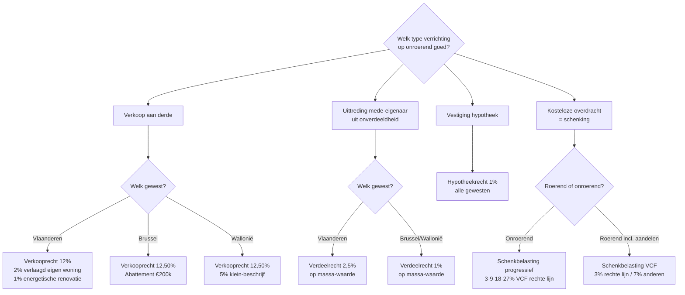

> **Leerstuk — één vraag, helemaal doorgewerkt.** Lees eerst [[wat-zijn-registratie-en-successierechten]] — die geeft de koepel, de drie gewesten en de civiele basis waarop dit leerstuk verder bouwt. Voor verhaal en routekaart: [[studiemateriaal/2-6|overzicht PO 2.6]].

## Antwoord in één blik

Eén onroerend goed kan op vier manieren een evenredig registratierecht oproepen: bij **verkoop** aan een derde, bij **verdeling** tussen mede-eigenaars, bij **hypotheekvestiging** en bij **schenking onder levenden**. Die vier rechten sluiten elkaar uit — per verrichting speelt er één. De grondslag is steeds een verkoopwaarde of een bedongen prijs; alleen het tarief, het gewest en het mogelijke gunstregime verschillen.

Voor de juiste heffing volg je drie keuze-assen achter elkaar: eerst het **type verrichting** (verkoop ≠ verdeling ≠ hypotheek ≠ schenking), dan het **gewest** waar het goed ligt, dan een eventueel **gunstregime** (verlaagd tarief, abattement, klein-beschrijf). De exacte cijfers ken je niet uit het hoofd — die staan in het Cijferzakboekje. Wat je wél paraat moet hebben: welk recht in welke situatie speelt, hoe je de grondslag correct bepaalt (volle eigendom, blote eigendom of massa) en welke voorwaarden een gunstregime activeren.

| Recht | Wanneer? | Vlaams tarief | Brussels tarief | Waals tarief |
|---|---|---|---|---|
| **Verkooprecht** | Overdracht onroerend goed aan derde | 12 % *(2 % enige eigen woning)* | 12,50 % *(abattement € 200.000)* | 12,50 % *(klein-beschrijf 5 %)* |
| **Verdeelrecht** | Uittreding uit onverdeeldheid | 2,5 % | 1 % | 1 % |
| **Hypotheekrecht** | Vestiging hypotheek | 1 % | 1 % | 1 % |
| **Schenkrecht onroerend** *(rechte lijn)* | Onroerende schenking aan kind of partner | 3-9-18-27 % progressief | 2-5,4-12-24 % progressief | 3-9-18-24 % progressief |

Hieronder werk je eerst de vier rechten op één rij uit, dan de grondslag-logica, dan abattement en verlaagd tarief, daarna de verdeelrecht-mechaniek, en je sluit af met een synthese en accountant-perspectief.

---

## Vier rechten op één rij — wat treffen ze en wanneer?

De stelregel die je het meest helpt: bij elke vastgoed-akte zijn er vier mogelijke evenredige heffingen, en ze sluiten elkaar uit. De vraag is dus altijd: **welk type verrichting** ligt voor? Daaruit volgt het recht, en pas dan komen gewest en gunstregime in beeld.

### Verkooprecht — overdracht aan een derde

Het verkooprecht treft de overdracht onder bezwarende titel aan iemand **buiten** de familie- of mede-eigendomskring. Een klassieke koop tussen vreemden, een verkoop aan een vennootschap, een onroerende ruil — telkens spreekt het verkooprecht. Het is altijd ten laste van de **koper**: de verkoper draagt het niet, tenzij contractueel afgesproken. Het tarief is gewest-gebonden — 12 % in Vlaanderen, 12,50 % in Brussel en Wallonië.

### Verdeelrecht — uittreding van een mede-eigenaar

Het verdeelrecht treft een fundamenteel andere situatie: een mede-eigenaar treedt uit een **onverdeeldheid**. Twee broers erven samen een huis en één koopt de ander uit. Een scheidend echtpaar verdeelt de gezinswoning. Een groep vrienden die samen een appartement aan zee bezat, gaat uit elkaar. Telkens speelt geen koop maar een **verdeling**: degene die blijft, versterkt zijn positie naar volle eigendom; degene die uittreedt, ontvangt zijn deel in geld of in een ander goed. Het tarief is beduidend lager: 2,5 % in Vlaanderen, 1 % in Brussel en Wallonië.

### Hypotheekrecht — vestiging van een zekerheid

Bij een hypotheek hef je niet op de overdracht van het goed maar op de **vestiging van een zakelijke zekerheid** erop. Vaak komt het hypotheekrecht in dezelfde notariële akte voor als een aankoop (de bank krijgt een hypotheek tot zekerheid van de aankoopkrediet), maar conceptueel is het een aparte heffing op een aparte verrichting. Het tarief is uniform 1 % in alle drie gewesten, berekend op het hypothecair ingeschreven bedrag.

### Schenkrecht onroerend — kosteloze overdracht onder levenden

De **kosteloze overdracht onder levenden** van een onroerend goed valt onder het schenkrecht. Het tarief is progressief per schijf, met een scherp onderscheid tussen **rechte lijn** (kinderen, kleinkinderen, echtgenoot, samenwonende partner) en **andere personen** (broers, zussen, vrienden, derden). Hier liggen de regimeverschillen tussen de gewesten het sterkst — Vlaanderen heeft een vlak en verlaagd tarief voor roerende schenkingen, maar voor onroerende schenkingen blijft het schalenstelsel overal van kracht.

De De Wilde-familie maakt het concreet. **Filip en Lieve** verkopen hun studio in Brussel (gemeenschappelijk goed, marktwaarde € 220.000) voor € 240.000 aan een 28-jarige werknemer die er gaat wonen → **verkooprecht** Brussel, ten laste van de koper. Filip en zijn broer waren sinds 2010 mede-eigenaar van het vakantieverblijf in Knokke en in 2016 koopt **broer Filip uit** voor € 280.000 (massa € 560.000) → **verdeling**, geen verkoop. Filip neemt op de gezinswoning in Antwerpen een hypothecaire lening van € 150.000 → **hypotheekrecht** van 1 % op het ingeschreven bedrag = € 1.500.

De beslisboom hieronder volgt deze drie keuze-assen — type, gewest, gunstregime — en eindigt bij één van de vier evenredige rechten.

**Synthese**: bepaal eerst het type verrichting, dan het gewest, dan het gunstregime. Pas dan reken je.

---

## De grondslag-logica — verkoopwaarde, prijs, of minimum?

Nu het type-recht vaststaat, komt de tweede vraag: **waarop reken je het tarief?** De wet hanteert één algemene regel en twee minimum-regels die als anti-misbruik-vangnetten dienen. Begrijp je deze drie regimes, dan vermijd je de zwaarste valkuilen rond blote eigendom en vruchtgebruik.

De **algemene regel** is dat de grondslag gelijk is aan de **bedongen prijs en lasten**, met als minimum de **verkoopwaarde van het overgedragen goed**. In gewone gevallen — volle eigendom, normale marktwaarde — vallen prijs en verkoopwaarde samen, dus heft de fiscus op de prijs. Ligt de bedongen prijs aantoonbaar onder de marktwaarde (klassiek bij een familie-verkoop tegen een vriendenprijs), dan wordt op de verkoopwaarde geheven. Het verschil heet "tekortschatting" en kan extra rechten plus boetes opleveren.

Daarop bestaan twee bijzondere regels voor blote-eigendom-transacties.

De **eerste minimum-regel** geldt wanneer de vervreemder het vruchtgebruik **voor zichzelf voorbehoudt**. Vader verkoopt aan zijn zoon de blote eigendom van een appartement, maar houdt zelf het vruchtgebruik. Hier eist de wet dat de grondslag minstens gelijk is aan de **verkoopwaarde van de volle eigendom** — geen aftrek voor het voorbehouden vruchtgebruik. De ratio: de vervreemder houdt het genot voor zichzelf en mag dat niet aanwenden om de heffing op een lagere som te berekenen.

De **tweede minimum-regel** geldt wanneer het vruchtgebruik **door een derde gevestigd is**, dus niet door de vervreemder voorbehouden. Een vader verkoopt de blote eigendom van een appartement aan zijn dochter; tegelijk wordt het vruchtgebruik gevestigd ten gunste van een vennootschap voor tien jaar. Hier is de grondslag gelijk aan de volle eigendom **min de forfaitaire waarde van het vruchtgebruik**, berekend volgens de leeftijds-coëfficiënt uit het algemene W.Reg. Hier mag wél een aftrek toegepast worden, omdat de vervreemder zelf geen rechten meer behoudt over het goed.

Het verschil tussen beide regels is wezenlijk en is bij De Wilde concreet te maken. Stel dat Filip en Lieve de blote eigendom van een nieuw appartement Antwerpen kopen voor € 280.000, en De Wilde Bouw NV het vruchtgebruik voor tien jaar voor € 120.000 — totale verkoopwaarde € 400.000. Het vruchtgebruik wordt **door een derde** gevestigd (de vennootschap), niet door de vervreemder voorbehouden. Dus speelt de tweede regel: grondslag voor de blote-eigendom-koop = € 400.000 minus de forfaitaire waarde van het vruchtgebruik. Was het scenario omgekeerd geweest — de vorige eigenaar verkoopt de blote eigendom maar houdt zelf het vruchtgebruik — dan zou de eerste regel spelen en zou de grondslag de volle € 400.000 zijn, zonder aftrek.

| Situatie | Grondslag | Logica |
|---|---|---|
| Verkoop volle eigendom aan derde | Bedongen prijs *(min. = verkoopwaarde)* | Algemene regel — fiscus volgt de markt |
| Verkoop blote eigendom — vruchtgebruik voorbehouden door vervreemder | Verkoopwaarde **volle eigendom** *(geen aftrek)* | Vervreemder houdt genot zelf — geen aftrek |
| Verkoop blote eigendom — vruchtgebruik door derde gevestigd | Volle eigendom **min** forfait vruchtgebruik *(wel aftrek)* | Vervreemder geeft alles weg — aftrek toegestaan |
| Verdeling onverdeeldheid | Verkoopwaarde van de **volledige massa** | Versterking volle eigendom — eenmalige heffing op het hele goed |

> **Anti-misbruik op de loer.** Deze minimum-regels bestaan om "splitsings-trucs" te neutraliseren. De klassieke planning was: ouders kopen de blote eigendom, hun vennootschap koopt het vruchtgebruik, bij het einde van het vruchtgebruik bekomen de ouders volle eigendom zonder verdere heffing. Zonder de minimum-regels zouden de heffingen gehalveerd worden. Met de twee regels vermindert het voordeel of verdwijnt het. Bovendien kan de algemene anti-misbruik-bepaling herkwalificeren als geheel-eigendom-aankoop, tenzij niet-fiscale motieven aantoonbaar zijn.

---

## Abattement Brussel + verlaagd tarief Vlaanderen — eigen woning

De koper die zijn **enige, eigen, hoofdverblijfplaats** koopt, krijgt in elk gewest een fiscale gunst — maar via drie verschillende mechanismen die elkaar niet spiegelen. In Vlaanderen daalt het **tarief**, in Brussel verlaagt het **abattement de grondslag**, in Wallonië kennen ze een verminderd "klein-beschrijf"-tarief voor bescheiden woningen. Wie de drie regimes door elkaar haalt of de voorwaarden mist, betaalt al snel een veelvoud.

In **Vlaanderen** zakt het verkooprecht van 12 % naar **2 %** voor de enige eigen woning, sinds 2022. Drie cumulatieve voorwaarden moeten in de akte vermeld zijn: het moet de **enige** woning zijn van de koper (geen ander onroerend in volle eigendom op het moment van de akte, met een overgangstermijn van twee jaar), de woning moet door een **natuurlijke persoon** worden gekocht (niet via een vennootschap), en de koper moet er binnen **drie jaar** na de akte zijn **hoofdverblijfplaats** vestigen en minstens **vijf jaar** behouden. Bij een ingrijpende energetische renovatie of een beschermd monument zakt het tarief verder naar **1 %**, voor verkoopovereenkomsten gesloten vóór een door de wet bepaalde einddatum — het Cijferzakboekje geeft het juiste eindjaar. Mist één voorwaarde, dan vervalt het gunstregime en kunnen vroeger geheven rechten worden teruggevorderd, vermeerderd met boetes.

In **Brussel** ligt de techniek anders: niet het tarief zakt, maar de **grondslag** wordt verminderd met een vast abattement. De koper betaalt 12,50 % over de prijs minus het abattement, in plaats van 12,50 % over de volle prijs. De voorwaarden: een **natuurlijke persoon** moet de **geheelheid in volle eigendom** verwerven van een geheel of gedeeltelijk tot bewoning bestemd onroerend goed, daar zijn **hoofdverblijfplaats** vestigen en die termijn behouden volgens de wettelijke voorwaarden. Anders dan in Vlaanderen is er **geen "enige" woning-vereiste**, maar de **geheelheid in volle eigendom** is wel een hard criterium — een splitsing met vruchtgebruik door een vennootschap of derde sluit het abattement uit. Het exacte abattementsbedrag en de maximumprijs lees je in het Cijferzakboekje.

In **Wallonië** geldt voor "bescheiden woningen" een **verminderd tarief van 5 %** in plaats van 12,50 % — het zogenaamde "klein-beschrijf". De voorwaarden zijn beperkter dan in Vlaanderen: het kadastraal inkomen moet onder een drempel blijven, de koper moet er hoofdverblijfplaats vestigen, en niet elke starter kwalificeert. De decreten leggen nog bijkomende voorwaarden op die per regio kunnen verschillen — voor de stagiair volstaat het mechanisme te kennen.

|   | **Vlaanderen** *(verlaagd tarief)* | **Brussel** *(abattement op grondslag)* | **Wallonië** *(klein-beschrijf)* |
|---|---|---|---|
| Mechanisme | Tarief 12 % → **2 %** | Grondslag **verminderd met abattement** | Tarief 12,50 % → **5 %** |
| Kernvoorwaarde 1 | Enige woning *(geen ander volle-eigendom-vastgoed)* | Geheelheid in volle eigendom *(geen splitsing)* | Bescheiden kadastraal inkomen *(onder drempel)* |
| Kernvoorwaarde 2 | Hoofdverblijfplaats binnen termijn | Hoofdverblijfplaats binnen termijn | Hoofdverblijf |
| Behoudstermijn | Wettelijke minimumtermijn | Wettelijke minimumtermijn | Wettelijke minimumtermijn |
| Extra verlaging | **1 %** bij ingrijpende energetische renovatie of monument *(beperkt in de tijd)* | Geen verdere verlaging | Cumulatie met andere stimuli mogelijk |

De impact wordt het meest tastbaar bij een concrete koop. **Sofie en Tom** kopen in juni 2026 een appartement Gent voor € 380.000 als hun hoofdverblijfplaats. Sofie heeft geen ander onroerend goed in volle eigendom — eerste woning, dus enige woning. Zonder gunstregime zou de heffing 12 % × € 380.000 = € 45.600 zijn. Met het verlaagd tarief van 2 % wordt dat 2 % × € 380.000 = **€ 7.600** — een besparing van € 38.000. Bij een ingrijpende energetische renovatie (mits in de wettelijke termijn) zou het tarief naar 1 % zakken: 1 % × € 380.000 = **€ 3.800**.

Voor de **Brusselse studio** die Filip en Lieve verkopen aan een 28-jarige werknemer die er gaat wonen, kan de koper het abattement van art. 46bis vragen. De studio kost € 240.000 en de koper voldoet aan de voorwaarden. Met het abattement: 12,50 % × (€ 240.000 − abattementsbedrag) — substantieel minder dan de € 30.000 die zonder abattement verschuldigd zou zijn.

| Sofie's aankoop Gent (€ 380.000) | Berekening | Verkooprecht |
|---|---|---|
| Zonder gunstregime | 12 % × 380.000 | **€ 45.600** |
| Met VCF 2 % | 2 % × 380.000 | **€ 7.600** *(besparing € 38.000)* |
| Met VCF 1 % bij energetische renovatie | 1 % × 380.000 | **€ 3.800** *(besparing € 41.800)* |

> **Examen-favoriete valkuil.** Vraag nooit het abattement of het verlaagd tarief op een **blote-eigendomsaankoop**. Het Brusselse abattement eist "geheelheid in volle eigendom"; het Vlaamse verlaagd tarief eist "enige eigen woning" en hoofdverblijfplaats. Splitsing met een vennootschap of derde-vruchtgebruiker doodt allebei de regimes. Cliënt-advies: wie het regime wil, koopt volle eigendom of doet het niet.

---

## Verdeelrecht — wanneer 1 % of 2,5 % in plaats van 12 %?

Bij de uittreding van een mede-eigenaar uit een onverdeeldheid kan je tussen een tarief van 1 % en een tarief van 12,50 % vallen — een **twaalfvoudig verschil**. De keuze is geen optie maar wordt bepaald door de **aard van de overdracht**, die rechtstreeks volgt uit de feiten. Wie de typologie verkeerd leest, betaalt veel of adviseert een cliënt verkeerd.

De stelregel is scherp. **Verdeelrecht** speelt zodra een onverdeeldheid wordt opgeheven door uittreding van een mede-eigenaar tegen vergoeding aan zijn voormalige mede-eigenaar of mede-eigenaars. **Verkooprecht** speelt zodra een mede-eigenaar zijn aandeel verkoopt aan iemand **buiten** de onverdeeldheid — een vreemde, een vennootschap, een buurman die niet eerder mede-eigenaar was.

Bij De Wilde Knokke is dit zonneklaar. Bij het overlijden van Filip's vader in 2010 erfden Filip en zijn broer elk de helft van het vakantieverblijf in Knokke (toen waarde € 560.000). In 2016 koopt Filip de helft van zijn broer uit voor een bedongen prijs van € 280.000. Filip was al mede-eigenaar; broer treedt uit. Dat is **verdeling** — geen verkoop. Tarief Vlaams: 2,5 % op de **massa** van € 560.000 = **€ 14.000**.

Zou Filip's broer in plaats daarvan zijn aandeel hebben verkocht aan **een derde** — een vriend, een vennootschap, een buurman zonder mede-eigendom — dan was het wel verkoop. Verkooprecht 12 % op het overgedragen aandeel (€ 280.000) = **€ 33.600**. En geen abattement of verlaagd tarief, want de koper vestigt er geen hoofdverblijfplaats: een vakantieverblijf kwalificeert daar niet voor.

De **grondslag-regel** voor het verdeelrecht is cruciaal: het wordt geheven op de **massa-waarde** — de volledige verkoopwaarde van het onverdeelde goed — **niet** op het overgedragen aandeel alleen. De logica zit in het effect: de blijvende mede-eigenaar versterkt zijn positie naar volle eigendom, en de fiscus beschouwt dat fiscaal als een eenmalige heffing op het hele goed. Wie alleen op het overgedragen aandeel zou rekenen, mist de helft van de grondslag.

De gewestelijke tarieven verschillen aanzienlijk: **2,5 %** in Vlaanderen tegen **1 %** in Brussel en Wallonië. Het Vlaamse tarief zakt naar 1 % in specifieke gevallen — bij verdeling tussen ex-echtgenoten of ex-wettelijke samenwoners na het einde van hun relatie. De **ligging van het goed** bepaalt welk gewest van toepassing is — Knokke ligt in Vlaanderen, dus speelt het Vlaamse tarief, ook al woont Filip in Antwerpen en woonde zijn broer ergens anders.

| De Wilde Knokke — verschillende scenario's | Grondslag | Vlaams tarief | Bedrag |
|---|---|---|---|
| Filip koopt broer uit *(verdeling)* | Massa € 560.000 | 2,5 % | **€ 14.000** |
| Broer verkoopt aan derde *(verkoop)* | Aandeel € 280.000 | 12 % *(geen hoofdverblijf koper)* | **€ 33.600** |
| Derde koopt heel verblijf na uitkoop *(verkoop volle eigendom)* | Verkoopwaarde € 560.000 | 12 % | € 67.200 |
| Hypothetisch scenario Brussel — Filip koopt broer uit | Massa € 560.000 | 1 % *(Brussel)* | **€ 5.600** |

> **Familie-recht in oorsprong.** Het verdeelrecht is historisch ontwikkeld om erfenis-verdelingen niet zwaarder te belasten dan nodig. Anders zou elke uitkoop tussen broers exorbitant duur worden, wat het ontbinden van een familiale onverdeeldheid onmogelijk zou maken. Bij scheidings-vastgoed werkt het analoog: één ex-partner neemt de gezinswoning over tegen vergoeding aan de ander — verdeling, niet verkoop. Het tarief volgt het gewest van ligging van het goed.

> **Examen-valkuil — lees de feiten goed.** "Filip verkoopt zijn aandeel aan zijn broer" suggereert verkoop, maar juridisch is het verdeling — want de broer was al mede-eigenaar. Stel jezelf de controlevraag: was de overdragende partij al mede-eigenaar van de overnemer? Ja → verdeling. Nee → verkoop. Een verkeerde typologie geeft hier een twaalfvoudig fout antwoord.

---

## Synthese — vier rechten + accountant-perspectief

Dit leerstuk heeft vier rechten, drie gewesten, drie grondslag-regimes en drie gunstregime-mechanismen geactiveerd. Voor het examen onthoud je drie dingen.

**Typologie eerst.** Bepaal het type verrichting — verkoop, verdeling, hypotheek of schenking — vóór je een tarief opzoekt. Een verkeerde typologie geeft een twaalfvoudig fout antwoord (verdeling 1 % versus verkoop 12,50 %).

**Gewest tweede.** Het bevoegde gewest volgt **de ligging van het goed** voor de registratierechten — niet de woonplaats van koper of verkoper. Filip met fiscale woonplaats Antwerpen die de studio Brussel verkoopt, valt onder het Brusselse W.Reg. — gewoon omdat het goed daar ligt.

**Gunstregime is voorwaardelijk.** Een abattement of verlaagd tarief vereist precieze voorwaarden, die in de akte vermeld moeten worden. Zonder vermelding: geen gunstregime. Zonder hoofdverblijfplaats binnen de termijn: terugvordering van de oorspronkelijk geheven rechten plus boetes.

Voor de accountant komt dit leerstuk vooral terug bij **vastgoed-transacties van cliënten** — een aankoop, een uittreding bij scheiding, een schenking die via een onroerend tussengoed loopt — en bij **scenario-vergelijking** wanneer cliënten vragen of ze beter schenken of verkopen aan hun kind. De exacte tariefberekening doet de accountant niet altijd zelf: daarvoor bestaat het Cijferzakboekje. Wat de accountant wél bewaakt: dat de juiste rechtsvraag wordt gesteld vóór de notaris de akte verlijdt, en dat de cliënt geen gunstregime mist door een onhandige structuur (vennootschap als blote-eigendomshoudster, vergeten "enige woning"-vermelding in de akte).

Vooruitblik. In [[registratieformaliteit-en-procedure]] werk je uit **welke akten** geregistreerd moeten worden, **binnen welke termijn** en met welke sancties — de proces-as in plaats van de tarief-as. In [[successieplanning-en-gunstregime]] keert het schenkrecht onroerend terug als planning-instrument: schenking met voorbehoud van vruchtgebruik en het gunstregime familiale vennootschap voor aandelen.

| Recht | Wanneer? | Grondslag-regel | Gunstregime? |
|---|---|---|---|
| Verkooprecht | Verkoop aan derde | Bedongen prijs *(min. = verkoopwaarde)* | VCF 2 % of 1 % · Brussel abattement · Wallonië klein-beschrijf |
| Verdeelrecht | Uittreding mede-eigenaar | Massa van het goed | Geen specifiek gunstregime *(VL 1 % na scheiding)* |
| Hypotheekrecht | Hypotheekvestiging | Hypothecair ingeschreven bedrag | Geen |
| Schenkrecht onroerend | Onroerende schenking | Verkoopwaarde van het geschonken goed | Gunstregime familiale onderneming *(aandelen, geen vastgoed)* |

---

## Drie valkuilen

**Valkuil 1 — verkooprecht heffen op een uitkoop tussen mede-eigenaars.** Filip koopt broer uit = verdeling (2,5 %), geen verkoop (12 %). Lees de feiten: was de overdragende partij al mede-eigenaar van de overnemer? Ja → verdeling. Een verkeerde typologie betekent vijfvoudig fout — of meer als je in Brussel of Wallonië zit, waar het verdeelrecht 1 % is tegen verkooprecht 12,50 %.

**Valkuil 2 — abattement of verlaagd tarief vragen op blote eigendom.** Het Brusselse abattement eist "geheelheid in volle eigendom"; het Vlaamse verlaagd tarief eist "enige eigen woning" en daadwerkelijke hoofdverblijfplaats. Splitsing met een vennootschap of derde-vruchtgebruiker sluit allebei de regimes uit. Cliënt-advies: wie het regime wil, koopt volle eigendom of doet het niet (zie De Wilde mini-case [[blote-eigendom-met-vennootschap]] als verdere illustratie).

**Valkuil 3 — minimum-grondslag bij blote-eigendom-koop vergeten.** Koper denkt: "ik betaal alleen de blote eigendom, dus de heffing volgt." Fout. Bij vruchtgebruik **voorbehouden door de vervreemder** is de grondslag de volle-eigendom-waarde zonder aftrek. Bij vruchtgebruik **door een derde gevestigd** mag wél een aftrek volgens forfait worden toegepast. Twee verschillende regimes, klassieke verwarring: de richting van het vruchtgebruik bepaalt of er aftrek is.

---

## Wanneer je dit snapt, ga dan naar

- [[registratieformaliteit-en-procedure]] — De proces-as: welke akten moet je registreren, binnen welke termijn, met welke sancties — en de command- of sterkmakings-techniek bij compromis met aanwijzing van lastgever.
- [[erfbelasting-en-aangifte-nalatenschap]] — Van leven naar overlijden: devolutie, nalatenschap-grondslag, aangifte van nalatenschap, tarieven plus fictiebepalingen.
- [[successieplanning-en-gunstregime]] — Schenking als planning-instrument en het gunstregime familiale onderneming — keuze schenken nu of erven later.
- [[studiemateriaal/2-6/samenvatting|Samenvatting PO 2.6]] — Voor herhaling vlak vóór het examen: vergelijkingstabel drie gewesten, abattement-voorwaarden, grondslag-regels.

## Doorklik naar concepten

Voor wie definitorisch detail wil opzoeken:

**Vier evenredige rechten** — [[verkooprecht]] · [[verdeelrecht]] · [[hypotheekrecht]]

**Schenking als planning-instrument** — [[schenkbelasting]] · [[schenking-met-voorbehoud-vruchtgebruik]]

---

## Wettelijk fundament

- **Verkooprecht — algemeen tarief**: W.Reg. art. 44 (Brussel/Wallonië 12,50 %) · VCF art. 2.9.4.1.1 (Vlaanderen 12 %). Ten laste van de koper.
- **Verlaagd tarief enige eigen woning (Vlaanderen)**: VCF art. 2.9.4.2.11 (2 % sinds 2022). Cumulatieve voorwaarden: enige + eigen + hoofdverblijfplaats binnen de wettelijke termijn + behoud minstens de wettelijke duur.
- **Verlaagd tarief energetische renovatie/monument (Vlaanderen)**: VCF art. 2.9.4.2.12 (1 %), tijdsgebonden voor verkoopovereenkomsten gesloten vóór de wettelijke einddatum.
- **Abattement eigen woning (Brussel)**: W.Reg. art. 46bis — vermindering van de grondslag voor de verkrijging door een natuurlijke persoon van de geheelheid in volle eigendom van een tot bewoning bestemd onroerend goed dat als hoofdverblijfplaats dient. Bedragen en maxima: zie Cijferzakboekje.
- **Klein-beschrijf bescheiden woning (Wallonië)**: W.Reg. (Waalse versie) — verlaagd tarief 5 %, voorwaarden kadastraal inkomen + hoofdverblijf.
- **Grondslag verkooprecht — algemene regel**: W.Reg. art. 45-46 · VCF art. 2.9.3.0.1. Bedongen prijs en lasten, met als minimum de verkoopwaarde van het overgedragen goed.
- **Minimum-grondslag blote eigendom met voorbehoud vruchtgebruik door vervreemder**: W.Reg. art. 48 (Brussel/Wallonië) · VCF art. 2.9.3.0.6 (Vlaanderen). Grondslag = verkoopwaarde **volle eigendom**, geen aftrek.
- **Grondslag blote eigendom met vruchtgebruik door derde gevestigd**: W.Reg. art. 49 — verkoopwaarde volle eigendom min de waarde van het vruchtgebruik berekend volgens art. 47.
- **Verdeelrecht — tarief**: W.Reg. art. 109 (Brussel/Wallonië 1 %) · VCF art. 2.10.4.0.1 (Vlaanderen 2,5 %, verlaagd naar 1 % bij verdeling tussen ex-echtgenoten of ex-wettelijke samenwoners). Grondslag = verkoopwaarde van het volledige onverdeelde goed (massa).
- **Hypotheekrecht**: W.Reg. art. 87 (algemeen tarief 1 %) · VCF art. 2.11.4.0.1. Berekend op het hypothecair ingeschreven bedrag.
- **Schenkbelasting onroerend goed — progressieve tarieven**: VCF art. 2.8.4.1.1 (Vlaanderen) · W.Reg. art. 131 (Brussel + Wallonië, eigen schalen). Voor het gunstregime familiale onderneming (0 % schenking aandelen Vlaanderen): zie [[successieplanning-en-gunstregime]].
- **Antimisbruik fiscaal**: VCF art. 3.17.0.0.2 · W.Reg. art. 18 § 2. Fiscus kan herkwalificeren bij ontbreken van niet-fiscale motieven — relevant bij blote-eigendom-vennootschap-splitsing.

---

*Leerstuk PO 2.6 — lstk 2 van 5 (techniek 1, mid-zwaar). Status: voorgesteld.*
