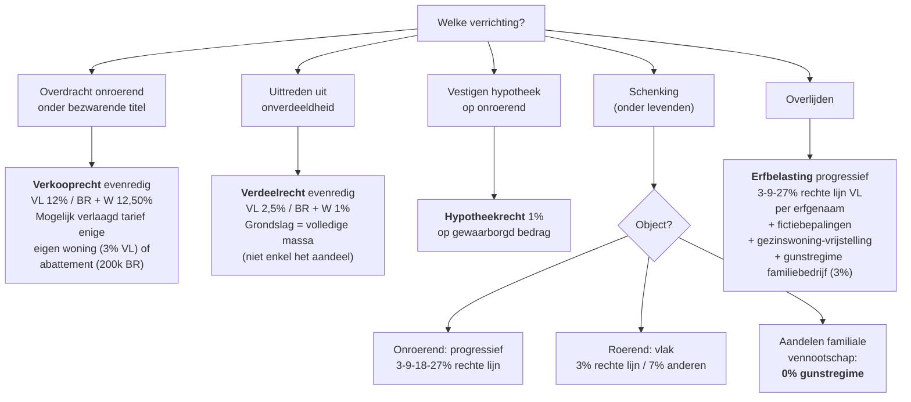

> **Samenvatting — spickzettel voor de week vóór het examen.** PO 2.6 is een fiscaal integratie-vak — deze samenvatting bundelt de beslisboom (welke heffing bij welke verrichting), de tarieven en grondslag-regels per gewest, het termijn-kompas, de aannemelijk-passief-screening en de planningsinstrumenten met gunstregime. Niet bedoeld om voor het eerst te leren — daar zijn de leerstukken voor. Voor verhaal en routekaart: [[studiemateriaal/2-6|overzicht PO 2.6]]. Voor actief doorrekenen: [[studiemateriaal/2-6/oefening|oefening Verdonck-Beysens]].

## 1. Take-away — wat je écht moet weten

- **Twee heffingen, drie gewesten, vier instanties.** Registratierechten (akten + geschriften) en erfbelasting (overlijden) zijn allebei overgedragen gewestbelastingen. Vlaanderen heeft sinds 1.1.2015 de **VCF** (Vlaamse Codex Fiscaliteit); Brussel + Wallonië blijven onder federaal **W.Reg.** + **W.Succ.**. Aanknopingspunten: ligging onroerend goed (registratie) · fiscale woonplaats erflater (erfbelasting).
- **Vier evenredige rechten op vastgoed.** Verkooprecht (overdracht) · Verdeelrecht (uittreden onverdeeldheid) · Hypotheekrecht (zekerheid) · Schenkbelasting (gift). Eén grondslag-logica (overeengekomen prijs minimum verkoopwaarde, art. 45-46 W.Reg.) — met twee specifieke minimumregels bij blote eigendom (art. 48 voorbehoud vervreemder = volle eigendom · art. 49 niet-voorbehouden = volle eigendom min vruchtgebruik-forfait art. 47).
- **Tarief uit Cijferzakboekje, grondslag uit het hoofd.** Het examen test zelden tarieven (Cijferzakboekje voorhanden). Wel: bepalen welke grondslag (volle vs blote eigendom · massa vs aandeel · onroerende vs roerende schalen) · welke partij hoofdelijk aansprakelijk · welke termijn (4 mnd aangifte · 15 dgn registratie authentiek · eerste werkdag na compromis voor command).
- **Aangifte van nalatenschap = 4/5/6 maanden + 4-categorie-passief.** Termijn 4 mnd (overlijden in Rijk) · 5 mnd (Europa) · 6 mnd (buiten Europa). Aangifteplichtig: erfgenamen + algemene legatarissen + algemene begiftigden (niet legaten onder algemene titel of bijzondere legatarissen). Aannemelijk passief = limitatief: (1°) op de dag van overlijden bestaande schulden + (2°) begrafeniskosten. Lening bij erfgenaam: art. 33 — uitgesloten tenzij bestemming voor nalatenschapsgoed.
- **Drie planningstechnieken + gunstregime familiebedrijf.** Testament (volledige tarief erfbelasting bij overlijden) · Schenking onder levenden met voorbehoud vruchtgebruik (lagere schenktarieven, fictie < 3 jaar) · Gestructureerde planning (huwelijkscontract + levensverzekering + vennootschap). Gunstregime familiale onderneming: **0% schenkbelasting** (VCF art. 2.8.6.0.3) of **3% rechte lijn / 7% andere erfbelasting** (VCF art. 2.7.4.2.2) — voorwaarden cumulatief: familiale vennootschap, ≥50% bij schenker+familie, reële activiteit, continuïteit + participatie 3 jaar.

---

## 2. Beslisboom — welke heffing bij welke verrichting?

Vertrek vanuit de verrichting. Eén verrichting kan meerdere heffingen activeren (bv. compromis koop = verkooprecht + later notariële akte = vast recht).

---

## 3. Vier evenredige registratierechten — vergelijking 3 gewesten

Verkooprecht in Vlaanderen sinds 1.1.2022: standaard 12%, enige eigen woning 3%, ingrijpende energetische renovatie 1%. Brussel-abattement = vermindering grondslag €200.000 — voorwaarde geheelheid in volle eigendom.

| Recht | Voor wat? | Vlaanderen | Brussel | Wallonië | Grondslag-regel |
|---|---|---|---|---|---|
| **Verkooprecht** | Overdracht onroerend onder bezwarende titel | 12% std · 2% enige eigen woning · 1% bij energetische renov. | 12,50% std · abattement eigen woning (Cijferzakboekje) | 12,50% std · klein-beschrijf bescheiden woning 5% | Overeengekomen prijs, min. verkoopwaarde (art. 45-46 W.Reg.). **Bij blote eigendom + vruchtgebruik voorbehoud vervreemder: min. = volle eigendom** (art. 48). Niet-voorbehouden: min. = volle eigendom − vruchtgebruik-forfait (art. 49). |
| **Verdeelrecht** | Uittreden uit onverdeeldheid (echtscheiding, erfenis, mede-eigendom) | 2,5% (tarief: art. 2.10.4.0.1 VCF; belastbaar feit: art. 2.10.1.0.1). 1% bij verdeling tussen ex-echtgenoten/ex-wett. samenwoners. | 1% (art. 109 W.Reg.) | 1% (art. 109 W.Reg.) | Volledige verkoopwaarde van het onverdeelde goed (de massa) — NIET enkel het overgenomen aandeel. |
| **Hypotheekrecht** | Vestiging hypotheek op onroerend (zekerheid) | 1% (art. 2.11.4.0.1 VCF) | 1% (art. 87 W.Reg.) | 1% (art. 87 W.Reg.) | Bedrag van de gewaarborgde inschrijving (kapitaal + accessoria). |
| **Schenkbelasting** (onroerend) | Schenking onroerend onder levenden | 3-9-18-27% rechte lijn · 10-20-30-40% anderen (progressief) | Schalen art. 131 W.Reg. | Idem | Verkoopwaarde op datum schenking. Vlak tarief 3% (rechte lijn) bij **roerende schenking** (aandelen, beleggingen). |

---

## 4. Termijn-kompas

Eén gemiste termijn = fiscaal verlies (boete of dubbele heffing). De command-termijn (eerste werkdag na compromis) is de strengste.

| Verrichting | Termijn | Beginpunt | Wet-ref | Sanctie bij missen |
|---|---|---|---|---|
| Registratie notariële (authentieke) akte | **15 dagen** | Datum akte | art. 32, 5° W.Reg. / art. 3.12.3.0.1 VCF | Boete + verhoging registratierecht |
| Registratie onderhandse akte (verkoop onroerend) | **4 maanden** | Datum akte | W.Reg. | Boete proportioneel |
| **Aanwijzing van lastgever** (command) — Vlaanderen + federaal | **Uiterlijk eerste werkdag** na compromis | Compromis-datum | art. 158, 1°, c W.Reg. / art. 2.9.6.0.1, 1°, c VCF | Aanwijzing = wederverkoop → **tweemaal verkooprecht** |
| **Aanwijzing van lastgever** — Brussel + Wallonië | **Uiterlijk vijfde werkdag** na compromis | Compromis-datum | art. 159, 1°, b W.Reg. | Idem — tweemaal verkooprecht |
| Aangifte van nalatenschap — overlijden in Rijk | **4 maanden** | Overlijdens-datum | art. 40 W.Succ. / art. 3.3.1.0.6 VCF | Boete (laattijdig + onvolledig) |
| Aangifte van nalatenschap — overlijden Europa | **5 maanden** | Idem | Idem | Idem |
| Aangifte van nalatenschap — overlijden buiten Europa | **6 maanden** | Idem | Idem | Idem |
| Betaling erfbelasting | **2 maanden** na verstrijken aangifte-termijn | Verstrijking aangiftetermijn | art. 77 W.Succ. / art. 3.10.4.4.1 VCF | Nalatigheidsinteresten + verhoging |
| Schenking ontsnapt aan fictiebepaling 3-jaar | Schenking moet **≥ 3 jaar vóór overlijden** geregistreerd zijn | Datum registratie | art. 2.7.1.0.5 VCF / art. 7 W.Succ. | Schenking < 3 jaar zonder registratie = legaat (erfbelasting) |

---

## 5. Aannemelijk passief — art. 27 + 33 W.Succ./VCF

Twee categorieën aanvaard (art. 27): (1°) op de dag van overlijden bestaande schulden van de overledene + (2°) begrafeniskosten. Schulden bij erfgenaam (art. 33): uitgesloten tenzij echtheid **én** bestemming bewezen.

| Schuld / kost | Aangenomen? | Reden |
|---|---|---|
| Begrafeniskosten + repatriëring lijk + rouwplechtigheid + bloemen op graf | ✅ **Ja** | art. 27, 2° — begrafeniskosten zonder plafond |
| Openstaande facturen erflater op overlijdens-datum (energie, syndicus, advocaat met mandaat vóór overlijden) | ✅ **Ja** | art. 27, 1° — bestaande schuld op overlijdens-datum |
| Reiskosten + huur ceremoniekledij erfgenamen voor begrafenis | ❌ **Nee** | Persoonlijke kost van erfgenaam, geen schuld erflater |
| Ereloon advocaat/notaris voor aangifte van nalatenschap of attest van erfopvolging | ❌ **Nee** | Schuld ontstaan ná overlijden, geen begrafeniskost |
| Stookolie / energie / onderhoud nalatenschapsgoed geleverd ná overlijden | ❌ **Nee** | Schuld ontstaan ná overlijden — kost van onverdeeldheid, niet van erflater |
| Lening van erfgenaam aan erflater (schuldbekentenis), geen bestemming voor nalatenschapsgoed | ❌ **Nee** | art. 33 — uitgesloten zonder bestemmingsbewijs |
| Lening van erfgenaam aan erflater, schuldbekentenis + bestemd voor verbetering van een nalatenschapsgoed | ✅ **Ja** | art. 33, 2° — uitzondering: echtheid + bestemming cumulatief |
| Afrekening mede-eigendom afgesloten vóór overlijden (factuur ná overlijden) | ✅ **Ja** | Schuld ontstaan op AV-datum (vóór overlijden) — factuurdatum irrelevant |

---

## 6. Legataris-categorieën + aangifteplicht (art. 38 W.Succ. / 3.3.1.0.5 VCF)

Hoedanigheid hangt af van de **omvang van de roeping**, niet van wat de begiftigde feitelijk ontvangt na samenloop met andere legaten.

| Hoedanigheid | Wat krijgt hij? | Voorbeeld | Aangifteplicht? |
|---|---|---|---|
| **Wettelijk erfgenaam** | Krijgt krachtens wet (afstamming/huwelijk), los van testament | Echtgenote · afstammelingen · ouders · broers/zussen | ✅ **Ja** (primair) |
| **Algemeen legataris** | Geheel van nalatenschap of beschikbaar deel ervan | "De volledige nalatenschap aan X" of "het beschikbaar deel" | ✅ **Ja** (primair) |
| **Algemene begiftigde** | Algemene schenking onder levenden (zelden bij testament) | Schenking van "alle vermogen" tussen echtgenoten | ✅ **Ja** (primair) |
| **Legataris onder algemene titel** | Breuk OF categorie van de nalatenschap (alle roerende / alle onroerende / 1/3) | "Het geheel van de roerende goederen aan Y" | ❌ Nee (primair) · ✅ Subsidiair (op aanmaning ontvanger) |
| **Bijzonder legataris** | Welbepaald goed (res certa) | "De personenauto aan Z" | ❌ Nee (primair) · ✅ Subsidiair |

---

## 7. Vier planningsinstrumenten vergeleken

Combineren is regel, niet uitzondering. Schenking + huwelijkscontract + levensverzekering = klassieke driehoek voor estate planning. Gunstregime familiebedrijf maakt schenking 0% en erfopvolging 3%/7%.

| Instrument | Wanneer overgang? | Tarief | Sterke punten | Zwakke punten / valkuil |
|---|---|---|---|---|
| **Testament** | Bij overlijden | Volledig erfbelastingtarief (3-27% rechte lijn / 25-55% anderen) | Eenvoudig · herroepbaar · respecteert reservataire bescherming | Volledige erfbelasting · geen vermogensoverdracht bij leven |
| **Schenking met voorbehoud vruchtgebruik** | Bij leven (blote eigendom over) · vruchtgebruik valt weg bij overlijden | Schenkbelasting (vlak 3% roerend rechte lijn · progressief 3-27% onroerend) — of **0% gunstregime familiebedrijf** | Lagere tarieven · schenker behoudt inkomsten + stemrecht · ontsnapt aan progressie | Fictie < 3 jaar bij niet-geregistreerde schenking · schenker is onherroepelijk gebonden · vruchtgebruik op blote eigendom = waarderingsregel art. 47 |
| **Huwelijkscontract** | Bij overlijden + verdeling huwelijksgemeenschap | Geen erfbelasting op clausules tussen echtgenoten (mits voorwaarden) — wel inbrengverplichting bij tweede overlijden | Verblijvingsbeding (langstlevende krijgt alles) · keuzebeding · sterfhuisclausule | Vereist notariële akte + akkoord beide echtgenoten · fiscaal misbruik-risico bij agressieve beding-combinaties |
| **Levensverzekering** | Bij overlijden verzekerde (uitkering aan begunstigde) | **Fictie art. 2.7.1.0.6 VCF**: uitkering = legaat voor erfbelasting · pro-rata met premies uit gemeenschap | Gericht naar specifieke begunstigde · flexibel + herroepbaar (begunstiging) · liquide | Fictie: uitkering toch belast als legaat · waarde op overlijdens-datum (Tak 23 fluctueert) · cross-begunstiging tussen echtgenoten kan dubbel belasten |

---

## 8. Gunstregime familiale onderneming — voorwaarden

Twee fiscale routes: **schenking** met 0% tarief OF **erfopvolging** met verlaagd tarief 3% rechte lijn / 7% anderen. Voorwaarden cumulatief; controle 3 jaar na schenking/erfopvolging.

| Voorwaarde | Bij schenking (art. 2.8.6.0.3 VCF) | Bij erfopvolging (art. 2.7.4.2.2 VCF) |
|---|---|---|
| **Familiale vennootschap** | Ja: aandelen of activa exploitatie/zelfstandige beroepsactiviteit | Ja: idem |
| **Reële economische activiteit** | Vereist (geen patrimonium-vennootschap) — twee tests: (a) loonkost ≥ 1,5% totaal activa OF (b) onroerende activa ≤ 50% totale activa | Idem |
| **Participatie schenker/erflater + familie** | ≥ 50% aandelen | Idem |
| **Continuïteit activiteit** na overgang | 3 jaar — activiteit onafgebroken behouden | 3 jaar idem |
| **Participatie behouden** | 3 jaar — begiftigde mag niet onder 50% familiale participatie zakken | 3 jaar idem |
| **Tarief** | **0% schenkbelasting** | **3% rechte lijn / 7% andere erfgenamen** |
| **Niet-naleving achteraf** | Pro rata terugvordering bij niet-naleving 3-jaar-voorwaarde | Idem |

---

## 9. Vijf fictiebepalingen — wat de wet er BIJ telt

Fictie = vermogensbestanddelen die juridisch niet meer van de erflater zijn, maar fiscaal als legaat worden behandeld. Doel: planning-uitholling tegengaan.

| Fictie | Wet-ref | Wat wordt belast? |
|---|---|---|
| **Schenking < 3 jaar zonder registratie** | art. 2.7.1.0.5 VCF / art. 7 W.Succ. | Schenking die binnen 3 jaar vóór overlijden gebeurde **zonder** notariële akte + registratie = legaat → erfbelasting. Notariële geregistreerde schenking ontsnapt (al belast met schenkbelasting). |
| **Levensverzekering met begunstigde derde** | art. 2.7.1.0.6 VCF / art. 8 W.Succ. | Uitkering bij overlijden verzekerde aan begunstigde-derde (≠ erflater zelf) = legaat. **Pro rata met premies uit gemeenschap** (bv. 50% belastbaar als premies volledig uit gemeenschap). |
| **Beding van aanwas** (tontine, accroissement) | art. 2.7.1.0.7 VCF | Bij overlijden eerste contractant gaat het goed integraal naar overlevende contractant. Fiscus: behandelt als wederzijds legaat → erfbelasting op helft of volledige waarde. |
| **Sterfhuisclausule** (huwelijkscontract) | art. 2.7.1.0.4 VCF | Toebedeling volledige gemeenschap aan langstlevende echtgenoot zonder echte tegenprestatie = legaat van halve gemeenschap → erfbelasting. Doctrine na 2018-hervorming. |
| **Inbreng en uitbreng huwelijksgemeenschap < 3 jaar** | Diverse + anti-misbruik | Inbreng eigen goed in gemeenschap kort vóór overlijden + verdeling = potentieel fiscaal misbruik (art. 3.17.0.0.2 VCF). |

---

## 10. Klassieke valkuilen

| Valkuil | Wat klopt niet | Wat klopt wel |
|---|---|---|
| Abattement eigen woning + vennootschap koopt vruchtgebruik | "Echtpaar koopt blote eigendom, vennootschap koopt vruchtgebruik — koper blijft natuurlijke persoon dus abattement geldt" | Abattement vereist **geheelheid in volle eigendom** door natuurlijke persoon. Splitsing met vennootschap → abattement uitgesloten (art. 46bis W.Reg. Brussel · verlaagd tarief art. 2.9.4.2.11 VCF Vlaanderen idem). |
| Vruchtgebruik voorbehouden: art. 48 vs 49 | "Bij verkoop blote eigendom kan je altijd de vruchtgebruik-waarde aftrekken van de grondslag" | **Alleen** bij art. 49 (niet-voorbehouden door vervreemder) — forfait art. 47. Bij art. 48 (voorbehoud door vervreemder) = grondslag minimaal **volle eigendom**, geen aftrek. |
| Ereloon notaris voor attest van erfopvolging | "Ereloon ná overlijden voor opmaak attest van erfopvolging is aannemelijk passief" | Schuld ontstaan ná overlijden = **geen** bestaande schuld (art. 27, 1°) en geen begrafeniskost (art. 27, 2°). Niet aannemelijk. |
| Onverdeeld aandeel + abattement | "Echtgenote bezit reeds onverdeeld aandeel in andere woning → abattement uitgesloten" | Abattement vereist dat je geen **volledig** in volle eigendom hebt; een onverdeeld aandeel via erfenis/schenking belet doorgaans **niet** (art. 212bis W.Reg. voorziet ook teruggave-mogelijkheid). |
| Sterkmaking + termijn | "Aanwijzing van lastgever altijd vrijgesteld van evenredig recht" | Drie cumulatieve voorwaarden: (a) voorbehoud in compromis · (b) **authentieke** akte · (c) registratie/betekening **uiterlijk eerste werkdag na compromis**. Een gemist → wederverkoop → tweemaal verkooprecht. |
| Schenking effecten + fictie 3-jaar | "Schenking effecten via hand-/bankgift kort vóór overlijden ontsnapt aan erfbelasting want geen akte" | Net andersom — hand-/bankgift zonder registratie binnen 3 jaar vóór overlijden = fictiebepaling activeert → erfbelasting alsnog. Geregistreerde schenking ontsnapt. |
| Aandelen-schenking — onroerend vs roerend tarief | "Schenking aandelen valt onder progressief schenktarief 3-9-18-27%" | Aandelen = **roerend** → vlak **3% rechte lijn** (Vlaanderen) of **7% anderen**. Progressief geldt voor **onroerend**. Met gunstregime familiale vennootschap zelfs **0%**. |
| Bevoegd gewest erfbelasting | "Erfbelasting volgt de plaats van overlijden of de ligging van het onroerend goed" | Bevoegd gewest = gewest van **laatste fiscale woonplaats erflater** (art. 5/1 VCF · art. 38 W.Succ.). Plaats van overlijden of ligging onroerend = irrelevant. **5-jaarsregel**: bij verhuis tussen gewesten in de 5 jaar vóór overlijden = gewest waar erflater het langst gewoond heeft in die 5 jaar. |
| Termijn aangifte = vanaf overlijden of vanaf opening nalatenschap? | "4 maanden start zodra notaris de nalatenschap opent" | 4 maanden start op **datum van overlijden** (art. 40 W.Succ. / art. 3.3.1.0.6 VCF). Notaris-tussenkomst is irrelevant voor de termijn. |
| Lening bij erfgenaam zonder bestemming | "Een schuldbekentenis tussen ouder en kind volstaat om de lening als passief aan te geven" | art. 33 vereist **cumulatief**: (1°) echtheid (schuldbekentenis volstaat) **én** (2°) bestemming voor verkrijging/verbetering/behoud/terugbekoming van een nalatenschapsgoed. Geen bestemmingsbewijs → uitgesloten. |

---

## 11. Verdieping

Werkt iets niet scherp? Klik door naar het leerstuk dat het uitwerkt of het concept dat het definieert:

### Leerstukken

- [[wat-zijn-registratie-en-successierechten]] — Kader + civielrechtelijke kapstok (huwelijksvermogen + erfrecht kort)
- [[registratierechten-vastgoed]] — Vier evenredige rechten · 3 gewesten · grondslag + minimum-regels art. 48/49
- [[registratieformaliteit-en-procedure]] — Verplichte registratie · termijnen · aanwijzing van lastgever · ruling
- [[erfbelasting-en-aangifte-nalatenschap]] — Devolutie · aannemelijk passief · tarief · aangifte + fictiebepalingen
- [[successieplanning-en-gunstregime]] — 5 planningsinstrumenten · gunstregime familiebedrijf · geïntegreerd advies

### Concept-fiches

**De heffingen zelf** — [[registratie-en-successierechten]] · [[verkooprecht]] · [[verdeelrecht]] · [[hypotheekrecht]] · [[schenkbelasting]] · [[erfbelasting]]

**Civielrechtelijk fundament** — [[huwelijksvermogensrecht]] · [[erfrecht]]

**Planningsinstrumenten** — [[successieplanning]] · [[testament-instrument]] · [[schenking-met-voorbehoud-vruchtgebruik]] · [[levensverzekering-successieplanning]] · [[gunstregime-familiale-onderneming]] · [[inbreng-onroerend-in-vennootschap]]

**Formaliteiten** — [[registratieformaliteit-akten]] · [[aangifte-nalatenschap]]

[[studiemateriaal/2-6|← overzicht PO 2.6]]

---

*Samenvatting PO 2.6 — bron: officieel ITAA-examenprogramma + W.Reg. + W.Succ. + VCF + BW Boek 2/4 (hervorming 2018). Cijfers en tarieven: raadpleeg Cijferzakboekje 2026 bij examen. Status: voorgesteld — nog niet inhoudelijk gecureerd.*
