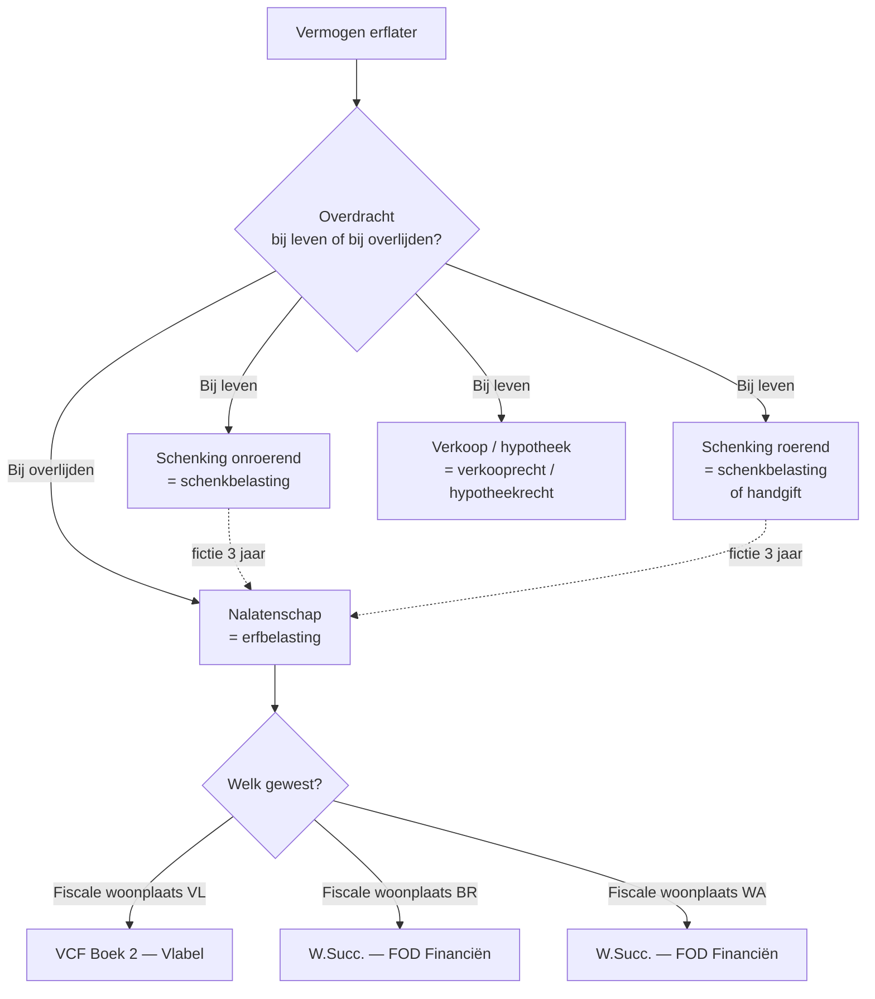
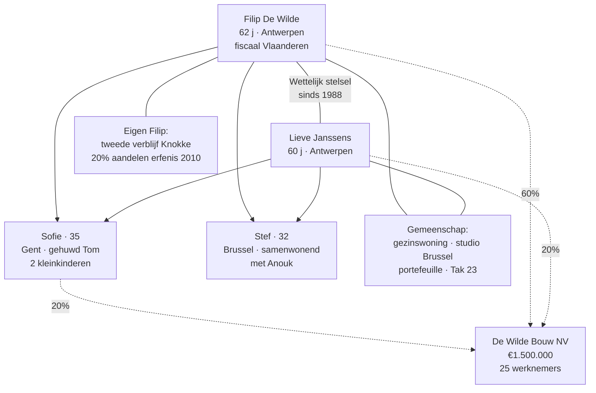

> **Leerstuk — één vraag, helemaal doorgewerkt.** Dit is de entry-fiche voor PO 2.6: het kader vóór je in de techniek duikt. De evenredige rechten, de procedure, de aangifte van nalatenschap en de planning krijgen elk hun eigen leerstuk. Hier zet je het verhaal neer en maak je kennis met de familie De Wilde, het mock-gezin dat door de hele leerlaag meedraait. Voor verhaal en routekaart: [[studiemateriaal/2-6|minicursus PO 2.6]].

## Antwoord in één blik

Registratie- en successierechten zijn **twee gewestelijke heffingen op vermogensoverdracht** — de eerste bij leven (akten over onroerend goed of schenkingen), de tweede bij overlijden (de nalatenschap). Ze worden samen bestudeerd omdat ze communicerende vaten zijn: wie tijdens zijn leven schenkt en registreert, betaalt schenkbelasting; wie wacht tot overlijden, betaalt erfbelasting. Plannen betekent kiezen welk vat je vult.

Sinds de regionalisering leven er **drie regimes naast elkaar**: Vlaanderen werkt met de Vlaamse Codex Fiscaliteit, Brussel en Wallonië behouden de federale wetboeken met eigen tariefingrepen. Tarieven, vrijstellingen en gunstregimes verschillen substantieel; het gewest van fiscale woonplaats (bij erfbelasting) of de ligging van het goed (bij vastgoed-rechten) bepaalt welk regime speelt. Rond elke verrichting staan vier spelers — de notaris, de Vlaamse Belastingdienst, de federale fiscus en de federale wetgever — en de accountant orkestreert het advies tussen die spelers.

| Heffing | Wanneer? | Bron-wetboek | Wie int? |
|---|---|---|---|
| **Registratiebelasting** | Bij registratie van een akte — verkoop, schenking, hypotheek, verdeling van een onverdeeldheid | Vlaamse Codex Fiscaliteit Boek 2 (Vlaanderen) · Wetboek der Registratie-, Hypotheek- en Griffierechten (Brussel · Wallonië) | Vlabel · federale fiscus · federale fiscus |
| **Erfbelasting** *(historisch: successierechten)* | Bij overlijden — op de nalatenschap | Vlaamse Codex Fiscaliteit Boek 2 (Vlaanderen) · Wetboek der Successierechten (Brussel · Wallonië) | Vlabel · federale fiscus · federale fiscus |

We werken dit kader uit in drie korte secties — eerst de twee heffingen, dan de drie gewesten en vier instanties, dan de civielrechtelijke kapstok — en sluiten af met wat de accountant hier doet.

---

## Twee heffingen, één instrumentarium

Vermogen wisselt van eigenaar via twee kanalen: tijdens het leven (verkoop, schenking, verdeling, hypotheek) of bij overlijden (nalatenschap). De Belgische fiscus heft op beide momenten, maar via verschillende technische apparaten die historisch én juridisch verbonden zijn.

Het eerste kanaal is de **registratiebelasting**. Een akte — notarieel of onderhands — waarbij vastgoed wordt overgedragen of een schenking-titel wordt vastgelegd, wordt geregistreerd. Die registratie heeft een dubbel doel. De fiscus int (verkooprecht, schenkbelasting, verdeelrecht, hypotheekrecht) én de akte krijgt vaste datum en bewijskracht tegenover derden. Registratie is dus tegelijk een fiscaal én een juridisch instrument — wat verklaart waarom de notaris de centrale spil blijft.

Het tweede kanaal is de **erfbelasting**. Bij overlijden valt het volledige vermogen van de overledene als nalatenschap toe aan erfgenamen en legatarissen, na correctie voor het huwelijksvermogen en aftrek van het aannemelijk passief. De erfgenamen dienen een aangifte van nalatenschap in binnen vier maanden na overlijden. De heffing is per erfgenaam in Vlaanderen — afzonderlijke aanslag op het erfdeel van elke verkrijger — terwijl Brussel en Wallonië hetzelfde principe sinds de jongste hervormingen ook toepassen.

Waarom samen bestudeerd? Omdat beide vaten communiceren. Een schenking bij leven onttrekt het geschonken goed aan de toekomstige nalatenschap. Wie een onroerend goed schenkt aan zijn kinderen, betaalt schenkbelasting nu — maar bij overlijden zit dat goed niet meer in de erfbelasting-basis. De wetgever heeft daarop een fictiebepaling gezet: schenkingen van minder dan drie jaar vóór overlijden zónder registratie worden alsnog in de nalatenschap meegerekend. Wie planning doet, kiest tussen vaten en moet beide kennen.

> **Korte historie.** Tot eind 2014 bestond één federaal regime voor het hele land — het Wetboek der Registratie- en Griffierechten en het Wetboek der Successierechten. Sinds 1 januari 2015 heeft Vlaanderen de inning én de tarieven in eigen handen via de Vlaamse Codex Fiscaliteit, Boek 2. Brussel en Wallonië houden vast aan de federale codices met regionale tariefingrepen. Drie regimes leven sindsdien naast elkaar; de civielrechtelijke basis (huwelijksvermogen en erfopvolging) blijft federaal voor het hele Rijk.

De rest van deze leerlaag werkt de techniek uit. De vier evenredige registratierechten — verkoop, verdeling, hypotheek, schenking — krijgen detail-werk in [[registratierechten-vastgoed]]. Welke akten verplicht geregistreerd moeten worden en met welke termijnen + procedure-trucs (sterkmaking, ruling) zit in [[registratieformaliteit-en-procedure]]. De erfbelasting en de aangifte van nalatenschap volgen in [[erfbelasting-en-aangifte-nalatenschap]]. Plannings-instrumenten en het gunstregime voor familiale ondernemingen sluiten af in [[successieplanning-en-gunstregime]].

---

## Drie gewesten, vier instanties

Sinds de zesde staatshervorming zijn registratie- en erfbelasting **gewestelijke** belastingen op grond van de Bijzondere Financieringswet van 1989. Maar de regionalisering verloopt asymmetrisch. Vlaanderen heeft de volledige overname doorgevoerd — eigen wetboek én eigen inning. Brussel en Wallonië hebben tarief-autonomie maar laten de federale fiscus de inning doen. Dat verschil verklaart waarom dezelfde verrichting in drie gewesten via drie verschillende administratieve loketten loopt.

Welk gewest speelt? Voor de erfbelasting telt het gewest waar de erflater zijn **fiscale woonplaats** had — niet op een willekeurig moment, maar gemeten over de laatste vijf jaar vóór het overlijden. Als de overledene in die periode in meerdere gewesten woonde, gaat de aangifte naar het gewest waar hij het langst gevestigd was. Voor de registratierechten op vastgoed is de aanknoping eenvoudiger: het gewest waar het **onroerend goed ligt**. Voor schenkingen geldt de fiscale woonplaats van de schenker bij roerende goederen, en de ligging van het goed bij onroerende schenkingen.

Concreet voor de De Wilde-vermogensconstellatie: de gezinswoning in Antwerpen valt onder Vlaanderen, de studio in Brussel onder het Brussels Hoofdstedelijk Gewest, en als Filip ooit Waalse grond zou kopen, kwam Wallonië erbij. Drie regimes, drie tariefroosters — zoals deze vergelijking in een oogopslag laat zien:

|  | **Vlaanderen** | **Brussel** | **Wallonië** |
|---|---|---|---|
| Bronwetboek registratie | VCF Boek 2 | W.Reg. (federaal, met regionale wijzigingen) | W.Reg. (federaal, met regionale wijzigingen) |
| Bronwetboek erfbelasting | VCF Boek 2 | W.Succ. | W.Succ. |
| Wie int? | **Vlabel** (autonoom) | Federale fiscus | Federale fiscus |
| Standaardtarief verkooprecht | 12 % (3 % enige eigen woning) | 12,50 % (abattement van €200.000) | 12,50 % (klein-beschrijf 5 %) |
| Verdeelrecht | 2,5 % | 1 % | 1 % |
| Civiel recht (huwelijk + erf) | Federaal — identiek in alle drie gewesten | Federaal | Federaal |

Rond elke verrichting staan **vier instanties**. De **notaris** verlijdt de akte en biedt ze aan ter registratie; hij is wettelijk gemandateerd en draagt zelfs een solidaire aansprakelijkheid voor de heffing. **Vlabel** — de Vlaamse Belastingdienst — int de Vlaamse registratie- en erfbelasting; je doet je aangifte van nalatenschap voor een Vlaamse erflater bij Vlabel. De **federale fiscus** (Algemene Administratie van de Patrimoniumdocumentatie) int in Brussel en Wallonië. En de **federale wetgever** blijft bevoegd voor het civiele recht — huwelijksvermogen en erfrecht — wat ervoor zorgt dat de burgerlijke basis identiek is over de drie gewesten heen.

De implicatie voor een cliënt met vermogen in twee gewesten is praktisch: twee parallelle dossiers per akte, soms bij verschillende instanties. Filip en Lieve die hun studio in Brussel verkopen, krijgen een verkooprecht-aanslag van de federale fiscus tegen het Brusselse tarief; verkopen ze hun gezinswoning in Antwerpen, dan komt de aanslag van Vlabel tegen het Vlaamse tarief. De accountant moet weten welke regel waar geldt en mag de twee niet mengen.

> **Terminologie blijft een doolhof.** In de federale wetboeken spreek je over "registratierechten" en "successierechten"; in de Vlaamse Codex Fiscaliteit over "registratiebelasting" en "erfbelasting". Beide termen leven in ITAA-examens en in de praktijk naast elkaar. In dit leerpad kiezen we voor "registratiebelasting" en "erfbelasting" als hoofdterm, tenzij we specifiek over het federale W.Reg./W.Succ. spreken — dan houden we de oudere terminologie aan.

---

## De civielrechtelijke kapstok — huwelijksvermogen + erfopvolging

Fiscaliteit volgt hier op civiel recht — niet andersom. Vooraleer je kunt berekenen hoeveel erfbelasting Lieve betaalt, moet je weten **wat in de nalatenschap valt** en **wie erft**. Het huwelijksvermogen bepaalt het eerste, het erfrecht bepaalt het tweede. Twee burgerlijke fundamenten dragen het hele fiscale gebouw.

Het eerste fundament is het **huwelijksvermogensrecht** — geregeld in Boek 2 van het Burgerlijk Wetboek, fundamenteel hervormd in 2018. Er bestaan drie hoofdstelsels. Het wettelijk stelsel (gemeenschap van aanwinsten) geldt voor gehuwden zonder huwelijkscontract: arbeidsinkomsten en hun opbrengsten zijn gemeenschappelijk, goederen verworven vóór het huwelijk of nadien via erfenis of schenking blijven eigen. Daarnaast zijn er twee contractuele alternatieven — gemeenschap van alle goederen, of zuivere scheiding van goederen — die elk een andere afbakening tussen "eigen" en "gemeenschappelijk" maken. Het stelsel bepaalt welk goed gemeenschappelijk is en welk eigen — en dus wat in de nalatenschap valt bij overlijden van één echtgenoot.

Toepassing op De Wilde maakt dat tastbaar. Filip en Lieve zijn gehuwd in 1988 onder het wettelijk stelsel, zonder huwelijkscontract. Gevolg: hun arbeidsinkomsten, gezamenlijke aankopen en opbrengsten daarvan zijn gemeenschappelijk; goederen verworven vóór het huwelijk of nadien via erfenis blijven eigen. Concreet: de gezinswoning in Antwerpen, de studio in Brussel en de beleggingsportefeuille zijn gemeenschappelijk. Het tweede verblijf in Knokke en Filips erfdeel in de aandelen De Wilde Bouw — beide verkregen via erfenis van zijn vader in 2010 — blijven eigen vermogen van Filip alleen.

Het tweede fundament is het **erfrecht** — Boek 4 van het Burgerlijk Wetboek, eveneens hervormd in 2018. Drie hoofdregels structureren de wettelijke devolutie. Afstammelingen erven bij voorrang (kinderen, en bij vooroverlijden hun kinderen via plaatsvervulling). De overlevende echtgenoot erft naast de afstammelingen het **vruchtgebruik op de volledige nalatenschap**. En bij afwezigheid van afstammelingen krijgt de overlevende echtgenoot meer — volle eigendom met afzonderlijke regels voor de zijlijn.

Een vierde pijler vult het beeld aan: de **reservataire bescherming**. Kinderen hebben gezamenlijk een reservatair erfdeel van de helft van de nalatenschap. "Reservatair" betekent dat je hen niet kunt onterven — een testament dat hen volledig uitsluit, wordt op die helft teruggebracht. De reserve voor de ouders (die vroeger nog bestond) is door de hervorming van 2018 afgeschaft.

Voor De Wilde wordt het hypothetische overlijdens-scenario van Filip dan: geen testament, dus de wettelijke devolutie speelt. Lieve krijgt het vruchtgebruik op de volledige netto-nalatenschap. Sofie en Stef krijgen elk de blote eigendom op de helft. De gezinswoning in Antwerpen geniet daarbovenop een fiscale bonus: het Vlaamse gewest stelt het gedeelte dat naar de overlevende echtgenoot toekomt volledig vrij van erfbelasting. Dat detail werken we uit in [[erfbelasting-en-aangifte-nalatenschap]].

De volgende tabel zet voor elk goed van De Wilde naast elkaar wat het juridisch is en wat er bij overlijden van Filip in de nalatenschap zou vallen:

| Goed | Verkrijging | Stelsel | Bij overlijden Filip — in nalatenschap? |
|---|---|---|---|
| Gezinswoning Antwerpen | Aankoop 1992 (arbeidsinkomsten) | Gemeenschappelijk | Helft (€225k) → in nalatenschap |
| Tweede verblijf Knokke | Erfenis vader 2010 | Eigen Filip | Volledig (€350k) → in nalatenschap |
| Studio Brussel | Aankoop 2008 (gemeenschap) | Gemeenschappelijk | Helft (€110k) → in nalatenschap |
| 20 % aandelen De Wilde Bouw (erfenis 2010) | Erfenis vader | Eigen Filip | Volledig (~€300k) → in nalatenschap |
| 40 % aandelen De Wilde Bouw (1995 + kapitaalverhoging) | Arbeidsinkomsten | Gemeenschappelijk | Helft (~€300k) → in nalatenschap |
| Beleggingsportefeuille KBC | Spaargeld arbeid | Gemeenschappelijk | Helft (€250k) → in nalatenschap |

> **Het civiele fundament als examenvak.** Boek 2 en Boek 4 van het Burgerlijk Wetboek staan niet als afzonderlijke materie op het PO 2.6-examen — het examen toetst de *fiscale gevolgen* van civiele keuzes. Maar zonder dit fundament kun je geen aangifte van nalatenschap correct opstellen en geen huwelijkscontract als planningsinstrument adviseren. Vandaar dat het hier kort geactiveerd wordt; [[erfbelasting-en-aangifte-nalatenschap]] werkt het uit voor zover nodig voor de aangifte, en [[successieplanning-en-gunstregime]] activeert het opnieuw bij het huwelijkscontract als planning-instrument.

---

## Wat doet de accountant in dit vak?

Het examenprogramma legt vijf taken op de accountant in PO 2.6 — begeleiding bij oprichting van een onderneming, advies bij overdracht of ontbinding, totaaladvies in fiscale zaken, vervulling van fiscale formaliteiten en vertegenwoordiging tegenover Vlabel of de federale fiscus. Die vijf taken vallen uiteen in drie rollen: adviseur, formaliteit-uitvoerder, vertegenwoordiger.

De **adviesrol** is strategisch. Bij oprichting, herstructurering of generatiewissel rekent de accountant alternatieven door. Schenken of verkopen? Schenking nu — met bekende schenkbelasting — of overlijden afwachten — met onzekere maar mogelijk gunstigere erfbelasting? Met of zonder aanpassing van het huwelijkscontract? Het fiscale resultaat is zelden het enige criterium: familiale dynamiek, financieringscapaciteit en behoefte aan controle wegen mee. Bij De Wilde is dat concreet de vraag of Filip 30 % van zijn aandelen al bij leven aan Stef schenkt onder het gunstregime familiale onderneming, of wacht tot overlijden en dan op het verlaagde tarief erfbelasting voor familiale ondernemingen rekent.

De rol van **formaliteit-uitvoerder** loopt op kalenderwerk. Bij elke akte zit er een termijn: vijftien dagen voor de registratie van een notariële akte, de eerste werkdag na een compromis voor de aanwijzing van lastgever, vier maanden voor de aangifte van nalatenschap, daarna nog twee maanden voor de betaling van de erfbelasting. Een gemiste termijn betekent een boete — typisch een belastingverhoging van 20 tot 50 % — of in sommige gevallen het verlies van een gunstregime. De accountant bewaakt het kalenderwerk en zorgt dat geen termijn stilletjes verstrijkt.

De rol van **vertegenwoordiger** is procedureel. Bij bezwaar tegen een Vlabel- of FOD-aanslag, of bij een voorafgaande beslissing (een ruling aangevraagd bij de Dienst Voorafgaande Beslissingen federaal, of rechtstreeks bij Vlabel voor regionale materie), treedt de accountant op als gemandateerde van zijn cliënt. Hij voert het inhoudelijke gesprek met de administratie en zorgt voor de bewijsstukken.

Eén competentie overkoepelt alle drie rollen: **fiscale risico's signaleren en uitleggen**. Een cliënt die wil schenken aan zijn kinderen moet horen dat dit ofwel via notariële akte met registratie kan, ofwel via handgift met aangetekende brief, en wat het verschil betekent voor de drie-jaar-fictiebepaling. Dat soort onderscheid maken — niet pas wanneer het verkeerd loopt, maar vooraf — is waar de adviseur zijn toegevoegde waarde laat zien.

> **Integratie-niveau.** PO 2.6 staat in het examenprogramma op integratie-niveau, niet op kennis-niveau. Het examen testte historisch zelden geïsoleerde formules ("wat is het tarief verkooprecht in Brussel?"). Het testte wél integratie binnen één familie-case: compromis met sterkmakingsclausule, abattement-voorwaarden, grondslag-keuze, termijn-bewaking — allemaal in één vraagketen. Dat is precies het type werk dat dit leerpad uitwerkt: technisch redeneren in geïntegreerde dossiers.

---

## Wanneer je dit snapt, ga dan naar

- [[registratierechten-vastgoed]] — De vier evenredige rechten (verkoop · verdeling · hypotheek · schenking) — grondslag, abattement, gunsttarieven, drie gewesten naast elkaar.
- [[registratieformaliteit-en-procedure]] — Welke akten verplicht geregistreerd moeten worden, binnen welke termijnen, en welke procedure-trucs (sterkmaking, ruling) er bestaan.
- [[erfbelasting-en-aangifte-nalatenschap]] — Devolutie + nalatenschap-grondslag (actief min aannemelijk passief) + tariefschalen + aangifte-procedure + fictiebepalingen.
- [[successieplanning-en-gunstregime]] — Vier planningsinstrumenten (testament · schenking · huwelijkscontract · levensverzekering) + gunstregime familiale onderneming + synthese-advies.
- [[studiemateriaal/2-6/samenvatting|Samenvatting PO 2.6]] — voor herhaling vlak vóór het examen: beslisboom heffingen + tabel drie gewesten + termijn-kompas.

## Doorklik naar concepten

Voor wie definitorisch detail wil opzoeken:

- [[registratie-en-successierechten]] · [[erfbelasting]] · [[schenkbelasting]]
- [[huwelijksvermogensrecht]] · [[erfrecht]]

---

## Wettelijk fundament

- Koepel registratie- en successierechten (Vlaanderen): Vlaamse Codex Fiscaliteit (VCF) Boek 2, in werking sinds 1.1.2015. Vlaanderen heeft inning én tarieven volledig overgenomen.
- Koepel registratierechten (Brussel + Wallonië): Wetboek der Registratie-, Hypotheek- en Griffierechten (W.Reg.). Inning door de federale fiscus — Algemene Administratie van de Patrimoniumdocumentatie.
- Koepel successierechten (Brussel + Wallonië): Wetboek der Successierechten (W.Succ.). Inning door de federale fiscus; tarieven met regionale variaties.
- Grondslag van de gewestelijke bevoegdheid: Bijzondere wet van 16 januari 1989 betreffende de financiering van de Gemeenschappen en de Gewesten, art. 3 lid 1, 4° (registratierechten op verkoop + verdeling + hypotheek; successierechten).
- Bevoegd gewest voor erfbelasting: laatste fiscale woonplaats van de erflater. Bij verhuis tussen gewesten in de vijf jaar vóór overlijden: het gewest waar de erflater het langst was gevestigd (W.Succ. art. 38 + analoge regel VCF).
- Huwelijksvermogensrecht — wettelijk stelsel en varianten: Burgerlijk Wetboek Boek 2 (hervorming wet 22 juli 2018, in werking 1.9.2018). Federaal — geldt identiek in alle drie gewesten.
- Erfrecht — wettelijke devolutie en reservataire bescherming: Burgerlijk Wetboek Boek 4 (hervorming wet 31 juli 2017, in werking 1.9.2018). Federaal. Overlevende echtgenoot krijgt vruchtgebruik op de volledige nalatenschap naast de afstammelingen; reserve van de afstammelingen = de helft van de nalatenschap.
- Vrijstelling gezinswoning overlevende echtgenoot (Vlaanderen): VCF art. 2.7.6.0.3 — vrijstelling op het deel van de gezinswoning dat naar de overlevende echtgenoot toekomt. Brussel en Wallonië hebben eigen, beperkter vrijstellingsregimes.

---

*Leerstuk PO 2.6 — lstk 1 van 5 (entry). Status: voorgesteld.*
