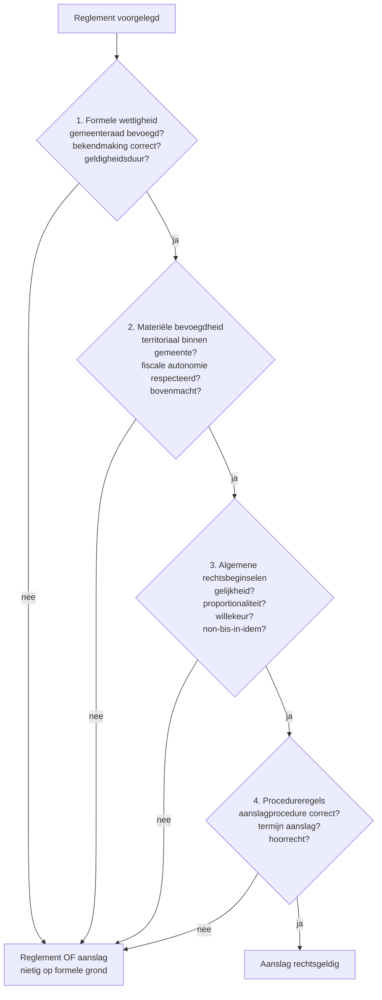

> **Leerstuk — één vraag, helemaal doorgewerkt.** Hoe haalt een gemeente haar geld bij de belastingplichtige, en wanneer mag dat? We werken de drie hefbomen door en passen daarna de wettigheidstoets in vier criteria toe op drie mock-reglementen van kustgemeente Stranddorp. De wettigheidstoets is examen-favoriet — je moet de vier criteria paraat hebben. Voor verhaal en routekaart: [[studiemateriaal/2-7|overzicht PO 2.7]].

## Antwoord in één blik

Gemeenten financieren zich met **drie hefbomen**: een aanvullende belasting op de federale personenbelasting, opcentiemen op de gewestelijke onroerende voorheffing, en sui-generis-belastingen op eigen feiten (honden, tweede verblijven, terrassen, leegstand). Provincies werken volgens dezelfde mechanica, maar in Vlaanderen is hun fiscaliteit sinds 2018 sterk afgebouwd; de provinciale opcentiemen op de onroerende voorheffing blijven daar de voornaamste bron.

Elk gemeentelijk of provinciaal belastingreglement moet **vier opeenvolgende criteria** doorstaan: formele wettigheid (bevoegde raad, correcte bekendmaking, geldigheidsduur), materiële bevoegdheid (territoriaal en geen federale of gewestelijke materie), algemene rechtsbeginselen (gelijkheid, proportionaliteit, niet-confiscatoir karakter, non-bis-in-idem) en procedureregels (aanslagprocedure, termijn, hoorrecht). Eén faal op één criterium volstaat voor nietigheid van het reglement of van de individuele aanslag.

We werken eerst de drie hefbomen door, en passen daarna de wettigheidstoets toe op de mock-reglementen van gemeente Stranddorp.

---

## Lokale fiscale autonomie — het algemene kader

Het verschil met het gewestelijke niveau is wezenlijk. Een gewest heeft een **gelijste bevoegdheid**: het mag enkel die belastingen heffen die in de Bijzondere Financieringswet limitatief zijn opgesomd. Gemeenten en provincies hebben daarentegen een **algemene bevoegdheid** om te belasten wat van gemeentelijk of provinciaal belang is — alles wat federaal of gewestelijk niet uitdrukkelijk is verboden of voorbehouden, mag in principe lokaal worden belast.

Die algemene bevoegdheid heeft een grondwettelijke voet. De gemeentelijke en provinciale instellingen worden bij wet geregeld; aan de gemeenteraden en provincieraden wordt uitdrukkelijk de bevoegdheid toegekend "voor alles wat van provinciaal en van gemeentelijk belang is", binnen het toezicht van een hogere overheid. Op fiscaal vlak betekent dat: de gemeente *mag* belasten, maar binnen grenzen.

Het **heffend orgaan** is altijd de raad zelf — de gemeenteraad voor gemeentebelastingen, de provincieraad voor provinciebelastingen. Het college van burgemeester en schepenen of de deputatie kan geen belasting heffen of moduleren bij eigen besluit. Dit is een harder principe dan op federaal niveau, waar de wetgever wel mag delegeren aan de Koning binnen welbepaalde grenzen: het lokale heffingsrecht is niet delegeerbaar aan het college of de deputatie.

In de bindcase laat gemeente Stranddorp drie reglementen zien, alle vastgesteld door de gemeenteraad: een belasting op tweede verblijven (raadszitting 15 oktober 2025), een hondenbelasting (12 januari 2026) en een terrasbelasting die "ongewijzigd hernieuwd" werd uit 2024. Eén van die reglementen heeft een geldigheidsprobleem — dat komt in de wettigheidstoets aan bod.

"Algemene bevoegdheid" betekent niet "onbegrensd". Er gelden vier harde grenzen: geen federale of gewestelijke materies belasten, het gelijkheidsbeginsel respecteren, een proportionele heffing voorzien, en niet-confiscatoir blijven (geen uitholling van het eigendomsrecht). Die grenzen werken we systematisch uit in de toets verderop.

---

## Drie hefbomen — hoe gemeenten zich financieren

Voor de meeste gemeenten leveren de drie hefbomen samen 60 tot 80 % van de eigen fiscale ontvangsten op. Ze werken mechanisch verschillend, maar zitten allemaal binnen hetzelfde reglementaire kader — één raadsbeslissing kan meerdere belastingen omvatten, of elke belasting krijgt een eigen reglement.

| Hefboom | Mechanisme | Voorbeeld Stranddorp |
|---|---|---|
| **Aanvullende belasting op de personenbelasting** | Procentuele opslag op de federale PB-aanslag van inwoners | 7,8 % op de hoofdsom PB |
| **Opcentiemen op de onroerende voorheffing** | Vermenigvuldigingsfactor op de basis-OV (gewestelijk tarief) | 950 opcentiemen → factor 10,5 |
| **Sui-generis-belasting** | Eigen heffing op een eigen feit, vastgesteld bij reglement | Tweede verblijven 1.250 EUR/jaar, honden, terrassen |

### Hefboom 1 — aanvullende belasting op de federale personenbelasting

De wet voorziet dat gemeenten en agglomeraties, in afwijking van het algemene verbod om opcentiemen te heffen op de federale directe belastingen, één aanvullende belasting op de personenbelasting mogen vestigen. In de praktijk schommelt het percentage tussen 6 en 9 %; het gemiddelde ligt rond 7 %. Voor exacte gemeentelijke tarieven: het Cijferzakboekje of de gemeentewebsite.

De **berekeningsgrondslag** is de Staats-PB op de gezamenlijk belaste inkomsten, vóór verrekening van voorheffingen en voorafbetalingen — niet het uiteindelijk te betalen bedrag. Afzonderlijk belaste inkomsten, typisch de roerende inkomsten waarop al een bevrijdende roerende voorheffing werd ingehouden, volgen de aanvullende gemeentebelasting **niet**. Dat is een klassiek examen-detail: dividenden waarop al RV is ingehouden voeden geen aanvullende gemeentebelasting.

De gemeente legt het percentage vast in een belastingreglement dat ten laatste op 31 januari van het kalenderjaar waarnaar het aanslagjaar wordt genoemd, in werking treedt. Bij ontstentenis blijft het percentage van het vorige aanslagjaar gelden.

De **inning** is geconcentreerd bij FOD Financiën: één aanslagbiljet voor de federale PB en de aanvullende gemeentebelasting samen, één doorstorting naar de gemeente. Voor de inwoner betekent dat ook één bezwaarroute: betwist je de aanvullende gemeentebelasting, dan loopt het bezwaar via de federale procedure (adviseur-generaal van de fiscale administratie), niet via de gemeente. Dat verschilt fundamenteel van een sui-generis-belasting, waar het bezwaar bij het college van burgemeester en schepenen komt.

In de Vermeulen-case: Wouter en Annick wonen in Lier — Lier heft een aanvullende gemeentebelasting op de PB. Bram woont in Brussel-stad. De Brusselse gemeenten zitten gemiddeld lager (5 à 6 %) dan de Vlaamse (gemiddeld 7 %), zodat Bram bij gelijke PB-aanslag een kleinere lokale meerkost draagt dan zijn ouders.

> **De terminologie is verwarrend, maar het verschil is wettelijk.** Een *aanvullende belasting* is een procentuele opslag op een eindberekening (zoals de aanvullende gemeentebelasting op de PB); een *opcentiem* is een factor op een tariefbasis (zoals de opcentiemen op de OV). De aanvullende gemeentebelasting wordt in de volksmond soms "gemeentelijke opcentiemen op de PB" genoemd, maar wettelijk is het géén opcentiem. Examen-vraag-favoriet.

### Hefboom 2 — gemeentelijke en provinciale opcentiemen op de onroerende voorheffing

Hier is het *wel* een opcentiem in de strikte zin: een vermenigvuldigingsfactor die de gemeente (en in Wallonië nog de provincie) toepast op de basis-onroerende voorheffing, die op haar beurt = geïndexeerd kadastraal inkomen × gewestelijk basistarief.

De rekenregel is verraderlijk. **1.000 opcentiemen betekent een factor 11** (1 + 1000/100), niet 10. Het is geen typo: 1.000 opcentiemen = 1.000 % opslag bovenop de basis. Stranddorp heft 950 opcentiemen → vermenigvuldigingsfactor 10,5. De volledige formule wordt dan:

> OV-totaal = geïndexeerd KI × gewestelijk basistarief × (1 + (gemeente-opcentiemen + provincie-opcentiemen) / 100)

Werk de Vermeulen-case door op de studio in Knokke-Heist. Stel een niet-geïndexeerd KI van 850; de indexcoëfficiënt 2026 en het Vlaamse basistarief (~2,5 %) komen uit het Cijferzakboekje. Bovenop de basis-OV komen de gemeente-opcentiemen van Knokke-Heist en de 300 opcentiemen van de provincie West-Vlaanderen. Het eindbedrag kan je niet schatten — laat de berekening in de praktijk via de aanslag van Vlabel lopen, of werk het door met de actuele coëfficiënten.

In Vlaanderen variëren de gemeente-opcentiemen typisch tussen 700 en 2.500. Lage gemeenten — vaak rijke randgemeenten — houden bewust laag om aantrekkelijk te blijven voor vastgoedinvesteerders. **Voor cliëntadvies bij vastgoedaankoop**: het gewest-tarief is maar één deel van het verhaal — de gemeentelijke (en in Wallonië provinciale) opcentiemen kunnen het effectieve OV-tarief verdubbelen of verdrievoudigen.

De provinciale opcentiemen op OV liggen in Vlaanderen sinds 2018 geplafonneerd op het niveau van 2017 plus indexering. In Wallonië bepalen de provincieraden hun opcentiemen nog vrij. Het Brussels Hoofdstedelijk Gewest heeft sinds 1995 geen provincies meer, zodat daar enkel het gemeentelijke niveau speelt.

### Hefboom 3 — sui-generis-belastingen

Bij de sui-generis-belasting verzint de gemeente een eigen heffing op een eigen feit. Geen federale of gewestelijke kapstok is nodig — de raadsbeslissing zelf is de juridische basis, op voorwaarde dat de algemene bevoegdheidsregels worden gerespecteerd.

De klassieke verzameling omvat de huisvuilbelasting, de hondenbelasting, de belasting op tweede verblijven (typisch in kustgemeenten en Brusselse stadsgemeenten), de belasting op parkeren en terrassen, de gemeentelijke leegstandsbelasting (te onderscheiden van de Vlaamse heffing op leegstaande bedrijfsruimten), en in toenemende mate de belasting op naamborden, uithangborden of zelfs op fotovoltaïsche installaties. De belasting op drijfkracht raakt in onbruik.

Stranddorp illustreert drie type sui-generis:

- **Tweede verblijven**: 1.250 EUR per jaar per verblijf dat niet als hoofdverblijfplaats dient. Forfaitair, geen progressie. Kustgemeente-favoriet.
- **Hondenbelasting**: progressief — 50 EUR voor de eerste hond, 100 EUR voor de tweede, 200 EUR vanaf de derde. Vrijstellingen voor blindengeleidehonden, assistentiehonden en bewakingshonden van zelfstandige bewakingsondernemingen.
- **Terras- en uitstalbelasting**: 45 EUR per vierkante meter openbaar domein per jaar. Vrijstellingen voor ambachtelijke markten en kleine kraampjes.

> **Sui-generis ≠ willekeur.** Dezelfde activiteit (een hond houden) kan in gemeente A 60 EUR per jaar kosten en in gemeente B niets. Dat is gewenste lokale autonomie, geen wet-fout. Voor een onderneming met meerdere vestigingen kan dat aanzienlijke verschillen opleveren — bij vestigingsadvies is het lokaal fiscaal landschap een echte parameter, geen detail.

De gemeentelijke creativiteit kent dan ook vier harde grenzen, die we systematisch toetsen in de volgende sectie: geen overlap met federale of gewestelijke materies, gelijkheid in behandeling, proportionaliteit van de heffing en niet-confiscatoir karakter.

---

## Wettigheidstoets — vier criteria die elk reglement moet doorstaan

Dit is de centrale toets van het hele lokale fiscaal recht en een vaste examen-stof. Elk gemeentelijk of provinciaal belastingreglement moet **vier opeenvolgende hekken** door. Eén faal op één hek = nietigheid: ofwel van het reglement zelf (te bestrijden voor de Raad van State binnen 60 dagen na bekendmaking), ofwel van de individuele aanslag (te bestrijden via bezwaar bij het college van burgemeester en schepenen, daarna voor de fiscale rechtbank).

We werken de vier criteria één voor één uit en passen ze daarna toe op de drie Stranddorp-reglementen.

### Criterium 1 — Formele wettigheid

Het reglement moet formeel correct tot stand zijn gekomen. Drie deelvragen:

1. **Is de gemeenteraad bevoegd geweest?** Reglement vastgesteld in openbare zitting, met meerderheid van stemmen. Een reglement dat door het college van burgemeester en schepenen werd vastgesteld is ongeldig — geen delegatie van het heffingsrecht.
2. **Is de bekendmaking correct verlopen?** Sinds het Decreet Lokaal Bestuur gebeurt de bekendmaking voor Vlaamse gemeenten via de gemeentelijke webtoepassing. Aanplakking aan het gemeentehuis blijft in veel reglementen een tweede kanaal. De provinciegouverneur oefent algemeen toezicht uit en kan een reglement schorsen of vernietigen bij wettigheidsbezwaar.
3. **Wordt de geldigheidsduur gerespecteerd?** Belastingreglementen worden typisch jaarlijks vernieuwd tenzij meerjarig vastgesteld; voor opcentiemen geldt een maximum van zes jaar. Een reglement zonder geldige vernieuwing is vervallen, en een aanslag die erop steunt is nietig.

**Toepassing op Stranddorp**: de terrasbelasting 2026 zou "ongewijzigd hernieuwd" zijn uit 2024 zonder nieuwe raadsbeslissing. Als de jaarlijkse vernieuwingsplicht niet automatisch is uitgesloten in het oorspronkelijke reglement, faalt dit reglement op de geldigheidsduur — alarm op criterium 1. De tweede-verblijvenbelasting (gemeenteraad 15 oktober 2025, bekendgemaakt 25 oktober 2025) en de hondenbelasting (gemeenteraad 12 januari 2026, bekendgemaakt 20 januari 2026) doorstaan dit hek wél.

### Criterium 2 — Materiële bevoegdheid

Drie deelvragen:

1. **Territoriaal**: speelt het belastbaar feit zich af op het grondgebied van de gemeente? Stranddorp kan geen tweede verblijf belasten dat in Knokke staat — territoriaal verbod is hard.
2. **Geen federale of gewestelijke materie**: de gemeente mag niet een federale belasting (zoals een eigen "BIV" of een eigen "PB") in een ander jasje opnieuw heffen. Dit is de zogenaamde non-bevoegdheidsoverschrijding. De aanvullende belasting op de PB is een uitzondering die de federale wet uitdrukkelijk toelaat; daarbuiten zijn opcentiemen op directe federale belastingen verboden.
3. **Respect voor de fiscale autonomie van hogere niveaus**: een gemeente kan geen opcentiemen heffen op een gewestelijke heffing waar de bevoegde decreten daarin niet voorzien.

**Toepassing op Stranddorp**: de tweede-verblijvenbelasting is territoriaal in orde (het belast verblijf moet in Stranddorp staan); het is geen federale materie (de federale PB belast inkomen, niet het loutere bezit van een tweede verblijf) en geen gewestelijke (Vlaanderen heft geen tweede-verblijvenbelasting). Criterium 2 is voldaan. Hetzelfde geldt voor de honden- en de terrasbelasting.

### Criterium 3 — Algemene rechtsbeginselen

Hier zit de meeste rechtspraak. Vier deelvragen:

1. **Gelijkheid en non-discriminatie** (artikelen 10 en 11 van de Grondwet, plus de specifiek fiscale variant in artikel 172): gelijke gevallen moeten gelijk worden behandeld; ongelijke behandeling moet **objectief** (op een feitelijk verschil) én **redelijk in verhouding tot het doel** zijn.
2. **Proportionaliteit**: de heffing moet in redelijk verband staan met de dienst, het feit of de overlast die ze beoogt. Een hoog tarief op zich is niet ongeldig — wel een tarief dat kennelijk onredelijk uitvalt tegenover het doel.
3. **Willekeur**: het reglement mag geen onderscheid maken op grond van criteria die geen feitelijke onderbouwing dragen.
4. **Non-bis-in-idem**: één belastbaar feit mag niet zonder uitdrukkelijke wettelijke toelating dubbel worden belast. Op federaal niveau verbiedt de wet de gemeenten om opcentiemen op directe federale belastingen te heffen — sui-generis-heffingen die *de facto* de federale materie raken, zijn verdacht.

**Toepassing op Stranddorp — hondenbelasting**: dit is de examenfavoriet. We toetsen elk onderdeel apart.

| Onderdeel Stranddorp-hondenreglement | Toets | Uitkomst |
|---|---|---|
| Vrijstelling blindengeleidehonden | Gelijkheid — objectieve rechtvaardiging (sociale functie) | Wettig |
| Vrijstelling assistentiehonden | Gelijkheid — objectieve rechtvaardiging (zorg-functie) | Wettig |
| Vrijstelling bewakingshonden van bewakingsondernemingen | Gelijkheid — twijfelachtige rechtvaardiging; eigenbelang van bedrijven? | Vermoedelijk fail |
| Progressief tarief 50 / 100 / 200 EUR | Proportionaliteit + gelijkheid — afhankelijk van motivering | Twijfel — vraag motiveringsnota |

De vrijstelling voor blindengeleidehonden en assistentiehonden steunt op een duidelijke sociale rechtvaardiging — die mag. De vrijstelling voor *bewakingshonden van zelfstandige bewakingsondernemingen* is minder vanzelfsprekend: zij behandelt commerciële bewakingsbedrijven gunstiger dan particulieren met een waakhond, zonder dat het verschil tussen die twee categorieën objectief verbonden is met het doel van de heffing (overlast / gemeentelijke kost). Tenzij de motiveringsnota een sluitend onderscheid aandraagt, faalt deze vrijstelling vermoedelijk op gelijkheid.

De progressieve tariefschijven (50 / 100 / 200 EUR) kunnen geldig zijn — meer honden = meer overlast voor de gemeente, dat is een proportionaliteitsargument. Maar de schijfgrenzen moeten dan objectief gemotiveerd zijn. **Praktijktip voor cliëntadvies**: vraag de gemeente om de motiveringsnota bij het reglement. Daar staat de rechtvaardiging in (of het ontbreken ervan).

De tweede-verblijvenbelasting van Stranddorp komt door criterium 3 heen: het onderscheid tussen hoofdverblijf en tweede verblijf is in vaste rechtspraak van het Grondwettelijk Hof en de Raad van State aanvaard als objectief en redelijk. De terrasbelasting volgt eenzelfde redenering — wie een terras op openbaar domein uitbaat heeft een feitelijk voordeel dat een lokale heffing rechtvaardigt.

### Criterium 4 — Procedureregels

Tot slot: het reglement moet ook bij toepassing correct werken. Drie deelvragen:

1. **Aanslagprocedure**: het aanslagbiljet moet duidelijk vermelden wie belastingplichtige is, wat het belastbaar feit en de grondslag zijn, welk tarief wordt toegepast, binnen welke termijn moet worden betaald, en bij welke instantie en binnen welke termijn bezwaar kan worden gemaakt. Een onvolledig aanslagbiljet is nietig.
2. **Termijn**: gemeentelijke belastingen worden typisch binnen drie jaar na het belastbaar feit gevestigd. Een laattijdige aanslag is nietig.
3. **Hoorrecht**: bij ambtshalve aanslag of bij belasting op aangifte met afwijking moet de belastingplichtige worden gehoord. Dit speelt sterk bij sui-generis-belastingen die op aangifte werken (tweede verblijven, leegstand).

**Praktijktip**: procedurele fouten zijn vaak de snelste route naar nietigheid — sneller dan een inhoudelijke wettigheidsdiscussie. Bij ontvangst van een gemeentelijke aanslag: check eerst de vier verplichte elementen op het biljet en het tijdstip van vestiging, voor je inhoudelijk in discussie gaat.

---

## Provinciale belastingen

België telt tien provincies — vijf Vlaamse en vijf Waalse; het Brussels Hoofdstedelijk Gewest heeft sinds 1995 geen provincies meer. De mechaniek is **identiek** aan die van de gemeenten: de provincieraad heft het reglement, de deputatie behandelt het bezwaar (termijn 3 maanden), de wettigheidstoets in vier criteria geldt onverkort.

Er zijn twee hoofdcategorieën provinciale heffingen. De **provinciale opcentiemen op de onroerende voorheffing** zijn verreweg de belangrijkste opbrengstpost — in Vlaanderen sinds 2018 geplafonneerd op het niveau van 2017 plus indexering, in Wallonië nog vrij vastgesteld. Daarnaast bestaan **eigen provinciale belastingen** op specifieke activiteiten (bedrijfsbelasting, milieu, grondwaterwinning, omgevingsvergunningen) — afnemend in Vlaanderen, in Wallonië nog onverkort.

De Vlaamse afbouw sinds 2018 staat tegenover de aanhoudende provinciale fiscaliteit in Wallonië. Voor cliëntadvies bij vastgoed in Wallonië: de provinciale opcentiemen kunnen daar veel hoger liggen dan de Vlaamse plafonds, en moeten in elke rendementsberekening worden meegenomen.

In de Vermeulen-case: de provincie West-Vlaanderen heft 300 opcentiemen op de OV — die komen bovenop de gemeentelijke 950 opcentiemen van Stranddorp en verzwaren de eindrekening op de studio Knokke verder.

De fiscale autonomie van de provincies kent dezelfde wettelijke grenzen als die van de gemeenten: geen opcentiemen op de PB, vennootschapsbelasting, rechtspersonenbelasting of belasting van niet-inwoners; wél op de onroerende voorheffing en op de gewestelijke leegstandsheffing voor bedrijfsruimten.

---

## Drie valkuilen

> ⚠️ **Aanvullende gemeentebelasting op de PB ≠ gemeentelijke opcentiemen op de OV.** Twee verschillende mechanismen, twee verschillende heffingen, twee verschillende procedures. De aanvullende belasting PB is een procentuele opslag op de eindaanslag PB — bezwaar loopt via de federale procedure (adviseur-generaal). De opcentiemen OV zijn een factor op het basistarief — bezwaar loopt via Vlabel (of het regionale equivalent). Mechanisch en procedureel volledig verschillend, ook al spreekt de volksmond soms over "gemeentelijke opcentiemen op de PB".

> ⚠️ **Sui-generis betekent niet "naar willekeur".** Het betekent een belasting op een **eigen feit**, niet zomaar elke belasting die een gemeente verzint. De vier grenzen blijven gelden: territoriale bevoegdheid, geen overlap met federale of gewestelijke materie, algemene rechtsbeginselen en procedureregels. Examenval: op de vraag "mag gemeente X een belasting op Y heffen?" volstaat het antwoord "ja, sui-generis-bevoegdheid" niet — de wettigheidstoets in vier criteria moet expliciet worden doorlopen.

> ⚠️ **De wettigheidstoets is geen opportuniteitstoets.** Hij toetst of de gemeente dit reglement *mag* uitvaardigen — niet of het tarief *verstandig* is. Een hoog tarief is op zich niet onwettig; het is pas onwettig als het kennelijk onredelijk is tegenover het doel (proportionaliteit binnen criterium 3). Stagiairs die "het tarief is te hoog" als wettigheidsbezwaar formuleren, missen het punt.

---

## Wanneer je dit snapt, ga dan naar

- [[procedure-gewest-en-gemeente]] — Bezwaarroute lokaal: college B&S binnen 3 maanden, daarna fiscale rechtbank — en de aparte route tegen het reglement zelf via Raad van State.
- [[geintegreerd-advies-bij-vestigingskeuze-en-vermogenstransfer]] — Hoe gemeente-opcentiemen en sui-generis-heffingen meewegen in een vestigingsadvies.
- [[studiemateriaal/2-7/samenvatting|Samenvatting PO 2.7]] — Voor herhaling vlak vóór het examen: drie hefbomen + wettigheidstoets in vier criteria.

## Doorklik naar concepten

Voor wie definitorisch detail wil opzoeken:

- [[lokale-fiscale-autonomie]] · [[lokale-belasting-reglement]]
- [[aanvullende-gemeentebelasting-pb]] · [[gemeentelijke-opcentiemen-onroerende-voorheffing]] · [[gemeentebelastingen-sui-generis]]
- [[provinciale-belastingen]] · [[lokale-en-regionale-belastingen]]

---

## Wettelijk fundament

- Lokale fiscale autonomie — bevoegdheid en heffingsorgaan: Grondwet art. 41 (uitsluitend gemeentelijke of provinciale belangen geregeld door de raden) + art. 162 (provinciale en gemeentelijke instellingen bij wet) + art. 170 §3-§4 (legaliteitsbeginsel lokaal).
- Gelijkheidsbeginsel en non-discriminatie inzake belastingen: Grondwet art. 10 + art. 11 + art. 172 (geen voorrechten; vrijstelling of vermindering enkel bij wet).
- Aanvullende gemeentebelasting op de personenbelasting: WIB92 art. 465 t.e.m. 470/2. Gemeente bepaalt het percentage jaarlijks bij belastingreglement (uiterlijk 31 januari, art. 468); grondslag = de totale belasting (gezamenlijk belaste inkomsten) verminderd met de afzonderlijk belaste roerende inkomsten (art. 466); ten laste van de rijksinwoners van de gemeente (art. 467); inning en doorstorting door FOD Financiën (art. 469).
- Verbod op opcentiemen op directe federale belastingen: WIB92 art. 464 (geen opcentiemen op PB, VenB, RPB, BNI; geen belasting op vee).
- Toelating opcentiemen op de onroerende voorheffing: WIB92 art. 464/1 + Vlaamse Codex Fiscaliteit art. 2.1.4.0.2.
- Toelating opcentiemen op de leegstandsheffing bedrijfsruimten: VCF art. 2.6.4.0.2.
- Verbod opcentiemen op BIV: VCF art. 2.3.4.2.2 (verwijzing naar art. 107 WIGB).
- Lokaal belastingreglement — algemeen kaderwet: Wet 24 december 1996 betreffende de vestiging en de invordering van de provincie- en gemeentebelastingen + Decreet Lokaal Bestuur (Vlaanderen) + Waals en Brussels equivalenten. ⚠️ Wet 24.12.1996 niet rechtstreeks in het RAG-corpus aangetroffen — primaire verificatie te bevestigen. Bezwaartermijn 3 maanden bij college B&S vanaf de 3de werkdag na verzending aanslagbiljet.
- Vernietiging reglement: Gecoördineerde wetten Raad van State — vernietigingsberoep binnen 60 dagen na bekendmaking.
- Toezicht op gemeentelijke fiscaliteit: Decreet Lokaal Bestuur (Vlaanderen) — schorsings- en vernietigingsbevoegdheid provinciegouverneur (algemeen toezicht).
- Klassieke rechtspraak: Grondwettelijk Hof en Raad van State — vaste leer over (a) discriminatievragen (bv. onderscheid hoofdverblijf / tweede verblijf — aanvaard wegens objectieve verschillen) en (b) proportionaliteit (tarief moet redelijk verband houden met doel of dienst). ⚠️ Concrete arrest-nummers worden in de samenvatting- en voorbeeldexamenvragen-laag van PO 2.7 aangevuld.

---

*Leerstuk PO 2.7. Status: voorgesteld — POC volgens ADR-037.*
