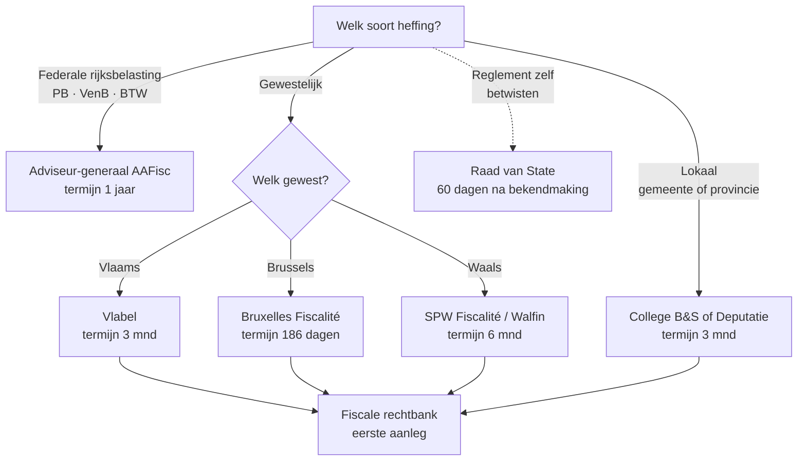

> **Leerstuk — één vraag, helemaal doorgewerkt.** De vier routes hebben elk eigen termijnen, eigen administraties en eigen rechtsmiddelen — een verkeerd geadresseerd bezwaar betekent vaak verlies van termijn. De algemene federale procedure ligt in PO 2.5; hier werken we de gewestelijke en lokale eigenheden uit. Voor verhaal en routekaart: [[studiemateriaal/2-7|overzicht PO 2.7]].

## Antwoord in één blik

Bij een gewestelijke of lokale fiscale aanslag loopt het bezwaar via **vier mogelijke routes** — afhankelijk van wie de heffing oplegt: **Vlabel** voor Vlaamse gewestbelastingen, **Bruxelles Fiscalité** voor Brusselse gewestbelastingen, **Walfin / SPW Fiscalité** voor Waalse gewestbelastingen, en het **College van burgemeester en schepenen** (gemeente) of de **Bestendige Deputatie** (provincie) voor lokale heffingen. Elke route heeft eigen termijnen en een eigen procedure-codex.

Naast deze vier administratieve routes bestaat er nog een vijfde, fundamenteel andere weg: een **vernietigings­beroep bij de Raad van State** binnen 60 dagen na bekendmaking van het reglement zelf. Die loopt parallel met het individuele bezwaar en raakt het reglement in zijn geheel, niet één aanslag.

We werken eerst de termijntabel door, dan elke route in detail, en sluiten af met de aparte reglement-route bij de Raad van State.

---

## De termijntabel — eerste reflex bij elk geschil

Bij elk aanslagbiljet dat een cliënt aanlevert, is je eerste vraag: **welke administratie?** En meteen erna: **binnen welke termijn?** De zeven rijen hieronder zijn de hele kaart van de mogelijke routes — leer ze paraat te hebben, want het kiezen van de verkeerde route maakt een inhoudelijk sterk bezwaar onontvankelijk.

| Heffing | Bron | Bezwaarinstantie | Termijn |
|---|---|---|---|
| **Federale PB / VenB / BTW** | WIB92 art. 366 + art. 371 | Adviseur-generaal van de fiscale administratie | 1 jaar vanaf 3de werkdag na verzending aanslagbiljet |
| **Vlaamse gewestbelasting** (OV · verkeer · BIV · erf · registratie · leegstand · planbaten) | Vlaamse Codex Fiscaliteit | Vlabel | 3 maanden vanaf 3de werkdag na verzending aanslagbiljet |
| **Brusselse gewestbelasting** | Brusselse Codex Fiscale Procedure (Ord. 6.3.2019) | Bruxelles Fiscalité — Direction réclamations | 186 dagen vanaf 7de dag na verzending aanslagbiljet |
| **Waalse gewestbelasting** | Décret 6 mei 1999 | SPW Fiscalité (Walfin) | 6 maanden vanaf datum kennisgeving aanslagbiljet |
| **Gemeentebelasting** (sui generis · aanvullende · opcentiemen) | Wet 24.12.1996 ⚠️ te verifiëren | College van burgemeester en schepenen | 3 maanden vanaf 3de werkdag na verzending |
| **Provinciebelasting** | Wet 24.12.1996 ⚠️ te verifiëren | Bestendige Deputatie van de provincieraad | 3 maanden vanaf 3de werkdag na verzending |
| **Reglement zelf** (vernietigings­beroep) | Gecoördineerde wetten Raad van State | Raad van State — Afdeling Bestuursrechtspraak | 60 dagen na bekendmaking reglement |
| **Beroep tegen bezwaar-beslissing** | Gerechtelijk Wetboek | Rechtbank van eerste aanleg — fiscale kamer | 3 maanden vanaf kennisgeving beslissing OF stilzitten 18 mnd na bezwaarschrift |

Het aanslagbiljet zelf vermeldt verplicht de bezwaarinstantie en bezwaartermijn — bij twijfel is het biljet autoritair. Voor advies vooraf ken je deze tabel echter uit het hoofd.

> **Aside — datum aanslagbiljet of 3de werkdag?** Twee subtiel verschillende startpunten leven naast elkaar. De Vlaamse termijn loopt expliciet vanaf de **derde werkdag** na de verzendingsdatum die op het biljet staat — drie dagen extra. De federale termijn ook. De Brusselse begint vanaf de **zevende dag** na verzending (vermoed kennisname). De Waalse termijn loopt vanaf de **datum van uitwerking** van de kennisgeving. Gemeente en provincie volgen typisch het 3de-werkdag-systeem. Bij elke nieuwe aanslag dus even nakijken welk vertrekpunt geldt — een week verschil tussen "verzending" en "kennisname" kan beslissend zijn op het einde van de termijn.

---

## De vier routes uitgewerkt

Drie pedagogische uitgangspunten gelden voor alle vier de routes. **Eén** — elke route start administratief en eindigt gerechtelijk: bezwaar bij de bevoegde administratie, beroep bij de fiscale rechtbank, beroep daarna bij het hof van beroep. **Twee** — termijnen zijn dwingend, "op straffe van verval". Eén dag te laat = onontvankelijkheid, ongeacht hoe inhoudelijk sterk je dossier is. **Drie** — de bewijslast verschilt nauwelijks tussen de routes: de heffingsoverheid moet de aanslag feitelijk en juridisch onderbouwen, de belastingplichtige moet zijn bezwaar motiveren en de relevante stukken bijvoegen.

### Route 1 — Vlabel (Vlaamse gewestbelasting)

Vlabel — de Vlaamse Belastingdienst — heft en int alle Vlaamse gewestbelastingen: onroerende voorheffing, verkeersbelasting, belasting op de inverkeerstelling, erfbelasting, schenkbelasting, registratiebelasting, leegstandsheffing bedrijfsruimten en planbatenheffing. Wie het ene biljet kent, kent de andere — Vlabel werkt voor alle Vlaamse heffingen op één procedureel sjabloon.

Het bezwaarschrift is schriftelijk, gemotiveerd, ondertekend, met bewijsstukken bijgevoegd. **Indieningstermijn: drie maanden vanaf de derde werkdag na verzending van het aanslagbiljet, op straffe van verval.** Indiening per aangetekende brief — de datum van de poststempel geldt als indieningsdatum — of via het Vlabel-platform. Zolang er geen beslissing is gevallen, mag je het bezwaar aanvullen met nieuwe argumenten, zelfs na de termijn — een belangrijke marge bij ingewikkelde dossiers waar onderzoek tijd vraagt.

De behandeling gebeurt door een bevoegd Vlabel-personeelslid. Op verzoek kan een hoorzitting plaatsvinden. Bemiddeling loopt via de **Vlaamse Belastingbemiddeling** — een gewestelijke tegenhanger van de federale Fiscale Bemiddelingsdienst.

Bij negatieve beslissing — of bij **stilzitten van Vlabel meer dan 18 maanden** na indiening — kan je naar de rechtbank van eerste aanleg, fiscale kamer. Termijn: drie maanden vanaf kennisgeving van de Vlabel-beslissing.

> **Vermeulen-case — planbatenheffing Geraardsbergen.** Wouter ontvangt een aanslag planbatenheffing op zijn grond in Geraardsbergen na een ruimtelijk uitvoeringsplan dat agrarisch gebied omzet naar woongebied. Het bezwaar gaat naar Vlabel, binnen drie maanden vanaf de derde werkdag na verzending. Mogelijke argumenten: betwist de waardering van de meerwaarde, betwist de tariefschijf, of vraag opschorting tot effectieve realisatie van de meerwaarde (omdat de heffing pas materieel weegt als hij verkoopt of bouwt).

### Route 2 — Bruxelles Fiscalité (Brusselse gewestbelasting)

Bruxelles Fiscalité is sinds 2017 een eigen Brusselse fiscale administratie en heft de Brusselse gewestbelastingen: erfbelasting, registratiebelasting, onroerende voorheffing, verkeersbelasting en belasting op de inverkeerstelling. Sinds de inwerkingtreding van de Brusselse Codex Fiscale Procedure op 1 januari 2020 is de Brusselse procedure **autonoom uitgewerkt** — niet langer een loutere verwijzing naar de federale mechanica.

**Indieningstermijn: 186 dagen, op straffe van verval.** Het startpunt is bijzonder — de termijn begint te lopen op de zevende dag na verzending van het aanslagbiljet (het vermoeden van kennisname), tenzij de geadresseerde bewijst dat hij later kennis nam. Elektronische biljetten: dezelfde zevende-dag-regel vanaf elektronische terbeschikkingstelling.

> **Pas op — "186 dagen" is geen "6 maanden".** Reken het uit: 186 dagen vanaf eind januari brengt je tot eind juli; 6 maanden brengt je tot eind juli. Vrijwel hetzelfde, maar niet identiek. Voor wie dossiers met krappe marges behandelt — bij twijfel: tel de dagen, niet de maanden.

De Brusselse Codex heeft eigen accenten: een eigen bewijsmiddelen-regeling, eigen onderzoeksbevoegdheden, eigen administratieve boetes en een eigen invorderingsstelsel. Voor de accountant: de procedure lijkt qua opbouw op de federale, maar de details verschillen — wie automatisch naar de WIB92-reflex grijpt voor een Brusselse aanslag riskeert fouten op de afgrenzing.

### Route 3 — Walfin / SPW Fiscalité (Waalse gewestbelasting)

SPW Fiscalité — Service Public de Wallonie, Fiscalité — int de Waalse gewestbelastingen: erfbelasting, registratiebelasting, onroerende voorheffing, verkeersbelasting en BIV. In de praktijk noemt men de dienst vaak "Walfin".

**Indieningstermijn: zes maanden vanaf de datum van uitwerking van de kennisgeving van het aanslagbiljet.** Twee keer zo lang als de Vlaamse en Brusselse termijnen — een afwijking die je *moet* onthouden. Wie een Waals dossier met Vlaamse-reflexen behandelt en denkt "de termijn loopt af binnen drie maanden", verliest mogelijk drie maanden mogelijke voorbereiding. Omgekeerd kan de stagiair die "zes maanden" projecteert op een Vlaamse aanslag het bezwaar te laat indienen.

Een bijzonderheid van het Waalse stelsel: een bezwaarschrift tegen een belasting gevestigd op betwiste bestanddelen geldt **van ambtswege** voor andere belastingen gevestigd op dezelfde bestanddelen of als supplement, zelfs als de bezwaartermijn voor die andere belastingen ondertussen verstreken zou zijn. Praktisch: één Waals bezwaar dekt automatisch hangende supplementen op dezelfde grondslag — een examen-valkuil die nergens anders zo expliciet werkt.

De beslissingstermijn van de administratie loopt parallel met de eerdere routes: bij stilzwijgen of negatieve beslissing kan de zaak naar de rechtbank van eerste aanleg. Voor advies aan Waalse cliënten: gebruik nooit Vlabel-reflexen — Waalse termijnen, Waalse vormregels, Waalse decretale verwijzingen gelden.

### Route 4 — College B&S of Bestendige Deputatie (lokaal)

Voor gemeentebelastingen heft de gemeente — het College van burgemeester en schepenen voert het belastingreglement uit, de gemeenteraad stelt het vast. Voor provinciale heffingen geldt hetzelfde stramien: de Deputatie voert uit, de provincieraad stelt vast. Bezwaar gaat **bij de uitvoerende instantie**: het College voor gemeentelijke heffingen, de Deputatie voor provinciale.

**Indieningstermijn: drie maanden vanaf de derde werkdag na verzending van het aanslagbiljet** ⚠️ te verifiëren (Wet 24.12.1996 art. 9 niet rechtstreeks in RAG-corpus aangetroffen — algemene leer bevestigt 3 maanden bij College B&S of Deputatie). Het bezwaar is schriftelijk, gemotiveerd, ondertekend.

Het College of de Deputatie beslist typisch binnen zes maanden. **Stilzitten gedurende meer dan 6 maanden** wordt beschouwd als impliciete weigering — de belastingplichtige kan dan rechtstreeks naar de rechtbank van eerste aanleg. Bij negatieve beslissing: termijn van drie maanden om beroep aan te tekenen bij de fiscale kamer van de rechtbank van eerste aanleg.

> **Vermeulen-case — hondenbelasting Stranddorp.** Wouter heeft twee honden en ontvangt een aanslag hondenbelasting van Stranddorp voor 2026: 50 EUR voor de eerste hond + 100 EUR voor de tweede = 150 EUR. Hij betwist de progressieve tariefschijf en de vrijstelling voor "bewakingshonden van bewakings­ondernemingen" — die laatste lijkt eigenbelang van een sector zonder objectieve rechtvaardiging. Bezwaarschrift bij het College B&S van Stranddorp binnen drie maanden vanaf de derde werkdag na verzending. Argumenten: gelijkheidsbeginsel uit de wettigheidstoets (zie [[gemeente-en-provinciebelastingen]] — criterium 3).

---

## Speciale route — vernietigings­beroep tegen het reglement

Dit is een **andere route** dan het individuele bezwaar. Geen bezwaar tegen jouw aanslag, maar bezwaar tegen het reglement zelf. Wie hier slaagt, raakt niet één aanslag, maar het hele rechtsbasisstuk waarop alle aanslagen onder het reglement steunen.

**Wie kan beroep instellen.** Iedereen met een rechtstreeks belang — typisch belastingplichtigen onder het reglement, maar ook ondernemers­verenigingen of sectorale organisaties met aantoonbaar belang.

**Bij wie.** De Raad van State, Afdeling Bestuursrechtspraak.

**Termijn: 60 dagen na bekendmaking van het reglement** (aanplakking aan het gemeentehuis + publicatie op de gemeente-website). Dat is kort. Vaak verstreken voordat de eerste aanslagen op basis van het reglement worden verstuurd — dus wie hierop wil inzetten, moet de bekendmaking actief opvolgen, niet wachten tot een biljet binnen valt.

**Procedure.** Schriftelijk verzoekschrift, memorie, in de praktijk bijstand door een advocaat voor de pleidooien. De Raad oordeelt over **wettigheid**, niet over opportuniteit — typisch de vier criteria uit [[gemeente-en-provinciebelastingen]]: formele wettigheid · materiële bevoegdheid · algemene rechtsbeginselen · procedureregels.

**Gevolg bij vernietiging.** Het reglement wordt met terugwerkende kracht geschrapt. Alle aanslagen op basis van dat reglement vallen daarmee weg. Een krachtig instrument — en precies daarom omkaderd met de korte termijn.

> **Vermeulen-case — terrasbelasting Stranddorp.** Het terras-reglement van Stranddorp is voor 2026 ongewijzigd hernieuwd uit 2024, zonder nieuwe gemeenteraadsbeslissing. Twijfel op het eerste criterium van de wettigheidstoets: geldigheidsduur en de formele vernieuwing. Een terras-uitbater die binnen 60 dagen na bekendmaking van de 2026-versie een vernietigings­beroep instelt, kan op die grond mogelijk slagen. Effect: reglement weg, alle opbrengsten 2026 terug te storten aan alle uitbaters in de gemeente. Voor één cliënt strategisch interessant; voor de gemeente budgettair pijnlijk.

In praktijk wordt deze route minder gebruikt dan het individuele bezwaar — vanwege de korte termijn én de procedurele drempel (advocaat, verzoekschrift). Voor accountants is dit een **strategische** keuze in samenwerking met een advocaat, niet de eerstelijns-reflex.

---

## Bezwaar schorst niet automatisch de betaling

Alle vier de routes delen één onaangenaam principe: **bezwaar schorst de plicht tot betalen niet automatisch op**. De cliënt moet in principe binnen de gewone betaaltermijn betalen — typisch twee maanden na aanslagbiljet voor Vlabel, variërend voor gemeenten — terwijl het bezwaar loopt.

Opschorting van invordering kan worden gevraagd, maar moet expliciet gemotiveerd worden. De Vlaamse Codex Fiscaliteit voorziet hiervoor een specifieke regeling; federaal werkt het vergelijkbaar via de WIB92. Lokaal is automatische opschorting doorgaans onbestaande — de gemeente moet vorderen om budgettair op koers te blijven.

Voor cliëntadvies: neem bij elk bezwaar de vraag van **invorderings­opschorting** expliciet mee. Veronderstel nooit dat ze automatisch loopt. Het alternatief — eerst betalen, bij succes terug ontvangen met nalatigheids­interesten in voordeel — is fiscaal-neutraal maar kan de liquiditeit kraken.

---

## Drie valkuilen

⚠️ **Verkeerd geadresseerd bezwaar = verlies van termijn.** Wouter Vermeulen ontvangt een aanslag onroerende voorheffing op zijn woning in Lier. Bezwaar moet naar Vlabel — niet naar de federale adviseur-generaal — want de onroerende voorheffing is sinds 2014 volledig een Vlaamse heffing. Wie reflexmatig "federaal" denkt voor wat ooit federaal was, ziet zijn bezwaarschrift onontvankelijk verklaard. Hetzelfde geldt voor verkeers­belasting en BIV: gewest, niet federaal.

⚠️ **Waalse termijn van 6 maanden verwarren met de standaard 3 maanden van Vlabel/Brussel/lokaal.** Wie een Waals dossier behandelt met Vlaamse-reflexen riskeert tweezijdig schade: enerzijds te vroeg afgesloten ("we hebben nog maar drie maanden") terwijl er nog drie maanden voorbereidingstijd zijn, anderzijds — bij geheel andere routes vergeleken — een dossier laten liggen tot het echt te laat is. De Brusselse termijn van 186 dagen ligt qua omvang dicht bij 6 maanden, maar werkt vanaf een ander startpunt (zevende dag na verzending).

⚠️ **Individueel bezwaar verwarren met vernietigings­beroep tegen het reglement.** Twee verschillende routes, twee organen (College of Deputatie versus Raad van State), twee termijnen (3 maanden vanaf aanslagbiljet versus 60 dagen vanaf bekendmaking reglement), twee verschillende effecten (de individuele aanslag wijken versus het hele reglement laten vallen). Strategisch overwegen: voor één cliënt is individueel bezwaar vaak voldoende, zeker wanneer de RvS-termijn al verstreken is. Voor structurele bezwaren tegen een nieuw reglement — collectief — kan de Raad van State-route wel de juiste keuze zijn.

---

## Wanneer je dit snapt, ga dan naar

- [[wat-zijn-regionale-en-lokale-belastingen]] — voor het bevoegdheids­kader dat bepaalt welke route geldt.
- [[gewestelijke-heffingen-overgedragen-en-autonoom]] — voor de specifieke gewest-heffingen waarop een route van toepassing is.
- [[gemeente-en-provinciebelastingen]] — voor de wettigheidstoets in 4 criteria — basis voor inhoudelijke bezwaar­argumenten.
- [[geintegreerd-advies-bij-vestigingskeuze-en-vermogenstransfer]] — hoe procedure-overweging meeweegt bij vestigingskeuze of bezwaar­strategie.
- [[studiemateriaal/2-7/samenvatting|Samenvatting PO 2.7]] — voor herhaling vlak vóór het examen.

## Doorklik naar concepten

Voor wie definitorisch detail wil opzoeken:

- [[gewestelijke-fiscale-procedure]] · [[lokale-belasting-reglement]]
- [[fiscale-bemiddelingsprocedure]]
- [[lokale-en-regionale-belastingen]]

---

## Wettelijk fundament

- Vlaamse bezwaartermijn: VCF art. 3.5.2.0.1 (3 mnd vanaf 3de werkdag na verzending aanslagbiljet, op straffe van verval) + art. 3.5.2.0.2 (aanvullende bezwaren zolang geen beslissing is gevallen) + art. 3.5.2.0.4 (specifiek voor onroerende voorheffing — termijn kan niet verstrijken vóór 31 maart van het jaar volgend op aanslagjaar).
- Vlaamse opschorting invordering bij bezwaar: VCF (regeling rond opschorting bij bezwaar of ontheffings­aanvraag).
- Waalse bezwaartermijn + ambtswege-werking: Décret 6 mei 1999 art. 25 (6 mnd bezwaartermijn vanaf datum uitwerking kennisgeving aanslagbiljet) + art. 25bis (bezwaar dekt automatisch andere belastingen op dezelfde betwiste bestanddelen).
- Brusselse gewestelijke fiscale procedure: Ord. 6 maart 2019 — Brusselse Codex Fiscale Procedure art. 100 (termijn 186 dagen vanaf 7de dag na verzending aanslagbiljet, op straffe van verval).
- Lokale bezwaarprocedure: Wet 24 december 1996 betreffende de vestiging en de invordering van de provincie- en gemeentebelastingen (⚠️ te verifiëren — primaire bron niet rechtstreeks in RAG-corpus; 3 mnd bezwaar bij College B&S of Deputatie).
- Beroep bij fiscale rechtbank: Gerechtelijk Wetboek — termijn van 3 mnd vanaf kennisgeving administratieve beslissing of stilzitten 18 mnd na bezwaarschrift. Van toepassing bij federaal, Vlaams (via VCF), Waals (via Décret), Brussels (via Codex) en lokaal.
- Vernietigings­beroep tegen reglement: Gecoördineerde wetten Raad van State art. 14 § 1 — 60 dagen vanaf bekendmaking — Afdeling Bestuursrechtspraak.
- Federale fiscale procedure (raakvlak — niet kern): WIB92 art. 366 (bezwaar bij adviseur-generaal) + art. 371 (termijn 1 jaar vanaf 3de werkdag na verzending). Voor uitwerking: zie PO 2.5.

---

*Leerstuk PO 2.7. Status: voorgesteld — POC volgens ADR-037.*
