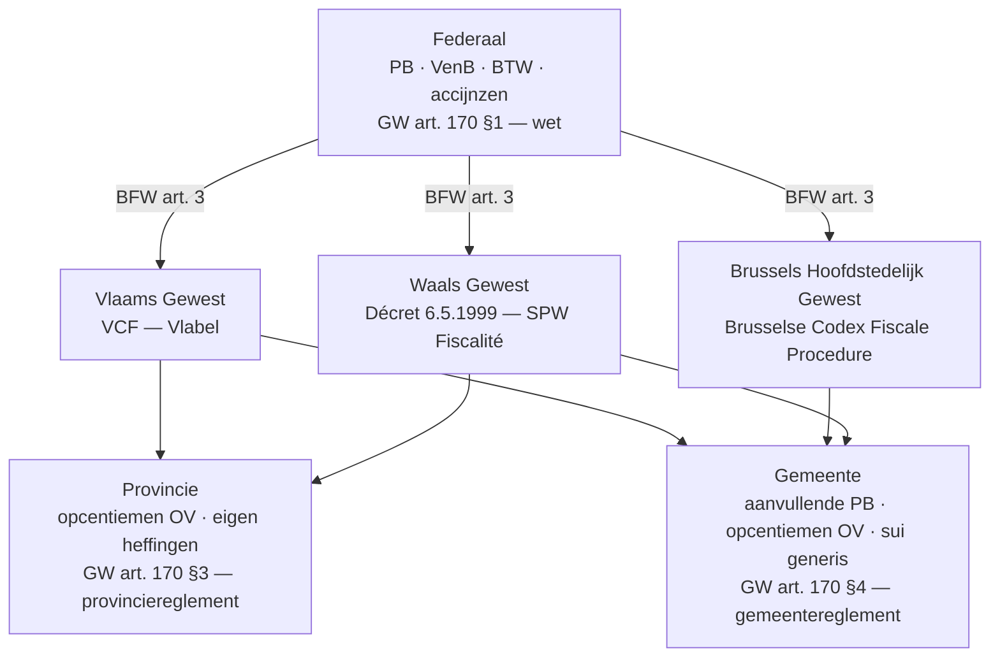
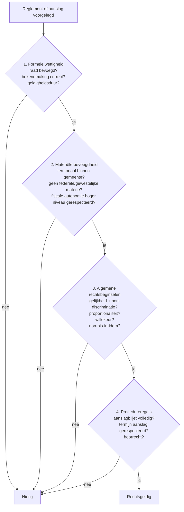
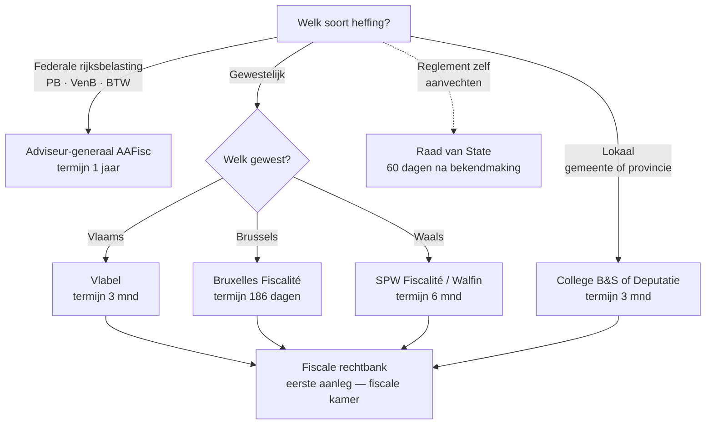

> **Samenvatting — kapstok voor herhaling.** Kader-PO over wie wat mag heffen — niet over tarieven. Deze samenvatting bundelt de bevoegdheidsdriehoek, de drie types gewest-heffing, de drie hefbomen lokaal, de wettigheidstoets in vier criteria en de bezwaarroute-beslisboom met termijntabel. Voor verhaal en routekaart: [[studiemateriaal/2-7|minicursus PO 2.7]]. Voor inhoudelijke tarieven: PO 2.1 (PB), PO 2.6 (erf + schenking), PO 2.5 (federale procedure).

## 1. Take-away — wat je écht moet weten

- **Bevoegdheid is altijd per heffing, nooit per persoon.** Eén cliënt kan voor de ene heffing Vlaams zijn en voor de andere Waals — elk feit heeft een eigen aanknopingspunt (woonplaats schenker, ligging perceel, titularis voertuig, ...). Reflex "Vlaamse cliënt = Vlaamse fiscaliteit voor alles" is fout.
- **Overgedragen ≠ autonoom.** Bij een overgedragen heffing ligt het belastbaar feit federaal vast (BFW) en kiest het gewest enkel tarief + vrijstellingen. Bij een autonome heffing kiest het gewest alles — andere drempels, andere grondslag, niet transponeerbaar tussen gewesten.
- **Aanvullende belasting ≠ opcentiem.** Aanvullende = procentuele opslag op een eindaanslag (gemeentebelasting PB). Opcentiem = vermenigvuldigingsfactor op een basistarief (gemeente-OV). Twee verschillende mechanismen, twee verschillende procedures, vaak verward in de volksmond — examen-favoriet.
- **Wettigheidstoets = 4 opeenvolgende hekken.** Eén faal volstaat: formele wettigheid (raad bevoegd? bekendmaking? geldigheidsduur?) → materiële bevoegdheid (territoriaal + geen federale/gewestelijke materie) → algemene rechtsbeginselen (gelijkheid + proportionaliteit + non-bis-in-idem) → procedureregels. Hoog tarief op zich is geen wettigheidsgrond.
- **Termijnen verschillen drastisch per loket.** Verkeerd geadresseerd bezwaar = verlies van termijn, ongeacht inhoudelijke kracht. Bij elk biljet eerst: welke administratie? Daarna: welke termijn?
- **Vernietigingsberoep RvS ≠ individueel bezwaar.** Twee parallelle routes: bezwaar college B&S binnen 3 maanden treft één aanslag; vernietigingsberoep Raad van State binnen 60 dagen vanaf bekendmaking treft het hele reglement (en alle aanslagen die erop steunen).

---

## 2. Bevoegdheidsdriehoek — wie heft op welke grondwetsbasis?

Vier niveaus, vier paragrafen van Grondwet art. 170, vier norm-instrumenten. Strakke hiërarchie: wet > decreet/ordonnantie > belastingreglement. Voor inhoud: zie [[wat-zijn-regionale-en-lokale-belastingen]].

---

## 3. Drie types gewestelijke heffing — wie bepaalt wat?

Scharniervraag bij elke gewest-heffing: tot welke categorie hoort ze? Die ene keuze bepaalt of een tariefverschil tussen Vlaanderen/Brussel/Wallonië "normaal" is (overgedragen — federale grondslag blijft) of fundamenteel (autonoom — alles kan verschillen).

| Type | Wie bepaalt belastbaar feit? | Wie bepaalt tarief + vrijstellingen? | Hoofdvoorbeelden |
|---|---|---|---|
| **Overgedragen** | Federaal (verankerd in BFW) | Gewest | Onroerende voorheffing · verkeer · BIV · registratie- en erfbelasting |
| **Aanvullend op federale PB** | Federaal (PB-grondslag uniform) | Gewest kiest opcentiem of korting op gewest-aandeel | Gewestelijke opcentiemen PB · woonbonus (Vl, uitdovend) · chèque habitat (W) |
| **Autonoom** | Gewest (eigen materie, geen federaal equivalent) | Gewest | Leegstandsheffing bedrijfsruimten (Vl) · planbatenheffing (Vl) · leegstandsheffing woningen (Br/W) |

> **Noot.** Diepte per heffing + drie-gewesten-vergelijking: [[gewestelijke-heffingen-overgedragen-en-autonoom]]. Concrete tarieven via Cijferzakboekje 2026.

---

## 4. Drie hefbomen gemeente — hoe wordt lokaal geld opgehaald?

Gemeenten en provincies hebben een **algemene** bevoegdheid (alles tenzij), niet een gelijste zoals het gewest. Binnen die ruimte werken drie technieken naast elkaar. Voor diepte: [[gemeente-en-provinciebelastingen]].

| Hefboom | Mechaniek | Grondslag | Voorbeeld kustgemeente |
|---|---|---|---|
| **Aanvullende gemeentebelasting PB** | Procentuele opslag op de federale PB-aanslag van inwoners | Hoofdsom PB (gezamenlijk belaste inkomsten) — afzonderlijk belaste roerende inkomsten tellen NIET mee | 6-9 % typisch; gemiddelde ~7 % |
| **Opcentiemen onroerende voorheffing** | Vermenigvuldigingsfactor op de basis-OV (gewest-tarief × geïndexeerd KI) | Geïndexeerd kadastraal inkomen | 950 gemeente + 300 provincie → factor (1 + 12,5) = 13,5 × basis-OV |
| **Sui-generis-belasting** | Eigen heffing op een eigen belastbaar feit, vastgesteld bij raadsbeslissing | Vast door reglement (forfaitair of progressief) | Tweede verblijven 1.250 EUR/jaar · honden progressief · terrassen 45 EUR/m² |

> **Noot.** Sui-generis ≠ willekeur. Vier grenzen blijven gelden: territoriaal binnen gemeente · geen federale/gewestelijke materie · algemene rechtsbeginselen · procedureregels. Zie wettigheidstoets hieronder.

---

## 5. Opcentiemen-formule — vaak verkeerd uitgerekend

### Onroerende voorheffing — totaal met opcentiemen

**Opcentiemen zijn vermenigvuldigers, geen procentopslagen.** 1.000 opcentiemen = factor 11 (1 + 1000/100), NIET 10. 950 gemeente + 300 provincie geeft factor (1 + 12,5) = 13,5 × basis-OV. Klassieke examenval bij snelle berekening.

$$
\text{OV-totaal} = \text{KI}_{\text{geïndexeerd}} \times t_{\text{gewest}} \times \left(1 + \frac{\text{opc.}_{\text{gem}} + \text{opc.}_{\text{prov}}}{100}\right)
$$

### Basis-OV-tarief per gewest

| Gewest | Basistarief | Typische gemeente-opcentiemen | Provincie-opcentiemen |
|---|---|---|---|
| Vlaanderen | 3,97 % | 700-2.500 | Geplafonneerd sinds 2018 |
| Brussel | 1,25 % | 2.000-3.500 (vaak hoger dan Vl) | Geen — Brussel heeft geen provincies |
| Wallonië | 1,25 % | 1.000-3.000 | Nog vrij vastgesteld |

> **Noot.** Lager basistarief Brussel/Wallonië wordt vaak gecompenseerd door hogere opcentiemen — vergelijken zonder gemeente-cijfer is altijd te vroeg. Actuele cijfers via Cijferzakboekje 2026.

---

## 6. Wettigheidstoets gemeente- of provinciereglement — vier hekken

Examen-favoriet. Vier opeenvolgende criteria, één faal = nietigheid (van reglement of aanslag). Voor uitwerking + toepassing op kustgemeente-mock-reglementen: [[gemeente-en-provinciebelastingen]].

---

## 7. Bezwaarroute-beslisboom — waar dien ik in?

Eerste reflex bij elk fiscaal geschil: welke administratie? Pas daarna: welke termijn? Verkeerd geadresseerd = onontvankelijk, hoe sterk de inhoud ook is. Voor uitwerking per route: [[procedure-gewest-en-gemeente]].

---

## 8. Termijntabel bezwaar — uit het hoofd voor het examen

### Per heffing — instantie + termijn + startpunt

| Heffing | Bezwaarinstantie | Termijn | Startpunt |
|---|---|---|---|
| **Federale** PB · VenB · BTW | Adviseur-generaal AAFisc | **1 jaar** | 3de werkdag na verzending aanslagbiljet (WIB92 art. 371) |
| **Vlaamse** gewestbelasting (OV · verkeer · BIV · erf · registratie · leegstand · planbaten) | Vlabel | **3 maanden** | 3de werkdag na verzending aanslagbiljet (VCF art. 3.5.2.0.1) |
| **Brusselse** gewestbelasting | Bruxelles Fiscalité | **186 dagen** | 7de dag na verzending aanslagbiljet (Brusselse Codex art. 100) |
| **Waalse** gewestbelasting | SPW Fiscalité (Walfin) | **6 maanden** | Datum uitwerking kennisgeving (Décret 6.5.1999 art. 25) |
| **Gemeentebelasting** (sui generis · aanvullende · opcentiemen) | College van burgemeester en schepenen | **3 maanden** | 3de werkdag na verzending aanslagbiljet |
| **Provinciebelasting** | Bestendige Deputatie | **3 maanden** | 3de werkdag na verzending aanslagbiljet |
| **Reglement zelf** (vernietigingsberoep) | Raad van State — Afdeling Bestuursrechtspraak | **60 dagen** | Bekendmaking reglement |
| **Beroep tegen bezwaar-beslissing** | Rechtbank van eerste aanleg — fiscale kamer | **3 maanden** OF stilzitten **18 mnd** | Kennisgeving administratieve beslissing |

> **Noot.** Atypische punten: federale termijn = 1 JAAR (niet 6 mnd). Brussel = 186 DAGEN vanaf 7de dag (niet 3 maanden — al lijkt het qua omvang dicht bij 6 maanden, het startpunt is anders). Wallonië = 6 maanden, twee keer zo lang als Vlabel. Bij Waals bezwaar dekt één indiening ambtswege ook supplementen op dezelfde betwiste bestanddelen (Décret art. 25bis).

### Lokalisatie-aanknopingspunten per heffing

| Heffing | Aanknopingspunt |
|---|---|
| Personenbelasting + aanvullende gemeentebelasting PB | Fiscale woonplaats op 1 januari aanslagjaar |
| Onroerende voorheffing + opcentiemen | Ligging van het onroerend goed |
| Verkeersbelasting + BIV | Woonplaats titularis-inschrijver voertuig |
| Erfbelasting | Laatste fiscale woonplaats overledene — **vijfjaarsregel**: bij verhuis in 5 jaar vóór overlijden geldt het gewest waar de overledene het **langst** woonde in die periode |
| Schenkbelasting onroerend goed | Fiscale woonplaats **schenker** op datum schenking (NIET ontvanger) |
| Sui-generis gemeentebelasting | Grondgebied waar belastbaar feit zich voordoet |

> **Noot.** Eén cliënt, meerdere gewesten + meerdere gemeenten: regel. Bij elke heffing apart lokaliseren. Voor synthese-cases: [[geintegreerd-advies-bij-vestigingskeuze-en-vermogenstransfer]].

---

## 9. Klassieke valkuilen (examen-radar)

| Valkuil | Wat klopt er niet | Wat klopt wél |
|---|---|---|
| Federale bezwaartermijn "6 maanden" inroepen | Een biljet PB/VenB hanteert geen 6-maanden-termijn | **1 jaar** vanaf 3de werkdag na verzending (WIB92 art. 371). De 6 mnd is de Waalse gewest-termijn — verwar ze niet. |
| Brusselse termijn invullen als "3 maanden" of "6 maanden" | Geen van beide klopt — Brussel heeft een atypische dagen-termijn | **186 dagen** vanaf 7de dag na verzending (Brusselse Codex art. 100). Reken dagen, niet maanden, bij krappe marges. |
| Opcentiemen × 1 % toepassen | 1.000 opcentiemen ≠ 1.000 % opslag bovenop de basis op een factor 10 manier | Factor = 1 + (opcentiemen / 100). 1.000 opcentiemen → ×11. 950 → ×10,5. 950 gem + 300 prov → ×13,5. |
| Individueel bezwaar = vernietigingsberoep | Twee parallelle routes worden door elkaar gehaald | Bezwaar college B&S (3 mnd) treft één aanslag; vernietigingsberoep RvS (60 dgn vanaf bekendmaking) treft heel het reglement. Andere instantie, andere termijn, ander effect. |
| Aanvullende belasting PB = autonome gewestbelasting | Gewest "kiest een eigen tarief op de PB" wordt verkeerd geïnterpreteerd als eigen belasting | Aanvullende gewestelijke PB = opslag op een **federale** PB-aanslag — federale grondslag blijft, gewest kiest enkel opcentiem of korting binnen de gewestelijke schijf. |
| 5-jaarsregel erfbelasting toepassen op "gewest waar overledene laatst woonde" | Bij verhuis kort vóór overlijden geldt niet het laatste gewest | Bevoegd gewest = waar de overledene het **langst** woonde in de 5 jaar vóór het overlijden (BFW art. 5 §2). Schenkbelasting onroerend goed daarentegen volgt de **schenker**, niet de ontvanger. |

---

## 10. Verdieping

### Leerstukken — voor pedagogische opfris

Werkt iets niet meer scherp? Klik door naar het leerstuk dat het uitwerkt:

- [[wat-zijn-regionale-en-lokale-belastingen]] — drie niveaus + drie principes (legaliteit, gelijkheid, non-bis-in-idem) + aanknopingspunten per heffing
- [[gewestelijke-heffingen-overgedragen-en-autonoom]] — scharnier overgedragen/autonoom · OV-formule + drie-gewest-tarieven · leegstandsheffing bedrijfsruimten + planbatenheffing
- [[gemeente-en-provinciebelastingen]] — drie hefbomen lokaal + wettigheidstoets in 4 criteria, toegepast op mock-reglementen kustgemeente
- [[procedure-gewest-en-gemeente]] — vier routes (Vlabel · Bruxelles Fiscalité · Walfin · College B&S) + reglement-vernietiging Raad van State
- [[geintegreerd-advies-bij-vestigingskeuze-en-vermogenstransfer]] — 5-stappen samenloop-analyse op vestigingskeuze · tweede verblijf · vermogensoverdracht

### Concept-fiches — voor definitorisch detail

Voor wie een wettekst-pointer of nauwkeurige definitie zoekt:

**Bevoegdheidskaders** — [[lokale-en-regionale-belastingen]] · [[gewestelijke-fiscale-autonomie]] · [[lokale-fiscale-autonomie]]

**Gewestelijke heffingen** — [[onroerende-voorheffing]] · [[kadastraal-inkomen]] · [[verkeersbelasting]] · [[belasting-inverkeerstelling]] · [[leegstandsheffing-bedrijfsruimten]] · [[planbatenheffing]] · [[gewestelijke-belastingverminderingen-pb]] · [[registratie-en-successierechten]] · [[erfbelasting]]

**Lokaal niveau** — [[aanvullende-gemeentebelasting-pb]] · [[gemeentelijke-opcentiemen-onroerende-voorheffing]] · [[gemeentebelastingen-sui-generis]] · [[provinciale-belastingen]] · [[lokale-belasting-reglement]]

**Procedure** — [[gewestelijke-fiscale-procedure]] · [[fiscale-bemiddelingsprocedure]]

---

*Samenvatting PO 2.7. Status: voorgesteld — POC volgens ADR-039. Drie kritische wets-correcties uit L4-render verwerkt: federale termijn 1 jaar (WIB92 art. 371) · Brusselse Codex art. 100 = 186 dagen · Waals decreet art. 25 + 25bis.*
