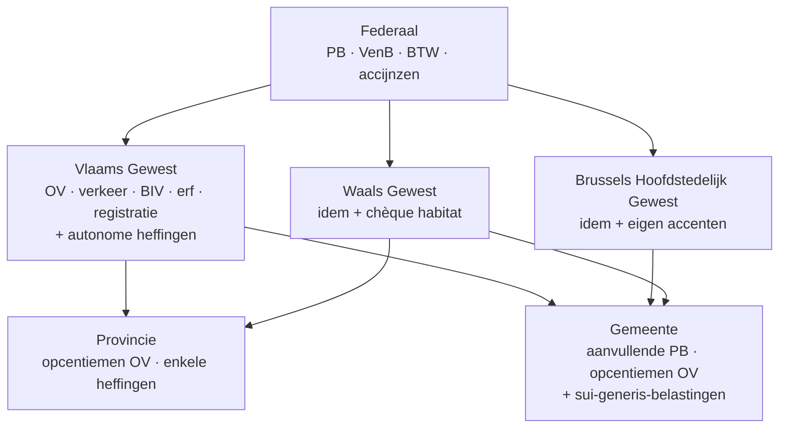

> **Leerstuk — één vraag, helemaal doorgewerkt.** Dit is de entry-fiche voor PO 2.7: eerst snappen wie wát mag heffen, en welke beginselen overal gelden. De techniek per gewest staat in [[gewestelijke-heffingen-overgedragen-en-autonoom]], de lokale wettigheidstoets in [[gemeente-en-provinciebelastingen]], de bezwaarroutes in [[procedure-gewest-en-gemeente]]. Voor verhaal en routekaart: [[studiemateriaal/2-7|overzicht PO 2.7]].

## Antwoord in één blik

Regionale en lokale belastingen zijn alle heffingen onder het federale niveau: **de gewesten, de provincies en de gemeenten** mogen elk binnen hun bevoegdheid een belasting invoeren — grondslag, tarief en vrijstellingen bepalen ze zelf, binnen wat de Grondwet en de bijzondere wetgever toelaten. Drie principes lopen daar dwars doorheen: **geen belasting zonder norm op het juiste niveau** (legaliteit), **gelijke gevallen gelijk behandelen** (gelijkheid) en **geen dubbele heffing op dezelfde grondslag** zonder uitdrukkelijke toelating (non-bis-in-idem).

In dit leerstuk leggen we de drie niveaus en de drie principes één keer voluit neer — de andere leerstukken bouwen daarop verder zonder de basis te herhalen.

---

## De drie niveaus van Belgische fiscaliteit

België heeft geen unitair fiscaal systeem. Na opeenvolgende staatshervormingen wonen drie heffende niveaus naast elkaar in dezelfde portemonnee: de federale Staat, de gewesten en de lokale besturen (provincies + gemeenten). Elk niveau heeft zijn eigen lijst belastingen en zijn eigen norm-instrument om die in te voeren.

Het **federale niveau** heft de grote directe en indirecte belastingen: personenbelasting, vennootschapsbelasting, rechtspersonenbelasting, belasting van niet-inwoners, btw, accijnzen en douanerechten. De rechtsbasis zit in het WIB 92, het Btw-Wetboek en het Wetboek der Accijnzen.

De **gewesten** — Vlaanderen, Brussel-Hoofdstad en Wallonië — heffen sinds de staatshervormingen een eigen pakket: onroerende voorheffing, verkeersbelasting, belasting op de inverkeerstelling, registratie- en erfbelasting, plus autonome heffingen zoals de leegstandsheffing bedrijfsruimten en de planbatenheffing. Vlaanderen bundelt al die heffingen in de Vlaamse Codex Fiscaliteit; Brussel werkt met de Brusselse Codex Fiscale Procedure; Wallonië heeft zijn Decreet van 6 mei 1999 plus de Code wallon.

De **lokale besturen** — gemeenten en provincies — heffen aanvullend op een hoger niveau (een opcentiem op de onroerende voorheffing, een aanvullende belasting op de personenbelasting) en daarnaast eigen "sui-generis"-heffingen op feiten die op hun grondgebied plaatsvinden (een tweede verblijf, een hond, een terras op het openbaar domein).

> **Concreet — Wouter Vermeulen woont in Lier en betaalt elk jaar aan vier loketten.** De FOD Financiën int zijn personenbelasting en de btw van zijn vennootschap. Vlabel int zijn onroerende voorheffing op de studio in Knokke en zijn verkeersbelasting. De gemeente Lier voegt een aanvullende personenbelasting toe en opcentiemen op de OV van zijn gezinswoning. De provincie Antwerpen zet daar haar eigen provinciale opcentiemen bovenop. Vier bestemmelingen voor één leven — elk niveau heeft zijn eigen bevoegdheid, en daarmee zijn eigen aangifte, zijn eigen termijn en zijn eigen bezwaarroute.

**Voor advies, aangifte én bezwaar moet je dus eerst correct identificeren welk niveau bevoegd is voor de heffing die voorligt.** Anders dien je je bezwaar bij het verkeerde loket in, en dat is — zoals in [[procedure-gewest-en-gemeente]] uitgewerkt — zelden recupereerbaar binnen de termijn.

---

## Het grondwettelijk fundament

Elk fiscaal niveau ontleent zijn bevoegdheid aan een grondwettelijke bepaling — geen niveau verzint zijn eigen heffingsrecht. De Grondwet bundelt alles in één centraal artikel met vier paragrafen, één voor elk niveau, en wijst telkens aan welke norm vereist is om een belasting in te voeren.

| Rechtsgrond | Niveau | Norm-instrument | Voorbeeld |
|---|---|---|---|
| Grondwet — paragraaf 1 | Federaal | Wet (Kamer + Senaat) | WIB 92, Btw-Wetboek |
| Grondwet — paragraaf 2 + Bijzondere Financieringswet | Gewest | Decreet (Vl, W) / Ordonnantie (Br) | Vlaamse Codex Fiscaliteit; Brusselse Codex Fiscale Procedure; Waals Decreet 6 mei 1999 |
| Grondwet — paragraaf 3 + autonomie-artikel | Provincie | Provinciaal belastingreglement (raadsbeslissing) | Provinciale opcentiemen OV West-Vlaanderen |
| Grondwet — paragraaf 4 + autonomie-artikels | Gemeente | Gemeentelijk belastingreglement (raadsbeslissing) | Aanvullende gemeentebelasting PB Stranddorp; reglement tweede verblijven |

Twee nuances die je moet zien.

**Eerste nuance — de gewest-bevoegdheid is niet onbegrensd.** Een gewest mag bij decreet of ordonnantie een belasting invoeren, maar enkel binnen wat de Bijzondere Financieringswet als gewestbevoegdheid aanduidt. Dat zijn de twaalf "overgedragen" belastingen plus de marge voor een aanvullende personenbelasting. Daarbuiten geldt de federale lijst, of moet het gewest een eigen autonome heffing motiveren binnen zijn materiële bevoegdheden (huisvesting, ruimtelijke ordening, leefmilieu).

**Tweede nuance — de lokale autonomie is *afgeleid*.** De gemeenteraad en de provincieraad regelen autonoom alles wat van uitsluitend gemeentelijk of provinciaal belang is. Maar de organisatie zelf — wat een gemeenteraad is, hoe ze beslist, welk toezicht erop staat — wordt bij wet geregeld. De gemeente heft dus *binnen* een kader dat de hogere overheid heeft uitgetekend, niet daarbuiten.

De hiërarchie is daarmee strak: **wet > decreet of ordonnantie > belastingreglement.** Elk niveau respecteert de grenzen van het hogere. Een gemeentereglement dat tegen een decreet ingaat, sneuvelt; een decreet dat de Bijzondere Financieringswet overschrijdt, sneuvelt; een wet die de Grondwet schendt, sneuvelt.

---

## Drie categorieën gewestelijke fiscale ontvangsten — de scharnier

Wie de gewest-fiscaliteit wil snappen, moet één scharniervraag stellen: **wie bepaalt het tarief?** Daar zit het hele bevoegdheidsverhaal. De gewesten hebben drie soorten ontvangsten, en de mate van autonomie verschilt sterk per categorie. Deze driedeling komt hier kort voor — de techniek en de gewest-vergelijking werken we uit in [[gewestelijke-heffingen-overgedragen-en-autonoom]].

| Categorie | Wie bepaalt grondslag + tarief? | Voorbeelden |
|---|---|---|
| **Eigen gewestbelastingen** (overgedragen) | Gewest — volle autonomie binnen de Bijzondere Financieringswet | Onroerende voorheffing · verkeersbelasting · belasting op de inverkeerstelling · registratie- en erfbelasting |
| **Aanvullende belastingen op een federale heffing** | Federaal bepaalt grondslag; gewest kiest een opcentiem of een korting op het gewest-aandeel | Gewestelijke opcentiemen op de personenbelasting · gewestelijke belastingverminderingen (woonbonus, chèque habitat) |
| **Autonome gewestbelastingen** | Gewest — eigen materie, geen federaal equivalent | Leegstandsheffing bedrijfsruimten (Vl) · planbatenheffing (Vl) |

De **eerste categorie** is de meest gekende. De Bijzondere Financieringswet wijst een lijst belastingen aan die volledig naar het gewest gaan: de gewesten bepalen er zelf grondslag, tarief, vrijstellingen en zelfs de procedure. Erfbelasting in rechte lijn heeft in Vlaanderen drie schijven met andere tarieven dan in Brussel of Wallonië — drie gewesten, drie regimes voor wat fiscaal-conceptueel dezelfde belasting is. Wanneer Sofie ooit de studio van haar vader Wouter erft, zal de Vlaamse erfbelasting van toepassing zijn — niet de Waalse, ook al woont ze in Namen — omdat de heffing volgt waar de overledene het langst woonde in de vijf jaar vóór overlijden.

De **tweede categorie** is het mechanisme van de aanvullende gewestelijke personenbelasting (sinds de zesde staatshervorming). De federale fiscus berekent de PB op de federale grondslag, en het gewest mag daarop opcentiemen heffen, kortingen toepassen, of eigen belastingverminderingen invoeren. De federale grondslag blijft uniform; de gewest-keuze zit in de marge.

De **derde categorie** zijn de autonome gewestelijke heffingen. Hier vindt het gewest een nieuwe belasting uit op een eigen bevoegdheidsmaterie — ruimtelijke ordening, huisvesting, leefmilieu. De leegstandsheffing op bedrijfsruimten in Vlaanderen is een voorbeeld: er bestaat geen federaal equivalent, en het Vlaamse Gewest heeft hier alle vrijheid om grondslag en tarief te bepalen.

---

## Het lokale niveau — gemeente + provincie

Lokale besturen verschillen fundamenteel van gewesten op één punt: **er bestaat geen lijst van toegewezen lokale belastingen.** Een gemeente of provincie heeft een algemene bevoegdheid om belastingen te heffen op alles wat federaal of gewestelijk niet expliciet verboden is. Die negatieve afbakening — "alles tenzij" — verklaart waarom gemeentereglementen onderling zo divers zijn.

Binnen die ruimte gebruiken gemeenten twee technieken die je goed uit elkaar moet houden.

| Soort lokale belasting | Mechaniek | Voorbeeld bij gemeente Stranddorp |
|---|---|---|
| Aanvullende belasting | Procentuele opslag op een hoger-niveau-aanslag | 7,8 % aanvullende gemeentebelasting PB · 950 opcentiemen op de OV |
| Sui-generis-belasting | Eigen heffing op een eigen belastbaar feit, vastgesteld bij belastingreglement | Belasting op tweede verblijven · hondenbelasting · terrasbelasting |

De **aanvullende belasting** leunt mee op een aanslag van een hoger niveau. De federale fiscus berekent de personenbelasting; de gemeente vermeerdert die met een eigen percentage. De FOD int en stort door. Hetzelfde mechanisme bestaat voor de onroerende voorheffing: het gewest int, en stort het gemeentelijke en provinciale aandeel door volgens de opcentiemen.

De **sui-generis-belasting** staat op zichzelf. De gemeente identificeert een belastbaar feit op haar grondgebied — een tweede verblijf, een hond, een terras — en stelt bij belastingreglement de grondslag, het tarief en de vrijstellingen vast. Die belastbare feiten zijn de hefboom van veel kustgemeenten: Stranddorp heeft drie sui-generis-reglementen die samen de begroting helpen sluiten.

De wettigheidstoets die zo'n lokaal reglement moet doorstaan — vier criteria, met de drie hefbomen van gemeentelijke financiering — werken we uit in [[gemeente-en-provinciebelastingen]].

---

## Drie principes die over alle niveaus heen gelden

De drie principes komen één keer hier voluit. Latere leerstukken roepen ze terug zonder ze opnieuw uit te leggen — onthou hier wat elk principe inhoudt en welk soort gebrek het kan opleveren.

### Legaliteit — geen belasting zonder norm op het juiste niveau

Een belasting is enkel geldig als ze is ingevoerd door het bevoegde orgaan, in de vorm die de Grondwet vereist. Federaal: een wet, niet een koninklijk besluit. Gewest: een decreet of ordonnantie, niet een regeringsbesluit. Gemeente: een raadsbeslissing, niet een collegebeslissing.

Concreet: een gemeentereglement dat door het College van Burgemeester en Schepenen wordt vastgesteld in plaats van door de gemeenteraad, is nietig. Het heffingsrecht behoort tot de bevoegdheden die de Grondwet aan de raad voorbehoudt, en die kan dat recht niet doordelegeren aan het College. Een aanslag op basis van zo'n reglement valt op de eerste hoorzitting.

### Gelijkheid — gelijke gevallen worden gelijk behandeld

Gelijke gevallen krijgen dezelfde fiscale behandeling. Ongelijke behandeling kan, maar enkel met een **objectieve en redelijke** rechtvaardiging die in **verhouding** staat tot het doel van de heffing. Het Grondwettelijk Hof past die toets toe op fiscale reglementen van alle niveaus.

Een voorbeeld dat het haalt: gemeente Stranddorp belast tweede verblijven, niet hoofdverblijven. Dat is ongelijke behandeling — maar gerechtvaardigd, omdat tweede verblijven een aparte druk op gemeentelijke voorzieningen veroorzaken zonder dat de bewoners er gedomicilieerd zijn en dus aan de aanvullende PB bijdragen. Een voorbeeld dat het *niet* haalt: een hondenbelasting met een vrijstelling voor "bewakingshonden van zelfstandige bewakingsondernemingen" — die vrijstelling lijkt op het eigenbelang van één bedrijfstak, zonder objectief verband met het doel van de heffing (de overlast die elke hond veroorzaakt). De wettigheidstoets-toepassing op concrete reglementen werken we uit in [[gemeente-en-provinciebelastingen]].

### Non-bis-in-idem — geen dubbele heffing op dezelfde grondslag

Een lager niveau mag niet hetzelfde belastbaar feit raken dat al door een hoger niveau wordt belast, **tenzij uitdrukkelijk toegelaten**. Het WIB 92 vertaalt dat principe scherp: gemeenten en provincies mogen geen opcentiemen heffen op de personenbelasting, de vennootschapsbelasting, de rechtspersonenbelasting of de belasting van niet-inwoners. Het verbod is absoluut — behalve voor wat de wetgever *expliciet* heeft toegelaten.

En dat zijn precies twee dingen. Eén: gemeenten mogen een **aanvullende belasting** op de personenbelasting heffen — niet via opcentiemen, wel als procentuele opslag op de uiteindelijke aanslag. Twee: gemeenten en provincies mogen **wel** opcentiemen heffen op de onroerende voorheffing en op gewestbelastingen die het kadastraal inkomen als grondslag gebruiken.

> **Concreet — gemeente Stranddorp en de verkeersbelasting.** Stel dat de gemeente bij reglement opcentiemen op de verkeersbelasting zou invoeren. Dat sneuvelt: de verkeersbelasting is een gewestbelasting, en het toelatingsregime voor lokale opcentiemen geldt alleen voor de onroerende voorheffing en heffingen met het kadastraal inkomen als grondslag. Geen uitdrukkelijke toelating = geen lokale opcentiem. De aanslag is nietig.

**De drie principes vormen samen één filter waardoor elke heffing moet.** Een belastingreglement dat een principe schendt is nietig — ook al is de heffing economisch verdedigbaar, ook al ligt het tarief redelijk, ook al heeft de gemeente er centen voor nodig.

---

## Wie heft welke belasting? — de aanknopingspunten

Een accountant wordt vroeg of laat geconfronteerd met de praktijkvraag: "mijn cliënt verhuist tussen gewesten — wat verandert er fiscaal?" Het antwoord ligt nooit in één regel, want **elke belasting heeft een eigen aanknopingspunt**. Een Vlaamse cliënt is voor de ene heffing wél Vlaams, voor de andere niet automatisch.

| Belasting | Aanknopingspunt |
|---|---|
| Personenbelasting (federaal) + aanvullende gemeentebelasting PB | Fiscale woonplaats op 1 januari van het aanslagjaar |
| Onroerende voorheffing + gemeentelijke/provinciale opcentiemen | Ligging van het onroerend goed (gemeente + gewest waar het perceel ligt) |
| Verkeersbelasting + belasting op de inverkeerstelling | Woonplaats van de titularis-inschrijver van het voertuig |
| Erfbelasting | Laatste fiscale woonplaats van de overledene (vijfjaarsregel bij verhuis tussen gewesten — het gewest waar de overledene het langst woonde in de laatste vijf jaar telt) |
| Schenkbelasting onroerend goed | Fiscale woonplaats van de schenker op datum schenking |
| Sui-generis-gemeentebelasting | Grondgebied van de gemeente die heft (waar het belastbaar feit zich voordoet) |

Wat dit concreet betekent in de familie Vermeulen: Wouter woont in Lier (Vlaams) en heeft alle vastgoed in Vlaanderen — gezinswoning in Lier, studio in Knokke, grond in Geraardsbergen, een leegstaand bedrijfspand in Aalst. Voor al die heffingen is het Vlaamse regime van toepassing, ook al verschilt de gemeente per perceel. Wouter's dochter Sofie woont in Namen (Wallonië) — maar wanneer Wouter haar de studio Knokke schenkt, blijft de schenkbelasting **Vlaams**, want het aanknopingspunt voor de schenkbelasting onroerend goed is de fiscale woonplaats van de *schenker*, niet die van de ontvanger.

De aanvullende gemeentebelasting volgt nóg een andere logica: ze hangt aan de fiscale woonplaats op 1 januari. Annick en Wouter dragen dus bij aan gemeente Lier, ook al hebben ze elders eigendommen. Bram, die in Brussel woont, betaalt aanvullende gemeentebelasting aan Brussel-stad — terwijl zijn onroerende voorheffing (zou hij iets bezitten) de ligging van het goed zou volgen.

**De synthese voor de praktijk: één cliënt kan voor verschillende belastingen tegelijk in twee of drie gewesten + meerdere gemeenten belast worden.** De samenloop-analyse — wat verandert er waar bij een verhuis, een schenking, een aankoop — werken we uit in [[geintegreerd-advies-bij-vestigingskeuze-en-vermogenstransfer]].

---

## Een dunne laag: belastingen van de gemeenschappen

Naast de drie hoofdniveaus hebben ook de gemeenschappen — de Vlaamse, de Franse en de Duitstalige — een grondwettelijke fiscale bevoegdheid. Maar in de praktijk heffen ze nauwelijks eigen belastingen. De reden is structureel: gemeenschappen worden hoofdzakelijk gefinancierd via **dotaties uit de federale begroting** (geregeld door Titel III van de Bijzondere Financieringswet). Eigen fiscaliteit is daardoor marginaal gebleven.

Het bekendste — en intussen historische — voorbeeld is het **kijk- en luistergeld**, dat in alle gemeenschappen werd afgeschaft tegen 2018. Dat was een gemeenschapsbelasting; daarmee is de zichtbare gemeenschapsfiscaliteit grotendeels weg.

> **Pedagogische opmerking.** Het examen zal hier zelden op terugkomen — maar het hoort tot de programma-doelstellingen dat je weet dat de bevoegdheid bestaat. Onthou: gemeenschappen *mogen* heffen, maar doen het in de praktijk niet — geen autonoom belastingbeleid op gang gekomen, alleen marginale inning-grenzen en accijns-aandelen.

---

## Drie valkuilen

⚠️ **Bevoegdheidsallocatie verwarren — "Vlaamse cliënt = Vlaamse fiscaliteit voor alles" is fout.** Per belasting moet je opnieuw lokaliseren via het juiste aanknopingspunt. Een werknemer ingeschreven in Brussel die in Antwerpen werkt, betaalt aanvullende gemeentebelasting aan Brussel-stad (woonplaats), niet aan Antwerpen (werkplek). Voor de onroerende voorheffing op een appartement in Antwerpen geldt dan weer het Vlaamse regime en de Antwerpse opcentiemen. Eén persoon, twee gemeenten, twee gewesten — en geen tegenspraak.

⚠️ **Non-bis-in-idem verwarren met "geen dubbele belasting".** Het principe verbiedt niet dat hetzelfde feit meermaals belast wordt; het verbiedt dat een lager niveau een grondslag belast die al door een hoger niveau wordt belast, *zonder uitdrukkelijke toelating*. Verboden: een gemeente die een eigen belasting invoert op de PB-grondslag van haar inwoners. Toegelaten: een gemeente die een aanvullende belasting heft op de uiteindelijke PB-aanslag — want dat is uitdrukkelijk door de wetgever toegestaan. Zelfde inkomen, twee niveaus, geen probleem.

⚠️ **"Gemeentelijke opcentiem" verwarren met "aanvullende gemeentebelasting PB" — dat zijn twee verschillende technieken.** Een opcentiem is een **vermenigvuldigingsfactor** op een basistarief: het gemeentelijke aandeel op de onroerende voorheffing wordt berekend als een veelvoud van het gewest-tarief. Een aanvullende belasting is een **procentuele opslag** op een eindaanslag: de gemeentebelasting PB is een percentage van de uiteindelijke PB-aanslag. Allebei lokaal, allebei procentueel, maar mechanisch anders — en met een ander wettelijk regime. De cijfers, de technische verwerking en de aangifte-impact werken we uit in [[gemeente-en-provinciebelastingen]].

---

## Wanneer je dit snapt, ga dan naar

- [[gewestelijke-heffingen-overgedragen-en-autonoom]] — Welke gewestelijke heffingen bestaan, wat is overgedragen vs autonoom, en hoe verschillen de drie gewesten?
- [[gemeente-en-provinciebelastingen]] — Drie hefbomen lokaal + de wettigheidstoets in vier criteria — examen-favoriet.
- [[procedure-gewest-en-gemeente]] — Vier procedure-routes met eigen termijnen, administraties en rechtsmiddelen.
- [[geintegreerd-advies-bij-vestigingskeuze-en-vermogenstransfer]] — Synthese: federale, gewestelijke en lokale fiscaliteit samen afwegen bij vestigingskeuze of vermogensoverdracht.
- [[studiemateriaal/2-7/samenvatting|Samenvatting PO 2.7]] — Voor herhaling vlak vóór het examen: bevoegdheidstabel + termijntabel + wettigheidstoets bij elkaar.

## Doorklik naar concepten

Voor wie definitorisch detail wil opzoeken:

- [[lokale-en-regionale-belastingen]] · [[gewestelijke-fiscale-autonomie]] · [[lokale-fiscale-autonomie]]
- [[aanvullende-gemeentebelasting-pb]] · [[gemeentelijke-opcentiemen-onroerende-voorheffing]]
- [[registratie-en-successierechten]] · [[gewestelijke-belastingverminderingen-pb]]

---

## Wettelijk fundament

- Legaliteitsbeginsel — federaal, gewest, provincie, gemeente: Grondwet art. 170 §1-§4. §1 federaal-wet; §2 gewest-decreet of ordonnantie; §3 provincie-raadsbeslissing; §4 gemeente-raadsbeslissing.
- Gemeentelijke + provinciale autonomie voor uitsluitend lokale belangen: Grondwet art. 41 + art. 162.
- Gelijkheid en non-discriminatie inzake belastingen: Grondwet art. 10-11 + art. 172.
- Gewestelijke fiscale bevoegdheid — lijst overgedragen gewestbelastingen: Bijzondere Financieringswet 16.01.1989 art. 3 (registratierechten op onroerende overdrachten · schenkbelasting · erfbelasting · onroerende voorheffing · verkeersbelasting · belasting op de inverkeerstelling · eurovignet · spelen-en-weddenschappen).
- Aanvullende gewestelijke personenbelasting (zesde staatshervorming): BFW art. 5/1 e.v. (versie 2014) + WIB 92 art. 96/1-96/4.
- Non-bis-in-idem — verbod gemeente/provincie opcentiemen op federale directe belastingen: WIB 92 art. 464. Uitdrukkelijke uitzondering: aanvullende gemeentebelasting PB (WIB 92 art. 465 e.v.). Voor de OV: WIB 92 art. 464/1 laat gemeentelijke en provinciale opcentiemen op de onroerende voorheffing uitdrukkelijk toe.
- Verbod opcentiemen op BIV: Wetboek der Inkomstenbelastingen en gewestelijke fiscaliteit + Vlaamse Codex Fiscaliteit.
- Vlaamse gewestelijke fiscale code: Vlaamse Codex Fiscaliteit (Decreet 13.12.2013). Bundelt onroerende voorheffing, verkeersbelasting, belasting op de inverkeerstelling, leegstandsheffing bedrijfsruimten, erfbelasting, registratiebelasting en de procedure. Beheerd door Vlabel.
- Brusselse gewestelijke fiscale procedure: Ordonnantie van 6 maart 2019 — Brusselse Codex Fiscale Procedure.
- Waalse gewestelijke fiscale procedure: Decreet van 6 mei 1999 betreffende de vestiging, de invordering en de geschillen inzake de Waalse gewestelijke belastingen.
- Lokale belastingreglement — bevoegdheid gemeenteraad: Grondwet art. 170 §4 + Decreet over het Lokaal Bestuur (Vl) + Wet 24.12.1996 (federaal kader gemeente- en provinciebelastingen). ⚠️ te verifiëren — Wet 24.12.1996 niet rechtstreeks in RAG-corpus aangetroffen; vermeld via concept-record `lokale-belasting-reglement`.

---

*Leerstuk PO 2.7. Status: voorgesteld — POC volgens ADR-037.*
