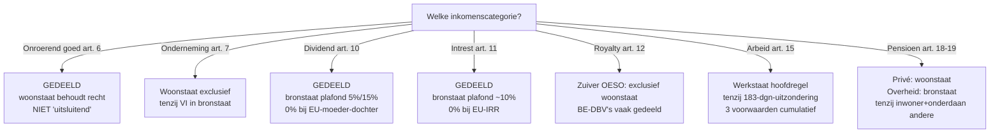

> **Leerstuk — één vraag, helemaal doorgewerkt.** Dit is het kern-techniek-leerstuk van PO 2.8: de denkbeweging die elke internationale casus opent. Voor verhaal en routekaart: [[studiemateriaal/2-8|overzicht PO 2.8]]. Voor definitorische opzoek: [[dubbelbelastingverdrag]] en [[oeso-modelverdrag]].

## Antwoord in één blik

Een dubbelbelastingverdrag (DBV) werkt in vier stappen — en je volgt ze altijd in deze volgorde. Eerst toets je of de persoon én de belasting onder het verdrag vallen. Dan bepaal je welk land de woonstaat is. Dan zoek je per inkomenscategorie op wie mag heffen. En tot slot kijk je hoe de woonstaat de resterende dubbele belasting wegneemt. De klassieke val zit in stap drie: lees je "uitsluitend" waar het verdrag "gedeeld" schrijft, dan kantelt je hele antwoord. België als woonstaat gebruikt in de meeste verdragen vrijstelling met progressievoorbehoud — het buitenlandse inkomen wordt vrijgesteld maar telt mee voor het tarief op je overige inkomsten.

We werken alles uit op één doorlopende voorbeeldgroep — **familie De Cock + Berkelaar Holding BV**, met dochters in BE, NL en LU, een Franse VI in oprichting en een Spaanse villa van Henri. Eerst de vier-stappen-denkbeweging (toepassingsgebied + residentie), daarna zes inkomenscategorieën, daarna de voorkomingsmethoden en tot slot het MLI-overlay.

---

## De vier-stappen-denkbeweging bij elke DBV-toepassing

De stelregel: elke internationale casus volgt deze cascade. Geen versnelde toegangswegen. De stagiair die hem stug volgt, antwoordt nooit verkeerd op het verdragsmechanisme.

**Stap 1 — Toepassingsgebied.** Valt deze situatie überhaupt onder het verdrag? Twee toetsen: is de belastingplichtige inwoner van een of beide verdragsstaten, en gaat het om een belasting naar inkomen of vermogen? Het klassieke voorbeeld waar deze stap *faalt*: successierechten vallen niet onder het OESO-modelverdrag — daarvoor bestaat een apart modelverdrag uit 1982 dat België met slechts enkele staten ondertekend heeft. Een stelling als "de OESO-DBV BE-FR regelt de successierechten van Henri's Spaanse villa" is dus altijd fout.

**Stap 2 — Residentie.** Welke staat is de woonstaat? Elke staat past eerst zijn eigen interne recht toe. Komt er maar één staat uit, dan ben je klaar. Komen er twéé staten uit (dubbele residentie), dan moet je de tie-breaker in art. 4 lopen — daarover meteen meer.

**Stap 3 — Toewijzing per categorie.** Identificeer eerst de inkomenscategorie (onroerend goed, ondernemingswinst, dividend, intrest, royalty, arbeid, pensioen). Lees dan de toewijzingsregel letterlijk. Twee formuleringen komen terug:

- **"may be taxed in that other State"** = gedeelde bevoegdheid. De bronstaat krijgt het heffingsrecht erbij; de woonstaat behoudt het zijne. Bij sommige categorieën met een plafond op het bronstaat-tarief.
- **"shall be taxable only in"** = exclusieve bevoegdheid. Eén staat heft, de andere is uitgesloten.

**Stap 4 — Voorkomingsmethode in woonstaat.** Als de bronstaat (mee)heft, moet de woonstaat de resterende dubbele belasting wegnemen — anders zit de belastingplichtige met twee aanslagen. Twee technieken: vrijstelling met progressievoorbehoud, of credit/verrekening. België kiest in de meeste verdragen voor vrijstelling met progressievoorbehoud, met als belangrijke uitzondering dividend (daar werkt België met de DBI-aftrek).

| Stap | Vraag | OESO-MV | Berkelaar-voorbeeld |
|---|---|---|---|
| 1. Toepassingsgebied | Valt persoon + belasting onder verdrag? | art. 1 + 2 | Henri (BE-inwoner) + Belgische PB → ja |
| 2. Residentie | Welke staat is woonstaat? | art. 4 | Henri = BE (gezin + werkelijke leiding) |
| 3. Toewijzing categorie | Wie mag heffen op welk inkomen? | art. 6-21 | Henri's LU-dividend → art. 10 |
| 4. Voorkoming woonstaat | Hoe vermijdt woonstaat dubbel? | art. 23A of B | BE: vrijstelling met progressievoorbehoud |

---

## Residentie en de tie-breaker bij dubbele woonplaats

Eerst de praktijk-realiteit: residentie is geen feit dat één staat oplegt. Elke staat bepaalt autonoom volgens zijn interne recht wie hij als inwoner ziet. Dat werkt prima zolang slechts één staat de persoon claimt. Wordt problematisch zodra twéé staten allebei "mijn inwoner" zeggen.

Voor die situatie bestaat de **tie-breaker-cascade voor natuurlijke personen** — een keten van criteria die je strikt in volgorde aflopen, en stopt zodra één criterium de knoop doorhakt.

### De cascade — vier stappen, dan onderling overleg

1. **Duurzaam tehuis (permanent home).** In welke staat heeft hij een woning duurzaam tot zijn beschikking? Eigen huis, gehuurd appartement, ouderlijk huis dat altijd klaarstaat — allemaal kandidaat. Slechts in één staat → die staat. In beide → door naar stap 2.

2. **Middelpunt van levensbelangen (centre of vital interests).** Met welke staat zijn zijn persoonlijke en economische banden het nauwst? Multi-factor-toets: gezin, beroep, vermogen, sociaal netwerk, plaatsen waar hij zijn administratie voert. Geen criterium telt absoluut; de rechter weegt het geheel.

3. **Gewoon verblijf (habitual abode).** In welke staat verblijft hij feitelijk het vaakst? Dagen tellen.

4. **Nationaliteit.** Van welke staat is hij onderdaan?

5. **Onderling overleg (mutual agreement procedure).** Als hij van beide staten of van geen van beide onderdaan is → bevoegde autoriteiten regelen het samen. Zeldzaam in de praktijk maar wel het sluitstuk.

> **Klassieke val.** Een examenstelling die nationaliteit als *eerste* tie-breaker-criterium noemt is fout. Nationaliteit komt pas als derde-laatste, ná duurzaam tehuis, middelpunt van levensbelangen en gewoon verblijf. De wetgever wilde nationaliteit expliciet *niet* dominant maken — anders zou een Belgische emigrant zijn hele leven Belgisch belastingplichtig blijven op grond van zijn paspoort. De praktijktoets ligt bij waar de persoon écht leeft.

| Stap | Criterium | Effect bij gelijkstand |
|---|---|---|
| (1) | Duurzaam tehuis | → stap (2) |
| (2) | Middelpunt levensbelangen | → stap (3) |
| (3) | Gewoon verblijf | → stap (4) |
| (4) | Nationaliteit | → stap (5) onderling overleg |
| (5) | Onderling overleg (MAP) | — |

Voor **vennootschappen** voorziet art. 4 in een aparte regel: bij dubbele residentie van een vennootschap was de oude knoop "plaats van werkelijke leiding". Sinds het MLI is dat veranderd — bij dubbele vennootschapsresidentie regelen de bevoegde autoriteiten het via onderling overleg, geen automatische werkelijke-leiding-cascade meer.

### Berkelaar-illustratie

Alle vennootschappen in de groep zijn ondubbelzinnig inwoner van één staat. Berkelaar Holding zit in Antwerpen — werkelijke leiding daar, dus Belgisch inwoner voor de Ven.B. Berkelaar Luxemburg SARL heeft werkelijke leiding in Luxemburg-stad — Luxemburgs inwoner. Geen residentieconflict. Bij de **natuurlijke personen** ligt het anders voor Maarten: hij is sinds 2024 weer in Antwerpen ingeschreven (gezin + woning), maar werkt voltijds in Luxemburg-stad als CFO. Belgisch interne recht zegt: rijksinwoner (gezin in BE). Luxemburgs interne recht zou theoretisch óók kunnen claimen door de werkdagen — potentiële dubbele residentie. Loop de cascade: duurzaam tehuis in BE (eigen huis + gezin), in LU enkel werk → stap 1 hakt al door. Maarten = Belgisch verdragsinwoner; Luxemburg is in het verdrag bronstaat voor zijn arbeidsinkomen.

---

## Toewijzingsregels per inkomenscategorie

Het hart van een DBV zijn de toewijzingsregels in art. 6 tot art. 21 OESO-MV. Elke inkomenscategorie krijgt zijn eigen artikel met zijn eigen formulering. Soms gedeeld, soms exclusief — soms met een plafond op het bronstaat-tarief.

De stelregel om de val "uitsluitend" te vermijden: lees altíjd letterlijk wat er staat. "May be taxed in that other State" geeft de bronstaat een heffingsrecht *erbij* — de woonstaat behoudt het zijne. Pas dan komt art. 23A of B in beeld om dubbele belasting weg te nemen. Alleen "shall be taxable only in" sluit de andere staat volledig uit.

We lopen zes categorieën door, telkens met een Berkelaar-illustratie.

### Art. 6 — Onroerend goed (ligging-staat heft mee)

Onroerend inkomen van een inwoner van staat A, voortkomend uit onroerend goed gelegen in staat B, "may be taxed" in staat B. Vertaling: de ligging-staat (= bronstaat) krijgt heffingsrecht; de woonstaat behoudt eveneens heffingsrecht. **Gedeeld**, geen plafond.

Concretiseer met Henri's Spaanse villa in Cadaqués. Spanje als ligging-staat mag heffen — typisch via de Spaanse niet-inwonersbelasting (IRNR), die forfaitair 1,1% van de kadastrale waarde belast. België als woonstaat behoudt heffingsrecht maar past de voorkomingsmethode uit het DBV BE-ES toe: vrijstelling met progressievoorbehoud. Concreet: het Spaanse onroerend inkomen wordt vrijgesteld in de Belgische PB, maar telt mee om de tariefschalen te bepalen op Henri's overige inkomsten.

> ⚠️ **Klassieke val.** "Onroerende inkomsten zijn UITSLUITEND in de ligging-staat belastbaar" → fout. Heffingsrecht is gedeeld; bovendien past de woonstaat altijd minstens progressievoorbehoud toe. Het verschil tussen "gedeeld met vrijstelling" en "exclusief" lijkt fiscaal-economisch klein (vaak komt er per saldo geen extra BE-belasting bij) — juridisch is het verschil essentieel.

### Art. 7 — Ondernemingswinst (woonstaat tenzij VI)

De winst van een onderneming gevestigd in staat A is in beginsel uitsluitend in staat A belastbaar, **tenzij** de onderneming in staat B een vaste inrichting heeft. In dat geval mag staat B de winst belasten die toerekenbaar is aan die VI — en alleen dat deel.

Twee niveaus dus:

- **Geen VI in bronstaat**: enkel de woonstaat heft. Een Belgische verkoper die af en toe naar Frankrijk fietst zonder vaste plek daar, betaalt geen Franse belasting op zijn winst.
- **Wel een VI in bronstaat**: de bronstaat heft op de VI-winst; de woonstaat behoudt heffingsrecht op de rest en past op het VI-deel zijn voorkomingsmethode toe.

Belangrijke nuance: "toerekenbaar aan VI" is een **zelfstandige-entiteit-fictie**. De VI wordt fiscaal behandeld alsof het een onafhankelijke onderneming was — eigen kapitaalsallocatie, eigen marge, arm's length intra-onderneming-transacties tussen hoofdzetel en VI. Niet de boekhoudkundige tussenstand telt, maar wat een onafhankelijke derde-partij zou hebben gerapporteerd.

Berkelaar-illustratie. Berkelaar Distributie NV (BE) opent in 2025 een atelier-toonzaal in Lille. De verbouwing duurt 14 maanden — daardoor ontstaat al een bouwwerf-VI (over de drempel van [[vaste-inrichting-en-belasting-niet-inwoners|art. 5 §3 OESO-MV]] kom je in het volgende leerstuk uitgebreid). Frankrijk mag heffen op de winst toerekenbaar aan Lille (omzet €280k in H2 2026). België ziet die winst ook — Berkelaar Distributie blijft Belgisch inwoner met wereldinkomen — en past het DBV BE-FR toe: vrijstellingsmethode op het VI-deel. Eén stille subtiliteit: het verlies-aanloopjaar 2026 mag wel afgetrokken worden van de BE-winst, met *recapture* zodra de Franse VI later winstgevend wordt. Dat is een Belgische techniek-regel die niet in het verdrag staat maar in het WIB92.

> **Achtergrond — corresponderende correctie.** Art. 7 OESO-MV bevat ook een paragraaf 3: bij een verrekenprijs-conflict tussen VI en hoofdzetel moet de andere staat een corresponderende correctie maken om dubbele belasting te vermijden. Dat is procedureel oplosbaar via onderling overleg (art. 25). De juridische dubbele belasting "tussen VI en hoofdzetel" bestaat niet — het is dezelfde rechtspersoon — maar economisch en administratief kan het verkeerd lopen.

### Art. 10 — Dividend (gedeeld, met plafond)

Dividend uitgekeerd door een vennootschap-inwoner van staat A aan een inwoner van staat B: gedeelde bevoegdheid. Staat B (woonstaat van de aandeelhouder) "may be taxed"; staat A (bronstaat, waar de uitkerende vennootschap zit) "may also be taxed" — **maar met een plafond**.

Het OESO-modelplafond ligt op 5% bij een ≥25%-moeder-dochter-deelneming (mits houdperiode 365 dagen) en 15% in alle andere gevallen. Belgische DBV's wijken vaak af van dat model: meestal 5% bij ≥10%-deelneming, in moderne verdragen zelfs 0%.

Boven het verdrag legt zich de **EU-Moeder-dochterrichtlijn** als extra laag: voor EU-deelnemingen vanaf 10% met een 1-jaars-houdperiode plus taxatievoorwaarde plus anti-misbruik-check daalt de bronstaat-heffing naar 0%. Voor Berkelaar Holding op haar 100%-deelneming in Berkelaar Luxemburg SARL: moeder-dochterrichtlijn van toepassing → 0% Luxemburgse bronheffing op de geplande €650k dividenduitkering 2026. De verdragsplafonds in DBV BE-LU worden overruled. Verdere uitwerking in [[europese-richtlijnen-en-bronheffing]].

België als woonstaat past géén art. 23A vrijstelling toe op dividend — daar werkt het via de **DBI-aftrek**: 100% aftrek van het dividend uit de Ven.B-grondslag, mits minimumdeelneming, houdperiode én taxatievoorwaarde gehaald zijn. Voor Berkelaar Holding op het LU-dividend: 100%-deelneming en 17% LU-CIT halen de taxatievoorwaarde ruim → volledige DBI-aftrek.

> **Belangrijk onderscheid.** Moeder-dochterrichtlijn-vrijstelling en DBI-aftrek zijn níét automatisch parallel. Een vennootschap kan onder de richtlijn vallen (0% bronheffing) maar tóch falen op de DBI-taxatievoorwaarde — bijvoorbeeld als de uitkerende dochter in een belastingparadijs zit dat formeel onder de richtlijn valt maar materieel geen substantiële belasting heft. Beide regimes hebben *aparte* drempels en *aparte* voorwaarden.

### Art. 11 — Intrest (gedeeld, met plafond)

Vergelijkbaar bouwprincipe als dividend. Intrest betaald door een schuldenaar in staat A aan een crediteur in staat B: gedeeld, met plafond op het bronstaat-tarief — typisch 10% in het OESO-model.

EU-overlay: de **Interest-royaltyrichtlijn** verlaagt de bronheffing naar 0% bij ≥25%-deelneming tussen verbonden ondernemingen (rechtstreeks of via een gemeenschappelijke moeder*vennootschap*), met 1-jaars-houdperiode en uiteindelijk-gerechtigde-test. Berkelaar Holding leent €3,2 mln intern aan Berkelaar Luxemburg SARL aan 3,5% — 100%-deelneming → richtlijn van toepassing. In dit specifieke geval valt de overlap onschadelijk uit, want zowel België als Luxemburg heffen al 0% bronheffing op intra-groep-intrest in hun intern recht.

Twee verdragsregels horen wel op de radar te blijven. Ten eerste de **arm's length-toets op de rentevoet**: bij intra-groep-leningen moet de rente marktconform zijn. Bij excess-rente geldt het verdragsvoordeel enkel op het "normale" bedrag; de excess valt onder nationaal recht en kan herkwalificeerd worden als vermomde winstuitkering. Ten tweede: bij eventuele bronstaat-heffing buiten EU-context past België als woonstaat geen art. 23A vrijstelling toe maar het **forfaitair gedeelte van buitenlandse belasting (FBB)** — een verrekeningstechniek. Daarover meer in [[europese-richtlijnen-en-bronheffing]].

### Art. 12 — Royalty (woonstaat exclusief in zuiver OESO, gedeeld in BE-DBV's)

Hier wijkt het OESO-model af van de Belgische verdragsroutine. In het zuivere OESO-modelverdrag zijn royalty's **uitsluitend** in de woonstaat van de uiteindelijk gerechtigde belastbaar — letterlijk "shall be taxable only". Eén van de weinige inkomenscategorieën waar "uitsluitend" écht klopt.

Maar het Belgische DBV-netwerk wijkt hier vaak af: BE-verdragen geven de bronstaat doorgaans wél een gedeeld heffingsrecht met plafond (5-10%), tenzij de Interest-royaltyrichtlijn van toepassing is. Lees dus altijd het concrete verdrag — generieke OESO-redenering volstaat niet.

EU-overlay: Interest-royaltyrichtlijn → 0% bronheffing bij ≥25%-deelneming tussen verbonden EU-ondernemingen. Berkelaar Nederland BV betaalt jaarlijks €420k royalty aan Berkelaar Luxemburg SARL voor het gebruik van het merk. 100% gemeenschappelijke moeder (Berkelaar Holding) bezit beide → richtlijn van toepassing → 0% Nederlandse bronheffing.

**Art. 12 §4 — transfer-pricing-clausule.** Bij "special relationship" — verbonden ondernemingen — waarbij de royalty hoger ligt dan een arm's length-bedrag, geldt het verdragsvoordeel **enkel op het arm's length-bedrag**. De excess valt buiten het verdrag en wordt onderworpen aan het nationaal recht van elke staat, met inachtneming van de andere bepalingen van het verdrag. Vaak resulteert dat in herkwalificatie als vermomde dividenduitkering.

> **Berkelaar — waar de bel rinkelt.** €420k royalty op €12M NL-omzet = 3,5%. Marktbenchmark voor vergelijkbare merklicenties: 2,0-2,5%. De Nederlandse fiscus kan dus een TP-correctie aanbrengen op €120-180k bovenmatige royalty. Die schijf valt buiten de richtlijn-vrijstelling en wordt onderworpen aan Nederlands intern recht — bij herkwalificatie als verdoken winstuitkering: bronheffing-dividend op de excess, aftrekbeperking bij de Nederlandse dochter, eventueel boete. Volledige uitwerking volgt in [[transfer-pricing-beps-en-anti-misbruik]].

### Art. 15 — Arbeid (werkstaat hoofdregel, 183-dagen-uitzondering)

Bezoldigingen uit dienstbetrekking "may be taxed" in de staat waar de arbeid wordt uitgeoefend (werkstaat). Dat is paragraaf 1 — gedeeld heffingsrecht, werkstaat krijgt de eerste claim.

Paragraaf 2 voorziet een uitzondering: bezoldigingen blijven **uitsluitend in de woonstaat** belastbaar mits drie cumulatieve voorwaarden:

1. De werknemer is niet langer dan 183 dagen in de werkstaat aanwezig binnen een 12-maands-periode die begint of eindigt in het belastbaar tijdperk.
2. De bezoldiging wordt betaald door (of namens) een werkgever die *geen* inwoner is van de werkstaat.
3. De bezoldiging wordt niet ten laste gelegd van een vaste inrichting van de werkgever in de werkstaat.

Eén van de drie niet halen → terug naar de hoofdregel: werkstaat heft. Voorwaarde (2) is de klassieke val: bij salary split waarbij de lokale dochter de bezoldiging betaalt, is de werkgever per definitie inwoner van de werkstaat — voorwaarde faalt vanaf dag 1, ongeacht het aantal werkdagen.

**Sophie-illustratie.** Belgisch inwoner, salary split 60% NL / 40% BE. Haar NL-deel wordt betaald door Berkelaar Nederland BV — een Nederlandse vennootschap, dus inwoner van de werkstaat. Voorwaarde (2) faalt → Nederland heft op het NL-deel onafhankelijk van een 183-dagen-toets. België als woonstaat past het DBV BE-NL art. 23 toe: vrijstelling met progressievoorbehoud op €72k NL-loon, normale BE-PB op €48k BE-loon.

Praktisch effect: het NL-loon wordt vrijgesteld in BE maar verhoogt het *gemiddelde tarief* dat op haar BE-loon toegepast wordt. Niet gunstiger dan een volledig Belgische tewerkstelling, maar ook niet ongunstiger dan de wetgever bedoelde — de progressie wordt simpelweg gerespecteerd alsof haar wereldinkomen wel in BE belast was.

**Maarten-variant.** Belgisch rijksinwoner (gezin in Antwerpen), arbeid 100% in Luxemburg als CFO. Toepassing DBV BE-LU art. 15: LU = werkstaat = heffingsbevoegd op zijn LU-loon. BE past vrijstelling met progressievoorbehoud toe. Bovendien valt Maarten onder het Belgische expat-regime voor inkomende belastingplichtigen, waardoor een deel van zijn bezoldiging fiscaal vrijgesteld is in BE — volledige uitwerking in [[geintegreerd-internationaal-advies]].

### Art. 18 en 19 — Pensioen (woonstaat tenzij overheid)

Kort want het stramien is duidelijk. **Art. 18 — privé-pensioen**: uitsluitend in de woonstaat belastbaar. Klassieke "shall be taxable only"-toewijzing. **Art. 19 §2 — overheidspensioen**: uitsluitend in de uitbetalende staat belastbaar (bronstaat), tenzij de gepensioneerde tegelijk inwoner én onderdaan is van de andere staat — in dat geval kantelt het naar de woonstaat.

Praktische relevantie: een Belgisch overheidspensioen aan iemand die naar een verdragsland verhuist maar Belgisch onderdaan blijft → blijft in BE belastbaar (hoofdregel art. 19 §2, dubbele voorwaarde "inwoner+onderdaan andere staat" niet vervuld). Voor Maarten in de toekomst: als hij ooit naar Luxemburg verhuist en daar zijn privé-pensioen uit zijn eerdere LU-jaren begint te ontvangen — privé-pensioen LU → BE-inwoner: art. 18 → uitsluitend in de woonstaat (BE) belastbaar; Luxemburg mag niet meer heffen.

---

## Voorkomingsmethode in de woonstaat — art. 23A en 23B

Stap 4 van de denkbeweging. Als de bronstaat (mee)heft, moet de woonstaat de resterende dubbele belasting wegnemen. Twee technieken — en het verdrag bepaalt welke. België kiest in de meeste verdragen voor art. 23A (vrijstelling met progressievoorbehoud) als hoofdregel, met enkele specifieke uitzonderingen voor roerende inkomsten.

**Art. 23A — vrijstelling met progressievoorbehoud.** Het buitenlands inkomen wordt vrijgesteld in de woonstaat — het komt níét in de belastbare grondslag. Maar het telt mee voor de bepaling van het tarief op de overige inkomsten. Belgische omzetting: WIB92 art. 155.

Wat zegt die wettekst precies? Vrij vertaald: inkomsten die op grond van een DBV zijn vrijgesteld, komen in aanmerking voor het bepalen van de belasting, maar die belasting wordt verminderd naar de verhouding tussen de vrijgestelde inkomsten en het geheel van de inkomsten. Met andere woorden: stel je BE-tarief schaal vast op je *totale* inkomen, en pas dat tarief dan toe op het *Belgische* deel. Het buitenlands deel wordt niet rechtstreeks belast, maar trekt je effectieve tarief op de rest wel omhoog.

**Art. 23B — credit/verrekening.** Het buitenlands inkomen wordt volledig belast in de woonstaat (komt in de grondslag), maar de buitenlandse belasting wordt afgetrokken van de woonstaatbelasting. Beperking: de verrekening is niet hoger dan het deel van de woonstaatbelasting dat op het buitenlands inkomen valt — anders crediteert de woonstaat de buitenlandse fiscus indirect.

> **Verschil voor de cliënt.** Bij vrijstellingsmethode bepaalt de buitenlandse fiscus de eindfactuur: betaal je in Spanje 1,1% IBI, dan eindigt de Spaanse-villa-zaak daar (plus progressie-effect in BE). Bij credit-methode betaal je *altijd* het hoogste tarief van beide staten. Vrijstelling is gunstiger als het buitenland lager belast; credit is gunstiger voor de fiscus (zekerheid van wereldwijde belasting tot het BE-niveau).

| Methode | Hoe werkt het | Belgisch artikel | Voorbeeld Berkelaar |
|---|---|---|---|
| Art. 23A — Vrijstelling met progressievoorbehoud | Inkomen vrijgesteld + telt mee voor tarief op rest | WIB92 art. 155 | Henri's Spaanse villa; Sophie's NL-loon; Maarten's LU-loon |
| Art. 23B — Credit/verrekening | Inkomen belast + buitenlandse belasting afgetrokken | WIB92 art. 285-289 (FBB) + art. 202-205quater (DBI) | Henri's intrest op buitenlandse obligatie zonder richtlijn-vrijstelling |

Belangrijke Belgische techniek-keuze: art. 23A werkt vaak níét voor dividend, intrest en royalty's. Daarvoor gebruikt België de DBI-aftrek (dividend) of het FBB (intrest, royalty) — beide zijn omzettingen van het credit-mechanisme in technisch-Belgische vorm. Volledige uitwerking in [[europese-richtlijnen-en-bronheffing]].

---

## MLI — overlay over bestaande BE-DBV's

Tijd voor de meta-laag. **MLI** staat voor *Multilateral Instrument* — het multilaterale verdrag dat in 2016 onder OESO-vleugel werd opgesteld als deel van het BEPS-actieplan (actiepunt 15). Belgische ratificatie 2018; in werking voor BE-DBV's vanaf 2019-2020, afhankelijk van de tegenpartij-ratificatie en de keuzes die elk land per artikel maakte.

Wat MLI dóét: het wijzigt **bestaande bilaterale DBV's in één keer**, op punten waar het BEPS-actieplan gaten heeft geïdentificeerd. Geen nieuw verdrag dat de oude vervangt — een overlay die de oude tekst leest en op specifieke punten herschrijft. Voor de praktijk: lees nooit meer alleen het oude verdrag van 1970 of 2001; controleer altijd of MLI overlay-werking heeft. De OESO en FOD Financiën publiceren *synthetised texts* die de geconsolideerde versie tonen.

Vier wijzigingen om paraat te hebben:

**Principal Purpose Test (PPT) — anti-misbruik.** Verdragsvoordelen worden geweigerd als één van de hoofddoelen van de transactie het verkrijgen van die voordelen is. Soepelere en bredere test dan het klassieke "main purpose"-criterium. Treft Berkelaar Holding's LU SARL direct: zonder voldoende substance (kantoor, personeel, economische realiteit) kan de PPT-test falen → moeder-dochterrichtlijn-vrijstelling alsnog geweigerd.

**VI-uitbreiding.** Anti-fragmentatieregel + nieuwe commissionair-PE-regel + dienst-VI. Voorkomt dat ondernemingen kunstmatig onder de VI-drempel blijven door rollen te versplinteren over verschillende vennootschappen. Volledige uitwerking in [[vaste-inrichting-en-belasting-niet-inwoners]].

**MAP-arbitrage.** Verplichte arbitrage bij stilzitten van een mutual agreement procedure ≥ 2 jaar. België heeft deze keuze gemaakt voor specifieke verdragspartners (waaronder NL, FR, LU). Voorheen kon een onderling-overleg-procedure eindeloos blijven liggen — nu is er een afdwingbare deadline.

**Tie-breaker vennootschappen.** Bij dubbele residentie van een vennootschap geldt geen automatische werkelijke-leiding-toets meer; de bevoegde autoriteiten regelen het via onderling overleg. Op het examen: een stelling "werkelijke leiding doorslag bij vennootschap-dubbel-residentie" is post-MLI niet meer juist voor verdragen waar BE en de tegenpartij beide MLI-art. 4 ondertekenden.

---

## Gedeeld versus exclusief — recap

Als ankerpunt voor herhaling. Voor elke inkomenscategorie de toewijzing, het plafond op het bronstaat-tarief en de Belgische voorkomingsmethode.

| Art. | Categorie | Toewijzing | Plafond bronstaat | BE-woonstaat-methode |
|---|---|---|---|---|
| 6 | Onroerend goed | GEDEELD ('may be taxed') | geen | Vrijstelling met progressievoorbehoud |
| 7 | Ondernemingswinst | Woonstaat tenzij VI | n.v.t. | Vrijstelling op VI-winst |
| 8 | Scheepvaart/luchtvaart | EXCLUSIEF werkelijke-leiding-staat | n.v.t. | n.v.t. |
| 10 | Dividend | GEDEELD | 5/15% (OESO); 0% bij EU-MDR | DBI-aftrek |
| 11 | Intrest | GEDEELD | ~10% (OESO); 0% bij EU-IRR | FBB |
| 12 | Royalty | Zuiver OESO: exclusief woonstaat — BE-DBV's vaak gedeeld | varieert | FBB |
| 15 | Arbeid | Werkstaat tenzij 183-dgn-uitzondering | n.v.t. | Vrijstelling met progressievoorbehoud |
| 18 | Privé-pensioen | EXCLUSIEF woonstaat | n.v.t. | n.v.t. |
| 19 | Overheidspensioen | EXCLUSIEF bronstaat tenzij inwoner+onderdaan andere staat | n.v.t. | n.v.t. |

> ⚠️ **Blijf de val herhalen.** In een examenstelling met "uitsluitend" bij art. 6, 7, 10, 11, 12 (in BE-DBV's) of 15 = bijna altijd fout. "Uitsluitend" bij art. 8 (lucht/scheepvaart), 18 (privé-pensioen) of 19 §1 (overheidsfunctie) = correct.

---

## Vier valkuilen

> ⚠️ **Valkuil 1.** "Uitsluitend" in een stelling over gedeelde categorieën (art. 6/7/10/11/15). Bijna altijd fout — gedeeld is de hoofdregel.

> ⚠️ **Valkuil 2.** Nationaliteit als eerste tie-breaker-criterium voor natuurlijke personen. Nationaliteit is derde-laatste, niet eerste. Eerst duurzaam tehuis, dan middelpunt levensbelangen, dan gewoon verblijf — pas dan nationaliteit, en als sluitstuk onderling overleg.

> ⚠️ **Valkuil 3.** OESO-MV toepassen op successierechten. Het modelverdrag dekt alleen "taxes on income and on capital" — successierechten vallen erbuiten. Een apart OESO-model uit 1982 voor successie + schenking bestaat wel, maar wordt in de BE-praktijk nauwelijks gebruikt (enkele bilaterale verdragen).

> ⚠️ **Valkuil 4.** Vergeten dat het MLI bestaande verdragen *wijzigt*. Zonder MLI-check lees je een oude verdragstekst en mis je PPT, MAP-arbitrage, VI-anti-fragmentatie en de gewijzigde vennootschap-tie-breaker.

---

## Wettelijk fundament

- OESO-modelverdrag — personeel toepassingsgebied: art. 1 (Persons covered)
- OESO-modelverdrag — materieel toepassingsgebied: art. 2 (Taxes covered — income and capital). Successierechten niet inbegrepen; apart model 1982.
- Tie-breaker dubbele residentie natuurlijke persoon: art. 4 §2 OESO-MV (cascade duurzaam tehuis → middelpunt levensbelangen → gewoon verblijf → nationaliteit → onderling overleg)
- Tie-breaker dubbele residentie vennootschap (post-MLI): art. 4 §3 OESO-MV (gewijzigd door MLI art. 4 — onderling overleg in plaats van werkelijke-leiding-cascade)
- Vaste inrichting — bouwwerf-drempel: art. 5 §3 OESO-MV (12 maanden)
- Onroerend goed — toewijzing: art. 6 OESO-MV
- Ondernemingswinst — toewijzing + VI-fictie: art. 7 OESO-MV + §3 corresponderende correctie
- Dividenden — toewijzing + plafond bronstaat: art. 10 OESO-MV
- Intresten — toewijzing + plafond: art. 11 OESO-MV
- Royalty's — toewijzing + arm's length-clausule: art. 12 OESO-MV §1 + §4
- Arbeid — werkstaat-hoofdregel + 183-dgn-uitzondering: art. 15 OESO-MV §1 + §2 (3 cumulatieve voorwaarden)
- Pensioenen: art. 18 (privé) + art. 19 (overheid)
- Voorkomingsmethode woonstaat — vrijstelling vs credit: art. 23A + 23B OESO-MV
- Belgische omzetting vrijstelling met progressievoorbehoud: WIB92 art. 155
- Belgische credit-omzetting voor dividend: WIB92 art. 202-205quater (DBI-aftrek)
- Belgische credit-omzetting voor intrest/royalty: WIB92 art. 285-289 (FBB)
- MAP — onderling overleg + arbitrage (post-MLI): art. 25 OESO-MV + MLI art. 16-26
- MLI — Multilateraal Instrument BEPS actiepunt 15: Verdrag van 24 nov 2016; BE-ratificatie 2018

Bedragen en tarieven (bronheffing-plafonds, DBI-drempels) — zie [[bronnen/cijferzakboekje-2026|Cijferzakboekje 2026]] en concrete DBV-tekst.

---

## Wanneer je dit snapt, ga dan naar

- [[vaste-inrichting-en-belasting-niet-inwoners]] — de VI-drempel uitgewerkt (art. 5 OESO-MV) + Belgische BNI-techniek voor inbound/outbound.
- [[europese-richtlijnen-en-bronheffing]] — EU-richtlijnen die boven het DBV uitstijgen: Moeder-dochter + Interest-royalty + FBB/DBI in actie.
- [[transfer-pricing-beps-en-anti-misbruik]] — wat als verrekenprijzen niet kloppen — armslengte + PPT + ATAD.

Voor herhaling vlak vóór het examen: [[studiemateriaal/2-8/samenvatting|Samenvatting PO 2.8]] — toewijzingstabel + tie-breaker-cascade + voorkomingsmethoden op één pagina.

## Doorklik — losse concept-fiches

**DBV-kader**
- [[dubbelbelastingverdrag]]
- [[oeso-modelverdrag]]
- [[mli-instrument]]

**Residentie en methoden**
- [[fiscale-residentie]]
- [[vrijstelling-met-progressievoorbehoud]]

**Per inkomenscategorie**
- [[internationale-tewerkstelling]]
- [[internationaal-onroerend-goed]]

---

*Leerstuk PO 2.8. Bindcase: Familie De Cock + Berkelaar-groep.*
