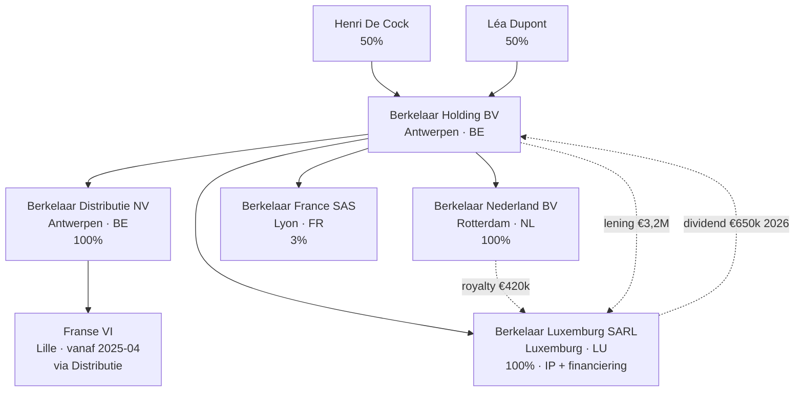

> **Leerstuk — één vraag, helemaal doorgewerkt.** Dit is het syntheseleerstuk van PO 2.8. De vijf voorgaande leerstukken leerden je de bouwstenen herkennen: drie lagen, dubbelbelastingverdragen, vaste inrichting, EU-richtlijnen, transfer pricing. Hier kantel je van *kennen* naar *adviseren*. Voor één concrete cliëntvraag werk je feiten → kwalificatie → DBV → richtlijn → anti-misbruik door tot een onderbouwd advies. Voor verhaal en routekaart: [[studiemateriaal/2-8|overzicht PO 2.8]].

## Antwoord in één blik

Geïntegreerd internationaal advies werkt in **vijf stappen**, altijd in dezelfde volgorde: (1) feiten scherp krijgen, (2) per inkomensstroom kwalificeren, (3) het toepasselijke verdrag toetsen, (4) de EU-richtlijn-overlay testen, (5) anti-misbruik en procedure beoordelen. De stappen zijn een denkframe, geen optelsom — de stagiair die ze automatisch loopt, bouwt sneller en vollediger advies dan wie elk dossier van nul herbegint.

Drie cases op de Berkelaar-groep tonen het frame in actie: **case A** is een *opzet-vraag* (Cypriotische sub-holding voor royalty- en dividendstromen), **case B** is een *exit-vraag* (verkoop van de holding aan een private-equity-fonds plus verplaatsing van de zetel naar Nederland), **case C** is een *vermogensbeheer-vraag* (grensoverschrijdende tewerkstelling van twee kinderen plus een Spaanse villa). De **MAP-procedure** sluit het leerstuk af als rechtsmiddel wanneer twee verdragsstaten ondanks alles tot dubbele heffing komen.

We werken eerst de methodiek door (de vijf stappen), daarna de drie cases (A oprichting, B exit, C grensoverschrijdend vermogen), en sluiten af met de MAP als procedurele uitweg.

---

## De vijf stappen — methodiek

Een geïntegreerd advies is geen herhaling van alle techniek die je in de voorgaande leerstukken leerde. Het is een **gestructureerde denkbeweging** die rauwe feiten vertaalt naar een afgewogen advies. Vijf stappen, altijd dezelfde volgorde — dat is het frame dat blinde vlekken voorkomt en dat je dossier voor dossier consistent maakt.

| Stap | Vraag | Tools / vorige leerstukken |
|---|---|---|
| 1. Feiten | Wie is belastingplichtig? Welke staten? Welke stromen? | Voorbeeldgroep + intakegesprek + jaarrekening |
| 2. Kwalificatie | Welk type inkomen per stroom? Welke aanknopingspunten? VI? | [[wat-is-internationaal-fiscaal-recht]] + [[vaste-inrichting-en-belasting-niet-inwoners]] |
| 3. Verdragstoetsing | Welk DBV? Welke toewijzing? Welke voorkomingsmethode? | [[dbv-werking-en-toewijzingsregels]] |
| 4. Richtlijn-overlay | MDR, IRR of fusierichtlijn van toepassing? | [[europese-richtlijnen-en-bronheffing]] |
| 5. Anti-misbruik + procedure | Substance? PPT? ATAD? Ruling of MAP? | [[transfer-pricing-beps-en-anti-misbruik]] |

**Stap 1 — Feiten.** Je begint met een rustige inventaris van de cliëntsituatie. Wie is belastingplichtig (natuurlijke persoon of vennootschap)? Wat is de residentie van elke betrokken partij? Welke staten zijn geraakt? Welke inkomensstromen lopen er, in welke richting, met welke onderliggende contracten? Documenten verzamelen — jaarrekening, statuten, arbeidsovereenkomsten, residentie-attesten — komt vóór elk juridisch oordeel. Een advies dat op een onvolledige feitenset rust, hoe vakkundig juridisch ook, draait fout in de praktijk.

**Stap 2 — Kwalificatie.** Per inkomensstroom afzonderlijk: wat is het juridische karakter? Onroerend inkomen, ondernemingswinst, dividend, intrest, royalty, arbeidsbezoldiging, vermogenswinst — elke categorie heeft een eigen toewijzingsregel in het OESO-modelverdrag, en de kwalificatie maakt het verschil tussen "woonstaat exclusief", "werkstaat exclusief" of "gedeeld met plafond". Tegelijk identificeer je de aanknopingspunten: bestaat er een vaste inrichting in de bronstaat? Is de ontvanger werkelijk de uiteindelijke gerechtigde (beneficial owner)?

**Stap 3 — Verdragstoetsing.** Welk dubbelbelastingverdrag is van toepassing? Welke toewijzingsregel kiest dat verdrag voor deze inkomenscategorie? Welk plafond op de bronheffing? Welke voorkomingsmethode hanteert de woonstaat? En sinds 2018 telt ook de MLI-overlay mee: de Principal Purpose Test (PPT) en de uitbreiding van het VI-begrip kunnen het verdrag in concreto strenger maken dan zijn oorspronkelijke tekst suggereert.

**Stap 4 — Richtlijn-overlay.** Als beide staten EU-lidstaten zijn, controleer je of een EU-richtlijn de verdragsregeling **uitsneert**. De moeder-dochterrichtlijn elimineert bronheffing op intra-EU dividenden vanaf 10 procent deelneming; de interest-royaltyrichtlijn doet hetzelfde voor royalty's en intresten vanaf 25 procent (rechtstreeks of via een gemeenschappelijke moedervennootschap). Voor reorganisaties biedt de fusierichtlijn fiscale neutraliteit. De richtlijn is geen vervanging maar een **overlay**: ze loopt naast het DBV en wint binnen haar toepassingsgebied.

**Stap 5 — Anti-misbruik en procedure.** Dit is de stap waar de meeste fouten op het examen gebeuren. Heeft de structuur voldoende substance om de PPT-toets te doorstaan? Activeert ATAD een controlled-foreign-company-correctie of een renteaftrekbeperking? Is een DAC6-melding verplicht? En procedureel: heeft een voorafgaande ruling bij de Dienst Voorafgaande Beslissingen zin? Wat zijn de termijnen voor bezwaar en voor MAP?

> **Schriftelijk gemotiveerd advies is geen kers op de taart.** Het examenprogramma legt expliciet op dat de accountant het advies **schriftelijk en gemotiveerd** aflevert. Een louter mondelinge intuïtie volstaat niet — de cliënt moet de redenering kunnen herlezen en de adviseur moet zich erop kunnen verantwoorden bij latere controle.

De vijf stappen werken op elk type internationaal dossier — oprichting, exit, vermogensbeheer, herstructurering. We laten ze nu drie keer draaien op de Berkelaar-groep.

---

## Case A — Oprichting van een Cypriotische sub-holding

Henri zit met een voorstel van zijn financieel adviseur. Het idee: Berkelaar Luxemburg en Berkelaar Nederland onderbrengen onder een nieuwe Cypriotische sub-holding ("Berkelaar Cyprus Ltd"), met Berkelaar Holding BV als enige aandeelhouder van de Cypriotische vennootschap. Het argument van de adviseur klinkt overtuigend: Cypriotische vennootschapsbelasting van 12,5 procent, een IP-box-regime met effectief tarief rond 2,5 procent op kwalificerend royalty-inkomen, en een participatievrijstelling op dividenden uit dochters.

Je voert het frame uit.

### Stap 1 — Feiten

Berkelaar Cyprus Ltd zou opgericht worden naar Cypriotisch recht, met statutaire zetel én werkelijke leiding in Nicosia. De inbreng gebeurt door overdracht van de aandelen Berkelaar Luxemburg en Berkelaar Nederland in ruil voor nieuwe Cypriotische aandelen. Drie nieuwe stromen ontstaan: een royalty Nederland → Cyprus (€420 000 per jaar, momenteel naar Luxemburg), een dividend Luxemburg → Cyprus (€650 000 voorzien voor 2026, momenteel naar de Belgische holding), en een dividend Cyprus → Berkelaar Holding (verwacht boven €1 miljoen per jaar zodra de structuur draait).

### Stap 2 — Kwalificatie

Je splitst de operatie in drie elementen, elk met een eigen kwalificatie. De **inbreng zelf** is een aandelenruil — de Belgische holding draagt haar aandelen Berkelaar Luxemburg en Berkelaar Nederland over aan een nieuwe Cypriotische vennootschap in ruil voor nieuwe aandelen. De **dividendstroom** Cyprus → België is een intra-EU dividend tussen verbonden vennootschappen. De **royaltystroom** Nederland → Cyprus is een intra-EU royalty tussen verbonden vennootschappen via een gemeenschappelijke moeder (Berkelaar Holding houdt 100 procent in beide). Elk element krijgt zijn eigen behandeling.

### Stap 3 — Verdragstoetsing

Voor de dividendstroom Cyprus → België bestaat het DBV België-Cyprus. De algemene regel voor dividenden is een gedeelde bevoegdheid met een plafond op de bronheffing in de bronstaat — maar dat plafond wordt typisch onder een EU-context "overruled" door de moeder-dochterrichtlijn (zie stap 4). Voor de royaltystroom Nederland → Cyprus geldt het DBV Nederland-Cyprus; ook hier wint de richtlijn-overlay zodra zij van toepassing is. Voor de aandelenruil-handeling zelf werkt het DBV op vennootschapsniveau, maar de fiscale neutraliteit komt uit de fusierichtlijn, niet uit het DBV.

### Stap 4 — Richtlijn-overlay

Drie richtlijnen werken hier samen. Voor de **aandelenruil** geldt de fusierichtlijn: bij ruil van aandelen tussen kwalificerende EU-rechtsvormen en kwalificerende belastingplichtigen wordt de meerwaarde bij de inbrengende vennootschap fiscaal neutraal behandeld — uitstel, geen vrijstelling, tot werkelijke realisatie. De Belgische besloten vennootschap en de Cypriotische limited staan beide op de bijlage-lijst van de richtlijn, dus de vormtoets is voldaan.

Voor het **dividend** Cyprus → België haalt de moeder-dochterrichtlijn de 10-procent-drempel ruim (Berkelaar Holding zou 100 procent houden). Houdperiode van één jaar moet ononderbroken zijn, en de Cypriotische vennootschapsbelasting van 12,5 procent voldoet aan de taxatievoorwaarde voor de Belgische DBI-aftrek. Resultaat: 0 procent bronheffing in Cyprus plus DBI-aftrek in België — zelfde dividendvloed als vandaag uit Luxemburg, alleen via een tussenstation.

Voor de **royalty** Nederland → Cyprus is de interest-royaltyrichtlijn beslissend. De drempel van 25 procent wordt niet rechtstreeks gehaald (de Cypriotische vennootschap zou geen rechtstreekse deelneming in de Nederlandse vennootschap hebben), maar de richtlijn aanvaardt ook 25 procent verbondenheid via een **gemeenschappelijke moedervennootschap**. Berkelaar Holding houdt 100 procent in beide, dus die toets is voldaan. Effect: 0 procent bronheffing op de royalty in Nederland.

### Stap 5 — Anti-misbruik en procedure

Hier komt het reële advies. De richtlijn-voordelen klinken aantrekkelijk, maar ze staan of vallen met **substance** in Cyprus. De Principal Purpose Test in het MLI en de algemene anti-misbruik-clausule in beide richtlijnen vragen het hoofddoel-onderzoek: is fiscale optimalisatie het overheersende motief, of zijn er authentieke commerciële redenen? Substance betekent concreet: een echt Cypriotisch kantoor, lokaal personeel (geen brievenbus-directie), werkelijke besluitvorming in Nicosia, een eigen boekhouding en bankrekening. Zonder die kenmerken faalt de PPT en sluit de richtlijn-overlay — terug naar de DBV-bronheffing, en bovendien een reputatierisico.

ATAD voegt een tweede laag toe. De Cypriotische vennootschapsbelasting van 12,5 procent ligt onder de helft van het Belgische tarief, wat de **CFC-test** activeert: als Berkelaar Cyprus Ltd uitsluitend passieve inkomsten heeft (royalty's, dividenden) en geen werkelijke economische activiteit, kan de Belgische fiscus de Cypriotische winst rechtstreeks aan Berkelaar Holding toerekenen alsof ze in België belast wordt. De substance-uitzondering ("genuine economic activity") is hier dezelfde test als bij PPT — meer dan eens substance dus.

Tot slot triggert het opzetten van een cross-border structuur met fiscale-optimalisatie-kenmerken een **DAC6-melding** binnen 30 dagen. Niet melden is op zich beboetbaar en verzwakt de positie bij latere geschillen.

> **Het Cyprus-rendement op een rij.** Verwacht jaarlijks fiscaal voordeel: 80 000 tot 150 000 euro (combinatie Cypriotische CIT 12,5 procent in plaats van Luxemburgs 17 procent + IP-box). Kosten van opzetten en jaarlijkse compliance: 50 000 tot 80 000 euro. Netto-rendement bij geslaagde opzet: 30 000 tot 100 000 euro per jaar. Risico bij gefaalde substance-test: terug naar oorspronkelijke heffing, plus boetes, plus reputatieschade. Bij twijfel: ruling aanvragen bij de Dienst Voorafgaande Beslissingen vóór implementatie.

**Synthese case A.** De structuur is theoretisch verdedigbaar, maar staat of valt met drie cumulatieve voorwaarden: echte Cypriotische directie en lokale besluitvorming, operationele activiteit (geen lege brievenbus), en proactieve DAC6-melding. Het netto-rendement is reëel maar bescheiden; de afdwingbare zekerheid komt enkel uit een ruling vooraf. Adviseer Henri niet op het tariefverschil alleen — adviseer hem op de uitvoerbaarheid van de substance-eisen in zijn concrete bedrijfsvoering.

---

## Case B — Verkoop holding plus zetelverplaatsing naar Nederland

Een Engelse private-equity-investeerder biedt 18 miljoen euro voor 60 procent van Berkelaar Holding. Henri (61) wil de cash, maar daarna zelf naar Nederland verhuizen voor zijn pensioen en de Berkelaar Holding meeverhuizen (Nederlandse holding-vorm) als vehikel voor zijn vermogensplanning. Drie vragen tegelijk: hoe wordt de meerwaarde op de aandelen belast bij Henri en Léa, wat gebeurt er fiscaal met de holding-zetel die naar Nederland verhuist, en wat zijn de gevolgen voor Henri's persoonlijke belasting?

### Stap 1 — Feiten

Henri en Léa houden samen 100 procent van Berkelaar Holding (elk 50 procent). De impliciete waarde van 100 procent bedraagt 30 miljoen euro (afgeleid uit 60 procent voor 18 miljoen). De boekwaarde van hun aandelen is nominaal — kapitaalstortingen van rond 100 000 euro. De meerwaarde bij verkoop bedraagt dus ongeveer 17,9 miljoen euro op het 60-procent-deel. De koper (een UK-investeerder) is sinds Brexit een **niet-EU-koper**. De Berkelaar Holding zelf zou na verkoop haar zetel naar Nederland verplaatsen.

### Stap 2 — Kwalificatie

Drie afzonderlijke kwalificaties. De **meerwaarde op aandelen** in handen van twee natuurlijke personen valt onder de diverse-inkomsten-regeling in de personenbelasting; drie regimes komen in aanmerking en je moet ze tegen elkaar afwegen (zie stap 5). De **zetelverplaatsing** van een Belgische vennootschap naar het buitenland wordt fiscaal **gelijkgesteld met een liquidatie** in de Belgische vennootschapsbelasting — wat de latente meerwaarden en niet-uitgedeelde reserves in één klap onder de heffing brengt. Henri's **emigratie** als natuurlijke persoon eindigt zijn Belgische rijksinwoners-status; vanaf de verhuisdatum is hij Nederlands inwoner.

### Stap 3 — Verdragstoetsing

Voor de **meerwaarde op aandelen** wijst het OESO-modelverdrag de heffing toe aan de woonstaat van de overdrager. Henri en Léa zijn Belgisch rijksinwoner op het moment van de verkoop (verhuis komt later), dus België mag heffen — onafhankelijk van de nationaliteit of residentie van de koper.

Voor **Henri's emigratie** activeert het DBV België-Nederland de cascade voor dubbele residentie: zodra Henri een duurzaam tehuis in Nederland heeft én geen duurzaam tehuis meer in België, wordt hij Nederlands inwoner voor verdragsdoeleinden. In het jaar van verhuis kan een korte periode van dubbele residentie ontstaan; het DBV België-Nederland splitst dan de belastingplichten met een "breakpoint" op de feitelijke verhuisdatum.

Voor de **zetelverplaatsing** speelt het verdrag weinig rol op heffingsniveau — de Belgische exit-heffing is een eenzijdige nationale regel, niet een DBV-toewijzing.

### Stap 4 — Richtlijn-overlay

De fusierichtlijn regelt de zetelverplaatsing van Europese vennootschapsvormen (SE en SCE) expliciet, maar de Berkelaar Holding is een gewone Belgische besloten vennootschap — geen SE. Voor een rechtstreekse verplaatsing van een Belgische BV naar een Nederlandse BV biedt de fusierichtlijn dus geen automatische neutraliteit.

ATAD biedt wél houvast: de richtlijn legt op dat lidstaten bij een **exit-heffing binnen EU/EER** een gespreide betaling van vijf jaar moeten aanbieden. Nederland is EU, dus die optie staat open. De exit-heffing zelf blijft verschuldigd — uitstel is geen vrijstelling — maar wordt over vijf jaar uitgesmeerd. Voor de meerwaarde op aandelen bij Henri en Léa is er geen richtlijn-impact (de richtlijnen werken op vennootschapsniveau, niet op de personenbelasting).

### Stap 5 — Anti-misbruik en procedure

Bij de meerwaarde op aandelen knipperen er twee lichtjes. De hoofdregel in de personenbelasting is dat meerwaarden op aandelen die voortkomen uit het **normaal beheer van een privévermogen** vrijgesteld zijn — de Belgische wet sluit die uitdrukkelijk uit van de diverse inkomsten. Een familiale holding-verkoop is op het eerste gezicht een typische beheersdaad, geen speculatie. Maar er bestaat een afzonderlijk regime voor meerwaarden bij **speculatie of bij verkoop van een significante deelneming aan een niet-EU-koper**: in dat tweede geval is het tarief 16,5 procent. Henri en Léa houden samen 100 procent (boven de drempel voor significante deelneming) en de koper is sinds Brexit een niet-EU-vennootschap — die combinatie zet het lager-tarief-regime actief.

> **De normaal-beheer-toets is feitelijk, niet juridisch.** Rechtbanken kijken naar de hele context: hoe lang was de aandelenpositie aangehouden, wat was de voorbereiding op de verkoop, waren er meerdere transacties of één eenmalige, wat was het motief? Een familiale holding die decennialang in handen is en éénmaal verkocht wordt aan een externe investeerder helt naar normaal beheer — speculatie veronderstelt een sneller koop-verkoop-patroon. Maar wanneer de koper buiten de EU zit, krijgt het significante-deelneming-regime voorrang op de algemene vrijstelling. ⚠️ De exacte interactie tussen de algemene normaal-beheer-uitsluiting en het tweede-lid-regime voor niet-EU-koper-verkoop is op het examen een typische valkuilvraag — controleer altijd of beide regimes naast elkaar bestaan of dat het ene het andere uitsluit voor je definitief adviseert.

Voor de **zetelverplaatsing** activeert de Belgische vennootschapsbelasting de gelijkstelling-met-vereffening: latente meerwaarden plus niet-uitgedeelde winsten worden geacht uitgekeerd, met heffing op vennootschapsniveau. ATAD biedt de vijfjarige gespreide betaling. DAC6 triggert mogelijk een meldingsplicht (hallmark E.3 — overdracht van moeilijk te waarderen immateriële activa cross-border), zeker omdat Berkelaar Holding deelnemingen in operationele dochters meeneemt.

**Procedureel** is een **ruling-aanvraag** bij de Dienst Voorafgaande Beslissingen sterk aangewezen, en wel voor drie zaken tegelijk: zekerheid over de behandeling van Henri's meerwaarde in de personenbelasting, de berekeningsbasis van de exit-heffing op de vennootschap, en de toepassing van de vijfjarige spreiding. Wachten op een aanslagbiljet en daarna bezwaar maken is een veel duurder pad.

> **De financiële orde-van-grootte.** Meerwaarde op aandelen bij significante deelneming + UK-koper: 16,5 procent op ongeveer 10,8 miljoen (60 procent van 17,9 miljoen) → personenbelasting rond 1,8 miljoen euro. Exit-heffing op de holding: vennootschapsbelasting op de latente meerwaarden en niet-uitgedeelde reserves, indicatief tot circa 2 miljoen euro, gespreid over vijf jaar dus ongeveer 400 000 euro per jaar. Verkoop aan een EU-investeerder in plaats van UK zou het 16,5-procent-regime mogelijk neutraliseren — vrijstelling onder normaal beheer wordt dan een reële denkpiste.

**Synthese case B.** De operatie is uitvoerbaar maar fiscaal duur. Het 16,5-procent-regime op de meerwaarde wordt geactiveerd door de niet-EU-status van de UK-koper plus de significante deelneming; verkoop aan een EU-investeerder zou dat risico vermijden en de algemene vrijstelling voor normaal beheer openhouden. De exit-heffing op de zetelverplaatsing is een aparte last die niet wegvalt — wel gespreid over vijf jaar. Concreet alternatief om voor te leggen: **60 procent verkopen aan een EU-investeerder + zetel niet verplaatsen**. Henri verhuist privé naar Nederland zonder de holding mee te nemen; de exit-heffing valt weg, het lagere-tarief-regime op de meerwaarde valt weg, en de operationele groep blijft Belgisch. De prijs is dat de UK-investeerder mogelijk afhaakt of een lagere prijs biedt — een commerciële afweging, maar één die de cliënt bewust moet maken.

---

## Case C — Grensoverschrijdend vermogensbeheer

Henri vraagt advies over de internationale fiscaliteit binnen zijn gezin: Sophie's salary split tussen België en Nederland, Maarten's expatriate-statuut in Luxemburg, en zijn eigen Spaanse villa. Drie zeer verschillende dossiers, telkens dezelfde vijf stappen. We behandelen ze één voor één.

### Sophie — salary split België-Nederland

**Feiten.** Sophie woont in Lanaken, is Belgisch rijksinwoner, en werkt voor Berkelaar Nederland BV. Haar arbeidsovereenkomst splitst de bezoldiging expliciet: 72 000 euro voor Nederlandse werkdagen, 48 000 euro voor Belgische thuiswerk-dagen — totaal 120 000 bruto. Feitelijk presteert ze ongeveer 60 procent in Nederland, 40 procent in België.

**Kwalificatie.** Arbeidsbezoldiging, met twee aparte werkstaten. Sophie's werkgever is een Nederlandse vennootschap (Berkelaar Nederland BV), de werkplek varieert tussen Maastricht en Lanaken.

**Verdragstoetsing.** Het DBV België-Nederland legt voor arbeidsbezoldiging de hoofdregel op dat de werkstaat heft. Een uitzonderingsclausule kan de bezoldiging toch volledig aan de woonstaat toewijzen — maar enkel als drie voorwaarden cumulatief vervuld zijn: minder dan 183 dagen in de werkstaat, werkgever is geen inwoner van de werkstaat, en de bezoldiging wordt niet ten laste gelegd van een vaste inrichting in de werkstaat. Bij Sophie faalt die uitzondering op twee fronten: ze brengt méér dan 183 dagen in Nederland door, én haar werkgever is een Nederlands inwoner. De hoofdregel herstelt zich: Nederland heft op het Nederlandse deel, België heft op het Belgische deel.

**Richtlijn-overlay.** Geen richtlijn van toepassing op arbeidsbezoldiging — die blijven steeds verdragsmaterie.

**Anti-misbruik en procedure.** Voorkoming gebeurt in België als woonstaat door **vrijstelling met progressievoorbehoud**: het Nederlandse loon is vrijgesteld in de Belgische personenbelasting maar telt mee voor het tariefberekening op het Belgische deel. Praktisch: in haar Belgische aangifte vermeldt Sophie het Nederlandse loon onder de rubriek "beroepsinkomsten uit het buitenland onder vrijstellingsverdrag"; haar Nederlandse aangifte (eigen formaat) declareert het Nederlandse deel als regulier arbeidsinkomen.

> **Salary split is fiscaal interessant maar moet feitelijk kloppen.** Een puur papieren split — waarbij de werknemer feitelijk volledig in één staat werkt maar de bezoldiging contractueel verdeeld is — wordt door beide fiscussen aangevochten. Bewijslast: badge-logs van de Nederlandse kantoorlocatie, vergaderverslagen die de aanwezigheid in beide staten documenteren, reiskosten-staten, ticket-stubs voor woon-werkverkeer. Bij audit krijgt de cliënt zelden het voordeel van de twijfel als die documentatie ontbreekt.

**Synthese Sophie.** De structuur is correct opgezet en fiscaal voordelig — door het progressievoorbehoud-effect op het lager Belgisch deel daalt haar effectief tarief. Aandachtspunt: jaarlijkse documentatie van de werkelijke werkdagen, en coherente aangiften in beide landen.

### Maarten — bijzonder regime "ingekomen belastingplichtige"

**Feiten.** Maarten is sinds 2024 Belgisch rijksinwoner (gezin in Antwerpen), Chief Financial Officer bij Berkelaar Luxemburg SARL, voltijds tewerkgesteld in Luxemburg-stad. Hij werd in 2024 toegelaten tot het **bijzonder regime voor ingekomen belastingplichtigen** ⚠️ exacte codering verifiëren (het regime kreeg zijn huidige vorm via de programmawet eind 2021; in concept-records leeft de verwijzing soms nog als "art. 32/7 WIB92" of "art. 32/1 WIB92" — het inhoudelijke regime is bevestigd, de precieze nummering moet aan de actuele wettekst getoetst worden vóór elk concreet dossier).

**Kwalificatie.** Arbeidsbezoldiging, één werkstaat (Luxemburg), één woonstaat (België).

**Verdragstoetsing.** Het DBV België-Luxemburg volgt voor arbeid dezelfde structuur als België-Nederland: werkstaat heft tenzij de drie cumulatieve uitzonderings-voorwaarden voldaan zijn. Bij Maarten faalt de uitzondering: hij is méér dan 183 dagen in Luxemburg en zijn werkgever is een Luxemburgs inwoner. Luxemburg heft op de volledige Luxemburgse bezoldiging.

**Richtlijn-overlay.** Niet van toepassing op arbeid.

**Anti-misbruik en procedure.** België als woonstaat hanteert opnieuw vrijstelling met progressievoorbehoud: Maarten's Luxemburgse loon is in België vrijgesteld, en telt mee voor het tarief op eventueel ander Belgisch inkomen. Het Belgische bijzonder regime voor inkomende belastingplichtigen werkt op zijn beurt op het **Belgisch-belastbaar** deel van de bezoldiging — het stelt 30 procent van die bezoldiging vrij als "kosten eigen aan de werkgever", met een plafond op het belaste bedrag (de exacte cijfers leven in het Cijferzakboekje).

> **Belangrijke nuance.** Voor Maarten valt zijn volledige Luxemburgse loon al onder de DBV-vrijstelling. Het bijzonder regime kan op dat vrijgestelde deel niet bovenop nog eens 30 procent uitknippen — er is geen "Belgisch belastbaar deel" om de 30-procent-regel op toe te passen. Het regime krijgt pas reële betekenis zodra Maarten ook een **Belgisch deel** van zijn bezoldiging heeft (bijvoorbeeld omdat hij periodiek voor Berkelaar Holding-vergaderingen enkele dagen in België werkt, en die dagen contractueel als Belgisch loon worden betaald). Het regime is dus geen automatisch jaarlijks voordeel; het is een instrument dat enkel rendeert bij effectieve splitsing tussen werkstaten.

**Synthese Maarten.** De huidige opzet (100 procent Luxemburgs werkstaat → 100 procent Luxemburgs belast → Belgisch vrijstellen met progressievoorbehoud) is eenvoudig en correct. Het Belgische bijzonder regime werd toegekend maar voegt vandaag weinig toe omdat er geen Belgisch loondeel is. Verfijning om aan Maarten voor te leggen: een formele salary split met 20 à 40 Belgische werkdagen voor Berkelaar Holding, waardoor het Belgisch deel van de bezoldiging effectief kan profiteren van de 30-procent-vrijstelling.

### Henri — Spaanse villa Cadaqués

**Feiten.** Henri is 100-procent-eigenaar van een villa in Cadaqués (Costa Brava), verworven in 2018 voor 620 000 euro. De villa wordt niet verhuurd; ze dient als tweede verblijf voor zomer- en paasvakanties. Spanje heft jaarlijks de niet-inwoners-belasting (IRNR), die voor niet-verhuurd vastgoed een forfaitaire grondslag hanteert van 1,1 procent van de kadastrale waarde.

**Kwalificatie.** Onroerend inkomen — een inwoner van staat A (Henri, België) bezit een onroerend goed in staat B (Spanje).

**Verdragstoetsing.** Het DBV België-Spanje volgt de OESO-regel voor onroerend goed: het inkomen "mag belast worden" in de staat van ligging. Dat is een **gedeelde** bevoegdheid — geen exclusieve toewijzing aan Spanje, en geen exclusieve toewijzing aan België. Beide staten behouden in beginsel hun heffingsrecht; de woonstaat past de voorkomingsmethode toe.

**Richtlijn-overlay.** Geen richtlijn relevant voor privé-vastgoed.

**Anti-misbruik en procedure.** België als woonstaat hanteert opnieuw vrijstelling met progressievoorbehoud: het Spaanse onroerend inkomen wordt in de Belgische personenbelasting vrijgesteld maar telt mee voor het tarief op Henri's overige inkomen. Sinds een Belgische hervorming van 2021 moet Henri voor de **buitenlandse villa een kadastraal-inkomen-equivalent** aangeven in zijn Belgische aangifte (vak III, rubriek buitenlands onroerend goed). De Belgische administratie berekent dat equivalent volgens een proportionele methode die rekening houdt met de lokale kadastrale waarde en de Belgische indexering. Het gevolg: ook al wordt het bedrag in België vrijgesteld, het figureert wel op de aangifte en speelt mee voor de tariefberekening.

> **Successie-overweging.** Bij overlijden van Henri zit de Spaanse villa in zijn nalatenschap. Spanje heft erfbelasting op het lokaal gelegen goed; Vlaanderen heft erfbelasting op de wereldwijde nalatenschap van haar inwoner. De **Vlaamse Codex Fiscaliteit** voorziet verrekening van de buitenlandse erfbelasting met de Vlaamse erfbelasting op het Spaanse goed, waardoor dubbele heffing wordt verminderd. Vermogensplanning (Spaanse notariële schenking aan Léa, of schenking aan de kinderen met behoud van vruchtgebruik) hoort thuis in PO 2.6 — uitwerking buiten dit leerstuk.

**Synthese Henri-villa.** De fiscale behandeling is correct. Aandachtspunten: jaarlijkse aangifte in beide staten (Belgische aangifte vak III + Spaanse IRNR), en een proactieve successieplanning vóór het overlijden om de Spaanse en Vlaamse heffingen samen te optimaliseren.

---

## De MAP-procedure — onderling overleg bij dubbele heffing

Wanneer twee verdragsstaten ondanks alle techniek toch tot dubbele heffing komen — bijvoorbeeld doordat de ene staat een verrekenprijs corrigeert zonder dat de andere de corresponderende correctie aanbrengt — biedt het **OESO-modelverdrag** een procedurele uitweg: de **Mutual Agreement Procedure** (onderling-overleg-procedure). De belastingplichtige stapt niet zelf naar een internationale rechtbank; in de plaats daarvan worden de bevoegde autoriteiten van beide staten ingeschakeld om in onderling overleg een oplossing uit te onderhandelen.

**Termijn en indiening.** De belastingplichtige dient zijn klacht in **binnen drie jaar** vanaf de eerste kennisgeving van de maatregel die met het DBV in strijd is. Indienen gebeurt bij de bevoegde autoriteit van de woonstaat — voor Belgische inwoners is dat de Dienst Internationale Betrekkingen van de FOD Financiën.

**Mechaniek.** De Belgische autoriteit beoordeelt de klacht en neemt contact op met de buitenlandse autoriteit. Vier uitkomsten zijn mogelijk: een akkoord tussen beide staten (België past de oplossing toe), een eenzijdige Belgische correctie (België past aan zonder de andere staat te betrekken), geen akkoord (de procedure eindigt zonder resultaat), of — sinds het Multilateraal Verdrag — **verplichte arbitrage** wanneer beide staten na minstens twee jaar overleg geen akkoord vinden. België koos voor de arbitrage-optie ten aanzien van onder andere Nederland, Frankrijk en Luxemburg; voor verdragspartners die niet voor arbitrage opteerden, blijft het bij niet-bindend overleg.

**Tijdsverloop en parallelle procedures.** Een MAP duurt typisch één tot drie jaar. Tijdens de procedure wordt de Belgische bezwaartermijn voor lokale geschillen **geschorst** — de cliënt verliest dus geen rechten in de nationale bezwaarprocedure. Maar de belastingplichtige is geen partij in de MAP zelf; alleen de autoriteiten onderhandelen, met de cliënt op de hoogte gehouden.

**Alternatief binnen EU — geschillenbeslechtingsrichtlijn.** Voor EU-verdragsconflicten en verrekenprijs-geschillen bestaat een tweede route via de geschillenbeslechtingsrichtlijn (omgezet in Belgisch recht in 2019). Die kent **strakkere termijnen** — 6 maanden ontvankelijkheidsbeslissing + 2 jaar overleg + verplichte arbitrage bij stilzitten — én geeft de belastingplichtige expliciete informatie- en beroepsrechten. Voor intra-EU geschillen is dat doorgaans het krachtigste instrument.

**Berkelaar-illustratie.** Stel dat de Nederlandse fiscus de royalty Nederland → Luxemburg corrigeert naar 2,5 procent van de omzet (in plaats van de geboekte 3,5 procent), op grond van een armslengte-toets. De Luxemburgse fiscus weigert de corresponderende verlaging van de Luxemburgse winst. Economisch dubbele heffing op het verschil van 120 000 euro. Procedurele opties: MAP Nederland-Luxemburg activeren onder het DBV, of de EU-geschillenbeslechtingsrichtlijn inschakelen voor strakker tijdpad. Lokaal Nederlands bezwaar parallel indienen is mogelijk, maar wordt tijdens de internationale procedure geschorst.

---

## Vier valkuilen op synthese-niveau

> **Valkuil 1 — DAC6-melding vergeten.** Cross-border arrangements met fiscale-optimalisatie-kenmerken moeten binnen 30 dagen worden gemeld via MyMinfin. Niet melden is op zich beboetbaar en verzwakt de positie bij latere geschillen. Bouw de meldingsplicht in vanaf de adviesfase, niet pas bij implementatie.

> **Valkuil 2 — Aannemen dat moeder-dochterrichtlijn en DBI automatisch parallel werken.** Een dochter kan onder de moeder-dochterrichtlijn vallen (0 procent bronheffing) maar in de Belgische DBI-aftrek toch falen op de **taxatievoorwaarde**. De richtlijn vraagt naar de rechtsvorm en de deelnemingsdrempel; de Belgische DBI vraagt bovendien dat de uitkerende vennootschap aan een gemeenrechtelijk vennootschapsbelastingregime is onderworpen. Beide voorwaarden afzonderlijk checken — anders krijgt de cliënt een gunstige bronheffing maar alsnog een Belgische heffing op het ontvangen dividend.

> **Valkuil 3 — Salary split documenteren komt niet "later".** Een papieren splitsing zonder feitelijke onderbouwing wordt door beide fiscussen aangevochten. Badge-logs, vergaderverslagen, reiskosten-staten — die bewijslast hoort vóór de eerste loonperiode op orde te staan, niet pas bij een audit drie jaar later. Communiceer dat helder met de cliënt vanaf het begin.

> **Valkuil 4 — MAP-uitkomst en bezwaartermijn.** De Belgische bezwaartermijn wordt **geschorst** tijdens een lopende MAP, maar zodra de MAP eindigt heeft de cliënt nog maar drie maanden om beroep aan te tekenen bij de fiscale rechtbank tegen de MAP-uitkomst zelf. Die korte termijn wordt vaak gemist omdat de aandacht naar de internationale onderhandeling ging. Agenda-discipline.

---

## Wanneer je dit snapt, ga dan naar

- [[wat-is-internationaal-fiscaal-recht]] — terugkeer naar de drie lagen wanneer je het kader-overzicht wil herhalen
- [[dbv-werking-en-toewijzingsregels]] — om een specifieke toewijzingsregel opnieuw door te nemen
- [[europese-richtlijnen-en-bronheffing]] — bij twijfel over MDR / IRR / fusierichtlijn-drempels
- [[transfer-pricing-beps-en-anti-misbruik]] — voor de anti-misbruik-stap in concreet detail
- [[studiemateriaal/2-8/samenvatting|Samenvatting PO 2.8]] — voor herhaling vlak vóór het examen: vijf-stappen-methodiek + drie case-types als ankerpunten

## Doorklik naar concepten

Voor wie definitorisch detail wil opzoeken:

- [[internationale-tewerkstelling]] · [[bijzonder-regime-buitenlandse-kaderleden]]
- [[internationaal-onroerend-goed]] · [[internationale-structurering-vennootschap]]
- [[exit-planning-vennootschap]] · [[map]]

---

## Wettelijk fundament

- **Meerwaarde op aandelen natuurlijke persoon — normaal beheer**: WIB92 art. 90, 1° (uitsluiting van diverse inkomsten voor "normale verrichtingen van beheer van een privévermogen bestaande uit onroerende goederen, portefeuillewaarden en roerende voorwerpen").
- **Meerwaarde op aandelen — significante deelneming of speculatie**: WIB92 art. 90, 9° + art. 102 (bepaling belastbaar bedrag). Tarief 33 procent bij speculatie; 16,5 procent bij significante deelneming verkocht aan niet-EU-koper. ⚠️ Exacte interactie met de algemene normaal-beheer-vrijstelling in art. 90, 1° verdient case-by-case toetsing.
- **Aandelenruil — tijdelijke vrijstelling onder fusierichtlijn**: WIB92 art. 95 (tijdelijke vrijstelling meerwaarden op aandelen bij ruil voor nieuwe aandelen, mits aan de cumulatieve voorwaarden voldaan).
- **Zetelverplaatsing vennootschap — gelijkstelling met liquidatie**: WIB92 art. 210 § 1, 4° + art. 412bis (gespreide betaling). ⚠️ Te bevestigen in actuele wettekst — het regime is herhaaldelijk aangepast in de loop van de ATAD-omzetting.
- **EU-fusierichtlijn — fiscale neutraliteit aandelenruil en zetelverplaatsing SE/SCE**: Richtlijn 2009/133/EG art. 8 (aandelenruil) + art. 13 (verplaatsing zetel van Europese vennootschapsvormen).
- **EU-moeder-dochterrichtlijn**: Richtlijn 2011/96/EU — drempel 10 procent, houdperiode 1 jaar, anti-misbruik-clausule art. 1 § 2-3.
- **EU-interest-royaltyrichtlijn**: Richtlijn 2003/49/EG — drempel 25 procent (rechtstreeks of via gemeenschappelijke moedervennootschap), houdperiode 1 jaar.
- **ATAD — exit tax + CFC + interest limitation + hybrides + GAAR**: Richtlijn (EU) 2016/1164. Belgische omzetting in WIB92 (o.m. art. 185/2 CFC, art. 198/1 interest limitation).
- **Bijzonder regime voor inkomende belastingplichtige + ingekomen onderzoeker**: WIB92 art. 32/1 + 32/2 (regime sinds programmawet eind 2021, vervangt het oudere circulaire-regime voor buitenlandse kaderleden). ⚠️ Maarten valt als CFO onder het kaderleden-regime (art. 32/1), niet onder het onderzoeker-regime (art. 32/2) — exacte voorwaarden en plafonds in de actuele wettekst en in het Cijferzakboekje.
- **Internationale arbeid — toewijzing en voorkoming**: OESO-modelverdrag art. 15 + DBV België-Nederland art. 15 + DBV België-Luxemburg art. 15 + DBV België-Spanje art. 15. Voorkoming: art. 23A modelverdrag (vrijstelling met progressievoorbehoud) + WIB92 art. 155.
- **Onroerend goed in het buitenland — DBV en BE-aangifte**: OESO-modelverdrag art. 6 + DBV België-Spanje art. 6. Belgische aangifte: wet 17 februari 2021 (kadastraal-inkomen-equivalent voor buitenlands vastgoed in vak III).
- **MAP — Mutual Agreement Procedure**: OESO-modelverdrag art. 25 (overgenomen in alle Belgische DBV's) + MLI art. 16-26 (verplichte arbitrage voor verdragspartners die voor de optie kozen).
- **EU-geschillenbeslechtingsrichtlijn**: Richtlijn (EU) 2017/1852 (omgezet in Belgisch recht — wet 2 mei 2019). Strakkere termijnen dan MAP + arbitrage bij stilzitten.
- **DAC6 — meldingsplicht cross-border arrangements**: Richtlijn (EU) 2018/822 (omgezet via wet 20 december 2019). Termijn 30 dagen, melding via MyMinfin.
- **Buitenlandse erfbelasting — Vlaamse verrekening**: Vlaamse Codex Fiscaliteit art. 2.7.5.0.4 (verrekening buitenlandse erfbelasting met Vlaamse erfbelasting op buitenlands goed).
- **Cassatie — normaal beheer privévermogen**: vaste rechtspraak met multi-factor-toets (voorbereiding, frequentie, motief, tijdsduur aandelenpositie). ⚠️ Specifieke arrestnummers te bevestigen in de samenvattingsfase.
- **HJEU 29 november 2011, C-371/10 — National Grid Indus**: basis voor ATAD-spreiding van exit-heffing binnen EU.

---

*Leerstuk PO 2.8. Status: voorgesteld — synthese-leerstuk volgens ADR-037.*
