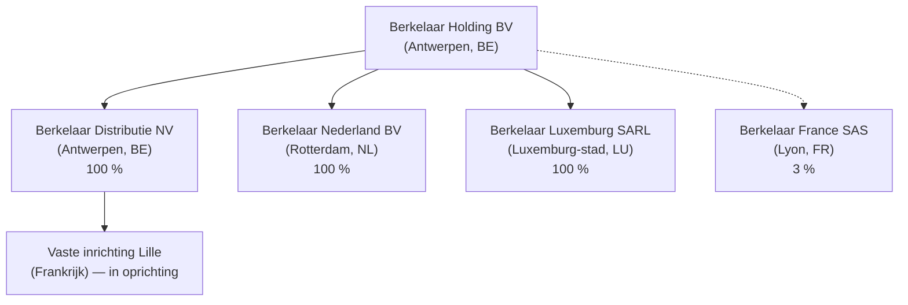

> **Oefening — doe eerst zelf, klap pas open.** Dit zijn vijf scoped deelvragen — examen-stijl — op één gemeenschappelijke cliëntcontext: de familie De Cock, Berkelaar Holding BV met dochters in BE, NL en LU, en een Franse vaste inrichting in oprichting. De vragen zijn onafhankelijk: je hoeft ze niet in volgorde te maken en niet alle context-feiten te gebruiken in elke vraag. Werk elke vraag eerst zelf uit op papier; klap de uitwerking pas open als je vastloopt of klaar bent. Reken op 15-20 minuten per vraag — 90 minuten in totaal. Motivatie: het examen toetst dit type fragment-vragen één voor één; deze oefening laat zien dat de zes leerstukken samen één denkframe vormen. Voor verhaal en routekaart: [[studiemateriaal/2-8|overzicht PO 2.8]].

## Opgave

Henri De Cock (61) is zaakvoerder en samen met zijn echtgenote Léa Dupont 100 % aandeelhouder van Berkelaar Holding BV, een Belgische holding met maatschappelijke zetel en werkelijke leiding in Antwerpen. De groep produceert en verdeelt elektrische tweewielers en heeft drie operationele dochtervennootschappen: Berkelaar Distributie NV (Antwerpen, 100 %), Berkelaar Nederland BV (Rotterdam, 100 %) en Berkelaar Luxemburg SARL (Luxemburg-stad, 100 %). Daarnaast houdt Berkelaar Holding nog een 3 %-deelneming aan in Berkelaar France SAS (Lyon), waarvan de overige 97 % door een Franse co-investeerder wordt gehouden.

De Luxemburgse dochter is een IP- en financieringsvennootschap: ze bezit het merk "Berkelaar" en de technische licenties, en geeft een intra-groep lening van 3,2 mio EUR aan Berkelaar Holding tegen 3,5 % jaarrente. Berkelaar Luxemburg ontvangt jaarlijks 420.000 EUR royalty van Berkelaar Nederland (3,5 % van de Nederlandse omzet van 12 mio EUR) voor gebruik van het merk. De Luxemburgse dochter heeft een gehuurd kantoor in Luxemburg-stad, drie medewerkers (waaronder Maarten De Cock — Henri's zoon — als CFO), en is onderworpen aan de Luxemburgse vennootschapsbelasting (CIT 17 %).

De familie. Henri en Léa wonen in Antwerpen, Belgisch rijksinwoners. Dochter Sophie (35) woont in Lanaken en werkt voor Berkelaar Nederland BV als marketing manager — haar arbeidsovereenkomst voorziet in een salary split: 60 % Nederlands deel (€72.000 — werkdagen in kantoor Maastricht) en 40 % Belgisch deel (€48.000 — thuiswerk in Lanaken). Zoon Maarten (32) is sinds 2024 CFO van Berkelaar Luxemburg, werkt voltijds in Luxemburg-stad, maar woont met zijn gezin in Antwerpen (Belgisch rijksinwoner).

Operationele uitbreiding 2025-2026. Berkelaar Distributie NV opent een atelier en toonzaal in Lille (Frankrijk) voor verkoop en after-sales aan Franse klanten. De verbouwingswerken van het gehuurde pand duurden van 1 april 2025 tot 15 juni 2026 — 14 maanden. Na oplevering wordt het atelier operationeel uitgebaat door 5 personen (4 lokaal Frans + 1 gedetacheerde Belgische teamleader). Verwachte omzet eerste deeljaar 2026: 280.000 EUR; verwachte jaaromzet 2027: 850.000 EUR.

Voorgenomen verrichtingen 2026. (i) Berkelaar Luxemburg keert in 2026 een dividend uit van 650.000 EUR aan Berkelaar Holding (geaccumuleerde winst sinds 2020). (ii) Henri overweegt om de Luxemburgse en Nederlandse dochters onder een nieuwe Cypriotische sub-holding (Berkelaar Cyprus Ltd) te plaatsen — Cyprus CIT 12,5 % + IP-box-regime ca. 2,5 % op kwalificerend royalty-inkomen.

### Groepsstructuur

### Intra-groep stromen 2026

| Stroom | Van | Naar | Bedrag/jaar | Aard |
|---|---|---|---|---|
| Dividend | Berkelaar Luxemburg SARL | Berkelaar Holding BV | 650.000 EUR | Uitkering geaccumuleerde winst |
| Royalty | Berkelaar Nederland BV | Berkelaar Luxemburg SARL | 420.000 EUR | Merk- + technologie-licentie (3,5 % × NL-omzet 12 mio) |
| Intrest | Berkelaar Luxemburg SARL | Berkelaar Holding BV | 112.000 EUR | Rente 3,5 % op lening 3,2 mio EUR |

### Vaste inrichting Lille — feitenset

| Element | Inhoud |
|---|---|
| Locatie | Lille (Hauts-de-France) |
| Type activiteit | Atelier + toonzaal e-bikes + after-sales |
| Huurovereenkomst | 10-jarig handelshuurcontract |
| Verbouwingswerken | 1 april 2025 — 15 juni 2026 (14 maanden) |
| Personeel na oplevering | 5 (4 lokaal Frans + 1 BE-gedetacheerde teamleader) |
| Omzet eerste deeljaar 2026-H2 | 280.000 EUR |
| Verwacht resultaat 2026-H2 | -120.000 EUR (aanloopverlies) |
| Verwacht resultaat 2027 (volledig jaar) | +180.000 EUR |

### Salary split Sophie De Cock — 2026

| Element | Inhoud |
|---|---|
| Werkgever | Berkelaar Nederland BV (Rotterdam) |
| Standplaats Nederlands deel | Kantoor Maastricht — feitelijk ca. 60 % van werkdagen |
| Standplaats Belgisch deel | Thuiswerk Lanaken — feitelijk ca. 40 % van werkdagen |
| Brutobezoldiging Nederlands deel | 72.000 EUR |
| Brutobezoldiging Belgisch deel | 48.000 EUR |
| Totaal brutobezoldiging | 120.000 EUR |
| Aantal kalenderdagen in NL/jaar (schatting) | ca. 220 dagen |
| Bezoldiging betaald door | Berkelaar Nederland BV (NL-werkgever, geen doorbelasting naar BE) |

### Royalty NL→LU — marktbenchmark

| Element | Inhoud |
|---|---|
| Royaltystroom | Berkelaar Nederland BV → Berkelaar Luxemburg SARL |
| Bedrag | 420.000 EUR/jaar |
| Tarief | 3,5 % × omzet Berkelaar Nederland (12 mio EUR) |
| Object | Gebruik merk "Berkelaar" + technische licenties |
| Marktbenchmark vergelijkbare e-bike-merklicenties | 2,0 — 2,5 % van omzet |
| Functionele analyse Berkelaar Luxemburg | Houdt het merk (geboekt €800k, vermoedelijke marktwaarde €4,5M); 3 medewerkers; eigen IP-strategie + jaarlijkse merk-investering 80k |

> De vragen hieronder zijn **onafhankelijk** van elkaar. Filter per vraag zelf welke feiten relevant zijn — niet alle context-elementen spelen in elke vraag. Werk elke vraag eerst zelf uit voor je de oplossing opent. Reken op 15-20 minuten per vraag — 90 minuten in totaal.

---

### Vraag 1 — Sophie's salary split BE-NL (15 min)

Sophie is Belgisch rijksinwoner en werkt voor Berkelaar Nederland BV met de salary split uit de opgave-tabel. Beantwoord drie vragen. (a) Welke staat (BE of NL) mag onder het Belgisch-Nederlandse dubbelbelastingverdrag het Nederlandse deel (€72.000) belasten, en op welke grond? (b) Wat is de techniek waarmee België als woonstaat dubbele belasting vermijdt op het Nederlandse deel? (c) Welk concreet effect heeft dat op de Belgische personenbelasting van Sophie — wordt haar Belgische deel (€48.000) zwaarder, lichter of gelijk belast dan zonder salary split?

Beperk je tot Sophie's loon — geen andere familieleden. Maximaal één pagina antwoord.

<strong>Oplossing — klik om te tonen</strong>

**(a) Welke staat mag heffen.** Het Belgisch-Nederlandse DBV regelt de toewijzing van bezoldigingen uit dienstbetrekking in zijn art. 15. De hoofdregel (§1): bezoldigingen mogen worden belast in de werkstaat — dat is de staat waar de arbeid feitelijk wordt uitgeoefend. §2 voorziet een uitzondering die het heffingsrecht bij wijze van uitzondering aan de woonstaat geeft, op drie cumulatieve voorwaarden: minder dan 183 dagen in de werkstaat in een twaalf-maands-periode, werkgever die geen inwoner is van de werkstaat, en bezoldiging niet ten laste van een vaste inrichting van de werkgever in de werkstaat.

Op Sophie's geval: Berkelaar Nederland BV is **inwoner van Nederland** (de werkstaat van het NL-deel). De tweede voorwaarde van de uitzondering faalt dus al meteen. Bovendien zit Sophie ca. 220 dagen per jaar in Nederland — boven de 183-dagen-grens. De uitzondering valt dubbel weg. Resultaat: de hoofdregel §1 herstelt en **Nederland heft als werkstaat** op het Nederlandse deel van 72.000 EUR. België verliest het primair heffingsrecht op dat deel.

**(b) Hoe vermijdt België dubbele belasting.** Het Belgisch-Nederlandse DBV kent als voorkomingsmethode voor België de vrijstelling met progressievoorbehoud (art. 23A-conforme bepaling, omgezet in WIB92 art. 155). Concrete werking: het Nederlandse deel wordt **vrijgesteld** uit de Belgische belastbare grondslag — Sophie betaalt er in België geen personenbelasting op. Maar dat NL-deel **telt wel mee** voor de bepaling van de tariefschijven op haar overige inkomsten. Aangifte-praktisch: NL-deel aangeven in vak X.B (beroepsinkomsten onder vrijstellingsverdrag); België berekent de PB alsof het volledige inkomen 120.000 EUR was, en past dan een vermindering toe naar verhouding van het vrijgestelde deel.

**(c) Effect op Sophie's Belgische PB.** Hier zit een vaak gemiste nuance. Het Nederlandse deel verdwijnt niet uit het BE-fiscaal beeld — het verhoogt het effectieve marginale tarief dat op het Belgische deel wordt toegepast. Concreet: als haar volledige inkomen 120.000 EUR was, zou ze in de hoogste schijf zitten (50 %). Door progressievoorbehoud blijft die hoogste schijf van toepassing op het Belgische deel van 48.000 EUR — zwaarder dan wanneer haar wereldinkomen slechts 48.000 EUR was geweest (waar gemiddelde schijven ~37-40 % van toepassing zouden zijn). Per saldo: ze is in BE-PB **niet** lichter belast op haar Belgische deel dan zonder salary split — wel dan zonder NL-loon helemaal. De fiscale gunsten van een salary split zitten in het feit dat het Nederlandse deel onder Nederlandse PB-tarieven valt (vaak iets gunstiger qua schaal en niet onderworpen aan Belgische gemeente-opcentiemen + sociale bijdragen-structuur).

Audit-attentiepunt: salary split is fiscaal interessant maar moet **feitelijk** correct zijn. De NL-fiscus en BE-fiscus kunnen samen of apart de werkelijke werkdagen-verdeling toetsen — badge-logs, vergaderkalenders, reiskostenstaten. Pure papieren split wordt aangevochten.

**Sophie's salary split — synthese fiscale behandeling**

| Element | Antwoord |
|---|---|
| Bevoegd voor NL-deel (€72.000) | Nederland — werkstaat (art. 15 §1 DBV BE-NL); uitzondering §2 faalt (werkgever NL-inwoner + > 183 dagen) |
| Bevoegd voor BE-deel (€48.000) | België — werkstaat (thuiswerk Lanaken telt als BE-werkdagen) |
| Voorkomingsmethode in BE op NL-deel | Vrijstelling met progressievoorbehoud (WIB92 art. 155) |
| Effect op BE-PB | BE-deel wordt belast aan tarief alsof wereldinkomen €120.000 → hoger marginaal tarief dan op kale €48.000 |
| Aangifte-praktijk BE | Vak X.B beroepsinkomsten onder vrijstellingsverdrag; bedrag NL-deel apart vermelden |
| Documentatieplicht | Werkelijke dagenverdeling onderbouwen — badge-logs, kalender, reiskostenstaten |

> **Let op.** Drie valkuilen bij salary split. **Eén**: de 183-dagen-uitzondering verkeerd toepassen — alle drie voorwaarden moeten cumulatief vervuld zijn voor de uitzondering werkt. Eén van de drie faalt → hoofdregel werkstaat herstelt. **Twee**: aannemen dat "vrijstelling met progressievoorbehoud" betekent "BE-deel gelijk belast als zonder NL-loon". Fout — het NL-deel verhoogt het marginale tarief op het BE-deel. **Drie**: salary split puur papier laten. Beide fiscussen kunnen de feitelijke verdeling toetsen en de constructie verwerpen.

---

### Vraag 2 — Franse VI Lille: vaste inrichting + recapture (20 min)

Berkelaar Distributie NV opent in 2025-2026 een atelier in Lille. De feiten staan in de opgave-tabel: verbouwingswerken 14 maanden + operationele uitbating door 5 personen na oplevering juni 2026. Verwacht aanloopverlies 2026-H2: -120.000 EUR; verwachte winst 2027: +180.000 EUR.

Beantwoord drie vragen. (a) Heeft Berkelaar Distributie NV een vaste inrichting in Frankrijk vanaf welk moment? Onderscheid de verbouwingsfase van de operationele fase. (b) Hoe wordt het verlies van 2026-H2 (-120.000 EUR) behandeld in de Belgische vennootschapsbelasting van Berkelaar Distributie NV — mag de Belgische grondslag worden verminderd? (c) Wat gebeurt er in 2027 wanneer de VI 180.000 EUR winst maakt — wordt die volledig vrijgesteld in België?

Werk de drie vragen gestructureerd uit. Maximaal 1,5 pagina antwoord.

<strong>Oplossing — klik om te tonen</strong>

**(a) Wanneer ontstaat de VI.** Twee mogelijke gronden onder art. 5 OESO-MV (en gelijkluidend in het Belgisch-Franse DBV).

Eerste grond: **bouwwerf** (art. 5 §3). Een bouw- of installatieproject vormt een VI als de duur **meer dan 12 maanden** bedraagt. Hier: verbouwingswerken van 1 april 2025 tot 15 juni 2026 = **14 maanden**. De drempel wordt overschreden. Klassieke OESO-doctrine: bij overschrijding van de drempel werkt de VI **vanaf dag 1 met terugwerkende kracht** — Berkelaar Distributie heeft dus al vanaf 1 april 2025 een Franse VI in de zin van de bouwwerf-paragraaf.

Tweede grond: **vaste bedrijfsruimte** (art. 5 §1 + §2). Vanaf de oplevering op 15 juni 2026 is het atelier + toonzaal een vaste bedrijfsruimte door middel waarvan de onderneming activiteit uitoefent — een klassieke VI categorie 1, los van de bouwwerf-toets. Vanaf dat moment is er dus een VI om twee onafhankelijke redenen tegelijk.

Praktisch: vanaf 1 april 2025 al een Franse VI, die in de aanloopfase verbouwingsuitgaven draagt en geen omzet genereert (eventueel negatieve fiscale resultaten). Vanaf 15 juni 2026 is dezelfde VI operationeel.

**(b) Verlies 2026-H2 in de BE-Ven.B.** Berkelaar Distributie NV is een Belgisch inwoner — onderworpen aan Belgische Ven.B op haar wereldwijde winst. Onder het Belgisch-Franse DBV gebruikt België als woonstaat de vrijstellings­methode op winst toerekenbaar aan een Franse VI (art. 23 DBV BE-FR). Dat zou normaliter betekenen: de Franse VI-resultaten worden vrijgesteld — winst niet belast in België, en daarmee zou je verwachten dat verliezen ook niet aftrekbaar zijn in België.

Maar WIB92 art. 206/4 doorbreekt die symmetrie: de Belgische vennootschap mag een VI-verlies in een DBV-land **wel** aftrekken van haar Belgische grondslag, ondanks de vrijstellingsmethode. Pedagogisch: anders zou het aanloopverlies in niemands grondslag worden gedragen — economisch onlogisch. Voor 2026: Berkelaar Distributie mag haar Belgische belastbare grondslag verminderen met de 120.000 EUR Frans VI-verlies.

Aandacht: deze regel werkt onder de strikte voorwaarde van fiscale rechtspersoonlijkheid van de VI (geen aparte juridische dochter — wel onderdeel van Berkelaar Distributie NV zelf) en de aanwezigheid van een DBV met vrijstellingsmethode.

**(c) Winst 2027 — recapture.** Hier komt de tegenhanger van de aftrek uit (b). Wanneer de Franse VI in 2027 winst maakt, treedt **art. 206/4 WIB92 als recapture-regel** in werking. De winst van de VI — die normaal onder DBV zou worden vrijgesteld — wordt bij de Belgische belastbare grondslag gevoegd **tot beloop van het eerder afgetrokken verlies**. In Berkelaar Distributie's geval: 120.000 EUR van de 180.000 EUR Franse VI-winst van 2027 wordt teruggevoegd aan de Belgische grondslag. De resterende 60.000 EUR blijft vrijgesteld onder de gewone DBV-vrijstelling.

Effect over de twee jaar: economisch is de behandeling neutraal — wat in 2026 werd afgetrokken (-120k) wordt in 2027 grotendeels weer bijgevoegd (+120k). De vrijstellingsmethode bijt enkel in op het netto-overschot. Maar **timing**: in 2026 levert het Frans-VI-verlies een onmiddellijk Belgisch fiscaal voordeel; in 2027 betaalt de vennootschap dat voordeel deels terug.

Boekhoudkundige attentie: Berkelaar Distributie's wereldwijde winst 2027 is hoger dan haar BE-belastbare grondslag verwacht. Een boekhoudkundig resultaat van bv. 800.000 EUR wereldwijd (BE 620 + FR-VI 180) levert na recapture een BE-belastbare grondslag van 740.000 EUR (620 + 120 recapture; de overige 60k blijft vrijgesteld). Het verschil wereldwinst-grondslag is geen fout maar de toepassing van de recapture-regel.

**Franse VI Lille — drie-stappen-analyse**

| Vraag | Antwoord |
|---|---|
| (a) VI vanaf wanneer? | **Vanaf 1 april 2025** — bouwwerf 14 mnd > 12 mnd OESO-drempel met terugwerkende kracht; vanaf 15 juni 2026 ook als vaste bedrijfsruimte |
| (b) Verlies 2026-H2 in BE-Ven.B | **Aftrekbaar** op BE-grondslag dankzij WIB92 art. 206/4 (uitzondering op vrijstellingsmethode) |
| (c) Winst 2027 in BE-Ven.B | **Recapture** — €120k bij BE-grondslag tot beloop afgetrokken verlies; resterende €60k vrijgesteld |

**Werkvoorbeeld Berkelaar Distributie — twee jaar**

| Jaar | BE-resultaat | FR-VI-resultaat | Recapture / aftrek | BE-belastbare grondslag |
|---|---:|---:|---|---:|
| 2026 | +800.000 | -120.000 | Aftrek verlies VI op BE-grondslag | **680.000** |
| 2027 (geprojecteerd) | +620.000 | +180.000 | Recapture €120k bij BE-grondslag; €60k vrijgesteld | **740.000** |

> **Let op.** Drie valkuilen bij vaste inrichting + recapture. **Eén**: de bouwwerf-drempel pro rata interpreteren. 14 maanden ≠ "2 maanden teveel pro rata". Boven 12 maanden = VI vanaf dag 1 met terugwerkende kracht. **Twee**: aannemen dat vrijstellingsmethode betekent "verlies niet aftrekbaar in BE". WIB92 art. 206/4 doorbreekt die symmetrie expliciet voor VI-verliezen. **Drie**: de recapture-regel vergeten bij toekomstige winst. Boekhoudkundige wereldwinst ≠ BE-belastbare grondslag — wie dat verwart, krijgt verrassingen bij belastingaangifte.

---

### Vraag 3 — LU-dividend onder moeder-dochterrichtlijn + DBI (15 min)

Berkelaar Luxemburg SARL keert in 2026 een dividend van 650.000 EUR uit aan Berkelaar Holding BV. Beantwoord drie vragen. (a) Mag Luxemburg bronheffing inhouden op deze uitkering — toets de drie cumulatieve voorwaarden van de relevante EU-richtlijn op de Berkelaar-feiten. (b) Hoe behandelt België als woonstaat het ontvangen dividend — welke Belgische techniek werkt parallel met de richtlijn? (c) Welke anti-misbruik-toets moet doorstaan worden om de richtlijn-vrijstelling te behouden, en is die in deze case gehaald?

Maximaal één pagina antwoord.

<strong>Oplossing — klik om te tonen</strong>

**(a) Toets aan de moeder-dochterrichtlijn (2011/96/EU).** Drie cumulatieve voorwaarden art. 3:

**Voorwaarde 1 — deelnemingsdrempel.** De moeder moet minstens 10 % van het kapitaal van de dochter aanhouden. Berkelaar Holding BV bezit 100 % van Berkelaar Luxemburg SARL → ruim boven 10 % → **voldaan**.

**Voorwaarde 2 — houdperiode.** De deelneming moet minstens 1 jaar ononderbroken zijn aangehouden. Berkelaar Holding bezit Berkelaar Luxemburg sinds de oprichting van de groep — de uitkering van 2026 betreft geaccumuleerde winst sinds 2020 → houdperiode minstens 5 jaar → **voldaan**.

**Voorwaarde 3 — rechtsvorm + Ven.B-onderworpenheid.** Beide vennootschappen moeten in bijlage I deel A van de richtlijn staan (rechtsvorm) en onderworpen zijn aan een vennootschapsbelasting uit bijlage I deel B. BV (Belgisch recht) en SARL (Luxemburgs recht) staan beide in bijlage I deel A. Berkelaar Holding is onderworpen aan Belgische Ven.B; Berkelaar Luxemburg is onderworpen aan Luxemburgse CIT (17 %) — staat in bijlage I deel B → **voldaan**.

Drie voorwaarden alle gehaald → Luxemburg **mag geen bronheffing inhouden** op het dividend. Het Belgisch-Luxemburgse DBV (art. 10) zou een verlaagd bronheffingstarief voorzien (typisch 5 % bij ≥25 %-deelneming) — maar de richtlijn primeert hierop met 0 %.

**(b) België als woonstaat — DBI-aftrek.** Belgisch parallel-instrument: art. 202-205quater WIB92 (definitief belaste inkomsten). Berkelaar Holding mag het ontvangen dividend van 650.000 EUR voor 100 % uit haar Belgische Ven.B-grondslag aftrekken, mits drie cumulatieve voorwaarden:

(i) **Deelnemingsdrempel** — minstens 10 % OF aanschaffingswaarde ≥ €2,5 mio. Hier: 100 % deelneming → ruim voldaan.

(ii) **Houdperiode** — minstens 1 jaar ononderbroken. Voldaan (zie a).

(iii) **Taxatievoorwaarde** — de uitkerende vennootschap moet onderworpen zijn aan een belasting gelijkaardig aan de Belgische Ven.B; geen tax-haven-regime, geen vrijstellings­regime. Luxemburgse CIT 17 % is een normale Ven.B vergelijkbaar met de Belgische — **voldaan**.

Praktisch effect: Berkelaar Holding ontvangt 650.000 EUR dividend, dat wordt eerst aan de winst toegevoegd, en daarna voor 100 % via DBI-aftrek uit de belastbare grondslag verwijderd. Netto Belgische Ven.B-impact: 0 EUR (op het dividend zelf — voor de rest van de winst van Berkelaar Holding gelden gewoon Ven.B-tarieven).

Belangrijke nuance: MDR en DBI hebben **verschillende voorwaarden**. MDR vereist 10 %-deelneming zonder taxatievoorwaarde; DBI vereist 10 %-of-€2,5M PLUS taxatievoorwaarde. Een vennootschap kan onder MDR vallen (0 % bronheffing) en toch DBI-aftrek verliezen als de uitkerende vennootschap in een tax-haven-regime zit. In Berkelaar's geval: beide voorwaarden gehaald, beide werken parallel.

**(c) Anti-misbruik — Principal Purpose Test.** Sinds de wijziging van de moeder-dochterrichtlijn in 2015 + MLI: vrijstelling moet geweigerd worden als de structuur "kunstmatig" is — wanneer een van de hoofddoelen van de regeling het verkrijgen van het richtlijn-voordeel is, zonder dat de structuur economische realiteit weergeeft. Belgische omzetting via WIB92 art. 203 + de algemene anti-misbruik-bepaling art. 344 §1.

Toets op Berkelaar Luxemburg SARL — substance-toets in praktijk. Heeft de Luxemburgse dochter echte substance? (i) Eigen kantoorruimte in Luxemburg-stad — gehuurd, niet brievenbus → **substance**. (ii) 3 medewerkers (waaronder Maarten als CFO) — eigen directie, eigen werknemers → **substance**. (iii) Operationele activa: bezit het merk "Berkelaar" (geboekte waarde €800k, vermoedelijke marktwaarde €4,5M) + concernfinanciering → **substance + economische realiteit**. (iv) Eigen winst — 420.000 EUR royalty + 112.000 EUR rente → **eigen activiteit**, niet alleen winstdoorgeleiding.

Conclusie: Berkelaar Luxemburg is geen brievenbus-vennootschap. De PPT-toets doorstaat → moeder-dochterrichtlijn blijft van toepassing → 0 % bronheffing LU + DBI-aftrek in BE.

**LU→BE dividend — toetsing per laag**

| Laag | Voorwaarde | Status Berkelaar |
|---|---|---|
| Moeder-dochterrichtlijn 2011/96 | Deelneming ≥ 10 % | 100 % — ✅ |
| Moeder-dochterrichtlijn 2011/96 | Houdperiode ≥ 1 jaar | ≥ 5 jaar — ✅ |
| Moeder-dochterrichtlijn 2011/96 | Rechtsvorm bijlage I + Ven.B bijlage I | BV + SARL beide in bijlage; BE-Ven.B + LU-CIT 17 % — ✅ |
| **Effect MDR** | Bronheffing in LU | **0 %** |
| DBI WIB92 art. 202-205quater | Drempel 10 % of €2,5M aanschaffing | 100 % — ✅ |
| DBI WIB92 art. 202-205quater | Houdperiode 1 jaar | ✅ |
| DBI WIB92 art. 202-205quater | Taxatievoorwaarde (geen tax-haven) | LU CIT 17 % — ✅ |
| **Effect DBI** | Aftrek dividend uit BE-Ven.B-grondslag | **100 % aftrek — €650k uit grondslag** |
| **Anti-misbruik PPT** | Substance + economische realiteit Berkelaar Luxemburg | Kantoor + 3 medewerkers + merk + eigen activiteit — ✅ |

> **Let op.** Drie valkuilen bij dividend onder MDR + DBI. **Eén**: aannemen dat MDR-vrijstelling automatisch DBI-vrijstelling betekent. De twee hebben **verschillende voorwaarden** — een tax-haven-dochter kan MDR halen (0 % bronheffing) maar DBI verliezen (taxatievoorwaarde-faal). **Twee**: PPT/substance-toets vergeten. Een lege brievenbus-LU-entiteit zou MDR + DBI verliezen ondanks formeel voldoen aan deelnemings­drempel. **Drie**: drempels verwisselen. MDR = 10 %; IRR (relevant voor intresten + royalty's, niet dividenden) = 25 %.

---

### Vraag 4 — Transfer-pricing-correctie op NL→LU royalty (20 min)

De Nederlandse fiscus voert in 2026 een audit uit op Berkelaar Nederland BV en betwist de royalty van 420.000 EUR aan Berkelaar Luxemburg SARL als te hoog. Vergelijkbare merklicenties tussen onafhankelijke e-bike-merken liggen volgens de NL-fiscus tussen 2,0 % en 2,5 % van omzet — de Nederlandse fiscus wil corrigeren naar 2,5 % × 12 mio EUR = 300.000 EUR royalty. Het excess van 120.000 EUR wordt door de NL-fiscus geherkwalificeerd als verdoken winstuitkering.

Beantwoord drie vragen. (a) Op welke rechtsregel steunt deze NL-fiscus-correctie? Wat is de Belgische pendant van diezelfde regel? (b) Wat is het gevolg voor Berkelaar Luxemburg SARL — moet zij haar Luxemburgse aangifte aanpassen voor het excess van 120.000 EUR? Welk procedureel mechanisme moet daarvoor worden geactiveerd? (c) Wat is de mogelijke uitkomst als de Luxemburgse fiscus weigert mee te corrigeren — en welk rechtsmiddel is dan het meest aangewezen?

<strong>Oplossing — klik om te tonen</strong>

**(a) Rechtsgrond Nederlandse correctie.** Het armslengte-beginsel — internationaal verankerd in art. 9 §1 OESO-modelverdrag (Associated Enterprises). Verbonden ondernemingen worden geacht onderling marktconforme prijzen te hanteren; bij afwijking mag de fiscus de aangegeven prijzen aanpassen tot het arm's length-bedrag. De OESO Transfer Pricing Guidelines geven vijf vergelijkingsmethoden (CUP, Resale Price, Cost Plus, TNMM, Profit Split); voor merklicenties is een CUP-benadering (vergelijking met onafhankelijke licenties op de markt) klassiek.

Nederlandse omzetting: art. 8b Wet Vpb 1969. Belgische pendant: art. 185 §2 WIB92 (transfer-pricing-correctie) + art. 26 WIB92 (abnormale of goedgunstige voordelen). Beide steunen op hetzelfde armslengte-beginsel — de regels zijn parallel.

Voor het specifieke geval van royalty's biedt art. 12 §4 OESO-MV een aanvullende clausule (de "special relationship"-bepaling): bij verbonden ondernemingen waardoor de royalty hoger is dan armslengte, gelden de verdragsvoordelen — zoals de interest-royalty-richtlijn-vrijstelling van bronheffing — **enkel op het normale (armslengte) bedrag**. Het excess valt onder nationaal recht van elke verdragsstaat.

**(b) Gevolg voor Berkelaar Luxemburg.** In principe — en het is hier dat de complicatie zit — moet Luxemburg een **corresponderende correctie** aanbrengen op haar belastbare grondslag. Mechaniek (art. 9 §2 OESO-MV + art. 7 §3): wanneer Nederland de royalty van Berkelaar Nederland naar 300.000 EUR corrigeert (en dus 120.000 EUR extra winst belast in NL), zou Luxemburg in symmetrische logica haar belastbare grondslag bij Berkelaar Luxemburg met 120.000 EUR moeten verminderen — want diezelfde 120.000 EUR werd eerst belast als royalty bij Berkelaar Luxemburg en zou nu opnieuw als verdoken winst in Nederland worden belast. Zonder corresponderende correctie ontstaat **economisch dubbele belasting** op het excess.

Maar: art. 9 §2 schept een verplichting voor de andere staat, geen automatisme. In de praktijk weigert de Luxemburgse fiscus vaak een corresponderende correctie zolang de eigen aanslag al definitief is. Het Luxemburgse bedrijf moet dan zelf het initiatief nemen via de procedure-route — en dat brengt ons bij vraag (c).

**(c) Rechtsmiddel bij weigerende LU-fiscus — MAP-procedure.** Het meest aangewezen instrument is de **Mutual Agreement Procedure** onder art. 25 OESO-MV (en gelijkluidend in het Nederlands-Luxemburgse DBV). Indiening: bevoegde autoriteit van een van beide staten — voor Berkelaar Luxemburg vermoedelijk de Luxemburgse Direction des Contributions Directes. Termijn: 3 jaar vanaf de eerste kennisgeving van de Nederlandse correctie.

MAP werkt via onderling overleg tussen de twee bevoegde autoriteiten. Geen bindende uitkomst sinds basis-art. 25, maar **sinds MLI** is er voor verdragspartners die voor arbitrage gekozen hebben (NL en LU beiden) een verplichte arbitrage als er na 2 jaar geen akkoord is. Praktische duur: gemiddeld 1-3 jaar.

Alternatief sterker: voor verrekenprijs-geschillen tussen EU-staten bestaat sinds 2017 de EU-arbitrage-richtlijn (omgezet in beide landen). Termijn strakker (6 mnd ontvankelijkheid + 2 jaar onderhandeling + arbitrage); en — cruciaal — de **belastingplichtige heeft een procedureel recht op informatie**, anders dan in klassieke MAP.

Niet aanbevolen: enkel een Luxemburgse bezwaarprocedure tegen de eigen aanslag. Die lost het probleem op één kant op (LU-correctie) maar zonder coördinatie met Nederland kan dezelfde transactie alsnog dubbel belast blijven.

Synthese-advies aan Berkelaar Luxemburg: (i) MAP of EU-arbitrage opstarten zodra de Nederlandse correctie definitief is; (ii) tijdens de procedure: TP-documentatie verfijnen (local file + master file zelfs onder Belgische drempels) — substance + functionele analyse + marktbenchmark; (iii) overweeg een pre-emptive bilaterale APA (Advance Pricing Agreement) voor toekomstige jaren om herhaling te voorkomen.

**TP-correctie NL→LU royalty — drie-stappen-analyse**

| Vraag | Antwoord |
|---|---|
| (a) Rechtsgrond NL-correctie | Art. 9 §1 OESO-MV armslengte; NL omzetting art. 8b Wet Vpb; BE-pendant WIB92 art. 185 §2 + art. 26 |
| (b) Effect bij Berkelaar Luxemburg | Corresponderende correctie 120.000 EUR (art. 9 §2 OESO-MV) — geen automatisme, vereist actie |
| (c) Rechtsmiddel bij LU-weigering | MAP art. 25 OESO-MV (3 jr termijn) of EU-arbitrage Richtlijn 2017/1852 (strakker, recht op informatie) |

**Werkvoorbeeld — economisch effect zonder corresponderende correctie**

| Locatie | Behandeling 120k excess | Belastingdruk excess |
|---|---|---|
| Nederland (correctie) | Niet meer aftrekbaar als royalty bij Berkelaar Nederland — herkwalificatie als winst | NL Vpb 25,8 % × 120k = ~30.960 EUR extra |
| Luxemburg (geen correctie) | Reeds aangegeven als royalty-inkomen bij Berkelaar Luxemburg | LU CIT 17 % × 120k = ~20.400 EUR (al betaald) |
| **Totaal economisch dubbel belast** | 120k onder twee Ven.B-regimes belast | **~51.360 EUR op €120k = effectief ~43 % tarief** |

> **Let op.** Drie valkuilen bij transfer-pricing-correctie. **Eén**: aannemen dat een correctie in staat A automatisch een correctie in staat B uitlokt. Corresponderende correctie is een verplichting onder art. 9 §2 maar geen automatisme — vraagt initiatief van de belastingplichtige. **Twee**: kiezen voor enkel een Luxemburgse bezwaarprocedure. Die lost het probleem maar half op — coördinatie tussen staten vraagt MAP of EU-arbitrage. **Drie**: TP-documentatie pas opbouwen na een correctie. De fiscus toetst de feitelijke functionele analyse + benchmark — die moet vooraf gedocumenteerd zijn.

---

### Vraag 5 — Cypriotische sub-holding: geïntegreerd advies (20 min)

Henri overweegt om Berkelaar Luxemburg en Berkelaar Nederland onder een nieuwe Cypriotische sub-holding (Berkelaar Cyprus Ltd) te plaatsen, met Berkelaar Holding BV als enige aandeelhouder van Cyprus Ltd. Motief: Cypriotische CIT 12,5 % + IP-box-regime ca. 2,5 % op kwalificerend royalty-inkomen + participation-exemption op dividenden.

Geef een gestructureerd advies in vier delen. (a) De inbreng zelf — overdracht van LU-aandelen en NL-aandelen naar de Cypriotische sub-holding tegen nieuwe aandelen. Welke fiscale-neutraliteits-regeling kan helpen om onmiddellijke belasting bij Berkelaar Holding te vermijden? Welke voorwaarden gelden? (b) De toekomstige dividendstroom Cyprus → Berkelaar Holding BV — welke EU-richtlijn en welke Belgische techniek zijn van toepassing? (c) Welke anti-misbruik-instrumenten kunnen de structuur ondermijnen, en op welke voorwaarden valt of staat de fiscale optimalisatie? (d) Wat is je conclusie — aanbevelen of niet?

<strong>Oplossing — klik om te tonen</strong>

**(a) Inbreng — fusierichtlijn 2009/133/EG art. 8 (aandelenruil).** Berkelaar Holding zou haar LU- en NL-aandelen inbrengen in Berkelaar Cyprus Ltd tegen uitgifte van nieuwe Cypriotische aandelen. Onder klassiek Belgisch recht zou de meerwaarde tussen boekwaarde en werkelijke waarde van de ingebrachte aandelen onmiddellijk belastbaar zijn (potentieel grote latente meerwaarde). De fusierichtlijn 2009/133 biedt een uitwijkroute: art. 8 (aandelenruil) staat **fiscale neutraliteit** toe — de meerwaarde wordt niet onmiddellijk gerealiseerd, maar de Belgische fiscus "volgt" de aandelen op de Cypriotische opvolger met de oorspronkelijke aanschaffingswaarde.

Drie cumulatieve voorwaarden art. 3 fusierichtlijn: (i) rechtsvorm uit bijlage I deel A — BV (Belgisch) en Cyprus Ltd staan beide in de lijst → **voldaan**; (ii) fiscale woonplaats in EU — Berkelaar Holding in BE, Berkelaar Cyprus in CY → **voldaan**; (iii) onderworpen aan Ven.B uit bijlage I deel B — Belgische Ven.B en Cypriotische CIT 12,5 % beide vermeld → **voldaan**. Belgische omzetting via WIB92 art. 45 §1.

Effect: geen onmiddellijke afrekening op de meerwaarde van Berkelaar Holding op de ingebrachte LU- en NL-aandelen. De latente meerwaarde wordt uitgesteld tot een latere realisatie (verkoop Cypriotische aandelen).

**(b) Toekomstige dividendstroom Cyprus → Berkelaar Holding.** Identiek aan de LU-route in vraag 3, maar met andere getallen. Toets aan moeder-dochterrichtlijn 2011/96: (i) deelneming ≥ 10 % — 100 % → ✅; (ii) houdperiode ≥ 1 jaar — vanaf inbreng → ✅ (na 1 jaar); (iii) rechtsvorm + Ven.B-onderworpenheid — BV + Cyprus Ltd beide bijlage I A; Belgische Ven.B + Cypriotische CIT 12,5 % beide bijlage I B → ✅. **MDR van toepassing → 0 % bronheffing in Cyprus**.

Belgische techniek: DBI-aftrek art. 202-205quater. Cypriotische CIT 12,5 % — onder Belgische taxatievoorwaarde-leer **op het randje**. De Belgische administratie aanvaardt typisch Cypriotische standaard-CIT van 12,5 % nog als gelijkaardig aan een "normale Ven.B". Maar als Berkelaar Cyprus profiteert van het IP-box-regime (effectief tarief ca. 2,5 % op kwalificerend royalty-inkomen), kan dat als "aanmerkelijk gunstiger fiscaal regime" worden beschouwd → DBI-uitsluiting onder art. 203 WIB92 of de KB-lijst van uitgesloten regimes.

Praktisch: zelfs als MDR werkt (0 % bronheffing CY), kan DBI in BE falen op de taxatievoorwaarde. Gevolg: Berkelaar Holding zou het dividend uit Berkelaar Cyprus volledig belast krijgen aan Belgische Ven.B (25 %). Verwachte fiscale voordeel van de structuur valt dan grotendeels weg.

**(c) Anti-misbruik — drie parallelle instrumenten.**

**PPT in moeder-dochterrichtlijn** (art. 1 §2-3, sinds 2015) + **PPT in MLI** (van toepassing op DBV BE-CY). Toets: is een van de hoofddoelen van de oprichting van Berkelaar Cyprus het verkrijgen van richtlijn-voordelen, zonder economische realiteit? Substance-vereisten: echte directie in Cyprus (geen brievenbus + geen "rented director"-constructie), eigen kantoorruimte, eigen werknemers, eigen besluitvorming. Voor een nieuwe sub-holding die alleen aandelen houdt is dit een **hoog hindernis**.

**ATAD CFC-regime** (art. 7-8 + Belgische omzetting WIB92 art. 185/2-3). Toepasselijk wanneer een laagbelaste buitenlandse dochter alleen passieve inkomsten heeft. Cypriotische CIT 12,5 % < 50 % van Belgische 25 % → CFC-vraag actief. Als Berkelaar Cyprus alleen royalty-inkomsten + dividend-doorstromen heeft (passieve activiteiten), worden die winsten **toegerekend aan Berkelaar Holding alsof het BE-winst was** → CFC-belasting in BE op de Cypriotische winst. Uitzondering: "genuine economic activity" — als Berkelaar Cyprus echt operationeel actief is (geen brievenbus), geen CFC.

**ATAD GAAR** (art. 6 + Belgische art. 344 §1). Algemene anti-misbruik: niet-authentieke regelingen die louter fiscaal gemotiveerd zijn worden genegeerd. Bij Berkelaar Cyprus: heeft de structuur **andere** redenen dan fiscale besparing? Eventuele commerciële motieven: toegang tot Cypriotische schippers-network, IP-bescherming, lager personeelskost. Zonder commerciële onderbouwing — louter fiscaal motief — riskeert GAAR-aanval.

**DAC6-melding** (Richtlijn 2018/822 + BE wet 20 dec 2019). Cross-border arrangement met fiscale optimalisatie-kenmerken (hallmark E.3 — overdracht moeilijk waardeerbare immateriële activa) → meldingsplicht binnen 30 dagen na implementatie.

**(d) Conclusie.** Theoretisch fiscaal voordeel ca. 80-150k EUR/jaar (Cypriotische CIT + IP-box vs LU-CIT 17 %). Implementatiekosten ca. 50-80k EUR + jaarlijkse compliance + DAC6-meldingsplicht. **Netto-rendement bij geslaagde opzet: 30-100k EUR/jaar**.

**Maar drie risico's wegen zwaar.** (i) Substance-test: vraagt echte Cypriotische directie + lokaal personeel + operationele activiteit — niet een lege brievenbus. (ii) DBI-taxatievoorwaarde bij IP-box-gebruik: kan structuur ondergraven (verwacht voordeel valt weg in BE-ven.B). (iii) GAAR + CFC: als geen "genuine economic activity", riskeert volledige terugschroef + boete + reputatieschade.

**Advies aan Henri**: **niet aanbevolen zonder ruling-aanvraag bij DVB BE vooraf**. Het potentiële voordeel is significant maar de risico's zijn structureel — substance-investeringen lopen typisch in dezelfde grootteorde als het voordeel, en GAAR-aanval kan het hele rendement vernietigen. Indien Henri toch wil: (a) doe DVB-ruling vooraf voor zekerheid op DBI + GAAR; (b) bouw echte Cypriotische substance (kantoor + 2-3 medewerkers + operationele activiteit, niet alleen vermogensbeheer); (c) documenteer commerciële motieven naast fiscale; (d) zorg voor DAC6-melding binnen termijn.

**Cypriotische sub-holding — geïntegreerd advies**

| Element | Beoordeling |
|---|---|
| (a) Inbreng LU+NL-aandelen | Fusierichtlijn 2009/133 art. 8 — drie voorwaarden voldaan → fiscale neutraliteit (uitstel meerwaarde) |
| (b) Dividend CY→BE — MDR | 0 % bronheffing in CY (drie voorwaarden voldaan) |
| (b) Dividend CY→BE — DBI in BE | **Op het randje** — Cypriotische CIT 12,5 % standaard OK; IP-box-regime kan DBI uitsluiten via taxatievoorwaarde |
| (c) PPT (MDR + MLI) | Substance-test — vereist echte Cypriotische directie + personeel + operationele activiteit |
| (c) ATAD CFC | CY 12,5 % < 50 % BE 25 % → CFC-vraag; uitzondering "genuine economic activity" moet onderbouwd |
| (c) ATAD GAAR + art. 344 | Vereist commerciële motieven naast fiscale; structurele invulling vereist |
| (c) DAC6 | Meldingsplicht binnen 30 dagen na implementatie (hallmark E.3) |
| (d) Conclusie | **Niet aanbevolen zonder DVB-ruling vooraf**; bij doorgaan: substance + commerciële motieven + DAC6-discipline |

> **Let op.** Drie valkuilen bij geïntegreerd advies op holding-optimalisatie. **Eén**: het fiscaal voordeel berekenen zonder substance-kosten in rekening te brengen. Echte substance vraagt jaarlijkse kosten in dezelfde grootteorde als het belastingvoordeel. **Twee**: aannemen dat MDR-vrijstelling automatisch DBI-aftrek meeneemt. De taxatievoorwaarde kan onder IP-box-regime een structuur ondergraven die formeel MDR-conform is. **Drie**: anti-misbruik onderschatten. PPT + CFC + GAAR zijn parallelle instrumenten — elke vorm van substance-faal kan een van de drie activeren.

---

## Afsluiting

Wat heb je nu één keer zelf doorlopen: vijf scoped vragen die samen de zes leerstukken van PO 2.8 activeren. DBV-toewijzing op een salary split, vaste inrichting + recapture op een outbound-VI, moeder-dochterrichtlijn + DBI op een intra-groep dividend, transfer-pricing-correctie met corresponderende correctie + MAP, en geïntegreerd advies op een Cypriotische sub-holding waar drie anti-misbruik-instrumenten parallel werken.

Het examen zal nooit één dossier zoals dit volledig uitvragen — wel fragmenten ("welke staat heft op het Nederlandse deel?", "is er een vaste inrichting bij een bouwwerf van 14 maanden?", "past de moeder-dochterrichtlijn op 3 % deelneming?"). Die fragmenten landen scherper als je het hele dossier één keer hebt afgewerkt. De vijf vragen tonen ook dat de zes leerstukken **één denkframe** vormen: feiten → kwalificatie → DBV → richtlijn → anti-misbruik → advies.

**Doelstellingen gedekt**

- 2.8.taak.1 — Begeleiding bij oprichting: structurele afweging Cypriotische sub-holding met fiscaal-juridische integratie
- 2.8.taak.2 — Overdracht of ontbinding: aandelenruil onder fusierichtlijn met fiscale neutraliteit
- 2.8.taak.3 — Allround advies: DBV-toewijzing, EU-richtlijnen en intern recht samen toepassen
- 2.8.taak.4 — Compliance: BNI-aspecten Franse VI, DAC6-meldingsplicht, TP-documentatie
- 2.8.taak.5 — Vertegenwoordigen: MAP-procedure als rechtsmiddel bij verrekenprijs-conflicten

**Valkuilen geoefend**

- 183-dagen-uitzondering verkeerd toepassen — alle drie voorwaarden moeten cumulatief vervuld zijn
- Aannemen dat vrijstelling met progressievoorbehoud betekent "BE-deel gelijk belast als zonder NL-loon"
- Bouwwerf-drempel pro rata interpreteren in plaats van als absolute drempel
- Aannemen dat vrijstellingsmethode betekent dat VI-verlies niet aftrekbaar is in BE
- Recapture-regel art. 206/4 vergeten bij toekomstige VI-winst
- MDR-vrijstelling en DBI-aftrek automatisch parallel veronderstellen
- Drempels van moeder-dochter (10 %) en interest-royalty (25 %) verwisselen
- Corresponderende correctie als automatisme veronderstellen in plaats van als initiatief-gebaseerde verplichting
- Anti-misbruik-instrumenten (PPT, CFC, GAAR) onderschatten bij offshore-structuren
- Substance-kosten niet in rekening brengen bij berekening fiscaal voordeel holding-optimalisatie

---

## Wanneer dit zit, ga dan naar

- [[wat-is-internationaal-fiscaal-recht]] — voor het kader achter alle vragen: drie lagen voorkoming dubbele belasting
- [[dbv-werking-en-toewijzingsregels]] — voor de vier-stappen-denkbeweging die vraag 1 oefent (DBV-toewijzing arbeid)
- [[vaste-inrichting-en-belasting-niet-inwoners]] — voor de VI-drempel + recapture-mechaniek die vraag 2 oefent
- [[europese-richtlijnen-en-bronheffing]] — voor moeder-dochterrichtlijn + DBI + fusierichtlijn die vragen 3 en 5 oefenen
- [[transfer-pricing-beps-en-anti-misbruik]] — voor armslengte + corresponderende correctie + ATAD-vijfluik die vragen 4 en 5 oefenen
- [[geintegreerd-internationaal-advies]] — voor de vijf-stappen-methodiek + MAP-procedure achter vraag 5
- [[studiemateriaal/2-8/voorbeeldexamenvragen|Voorbeeldexamenvragen PO 2.8]] — om de fragment-vorm te herkennen

---

## Wettelijk fundament

- Toewijzing arbeid onder DBV — werkstaat hoofdregel + 183-dagen-uitzondering: art. 15 OESO-MV §1 + §2; DBV BE-NL 2001 art. 15.
- Vrijstelling met progressievoorbehoud — Belgische omzetting art. 23A DBV: WIB92 art. 155.
- Vaste inrichting — bouwwerf-drempel: art. 5 §3 OESO-MV; DBV BE-FR 1964 art. 5.
- Recapture-regel buitenlandse VI-verliezen: WIB92 art. 206/4.
- Moeder-dochterrichtlijn: Richtlijn 2011/96/EU art. 3 (drempel 10 %) + art. 5 (vrijstelling bronheffing) + art. 1 §2-3 (anti-misbruik).
- DBI-aftrek Belgisch: WIB92 art. 202-205quater.
- Fusierichtlijn — aandelenruil: Richtlijn 2009/133/EG art. 8 (aandelenruil) + art. 3 (drie cumulatieve voorwaarden); BE-omzetting WIB92 art. 45 §1.
- Armslengte-beginsel: art. 9 §1 OESO-MV + OESO TP Guidelines; BE-omzetting WIB92 art. 185 §2 + art. 26.
- Corresponderende correctie: art. 9 §2 OESO-MV + art. 7 §3 (VI).
- ATAD CFC + GAAR — Belgische omzetting: Richtlijn 2016/1164 art. 6 + 7-8; BE-omzetting WIB92 art. 185/2-3 + art. 344 §1.
- MAP-procedure: art. 25 OESO-MV + MLI art. 16-26 (arbitrage).
- EU-arbitrage — verrekenprijs-geschillen: Richtlijn 2017/1852/EU (omgezet in BE wet 2 mei 2019).
- DAC6 — meldingsplicht cross-border arrangements: Richtlijn 2018/822/EU (omgezet in BE wet 20 dec 2019).

---

*Oefening PO 2.8. Status: nieuw — multi-case-dossier op één cliëntcontext met vijf scoped deelvragen. Conform schema in data/oefeningen/SCHEMA.md (POC v0.1).*
